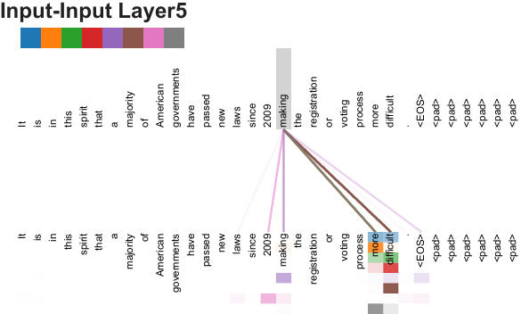
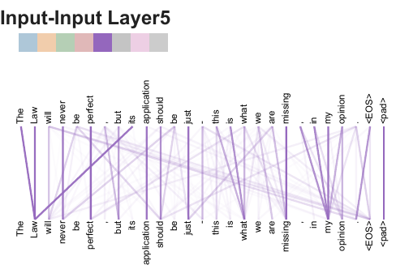
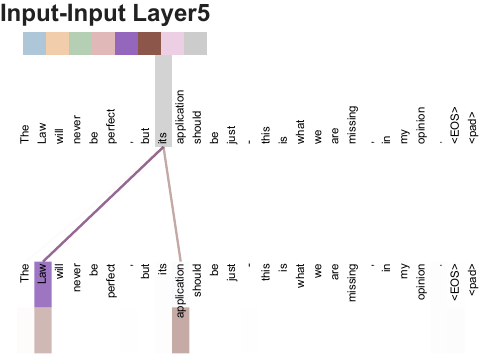
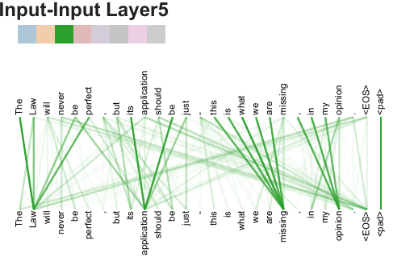
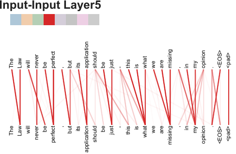

# 🖇️Attention Is All You Need — 어텐션만으로 충분하다

## 🧱 순차 계산이라는 병목

언어 모델링과 기계 번역 같은 sequence transduction 문제에서 최고 성능을 내온 접근은 recurrent neural network, 그중에서도 long short-term memory와 gated recurrent 신경망이었다. 순환 모델은 입력과 출력 시퀀스의 심볼 위치를 따라 계산을 분해한다. 위치를 계산 시간의 스텝에 대응시키고, 이전 은닉 상태 $h_{t-1}$과 위치 $t$의 입력으로부터 은닉 상태 $h_{t}$를 만들어 나가는 식이다.

이 구조는 본질적으로 순차적이라서 하나의 학습 예제 안에서 병렬화가 불가능하다. 시퀀스가 길어질수록 이 제약이 결정적이 되는데, 메모리 한계 때문에 예제들을 묶어 배치로 만드는 것으로도 상쇄되지 않기 때문이다. factorization trick과 conditional computation으로 계산 효율을 크게 끌어올린 최근 작업들이 있고 후자는 모델 성능까지 개선했지만, 순차 계산이라는 근본 제약 자체는 그대로 남는다.

어텐션은 입력이나 출력 시퀀스 안에서 거리와 무관하게 의존 관계를 모델링할 수 있게 해 주어 이미 강력한 sequence 모델의 필수 요소가 되었다. 그러나 극히 일부 사례를 빼면 어텐션은 언제나 순환 네트워크와 함께 쓰였다.

이 논문이 제안하는 Transformer는 순환을 버리고 입력과 출력 사이의 전역 의존 관계를 끌어내는 일을 전적으로 어텐션에만 맡긴다. 그 결과 병렬화 여지가 크게 늘어나, P100 GPU 여덟 장으로 열두 시간만 학습해도 번역 품질에서 새로운 최고 성능에 도달할 수 있다.

## 🔍 어텐션만 쓴다는 선택이 놓인 자리

순차 계산을 줄이려는 목표는 Extended Neural GPU, ByteNet, ConvS2S의 토대이기도 하다. 이들은 모두 합성곱 신경망을 기본 블록으로 삼아 모든 입출력 위치의 은닉 표현을 병렬로 계산한다. 다만 이 모델들에서 임의의 두 입력 또는 출력 위치의 신호를 연결하는 데 필요한 연산 수는 위치 간 거리에 따라 늘어난다 — ConvS2S는 선형으로, ByteNet은 로그로. 그래서 멀리 떨어진 위치 사이의 의존 관계를 학습하기가 더 어려워진다. Transformer에서는 이 연산 수가 상수로 줄어든다. 대신 어텐션 가중치가 걸린 위치들을 평균 내면서 유효 해상도가 떨어지는 대가를 치르는데, 이 효과는 multi-head attention으로 상쇄한다.

intra-attention이라고도 불리는 self-attention은 하나의 시퀀스 안에서 서로 다른 위치들을 관계 지어 그 시퀀스의 표현을 계산하는 어텐션이다. 독해, 추상적 요약, textual entailment, 과제 독립적 문장 표현 학습 등 여러 과제에서 성공적으로 쓰여 왔다. end-to-end memory network는 시퀀스에 정렬된 순환 대신 recurrent attention 메커니즘에 기반하며, 단순 언어 질의응답과 언어 모델링 과제에서 좋은 성능을 보였다.

저자들이 아는 한 Transformer는 시퀀스 정렬 RNN이나 합성곱 없이 오직 self-attention만으로 입력과 출력의 표현을 계산하는 최초의 transduction 모델이다.

## 🏛️ 모델 구조

Figure 1은 Transformer 전체 구조다. 왼쪽이 encoder, 오른쪽이 decoder이고 두 스택 모두 `Nx`로 반복된다. 아래에서부터 보면 입력은 Input Embedding을 거쳐 사인 곡선 기호로 표시된 Positional Encoding과 더해진다. encoder 층은 Multi-Head Attention → Add & Norm → Feed Forward → Add & Norm 순이고, 각 Add & Norm에는 아래 블록 입력에서 곧장 올라오는 residual 경로가 붙어 있다. decoder 층은 Masked Multi-Head Attention → Add & Norm으로 시작하고, 그다음 Multi-Head Attention 블록의 key와 value 입력 두 갈래가 encoder 스택 최상단 출력에서 건너와 연결되며, 나머지 한 갈래인 query만 decoder 아래층에서 올라온다. 그 위에 Feed Forward와 Add & Norm이 놓이고, 스택을 나오면 Linear와 Softmax를 거쳐 Output Probabilities가 된다. decoder의 입력은 Output Embedding이며 그림에 `Outputs (shifted right)`로 표시되어 있다.

경쟁력 있는 신경망 sequence transduction 모델은 대부분 encoder-decoder 구조를 가진다. encoder는 심볼 표현의 입력 시퀀스 $(x_{1},...,x_{n})$을 연속 표현의 시퀀스 $\mathbf{z}=(z_{1},...,z_{n})$으로 매핑한다. $\mathbf{z}$가 주어지면 decoder는 출력 시퀀스 $(y_{1},...,y_{m})$을 한 번에 한 원소씩 생성한다. 각 스텝에서 모델은 auto-regressive하게 작동해, 다음 심볼을 생성할 때 이전에 생성한 심볼들을 추가 입력으로 소비한다. Transformer는 이 전체 구조를 따르되 encoder와 decoder 양쪽 모두에 stacked self-attention과 위치별(point-wise) 완전 연결 층을 쓴다.

### 🧩 encoder와 decoder 스택

encoder는 동일한 층 $N=6$개를 쌓은 것이다. 각 층에는 두 개의 sub-layer가 있다. 첫째는 multi-head self-attention 메커니즘이고, 둘째는 단순한 위치별 완전 연결 feed-forward 네트워크다. 두 sub-layer 각각을 residual connection으로 감싸고 그 뒤에 layer normalization을 둔다. 즉 각 sub-layer의 출력은 $\mathrm{LayerNorm}(x+\mathrm{Sublayer}(x))$이며, $\mathrm{Sublayer}(x)$는 그 sub-layer 자체가 구현하는 함수다. 이 residual connection이 가능하려면 차원이 맞아야 하므로, 모델 안의 모든 sub-layer와 embedding 층이 $d_{\text{model}}=512$ 차원의 출력을 낸다.

decoder 역시 동일한 층 $N=6$개를 쌓는다. encoder 층의 두 sub-layer에 더해, decoder는 encoder 스택의 출력에 대해 multi-head attention을 수행하는 세 번째 sub-layer를 끼워 넣는다. encoder와 마찬가지로 각 sub-layer를 residual connection으로 감싸고 layer normalization을 붙인다. 또 decoder 스택의 self-attention sub-layer는 어떤 위치가 그 뒤의 위치를 참조하지 못하도록 수정한다. 이 masking과 출력 embedding이 한 위치만큼 밀려 있다는 사실이 합쳐져서, 위치 $i$에 대한 예측이 $i$보다 작은 위치의 이미 알려진 출력에만 의존하도록 보장된다.

### ⚖️ Scaled Dot-Product Attention

어텐션 함수는 query 하나와 key-value 쌍들의 집합을 출력으로 매핑하는 함수로 설명할 수 있다. query, key, value, 출력이 모두 벡터다. 출력은 value들의 가중합으로 계산되며, 각 value에 붙는 가중치는 query와 대응하는 key의 compatibility 함수로 계산된다.

Figure 2 왼쪽은 scaled dot-product attention의 계산 흐름이다. 아래에서 Q와 K가 MatMul로 들어가고, 그 결과가 Scale → Mask (opt.) → SoftMax를 차례로 통과한 뒤, 오른쪽에서 곧바로 올라온 V와 다시 MatMul되어 출력이 된다. mask 블록이 선택적(opt.)이라는 표시가 붙어 있는 것이 decoder 전용 단계임을 보여 준다.

입력은 차원 $d_{k}$인 query와 key, 차원 $d_{v}$인 value로 이루어진다. query와 모든 key의 내적을 구하고, 각각을 $\sqrt{d_{k}}$로 나눈 뒤, softmax를 적용해 value에 걸릴 가중치를 얻는다. 실제로는 여러 query를 행렬 $Q$로 묶어 어텐션 함수를 한꺼번에 계산한다. key와 value도 행렬 $K$, $V$로 묶는다. 출력 행렬은 다음과 같이 계산된다.

$$\mathrm{Attention}(Q,K,V)=\mathrm{softmax}(\frac{QK^{T}}{\sqrt{d_{k}}})V$$ (1)

가장 널리 쓰이는 어텐션 함수는 additive attention과 dot-product(multiplicative) attention 둘이다. dot-product attention은 $\frac{1}{\sqrt{d_{k}}}$라는 스케일링 인자만 빼면 여기서 쓰는 알고리즘과 동일하다. additive attention은 은닉층이 하나인 feed-forward 네트워크로 compatibility 함수를 계산한다. 이론적 복잡도는 둘이 비슷하지만, 실제로는 dot-product attention이 훨씬 빠르고 공간 효율이 좋다. 고도로 최적화된 행렬 곱 코드로 구현할 수 있기 때문이다.

$d_{k}$가 작을 때는 두 메커니즘의 성능이 비슷하지만, $d_{k}$가 커지면 스케일링 없는 dot-product attention보다 additive attention이 더 낫다. 저자들은 $d_{k}$가 클 때 내적의 크기가 커져서 softmax를 기울기가 극도로 작은 영역으로 밀어 넣는 것이 원인이라고 추측한다. 왜 내적이 커지는지는 이렇게 볼 수 있다. $q$와 $k$의 각 성분이 평균 $0$, 분산 $1$인 독립 확률 변수라고 하면, 그 내적 $q\cdot k=\sum_{i=1}^{d_{k}}q_{i}k_{i}$는 평균 $0$, 분산 $d_{k}$를 갖는다. 이 효과를 상쇄하려고 내적을 $\frac{1}{\sqrt{d_{k}}}$로 스케일링한다.

### 🎭 Multi-Head Attention

Figure 2 오른쪽이 multi-head attention이다. 아래쪽에 V, K, Q가 각각 들어가 각자의 Linear를 통과하고, 이 Linear 블록들과 그 위의 Scaled Dot-Product Attention 블록이 겹쳐 그려져 있어 총 $h$개가 병렬로 존재함을 나타낸다. $h$개의 어텐션 출력이 Concat으로 이어 붙여진 뒤 마지막 Linear를 거쳐 최종 출력이 된다.

$d_{\text{model}}$ 차원의 key, value, query로 어텐션 함수를 한 번만 수행하는 대신, query·key·value를 서로 다른 학습된 선형 투영으로 $h$번 투영해 각각 $d_{k}$, $d_{k}$, $d_{v}$ 차원으로 보내는 편이 낫다는 것을 확인했다. 투영된 각 버전에 대해 어텐션 함수를 병렬로 수행해 $d_{v}$ 차원 출력값들을 얻고, 이들을 이어 붙인 뒤 다시 한 번 투영해 최종 값을 만든다.

multi-head attention은 모델이 서로 다른 위치의 서로 다른 표현 부분공간에서 오는 정보에 동시에 주목할 수 있게 해 준다. head가 하나뿐이면 평균화가 이를 방해한다.

$$\displaystyle\mathrm{MultiHead}(Q,K,V)$$ $$\displaystyle=\mathrm{Concat}(\mathrm{head_{1}},...,\mathrm{head_{h}})W^{O}$$

$$\displaystyle\text{where}~\mathrm{head_{i}}$$ $$\displaystyle=\mathrm{Attention}(QW^{Q}_{i},KW^{K}_{i},VW^{V}_{i})$$

여기서 투영은 파라미터 행렬 $W^{Q}_{i}\in\mathbb{R}^{d_{\text{model}}\times d_{k}}$, $W^{K}_{i}\in\mathbb{R}^{d_{\text{model}}\times d_{k}}$, $W^{V}_{i}\in\mathbb{R}^{d_{\text{model}}\times d_{v}}$, $W^{O}\in\mathbb{R}^{hd_{v}\times d_{\text{model}}}$이다.

이 작업에서는 $h=8$개의 병렬 어텐션 층, 곧 head를 쓴다. 각각에 대해 $d_{k}=d_{v}=d_{\text{model}}/h=64$를 쓴다. head마다 차원이 줄었기 때문에 총 계산 비용은 전체 차원을 쓰는 single-head attention과 비슷하다.

### 🔀 어텐션이 쓰이는 세 자리

Transformer는 multi-head attention을 세 가지 방식으로 쓴다.

"encoder-decoder attention" 층에서는 query가 직전 decoder 층에서 오고, memory key와 value는 encoder의 출력에서 온다. 덕분에 decoder의 모든 위치가 입력 시퀀스의 모든 위치를 참조할 수 있다. 이는 sequence-to-sequence 모델의 전형적인 encoder-decoder 어텐션을 흉내 낸 것이다.

encoder에는 self-attention 층이 들어 있다. self-attention 층에서는 key, value, query가 모두 같은 곳 — 이 경우 encoder 직전 층의 출력 — 에서 온다. encoder의 각 위치는 encoder 직전 층의 모든 위치를 참조할 수 있다.

decoder의 self-attention 층도 마찬가지로 각 위치가 그 위치를 포함해 그 이전까지의 decoder 내 모든 위치를 참조하게 한다. auto-regressive 성질을 지키려면 decoder 안에서 왼쪽으로 흐르는 정보를 막아야 한다. 이를 scaled dot-product attention 내부에서 구현하는데, softmax 입력 중 허용되지 않는 연결에 해당하는 값을 전부 $-\infty$로 masking out한다.

### 📐 위치별 feed-forward 네트워크

어텐션 sub-layer 외에, encoder와 decoder의 각 층에는 완전 연결 feed-forward 네트워크가 들어 있다. 이 네트워크는 각 위치마다 개별적으로, 그리고 동일하게 적용된다. 사이에 ReLU 활성화가 끼인 두 번의 선형 변환으로 이루어진다.

$$\mathrm{FFN}(x)=\max(0,xW_{1}+b_{1})W_{2}+b_{2}$$ (2)

선형 변환은 위치가 달라도 동일하지만, 층이 달라지면 다른 파라미터를 쓴다. 커널 크기 1인 합성곱 두 개로 설명할 수도 있다. 입출력 차원은 $d_{\text{model}}=512$이고, 내부 층의 차원은 $d_{ff}=2048$이다.

### 🔤 embedding과 softmax

다른 sequence transduction 모델과 마찬가지로 학습된 embedding으로 입력 토큰과 출력 토큰을 $d_{\text{model}}$ 차원 벡터로 바꾼다. decoder 출력을 다음 토큰의 예측 확률로 바꿀 때도 통상적인 학습된 선형 변환과 softmax를 쓴다. 이 모델에서는 두 embedding 층과 softmax 직전 선형 변환이 같은 가중치 행렬을 공유한다. embedding 층에서는 그 가중치에 $\sqrt{d_{\text{model}}}$을 곱한다.

### 🌊 positional encoding

모델에 순환도 합성곱도 없기 때문에, 시퀀스의 순서를 활용하려면 토큰의 상대적 또는 절대적 위치 정보를 어떻게든 주입해야 한다. 그래서 encoder와 decoder 스택 맨 아래에서 입력 embedding에 "positional encoding"을 더한다. positional encoding은 embedding과 같은 $d_{\text{model}}$ 차원이라 둘을 더할 수 있다. positional encoding에는 학습되는 것과 고정된 것 등 많은 선택지가 있다.

이 작업에서는 서로 다른 주파수의 사인·코사인 함수를 쓴다.

$$\displaystyle PE_{(pos,2i)}=sin(pos/10000^{2i/d_{\text{model}}})$$

$$\displaystyle PE_{(pos,2i+1)}=cos(pos/10000^{2i/d_{\text{model}}})$$

$pos$는 위치이고 $i$는 차원이다. 즉 positional encoding의 각 차원이 하나의 사인 곡선에 대응한다. 파장은 $2\pi$부터 $10000\cdot 2\pi$까지 등비수열을 이룬다. 이 함수를 고른 이유는 모델이 상대 위치를 기준으로 참조하는 법을 쉽게 배울 것이라고 가정했기 때문이다. 고정된 offset $k$에 대해 $PE_{pos+k}$가 $PE_{pos}$의 선형 함수로 표현될 수 있다는 것이 그 근거다.

학습되는 positional embedding도 실험해 봤는데 두 버전이 거의 동일한 결과를 냈다(Table 3의 (E) 행). 그럼에도 사인 곡선 버전을 택한 것은 학습 중 마주친 것보다 긴 시퀀스 길이로 외삽할 수 있을지도 모른다는 이유에서다.

## 🧮 self-attention을 쓸 이유

self-attention 층을, 가변 길이 심볼 표현 시퀀스 $(x_{1},...,x_{n})$을 같은 길이의 다른 시퀀스 $(z_{1},...,z_{n})$으로 매핑하는 데 흔히 쓰이는 순환 층·합성곱 층과 여러 측면에서 비교한다. 여기서 $x_{i},z_{i}\in\mathbb{R}^{d}$이고, 이런 매핑은 전형적인 sequence transduction encoder나 decoder의 은닉층에 해당한다. self-attention을 쓸 근거로 세 가지 요건을 본다.

하나는 층당 총 계산 복잡도다. 다른 하나는 병렬화할 수 있는 계산량인데, 필요한 순차 연산의 최소 개수로 측정한다.

세 번째는 네트워크 안에서 장거리 의존 관계 사이의 경로 길이다. 장거리 의존 관계 학습은 많은 sequence transduction 과제의 핵심 난제다. 이 능력을 좌우하는 주요 인자 하나가 순방향·역방향 신호가 네트워크에서 지나가야 하는 경로의 길이다. 입력과 출력 시퀀스의 어떤 위치 조합에 대해서든 이 경로가 짧을수록 장거리 의존 관계를 배우기 쉽다. 그래서 서로 다른 층 유형으로 구성된 네트워크에서 임의의 두 입출력 위치 사이의 최대 경로 길이도 함께 비교한다.

*Table 1: Maximum path lengths, per-layer complexity and minimum number of sequential operations for different layer types. $n$ is the sequence length, $d$ is the representation dimension, $k$ is the kernel size of convolutions and $r$ the size of the neighborhood in restricted self-attention.*

| Layer Type | Complexity per Layer | Sequential Operations | Maximum Path Length |
|----|----|----|----|
| Self-Attention | $O(n^{2}\cdot d)$ | $O(1)$ | $O(1)$ |
| Recurrent | $O(n\cdot d^{2})$ | $O(n)$ | $O(n)$ |
| Convolutional | $O(k\cdot n\cdot d^{2})$ | $O(1)$ | $O(log_{k}(n))$ |
| Self-Attention (restricted) | $O(r\cdot n\cdot d)$ | $O(1)$ | $O(n/r)$ |

Table 1에서 보듯 self-attention 층은 상수 개의 순차 연산으로 모든 위치를 연결하는 반면 순환 층은 $O(n)$개의 순차 연산을 요구한다. 계산 복잡도로 보면 시퀀스 길이 $n$이 표현 차원 $d$보다 작을 때 self-attention 층이 순환 층보다 빠른데, word-piece나 byte-pair 표현을 쓰는 최신 기계 번역 모델의 문장 표현에서는 대체로 그렇다. 아주 긴 시퀀스를 다루는 과제의 계산 성능을 개선하려면 self-attention을 해당 출력 위치를 중심으로 한 크기 $r$의 이웃만 보도록 제한할 수 있다. 이렇게 하면 최대 경로 길이가 $O(n/r)$로 늘어난다. 이 방향은 향후 연구로 더 살펴볼 계획이다.

커널 폭 $k<n$인 합성곱 층 하나로는 모든 입출력 위치 쌍이 연결되지 않는다. 연결하려면 연속 커널의 경우 $O(n/k)$개, dilated convolution의 경우 $O(log_{k}(n))$개의 합성곱 층을 쌓아야 하고, 그만큼 네트워크 안 임의의 두 위치 사이 최장 경로가 길어진다. 합성곱 층은 일반적으로 순환 층보다 $k$배 비싸다. 다만 separable convolution은 복잡도를 $O(k\cdot n\cdot d+n\cdot d^{2})$까지 상당히 낮춘다. 그런데 $k=n$인 경우조차 separable convolution의 복잡도는 self-attention 층과 위치별 feed-forward 층을 합친 것 — 곧 이 모델이 택한 방식 — 과 같다.

부수적 이점으로 self-attention은 더 해석 가능한 모델을 낳을 수 있다. 모델의 어텐션 분포를 들여다보면 개별 어텐션 head들이 서로 다른 과제를 수행하도록 명확히 학습할 뿐 아니라, 상당수가 문장의 통사·의미 구조와 관련된 행동을 보이는 것으로 나타난다(appear).

## 🏋️ 학습 설정

### 📚 데이터와 배치

학습에는 문장 쌍 약 450만 개로 이루어진 표준 WMT 2014 English-German 데이터셋을 썼다. 문장은 byte-pair encoding으로 인코딩했고, source와 target이 공유하는 어휘 크기는 약 37000 토큰이다. English-French에는 문장 36M개로 훨씬 큰 WMT 2014 English-French 데이터셋을 썼고, 토큰을 32000개의 word-piece 어휘로 나눴다. 문장 쌍은 대략적인 시퀀스 길이로 묶어 배치를 만들었다. 각 학습 배치는 source 토큰 약 25000개와 target 토큰 약 25000개를 담은 문장 쌍 집합이었다.

### 🖥️ 하드웨어와 일정

NVIDIA P100 GPU 8장이 달린 머신 한 대에서 학습했다. 논문 전반에 기술된 하이퍼파라미터를 쓰는 base 모델은 학습 스텝당 약 0.4초가 걸렸다. base 모델은 총 100,000 스텝, 12시간 학습했다. big 모델(Table 3의 마지막 행)은 스텝 시간이 1.0초였고 300,000 스텝(3.5일) 학습했다.

### 🎚️ optimizer

$\beta_{1}=0.9$, $\beta_{2}=0.98$, $\epsilon=10^{-9}$인 Adam optimizer를 썼다. learning rate는 학습이 진행되는 동안 다음 식에 따라 바꿨다.

$$lrate=d_{\text{model}}^{-0.5}\cdot\min({step\_num}^{-0.5},{step\_num}\cdot{warmup\_steps}^{-1.5})$$ (3)

이는 처음 $warmup\_steps$ 학습 스텝 동안 learning rate를 선형으로 올리고, 그 뒤로는 스텝 수의 역제곱근에 비례해 낮추는 것에 해당한다. $warmup\_steps=4000$을 썼다.

### 🛡️ 정규화

학습 중 세 가지 정규화를 쓴다. 첫째와 둘째는 residual dropout이다. 각 sub-layer의 출력이 sub-layer 입력에 더해져 정규화되기 전에 dropout을 적용하고, 여기에 더해 encoder와 decoder 스택 양쪽에서 embedding과 positional encoding의 합에도 dropout을 적용한다. base 모델에는 $P_{drop}=0.1$을 쓴다. 셋째는 label smoothing으로 값 $\epsilon_{ls}=0.1$을 썼다. label smoothing은 모델이 더 확신 없이 예측하도록 학습시키므로 perplexity를 악화시키지만, accuracy와 BLEU 점수는 개선한다.

## 📊 번역 결과

*Table 2: The Transformer achieves better BLEU scores than previous state-of-the-art models on the English-to-German and English-to-French newstest2014 tests at a fraction of the training cost.*

| Model | BLEU EN-DE | BLEU EN-FR | Training Cost (FLOPs) EN-DE | Training Cost (FLOPs) EN-FR |
|----|----|----|----|----|
| ByteNet \[18\] | 23.75 |  |  |  |
| Deep-Att + PosUnk \[39\] |  | 39.2 |  | $1.0\cdot 10^{20}$ |
| GNMT + RL \[38\] | 24.6 | 39.92 | $2.3\cdot 10^{19}$ | $1.4\cdot 10^{20}$ |
| ConvS2S \[9\] | 25.16 | 40.46 | $9.6\cdot 10^{18}$ | $1.5\cdot 10^{20}$ |
| MoE \[32\] | 26.03 | 40.56 | $2.0\cdot 10^{19}$ | $1.2\cdot 10^{20}$ |
| Deep-Att + PosUnk Ensemble \[39\] |  | 40.4 |  | $8.0\cdot 10^{20}$ |
| GNMT + RL Ensemble \[38\] | 26.30 | 41.16 | $1.8\cdot 10^{20}$ | $1.1\cdot 10^{21}$ |
| ConvS2S Ensemble \[9\] | 26.36 | **41.29** | $7.7\cdot 10^{19}$ | $1.2\cdot 10^{21}$ |
| Transformer (base model) | 27.3 | 38.1 | $3.3\cdot 10^{18}$ |  |
| Transformer (big) | **28.4** | **41.8** | $2.3\cdot 10^{19}$ |  |

WMT 2014 English-to-German 번역 과제에서 big Transformer 모델은 앙상블을 포함한 기존 최고 보고 모델들을 $2.0$ BLEU 넘게 앞서며 새로운 최고 BLEU 점수 $28.4$를 세웠다. 이 모델의 설정은 Table 3의 마지막 행에 있다. 학습에는 P100 GPU $8$장으로 $3.5$일이 걸렸다. base 모델조차 기존에 발표된 모든 모델과 앙상블을 앞서는데, 경쟁 모델 어느 것과 비교해도 학습 비용의 일부만 쓴다.

WMT 2014 English-to-French 번역 과제에서 big 모델은 BLEU 점수 $41.0$을 달성해, 기존 최고 성능 모델 학습 비용의 $1/4$ 미만으로 이전에 발표된 모든 단일 모델을 앞섰다. English-to-French용으로 학습한 Transformer (big) 모델은 dropout 비율로 $0.3$ 대신 $P_{drop}=0.1$을 썼다.

base 모델에서는 10분 간격으로 기록된 마지막 5개 체크포인트를 평균한 단일 모델을 썼다. big 모델에서는 마지막 20개 체크포인트를 평균했다. beam 크기 $4$, length penalty $\alpha=0.6$인 beam search를 썼다. 이 하이퍼파라미터들은 development set에서 실험해 고른 값이다. 추론 시 최대 출력 길이는 입력 길이 + $50$으로 두되 가능하면 일찍 종료했다.

학습에 쓰인 부동소수점 연산 횟수는 학습 시간, 쓴 GPU 수, GPU 한 장의 지속 단정밀도 부동소수점 처리 능력 추정치를 곱해 추정했다. 이때 K80, K40, M40, P100에 각각 2.8, 3.7, 6.0, 9.5 TFLOPS 값을 썼다.

## 🔬 구성 요소별 변형 실험

Transformer 각 구성 요소의 중요도를 평가하려고 base 모델을 여러 방식으로 변형하고, English-to-German 번역의 development set인 newstest2013에서 성능 변화를 측정했다. beam search는 앞 절과 같이 썼지만 체크포인트 평균은 하지 않았다.

*Table 3: Variations on the Transformer architecture. Unlisted values are identical to those of the base model. All metrics are on the English-to-German translation development set, newstest2013. Listed perplexities are per-wordpiece, according to our byte-pair encoding, and should not be compared to per-word perplexities.*

|  | $N$ | $d_{\text{model}}$ | $d_{\text{ff}}$ | $h$ | $d_{k}$ | $d_{v}$ | $P_{drop}$ | $\epsilon_{ls}$ | train steps | PPL (dev) | BLEU (dev) | params $\times 10^{6}$ |
|----|----|----|----|----|----|----|----|----|----|----|----|----|
| base | 6 | 512 | 2048 | 8 | 64 | 64 | 0.1 | 0.1 | 100K | 4.92 | 25.8 | 65 |
| \(A\) |  |  |  | 1 | 512 | 512 |  |  |  | 5.29 | 24.9 |  |
| \(A\) |  |  |  | 4 | 128 | 128 |  |  |  | 5.00 | 25.5 |  |
| \(A\) |  |  |  | 16 | 32 | 32 |  |  |  | 4.91 | 25.8 |  |
| \(A\) |  |  |  | 32 | 16 | 16 |  |  |  | 5.01 | 25.4 |  |
| \(B\) |  |  |  |  | 16 |  |  |  |  | 5.16 | 25.1 | 58 |
| \(B\) |  |  |  |  | 32 |  |  |  |  | 5.01 | 25.4 | 60 |
| \(C\) | 2 |  |  |  |  |  |  |  |  | 6.11 | 23.7 | 36 |
| \(C\) | 4 |  |  |  |  |  |  |  |  | 5.19 | 25.3 | 50 |
| \(C\) | 8 |  |  |  |  |  |  |  |  | 4.88 | 25.5 | 80 |
| \(C\) |  | 256 |  |  | 32 | 32 |  |  |  | 5.75 | 24.5 | 28 |
| \(C\) |  | 1024 |  |  | 128 | 128 |  |  |  | 4.66 | 26.0 | 168 |
| \(C\) |  |  | 1024 |  |  |  |  |  |  | 5.12 | 25.4 | 53 |
| \(C\) |  |  | 4096 |  |  |  |  |  |  | 4.75 | 26.2 | 90 |
| \(D\) |  |  |  |  |  |  | 0.0 |  |  | 5.77 | 24.6 |  |
| \(D\) |  |  |  |  |  |  | 0.2 |  |  | 4.95 | 25.5 |  |
| \(D\) |  |  |  |  |  |  |  | 0.0 |  | 4.67 | 25.3 |  |
| \(D\) |  |  |  |  |  |  |  | 0.2 |  | 5.47 | 25.7 |  |
| \(E\) | positional embedding instead of sinusoids |  |  |  |  |  |  |  |  | 4.92 | 25.7 |  |
| big | 6 | 1024 | 4096 | 16 |  |  | 0.3 |  | 300K | **4.33** | **26.4** | 213 |

(A) 행들에서는 계산량을 일정하게 유지하면서 어텐션 head 수와 어텐션 key·value 차원을 바꿨다. single-head attention은 가장 좋은 설정보다 0.9 BLEU 나쁘지만, head가 너무 많아도 품질이 떨어진다.

(B) 행들에서는 어텐션 key 크기 $d_{k}$를 줄이면 모델 품질이 나빠진다는 것을 관찰했다. compatibility를 결정하는 일이 쉽지 않으며, 내적보다 더 정교한 compatibility 함수가 도움이 될 수도 있음을 시사한다.

(C)와 (D) 행들에서는 예상대로 모델이 클수록 좋고 dropout이 과적합 방지에 매우 유용하다는 것을 확인했다. (E) 행에서는 사인 곡선 positional encoding을 학습되는 positional embedding으로 바꿨고, base 모델과 거의 동일한 결과를 얻었다.

## 🌲 English constituency parsing으로의 일반화

Transformer가 다른 과제로 일반화되는지 평가하려고 English constituency parsing 실험을 했다. 이 과제에는 고유한 난점이 있다. 출력이 강한 구조적 제약을 받고, 입력보다 훨씬 길다. 게다가 RNN sequence-to-sequence 모델은 데이터가 적은 환경에서 최고 성능에 도달하지 못해 왔다.

$d_{model}=1024$인 4층 transformer를 Penn Treebank의 Wall Street Journal(WSJ) 부분, 약 40K 학습 문장으로 학습시켰다. 준지도 설정으로도 학습시켰는데, 약 17M 문장 규모의 더 큰 high-confidence 및 BerkleyParser 코퍼스를 썼다. WSJ만 쓰는 설정에는 16K 토큰 어휘를, 준지도 설정에는 32K 토큰 어휘를 썼다.

dropout(어텐션과 residual 양쪽), learning rate, beam 크기를 Section 22 development set에서 고르는 소수의 실험만 수행했고, 나머지 파라미터는 English-to-German base 번역 모델에서 바꾸지 않았다. 추론 시 최대 출력 길이를 입력 길이 + $300$으로 늘렸다. WSJ만 쓰는 설정과 준지도 설정 모두에 beam 크기 $21$과 $\alpha=0.3$을 썼다.

*Table 4: The Transformer generalizes well to English constituency parsing (Results are on Section 23 of WSJ)*

| **Parser** | **Training** | **WSJ 23 F1** |
|----|----|----|
| Vinyals & Kaiser el al. (2014) \[37\] | WSJ only, discriminative | 88.3 |
| Petrov et al. (2006) \[29\] | WSJ only, discriminative | 90.4 |
| Zhu et al. (2013) \[40\] | WSJ only, discriminative | 90.4 |
| Dyer et al. (2016) \[8\] | WSJ only, discriminative | 91.7 |
| Transformer (4 layers) | WSJ only, discriminative | 91.3 |
| Zhu et al. (2013) \[40\] | semi-supervised | 91.3 |
| Huang & Harper (2009) \[14\] | semi-supervised | 91.3 |
| McClosky et al. (2006) \[26\] | semi-supervised | 92.1 |
| Vinyals & Kaiser el al. (2014) \[37\] | semi-supervised | 92.1 |
| Transformer (4 layers) | semi-supervised | 92.7 |
| Luong et al. (2015) \[23\] | multi-task | 93.0 |
| Dyer et al. (2016) \[8\] | generative | 93.3 |

과제 특화 튜닝이 없었는데도 모델이 놀랄 만큼 잘 작동해서, Recurrent Neural Network Grammar를 제외한 이전 보고 모델 전부보다 나은 결과를 냈다. RNN sequence-to-sequence 모델과 대조적으로, Transformer는 40K 문장짜리 WSJ 학습 세트만으로 학습해도 BerkeleyParser를 앞선다.

## 👁️ 어텐션 head가 실제로 배운 것

*Figure 3: An example of the attention mechanism following long-distance dependencies in the encoder self-attention in layer 5 of 6. Many of the attention heads attend to a distant dependency of the verb 'making', completing the phrase 'making…more difficult'. Attentions here shown only for the word 'making'. Different colors represent different heads. Best viewed in color.*

Figure 3은 6층 중 5층의 encoder self-attention이 장거리 의존 관계를 따라가는 예다. 문장은 "It is in this spirit that a majority of American governments have passed new laws since 2009 making the registration or voting process more difficult"이고, 위쪽 줄의 `making`에서만 어텐션을 그렸다. 색이 다른 여러 head에서 나온 굵은 선들이 아래쪽 줄의 `more`와 `difficult`로 집중적으로 모여 'making…more difficult'라는 구를 완성한다. `the`나 `2009` 같은 인접 토큰으로 가는 옅은 선도 있지만, 뚜렷하게 진한 연결은 멀리 떨어진 `more`, `difficult` 쪽이다.

*Figure 4: Two attention heads, also in layer 5 of 6, apparently involved in anaphora resolution. Top: Full attentions for head 5. Bottom: Isolated attentions from just the word 'its' for attention heads 5 and 6. Note that the attentions are very sharp for this word.*

Figure 4의 문장은 "The Law will never be perfect, but its application should be just - this is what we are missing, in my opinion"이다. 위 그림은 head 5의 전체 어텐션으로, 보라색 선들이 문장 전체에 퍼져 있어 개별 연결을 읽기 어렵다. 아래 그림은 같은 문장에서 `its`라는 단어에서 나가는 어텐션만 head 5와 head 6에 대해 떼어 그린 것인데, 굵은 선 두 개가 각각 `Law`와 `application`으로 곧장 간다. 이 단어에 대해서는 어텐션이 매우 날카롭게(sharp) 형성된다. 다만 논문은 이 두 head가 anaphora resolution에 관여하는 것으로 보인다(apparently)고만 말한다.

*Figure 5: Many of the attention heads exhibit behaviour that seems related to the structure of the sentence. We give two such examples above, from two different heads from the encoder self-attention at layer 5 of 6. The heads clearly learned to perform different tasks.*

Figure 5는 같은 문장에 대해 6층 중 5층 encoder self-attention의 서로 다른 두 head를 보여 준다. 위쪽 초록색 head는 많은 위치에서 나온 선들이 `Law`, `application`, `missing`, `opinion`처럼 소수의 특정 단어로 수렴하는 모양이다. 아래쪽 빨간색 head는 상당수의 위치가 자기 자신 또는 바로 옆 위치로 수직에 가깝게 내려가는 선을 그리고, 여기에 더해 `what`, `we`, `missing`, `my`, `opinion` 쪽으로 향하는 뚜렷한 선들이 섞여 있다. 두 head가 서로 명확히 다른 일을 학습했다는 것이 요지다.

## 🏁 결론과 저자들의 다음 계획

Transformer는 전적으로 어텐션에만 기반한 최초의 sequence transduction 모델이며, encoder-decoder 구조에서 가장 흔히 쓰이던 순환 층을 multi-headed self-attention으로 대체한다.

번역 과제에서 Transformer는 순환 층이나 합성곱 층 기반 구조보다 훨씬 빠르게 학습될 수 있다. WMT 2014 English-to-German과 WMT 2014 English-to-French 두 과제 모두에서 새로운 최고 성능을 달성했고, 전자에서는 최고 모델이 이전에 보고된 모든 앙상블까지 앞선다.

저자들은 어텐션 기반 모델의 미래를 기대하며 다른 과제에도 적용할 계획이라고 밝힌다. 텍스트가 아닌 입출력 modality를 가진 문제로 Transformer를 확장하는 것, 그리고 이미지·오디오·비디오처럼 크기가 큰 입출력을 효율적으로 다루기 위한 국소적이고 제한된 어텐션 메커니즘을 연구하는 것이 계획에 있다. 생성 과정을 덜 순차적으로 만드는 것도 연구 목표 중 하나다.

학습과 평가에 쓴 코드는 <https://github.com/tensorflow/tensor2tensor>에서 받을 수 있다.

## ⚠️ 저자들이 인정한 한계

self-attention은 어텐션 가중치가 걸린 위치들을 평균 내기 때문에 유효 해상도가 떨어지고, 이 대가를 multi-head attention으로 상쇄한다고 저자들 스스로 명시한다.

$d_{k}$가 클 때 스케일링 없는 dot-product attention이 나빠지는 이유에 대해 저자들은 "suspect"라는 표현을 쓴다. 내적이 커져 softmax가 기울기가 극도로 작은 영역으로 밀린다는 설명은 확정된 결론이 아니라 추측이다.

사인 곡선 positional encoding을 고른 근거도 확신이 아니다. 상대 위치 참조를 쉽게 배울 것이라는 가정("hypothesized")에 기반했고, 학습보다 긴 시퀀스로 외삽할 수 있게 해 줄지 모른다("may allow")는 기대가 이유다. 실제 결과는 학습되는 positional embedding과 거의 동일했다(Table 3의 (E) 행).

Table 3 (B) 행 결과에 대해서는 compatibility를 결정하는 일이 쉽지 않고 내적보다 정교한 compatibility 함수가 도움이 될 수도 있다고 인정한다. 즉 현재의 내적 기반 compatibility 함수가 최선이라고 주장하지 않는다.

계산량 수치는 측정값이 아니라 추정값이다. 학습 시간 × GPU 수 × GPU별 지속 단정밀도 처리 능력 추정치로 구한 것이라고 밝히고 있다.

self-attention을 크기 $r$의 이웃으로 제한하는 방안은 아주 긴 시퀀스를 위한 가능성으로 제시했을 뿐이고, 향후 연구에서 더 살펴볼 계획이라고 밝힌다. constituency parsing에서도 Recurrent Neural Network Grammar에는 못 미친다는 점을 명시한다.

## 🧐 노트 작성자가 보기에 걸리는 점

논문 안에서 English-to-French big 모델의 BLEU 점수가 두 값으로 나온다. abstract와 Table 2는 $41.8$이라고 하는데 6.1절 본문은 $41.0$이라고 쓴다. 두 값 모두 원문 그대로 옮겼지만, 어느 쪽이 맞는지 논문 자체로는 판정할 수 없다.

Table 2의 Transformer 두 행에는 EN-FR 학습 비용 칸이 비어 있다. 두 과제의 비용이 같다고 읽을지 EN-DE 열의 값이 두 과제를 아우른다고 읽을지가 표만으로는 확정되지 않는데, "이전 최고 성능 모델 학습 비용의 $1/4$ 미만"이라는 EN-FR 주장은 이 빈칸에 들어갈 수치에 의존한다.

English-to-French big 모델의 dropout 서술은 문장 그대로 읽으면 어색하다. "$0.3$ 대신 $P_{drop}=0.1$을 썼다"고 하는데, Table 3의 big 행에 적힌 값이 $0.3$이므로 big 모델의 기본 설정을 기준으로 낮췄다는 뜻으로 읽힌다. 다만 base 모델의 $P_{drop}$도 $0.1$이라서 어느 쪽이 대조 대상인지 문장만으로는 모호하다.

Table 1의 self-attention 복잡도 $O(n^{2}\cdot d)$가 순환 층의 $O(n\cdot d^{2})$보다 유리한 조건은 $n<d$인데, 실험에 쓴 두 번역 데이터셋의 실제 문장 길이 분포는 제시되지 않는다. "대체로 그렇다"는 진술의 근거가 측정이 아니라 관례에 기대고 있다.

어텐션 head의 해석 가능성 주장은 Figure 3~5의 사례 몇 개에 기반한다. 문장 두 개, 5층 한 곳에서 고른 예시이며, 정량적 평가나 head 전체에 대한 통계는 제시되지 않는다. 논문 본문도 "seems related", "appear to exhibit" 같은 표현으로 조심스럽게 쓰지만, 4절 끝의 "명확히 학습한다(clearly learn)"는 문장은 이 증거보다 강하다.

Table 3의 변형 실험은 한 번씩만 돌린 결과로 보이며 분산이나 seed 반복에 대한 언급이 없다. 예컨대 (A) 행에서 head 8일 때 BLEU 25.8과 head 16일 때 25.8은 동일하고, 0.9 BLEU라는 single-head 격차도 반복 실험 없이는 그 크기를 확신하기 어렵다.
