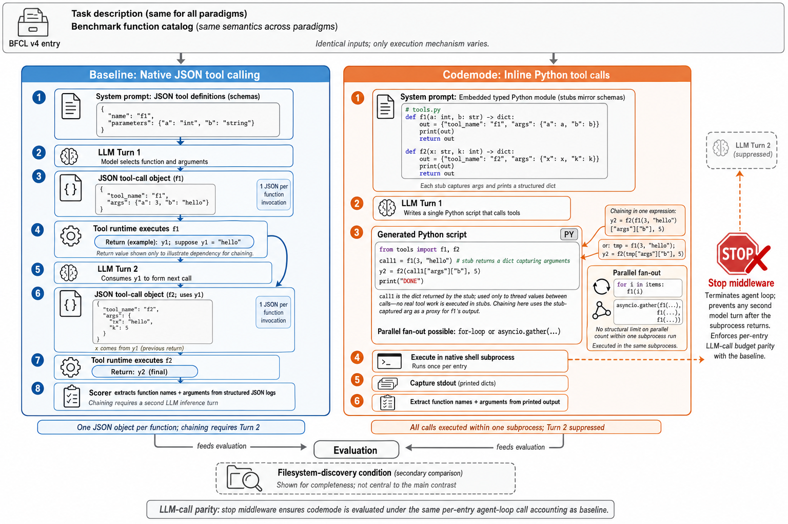
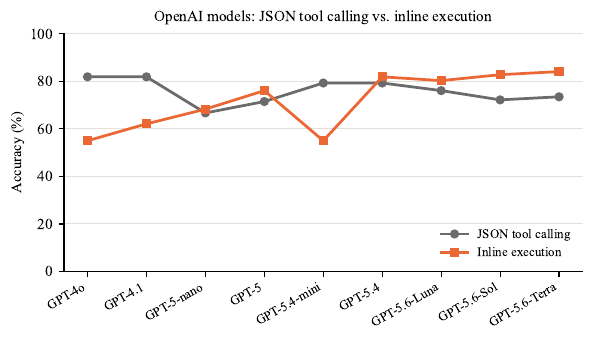
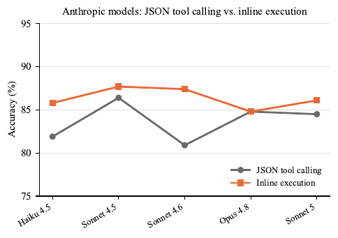

# 🖇️도구 호출의 쓰라린 교훈

## 🎯 무엇이 문제인가

LLM은 이제 외부 서비스를 API로 호출하는 도구 호출 에이전트로 동작하고, 그 API는 함수 호출마다 구조화된 JSON 객체를 뱉을 것을 요구한다(Anthropic, 2024; Guo et al., 2026). 그런데 이미 실행 가능한 코드를 쓸 줄 아는 모델에게 이 형식은 필연이 아니라 설계상의 선택일 뿐이다.

JSON 도구 호출을 실행 가능한 코드로 대체하자는 이론적 논거는 선행 연구가 세워 뒀다. CodeAct(Wang et al., 2024)는 다중 도구 과제에서 코드 액션이 최대 20% 높은 과제 성공률을 상호작용 턴 30% 절감과 함께 달성했고, 그 이득이 병렬·조합 시나리오에 몰려 있음을 보였다. 더 최근 연구는 코딩 에이전트 과제에서 코드 전용 출력 제약이 pass rate를 절대값 3% 미만으로 바꾼다는 것을 발견했다(Yang et al., 2026). 함수 호출은 이보다 어려운 시험대다. 정밀한 인자 직렬화, 다단계 chaining, 이질적 API를 가로지르는 fan-out을 요구하는데, 이 제약들은 코딩 에이전트 평가에는 없고 바로 여기가 패러다임 선택의 효과가 가장 크다고 주장되어 온 지점이다. 이런 조건에서, 그리고 여러 모델 계열과 적대적 컨텍스트 부하에서 programmatic tool calling이 JSON 도구 호출을 따라잡는지는 검증된 적이 없다.

이 공백을 메우기 위해 이 논문은 BFCL v4의 대표 309개 항목 부분집합(8개 과제 범주에 걸침)에서 *programmatic tool calling*(이하 PTC)을 JSON 도구 호출과 비교한다. 2024년 11월부터 2026년 7월 사이에 공개된 14개 모델을 쓴다. PTC에서 모델은 벤치마크의 함수 스키마로부터 컴파일된 타입 붙은 Python 스텁을 이용해 Python 스크립트를 작성한다. 에이전트 루프가 그것을 셸 서브프로세스에서 실행해, 추가 추론 턴 없이 도구 호출 결과를 만들어 낸다. JSON 도구 호출의 한계가 가장 자주 주장되어 온 과제 구조 세 가지 — 순차 chaining, 병렬 fan-out, context rot — 를 겨냥한 ablation 세 건을 함께 돌린다.

핵심 발견은 이렇다. 14개 모델 중 11개가 PTC에서 baseline 정확도를 따라잡거나 넘어서고, 결과는 모델 세대선을 따라 갈린다. Anthropic 모델 다섯 개 전부와 가장 최신 GPT 세 세대는 baseline을 따라잡거나 넘어서지만, 더 오래된 GPT 세 개는 그러지 못한다. 컨텍스트 flooding에서 PTC는 평균 절대 5.5% 향상을 보이는 반면, 비교용 파일시스템 탐색 접근은 절대 32% 열화한다.

논문이 스스로 정리한 기여는 네 가지다. 첫째, PTC의 실효성은 모델 계열이 아니라 모델 세대선을 따라 갈린다 — Anthropic 다섯 모델 전부와 최신 GPT-5.6 세 변종이 BFCL v4에서 JSON 도구 호출 정확도를 따라잡거나 넘어서고, 오래된 GPT 세 개는 그러지 못한다. 둘째, 순차 과제에서 PTC의 정확도 우위는 체인 길이에 따라 커져 길이 $\geq 12$에서 JSON 도구 호출 대비 18.8% 절대 격차에 이르며, 이 효과는 짧은 체인에서는 나타나지 않고 JSON 도구 호출이 링크마다 치르는 추가 추론 턴에서 비롯된다. 셋째, JSON 도구 호출은 모델별 fan-out 임계값(Claude Sonnet 5의 경우 $N=70$–$72$)을 넘으면 도구 호출을 통째로 누락하는 반면 PTC는 $N=100$에서도 100% 열거 정확도를 유지해, native 패러다임의 구조적 한계를 드러낸다. 넷째, 컨텍스트 flooding에서 PTC는 안정적으로 유지되는 반면 JSON 도구 호출은 평균 2.3%, 파일시스템 탐색 접근은 32% 열화한다.

## 📚 선행 연구와의 위치

JSON 도구 호출을 실행 코드로 대체하자는 동기는 두 갈래에서 온다. 하나는 code-action 에이전트다. CodeAct(Wang et al., 2024)는 다중 도구 과제에서 코드 액션이 JSON 대안을 능가함을 보였고, 이득은 병렬·조합 시나리오에 집중됐다. Recursive Agent Harnesses(Lumer et al., 2026)는 같은 코드 실행 프리미티브를 병렬 서브에이전트 생성으로 확장해, 서브프로세스에서 코드를 실행하면 높은 fan-out에서 native JSON 함수 호출을 제약하는 턴당 도구 호출 상한을 우회함을 보였다. 실무 프레임워크들은 이 발견을 프로덕션으로 옮겨 코드 조합을 기본 인터페이스로 취급한다(Hugging Face, 2024; Anthropic, 2024; Karten et al., 2026). 반면 Chronos(Sen et al., 2026b) 같은 프로덕션 메모리 시스템은 반복적 JSON 도구 호출 루프를 핵심 에이전트 메커니즘으로 배치해, JSON 도구 호출이 배포된 agentic 시스템의 지배적 인터페이스로 남아 있음을 확인해 준다. 인프라 제공자들도 같은 패턴을 채택하는 중으로, Cloudflare의 Agents 플랫폼은 코드 실행을 native 도구 사용 인터페이스로 제공한다(현재 experimental)(Cloudflare, 2026). 최근 서베이는 코드가 실행 가능하고 검사 가능하며 상태를 가진다는 점에서 agentic 추론의 이상적 기반이라고 주장한다(Ning et al., 2026). The Deterministic Horizon(Guo et al., 2026)은 이론적 근거를 준다 — 도구 위임이 필요해지는 지점은 정확히 chain-of-thought 추론이 검증 가능한 답을 내지 못하는 영역이고, 그 영역이 곧 도구 호출 정확도를 재는 영역이다. 그러나 이 연구들 중 어느 것도 표준화된 벤치마크에서 여러 모델 계열에 걸쳐 코드 실행과 JSON 도구 호출을 비교 평가하지는 않았다.

LLM 도구 호출 정확도를 재는 벤치마크는 API-Bank(Li et al., 2023), T-Eval(Chen et al., 2024), API-BLEND(Basu et al., 2024), UltraTool(Huang et al., 2024), CONFETTI(Alkhouli et al., 2025), ToolHop(Ye et al., 2025) 등 여럿 있다. 각각은 모델이 올바른 함수를 올바른 인자로 얼마나 정확히 호출하는지 평가하지만, 패러다임을 비교하지는 않는다. BFCL v4는 8개 과제 범주를 결정론적 채점기와 함께 다룬다. 최근 감사(Vaghasiya et al., 2026)는 BFCL v4의 LLM-judge 모드에서 평가자–사람 불일치가 20%임을 발견했는데, 이 논문의 평가는 스텁 출력에 직접 채점함으로써 그 경로를 피해 간다. agentic 도구 호출 학습 효율(Liu et al., 2026)과 컨텍스트 팽창(Du et al., 2026)에 관한 연구는 형식과 프롬프트 엔지니어링이 도구 호출 벤치마크 분산의 지배적 원인임을 지적하며, 이것이 여기서 수행하는 통제된 3방향 패러다임 비교의 동기가 된다. 선행 연구와 달리 이 논문은 20개월치 릴리스에 걸친 14개 모델에서 BFCL v4 위에 PTC와 JSON 도구 호출을 비교하고, chaining·병렬 fan-out·context rot을 겨냥한 ablation 세 건을 붙인다.

## 🧪 어떻게 비교했나

질문은 정확도를 희생하지 않고 PTC가 JSON 도구 호출을 대체할 수 있는가다. BFCL v4 위에서 두 패러다임 *JSON 도구 호출*과 *PTC*를 평가한다. 각 패러다임에서 모델은 동일한 과제 설명을 받고 올바른 함수를 올바른 인자로 호출해야 한다. 다른 것은 도구 호출을 표현하고 실행하는 메커니즘뿐이다. context rot ablation에서는 내부 참조점으로 파일시스템 기반 조건을 추가로 포함한다. 이것은 업계 관행이 아니며, 주 비교를 밝혀 주는 자리에서만 참조된다.



그림 1은 두 파이프라인을 나란히 놓는다. 상단 공통 상자에 BFCL v4 항목, 모든 패러다임에 동일한 과제 설명, 패러다임 간 의미가 동일한 벤치마크 함수 카탈로그가 들어가고 "입력은 동일하며 실행 메커니즘만 다르다"고 못 박는다. 왼쪽 baseline(native JSON 도구 호출)은 8단계다. 시스템 프롬프트에 JSON 도구 정의(스키마)가 들어가고 → LLM 턴 1에서 모델이 함수와 인자를 고르고 → `f1`에 대한 JSON 도구 호출 객체가 나오고(함수 호출 하나당 JSON 하나) → 도구 런타임이 `f1`을 실행해 `y1`을 돌려주고 → LLM 턴 2가 `y1`을 소비해 다음 호출을 만들고 → `y1`을 쓰는 `f2`의 JSON 객체가 나오고 → 도구 런타임이 `f2`를 실행해 최종 `y2`를 내고 → 채점기가 구조화된 JSON 로그에서 함수 이름과 인자를 뽑는다. 하단 문구는 "함수당 JSON 객체 하나, chaining에는 턴 2가 필요"다. 오른쪽 codemode(inline Python 도구 호출)는 6단계다. 시스템 프롬프트에 스키마를 그대로 반영한 타입 붙은 Python 모듈 소스가 박히고(각 스텁은 인자를 포착해 구조화된 dict를 print) → LLM 턴 1이 도구를 호출하는 단일 Python 스크립트를 쓰고 → 그 스크립트가 생성되고 → native 셸 서브프로세스에서 항목당 한 번 실행되고 → stdout(찍힌 dict들)을 포착하고 → 출력에서 함수 이름과 인자를 뽑는다. 곁가지 설명 상자는 chaining을 한 식으로 쓰는 법(`y2 = f2(f1(3, "hello")["args"]["b"], 5)` 또는 `tmp = f1(3, "hello"); y2 = f2(tmp["args"]["b"], 5)`)과 병렬 fan-out을 `for i in items: f1(i)` 또는 `asyncio.gather(...)`로 쓰는 법을 보여 주며, 한 서브프로세스 실행 안에서 병렬 개수에 구조적 한계가 없다고 적는다. 오른쪽 파이프라인은 "LLM 턴 2 (억제됨)"으로 점선이 이어지고 커다란 정지 표지 **Stop middleware**로 끝난다 — 에이전트 루프를 종료해 서브프로세스가 반환된 뒤 어떤 두 번째 모델 턴도 일어나지 않게 하고, baseline과 항목당 LLM 호출 예산을 맞춘다. 두 파이프라인은 중앙의 Evaluation으로 흘러 들어가고, 그 아래 점선 상자가 부차적 비교인 파일시스템 탐색 조건이다.

### 과제 정의

각 벤치마크 항목은 자연어 사용자 질의 $q$, 각각 타입 시그니처를 가진 사용 가능 함수 집합 $\mathcal{F}=\{f_{1},\ldots,f_{k}\}$, 그리고 정답 함수 호출 집합 $\mathcal{C}^{*}=\{(f_{i},\mathbf{a}_{i})\}$(여기서 $\mathbf{a}_{i}$는 호출 $i$의 인자 매핑)를 명시한다. 모델은 출력이 만들어 낸 호출 집합이 벤치마크의 정규화된 문자열 비교 아래 $\mathcal{C}^{*}$와 일치할 때에 한해 그 항목에서 정답이다. 이 정규화는 구두점을 제거하고 모든 값을 소문자로 만든 뒤 매칭한다. 이 정의는 세 패러다임 전부에서 동일하다. 차이는 모델을 어떻게 프롬프트하고 그 출력을 어떻게 파싱하는지에서만 생긴다.

### 두 패러다임

**JSON 도구 호출.** 모델은 함수 스키마를 JSON 도구 정의로 담은 시스템 프롬프트와 도구 호출 엔드포인트를 부르는 API 호출을 받는다. 함수 호출마다 구조화된 JSON 객체를 출력한다. 이것이 도구 증강 LLM의 표준 배포 패턴이고 참조 조건이다.

**PTC.** 모델은 벤치마크의 함수 스키마와 일대일 대응하는 함수들로 이뤄진 타입 붙은 Python 모듈의 소스가 박힌 시스템 프롬프트를 받는다. 각 스텁 함수는 자기 인자를 포착해 구조화된 dict로 돌려준다. 외부 서비스는 접촉하지 않는다. 모델은 이 모듈을 import해 적절한 함수를 호출하는 Python 스크립트를 쓴다. 에이전트 루프는 그 스크립트를 native 셸 서브프로세스에서 실행한다. 서브프로세스는 stdout을 포착하고, 채점기는 찍힌 출력에서 함수 이름과 인자 값을 뽑는다. 서브프로세스가 반환된 뒤 추가 추론 턴은 일어나지 않는다. stop middleware가 다음 모델 호출을 가로채 에이전트 루프를 종료한다. 이 설계 덕에 PTC와 JSON 도구 호출은 항목당 같은 수의 LLM 호출을 소비하고, 정확도 비교가 단순해진다.

반지름 7인 원의 둘레와 한 변이 5인 정사각형의 넓이를 구하라는 과제를 생각해 보자. JSON 도구 호출에서 모델은 순차적인 JSON 도구 호출 객체 두 개를 내보낸다. PTC에서는 이렇게 쓴다.

```
execute(command="python3 -c ’
import json
from stubs import (
    circumference, area_square)
print(json.dumps(circumference(radius=7)))
print(json.dumps(area_square(side=5)))
’")
```

셸 서브프로세스가 stdout 두 줄을 포착하고 채점기가 찍힌 호출 각각을 정답과 맞춘다. PTC는 한 서브프로세스에서 평가된 단일 Python 식으로 두 호출을 모두 해결하는 반면, JSON 도구 호출은 별개의 모델 출력 두 개를 요구한다.

### 벤치마크와 채점

BFCL v4(Vaghasiya et al., 2026)는 8개 과제 범주 — *simple_python*, *multiple*, *parallel*, *parallel_multiple*, *live_simple*, *live_multiple*, *live_parallel*, *live_parallel_multiple* — 에서 뽑은 309개 대표 항목을 제공한다. 항목은 전체 BFCL v4 벤치마크의 범주 분포를 반영하도록 비례 표집했고, 작은 범주에 충분한 항목을 확보하려고 범주별 최소치를 적용했다. 전체 항목 ID 목록은 평가 하네스와 함께 공개된다. simple과 multiple 범주는 큐레이션된 질의에서 단일 호출·다중 호출 정확도를 시험한다. live 범주는 실제 사용자 상호작용에서 표집한 질의를 쓴다. parallel 범주는 인자가 서로 독립인 함수 호출 두 개 이상을 요구한다.

세 패러다임 모두 예측값과 정답 인자 값을 비교 전에 정규화하는 결정론적 채점기를 쓴다. 정확도는 요구되는 모든 함수 호출이 존재하면서 올바르게 파라미터화된 항목의 비율로 보고한다. 셸 서브프로세스가 문법 오류나 런타임 오류를 내면 그 항목은 정답 호출 0으로 채점한다. 보고 총계에서 제외하거나 건너뛴 항목은 없다.

### Ablation 설계

세 ablation은 패러다임 선택이 중요하다고 주장되어 온 과제 구조를 겨냥한다. 각 ablation 부분집합은 본 평가 항목과 중복되지 않게 해당 과제 구조를 대표하는 항목을 BFCL v4에서 골라 구성했고, 전체 항목 ID 목록은 평가 하네스와 함께 공개된다. chaining 부분집합($n=52$)은 체인 길이 전 범위($n_{\text{chain}}=2$–$20$)를 덮도록 최적화했고, JSON 도구 호출과 PTC가 가장 크게 갈리는 긴 체인 쪽으로 분포를 기울였다($n_{\text{chain}}\geq 6$: 17개 항목, $n_{\text{chain}}\geq 13$: 10개 항목). 병렬성 부분집합($n=32$)은 fan-out 개수 7에서 48까지(7, 9, 11, 13, 15, 20, 30, 48)를 덮으며 합성 코퍼스에서 가져왔다. 정확도 수치에는 열거형 항목만 보고하고(전체 48개 중 $n=32$), 집계형 항목은 제외한다. Anthropic 프런티어 모델이 JSON 도구 호출에서 호출을 누락하기 시작하는 fan-out 임계값을 찾기 위해 $N\in\{60,70,72,75,100\}$의 프로브 항목으로 코퍼스를 확장하고, 그 항목들에서 Claude Sonnet 5의 baseline과 PTC를 평가한다. context rot 부분집합(조건당 $n=31$)은 함수 스키마가 도메인과 무관한 미끼로 오염되기 가장 쉬운 *live_multiple*, *live_parallel*, *live_parallel_multiple* 범주 항목을 쓴다.

**Chaining.** $f_{1}$의 출력을 계산해 $f_{2}$의 인자로 넘겨야 하는 순차 multi-hop 함수 호출이다. JSON 도구 호출에서는 모델 턴 두 번이 필요하다 — $f_{1}$을 호출하고, 반환값을 받고, $f_{2}$를 호출한다. PTC에서는 두 호출이 한 스크립트 안에 들어간다. 모델은 중간값을 parametric knowledge로 계산해 직접 넘긴다. chaining ablation은 체인 길이 2~20 호출의 52개 항목을 담는다.

**병렬성.** 한 단계에서 $N$개 호출을 내야 하는 독립 fan-out 함수 호출이다. JSON 도구 호출은 병렬 도구 호출 객체로 내보낸다. PTC는 `asyncio.gather` 블록이나 순차 루프를 쓴다. 병렬성 ablation은 fan-out 7~48의 열거형 항목 32개에, fan-out 임계값을 찾기 위한 Claude Sonnet 5용 $N\in\{60,70,72,75,100\}$ 프로브 항목을 더해 쓴다. *열거 정확도*(모델이 요구된 $N$개 호출을 전부 냈는가)와 *집계 정확도*(올바른 집계 답을 냈는가)를 따로 보고하는데, PTC는 모든 호출을 실행하지 않고도 parametric knowledge로 집계 질문에 답할 수 있기 때문이다.

**Context rot.** flood 조건은 항목의 관련 스키마 옆에 미끼 함수 스키마를 주입해 전체 컨텍스트 크기를 128개 스키마로 키운다. 두 조건은 *filtered*(질의가 쓰는 함수만)와 *flood*(관련 함수 + 무관한 도메인에서 뽑은 코퍼스 미끼를 합해 총 128개 스키마)다. context rot ablation은 조건당 31개 항목을 담는다.

### 모델

두 계열, 20개월치 릴리스에 걸친 14개 모델을 평가한다. 모든 모델은 temperature 0으로 돌린다.

*Table 1: Models evaluated, covering releases from November 2024 to July 2026.*

| **Name**          | **Model ID**              |
|-------------------|---------------------------|
| *Anthropic*       |                           |
| Claude Haiku 4.5  | `claude-haiku-4-5`        |
| Claude Sonnet 4.5 | `claude-sonnet-4-5`       |
| Claude Sonnet 4.6 | `claude-sonnet-4-6`       |
| Claude Opus 4.8   | `claude-opus-4-8`         |
| Claude Sonnet 5   | `claude-sonnet-5`         |
|                   |                           |
| *OpenAI*          |                           |
| GPT-4o            | `gpt-4o-2024-11-20`       |
| GPT-4.1           | `gpt-4.1-2025-04-14`      |
| GPT-5-nano        | `gpt-5-nano-2025-08-07`   |
| GPT-5             | `gpt-5-2025-08-07`        |
| GPT-5.4-mini      | `gpt-5.4-mini-2026-03-17` |
| GPT-5.4           | `gpt-5.4-2026-03-05`      |
| GPT-5.6-Luna      | `gpt-5.6-luna`            |
| GPT-5.6-Sol       | `gpt-5.6-sol`             |
| GPT-5.6-Terra     | `gpt-5.6-terra`           |

모든 표는 행마다 95% Wilson 신뢰구간을 보고한다. ablation 항목 수가 작기 때문에($n=31$–$52$) 구간이 넓고, 개별 모델 결과는 결론이 아니라 방향성으로 다뤄야 한다. 교차 모델 집계 패턴만 신뢰할 만한 발견으로 해석한다. 모델별 쌍 비교에는 다중 검정 보정을 하지 않았다. 개별 모델 결과가 그 자체로 통계적으로 유의하다는 주장은 하지 않는다.

## 📊 무엇이 나왔나

모든 실험은 temperature 0으로 돌렸고, 정확도는 요구되는 모든 함수 호출이 존재하면서 올바르게 파라미터화된 항목의 비율이다.

### BFCL v4 본 평가

*Table 2: Accuracy (%) on our 309-entry BFCL v4 subset. JSON = JSON tool calling; PTC = programmatic tool calling. $\pm$ columns show 95% Wilson CI half-widths. Bold indicates the higher value per row (ties bolded on both).*

| **Model**         | **JSON** |       | **PTC**  |       |
|-------------------|----------|-------|----------|-------|
|                   | Acc      | $\pm$ | Acc      | $\pm$ |
|                   |          |       |          |       |
| *Anthropic*       |          |       |          |       |
| Claude Haiku 4.5  | 81.9     | 4.3   | **85.8** | 3.9   |
| Claude Sonnet 4.5 | 86.4     | 3.8   | **87.7** | 3.7   |
| Claude Sonnet 4.6 | 80.9     | 4.4   | **87.4** | 3.7   |
| Claude Opus 4.8   | **84.8** | 4.0   | **84.8** | 4.0   |
| Claude Sonnet 5   | 84.5     | 4.0   | **86.1** | 3.9   |
|                   |          |       |          |       |
| *OpenAI*          |          |       |          |       |
| GPT-4o            | **81.9** | 4.3   | 55.0     | 5.5   |
| GPT-4.1           | **81.9** | 4.3   | 62.1     | 5.4   |
| GPT-5-nano        | 66.7     | 5.2   | **68.3** | 5.2   |
| GPT-5             | 71.5     | 5.0   | **76.1** | 4.7   |
| GPT-5.4-mini      | **79.3** | 4.5   | 55.0     | 5.5   |
| GPT-5.4           | 79.3     | 4.5   | **81.9** | 4.3   |
| GPT-5.6-Luna      | 76.1     | 4.7   | **80.3** | 4.4   |
| GPT-5.6-Sol       | 72.2     | 5.0   | **82.8** | 4.2   |
| GPT-5.6-Terra     | 73.5     | 4.9   | **84.1** | 4.1   |

GPT-5.6 계열이 가장 큰 PTC 이득을 얻는다. GPT-5.6-Sol과 GPT-5.6-Terra는 각각 자기 JSON 도구 호출 baseline 대비 절대 10.6% 향상을 달성한다. 14개 모델 중 11개가 PTC에서 baseline 정확도를 따라잡거나 넘어선다.

집계 결과는 의미 있는 범주별 분산을 감춘다. PTC는 *parallel*과 *parallel_multiple* 범주에서 JSON 도구 호출보다 평균 절대 14.1% 낮은 반면, *live_multiple*에서는 절대 10.0% 앞선다. parallel 범주의 격차는 약한 OpenAI 모델 세 개의 `\n` 인코딩 실패로 부분적으로 설명되는데, 이 실패는 다중 호출 스크립트에서 가장 해롭다. 그 세 모델을 제외하면 격차가 좁아진다.

Anthropic 모델 다섯(Claude Haiku 4.5부터 Sonnet 5까지)은 전부 PTC에서 baseline을 따라잡거나 넘어서며, 델타는 절대 0.0에서 6.5 퍼센트 사이이고 이 패턴은 모델 세대를 가로질러 유지된다. OpenAI 모델 중 최신 GPT-5.6 세 변종은 전부 양수(baseline 대비 절대 4.2%~10.6% 향상)이고, 오래된 세 모델(GPT-4o, GPT-4.1, GPT-5.4-mini)은 baseline보다 절대 19.7%~26.9% 낮다. 이 세 모델의 실패 양상은 일관된다 — 여러 줄 스크립트에서 실제 개행 대신 리터럴 `\n` 이스케이프 시퀀스가 든 코드를 만들어 내고, 한 줄을 넘는 스크립트가 필요한 항목에서 서브프로세스가 문법 오류로 실패한다. GPT-5와 함께 공개된 GPT-5-nano는 이 실패를 보이지 않으며, 이는 그 수정이 GPT-5.4-mini와 GPT-5 사이에 학습 데이터로 들어왔음을 시사한다.

### Chaining ablation

chaining ablation($n=52$ 항목, 체인 길이 2–20)에서 PTC는 순차 multi-hop 호출을 JSON 도구 호출과 다르게 처리한다. JSON 도구 호출에서는 모델이 $f_{1}$을 내고, 반환값을 받고, 두 번째 추론 턴에서 $f_{2}$를 낸다. PTC에서는 두 호출을 한 스크립트에 쓰고 중간값을 parametric knowledge로 계산해 $f_{2}$에 넘긴다.

Claude Sonnet 5가 가장 큰 PTC 이득(80.8% $\to$ 96.2%)을 얻고, Claude Opus 4.8이 뒤따르며(80.8% $\to$ 94.2%), 여섯 모델은 근사 동률(절대 5% 이내)을 유지한다. GPT-4.1이 유일한 이상치로, baseline 정확도 98.1%가 PTC에서 40.4%로 무너진다. 원인은 위에서 설명한 `\n` 인코딩 실패인데, chaining 과제에서는 모든 중간 계산이 여러 줄 스크립트를 요구하므로 가장 해롭다.

*Table 3: Chaining ablation accuracy (%, $n=52$, chain lengths 2–20). JSON = JSON tool calling; PTC = programmatic tool calling. $\pm$ columns show 95% Wilson CI half-widths. Bold indicates the higher value per row (ties bolded on both). ^(†)GPT-4.1 PTC collapse caused by \n encoding failure; see text.*

| **Model**         | **JSON** |       | **PTC**  |       |
|-------------------|----------|-------|----------|-------|
|                   | Acc      | $\pm$ | Acc      | $\pm$ |
|                   |          |       |          |       |
| *Anthropic*       |          |       |          |       |
| Claude Haiku 4.5  | **88.5** | 8.8   | 73.1     | 11.7  |
| Claude Sonnet 4.5 | **90.4** | 8.2   | 88.5     | 8.8   |
| Claude Sonnet 4.6 | 90.4     | 8.2   | **92.3** | 7.6   |
| Claude Opus 4.8   | 80.8     | 10.6  | **94.2** | 6.8   |
| Claude Sonnet 5   | 80.8     | 10.6  | **96.2** | 6.0   |
|                   |          |       |          |       |
| *OpenAI*          |          |       |          |       |
| GPT-4o            | **92.3** | 7.6   | 86.5     | 9.3   |
| GPT-4.1^(†)       | **98.1** | 4.9   | 40.4     | 12.9  |
| GPT-5-nano        | 69.2     | 12.2  | **80.8** | 10.6  |
| GPT-5             | **92.3** | 7.6   | **92.3** | 7.6   |
| GPT-5.4-mini      | 76.9     | 11.2  | **80.8** | 10.6  |
| GPT-5.4           | **94.2** | 6.8   | 90.4     | 8.2   |
| GPT-5.6-Luna      | 82.7     | 10.2  | **92.3** | 7.6   |
| GPT-5.6-Sol       | **96.2** | 6.0   | 90.4     | 8.2   |
| GPT-5.6-Terra     | **98.1** | 4.9   | 96.2     | 6.0   |

### 병렬성 ablation

*Table 4: Parallelism ablation accuracy (%, $n=32$). JSON = JSON tool calling; PTC = programmatic tool calling. Enumeration and overall accuracy are identical for all models here; aggregation accuracy is discussed separately in the text. $\pm$ columns show 95% Wilson CI half-widths. Bold indicates the higher value per row (ties bolded on both).*

| **Model**         | **JSON**  |       | **PTC**   |       |
|-------------------|-----------|-------|-----------|-------|
|                   | Acc       | $\pm$ | Acc       | $\pm$ |
|                   |           |       |           |       |
| *Anthropic*       |           |       |           |       |
| Claude Haiku 4.5  | **100.0** | 5.5   | **100.0** | 5.5   |
| Claude Sonnet 4.5 | **100.0** | 5.5   | **100.0** | 5.5   |
| Claude Sonnet 4.6 | **100.0** | 5.5   | **100.0** | 5.5   |
| Claude Opus 4.8   | **100.0** | 5.5   | **100.0** | 5.5   |
| Claude Sonnet 5   | **100.0** | 5.5   | **100.0** | 5.5   |
|                   |           |       |           |       |
| *OpenAI*          |           |       |           |       |
| GPT-4o            | **100.0** | 5.5   | **100.0** | 5.5   |
| GPT-4.1           | **96.9**  | 7.5   | 90.6      | 10.5  |
| GPT-5-nano        | 78.1      | 14.0  | **87.5**  | 11.5  |
| GPT-5             | 71.9      | 14.5  | **96.9**  | 7.5   |
| GPT-5.4-mini      | **100.0** | 5.5   | **100.0** | 5.5   |
| GPT-5.4           | **100.0** | 5.5   | **100.0** | 5.5   |
| GPT-5.6-Luna      | **100.0** | 5.5   | **100.0** | 5.5   |
| GPT-5.6-Sol       | 96.9      | 7.5   | **100.0** | 5.5   |
| GPT-5.6-Terra     | **100.0** | 5.5   | **100.0** | 5.5   |

병렬성 ablation($n=32$ 항목, fan-out 7~48: 7, 9, 11, 13, 15, 20, 30, 48)에서 PTC는 14개 모델 중 13개에서 baseline 정확도를 따라잡거나 넘어선다. 표 4는 열거 정확도(모델이 요구된 $N$개 호출을 전부 냈는가)와 집계 정확도(올바른 집계 답을 냈는가)를 분리한다.

가장 큰 PTC 이득은 GPT-5로, 71.9%에서 96.9%로 개선된다. 이 모델의 baseline 정확도는 fan-out 개수가 13을 넘으면서 열화하는 반면 PTC는 모든 fan-out 수준에서 거의 완벽한 열거를 유지한다. PTC에서 baseline보다 낮아지는 유일한 모델은 GPT-4.1(90.6% 대 baseline 96.9%)이고, 역시 `asyncio.gather`가 필요한 병렬 스크립트에서의 `\n` 인코딩 실패 탓이다.

PTC의 열거 정확도는 높은 반면 집계 정확도는 모델을 가로질러 더 낮고 더 잡음이 많다. 출력을 들여다보면, 모델들은 열거 호출을 실행하지 않고 parametric world knowledge에서 올바른 집계 답을 내는 일이 잦다(예: 인구 상위 3개국을 곧바로 말해 버린다). 이는 채점기 기준으로는 정답이지만, 모델이 실제로 도구를 실행했는지는 시험하지 못한다. 두 지표를 따로 보고하고, 패러다임 충실도의 주 지표로는 열거 정확도를 쓴다.

토큰 비용은 $N\approx 26$에서 교차한다. 이 임계값 아래에서는 고정된 시스템 프롬프트 오버헤드 때문에 PTC가 더 비싸다. 그 위에서는 응답이 $N$개 도구 호출 객체를 전부 열거해야 하므로 JSON 도구 호출이 PTC를 넘어선다. $N=30$에서 JSON 도구 호출은 3,559 토큰, PTC는 3,380 토큰을 쓴다. $N=48$에서는 격차가 5,097 대 3,535로 벌어진다.

### Context rot ablation

*Table 5: Context rot ablation accuracy (%, $n=31$ per condition). Filtered = entry-relevant schemas only; Flood = 128 total schemas (relevant + corpus decoys). JSON = JSON tool calling; PTC = programmatic tool calling; Arg = filesystem-discovery. Bold indicates the highest value among the three paradigms within each condition. Anthropic model names omit “Claude” for space. Mean $\Delta$ = average change from filtered to flood across all 14 models. 95% Wilson confidence intervals range from $\pm$7.8% to $\pm$16.6% ($n=31$; widest near 50% accuracy).*

| **Model**         | **Filtered** |          |          | **Flood** |          |         |
|-------------------|--------------|----------|----------|-----------|----------|---------|
|                   | JSON         | PTC      | Arg      | JSON      | PTC      | Arg     |
|                   |              |          |          |           |          |         |
| *Anthropic*       |              |          |          |           |          |         |
| Haiku 4.5         | **93.5**     | 83.9     | 48.4     | **87.1**  | 77.4     | 25.8    |
| Sonnet 4.5        | **90.3**     | 83.9     | 58.1     | **93.5**  | 80.6     | 29.0    |
| Sonnet 4.6        | **93.5**     | 83.9     | 83.9     | **87.1**  | **87.1** | 32.3    |
| Opus 4.8          | 87.1         | 83.9     | **90.3** | **83.9**  | 80.6     | 41.9    |
| Sonnet 5          | 87.1         | **87.1** | 80.6     | **90.3**  | 87.1     | 45.2    |
|                   |              |          |          |           |          |         |
| *OpenAI*          |              |          |          |           |          |         |
| GPT-4o            | **96.8**     | 51.6     | 61.3     | **90.3**  | 74.2     | 16.1    |
| GPT-4.1           | **83.9**     | 51.6     | 41.9     | **80.6**  | 64.5     | 19.4    |
| GPT-5-nano        | **74.2**     | 54.8     | 25.8     | 64.5      | **71.0** | 16.1    |
| GPT-5             | **77.4**     | 67.7     | 48.4     | 74.2      | **77.4** | 32.3    |
| GPT-5.4-mini      | **80.6**     | 45.2     | 54.8     | **87.1**  | 80.6     | 12.9    |
| GPT-5.4           | 80.6         | **83.9** | 64.5     | 77.4      | **77.4** | 9.7     |
| GPT-5.6-Luna      | **83.9**     | 77.4     | 35.5     | **80.6**  | 74.2     | 6.5     |
| GPT-5.6-Sol       | 77.4         | **80.6** | 32.3     | 71.0      | **80.6** | 12.9    |
| GPT-5.6-Terra     | 64.5         | **80.6** | 35.5     | 71.0      | **80.6** | 12.9    |
|                   |              |          |          |           |          |         |
| **Mean $\Delta$** |              |          |          | $-$2.3    | $+$5.5   | $-$32.0 |

context rot ablation(조건당 $n=31$ 항목)은 각 패러다임을 두 컨텍스트 부하 아래 비교한다 — *filtered*(항목의 관련 함수 스키마만)와 *flood*(관련 함수 + 무관한 도메인의 코퍼스 미끼를 합해 총 128개 스키마).

JSON 도구 호출과 PTC 둘 다 flooding 아래서 안정적이다. filtered에서 flood로 갈 때 평균 정확도 변화는 JSON 도구 호출이 절대 $-$2.3%, PTC가 $+$5.5%다(개별 모델 변화는 절대 $-$6.5%에서 $+$35.5%까지). flood에서 PTC가 개선되는 것은 filtered 조건의 엄격한 타입 제약에 고전했던 모델들이 flood 조건의 더 풍부한 컨텍스트 덕에 올바른 함수를 짚어 냈기 때문이다. 이 패턴은 GPT-4.1($+$12.9% 절대), GPT-4o($+$22.6% 절대), GPT-5.4-mini($+$35.5% 절대)에서 가장 잘 보인다.

참조용으로, 파일시스템 기반 내부 조건은 flooding 아래 평균 절대 32.0% 열화했고 모든 모델이 하락했다. 이는 컨텍스트 탐색이 파일 기반 도구 전달의 구조적 약점이라는 것과 일관된다(Sen et al., 2026a).

## 🔍 결과를 어떻게 읽나

### 모델 세대가 PTC 실효성을 예측한다

결과에서 가장 뚜렷한 패턴은 JSON 도구 호출 대비 PTC 정확도가 모델 계열이 아니라 모델 세대를 따라간다는 것이다. Anthropic 다섯 모델 전부가 세 ablation 전부에서 baseline을 따라잡거나 넘어서고, 최신 GPT-5.6 세 변종도 마찬가지다. PTC에서 baseline 아래로 떨어지는 모델들(GPT-4o, GPT-4.1, GPT-5.4-mini)은 특정한 실패를 공유한다 — 실제 개행 대신 `\n` 문자열이 든 Python 코드를 만들어 내, 여러 줄 스크립트마다 서브프로세스가 문법 오류를 낸다.

같은 개행 지시가 든 같은 시스템 프롬프트가 GPT-5-nano(더 작고 더 이른 모델)에서는 올바른 여러 줄 코드를 만들어 내는데 GPT-5.4-mini(더 크고 더 늦은, 다른 학습 실행에서 나온 모델)에서는 실패한다는 점이 프롬프트 구성을 원인 후보에서 지운다. 저자들은 이를 capability gap으로 해석하되, 구체적 원인은 이 논문의 범위 밖이라고 말한다.



그림 2(a)는 OpenAI 모델의 BFCL v4 정확도를 JSON 도구 호출(회색 원)과 inline execution(주황 사각형) 두 선으로 그린다. 가로축은 GPT-4o, GPT-4.1, GPT-5-nano, GPT-5, GPT-5.4-mini, GPT-5.4, GPT-5.6-Luna, GPT-5.6-Sol, GPT-5.6-Terra 순이고 세로축은 0~100%다. 값은 찍혀 있지 않지만 표 2의 수치와 같은 형태로, 주황 선이 GPT-4o와 GPT-4.1에서 크게 아래에 있다가 GPT-5-nano에서 회색 선을 처음 넘고, GPT-5.4-mini에서 다시 급락(V자 골)한 뒤 GPT-5.4부터 회색 선 위로 올라가 GPT-5.6 세 변종에서 격차를 벌리며 유지된다. 논문의 캡션 표현으로는, PTC는 GPT-4o에서 JSON 도구 호출보다 26.9% 아래에서 출발해 GPT-5-nano에서 처음 baseline을 넘고 GPT-5.6 세대에 이르러 완전히 수렴한다.



그림 2(b)는 같은 형식으로 Anthropic 모델(Haiku 4.5, Sonnet 4.5, Sonnet 4.6, Opus 4.8, Sonnet 5)을 그리며 세로축은 75~95%다. 주황 선(inline execution)이 앞 세 모델과 Sonnet 5에서 회색 선 위에 있고 Opus 4.8에서는 두 선이 거의 겹친다. 캡션은 PTC가 다섯 모델 전부에서 JSON 도구 호출을 따라잡거나 넘어서며 세대 수준의 격차가 없다고 적는다. 그림 2 전체 캡션의 요지는 두 계열이 정반대 패턴을 보인다는 것이다 — OpenAI 모델은 격차를 닫는 데 여러 세대가 필요했고, Anthropic 모델은 처음부터 일관된 PTC 동률을 보인다.

### PTC는 fan-out을 구조적으로 처리하고 JSON 도구 호출은 못 한다

병렬성 ablation에서 PTC는 GPT-5에 대해 거의 천장에 닿는 정확도를 얻어 71.9%에서 96.9%로 개선되는 반면, JSON 도구 호출 정확도는 fan-out 13을 넘으면서 열화한다. JSON 도구 호출에서는 모델이 단일 응답 안에 병렬 도구 호출 블록을 내야 하는데, 높은 fan-out에서 호출을 빠뜨리기 시작한다. PTC에서 fan-out은 Python의 루프나 함수 호출 나열로 표현되며, 개수에 구조적 한계를 두지 않고 모델의 코드 생성 학습에서 이득을 본다.

열거 대 집계의 분리는 의도한 설계에서 벗어나는 PTC 행동을 드러낸다. 여러 모델이 열거 호출을 실행하는 대신 parametric world knowledge를 끌어와 올바른 집계 답을 낸다. 열거 정확도를 주 지표로 보고하는 이유가 바로 이것으로, 그것만이 최종 답의 정오가 아니라 모델이 실제로 도구를 호출했는지를 잰다.

Anthropic 모델에서 이 구조적 우위가 나타나는 fan-out 개수를 정량화하려고 Claude Sonnet 5 baseline을 $N\in\{60,70,72,75,100\}$에서 프로브했다. 열거 정확도는 $N\leq 70$에서 100%, $N=72$에서 75%로 떨어지고 $N=100$에서 0%에 이르러, 열화 시작점을 $N=70$과 $N=72$ 사이에 놓는다. PTC는 $N=72$와 $N=100$ 모두에서 100% 열거 정확도를 유지한다. 이 비대칭은 GPT-5.6-Sol에서는 나타나지 않는데, 이 모델은 $N=100$까지 baseline 열거 정확도 100%를 유지한다. 이는 이 구조적 한계가 JSON 도구 호출의 보편적 성질이 아니라 Anthropic 모델이 병렬 도구 호출 블록을 직렬화하는 방식에 특유한 것임을 시사한다.

### PTC는 chaining 과제의 지연을 줄인다

PTC는 14개 모델 중 13개에서 chaining 항목을 baseline의 대략 절반 wall-clock 시간에 끝내며, 항목당 지연 비율은 baseline의 0.32에서 0.96 사이다. JSON 도구 호출은 순차 체인에 추론 턴 두 번($f_{1}$을 부르는 턴, 그 결과를 받아 $f_{2}$를 부르는 턴)이 필요한 반면, PTC는 추론 턴 한 번에 이어지는 서브프로세스 실행 한 번으로 두 호출을 해결한다. GPT-5가 예외로, PTC에서 baseline의 2.8$\times$ 지연으로 돈다. 확장된 추론 출력이 생성 시간을 부풀려 턴 감소 이득을 지워 버린다.

## 🧾 결론이 말하는 것

언어 모델 에이전트가 학습 데이터 너머로 행동하기 위해 도구 사용에 점점 더 의존하는 만큼, 도구 인터페이스의 선택(구조화된 JSON 호출 대 PTC)은 chaining, 병렬성, 실제 조건에서의 견고성에 실무적 결과를 낳는다. 이 논문은 타입 붙은 Python 스텁을 도구 인터페이스로 삼아 BFCL v4에서 14개 모델에 걸쳐 PTC와 native JSON 도구 호출을 체계적으로 평가했다. PTC는 14개 모델 중 11개에서 native JSON 도구 호출을 따라잡거나 넘어서고, 결론부의 표현으로 GPT-5.6 계열은 JSON 도구 호출 baseline 대비 10.7% 향상을 달성한다. 병렬 fan-out에서는 14개 중 13개에서 baseline을 따라잡거나 앞서고, baseline이 평균 2.3% 열화하는 context rot 조건에서도 안정적으로 유지된다. 결론은 PTC가 JSON 도구 호출의 실효적이고 신뢰할 만한 대안이며, 남은 격차는 모델 계열이 아니라 모델 세대와 상관한다는 것이다.

## ⚠️ 논문이 스스로 인정한 한계

저자들이 네 가지 한계로 주장의 범위를 묶는다.

첫째, BFCL v4는 echo-return 스텁을 쓴다. 각 함수는 실제 API 호출을 실행하는 대신 자기 인자를 그대로 돌려준다. 따라서 여기서 재는 것은 인자 직렬화 정확도이지 end-to-end 도구 사용 정확성이 아니다. 반환값이 후속 호출에 영향을 주는 환경으로는 결과가 이전되지 않을 수 있다.

둘째, ablation 항목 수가 작아(조건당 $n=31$–$52$) 개별 모델 결과는 넓은 신뢰구간을 지니므로 방향성으로 읽어야 한다. 신뢰할 만하게 해석할 만큼 큰 것은 교차 모델 집계 패턴(BFCL v4에서 14개 중 11개, flood 아래 일관된 PTC 개선)뿐이다.

셋째, 최근 감사가 BFCL v4의 LLM-judge 평가 모드에서 평가자–사람 불일치 20%를 발견했다(Vaghasiya et al., 2026). 이 논문의 결정론적 채점기는 그 경로를 피하지만, 벤치마크의 정답 레이블 자체에 잡음이 남아 있을 수 있고 채점기는 그것을 물려받는다.

넷째, PTC는 JSON 도구 호출 대비 고정된 입력 토큰 오버헤드를 진다. 시스템 프롬프트가 전체 지시 템플릿을 산문으로 박아 넣는 반면, JSON 도구 호출은 함수 스키마를 API의 `tools` 파라미터로 넘기고 일부 제공자는 이를 대화 입력 토큰과 별도로 계산한다. chaining ablation에서 PTC는 JSON 도구 호출 입력 토큰의 1.5$\times$를 쓴다. 이 오버헤드는 높은 fan-out에서 역전된다(4.3절). 출력 토큰 수는 패러다임 간 차이가 없다.

## 🖊️ 노트 작성자가 본 것

초록과 결론이 GPT-5.6 계열 향상 폭을 각각 10.6%와 10.7%로 다르게 적는다. 본문 4.1절과 표 2는 GPT-5.6-Sol(72.2 → 82.8)과 GPT-5.6-Terra(73.5 → 84.1)를 각각 절대 10.6%로 뒷받침하므로 결론의 10.7%는 본문과 어긋난다. 논문은 이 차이를 언급하지 않는다.

기여 목록의 두 번째 항목(체인 길이 $\geq 12$에서 18.8% 절대 격차)은 본문 어디에서도 다시 근거로 제시되지 않는다. 4.2절과 표 3은 체인 길이별 분해가 아니라 모델별 총계만 보고하므로, 18.8%라는 수치와 "짧은 체인에서는 효과가 없다"는 진술을 확인할 표나 그림이 노트에 옮길 수 있는 형태로 존재하지 않는다.

표 6(부록)의 *parallel*과 *par. multiple* 행이 완전히 같은 값(85.5/71.4)이고 *live_parallel*과 *live par. mult.* 행도 같으며(66.1/56.8), 각각 $n$도 같다. 논문은 이 일치를 설명하지 않는다.

부록 B의 chaining 트레이스에서 스텁 출력의 함수 이름이 `geometry.circumference`, `geometry.square_perimeter`(점 표기)로 찍히는데, 같은 절의 본문은 스텁 이름을 `geometry_circumference`, `geometry_square_perimeter`(밑줄)로 적는다. 채점이 정규화된 문자열 비교를 쓴다는 서술은 있으나 이 표기 차이가 채점에 어떻게 처리되는지는 적혀 있지 않다.

본문은 "14개 모델 중 11개가 baseline을 따라잡거나 넘어선다"고 하고, 별도로 Anthropic 다섯 모델이 "세 ablation 전부에서" baseline을 따라잡거나 넘어선다고 5.1절에서 진술한다. 그러나 표 3(chaining)에서 Claude Haiku 4.5는 88.5 → 73.1, Claude Sonnet 4.5는 90.4 → 88.5로 PTC가 낮다. 논문은 이 불일치를 언급하지 않는다.

그림 2의 두 차트는 값이 인쇄되어 있지 않아 축에 대고 읽어야 하는데, 표 2가 같은 수치를 인쇄하고 있으므로 이 노트에서는 그림에서 값을 읽어 옮기지 않고 표 2의 값을 그대로 썼다. 원문 소스의 그림 2(a) alt text는 가로축 레이블을 "GPT-5.6, GPT-5.6-Luna, GPT-5.6-Soul, GPT-5.6-Tera"로 옮겼으나 실제 이미지의 레이블은 GPT-5.4, GPT-5.6-Luna, GPT-5.6-Sol, GPT-5.6-Terra다.

## 📎 부록: PTC 실행 트레이스

부록 B는 각 평가 설정에서 PTC 에이전트 루프가 어떻게 도는지 보여 주는 실행 트레이스를 담는다. 각 트레이스는 기록된 궤적에서 그대로 발췌한 것이고, 절대 워크스페이스 경로만 `<workspace>/`로 줄여 가볍게 압축했다.

### B.1 BFCL 단일 호출 (simple_python)

**과제**(*simple_python_0*): *"Find the area of a triangle with a base of 10 units and height of 5 units."*

모델에 제공된 스텁 모듈은 다음을 담는다.

```
def calculate_triangle_area(
        base: int, height: int,
        unit: str | None = None) -> dict:
    """Calculate the area of a triangle."""
    return _rpc.call(’calculate_triangle_area’,
                     base=base, height=height,
                     unit=unit)
```

에이전트는 도구 호출 하나를 내보낸다.

```
execute_python(code="""
from stubs import calculate_triangle_area
result = calculate_triangle_area(
    base=10, height=5)
print(__import__(’json’).dumps(result))
""")
```

서브프로세스가 찍는 것은 다음과 같다.

```
{"calculate_triangle_area":
    {"base": 10, "height": 5}}
[exit code 0]
```

stop middleware가 다음 모델 호출을 가로채 루프를 종료한다. 채점기는 stdout에서 함수 이름과 인자 매핑을 뽑아 정답과 비교하고, 그 항목에 LLM 턴 하나를 기록한다.

### B.2 Chaining ablation

**과제**(*chaining_0*): *"Compute the circumference of a circle with radius 7, then use that circumference as the side length of a square to find the square's perimeter."*

관련 스텁 둘은 `geometry_circumference(radius)`와 `geometry_square_perimeter(side)`다. PTC에서 에이전트는 중간값을 Python으로 계산한 뒤 두 번째 스텁에 넘기는 단일 스크립트를 쓴다.

```
execute_python(code="""
import json, math
from stubs import (
    geometry_circumference,
    geometry_square_perimeter)

f1 = geometry_circumference(radius=7)
circ = 2 * math.pi * 7  # 43.982...

f2 = geometry_square_perimeter(side=circ)
print(json.dumps(f1))
print(json.dumps(f2))
""")
```

서브프로세스 출력은 다음과 같다.

```
{"geometry.circumference": {"radius": 7}}
{"geometry.square_perimeter": {"side": 43.98}}
[exit code 0]
```

두 호출이 한 서브프로세스에서 해결되어 항목이 단일 LLM 턴에 끝난다.

### B.3 병렬성 ablation

**과제**(*fanout_population_7_a*): *"Of these 7 countries — Zorbania, Keltross, Miventa, Drulan, Quelfor, Hartox, and Bivessa — which 3 have the largest population?"*

쓸 수 있는 스텁은 `country_info_population(country: str) -> dict`다. 에이전트는 일곱 조회를 동시에 fan-out하고 같은 스크립트에서 결과를 정렬하는 `execute_python` 호출 하나를 낸다.

```
execute_python(code="""
import asyncio, json
from stubs import country_info_population

pop = country_info_population  # alias
async def main():
    cc = ["Zorbania","Keltross","Miventa",
          "Drulan","Quelfor","Hartox","Bivessa"]
    res = await asyncio.gather(*[
        asyncio.to_thread(pop, country=c)
        for c in cc
    ])
    pairs = sorted(
        zip(cc, [r["population"] for r in res]),
        key=lambda x: x[1], reverse=True)
    top3 = [{"country": c, "population": p}
            for c, p in pairs[:3]]
    print(json.dumps({"answer": top3}))

asyncio.run(main())
""")
```

서브프로세스 출력은 다음과 같다.

```
{"answer": [
  {"country":"Bivessa","population":891234567},
  {"country":"Zorbania","population":847293441},
  {"country":"Miventa","population":523019876}]}
[exit code 0]
```

일곱 스텁이 모두 병렬로 호출되고 Python이 같은 스크립트에서 결과를 정렬해, 항목이 단일 LLM 턴에 끝난다.

## 📄 부록: 범주별 정확도와 시스템 프롬프트

*Table 6: Mean accuracy (%) per BFCL v4 category, averaged across all 14 models. JSON = JSON tool calling; PTC = programmatic tool calling. Means are macro-averaged over models. $\pm$ columns show 95% Wilson CI half-widths. Bold indicates the higher value per row. The parallel and par. multiple gaps are largely driven by the three OpenAI models with \n encoding failures.*

| **Category**      | $n$ | **JSON** | $\pm$ | **PTC**  | $\pm$ |
|-------------------|-----|----------|-------|----------|-------|
| *simple_python*   | 40  | 86.1     | 10.7  | **89.5** | 9.7   |
| *multiple*        | 20  | **95.4** | 11.1  | 93.9     | 11.9  |
| *parallel*        | 40  | **85.5** | 10.9  | 71.4     | 13.5  |
| *par. multiple*   | 40  | **85.5** | 10.9  | 71.4     | 13.5  |
| *live_simple*     | 25  | **76.6** | 15.9  | 76.3     | 15.9  |
| *live_multiple*   | 96  | 73.1     | 8.7   | **83.0** | 7.5   |
| *live_parallel*   | 24  | **66.1** | 17.7  | 56.8     | 18.4  |
| *live par. mult.* | 24  | **66.1** | 17.7  | 56.8     | 18.4  |
|                   |     |          |       |          |       |
| **Overall**       | 309 | **78.6** | 4.6   | 77.0     | 4.7   |

시스템 프롬프트는 부록 C에 압축된 형태로 설명된다. JSON 도구 호출 프롬프트는 제공된 도구 정의를 도구 호출 API로 부르고 필요한 함수 호출마다 JSON 도구 호출 객체 하나씩을 산문 없이 내보내라고 지시하며, 함수 스키마는 API 요청의 `tools` 파라미터로 전달된다. PTC 프롬프트는 타입 붙은 Python 스텁 모듈의 소스를 박아 넣고, 모듈을 import해 필요한 함수를 올바른 인자로 부르고 결과를 JSON으로 출력하는 `python3 -c ’...’` 명령으로 `execute`를 정확히 한 번 호출하라고 지시한다. 프롬프트는 여러 줄 스크립트에서 `\n` 이스케이프 시퀀스가 아니라 실제 개행을 써야 한다고 명시한다. stop middleware는 `execute` 도구가 반환된 뒤의 첫 모델 호출을 가로채 두 번째 추론을 내지 않고 에이전트 루프를 종료한다.

스텁 모듈 설계는 이렇다. 각 스텁 함수는 벤치마크의 함수 스키마에서 생성되고, 스키마의 타입 붙은 키워드 인자를 받아 즉시 구조화된 dict로 돌려주며 결과를 stdout에 print한다. 외부 서비스는 접촉하지 않는다. 채점기는 stdout을 파싱해 함수 이름과 인자 매핑을 복원한 뒤 정규화해 정답과 비교한다.
