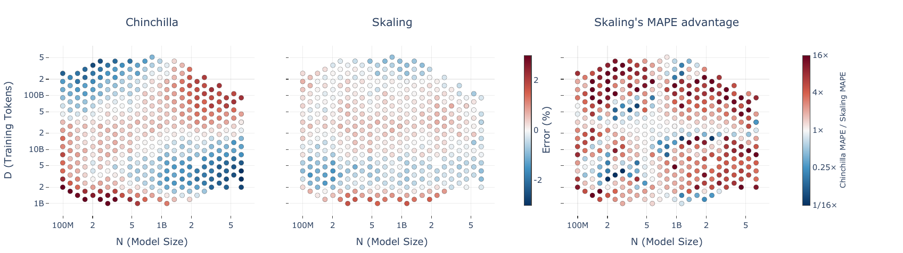
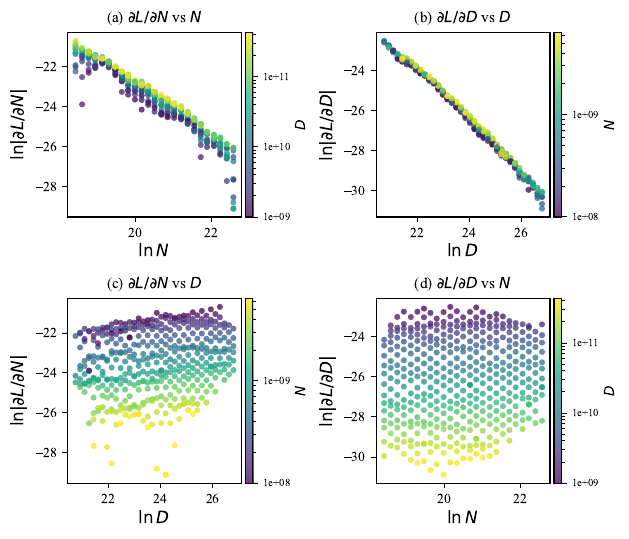
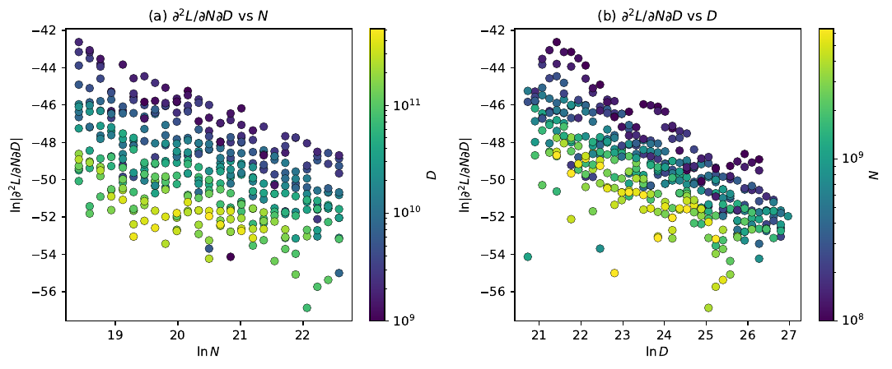
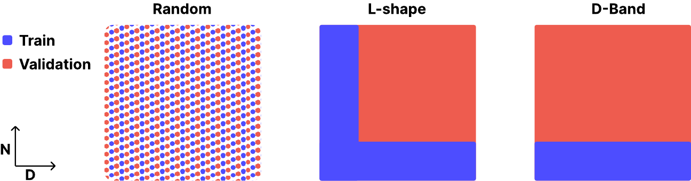
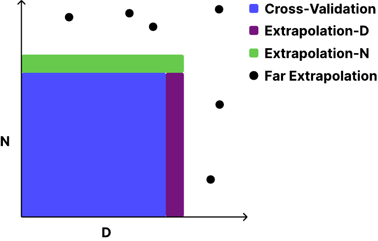
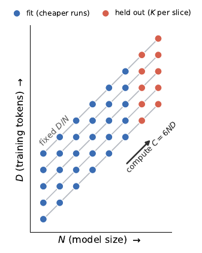
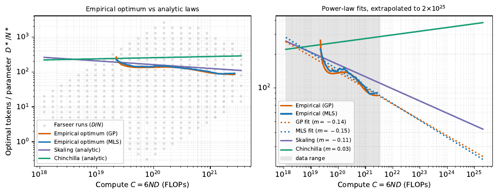

# 🖇️Skaling: 친칠라의 지수와 캐플런의 결합을 잇다

## 🧩 가법적 스케일링 법칙이 경계에서 무너진다

현대 LLM의 성공은 데이터와 모델 크기를 키울 때 성능이 예측 가능하게 좋아진다는 성질 위에 서 있고, 이 성질을 형식화한 것이 neural scaling law다(Kaplan et al., 2020; Hoffmann et al., 2022; Bi et al., 2024). 소수의 저비용 모델만으로 고비용 학습의 성능을 예측할 수 있기 때문에 연구자는 사전학습 예산, 아키텍처 차원, 자원 배분 같은 결정을 이 경험 법칙에 기대어 최적화한다.

그런데 널리 쓰이는 표준 형태에는 구조적 결함이 있다(Li et al., 2025a; Ardalani et al., 2026). 원래 Kaplan et al. (2020)의 형태는 모델 크기와 데이터를 결합했지만, 이후 표준이 된 Chinchilla 법칙(Hoffmann et al., 2022)은 축소 가능 손실(reducible loss)을 모델 크기 항과 학습 토큰 항의 단순 합으로 놓는다. 이 수학적 구조는 두 변수 사이의 엄격한 독립을 함의하고, 교차 미분(cross-derivative)을 정확히 0으로 인위적으로 강제한다. 실제로 Chinchilla는 격자 내부에서는 정확하지만 모서리로 갈수록 부호가 반대인 큰 오차가 자라나며, $N$과 $D$가 가장 불균형한 지점에서는 몇 퍼센트에 이른다. 이는 $N$–$D$ 상호작용을 빠뜨렸을 때 나타나는 안장(saddle) 모양 잔차다. 결합을 무시하기 때문에 가법적 모델은 학습 격자의 경계에서 손실을 체계적으로 과소·과대 추정한다.

Figure 1은 학습된 $(N,D)$ 설정 하나하나를 점으로 찍은 세 패널이다. 가로축은 모델 크기 $N$(100M~5B 부근), 세로축은 학습 토큰 $D$(1B~500B 부근)이고, 왼쪽·가운데 패널은 부호 있는 백분율 오차를 공유 컬러바(빨강 = 과대추정, 파랑 = 과소추정, 눈금 −2, 0, 2)로 칠한다. 왼쪽 Chinchilla 패널은 저-$N$/저-$D$ 모서리와 고-$N$/고-$D$ 모서리가 붉고, 저-$N$/고-$D$와 고-$N$/저-$D$의 어긋난 모서리가 푸른 안장 패턴을 뚜렷하게 보인다. 가운데 Skaling 패널은 전체가 훨씬 옅어 대부분의 점이 0 근처에 머문다. 오른쪽 패널은 두 법칙의 오차 비($16\times$에서 절단)를 별도 컬러바로 보여 주며, 붉은 점은 Skaling이 그만큼 더 정확한 실행이다. 캡션에 따르면 Skaling은 설정의 $76\%$에서 이기고(중앙값 $2.2\times$, 그 중 3분의 1에서는 $\geq\!4\times$), 가장 큰 이득은 값싼 가장자리에서 난다.

이를 풀기 위한 제안이 Skaling 법칙이다. Chinchilla 형태를 최소한으로 일반화해 모델 크기와 데이터 사이에 결합 지수 하나만 도입하고, 가법적 Chinchilla가 버렸던 Kaplan 형태의 상호작용을 되살린다. 파라미터를 하나만 더 쓰면서도 여러 교차검증 전략에 걸쳐 외삽 MAPE를 Chinchilla 대비 $1.5$–$3\times$ 줄인다. 나아가 이 함수 형태는 효율적인 "L자(L-shape)" 프로파일링 전략을 가능하게 한다. 연산 격자의 값싼 가장자리에만 학습을 집중해, 작은 모델에서 데이터 양을 훑고(학습 토큰 $D$를 변화, D-band) 적은 고정 데이터에서 모델 크기를 훑으면(모델 크기 $N$을 변화, N-band), Skaling은 전체 격자에 적합한 Chinchilla와 맞먹는 예측 정확도를 최대 $10\times$ 적은 연산으로 얻는다.

기여는 두 가지다. 첫째, 결합된 스케일링 형태로서의 Skaling — 모델 크기와 데이터 양 사이에 상호작용 지수 하나를 도입해 가법 법칙의 경계 편향을 교정한다. 둘째, 희소 프로파일링 격자 — Skaling의 예측 정확도가 더 효과적인 표본 추출 방식에서도 보존되어, 프로파일링 연산을 $\sim\!10\times$ 줄이는 L자 격자를 가능하게 한다.

## 🔬 손실 표면은 실제로 크기와 데이터를 결합한다

함수 형태를 고르기 전에, 모델 크기와 학습 데이터가 상호작용하는지를 데이터에 직접 묻는다. 손실 표면을 그 도함수로 탐침하는데, 도함수는 Moving least squares(MLS) 추정기(Lancaster and Salkauskas, 1981)로 추정한다. 격자가 로그 간격이라 MLS는 로그 기울기를 돌려주므로 실공간 도함수로 변환한다.

$$\frac{\partial L}{\partial N}=\frac{L}{N}\frac{\partial\ln L}{\partial\ln N},\qquad\frac{\partial L}{\partial D}=\frac{L}{D}\frac{\partial\ln L}{\partial\ln D},$$

이 변환은 축소 불가능 오차 $E$를 제거하고 축소 가능 손실의 구조만 남긴다.

1차 구조는 다음 로그-선형 진단식으로 요약한다.

$$\ln\!\left|\frac{\partial L}{\partial N}\right|=\alpha_{N}\,\ln N+\gamma_{N}\,\ln D+c_{N},\qquad\ln\!\left|\frac{\partial L}{\partial D}\right|=\gamma_{D}\,\ln N+\alpha_{D}\,\ln D+c_{D},$$ (1)

여기서 $\alpha_{N},\alpha_{D}$는 같은 변수 방향의 지배적 감쇠를, $\gamma_{N},\gamma_{D}$는 다른 축에 대한 잔여 의존성을 잡는다. 이 식은 스케일링 법칙이 아니라 진단 도구로만 쓴다. Figure 2(a,b)에서 같은 변수 투영은 거의 선형이고 $\alpha_{N}\approx\alpha_{D}\approx-1.3$이므로 주변 도함수는 대략 거듭제곱 법칙으로 감쇠한다. 교차 기울기는 작아서 $\gamma_{N}\approx 0.13$, $\gamma_{D}\approx 0.07$이고, 따라서 1차에서는 표면이 거의 분리 가능해 보인다. 다만 1차 투영만으로는 더 약한 상호작용을 배제할 수 없다.

Figure 2는 Farseer 데이터에서 Equation 1의 1차 도함수 구조를 로그-로그 축으로 그린 네 패널이며, 컬러바는 교차 변수를 나타낸다. 위쪽 두 패널은 같은 변수 투영으로, (a) $\ln|\partial L/\partial N|$ 대 $\ln N$과 (b) $\ln|\partial L/\partial D|$ 대 $\ln D$ 모두 뚜렷하게 우하향하는 선형 띠를 이룬다 — 특히 (b)는 폭이 매우 좁은 직선 밴드다. 아래쪽 두 패널은 교차 변수 투영으로, (c) $\ln|\partial L/\partial N|$ 대 $\ln D$와 (d) $\ln|\partial L/\partial D|$ 대 $\ln N$이며, 지배적인 구조는 같은 변수 의존성이 만들어 낸 수평 띠들이고 교차 기울기 $\gamma_{N},\gamma_{D}$는 작게 남는다.

결정적인 검사는 혼합 미분이다. 어떤 가법 법칙 $L=f(N)+g(D)+E$든 $f$와 $g$로 무슨 거듭제곱 법칙을 골라도 $\partial^{2}L/\partial N\partial D=0$을 항등적으로 만족한다. Figure 3에서 추정된 혼합 미분은 격자 전역에서 0이 아니고, 그 자체의 거듭제곱 감쇠를 갖는다.

$$\ln\!\left|\frac{\partial^{2}L}{\partial N\,\partial D}\right|=a\,\ln N+b\,\ln D+c,$$ (2)

여기서 $a\approx b\approx-1.1$이며 부호는 주로 *음수*다. 즉 $N$과 $D$를 함께 키우면 어느 하나만 키울 때보다 손실이 더 많이 내려가는 시너지가 있고, 가법 법칙은 이를 표현할 수 없다. 이것이 Chinchilla의 가법적 합을 결합 지수 하나로 대체할 동기가 된다.

Figure 3은 국소 이차 적합의 2차 항에서 얻은 $|\partial^{2}L/\partial N\partial D|$를 로그 스케일로 그린 두 패널이다. (a)는 $\ln N$에 대한 의존성을 $D$로 색칠했고, (b)는 $\ln D$에 대한 의존성을 $N$으로 색칠했다. 두 패널 모두 점구름이 축이 커질수록 아래로 기울고, (a)에서 세로축은 대략 −42에서 −57 범위에 걸치며(축에서 읽은 근사값) 낮은 $D$의 점이 위쪽, 높은 $D$의 점이 아래쪽에 놓인다. 가법 법칙은 이 값이 0이라고 예측하지만, 추정치는 격자 전역에서 0이 아니다.

## 🧮 Skaling 형태: 바깥 지수 하나로 결합한다

스케일링 법칙 문헌을 지탱하는 두 함수 형태는 모델 크기와 데이터를 어떻게 결합하는가에서 갈린다. 널리 쓰이는 Chinchilla 법칙(Hoffmann et al., 2022)은 둘을 완전히 분리한다. 서로 독립인 내부 지수 $\alpha$와 $\beta$를 갖는 두 항을 더하고, 여기에 자유로운 축소 불가능 상수 $E$를 얹는다. 수학적으로 편하지만 이 순수 가법 구조는 교차 미분 $\partial^{2}L/\partial N\partial D$를 항등적으로 0으로 만들어 $N$과 $D$가 상호작용하지 않는다고 암묵적으로 가정한다. 더 앞선 Kaplan 형태(Kaplan et al., 2020)는 정반대다.

$$L(N,D)=\bigl[(N_{c}/N)^{\alpha_{N}/\alpha_{D}}+D_{c}/D\bigr]^{\alpha_{D}}$$

여기서 바깥 지수 $\alpha_{D}$가 Skaling의 $k$ 역할을 하지만, Kaplan은 추가로 내부 항들을 비 $\alpha_{N}/\alpha_{D}$로 묶어 버려 축별 감쇠율이 더 이상 독립이 아니다.

Skaling은 두 패러다임을 잇는다. Chinchilla의 해석 가능한 기본 항과 독립적인 내부 지수를 유지하되, Kaplan을 따라 그 합을 자유로운 바깥 지수 $k$ 하나로 거듭제곱한다.

$$L(N,D)=\left(\frac{A}{N^{\alpha}}+\frac{B}{D^{\beta}}\right)^{k}+E$$ (3)

이 파라미터 하나가 두 선행 형태 사이를 보간한다. $k=1$에서 Skaling은 순수 가법적 Chinchilla를 그대로 회복하고, $k\neq 1$이면 Kaplan식 결합과 0이 아닌 교차 미분을 되살린다. 결정적으로 Kaplan과 달리 Skaling은 이 결합을 바깥 지수 $k$로 이루면서 Chinchilla의 독립적 내부 지수를 보존한다. 유연성이 늘어나도 가법 법칙의 바람직한 성질 두 가지는 유지된다. 첫째, $k>0$이므로 함수는 $N$과 $D$ 양쪽에서 *엄격히 감소*한다 — 용량이나 데이터를 더해서 예측 손실이 올라가는 일은 없다. 둘째, Chinchilla의 구조를 보존한다. 지수 $k$는 두 원천 항이 최종 손실로 *합쳐지는* 방식을 지배할 뿐이므로, 결합 기여가 더는 가법적으로 분리되지 않아도 각 항은 개별 해석 가능성을 유지한다.

이 구조의 실용적 이득은 연산 배분에 있다. 고정 예산 $C$ 아래 손실을 최소화하는 문제는 가법적 Chinchilla와 같은 정상성 조건으로 환원되므로, Skaling은 Chinchilla의 닫힌 형태 compute-optimal 배분을 그대로 물려받는다. 최적 토큰-대-파라미터 비 $D^{*}/N^{*}$는 닫힌 형태를 유지하고 $\alpha\approx\beta$일 때 스케일에 걸쳐 일정하게 남는다. 다만 대수식이 동일해도 실제로 나오는 최적 비는 다르다. 적합된 파라미터 $A$, $B$, $\alpha$, $\beta$가 두 함수 형태 사이에서 이전되지 않기 때문이다.

이 최적 비를 정확히 알아내는 일은 기본 아키텍처 결정을 좌우하므로 중요하다. DeepSeek(Bi et al., 2024) 같은 프런티어 모델은 보통 토큰-대-파라미터 비를 고정해 두므로, 최적이 아닌 학습의 성능 손해를 정량화하려면 참 최적값을 알아야 한다. Chinchilla가 예측하는 최적 비는 Skaling의 것과 크게 벌어져 프런티어 연산 스케일에서는 100배 차이까지 누적된다. 경험적 측정에 대해 검증하면 Skaling이 예측한 비가 참 추세를 더 정확히 따라간다.

## 📐 L자 격자: 경계만 훑어도 표면이 복원된다

강건한 파라미터 추정을 감당 가능한 비용으로 얻으려면 실험 격자 설계가 중요하다. 표준 전체 격자는 보통 $N$과 $D$를 로그 간격의 정사각으로 뽑아 여러 자릿수를 아우른다. 그 결과 총 연산은 가장 큰 모델을 가장 긴 지평으로 학습하는 오른쪽 위 모서리에 압도적으로 쏠린다. 이런 기하학적 집중 때문에 조밀한 표본 추출은 특히 낭비다. 실험 예산의 대부분을 소수의 거대한 실행에 쓰는 대신, 더 판별력 있는 점들의 집합에 쓰는 편이 낫다.

Figure 4는 세 가지 표본 추출 전략을 도식으로 보여 준다. Random은 학습(파랑)과 검증(빨강) 점을 격자 전체에 섞어 배치하고, L-shape은 학습이 왼쪽 세로 띠와 아래쪽 가로 띠 전체를 차지해 L자를 이루며 나머지 오른쪽 위 영역이 검증이 된다. D-Band는 학습이 아래쪽 가로 띠 전체를 차지하고 그 위가 검증이다.

손실 함수의 점근 거동을 보자. 데이터 양이 커지면 추정 오차가 사라지고 손실은 크기 의존 근사 오차로 수렴한다.

$$\lim_{D\to\infty}L(N,D)=\left(\frac{A}{N^{\alpha}}\right)^{k}+E$$

따라서 $D$를 키우면 $N$ 의존 계수만 깔끔히 분리된다. 대칭적으로 모델 크기를 키우면 근사 오차가 줄면서 데이터 의존 파라미터가 분리된다.

$$\lim_{N\to\infty}L(N,D)=\left(\frac{B}{D^{\beta}}\right)^{k}+E$$

실제로는 이 이론적 극한까지 갈 필요가 없다. 한 축을 고정한 채 다른 축만 변화시키는 것만으로도 해당 감쇠율을 추적할 신호가 충분하다. L자 전략은 이 원리를 가장 낮은 연산 스케일에서 적용한다. 파라미터 공간 전체를 채우는 대신, 가장 작은 모델들에서만 데이터 양 $D$를 훑어 데이터 파라미터 $(B,\beta)$를 적합하고, 가장 짧은 학습 지평에서만 모델 크기 $N$을 훑어 크기 파라미터 $(A,\alpha)$를 적합한다. 독립적인 감쇠율을 격자 경계에 고정함으로써, 이 희소한 기하는 같은 총 연산 예산 제약 아래 전체 격자 훑기보다 $N$–$D$ 상호작용을 더 효율적으로 지도화한다.

## 🧪 평가 프로토콜: 네 가지 체제로 나눈 교차검증

고정된 단일 train-test 분할에 기대는 대신, 학습 데이터를 반복 재표집하고 그에 대응하는 홀드아웃 집합을 구성하는 교차검증 틀을 쓴다. 이렇게 하면 예측의 불확실성을 명시적으로 정량화하고, 적합 파라미터의 분산을 평가하며, 보지 못한 스케일로의 외삽 신뢰성을 시험할 수 있다. 각 폴드에서 평가 집합은 다음처럼 나뉜다.

- **Validation (내삽):** 학습 격자의 경계 안쪽에서 무작위로 빼놓은 점들.
- **Extrapolation N:** 활성 학습 집합을 넘는 더 큰 모델 크기의 점들로, 더 큰 아키텍처에 대한 예측을 모사한다.
- **Extrapolation D:** 더 큰 데이터 양의 점들로, 늘어난 학습 지평에 대한 예측을 시험한다.
- **Far Extrapolation:** 가장 어려운 체제로, 가장 큰 모델을 가장 큰 데이터로 학습한 실행들이며 $N$과 $D$ 양쪽 경계를 완전히 벗어나 있다.

Figure 5는 이 평가 체제들을 $N$–$D$ 평면에 도식화한다. 왼쪽 아래 큰 직사각형이 Cross-Validation 영역이고, 그 오른쪽 가장자리의 좁은 세로 띠가 Extrapolation-D, 위쪽 가로 띠가 Extrapolation-N이며, 이 영역들 바깥에 흩어진 여섯 개의 검은 점이 Far Extrapolation이다.

모든 폴드에서 모든 평가 집합에 대해 MAPE를 보고하고, 결정계수 $R^{2}$는 내삽 집합에 대해서만 보고한다. 평가 집합 $\mathcal{S}$에서 실행 $i$의 측정 손실이 $L_{i}$이고 적합된 법칙의 예측이 $\hat{L}_{i}$일 때 MAPE는 평균 절대 상대 편차다.

$$\mathrm{MAPE}(\mathcal{S})\;=\;\frac{100}{\lvert\mathcal{S}\rvert}\sum_{i\in\mathcal{S}}\frac{\bigl\lvert\hat{L}_{i}-L_{i}\bigr\rvert}{L_{i}}\quad[\%].$$ (4)

$R^{2}$를 내삽에만 제한하는 이유는, 외삽 집합이 격자의 좁고 다소 임의적인 조각을 덮는 소수의 점만 담고 있어서다. $R^{2}$는 오차를 홀드아웃 타깃의 분산으로 정규화하므로 거기서는 불안정하고 정보가 없어지지만(종종 작거나 크게 음수), MAPE는 모든 체제에서 직접 비교 가능하게 남는다. 폴드를 모아 각 지표의 평균과 분산을 함께 보고한다.

## 🚀 등비율 슬라이스를 따른 연산 외삽

프런티어 연구소들은 거대한 사전학습 실행의 성능을 투사할 때 거의 전적으로 1차원 연산 거듭제곱 법칙에 기댄다. DeepSeek(Bi et al., 2024)이 보여 준 것처럼 이런 모델들은 보통 고정된 토큰-대-파라미터 비를 따라 스케일되므로, 이 운영 광선을 따라 연산을 외삽하는 것은 어떤 스케일링 형태에도 흥미로운 비교점이 된다. 앞선 교차검증이 $N$–$D$ 격자를 포괄적으로 지도화했다면, 여기서 다루는 것은 엄격히 운영적인 질문이다. 전역적으로 한 번 적합된 단일 법칙이 값싼 저연산 데이터만으로 가장 비싼 실행을 신뢰성 있게 예측할 수 있는가.

Figure 7은 이 설정을 도식으로 보여 준다. $N$–$D$ 평면에서 고정된 $D/N$을 따라 왼쪽 아래에서 오른쪽 위로 오르는 다섯 개의 평행 대각 슬라이스가 있고, 값싼 저연산 쪽(파랑)이 적합에 쓰이며 오른쪽 위 고연산 쪽(빨강, 슬라이스당 $K$개)이 홀드아웃이다. 대각 화살표에는 연산이 $6ND$라고 표시되어 있다.

이 시나리오를 모사하기 위해 실행들을 토큰-대-파라미터 비 $D/N$이 일정한 등비율 슬라이스로 묶는다. 각 슬라이스 안에서 연산이 가장 큰 $K$개 점을 홀드아웃한다($K{=}8$). 모든 스케일링 법칙은 남은 저연산 점들을 모든 슬라이스에 걸쳐 합친 집합 위에서 *한 번만* 재적합되고, 그다음 홀드아웃된 고연산 실행에서 평가된다. 이렇게 하면 각 함수 형태가 정확히 같은 학습 집합을 보게 되어 엄밀한 전역 비교가 된다. 강한 기준선으로 각 슬라이스 안에서만 독립적으로 단일 거듭제곱 법칙 $L=A\,C^{a}+E$를 적합하는 *per-ratio*를 추가하는데, DeepSeek 방법론(Bi et al., 2024)을 재현한 것이다. 이 per-ratio 기준선은 하나의 레시피에 크게 맞춰져 있어 결합적 $N$–$D$ 배분에는 정보를 줄 수 없지만, 고정된 광선을 따라 전용 1차원 연산 법칙이 얼마나 잘 외삽할 수 있는지에 대한 경험적 상한 역할을 한다.

## ⚙️ 실험 설정

**데이터.** 모든 스케일링 법칙은 두 개의 사전학습 실행 격자 위에서 적합·평가된다.

Farseer(Li et al., 2025a)는 $404$개 $(N,D)$ 설정의 최종 검증 손실을 기록하며, $25$개 모델 크기($100$M~$6.4$B 파라미터)와 $55$개 데이터 예산($1$B~$512$B 토큰)에 걸치고 연산은 $1.6\times 10^{18}$에서 $4.1\times 10^{21}$ FLOPs다. 모든 모델은 시퀀스 길이 $2048$을 쓴다. 이 격자에서 세 평가 집합을 홀드아웃한다. *Extrapolation $N$*은 가장 큰 모델 크기 $3$개($4.5$B–$6.4$B, $36$점), *Extrapolation $D$*는 남은 각 모델 크기별 상위 $3$개 데이터 예산($66$점), *Far extrapolation*은 두 축 모두를 훌쩍 넘는 더 큰 스케일의 추가 실행 $7$개($2.3$B–$25$B 파라미터를 $126$B–$453$B 토큰으로 학습)다. 적합에 쓰인 나머지 $302$개 설정의 총합은 $\sim\!5.0\times 10^{22}$ FLOPs다.

SK-Grid는 저자들 자신의 학습 실행 격자로, $15$개 모델 크기($134$M~$4.9$B)와 $16$개 데이터 예산($316$M~$316$B 토큰)에 걸친 $134$개 설정이며 연산은 $9.0\times 10^{16}$에서 $9.9\times 10^{20}$ FLOPs다. 같은 홀드아웃 방식으로 Extrapolation $N$에 $7$점($2.8$B–$4.9$B), Extrapolation $D$에 $33$점, far extrapolation에 $\sim\!10^{22}$ FLOPs의 실행 $3$개($5.8$B–$10.8$B 파라미터)가 나온다. 적합 격자 총합은 $\sim\!3.1\times 10^{21}$ FLOPs다.

**옵티마이저.** 모든 스케일링 법칙은 로그 공간의 Huber loss를 L-BFGS-B에 basin-hopping과 autograd를 붙여 최소화해 적합한다.

**기준선.** 가장 널리 쓰이는 두 축소 가능 손실 형태, 즉 가법적 Chinchilla 법칙(Hoffmann et al., 2022)과 파라미터가 더 많은 Farseer 법칙(Li et al., 2025a)과 비교한다. 모든 법칙을 같은 옵티마이저와 같은 로그 공간 목적함수로 적합해, 예측 정확도의 차이가 적합 절차가 아니라 함수 형태를 반영하도록 한다.

**학습.** 격자의 모델들은 StepLaw 하이퍼파라미터 처방(Li et al., 2025b)을 따라 학습되며, 이는 학습률과 배치 크기를 모델 크기와 토큰 예산의 함수로 정한다. 모든 $(N,D)$에서 거의 최적인 설정을 쓰면 측정된 손실이 하이퍼파라미터 미스튜닝이 아니라 아키텍처의 스케일링 거동을 반영하게 되어, 스케일링 법칙 적합에 깨끗한 표적이 된다.

## 📊 결과

### 경계 오차

가장 뚜렷한 이득은 격자 경계에서 난다. 내부 내삽은 가법적 Chinchilla도 이미 정확하지만, 단일 축 외삽과 far extrapolation 집합에서 오차가 커지고 여기서 Figure 1의 안장 모양 잔차가 가장 두드러진다. Table 1에서 Skaling은 이 경계 오차를 일관되게 줄인다. 전체 격자에서 단일 축 MAPE는 Farseer에서 $1.48$에서 $0.47$로, $1.98$에서 $0.88$로 떨어지고, SK-Grid에서는 $0.83$에서 $0.39$로, $1.44$에서 $0.58$로 떨어진다. 가장 큰 이득은 가장 불균형한 모서리에서 난다. 예를 들어 SK-Grid에서 far-extrapolation 오차는 전체 격자에서 $5.17$에서 $0.70$으로, L자 격자에서 $14.63$에서 $1.15$로 떨어지고, L자 격자의 최대-$N$ 오차는 $6.09$에서 $0.77$로 떨어진다.

### 희소 프로파일링

희소 프로파일링에서 Skaling은 정확도를 훨씬 많이 보존한다. 적합 연산이 대략 $10\times$ 적은 L자 격자만으로 학습해도, Skaling은 내삽과 단일 축 외삽에서 전체 격자 Chinchilla 기준선에 가깝거나 그보다 낫다. 반대로 Chinchilla는 같은 제약에서 크게 나빠진다. Farseer에서 내삽 MAPE가 $0.77$에서 $2.51$로 오르고, SK-Grid에서 far-extrapolation MAPE가 $5.17$에서 $14.63$으로 오른다. 즉 결합된 형태는 학습 격자가 저연산 가장자리에 집중되어도 예측 정확도를 보존하며, 이것이 희소 프로파일링 전략에 필요한 조건이다.

Table 1은 Farseer와 SK-Grid에서의 적합 품질과 예측 오차다. 각 데이터셋에 대해 내삽 결정계수 $R^{2}$($\uparrow$)와, 내삽 및 세 외삽 체제(더 큰 모델 크기 $N$, 더 큰 데이터 $D$, 둘 모두를 넘는 far)에서의 MAPE(%, $\downarrow$; 5개 CV 폴드에 대한 평균 $\pm$ 표준편차)를 전체 격자와 희소 L자 격자에 대해 보고한다(격자별 총 학습 FLOPs는 패널 헤더에 표시). $R^{2}$는 내삽 집합에서만 보고한다. 각 패널 내에서 열별 최고값이 굵게 표시되어 있다.

|  | Farseer data |  |  |  |  | SK-Grid data |  |  |  |  |
|----|----|----|----|----|----|----|----|----|----|----|
| Law | $R^{2}$ | Interp. | Ext. $N$ | Ext. $D$ | Far | $R^{2}$ | Interp. | Ext. $N$ | Ext. $D$ | Far |
| *Full grid* | $5.0\times 10^{22}$ FLOPs |  |  |  |  | $3.1\times 10^{21}$ FLOPs |  |  |  |  |
| Chinchilla | $0.995$ | $0.77{\pm}0.04$ | $1.48{\pm}0.03$ | $1.98{\pm}0.08$ | $2.46{\pm}0.19$ | $0.992$ | $0.81{\pm}0.14$ | $0.83{\pm}0.11$ | $1.44{\pm}0.03$ | $5.17{\pm}0.28$ |
| Farseer | $0.982$ | $1.73{\pm}0.45$ | $2.37{\pm}0.08$ | $4.13{\pm}1.36$ | $2.43{\pm}1.93$ | $0.967$ | $1.66{\pm}0.32$ | $0.90{\pm}0.49$ | $4.45{\pm}0.21$ | $3.98{\pm}1.25$ |
| Skaling | $\mathbf{0.998}$ | $\mathbf{0.41{\pm}0.05}$ | $\mathbf{0.47{\pm}0.03}$ | $\mathbf{0.88{\pm}0.06}$ | $\mathbf{2.31{\pm}0.18}$ | $\mathbf{0.998}$ | $\mathbf{0.33{\pm}0.11}$ | $\mathbf{0.39{\pm}0.05}$ | $\mathbf{0.58{\pm}0.07}$ | $\mathbf{0.70{\pm}0.39}$ |
|  |  |  |  |  |  |  |  |  |  |  |
| *L-shape* | $5.1\times 10^{21}$ FLOPs |  |  |  |  | $6.5\times 10^{20}$ FLOPs |  |  |  |  |
| Chinchilla | $0.954$ | $2.51{\pm}0.07$ | $4.32{\pm}0.13$ | $3.29{\pm}0.11$ | $9.82{\pm}0.48$ | $0.955$ | $2.19{\pm}0.10$ | $6.09{\pm}0.24$ | $3.63{\pm}0.13$ | $14.63{\pm}0.39$ |
| Farseer | $0.974$ | $1.81{\pm}1.23$ | $2.07{\pm}1.72$ | $2.52{\pm}1.95$ | $2.37{\pm}1.33$ | $0.987$ | $0.82{\pm}0.52$ | $1.19{\pm}0.82$ | $2.66{\pm}2.42$ | $4.64{\pm}1.31$ |
| Skaling | $\mathbf{0.995}$ | $\mathbf{0.85{\pm}0.10}$ | $\mathbf{0.89{\pm}0.23}$ | $\mathbf{1.35{\pm}0.20}$ | $\mathbf{1.51{\pm}0.67}$ | $\mathbf{0.998}$ | $\mathbf{0.33{\pm}0.03}$ | $\mathbf{0.77{\pm}0.44}$ | $\mathbf{0.55{\pm}0.08}$ | $\mathbf{1.15{\pm}0.53}$ |

### 내삽만으로는 부족하다

높은 내삽 적합 품질은 스케일링 법칙을 검증하기에 충분하지 않다. Chinchilla는 전체 격자에서 강한 내삽 $R^{2}$를 얻지만(Farseer $0.995$, SK-Grid $0.992$), 격자 경계에서의 외삽 오차는 Skaling의 몇 배다. 따라서 문제의 실패 양상은 내부에 대한 나쁜 적합이 아니라, 관측 영역 바깥으로 손실 표면이 어떻게 휘는지를 체계적으로 잘못 예측하는 것이다.

### 안정적인 결합

적합된 파라미터가 경계 예측이 개선되는 이유를 설명해 준다. Table 2의 모든 격자에서 Skaling은 가법적 경우 $k=1$로 되돌아가지 않고 1보다 작은 결합 지수 $k\approx 0.31$–$0.45$를 복원한다. 적합된 축소 불가능 손실은 Chinchilla보다 체계적으로 낮고, Farseer 데이터에서는 거의 사라진다. 전체 격자에서 $0.45$에서 $0.03$으로, L자에서 $0.59$에서 $0.05$로 내려가며, SK-Grid에서는 여전히 상당하다($1.75$에서 $1.14$). 저자들은 $E\approx 0$을 손실 바닥이 사라진 것으로 읽지 않는다. 손실이 평평해지는 방식을 정하는 두 양, 즉 결합 $k$와 바닥 $E$는 서로 상쇄 관계다. $k<1$이면 오목한 바깥 사상이 결합된 축소 가능 항을 큰 스케일에서 더 천천히 감쇠하게 만들어, 가법 법칙이라면 더 큰 $E$로만 표현할 수 있는 곡률을 흡수할 수 있다. 저자들의 실행 중 어느 것도 손실이 포화하는 스케일에 도달하지 않기 때문에, 데이터는 총 손실은 고정하지만 감쇠하는 항과 상수 바닥 사이의 이 분할은 고정하지 못하고, Skaling은 그 모호성을 $E$를 아래로 밀어내는 쪽으로 해소한다(Farseer 데이터에서는 거의 0까지). $E$를 빼면 모든 파라미터가 각 적합 안에서 정밀하게 결정되고 폴드 간 표준편차가 작다. 지수와 결합은 몇 퍼센트, 진폭은 최대 $\sim\!40\%$ 수준이다.

Table 2는 Table 1 뒤의 적합 계수(5개 CV 폴드에 대한 평균 $\pm$ 표준편차)다. Chinchilla는 Skaling의 $k{=}1$ 특수 경우이며, 9개 파라미터의 Farseer 법칙은 생략되어 있다.

| Setup | Law | $A$ | $B$ | $\alpha$ | $\beta$ | $k$ | $E$ |
|----|----|----|----|----|----|----|----|
| Farseer, full | Chinchilla | $(4.8{\pm}1.2){\times}10^{1}$ | $(1.1{\pm}0.1){\times}10^{2}$ | $0.27{\pm}0.01$ | $0.24{\pm}0.00$ | $1$ | $0.45{\pm}0.01$ |
|  | Skaling | $(2.9{\pm}0.2){\times}10^{2}$ | $(6.0{\pm}0.3){\times}10^{3}$ | $0.32{\pm}0.01$ | $0.39{\pm}0.00$ | $0.41{\pm}0.01$ | $0.03{\pm}0.02$ |
| Farseer, L-shape | Chinchilla | $(2.6{\pm}0.6){\times}10^{2}$ | $(1.0{\pm}0.1){\times}10^{2}$ | $0.39{\pm}0.02$ | $0.24{\pm}0.00$ | $1$ | $0.59{\pm}0.01$ |
|  | Skaling | $(2.5{\pm}0.7){\times}10^{2}$ | $(1.7{\pm}0.4){\times}10^{3}$ | $0.32{\pm}0.01$ | $0.33{\pm}0.01$ | $0.45{\pm}0.03$ | $0.05{\pm}0.06$ |
| SK-Grid, full | Chinchilla | $(5.0{\pm}1.2){\times}10^{2}$ | $(7.1{\pm}0.8){\times}10^{2}$ | $0.34{\pm}0.01$ | $0.31{\pm}0.01$ | $1$ | $1.75{\pm}0.02$ |
|  | Skaling | $(5.3{\pm}1.8){\times}10^{6}$ | $(7.1{\pm}2.8){\times}10^{6}$ | $0.73{\pm}0.01$ | $0.63{\pm}0.01$ | $0.31{\pm}0.02$ | $1.14{\pm}0.06$ |
| SK-Grid, L-shape | Chinchilla | $(1.0{\pm}0.0){\times}10^{4}$ | $(1.7{\pm}0.4){\times}10^{3}$ | $0.52{\pm}0.00$ | $0.36{\pm}0.01$ | $1$ | $2.16{\pm}0.02$ |
|  | Skaling | $(1.0{\pm}0.0){\times}10^{7}$ | $(6.5{\pm}2.4){\times}10^{6}$ | $0.77{\pm}0.02$ | $0.63{\pm}0.01$ | $0.31{\pm}0.02$ | $1.18{\pm}0.12$ |

### 파라미터 수의 문제가 아니다

파라미터가 더 많은 Farseer 기준선은 그 자체로 경계 실패를 없애지 못한다. 자유도가 더 많은데도 Table 1의 대부분 체제에서 Skaling보다 부정확하고, 가장 큰 오차는 데이터 외삽에 몰린다(Farseer와 SK-Grid 전체 격자에서 MAPE $4.13$과 $4.45$). 이는 이득이 단순히 파라미터를 더한 결과가 아니라, 관측된 $N$–$D$ 상호작용에 귀납 편향이 맞는 함수 형태를 쓴 결과임을 시사한다. 차이의 일부는 더 풍부한 형태가 적합하기 더 어렵다는 데서 올 수도 있다. Farseer 자체 파이프라인을 포함해 여러 옵티마이저를 시도했지만 실질적으로 더 나은 적합을 얻지 못했고, 그래서 얻을 수 있었던 최선의 Farseer 결과를 보고한다.

### 결합의 세기

관측된 결합이 가법에 더 가까울 때는 이득이 약해진다. Farseer-code와 원래 Chinchilla 측정치에서는 적합된 결합이 가법에 훨씬 가깝고($k\approx 0.77$–$0.90$), 그에 따라 Skaling은 대략 Chinchilla 수준의 정확도를 낸다. 이는 중첩된 형태에서 예상되는 거동이다. $k=1$에서 Chinchilla가 회복되므로, 데이터가 결합된 표면을 지지할 때만 Skaling이 가법 법칙에서 벗어나고 그렇지 않으면 가법 적합에 가깝게 남는다.

### Farseer 데이터의 배분 프런티어

Farseer 데이터에서는 같은 상호작용이 구체적인 배분 결과를 낳는다. 수치적 손실 기울기를 이용하면 연산이 커질수록 감소하는 토큰-대-파라미터 비가 복원되고, 적합된 지수는 $-0.14$와 $-0.15$다. 이는 Skaling의 해석적 지수($-0.11$)와 일치하며 Chinchilla의 거의 평평한 예측($+0.03$)과는 부호가 반대다. 데이터보다 한 자릿수 더 나아가면 두 처방이 권장하는 토큰-대-파라미터 비는 대략 $10\times$ 차이가 난다.

### 배분 방향

이 배분 추세의 부호는 결합 형태의 보편적 귀결이 아니라 데이터셋에 따라 달라진다. Farseer에서는 적합된 Skaling 지수가 $\alpha<\beta$를 만족해 연산이 커질수록 해석적 $D^{\star}/N^{\star}$가 감소한다. 그러나 SK-Grid에서는 전체 격자와 L자 격자 모두에서 $\alpha>\beta$가 되어, 같은 닫힌 형태 최적값이 연산과 함께 토큰-대-파라미터 비를 *증가*시킨다. 따라서 견고한 결론은 결합이 대규모 배분을 바꾼다는 것이고, 그 변화의 방향은 적합된 데이터와 아키텍처에 달렸다는 것이다.

### 연산 외삽

위 교차검증이 격자의 *모서리*를 홀드아웃했다면, 이제 각 레시피에서 가장 비싼 실행을 값싼 실행으로부터 예측하는 운영적 경우를 시험한다. Table 3은 홀드아웃된 $112$개 고연산 Farseer 실행에서의 오차를 학습 체제별로($D/N$에 따라 등비율 슬라이스를 undertrained / optimal / overtrained 삼등분으로 묶어) 보고하며, 모든 법칙은 값싼 나머지에서만 재적합된다. Skaling은 모든 체제와 전체에서 최고의 *전역* 법칙이고(pooled MAPE $0.60{\pm}0.27\%$, 가법적 Chinchilla 대비 $3.9\times$ 감소이며 파라미터가 훨씬 많은 Farseer 법칙보다도 낮다), 가장 안정적이다 — 어떤 체제에서도 오차가 $0.9\%$를 넘지 않는다. 반면 Chinchilla는 체제 의존성이 강하고 optimal 대역에서 모든 법칙 중 가장 약해($3.47\%$), pooled 수치가 어디서 실패하는지를 가린다. Skaling을 앞서는 유일한 참조는 *per-ratio* 거듭제곱 법칙이며 그것도 최적 근처에서만이다($0.77$ 대 $0.88\%$). 거기서는 고정 비를 따르는 1차원 법칙이 자연히 잘 작동하지만, 이 법칙은 레시피별로 따로 적합되므로 결합적 $N$–$D$ 배분에는 정보를 줄 수 없다. Chinchilla는 $2.3\%$를 넘고, 이는 이득이 프로토콜이 아니라 함수 형태에서 온다는 것을 확인해 준다.

Table 3은 Farseer에서의 연산 외삽을 학습 체제별로 나눈 것이다. 등비율 슬라이스를 undertrained($D/N{=}1.8$–$7$), optimal($10$–$40$), overtrained($56$–$158$) 삼등분으로 묶었고, 전체 $14$개 설정도 함께 보고한다. 연산이 가장 큰 $112$개 실행(슬라이스당 $8$개 홀드아웃)에 대한 예측 오차이며, 모든 법칙은 값싼 실행에서만 재적합했다. $R^{2}$는 그룹별 평균이고, MAPE(%)는 그룹 내 슬라이스에 대한 평균 $\pm$ 표준편차다. *Per-ratio*는 각 슬라이스 안에서 독립적으로 적합한 단일 거듭제곱 법칙이다.

|  | Undertrained |  | Optimal |  | Overtrained |  | All setups |  |
|----|----|----|----|----|----|----|----|----|
| Law | $R^{2}$ | MAPE | $R^{2}$ | MAPE | $R^{2}$ | MAPE | $R^{2}$ | MAPE |
| Power law (per-ratio) | $0.94$ | $1.32{\pm}0.87$ | $0.96$ | $\mathbf{0.77{\pm}0.39}$ | $0.97$ | $0.86{\pm}0.75$ | $0.95$ | $0.99{\pm}0.69$ |
| Chinchilla | $0.89$ | $1.52{\pm}0.80$ | $0.47$ | $3.47{\pm}0.65$ | $0.87$ | $1.94{\pm}0.66$ | $0.74$ | $2.34{\pm}1.11$ |
| Farseer | $\mathbf{0.99}$ | $0.46{\pm}0.20$ | $0.94$ | $1.20{\pm}0.20$ | $\mathbf{0.99}$ | $0.73{\pm}0.23$ | $0.97$ | $0.80{\pm}0.38$ |
| Skaling | $\mathbf{0.99}$ | $\mathbf{0.45{\pm}0.21}$ | $\mathbf{0.97}$ | $0.88{\pm}0.15$ | $\mathbf{0.99}$ | $\mathbf{0.42{\pm}0.15}$ | $\mathbf{0.98}$ | $\mathbf{0.60{\pm}0.27}$ |

## 🧷 도함수를 어떻게 추정했나

각 격자점에서 $\partial z/\partial x_{j}$를 두 가지 메시 프리 절차로 추정한다. 국소 moving least-squares 추정기(MLS)와 전역 Gaussian process 추정기(GP)다.

**Moving least squares (MLS).** 국소 추정기는 질의점 $x_{\star}$ 근방에서 표면의 절단된 테일러 전개를 적합한다(Lancaster and Salkauskas, 1981). 표적점에서의 도함수를 추정하려면 손실 표면을 차수 $p$의 다변량 다항식으로 국소 근사한다. 이 접근은 테일러 전개에서 곧바로 나온다. 국소 다항식을 적합하면 그 계수가 수학적으로 함수의 각 차수 도함수에 대응한다. $x$를 공간 좌표, $\Delta x_{i}=x_{i}-x_{\star}$를 이웃 점까지의 중심화된 거리라 하면, 테일러 정리에 의해 국소 손실값은 다음처럼 전개된다.

$$z(x_{i})\approx c_{0}+g^{\top}\Delta x_{i}+\frac{1}{2}\Delta x_{i}^{\top}H\Delta x_{i}+\dots$$

여기서 전개는 차수 $p$까지의 고차 기저 항으로 이어지고, $c_{0}$는 국소 상수, 벡터 $g$는 기울기 $\nabla z(x_{\star})$, $H$는 우리가 노리는 교차 미분을 담은 헤시안이다. 이 미지수들을 동시에 풀기 위해 전개의 계수를 하나의 벡터 $c$로 펼치고, $k$개 최근접 이웃에 거리 가중 ridge 회귀로 다항식을 적합해 최적 계수 추정 $\hat{c}$를 얻는다.

$$\hat{c}=\big(\Phi^{\top}W\Phi+\lambda I\big)^{-1}\Phi^{\top}Wz$$

$\Phi$는 설계 행렬로, 각 행이 한 이웃에 대응하고 차수 $p$까지 평가된 다항 기저 항을 담는다(예: $1$, $\Delta x_{i,1}$, $\Delta x_{i,2}$, $\Delta x_{i,1}^{2}$, 상호작용 항 $\Delta x_{i,1}\Delta x_{i,2}$ 및 더 높은 차수의 조합). $W$는 $w_{i}=\exp\!\big(\!-\|\Delta x_{i}\|^{2}/\sigma^{2}\big)$인 대각 가중 행렬로 가우시안 필터 역할을 해 $x_{\star}$에 가까운 점이 국소 적합에 더 큰 영향을 주게 한다. 대역폭 $\sigma$는 이웃 반경에 따라 동적으로 스케일된다. $\lambda I$는 작은 ridge 정규화 페널티를 더해 행렬 역변환을 수치적으로 안정시키며, 흩어진 국소 점들이 고르게 분포하지 않을 때 특히 중요하다. $\hat{c}$를 풀고 나면 1차 블록에서 기울기 추정을, $\Delta x_{i,1}\Delta x_{i,2}$ 기저 항에 대응하는 계수에서 분석에 필요한 정확한 혼합 교차 미분을 그대로 읽으면 된다. MLS는 전적으로 국소 기하에 의존하므로 정확도는 국소 잡음, 선택한 이웃 크기 $k$, 다항식 차수 $p$에 자연히 민감하다.

**Gaussian process (GP).** 전역 추정기는 모든 점에 하나의 가우시안 과정을 적합하고 그 사후 평균을 닫힌 형태로 미분한다. 경험적 손실 타깃 $z\in\mathbb{R}^{n\times 1}$을 입력 좌표의 매끄러운 함수에 관측 잡음 $\sigma_{n}^{2}$이 더해진 것으로 모델링한다. 표준 GP 회귀에서 표적점 $x_{\star}$에서의 예측 로그 손실은 사후 평균으로 바로 주어진다.

$$\hat{z}(x_{\star})=\mu(x_{\star})=k(x_{\star},X)\alpha$$

여기서 $k(x_{\star},X)\in\mathbb{R}^{1\times n}$은 표적점과 $n$개 학습점 사이 커널 평가의 행벡터이고, 학습된 가중 벡터는 $\alpha=(K+\sigma_{n}^{2}I)^{-1}z\in\mathbb{R}^{n\times 1}$이며 $K\in\mathbb{R}^{n\times n}$은 학습 입력의 밀집 공분산 행렬, $I$는 $n\times n$ 단위 행렬이다. GP의 핵심 장점은 미분이 선형 연산자라는 점, 즉 GP의 도함수가 다시 GP라는 점이다. 가중치 $\alpha$가 $x_{\star}$에 무관하므로 도함수는 $1\times n$ 행벡터에만 적용된다.

$$\widehat{\frac{\partial z}{\partial x_{j}}}(x_{\star})=\frac{\partial\hat{z}(x_{\star})}{\partial x_{j}}=\frac{\partial k(x_{\star},X)}{\partial x_{j}}\alpha$$

표준 커널 함수는 해석적으로 미분 가능하므로 이 계산은 정확하다. 이 논문은 길이 척도 $\ell_{j}$의 Radial Basis Function(RBF) 커널을 쓰며, 그 도함수는 $\partial k(x,x^{\prime})/\partial x_{j}=k(x,x^{\prime})(x^{\prime}_{j}-x_{j})/\ell_{j}^{2}$다. 합성 커널은 표준 합·곱 규칙으로 미분할 수 있는데, 단 가법적 백색 잡음 항은 예측 커널에서 제외해야 한다. 또한 GP는 이 기울기에 대한 닫힌 형태 예측 분산을 제공해 추정 불확실성을 정량화한다. 기울기의 스칼라 사전 분산에서 관측 데이터로 얻은 정보를 빼서 계산한다.

$$\mathrm{Var}\!\left[\frac{\partial z}{\partial x_{j}}(x_{\star})\right]=\left.\frac{\partial^{2}k(x,x^{\prime})}{\partial x_{j}\,\partial x^{\prime}_{j}}\right|_{x=x^{\prime}=x_{\star}}-\frac{\partial k(x_{\star},X)}{\partial x_{j}}\,(K+\sigma_{n}^{2}I)^{-1}\,\frac{\partial k(X,x_{\star})}{\partial x_{j}}$$

행렬 차원은 $1\times n$ 벡터, $n\times n$ 행렬, $n\times 1$ 열벡터 $\frac{\partial k(X,x_{\star})}{\partial x_{j}}$의 곱으로 스칼라로 깔끔히 정리된다. 이웃 크기와 다항식 차수를 수동으로 조율해야 하는 MLS와 달리, GP는 관측 잡음을 명시적으로 모델링하고 주변 우도를 최대화해 길이 척도와 잡음 수준을 자동으로 조율한다.

## 🔧 왜 곱셈적 결합인가

Section 2의 0이 아닌 혼합 미분은 함수 형태를 제약한다. 1차 도함수에서 보이는 주변 거듭제곱 거동을 보존하면서 두 축을 가법적으로 분리 가능하게 만들지는 말아야 한다. Skaling 형태(Equation 3)가 이를 만족한다. $u=AN^{-\alpha}+BD^{-\beta}$라 쓰면 혼합 미분은 다음과 같다.

$$\frac{\partial^{2}L}{\partial N\,\partial D}=k(k-1)\,u^{k-2}\,\alpha A\,N^{-\alpha-1}\,\beta B\,D^{-\beta-1}.$$

따라서 $k=1$은 가법적 Chinchilla를 회복하고 혼합 미분을 0으로 강제하는 반면, $k\neq 1$이면 상호작용이 도입된다. 경험적으로 관련 있는 $0<k<1$의 경우 혼합 미분은 음수가 되어 Figure 3에서 관측된 부호와 맞는다. 동시에 1차 도함수는

$$\frac{\partial L}{\partial N}=-k\alpha A\,N^{-\alpha-1}u^{k-1},\qquad\frac{\partial L}{\partial D}=-k\beta B\,D^{-\beta-1}u^{k-1},$$

여전히 같은 변수의 거듭제곱 인자가 지배하고, 교차 변수 의존성은 공유 인자 $u^{k-1}$을 통해서만 들어온다. 그래서 Skaling은 1차에서는 거의 분리 가능해 보이면서도 데이터가 가리키는 0 아닌 혼합 미분을 허용할 수 있다.

Skaling 대신 Chinchilla를 가법적으로 유지한 채 별도의 곱 항을 덧붙이는 자연스러운 대안도 있다.

$$L=AN^{-\alpha}+BD^{-\beta}+G\,N^{-\mu}D^{-\nu}+E.$$

이 항도 0이 아닌 혼합 미분을 만들 수 있지만 부호가 곧바로 제약을 낳는다. 이 모델의 혼합 미분과 상호작용 항이 크기 도함수에 기여하는 몫은 다음과 같다.

$$\frac{\partial^{2}L}{\partial N\,\partial D}=\mu\nu\,G\,N^{-\mu-1}D^{-\nu-1},\qquad\frac{\partial L}{\partial N}\!\left(GN^{-\mu}D^{-\nu}\right)=-\,\mu\,G\,N^{-\mu-1}D^{-\nu}.$$

즉 $G$의 부호가 두 양을 서로 반대 방향으로 통제한다. 관측된 음의 혼합 미분에 맞추려면 $G<0$이 필요하다. 그런데 $G<0$이면 상호작용 항이 $\partial L/\partial N$에 양으로 기여해 모델 크기에 따른 단조 감소를 거스른다. 이는 국소적 불편에 그치지 않는다. 적합된 혼합 미분 감쇠는 $\mu\approx 0.1$을 함의하고 이는 주 크기 지수 $\alpha$보다 작아, 이 양의 기여가 선도적인 음의 항보다 $N$에 대해 더 천천히 감쇠한다. 따라서 큰 $N$과 작은 $D$에서 이 항이 지배해 $\partial L/\partial N>0$이 될 수 있고, 모델이 커질 때 손실이 증가한다고 예측하게 된다. $G>0$을 고르면 이 단조성 실패는 피하지만 혼합 미분이 양이 되어 원하던 시너지가 사라진다. 그러므로 가법적 곱 항 하나로는 단조성과 관측된 음의 상호작용을 동시에 만족시킬 수 없다.

Skaling은 상호작용을 별도의 부호 있는 항이 아니라 양의 곱셈 인자로 도입하므로 이 부호 충돌을 피한다. 그 크기 기울기는

$$\frac{\partial L}{\partial N}=-k\,\alpha A\,N^{-\alpha-1}u^{k-1},$$

모든 $k>0$에 대해 음수다. 데이터 의존성은 양의 인자 $u^{k-1}$을 통해서만 들어온다. $0<k<1$일 때 $D$를 키우면 $u$가 줄고 따라서 $u^{k-1}$이 커져 이미 음수인 크기 기울기의 크기가 커진다. 이렇게 하면 $\partial L/\partial N$의 부호를 바꾸지 않고도 $\partial^{2}L/\partial N\partial D<0$을 얻는다. 이 파라미터화에서는 단조성과 시너지가 구성상 양립한다.

같은 인자가 Figure 2의 비대칭적인 1차 기울기도 설명한다. $w_{D}=BD^{-\beta}/u$와 $w_{N}=AN^{-\alpha}/u$를 내부 합에서 데이터와 크기가 차지하는 몫이라 하자. $\ln|\partial L/\partial N|$과 $\ln|\partial L/\partial D|$를 미분하면 $\gamma_{N}=(1-k)\,\beta\,w_{D}$, $\gamma_{D}=(1-k)\,\alpha\,w_{N}$이므로 $\gamma_{N}/\gamma_{D}=(\beta/\alpha)\,(w_{D}/w_{N})$이다. 이 비는 $\beta>\alpha$이고 내부 합이 데이터 쪽으로 기울 때 1을 넘고, 결합 지수 하나만으로 측정된 $\gamma_{N}\approx 0.13>\gamma_{D}\approx 0.07$을 재현한다 — 치우친 상호작용 항이 필요 없다.

## 📈 경험적 최적 토큰-대-파라미터 비

수치 기울기는 모수적 스케일링 법칙을 적합하지 않고도 compute-optimal 배분의 경험적 추정을 준다. 고정 예산 $C=6ND$에서 가능한 설정은 하나의 등연산 곡선 위에 놓인다. 모델 크기를 키우면 토큰 수를 줄여야 하고 그 반대도 마찬가지다. 그 예산의 경험적 최적은 이 곡선 위 손실이 가장 낮은 점이다.

$$\min_{N,D}\;L(N,D)\quad\mathrm{s.t.}\quad 6ND=C.$$

미분 가능한 손실 표면의 내부 최적에 대해 라그랑지안

$$\mathcal{J}(N,D,\lambda)=L(N,D)+\lambda(6ND-C)$$

은 다음 정상성 조건을 갖는다.

$$\frac{\partial L}{\partial N}=-6\lambda D,\qquad\frac{\partial L}{\partial D}=-6\lambda N.$$

두 식을 나누면 승수가 소거되고 손실 기울기만의 조건이 남는다.

$$N\,\frac{\partial L}{\partial N}=D\,\frac{\partial L}{\partial D}\quad\Longleftrightarrow\quad\frac{\partial\ln L}{\partial\ln N}=\frac{\partial\ln L}{\partial\ln D}.$$ (5)

즉 compute-optimal 지점에서는 모델 크기를 $1\%$ 늘리는 것과 데이터를 $1\%$ 늘리는 것이 손실에 같은 부호의 같은 효과를 준다. 등연산 곡선의 접선 방향 도함수가 0이 되어야 한다는 말과 같다. 이는 제약된 정상성 조건이며, 전체 기울기가 0일 필요는 없다 — 총 연산을 늘리면 손실은 여전히 줄어들기 때문이다.

이 조건을 비모수적으로 풀기 위해 손실을 로그 좌표로 쓴다.

$$x=\ln N,\qquad y=\ln D,\qquad z(x,y)=\ln L(N,D).$$

최적 조건은 $\partial z/\partial x=\partial z/\partial y$가 되고, 이 등식을 수치 로그 기울기로 찾는다. GP와 MLS 추정기는 같은 구성으로 프런티어에 대한 완전히 독립적인 두 추정치를 준다.

GP 대리모형에서는, 경험 데이터가 이산 점이라 균형점을 격자에서 직접 찾을 수 없으므로 GP 사후 평균이 주는 연속·미분 가능한 표면 위에서 두 기울기의 차가 정확히 0이 되는 점을 추적한다. 이 연속적 영교차 경계가 임의의 연산 예산에 대한 최적 토큰-대-파라미터 비를 바로 준다. 한 예산에 대해 근이 여러 개면 예측 손실이 가장 낮은 최소를 고른다. MLS 추정치도 그 자체가 메시 프리 대리모형이므로 정확히 같은 절차를 따른다. 질의점 주변에서 $k$개 최근접 실행에 가중 다항식을 적합하고, 거기서 기울기 차를 읽어 격자 위에서 영교차를 추적한다.

두 경우 모두 $C$를 변화시키며 $D^{\star}/N^{\star}$를 추적하면 경험적 토큰-대-파라미터 비가 나오고, 이를 Farseer 데이터에서 닫힌 형태 $R_{opt}$와 비교한다. 두 독립 추정은 질적으로 일치한다. 둘 다 연산과 함께 감소하는 비를 복원하며 Skaling의 $R_{opt}$를 가깝게 따라가는 반면, Chinchilla는 거의 평평한 비를 예측한다. 각 경험적 프런티어를 거듭제곱 법칙 $D^{\star}/N^{\star}\propto C^{m}$으로 적합하면 GP는 $m\approx-0.14$, MLS는 $m\approx-0.15$로, Skaling의 지수 $-0.11$에 가깝고 Chinchilla의 $+0.03$과는 부호가 반대다. 데이터보다 한 자릿수 더 나아간 $2\times 10^{25}$ FLOPs로 외삽하면 배분은 $10\times$ 넘게 갈린다. Chinchilla는 파라미터당 $\sim\!380$ 토큰에 접근하는 반면, 경험적 적합과 Skaling 법칙은 $20$–$40$까지 떨어진다. 즉 결합은 대규모 배분에 실질적인 영향을 준다.

Figure 8은 모수적 적합 없이 복원한 Farseer의 경험적 compute-optimal 토큰-대-파라미터 비다. 최적 $D^{\star}/N^{\star}$는 로그 기울기가 균형을 이루는 지점($\partial\ln L/\partial\ln N=\partial\ln L/\partial\ln D$)에서 전역 GP 대리모형과 국소 MLS 대리모형(둘 다 연속 메시 프리 장으로 평가)으로 찾고, 같은 $(N,D)$ 데이터에 적합한 Skaling과 Chinchilla의 닫힌 형태 $R_{opt}$와 비교한다. 왼쪽 패널은 실행 구름 위에 두 경험적 최적을 얹은 것으로, 둘 다 거의 평평한 Chinchilla 예측보다 Skaling을 훨씬 가깝게 따른다. 그림에서 축으로 읽은 근사값으로, Skaling 해석 곡선은 $10^{18}$ FLOPs 부근 약 230에서 오른쪽 끝 약 105까지 내려가고 Chinchilla 곡선은 약 230에서 약 290까지 거의 평평하게 이어지며, 경험적 GP·MLS 곡선은 $10^{19}$대 후반에서 250 부근에서 시작해 오른쪽 끝에서 90 부근까지 내려간다. 오른쪽 패널은 각 경험적 프런티어의 거듭제곱 적합(점선)을 해석 법칙과 함께 $2\times 10^{25}$ FLOPs까지 외삽한 것으로(회색 음영이 데이터 범위), 경험적 지수 $-0.14$, $-0.15$가 Skaling의 $-0.11$에 가깝고 Chinchilla의 $+0.03$과 부호가 반대임을 보여 준다.

## 🧾 Compute-optimal 배분의 유도

스케일링 법칙의 일차적 효용은 주어진 연산 예산 $C$를 모델 크기 $N$과 데이터 양 $D$ 사이에 최적 배분하는 데 있다. 학습 연산 예산을 $C=6ND$로 정의하고, 이 예산 제약 아래 Equation 3의 Skaling 손실을 최소화한다. $D=\frac{C}{6N}$을 대입해 내부 가법 항을 $N$의 함수 $Z(N)=\frac{A}{N^{\alpha}}+B\left(\frac{C}{6N}\right)^{-\beta}$로 두면 목적함수는 이렇게 단순해진다.

$$L(N)=Z(N)^{k}+E$$ (6)

$N$에 대해 미분하면

$$\frac{dL}{dN}=k\cdot Z(N)^{k-1}\cdot Z^{\prime}(N)$$ (7)

$Z(N)$은 엄격히 양인 항들의 합이고 경험적 적합은 일관되게 $k>0$을 주므로 스케일 인자 $k\cdot Z(N)^{k-1}$은 0이 아니다. 따라서 손실 최소화는 엄밀히 $Z^{\prime}(N)=0$을 요구하고, 이는 정확히 가법적 Chinchilla 법칙(Hoffmann et al., 2022)의 정상성 조건이다 — Skaling은 Chinchilla의 compute-optimal 배분을 그대로 물려받는다. $Z^{\prime}(N)=-\alpha A\,N^{-\alpha-1}+\beta B\,(6/C)^{\beta}N^{\beta-1}=0$을 풀면 $N^{\alpha+\beta}=\frac{\alpha A}{\beta B}(C/6)^{\beta}$가 나오고, $D^{*}=C/(6N^{*})$를 대입하면 최적 토큰-대-파라미터 비가 나온다.

$$R_{opt}=6^{\frac{\beta-\alpha}{\alpha+\beta}}\left(\frac{\beta B}{\alpha A}\right)^{\frac{2}{\alpha+\beta}}C^{\frac{\alpha-\beta}{\alpha+\beta}}$$ (8)

이는 (Chinchilla에서 관측된 것처럼) $\alpha\approx\beta$이면 최적 비 $D/N$이 스케일에 걸쳐 일정하게 유지됨을 보여 준다. 더 넓게는, Skaling 법칙이 손실 지형의 *모양*($k$가 통제)과 최적 배분의 *위치*($Z^{\prime}(N)=0$)를 깔끔히 분리한다. 단조 바깥 사상 $x\mapsto x^{k}+E$는 손실을 재척도할 뿐 최소점을 바꾸지 않으므로, Skaling은 다루기 쉬움을 잃지 않고 표현력을 얻는다.

## 🛠️ 적합의 어려움과 설정

파라미터가 적은데도 스케일링 법칙을 경험적 손실 데이터에 적합하는 일은 놀랄 만큼 취약한 비볼록 최적화 문제다. 몇 가지 구조적 요인이 이 불안정에 기여한다. 첫째, 파라미터들이 아주 다른 수치 스케일에서 작동한다. 예컨대 계수 $A$, $B$의 큰 크기와 분수 지수 $\alpha$, $\beta$가 크게 대비되어 L-BFGS 같은 표준 기울기 기반 옵티마이저에 대해 문제를 악조건으로 만든다. 둘째, 최적화 지형이 악명 높게 평평하다. 손실이 로그적으로 감소하므로 옵티마이저가 조기에 멈추기 쉽고, 유한 차분 기울기 근사에 의존하면 더 나빠진다. 셋째, 파라미터들이 강한 상쇄 거동을 보인다. 특히 축소 불가능 손실 $E$는 다른 계수들이 쉽게 이동해 그 값을 상쇄할 수 있어서 정확히 추정하기 어렵다. 그 결과 전체 표면 적합이 거의 동일한, 서로 다른 국소 최소들의 넓은 계곡이 생긴다.

모든 법칙은 로그 공간에서 목적함수를 최소화해 적합하며, 이는 (Chinchilla에서처럼) 스케일 격차의 상당 부분을 흡수한다. 이 설정 안에서, 신중히 구성된 L-BFGS에 basin-hopping과 자동미분을 붙인 것(Besiroglu et al., 2024; Shukor et al., 2026)과 스케일 독립적이고 기울기가 필요 없는 CMA-ES가 똑같이 좋은 적합에 도달한다. 관찰되는 차이는 최종 품질이 아니라 실용성에 있다. L-BFGS는 초기화, 재시작, 로그 공간 목적함수를 신중히 조율해야 안정적으로 거기 도달하는 반면 CMA-ES는 그런 손질 없이 곧바로 같은 해에 이른다.

두 가지 전역 최적화 전략을 구현한다. 첫째, L-BFGS-B with basin-hopping은 기울기 기반 국소 옵티마이저(autograd로 해석적 기울기를 얻는 L-BFGS-B)와 다중 시작 basin-hopping 전역 탐색을 짝지으며, 시작점은 유계 파라미터 공간 위 Sobol 준난수열에서 뽑는다. 둘째, BIPOP-CMA-ES(Hansen, 2016)는 기울기가 필요 없는 진화 전략으로, 두 배 개체군 크기, active CMA, 9회 BIPOP 재시작을 쓴다. 둘 다 똑같이 좋은 적합에 도달하지만, 논문에 보고된 모든 결과는 문헌에서 더 흔하다는 이유로 L-BFGS-B with basin-hopping을 쓴다(Besiroglu et al., 2024; Shukor et al., 2026). 모든 법칙은 로그 공간에서 Huber loss($\delta=0.05$)를 최소화하고, 계수 $A$와 $B$는 큰 동적 범위를 흡수하기 위해 로그 스케일에서 최적화한다.

Table 4는 법칙별 파라미터 경계와 적합 설정이다. 모든 법칙은 $2000$회 basin-hopping 재시작, 로그 공간 Huber 목적함수, 해석적(autograd) 기울기를 쓴다. *Params*는 자유 파라미터 수, *Log params*는 로그 스케일에서 최적화되는 것이다. Farseer는 (Li et al., 2025a)의 ExpExpExp 파라미터화를 쓴다.

| Law | Params | Log params | Bounds |
|----|----|----|----|
| Chinchilla | 5 | $A,B$ | $A\!\in\![10^{-6},10^{4}]$, $B\!\in\![10^{-6},5{\times}10^{4}]$, $\alpha,\beta\!\in\![0,1]$, $E\!\in\![0,3]$ |
| Skaling | 6 | $A,B$ | $A,B\!\in\![10^{-6},10^{7}]$, $\alpha,\beta,k\!\in\![0.01,2]$, $E\!\in\![0,3]$ |
| Farseer | 9 | — | $E\!\in\![0gr@,5]$, $s\!\in\![-10,10]$, $q\!\in\![-0.5,0.5]$, $S\!\in\![-30,10]$, $B_{c}\!\in\![-10,500]$, $b\!\in\![-2,0.5]$, $Q\!\in\![-10,15]$, $A_{c}\!\in\![-25,5]$, $a\!\in\![-0.5,0.2]$ |

(위 표의 Farseer $E$ 경계에 있는 `0gr@`는 원문 변환에 남은 깨진 문자열이며, 소스가 그렇게 적고 있어 그대로 옮긴다.)

Farseer를 다른 모든 법칙과 같은 공통 직접 옵티마이저로 적합한 이유는 비교가 적합 레시피가 아니라 함수 형태를 반영하게 하려는 것이고, 동시에 실용적 필요이기도 하다. Farseer의 원래 파이프라인은 고정된 $N$에서 연속된 $D$ 사이의 차분으로 구성 요소를 추정하는데, 이는 모델 크기마다 균등 간격의 $D$ 값이 여럿 필요하다. 희소한 L자 격자와 흩어진 비격자 데이터셋은 이를 제공하지 못하고, 완전히 격자화된 데이터셋에서도 교차검증 홀드아웃이 점을 제거해 파이프라인이 의존하는 차분 구조를 깨뜨린다. 직접 최적화만이 모든 설정에 균일하게 적용된다. 같은 교차검증 아래 원래 파이프라인을 돌려도 유의하게 나은 예측을 주지 못했다. 그 오차는 더 큰 $D$ 외삽을 뺀 모든 체제에서 직접 적합의 폴드 간 표준편차 안에 있었고, 그 외삽에서도 Skaling과 동등한 수준에 그쳤다.

## 🗂️ 추가 데이터셋

교차검증 프로토콜을 두 데이터셋에 더 반복한다. *Farseer-code*는 Farseer 격자의 코드 도메인 대응물로(Li et al., 2025a), $9$개 모델 크기($201$M–$3.18$B)와 $20$개 토큰 예산($2$B–$128$B)에 걸친 $117$개 실행이며 연산 $C{=}6ND$는 $2.4\times 10^{18}$에서 $2.4\times 10^{21}$ FLOPs다. 격자 구조라서 전체 격자와 L자 분할 모두 가능하고, 더 큰 $N$·더 큰 $D$ 홀드아웃은 격자 위쪽 가장자리의 가장 큰 모델 크기와 가장 긴 토큰 지평이다. *Chinchilla* 손실 측정치(Besiroglu et al., 2024)는 $57$M–$16.2$B 파라미터와 $245$M–$318$B 토큰($1.4\times 10^{18}$–$1.3\times 10^{22}$ FLOPs)을 덮는 $245$개의 흩어진 $(N,D)$ 점이다. 규칙적 격자 위에 있지 않아 전체 격자(random) 분할만 적용되고(L자 없음), 최대 $N$($16.2$B)과 최대 $D$($318$B 토큰) 점이 두 외삽 집합을 이룬다.

Table 5는 이 두 데이터셋에서의 적합 품질과 예측 오차로, Table 1의 프로토콜을 따른다.

|  | Farseer-code (full) |  |  |  | Farseer-code (L-shape) |  |  |  | Chinchilla (full) |  |  |  |
|----|----|----|----|----|----|----|----|----|----|----|----|----|
| Law | $R^{2}$ | Interp. | Ext. $N$ | Ext. $D$ | $R^{2}$ | Interp. | Ext. $N$ | Ext. $D$ | $R^{2}$ | Interp. | Ext. $N$ | Ext. $D$ |
| Chinchilla | $0.998$ | $0.28{\pm}0.07$ | $0.93{\pm}0.15$ | $0.60{\pm}0.04$ | $0.991$ | $0.59{\pm}0.06$ | $1.93{\pm}0.18$ | $1.60{\pm}0.12$ | $\mathbf{0.993}$ | $0.63{\pm}0.15$ | $\mathbf{1.16{\pm}0.33}$ | $0.63{\pm}0.06$ |
| Farseer | $0.983$ | $0.89{\pm}0.12$ | $1.01{\pm}0.04$ | $3.74{\pm}0.23$ | $0.993$ | $0.53{\pm}0.16$ | $\mathbf{0.96{\pm}0.27}$ | $\mathbf{0.91{\pm}0.68}$ | $0.955$ | $1.27{\pm}0.55$ | $1.23{\pm}1.10$ | $1.12{\pm}0.21$ |
| Skaling | $\mathbf{0.999}$ | $\mathbf{0.24{\pm}0.09}$ | $\mathbf{0.67{\pm}0.19}$ | $\mathbf{0.26{\pm}0.06}$ | $\mathbf{0.995}$ | $\mathbf{0.45{\pm}0.12}$ | $1.39{\pm}0.49$ | $1.14{\pm}0.41$ | $\mathbf{0.993}$ | $\mathbf{0.61{\pm}0.14}$ | $1.28{\pm}0.29$ | $\mathbf{0.51{\pm}0.03}$ |

Table 6은 이에 대응하는 계수다. 같은 패턴이 유지되어 Skaling은 $k<1$과 Chinchilla보다 작은 $E$를 적합하지만, 여기서는 결합이 더 약하고($k\approx 0.77$–$0.90$) 이는 Table 5의 더 엇갈린 정확도 이득과 부합한다.

| Setup | Law | $A$ | $B$ | $\alpha$ | $\beta$ | $k$ | $E$ |
|----|----|----|----|----|----|----|----|
| Farseer-code, full | Chinchilla | $(1.8{\pm}1.1){\times}10^{3}$ | $(5.6{\pm}0.8){\times}10^{2}$ | $0.48{\pm}0.03$ | $0.34{\pm}0.01$ | $1$ | $0.65{\pm}0.01$ |
|  | Skaling | $(4.2{\pm}2.8){\times}10^{3}$ | $(2.0{\pm}0.2){\times}10^{3}$ | $0.52{\pm}0.03$ | $0.40{\pm}0.01$ | $0.77{\pm}0.03$ | $0.60{\pm}0.02$ |
| Farseer-code, L-shape | Chinchilla | $(5.4{\pm}1.2){\times}10^{3}$ | $(1.5{\pm}0.1){\times}10^{3}$ | $0.55{\pm}0.01$ | $0.39{\pm}0.00$ | $1$ | $0.71{\pm}0.00$ |
|  | Skaling | $(4.1{\pm}1.4){\times}10^{3}$ | $(2.1{\pm}0.5){\times}10^{3}$ | $0.53{\pm}0.02$ | $0.40{\pm}0.01$ | $0.90{\pm}0.06$ | $0.67{\pm}0.03$ |
| Chinchilla, full | Chinchilla | $(7.0{\pm}1.5){\times}10^{2}$ | $(1.3{\pm}0.3){\times}10^{4}$ | $0.37{\pm}0.02$ | $0.45{\pm}0.01$ | $1$ | $1.91{\pm}0.02$ |
|  | Skaling | $(4.9{\pm}3.0){\times}10^{3}$ | $(1.1{\pm}0.7){\times}10^{5}$ | $0.45{\pm}0.04$ | $0.53{\pm}0.03$ | $0.77{\pm}0.06$ | $1.85{\pm}0.01$ |

## 🏗️ SK-Grid 사전학습 상세

부록의 설정은 내부 사전학습 실행 집합인 SK-Grid를 기술한다. Farseer 격자는 공개된 실행을 그대로 쓴다. SK-Grid는 $14$개 모델 크기에 걸친 $125$개 실행으로 구성된다.

**아키텍처.** 모델은 $134$M에서 $4.9$B까지 $14$개 크기에 걸치며 너비와 깊이를 함께 키운다. 모델 차원 $d_{\text{model}}$은 $672$에서 $3264$로, 깊이는 $7$에서 $34$ 레이어로 늘어난다. 모든 모델은 Llama 3 토크나이저를 쓰고 어휘는 $128{,}256$이다.

**토큰 예산.** 각 크기는 $316$M에서 $316$B 토큰까지 걸치는 기하 사다리로 학습되며, 자릿수당 다섯 개 예산이다. 실행당 연산에 상한이 있어 큰 모델일수록 더 적은 예산으로 학습된다. 가장 작은 모델은 $16$개 지평 전부를 덮고 가장 큰 모델은 단 하나의 예산으로만 학습되어, 행별 개수가 계단 모양인 격자가 만들어진다.

**하이퍼파라미터.** 실행별 하이퍼파라미터 두 가지, 즉 전역 배치 크기 $B$(토큰)와 최대 학습률 $\eta$는 StepLaw 처방(Li et al., 2025b)을 따라 토큰당 연산 $F$(토큰당 FLOPs, 모델 크기 $N$의 단조 대리량)와 토큰 예산 $D$의 거듭제곱 법칙으로 주어지며, 계수는 저자들의 설정에 맞춰 재적합했다.

$$B=896.07\,F^{0.231},\qquad\eta=0.0709\,F^{-0.4303}\,D^{0.2785}.$$ (9)

손실 표면의 모양이 이런 튜닝 선택에 매우 민감하기 때문에, 학습 레시피에서 하이퍼파라미터를 어떻게 파라미터화하느냐가 겉으로 드러나는 $N$–$D$ 상호작용을 바꾸고 추론된 compute-optimal 비를 이동시킬 수 있다. 예를 들어 광범위하게 잘못 튜닝된 격자는 측정된 상호작용을 인위적으로 약화시키거나 최적 비를 왜곡할 수 있다. 이 민감성은 또한 원래 Chinchilla 레시피와 StepLaw로 튜닝한 SK-Grid처럼 하이퍼파라미터 정책이 다르면 데이터셋마다 $N$–$D$ 결합의 정도가 달라지는 이유를 부분적으로 설명한다. 따라서 데이터셋 간 비교는 각 격자를 만든 특정 학습 레시피와 데이터를 본질적으로 반영한다.

나머지 설정은 Meta Lingua 프레임워크(Videau et al., 2024)의 기본값을 바탕으로 격자 전체에 걸쳐 고정된다. 모든 실행이 같은 데이터 혼합을 쓴다. DCLM-Edu 웹 텍스트(Li et al., 2024) $60\%$, 코드 $30\%$, 수학 $10\%$다. 적합 대상 손실은 이 혼합의 홀드아웃 분할에 대한 검증 손실이다.

Table 7은 SK-Grid 모델 설정이다.

| $N$     | $d_{\text{model}}$ | Layers | Heads | $d_{\text{head}}$ | Budgets |
|---------|--------------------|--------|-------|-------------------|---------|
| $134$M  | $672$              | $7$    | $14$  | $48$              | $16$    |
| $177$M  | $864$              | $9$    | $9$   | $96$              | $16$    |
| $234$M  | $960$              | $10$   | $10$  | $96$              | $15$    |
| $308$M  | $1056$             | $11$   | $11$  | $96$              | $14$    |
| $407$M  | $1248$             | $13$   | $13$  | $96$              | $11$    |
| $537$M  | $1440$             | $15$   | $15$  | $96$              | $11$    |
| $708$M  | $1632$             | $17$   | $17$  | $96$              | $9$     |
| $935$M  | $1824$             | $19$   | $19$  | $96$              | $9$     |
| $1.23$B | $2016$             | $21$   | $21$  | $96$              | $7$     |
| $1.63$B | $2208$             | $23$   | $23$  | $96$              | $5$     |
| $2.15$B | $2496$             | $26$   | $26$  | $96$              | $5$     |
| $2.83$B | $2688$             | $28$   | $28$  | $96$              | $4$     |
| $3.74$B | $2976$             | $31$   | $31$  | $96$              | $2$     |
| $4.93$B | $3264$             | $34$   | $34$  | $96$              | $1$     |

Table 8은 모든 SK-Grid 실행이 공유하는 고정 설정이며, 실행별 학습률과 배치 크기는 Equation 9를 따른다.

| *Architecture*          |                          |
|-------------------------|--------------------------|
| Position enc.           | RoPE ($\theta{=}10^{4}$) |
| Vocabulary              | $128{,}256$              |
| Sequence len.           | $2048$                   |
| *Optimization*          |                          |
| Optimizer               | AdamW                    |
| $(\beta_{1},\beta_{2})$ | $(0.9,\,0.95)$           |
| Weight decay            | $0.1$                    |
| Grad. clip              | $0.1$                    |
| LR schedule             | cosine                   |
| Warmup                  | $10\%$                   |
| Final LR                | $1\times 10^{-6}$        |

## ♟️ Dominated-pair 적합

위에서 반복해 나온 어려움은 축소 불가능 손실 $E$가 약하게만 식별된다는 점이다. 내부 점들이 $E$를 제대로 제약하지 못하고 다른 계수들이 그것을 흡수하도록 이동한다. *Dominated-pair* 적합은 $E$를 목적함수에서 아예 제거한다. 설정 $i$가 $j$를 지배하는($F_{i}\geq F_{j}$, $D_{i}\geq D_{j}$, $L_{i}<L_{j}$) 순서쌍에 대해 손실 차에서 가법적 바닥이 소거된다.

$$L_{j}-L_{i}=\big(A\,F_{j}^{-\alpha}+B\,D_{j}^{-\beta}\big)^{k}-\big(A\,F_{i}^{-\alpha}+B\,D_{i}^{-\beta}\big)^{k},$$ (10)

이 식에는 더 이상 $E$가 들어가지 않는다(Chinchilla는 $k{=}1$ 경우다). 이런 모든 쌍별 차이 위에서 모양 파라미터 $(A,B,\alpha,\beta,k)$를 적합한 뒤, 바닥을 $E=\operatorname{median}_{k}\big(L_{k}-(A\,F_{k}^{-\alpha}+B\,D_{k}^{-\beta})^{k}\big)$로 복원해 축소 가능한 모양과 상수 오프셋을 분리한다.

Table 9는 dominated-pair 적합이 주로 가법적 Chinchilla 법칙에 대한 교정으로 작동함을 보여 준다. 두 데이터셋 모두에서 Chinchilla의 외삽 오차 대부분을 줄이며, 축소 불가능 손실 바닥을 정확히 적합하는 것이 가장 중요한 경계 체제에서 이득이 가장 뚜렷하다. 예를 들어 전체 격자에서 Chinchilla의 far-extrapolation 오차는 Farseer에서 $2.46\%$에서 $0.79\%$로, SK-Grid에서 $5.17\%$에서 $3.67\%$로 떨어진다. L자 격자에서도 보고된 모든 지표에서 비슷한 개선을 보인다. 이 일관된 패턴은 Chinchilla 외삽 오차의 상당 부분이 바닥 $E$의 약한 식별에서 온다는 것을 시사한다. $E$를 목적함수에서 없애면 상수 오프셋이 축소 가능 성분의 적합을 왜곡하지 않는다. 게다가 Chinchilla의 함수 형태가 손실 표면의 전역 모양을 완벽히 담지 못하므로, dominated-pair 목적함수는 데이터를 암묵적으로 재가중해 최적화가 격자의 극단 경계 점에 더 무겁게 닻을 내리게 만든다. 반면 이 교정은 Skaling을 일관되게 개선하지는 않는다.

Table 9는 dominated-pair("+dom") 적합을 기본 결합 L-BFGS 적합과 비교한 것으로, 모든 데이터셋과 격자에서 Chinchilla와 Skaling에 대해 보고한다. 각 "+dom" 행은 그 위 법칙의 dominated-pair 적합(Equation 10)이다. Chinchilla 측정치는 격자가 아니라 L자도 far 집합도 없고, Farseer-code의 far 집합은 홀드아웃 실행이 하나뿐이라 생략( – )했다. 두 변형이 한 번의 적합 실행에서 나오므로 기준선이 Table 1과 미세하게 다를 수 있다.

| Law | $R^{2}$ | Interp. | Ext. $N$ | Ext. $D$ | Far | $R^{2}$ | Interp. | Ext. $N$ | Ext. $D$ | Far |
|----|----|----|----|----|----|----|----|----|----|----|
|  | *Farseer (full)* |  |  |  |  | *Farseer (L-shape)* |  |  |  |  |
| Chinchilla | $0.995$ | $0.77{\pm}0.04$ | $1.48{\pm}0.03$ | $1.98{\pm}0.08$ | $2.46{\pm}0.19$ | $0.954$ | $2.51{\pm}0.07$ | $4.32{\pm}0.13$ | $3.29{\pm}0.11$ | $9.82{\pm}0.48$ |
| +dom | $0.995$ | $0.82{\pm}0.06$ | $1.40{\pm}0.06$ | $2.61{\pm}0.22$ | $\mathbf{0.79{\pm}0.08}$ | $0.959$ | $2.41{\pm}0.17$ | $3.82{\pm}0.18$ | $2.89{\pm}0.13$ | $7.84{\pm}0.87$ |
| Skaling | $\mathbf{0.998}$ | $\mathbf{0.41{\pm}0.05}$ | $0.47{\pm}0.03$ | $0.88{\pm}0.06$ | $2.32{\pm}0.18$ | $0.995$ | $0.84{\pm}0.10$ | $0.87{\pm}0.23$ | $\mathbf{1.35{\pm}0.20}$ | $\mathbf{1.57{\pm}0.62}$ |
| +dom | $\mathbf{0.998}$ | $\mathbf{0.41{\pm}0.04}$ | $\mathbf{0.39{\pm}0.01}$ | $\mathbf{0.71{\pm}0.07}$ | $1.55{\pm}0.17$ | $\mathbf{0.996}$ | $\mathbf{0.67{\pm}0.09}$ | $\mathbf{0.80{\pm}0.25}$ | $2.29{\pm}0.79$ | $5.87{\pm}1.79$ |
|  |  |  |  |  |  |  |  |  |  |  |
|  | *SK-Grid (full)* |  |  |  |  | *SK-Grid (L-shape)* |  |  |  |  |
| Chinchilla | $0.992$ | $0.81{\pm}0.14$ | $0.83{\pm}0.11$ | $1.44{\pm}0.03$ | $5.17{\pm}0.28$ | $0.955$ | $2.19{\pm}0.10$ | $6.09{\pm}0.24$ | $3.63{\pm}0.13$ | $14.63{\pm}0.39$ |
| +dom | $0.991$ | $0.80{\pm}0.19$ | $0.59{\pm}0.05$ | $1.38{\pm}0.13$ | $3.67{\pm}0.20$ | $0.971$ | $1.70{\pm}0.15$ | $4.96{\pm}0.39$ | $3.07{\pm}0.20$ | $13.07{\pm}0.60$ |
| Skaling | $\mathbf{0.998}$ | $0.33{\pm}0.11$ | $\mathbf{0.39{\pm}0.05}$ | $0.58{\pm}0.07$ | $0.70{\pm}0.39$ | $\mathbf{0.998}$ | $\mathbf{0.33{\pm}0.03}$ | $\mathbf{0.77{\pm}0.44}$ | $\mathbf{0.55{\pm}0.08}$ | $\mathbf{1.16{\pm}0.53}$ |
| +dom | $\mathbf{0.998}$ | $\mathbf{0.32{\pm}0.12}$ | $0.46{\pm}0.05$ | $\mathbf{0.45{\pm}0.05}$ | $\mathbf{0.41{\pm}0.21}$ | $0.996$ | $0.54{\pm}0.19$ | $2.08{\pm}0.94$ | $0.66{\pm}0.27$ | $2.99{\pm}2.05$ |
|  |  |  |  |  |  |  |  |  |  |  |
|  | *Farseer-code (full)* |  |  |  |  | *Farseer-code (L-shape)* |  |  |  |  |
| Chinchilla | $0.998$ | $0.28{\pm}0.07$ | $0.93{\pm}0.16$ | $0.60{\pm}0.04$ | – | $0.991$ | $0.59{\pm}0.06$ | $1.93{\pm}0.18$ | $1.60{\pm}0.12$ | – |
| +dom | $0.998$ | $0.29{\pm}0.06$ | $0.80{\pm}0.06$ | $0.65{\pm}0.05$ | – | $0.991$ | $0.61{\pm}0.06$ | $1.99{\pm}0.09$ | $1.60{\pm}0.11$ | – |
| Skaling | $\mathbf{0.999}$ | $0.24{\pm}0.09$ | $0.67{\pm}0.19$ | $0.26{\pm}0.06$ | – | $0.993$ | $0.51{\pm}0.11$ | $\mathbf{1.51{\pm}0.59}$ | $\mathbf{1.23{\pm}0.50}$ | – |
| +dom | $\mathbf{0.999}$ | $\mathbf{0.23{\pm}0.09}$ | $\mathbf{0.60{\pm}0.12}$ | $\mathbf{0.24{\pm}0.06}$ | – | $\mathbf{0.994}$ | $\mathbf{0.50{\pm}0.15}$ | $1.57{\pm}0.43$ | $1.27{\pm}0.41$ | – |
|  |  |  |  |  |  |  |  |  |  |  |
|  | *Chinchilla (full)* |  |  |  |  |  |  |  |  |  |
| Chinchilla | $\mathbf{0.993}$ | $0.63{\pm}0.15$ | $\mathbf{1.16{\pm}0.33}$ | $0.63{\pm}0.06$ | – |  |  |  |  |  |
| +dom | $0.991$ | $\mathbf{0.59{\pm}0.26}$ | $1.52{\pm}0.14$ | $0.47{\pm}0.02$ | – |  |  |  |  |  |
| Skaling | $\mathbf{0.993}$ | $0.61{\pm}0.14$ | $1.28{\pm}0.29$ | $0.51{\pm}0.03$ | – |  |  |  |  |  |
| +dom | $0.990$ | $0.64{\pm}0.25$ | $1.43{\pm}0.24$ | $\mathbf{0.44{\pm}0.03}$ | – |  |  |  |  |  |

## 🔗 선행 연구와의 관계

스케일링 법칙의 현대적 실무는 소수의 함수 형태 위에 서 있다. 초기 연구는 모델 손실이 스케일의 거듭제곱 법칙으로 예측 가능하게 떨어진다는 것을 확립했고(Hestness et al., 2017; Rosenfeld et al., 2019), Kaplan et al. (2020)은 이를 모델 크기 $N$과 데이터 $D$에 대해 결합된 것으로 다루며 결합적으로 모델링했다. Hoffmann et al. (2022)은 축소 가능 손실을 독립적인 거듭제곱 법칙들의 순수 가법적 합 $A/N^{\alpha}+B/D^{\beta}$에 축소 불가능 항 $E$를 얹은 형태로 다시 썼고, 이 가법 형태가 분야의 기본값이 되었다. 이 형태는 파라미터당 대략 $20$ 토큰이라는 익숙한 compute-optimal 규칙의 바탕이고(신중한 재현으로 재확인되었다, Besiroglu et al., 2024), 훨씬 작은 실행에서 대형 학습의 손실을 예측하려는 더 넓은 노력(Bi et al., 2024)의 바탕이기도 하다. 그러나 가법 형태의 편리함은 강한 가정을 감춘다 — $N$과 $D$가 손실에 독립적으로 작용하고 혼합 미분 $\partial^{2}L/\partial N\,\partial D$가 항등적으로 0이며, 따라서 파라미터의 한계 가치가 그 파라미터가 보는 데이터 양에 의존하지 않는다는 가정이다.

서로 어긋난 스케일링 결과를 화해시키려는 노력은 형태가 아니라 적합을 겨냥해 왔다. Kaplan 계열과 Chinchilla 계열 연구가 연산 배분에서 어긋났을 때, 그 간극은 파라미터 세는 방식(Pearce and Song, 2024)과 마지막 레이어 FLOP 회계·warmup·옵티마이저 튜닝(Porian et al., 2024)으로 추적되었고, 모두 적합 절차의 산물이었으며 가법 형태는 손대지 않은 채 해소되었다. 이 논문의 증거는 다른 곳을 가리킨다. 적합을 고정한 채로도 형태 자체가 $N$과 $D$가 가장 불균형한 격자 가장자리에서 잘못된 방향으로 휘고, 결합 지수 하나면 그것을 펴기에 충분하다.

가장 밀접한 관련은 Busbridge et al. (2025)이다. 이들은 같은 untied 바깥 지수 형태 $E+(A/N^{\alpha}+B/D^{\beta})^{\gamma}$를 distillation scaling law 안에서 교사 손실과 그에 대응하는 지도학습 학생 손실을 공급하는 지도학습 스케일링 법칙으로 쓴다. 그들의 주된 기여는 distillation 법칙이다. 교사 손실, 학생 크기, distillation 토큰으로부터 학생 손실을 예측하고, 교사–학생 용량 격차를 포착하며, 교사와 학생 사이의 compute-optimal 배분을 지원한다. 그들은 각주에서 지수를 묶지 않는 편이 tied Kaplan·Chinchilla 경우보다 적합과 외삽을 개선한다고 진술하지만, 그 지도학습 형태들에 대한 통제된 비교를 보고하지도 않고 그로부터 생기는 $N$–$D$ 상호작용을 연구하지도 않는다. 이 논문은 그 상호작용을 중심 질문으로 삼고, 경계 잔차·혼합 미분·통제된 예측 비교·표본 추출 및 외삽 실험을 통해 직접적인 증거를 제공한다.

더 풍부한 함수 형태도 상호작용을 담을 수 있지만 비용이 더 든다. Farseer 법칙(Li et al., 2025a)은 데이터 지수와 진폭을 $N$에 의존하게 만들어 9개 적합 파라미터로 $N$–$D$ 상호작용을 도입한다. 늘어난 유연성은 적합하기 더 어렵고, 이 논문의 실험에서 격자 경계에서 Skaling보다 부정확하다. 스케일링 법칙은 다른 축으로도 확장되어 왔다. 반복 데이터에 대해서는 가법 형태 안에서 유효 토큰·파라미터 수로 사상되었고(Muennighoff et al., 2023), 데이터 혼합에 대해서는 도메인 가중치를 손실의 입력으로 추가했다(Ye et al., 2024; Shukor et al., 2026). Skaling은 대신 $N$과 $D$를 결합하는 파라미터 하나의 효과를 분리하며, 저자들은 다른 스케일링 축에서도 비슷한 결합이 중요하리라 기대한다.

## 🧠 결론이 주장하는 것

가법적 스케일링 법칙은 본질적으로 모델 크기와 데이터 양이 독립적으로 작용한다고 가정한다. 이 가정은 정확한 예측이 가장 필요한 곳, 즉 학습 격자의 불균형한 극단에서 정확히 무너진다. Skaling 법칙은 이를 결합 지수 하나로 해소하며, 경험적 손실 표면에 이미 존재하는 $N$–$D$ 상호작용을 포착하는 자연스럽고 간단한 확장이다. 변수들이 상호작용하도록 허용하는 것만으로 이 파라미터 하나가 경계 편향을 제거하고, 가법 기준선과 더 풍부한 9-파라미터 형태 모두보다 성능을 정확히 예측한다. 나아가 닫힌 형태의 최적 배분을 갖는 엄격히 sub-additive한 결합을 낳고, 이 결과는 모델 프리 기울기 추정으로 독립적으로 검증된다.

결정적으로, 이 결합 형태는 내부가 아니라 파라미터 공간의 가장자리에 닻을 내리므로 표면 전체를 측정하지 않고도 복원할 수 있다. 값싼 경계 실행으로 이루어진 희소한 L자 격자만으로 전체 격자 법칙을 훨씬 적은 연산 비용에 되찾기에 충분하다. 따라서 신뢰할 만한 스케일링 예측에 더 이상 거대하고 조밀한 경험적 훑기가 필요하지 않고, 원칙 있는 연산 배분의 문턱이 크게 낮아진다. 저자들은 이 근본적인 결합 역학이 모델 스케일링의 다른 축에도 적용되리라 기대하며 이를 향후 연구 방향으로 제시한다.

## ⚠️ 저자들이 인정한 한계

$E\approx 0$을 손실 바닥이 사라진 것으로 읽지 않는다고 저자들은 명시한다. 결합 $k$와 바닥 $E$가 서로 상쇄하고, 실행 중 어느 것도 손실이 포화하는 스케일에 도달하지 않기 때문에 데이터는 총 손실은 고정하지만 감쇠 항과 상수 바닥 사이의 분할은 고정하지 못한다.

이득의 크기는 데이터가 실제로 얼마나 결합되어 있는지에 달렸다. Farseer-code와 원래 Chinchilla 측정치처럼 적합된 결합이 가법에 가까우면($k\approx 0.77$–$0.90$) Skaling은 대략 Chinchilla 수준의 정확도에 머문다.

배분 추세의 부호는 보편적이지 않다. Farseer에서는 $\alpha<\beta$라 $D^{\star}/N^{\star}$가 연산과 함께 감소하지만, SK-Grid에서는 $\alpha>\beta$라 같은 닫힌 형태가 증가를 예측한다. 저자들이 견고하다고 보는 결론은 결합이 대규모 배분을 바꾼다는 것까지이고, 방향은 적합된 데이터와 아키텍처에 달렸다.

Farseer 기준선의 열세 일부는 함수 형태가 아니라 적합 난이도에서 올 수 있다. 저자들은 Farseer 자체 파이프라인을 포함해 여러 절차를 시도했지만 실질적으로 더 나은 적합을 얻지 못했고, 얻을 수 있었던 최선을 보고한다고 밝힌다. 또 Farseer의 원래 파이프라인은 고정 $N$에서 균등 간격의 $D$ 값들을 요구하므로 L자 격자와 비격자 데이터셋, 그리고 교차검증 홀드아웃에는 적용되지 않는다.

손실 표면의 모양은 하이퍼파라미터 튜닝에 매우 민감하다. 학습 레시피의 하이퍼파라미터 파라미터화가 다르면 겉으로 드러나는 $N$–$D$ 상호작용이 달라지고 추론된 compute-optimal 비도 이동할 수 있으며, 광범위하게 잘못 튜닝된 격자는 측정된 상호작용을 인위적으로 약화시키거나 최적 비를 왜곡할 수 있다. 그래서 데이터셋 간 비교는 각 격자를 만든 학습 레시피와 데이터를 본질적으로 반영한다.

스케일링 법칙 적합 자체가 취약한 비볼록 문제라는 점도 인정된다. 파라미터 스케일 격차, 평평한 지형, 특히 $E$의 상쇄 거동 때문에 거의 동일한 표면 적합을 주는 서로 다른 국소 최소들의 넓은 계곡이 생긴다.

Equation 1의 로그-선형 진단식은 스케일링 법칙이 아니라 진단으로만 쓴다고 명시되며, 1차 투영만으로는 더 약한 상호작용을 배제할 수 없다고 저자들 스스로 적는다. MLS는 국소 기하에만 의존하므로 국소 잡음, 이웃 크기 $k$, 다항식 차수 $p$에 민감하다.

Dominated-pair 적합은 Skaling을 일관되게 개선하지 않는다고 밝힌다. 주로 가법적 Chinchilla에 대한 교정으로 작동한다.

## 🔍 노트 작성자의 관찰

Table 1에서 Skaling이 Chinchilla를 크게 이기지 못하는 칸이 하나 있다. Farseer 전체 격자의 far extrapolation($2.46$ 대 $2.31$)이다. 본문의 "경계 오차" 문단은 이 값을 언급하지 않고 SK-Grid의 극적인 개선만 예로 든다.

Table 9에는 Skaling이 L자 격자에서 dominated-pair 적합으로 크게 나빠지는 값들이 있다(Farseer L자 far가 $1.57$에서 $5.87$, SK-Grid L자 Ext. $N$이 $0.77$에서 $2.08$). 본문은 이를 "Skaling을 일관되게 개선하지 않는다"로만 서술하고 악화 폭 자체는 논하지 않는다.

Table 5의 Farseer-code L자 열에서 Ext. $N$과 Ext. $D$의 최고값은 Farseer 법칙이고 Skaling이 아니며, Chinchilla 데이터의 Ext. $N$ 최고값은 Chinchilla다. 본문 "결합의 세기" 문단은 이를 "대략 Chinchilla 수준의 정확도"로 요약하는데, 표를 보면 일부 칸에서는 Skaling이 더 나쁘다.

$10\times$ 적은 연산이라는 주장은 Table 1 헤더의 총 FLOPs 비($5.0\times 10^{22}$ 대 $5.1\times 10^{21}$, $3.1\times 10^{21}$ 대 $6.5\times 10^{20}$)에서 나오는데, 앞쪽은 약 $9.8\times$, 뒤쪽은 약 $4.8\times$다. 초록과 서론의 "약 $10\times$"는 Farseer 쪽 비에 해당하고 SK-Grid 쪽은 그보다 작다.

본문 Section 3.1은 Chinchilla 대비 최적 비 불일치가 "프런티어 연산 스케일에서 100배까지 누적된다"고 적는 반면, Section 4.2와 Appendix A.3은 데이터보다 한 자릿수 위($2\times 10^{25}$ FLOPs)에서 $10\times$ 넘는 차이라고 적는다. 두 수가 같은 연산 스케일을 가리키는지는 텍스트가 밝히지 않는다.

Table 4의 Farseer 행에 있는 $E\!\in\![0gr@,5]$는 원문 변환 과정에서 깨진 것으로 보이며, 하한값이 무엇인지 소스만으로는 확인할 수 없다.

Figure 6은 Figure 4(표본 추출 전략)와 Figure 5(평가 체제)를 묶는 상위 캡션으로만 존재하고 별도 이미지가 없다. 소스 변환에 subfigure 구조가 그대로 남아 있어 그림 번호가 어긋나 보이는 부분이 있다.

SK-Grid의 설정 수가 본문(Section 4.1)에서는 $134$개 설정·$15$개 모델 크기인 반면 Appendix E.1에서는 $125$개 실행·$14$개 모델 크기이고 Table 7도 $14$행이다. 텍스트는 두 수치의 관계를 설명하지 않는다.
