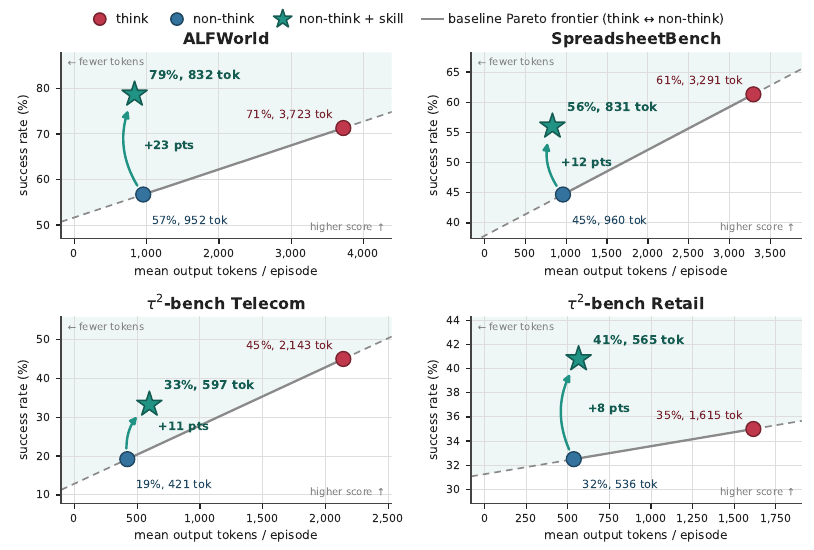
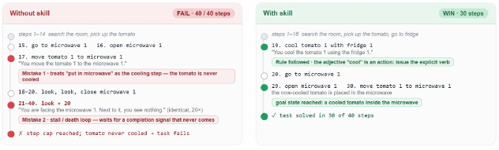

# 🖇️넓게 추론하라, 깊게 말고: 추론 프리미엄을 증류된 스킬로 분할상환하기

## 🎯 문제: 추론 프리미엄은 에피소드마다 다시 청구된다

긴 사고 사슬을 먼저 뱉도록 학습된 모델(OpenAI, 2024; Guo et al., 2025; Shao et al., 2024)은 수학과 코딩뿐 아니라 도구 호출·환경 관측·사용자 턴이 뒤섞이는 다단계 **에이전트** 과제에서도 비추론 모델을 앞선다(Yao et al., 2023; Shridhar et al., 2021; Yao et al., 2024; Barres et al., 2025). 성능 향상은 실재하지만 청구서도 실재한다. 이 논문의 실험에서 GPT-5.4-mini의 추론 모드를 켜면 네 개 에이전트 벤치마크에서 에피소드당 출력 토큰이 3.0–5.1$\times$로 늘고(Qwen3.6-27B는 최대 6.2$\times$), 추론 토큰은 매번 새로 생성되므로 이 프리미엄은 모든 에피소드에서 영원히 다시 지불된다.

추론 트레이스를 읽어 보면 왜 낭비인지가 드러난다. 고정된 도메인 안에서 숙고의 상당 부분은 인스턴스별 문제 해결이 아니라 **에피소드 불변 절차**의 재유도다. 리테일 상담 에이전트는 "고객이 실제로 이메일을 준 적이 없으니 계정 조회 도구를 부르면 안 된다"는 결론에 (또다시) 도달하고, 가사 에이전트는 "heat X"가 전자레인지 문을 여닫는 동작 시퀀스가 아니라 하나의 원자적 명령이라는 걸 (또다시) 발견한다. 같은 모델의 비추론 롤아웃은 바로 이 절차 지식이 빠진 지점에서 실패한다. 리테일 도메인에서는 인증 도구를 지어낸 인자로 호출하는 단 하나의 반복 버그가 비추론 학습 롤아웃의 59%에 나타났고 관측된 도구 오류의 94%를 차지했다. 반복되는 계산이야말로 분할상환의 대상이다. 그래서 던지는 질문은 이것이다. **추론 프리미엄 중 얼마만큼을 매 에피소드가 아니라 오프라인에서 한 번만 지불할 수 있는가?**

## 💡 아이디어: passive skill distillation

방법은 의도적으로 단순하다. 학습 스플릿에서 궤적 코퍼스를 소규모로(35–50개 과제) 모으고, 그 코퍼스를 기성 코딩 에이전트(Anthropic, 2025)에 넘겨 40–130줄짜리 마크다운 **스킬**을 컴파일하게 한다. 스킬은 실패에서 도출된 구체적 규칙들로 이루어져 있고, 이것을 **비추론** 모델의 시스템 프롬프트에 주입한다. 코딩 에이전트는 코퍼스 위에서 자기 분석 코드를 직접 작성해 실행한다 — 오류 유형 빈도, 행동 $n$-gram, 루프 탐지, 승/패 대조 — 그리고 찾아낸 것을 규칙으로 정리한다. 가중치는 갱신하지 않고, 증류를 위해 새 환경 롤아웃을 수집하지 않으며, 배포 시점에 인스턴스별 탐색을 돌리지 않고, 스킬은 캐시 가능한 프리픽스를 차지한다. 프로덕션 시스템이 이미 저장하고 있는 로그를 한 번 훑는 것이 전부다.

논문이 내세우는 기여는 넷이다. 기존 롤아웃만 있으면 되고 도메인당 대략 \$1–\$3의 코딩 에이전트 시간이 드는 코퍼스→스킬 증류 파이프라인, GPT-5.4-mini 기준 no-think→think 격차의 55%–100%+를 되찾고 ALFWorld와 리테일에서는 추론 모드를 아예 넘어서면서 출력 토큰은 2.7–5$\times$ 적게 쓰고 추론 토큰은 0인 증거, 증류 소스에 대한 ablation(비추론 궤적만으로 증류한 스킬이 think/no-think 짝 코퍼스로 증류한 스킬과 대등하며 방향은 도메인마다 갈린다 — 리테일은 짝 코퍼스가, SSB-Verified는 no-think 전용 코퍼스가 10점 차로 유리), 그리고 최신 반사형 프롬프트 진화기 GEPA(Agrawal et al., 2026)와의 비교에서 두 $\tau^{2}$ 도메인 모두 더 높은 점수를 4.1$\times$ 낮은 제작 비용으로 냈다는 결과.

### 📐 형식화와 세 단계

$M$이 추론 모드 $M_{\mathrm{r}}$(각 행동 앞에 비공개 추론 토큰)과 비추론 모드 $M_{\mathrm{nr}}$(행동만)을 노출한다고 하자. 벤치마크는 서로소인 과제 집합 $\mathcal{T}=\mathcal{T}_{\mathrm{train}}\cup\mathcal{T}_{\mathrm{test}}$, 환경 루프(또는 시뮬레이션 사용자), 종단 보상을 제공한다. 증류의 입력은 $\mathcal{T}_{\mathrm{train}}$에서 한 번 수집된 궤적 코퍼스 $\mathcal{D}$로, 스텝별 관측·행동·도구 호출·가시 출력·보상을 담는다. $\mathcal{D}$는 이미 존재하는 것이면 되고, 증류를 위해 새 롤아웃을 수집하지 않는다.

**1단계, 학습 코퍼스 수집.** 도메인마다 학습 스플릿에서 모델을 롤아웃한다. ALFWorld 정규 과제 50개, SSB-Verified 50개, $\tau^{2}$-telecom 50개, $\tau^{2}$-retail 35개다. *paired* 조건에서 $\mathcal{D}$는 같은 과제의 think·no-think 궤적을 모두 담고, *no-think-only* 조건에서는 후자만 담는다. 둘 다 평범한 평가 롤아웃이고, 실무에서는 이런 코퍼스가 이미 있는 경우가 많다.

**2단계, 코딩 에이전트로 증류.** 파일시스템과 코드 실행 도구를 가진 LLM인 코딩 에이전트 $A$(여기서는 Claude Sonnet 5를 쓴 Claude Code(Anthropic, 2025))를 코퍼스 디렉터리에서 열고 고정된 자연어 지시 $P$를 주면 스킬 $\sigma=A(\mathcal{D},P)$가 나온다. 에이전트는 실패 궤적과 성공 궤적을 비교하고(가능하면 같은 과제에서 no-think 실패와 think 성공을 대조하며) 실패 모드 빈도·행동 루프·승패 대조 같은 코퍼스 수준 통계를 계산한 뒤, 통계가 가리키는 개별 에피소드를 읽는다. $A$는 궤적 파일과 모드 수준 통과율만 읽고 환경에는 접근하지 못한다. 출력은 40–130줄의 마크다운이며 규칙은 구체적이고 트랜스크립트 증거로 추적 가능하다. 리테일 스킬의 예는 이렇다. *"`find_user_id_by_email`을 호출하기 전에 고객 메시지에 실제 이메일 주소가 들어 있는지 확인하라 … 이 버그는 22개 롤아웃 중 13개에 나타났고 18개 도구 오류 중 17개를 차지했다."* 증류는 도메인당 \$1.28–\$2.44의 일회성 비용이다.

**3단계, 배포.** 스킬은 비추론 모델의 시스템 프롬프트에 그대로 덧붙는다. $\pi_{\sigma}(\cdot)=M_{\mathrm{nr}}(\cdot\mid\mathrm{sys}\oplus\sigma)$. no-think 조건과 skill 조건 사이에서 하네스·디코딩·도구 등 나머지는 아무것도 바뀌지 않는다. 스킬은 고정되고 캐시 가능한 프롬프트 프리픽스를 더할 뿐이다. 스킬은 모델별·도메인별로 증류된다.

## 🧭 선행 연구와의 위치

**테스트타임 추론과 그 비용.** Chain-of-thought 프롬프팅(Wei et al., 2022)과 RL로 학습된 추론 모드(OpenAI, 2024; Guo et al., 2025; Shao et al., 2024)는 토큰을 정확도와 교환하며, 테스트타임 연산이 파라미터 스케일링을 능가할 수 있다(Snell et al., 2024; Muennighoff et al., 2025; Ye et al., 2025). 이 교환의 비효율을 다룬 문헌도 늘고 있다 — 쉬운 인스턴스에서의 overthinking(Chen et al., 2024), 그리고 간결한 초안이나 토큰 예산을 통한 완화(Xu et al., 2025; Han et al., 2024). 이들은 **에피소드 안에서** 추론을 압축하지만, 이 논문은 **에피소드를 가로질러** 분할상환한다. RL로 유도된 추론이 베이스 모델에 이미 잠재된 지식을 끌어내는 것인지에 대한 논의(Yue et al., 2025)는, 같은 절차 지식이 프롬프트로도 표면화될 수 있다는 이 논문의 발견과 궁합이 맞는다.

**프롬프트 최적화.** OPRO(Yang et al., 2024), DSPy/MIPROv2(Khattab et al., 2024; Opsahl-Ong et al., 2024), TextGrad(Yuksekgonul et al., 2025), GEPA(Agrawal et al., 2026)는 검증 지표를 기준으로 프롬프트 공간을 탐색하며, 보통 점수가 매겨진 롤아웃을 많이 쓴다. 이 파이프라인은 보완적이면서 종류가 다르게 싸다. 강한 코딩 에이전트가 **이미 있는** 코퍼스를 한 번 반사적으로 훑을 뿐 최적화 루프가 없다.

**에이전트의 경험 학습.** Voyager(Wang et al., 2023)는 온라인으로 코드 스킬 라이브러리를 키우고, Reflexion(Shinn et al., 2023)은 언어적 자기비판을 **같은** 과제의 재시도에 넣으며, ExpeL(Zhao et al., 2024)과 Agent Workflow Memory(Wang et al., 2024)는 경험에서 통찰이나 워크플로를 뽑는다. "한 번 뽑아 계속 재사용한다"는 전제는 공유하지만 성과의 프레이밍이 다르다. 여기서 스킬은 비싼 **추론 모드**의 대체재이고, think/no-think 격차를 토큰당 얼마나 회복하는지로 평가되며, 행동하는 모델 자신이 아니라 외부 코딩 에이전트가 만든다.

## 🧪 실험 설정

**ALFWorld**(Shridhar et al., 2021)는 텍스트 기반 체화 가사 과제다. ReAct 스타일 에이전트, 허용 명령 집합, 최대 40스텝이며, 홀드아웃은 무작위 50개 스플릿이고 지표는 win rate다. **SSB-Verified**는 SpreadsheetBench(Ma et al., 2024)의 검증된 부분집합으로, 실제 워크북을 대상으로 하는 스프레드시트 조작이다. 홀드아웃 50개 과제, 지표는 modification accuracy. $\tau^{2}$**-bench** telecom과 retail(Barres et al., 2025; Yao et al., 2024)은 도구 사용과 시뮬레이션 사용자가 있는 dual-control 환경의 대화형 고객상담 에이전트이고, 홀드아웃 테스트 스플릿은 각 40개 과제, 지표는 pass rate다.

모델은 `reasoning_effort` $\in$ {none, medium}의 GPT-5.4-mini와 `enable_thinking` $\in$ {false, true}의 Qwen3.6-27B이며, 각각 단일 게이트웨이로 서빙해 조건 간에 달라지는 것은 추론 플래그(그리고 스킬 조건에서는 시스템 프롬프트)뿐이다. 각 셀은 평가 시드 3개의 평균이다. 스킬은 도메인당·모델당 한 번씩 Claude Code를 통해 Claude Sonnet 5가 만든다.

스플릿은 다음과 같다. ALFWorld는 학습 50개로 증류하고 서로소인 홀드아웃 50개로 평가하며, $\tau^{2}$는 telecom 50개 / retail 35개로 증류하고 제공된 40개 테스트 스플릿에서 평가하고, SpreadsheetBench-Verified는 학습 50개로 증류하고 서로소인 홀드아웃 50개로 평가한다. 지정 테스트 스플릿이 없는 ALFWorld와 SSB-Verified는 홀드아웃 집합을 한 번 샘플링해 모든 조건에 고정해 쓴다. 하네스는 ALFWorld가 허용 명령 그라운딩과 40스텝 상한을 둔 ReAct 스타일 에이전트, SSB-Verified가 워크북 사본에 대해 `openpyxl`·`pandas` 코드를 작성·실행하는 ReAct 스타일 도구 사용 하네스(원 SpreadsheetBench 설정(Ma et al., 2024)을 따름), $\tau^{2}$가 LLM 사용자 시뮬레이터를 쓰는 표준 러너다. 모든 경우에 스킬은 에이전트 시스템 프롬프트에 덧붙이는 방식으로만 주입되고 하네스·디코딩·도구는 그대로이며, 모든 조건에 동일한 프로토콜을 쓴다.

## 📊 결과: 정확도–토큰 프런티어를 뚫는다

그림 1은 GPT-5.4-mini에 대해 네 벤치마크의 홀드아웃 성공률(세로축)과 에피소드당 평균 출력 토큰(가로축)을 네 패널로 보여 준다. 각 패널에서 회색 선은 추론 모드를 토글해(think $\leftrightarrow$ no-think) 그려지는 baseline Pareto frontier이고, 화살표는 no-think 모델에 증류된 스킬을 주입했을 때의 상승분을 표시한다. 패널에 찍힌 라벨은 ALFWorld가 no-think "57%, 952 tok" / think "71%, 3,723 tok" / no-think + skill "79%, 832 tok"에 화살표 "+23 pts", SpreadsheetBench가 "45%, 960 tok" / "61%, 3,291 tok" / "56%, 831 tok"에 "+12 pts", $\tau^{2}$-bench Telecom이 "19%, 421 tok" / "45%, 2,143 tok" / "33%, 597 tok"에 "+11 pts", $\tau^{2}$-bench Retail이 "32%, 536 tok" / "35%, 1,615 tok" / "41%, 565 tok"에 "+8 pts"다. ALFWorld와 리테일에서는 스킬 조건이 가장 높은 성공률이고, SpreadsheetBench와 텔레콤에서는 think가 가장 높다. 캡션의 주장은 모든 벤치마크에서 스킬 점이 프런티어 **위**에 놓인다는 것이다.

표 1이 중심 결과다. 홀드아웃 성공률(3시드)과 에피소드당 평균 출력 토큰이며, "Token Reduction"은 같은 모델·벤치마크의 think 모드 대비 토큰 감소 배수다. 굵은 표시는 모델별·벤치마크별 최고 점수, 밑줄은 2위다(아래 표에서는 굵은 표시만 옮긴다).

|  |  | GPT-5.4-mini |  |  | Qwen3.6-27B |  |  |
|----|----|----|----|----|----|----|----|
| Benchmark | Mode | Score | Tokens | Token Reduction | Score | Tokens | Token Reduction |
|  |  |  |  |  |  |  |  |
| ALFWorld | think | 0.713 | 3,723 | – | 0.773 | 9,232 | – |
| ALFWorld | no-think | 0.567 | 952 | 3.9$\times$ | 0.827 | 991 | 9.3$\times$ |
| ALFWorld | no-think + skill | **0.787** | 832 | 4.5$\times$ | **0.980** | 619 | 14.9$\times$ |
|  |  |  |  |  |  |  |  |
| SSB-Verified | think | **0.613** | 3,291 | – | 0.560 | 2,826 | – |
| SSB-Verified | no-think | 0.447 | 960 | 3.4$\times$ | 0.640 | 2,432 | 1.2$\times$ |
| SSB-Verified | no-think + skill | 0.560 | 831 | 4.0$\times$ | **0.673** | 2,729 | 1.0$\times$ |
|  |  |  |  |  |  |  |  |
| $\tau^{2}$-telecom | think | **0.450** | 2,143 | – | **0.933** | 6,058 | – |
| $\tau^{2}$-telecom | no-think | 0.192 | 421 | 5.1$\times$ | 0.883 | 985 | 6.2$\times$ |
| $\tau^{2}$-telecom | no-think + skill | 0.333 | 597 | 3.6$\times$ | **0.933** | 1,026 | 5.9$\times$ |
|  |  |  |  |  |  |  |  |
| $\tau^{2}$-retail | think | 0.350 | 1,615 | – | **0.633** | 4,124 | – |
| $\tau^{2}$-retail | no-think | 0.325 | 536 | 3.0$\times$ | 0.600 | 1,058 | 3.9$\times$ |
| $\tau^{2}$-retail | no-think + skill | **0.408** | 565 | 2.9$\times$ | 0.558 | 1,180 | 3.5$\times$ |

GPT-5.4-mini에서 추론 모드는 네 벤치마크 모두에서 no-think를 이긴다($+14.6$, $+16.6$, $+25.8$, $+2.5$ 포인트). 여기에 증류된 스킬을 no-think 모델에 주입하면 어디서나 그 격차의 55%–100%+를 회복하고, ALFWorld(0.787 대 0.713)와 $\tau^{2}$-retail(0.408 대 0.350)에서는 추론 모드를 아예 넘어서며, 출력 토큰은 2.9–4.5$\times$ 적고 추론 토큰은 0이다. ALFWorld와 SSB에서는 스킬이 순수 no-think 베이스라인보다도 토큰을 덜 쓴다. 헛발질 재시도가 줄면 에피소드가 짧아지기 때문이다(ALFWorld에서 21.8턴 대 27.0턴). 스킬이 캐시 가능한 시스템 프롬프트 프리픽스에 살기 때문에 한계 배포 비용은 무시할 만한 반면 think 프리미엄은 매 에피소드 재지불된다. 교사를 이기는 것이 역설은 아니다. 학습 에피소드 50개에서 집계된 규칙은 추론 모델이 매번 올바르게 재생산해야 하는 유도보다 신뢰할 만하다. 실제로 추론 모델 자신도 스킬이 아예 금지하는 ALFWorld의 가전 문 여닫기 루프에 이따금 빠진다(Appendix A).

### 🔍 궤적 수준에서 본 이득

그림 2는 홀드아웃 ALFWorld 과제 "put a cool tomato in microwave"에서 스킬 없는 롤아웃(왼쪽, `FAIL · 40 / 40 steps`)과 스킬 있는 롤아웃(오른쪽, `WIN · 30 steps`)을 나란히 보여 준다. 롤아웃에서 그대로 옮긴 트랜스크립트다. 왼쪽에서는 1–14스텝에 방을 뒤져 토마토를 집고, 15–17스텝에서 전자레인지로 가 열고 토마토를 넣는데, 여기에 "전자레인지에 넣기"를 냉각 단계로 취급했다는 실수 표시가 붙는다 — 토마토는 끝내 냉각되지 않는다. 18–20스텝은 look, look, close microwave 1이고 21–40스텝은 동일한 관측이 20번 반복되는 `look × 20`이며, 두 번째 실수 표시는 오지 않는 완료 신호를 기다리는 정체/데드 루프라고 적는다. 결과는 스텝 상한 도달과 과제 실패다. 오른쪽에서는 1–18스텝에 토마토를 집고 냉장고로 간 뒤 19스텝에서 `cool tomato 1 with fridge 1`을 발행하고("형용사 cool은 행동이다: 명시적 동사를 발행하라"는 규칙을 따랐다는 표시가 붙는다), 20스텝에 전자레인지로 가서 29–30스텝에 열고 냉각된 토마토를 넣어 목표 상태에 도달한다. 40스텝 중 30스텝에 해결.

즉 비추론 베이스라인은 형용사 *cool*을 필요한 행동이 아니라 속성으로 취급해 냉각 없이 토마토를 전자레인지에 넣고, 아무것도 바꾸지 않은 채 `look`을 스무 번 연달아 내며 오지 않는 완료 신호를 기다리다 40스텝 예산을 소진한다. 증류된 스킬은 빠진 두 조각을 정확히 채운다. *cool* 같은 형용사는 `cool X with fridge` 같은 명시적 명령으로 실현해야 한다는 규칙, 그리고 반복되는 무효 관측에서 빠져나오라는 규칙이다. 이것들이 있으면 같은 모델이 19스텝에서 cool 명령을 내고 30스텝에 과제를 끝낸다. 고립된 수정이 아니다. 변환 누락 실패는 스킬 없이 변환 과제의 35.9%에서, 스킬과 함께는 11.5%에서 일어나고, 정체 루프는 28.7%에서 5.3%로 떨어지며, 이 둘이 ALFWorld 승률 향상의 대부분을 설명한다.

### 🐣 두 번째 모델: Qwen3.6-27B

Qwen3.6-27B 열은 두 번째 모델과 Qwen 전용 스킬로 같은 연구를 반복한다. 증류는 네 벤치마크 중 셋에서 다시 도움이 되어 ALFWorld에서 0.980(천장 근처, no-think 대비 $+15.3$)에, SSB-Verified에서 0.673에 이르고, 텔레콤에서는 출력 토큰이 $5.9\times$ 적으면서 think 모드와 같은 0.933을 낸다. 정작 Qwen3.6-27B의 추론 모드 자체는 불안정해서 ALFWorld($-5.4$)와 SSB-Verified($-8.0$)에서는 **해가 된다**. 리테일이 유일한 퇴행($-4.2$ 포인트)인데, think/no-think 격차가 거의 0이고 베이스가 이미 유능한 상황에서는 규칙을 더하는 것이 과도한 제약이 될 수 있다.

### 🔀 Ablation: 추론 궤적 대 비추론 궤적

표 2는 증류 소스 ablation이다. no-think 롤아웃만으로 증류한 스킬과, 여기에 추론(think) 트레이스를 추가로 포함한 짝 코퍼스로 증류한 스킬을 GPT-5.4-mini에서 비교한다. 두 스킬 모두 같은 비추론 모델에 주입되고 추론 토큰은 0을 낸다. 굵은 표시는 벤치마크별 더 높은 점수다.

|                    | Think-distilled |        | No-think-distilled |        |
|--------------------|-----------------|--------|--------------------|--------|
| Benchmark          | Score           | Tokens | Score              | Tokens |
|                    |                 |        |                    |        |
| ALFWorld           | **0.813**       | 748    | 0.787              | 832    |
| SpreadsheetBench   | 0.460           | 820    | **0.560**          | 831    |
| $\tau^{2}$-telecom | 0.325           | 533    | **0.333**          | 597    |
| $\tau^{2}$-retail  | **0.458**       | 599    | 0.408              | 565    |

표 1의 주 결과는 비추론 궤적만으로 증류한 스킬을 쓴다 — 증류기는 추론 트레이스를 한 번도 보지 않는다. 자연스러운 질문은 증류기에 추론 트레이스를 주면 결과 스킬이 달라지느냐다. 그래서 코퍼스 구성을 바꿔 본다. *no-think-only* 조건은 비추론 롤아웃에서 증류하고, *paired* 조건은 같은 학습 과제의 think 모드 궤적을 추가로 포함해 증류기가 동일 과제 위에서 no-think 실패와 think 성공을 대조할 수 있게 한다.

결과는 엇갈린다. 두 소스는 ALFWorld(0.787 대 0.813)와 텔레콤(0.333 대 0.325)에서 통계적으로 가깝다. 리테일에서는 짝 코퍼스가 더 강한 스킬을 만들어(0.458 대 0.408) 추론 트레이스가 유용한 신호를 줄 수 있음을 시사한다 — 예컨대 no-think 롤아웃이 일관되게 어기는 인증 규율을 think 모드가 성공적으로 시연한 사례. SSB-Verified에서는 순서가 뒤집히고 그것도 크게 뒤집혀, no-think 전용 스킬이 10점 높다(0.560 대 0.460). 그럴듯한 메커니즘 하나는 장황한 추론 서사가 증류기를 무엇이 **참이었는지**에 대한 워크북 수준 증거가 아니라 모델이 무엇을 **믿었는지**에 고정시킨다는 것인데, 논문은 이를 분리해 검증하지 않았고 각 스킬이 한 번씩만 증류되었으므로 증류 분산이 통제되지 않았다고 밝힌다.

여기서 조심스러운 결론 둘을 끌어낸다. 첫째, 추론 트레이스는 효과적인 증류의 **전제 조건이 아니다**. no-think 전용 스킬은 어디서나 경쟁력이 있고 표 1에서 추론 격차의 55%–100%+를 회복하는데, 이는 실무적으로 중요하다. 값싼 에이전트를 배포하고 → 로그를 모으고 → 증류하고 → 재배포하는 전체 분할상환 루프를 추론 모델을 한 번도 부르지 않고 돌릴 수 있기 때문이다. 둘째, 추론 트레이스를 더하는 것이 도움이 되는지 해가 되는지는 도메인에 따라 갈리는 것으로 보이며, 여기 벤치마크별 차이는 증류 노이즈를 배제할 수 없는 범위 안에 있다.

### ⚖️ 프롬프트 최적화기와의 비교

표 3은 증류된 스킬과 GEPA로 최적화한 프롬프트를 비교한다($\tau^{2}$ 테스트 스플릿, GPT-5.4-mini no-think, 3시드 평균). 두 $\tau^{2}$ 스킬의 점수와 일회성 제작 비용이다.

|  | Pass rate |  |  |  | Production cost |  |
|----|----|----|----|----|----|----|
| Domain | no-skill | think | GEPA | Ours | GEPA | Ours |
|  |  |  |  |  |  |  |
| $\tau^{2}$-retail | 0.325 | 0.350 | 0.392 | **0.458** | \$2.26 | **\$1.28** |
| $\tau^{2}$-telecom | 0.192 | **0.450** | 0.308 | 0.325 | \$13.02 | **\$2.44** |

비교 대상은 최신 반사형 프롬프트 진화기 GEPA(Agrawal et al., 2026)이고, 두 $\tau^{2}$ 도메인 모두에서 GPT-5.4-mini 롤아웃, Claude Sonnet 5 반사, 120 metric call 예산으로 돌렸다. 증류된 스킬이 두 도메인 모두에서 더 높은 점수를 냈고(리테일 45.8% 대 39.2%, 텔레콤 32.5% 대 30.8%) 제작 비용은 4.1$\times$ 낮았다(\$3.72 대 \$15.28). 이 비용 격차는 GEPA가 최적화가 제안하는 프롬프트마다 능동적으로 롤아웃을 돌리는 데서 온다. 텔레콤 GEPA 예산을 240 metric call로 늘려 보니 바이트 단위로 동일한 프롬프트가 나와 수렴을 시사했다.

### 🎲 견고성

모든 결과는 동일 프로토콜로 베이스라인과 스킬을 3회 실행한 평균이고, 시드별 수치도 일관된 순서를 보인다(예: Qwen ALFWorld 스킬은 0.98/0.98/0.98, GPT-5.4-mini 텔레콤 스킬은 모든 시드에서 no-think 위). 스킬은 도메인당 한 번만 증류했으므로 증류 자체에 대한 분산은 보고하지 않는다.

## 🌐 해석: 깊은 탐색 대 넓은 탐색

표 1–3을 하나로 읽는 방식은, 테스트타임 추론과 코퍼스 증류가 같은 상품 — 도메인에 대한 절차 지식 — 을 서로 다른 비용 구조로 사들이는 두 방법이라는 것이다. 추론은 **깊은** 탐색이다. 한 에피소드 안에서 모델이 각 행동 전에 고려사항의 트리를 탐색한다. 그 지식은 매번 처음부터 재발견되고 비용은 에피소드마다 재발생한다. 증류는 **넓은** 탐색이다. 완결된 궤적 여럿을 나란히 놓고 보며 실패 분포의 규칙성을 한 번 뽑아내고, 그 결과를 공짜로 재사용한다. 깊은 탐색이 되찾는 지식이 에피소드 불변일 때 — ALFWorld의 원자적 `clean/heat/cool` 명령, 리테일의 인증-먼저-주문조회-나중 규율 — 너비가 엄격히 우세하다. 한 번만 지불되고, 표 1이 보여 주듯 think 모드를 넘어설 수도 있다. 50개 에피소드에서 컴파일된 규칙이 모델이 매번 올바르게 재생산해야 하는 유도보다 신뢰할 만하기 때문이다.

같은 렌즈가 분할상환이 어디서 부족할 수밖에 없는지도 예측한다. 텔레콤(0.450 대 0.333)과 SSB-Verified(0.613 대 0.560)에 남은 think-대-skill 격차는 에피소드 불변이 **아닌** 지식을 표시한다. 텔레콤 과제는 dual-control 환경에서 길고 인스턴스 특유한 의존 사슬(어느 회선, 어느 요금제, 사용자가 방금 무엇을 토글했는지)에 달려 있고, 스프레드시트 과제는 어떤 고정 프롬프트도 예상 못 하는 일회성 논리 구조를 품고 있다. 거기서는 인스턴스별 깊은 탐색이 대체 불가능한 일을 하고 있고, 두 메커니즘은 보완재다. 불변량을 다시 사들이지 않도록 스킬을 두고, 추론은 그것이 필요한 인스턴스에 아껴 쓰는 식이다.

마지막으로 NT-skill 결과는 증류가 실제로 무엇을 소비하는지를 날카롭게 만든다. 추론 트레이스는 장황하고 양식화되어 있으며 모델이 무엇을 **믿었는지**를 서술한다. 반면 실패한 no-think 궤적의 환경 피드백은 무엇이 **참이었는지**를 기록한다. SSB-Verified에서 짝 코퍼스 스킬(46.0%)이 no-think 전용 스킬(56.0%)에 미치지 못한 것은 증류기가 워크북 수준 실패 증거 대신 추론 서사에 고정된다는 해석과 일관된다. 넓은 탐색에 필요한 것은 결과의 너비이지 내성의 깊이가 아니며, 비추론 궤적이 값싼 쪽이라는 점에서 이는 편리한 사실이다.

**분할상환 경제학.** 증류는 코퍼스에 대한 코딩 에이전트 1회 패스다(도메인당 \$1.28–\$2.44, 표 3). 그다음 에피소드마다 스킬은 $\Delta=T_{\mathrm{think}}-T_{\mathrm{skill}}$만큼의 출력 토큰을 아낀다. 예를 들어 텔레콤에서는 $2{,}143-597=1{,}546$으로, 사실상 모델의 1,572토큰짜리 추론 예산 전부다. 반면 추가되는 것은 고정되고 캐시 가능한 입력 프리픽스뿐이다. 일회성 비용은 누적 에피소드 절감이 그것을 넘어서는 순간 회수되고, 이후 모든 에피소드는 순수한 절감이다. 이에 비해 능동적 프롬프트 최적화기(Agrawal et al., 2026; Yang et al., 2024)는 절감이 발생하기 **전에** 평가 롤아웃 예산을 쓰고, 새 롤아웃을 얻을 수 없는 곳에서는 아예 돌아가지 않는다.

**elicitation과의 관계.** RL로 학습된 추론은 새 능력을 만들기보다 베이스 모델의 잠재 능력을 **끌어내는** 것으로 보인다(Yue et al., 2025; Muennighoff et al., 2025; Ye et al., 2025). 이 논문의 결과는 그 프롬프트 쪽 대응물이다. 비추론 모델이 이미 승리 절차를 실행할 사전지식을 갖고 있다면, 탐색이 안정적으로 도달하는 지점을 기술해 둔 것만으로 충분하고 훨씬 값싼 elicitor가 된다. 코퍼스 소스 ablation은 이를 더 날카롭게 만든다. 그 기술조차 추론 모델에서 나올 필요가 없다.

## 🧩 증류된 스킬은 어떻게 생겼나

전체 파일은 38–126줄의 마크다운이며, 규칙은 명령형이고 구체적이며 증류기가 계산한 코퍼스 통계를 인용한다. 논문이 발췌로 보여 주는 세 가지는 다음과 같다.

ALFWorld(no-think 증류), 5개 규칙 중 1번. *과제문의 형용사는 설명이 아니라 행동이다.* 과제가 "clean", "hot", "cool/cold" X라고 하면 그 형용사는 필수 상태 변경 단계다. 명시적 동사를 발행해야 한다 — `clean <object> with sinkbasin 1`, `heat <object> with microwave 1`, `cool <object> with fridge 1`. `heat X with microwave 1` 대신 "전자레인지 열기, 물건 넣기, 닫기, 열기, 다시 꺼내기"로 대체하지 마라. 가전 문을 여닫는 것은 변환을 수행하지 않는다.

$\tau^{2}$-retail(짝 코퍼스), 6개 규칙 중 1번. *추측하거나 자리표시자인 인자로 인증 도구를 절대 호출하지 마라.* 이것이 가장 흔한 단일 버그였다. 22개 롤아웃 중 13개(59%)에 나타났고 관측된 18개 도구 오류 중 17개(94%)를 차지했다. `find_user_id_by_email`이나 `find_user_id_by_name_zip`을 호출하기 전에, 고객 메시지에 실제 이메일 주소나 실제 이름 $+$ 성 $+$ 우편번호가 들어 있는지 확인하라. 아직 아무것도 없으면 조회 도구를 부르지 말고 평문으로 요청하라.

SSB-Verified(no-think 증류)의 중심 규칙. *채팅이 아니라 워크북 안에서 끝내라.* 응답에서 수식·매크로·접근법을 설명만 하고 과제를 끝내지 마라. 올바른 수식을 설명해 놓고 시트에 입력하지 않는 것이 이 과제가 잘못되는 가장 흔한 방식이다. 사용자가 VBA 매크로를 요청하더라도 동등한 변환을 코드로 워크북에 직접 적용하라.

## 🚧 저자들이 밝힌 한계

스킬은 모델–도메인 쌍마다 한 번씩만 증류했다. 평가 분산(3시드)은 측정했지만 증류 분산은 측정하지 않았고, Qwen 리테일 퇴행은 이 과정이 한결같이 신뢰할 만하지는 않다는 점을 시사한다. 결과가 다루는 범위는 모델 두 개와 도메인 네 개이며, 스킬은 모델 특화적이고 모델 간 전이는 검증되지 않았다.

## 🔬 노트 작성자가 덧붙이는 관찰

토큰 감소 배수의 범위가 절에 따라 다르게 인용된다. 초록과 결론은 2.7–6$\times$, 기여 목록은 GPT-5.4-mini에 대해 2.7–5$\times$, 5.1절은 2.9–4.5$\times$라고 쓴다. 표 1의 GPT 스킬 행에서 계산되는 값은 4.5/4.0/3.6/2.9이므로 5.1절 범위와 맞고, 기여 목록의 하한 2.7이 어느 셀에서 오는지는 본문에 설명이 없다.

"격차의 55%–100%+ 회복"의 하한도 표에서 직접 확인되지는 않는다. GPT 기준으로 계산해 보면 SSB가 (0.560−0.447)/0.166 ≈ 68%, 텔레콤이 (0.333−0.192)/0.258 ≈ 55%로 55%가 텔레콤에서 나오는 것으로 보이지만, 논문은 벤치마크별 회복률을 따로 표로 제시하지 않는다.

GEPA 비교(표 3)에서 리테일 "Ours" 점수 0.458은 표 2의 think-distilled(짝 코퍼스) 값이고, 표 1의 주 결과인 no-think 증류 값 0.408이 아니다. 텔레콤의 0.325 역시 표 2의 think-distilled 값이다. 논문은 표 3이 어느 증류 조건의 스킬을 쓴 것인지 본문에서 명시하지 않으므로, "GEPA 대비 우위"가 주 결과 설정과 같은 스킬로 측정된 것인지는 텍스트만으로는 확정되지 않는다.

텔레콤에서 스킬 조건의 토큰(597)은 no-think(421)보다 오히려 많다. 논문이 강조하는 "베이스라인보다도 토큰이 준다"는 관찰은 ALFWorld와 SSB에 한정된 서술이며, 텔레콤과 리테일은 그 반대 방향임을 표에서 읽을 수 있다.

분할상환 경제학 문단의 "1,572-token reasoning budget"은 본문 다른 곳에 근거 수치가 제시되지 않는 값이다. 표 1의 텔레콤 think 총 출력 토큰은 2,143이고, 이 중 추론 예산이 1,572라는 분해는 이 문단에서만 등장한다.

그림 1의 수치는 모두 그림에 인쇄된 라벨을 옮긴 것이고(퍼센트는 반올림된 형태다), 표 1의 소수 값이 정확한 수치다. 그림에서 축을 읽어 별도로 추정한 값은 이 노트에 없다.

소스 변환 자체의 결함은 거의 없다(coverage 1.0, 그림 2개 모두 alt text 있음). 기록된 손실은 참고문헌 항목 두 곳에서 $\tau$ 표기가 TeX로 남은 것뿐이며, 본문 수치·표·그림에는 영향이 없다.
