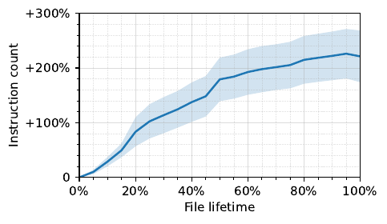
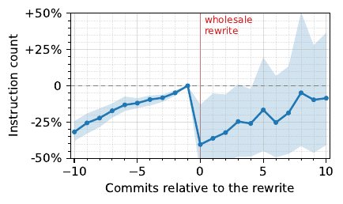
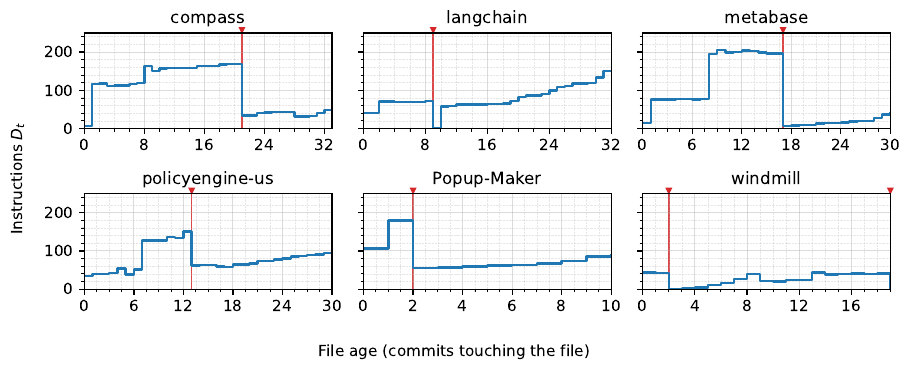
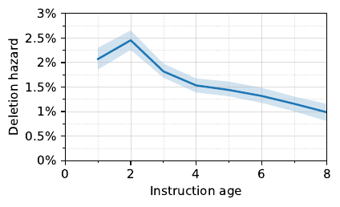
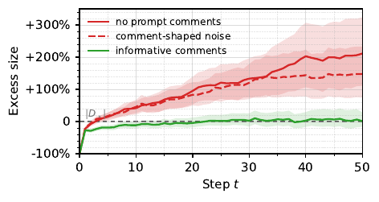

# 🖇️CLAUDE.md는 왜 계속 자라는가 — 에이전틱 코딩의 파국적 기억

저자는 쿠샬 차크라바르티(Kushal Chakrabarti, South Park Commons) 한 명이다.

## 🧩 문제: 에이전틱 README는 멈추지 않고 자란다

`copilot-instructions.md`, `AGENTS.md`, `CLAUDE.md` 같은 에이전틱 컨텍스트 파일은 지시문을 얻기만 하고 거의 버리지 않는다(Chatlatanagulchai et al., 2025). 파일을 없애는 것이 답은 아니다. 이런 파일을 가진 저장소는 에이전트 작업을 더 빨리, 더 적은 토큰으로 끝낸다(Lulla et al., 2026). 그렇다고 전부 껴안고 가는 것도 공짜가 아니다. 제약이 쌓일수록 instruction-following은 나빠지고(Jiang et al., 2024; Lior et al., 2025), 중앙값 파일은 이미 39개의 지시문을 지고 있으며 평균적으로 파일 자기 수명 동안 세 배 넘게(+226%) 불어난다.

이 성장을 설명할 수 있는 메커니즘은 여러 갈래다. 요구사항이 더 이상 적용되지 않아서 지워진다면(instruction staleness) 삭제 hazard는 지시문의 나이와 함께 **올라가야** 한다. 깨지기 쉬운 지시문이 일찍 죽고 튼튼한 것만 남는 것이라면(content fragility) hazard는 내려간다. 유지보수자가 지시문의 근거를 잃어버리는 것이라면(imperfect recall) hazard는 나이와 함께 내려가고, 앞의 두 경쟁 가설과 달리 **유지보수자 수**에 대해서도 내려간다. 지금까지 근본 원인이 밝혀지지 않은 이유는 line diff와 파일 크기로는 개별 지시문을 시간축 위에서 분해할 수 없기 때문이다.

지시문을 지우는 일에는 회귀(regression) 위험이 따르고, 안전하게 지우려면 유지보수자가 현실적으로 돌릴 수 없는 반사실(counterfactual)이 필요하다. 지시문의 latent reasoning을 기록하는 비용은 $O(1)$인데, 나중에 복원하는 비용은 지시문 $|D|$개짜리 프롬프트에서 $O(2^{|D|})$다. 여러 저자의 연속 편집이 그 latent reasoning을 파괴하므로 삭제 hazard는 나이와 함께 감쇠하고, 추가가 제거를 앞지르며, 에이전트가 제 기능을 못 할 때까지 지시문이 무한히 늘어난다 — 이것이 **catastrophic remembering(파국적 기억)**이다. 파국적 망각에서는 gradient 학습기가 지켰어야 할 것을 덮어쓰고(McCloskey and Cohen, 1989; French, 1999; Kirkpatrick et al., 2017), 파국적 기억에서는 유지보수자가 덮어썼어야 할 것을 지킨다. 둘 다 실패하고, 실패 이유도 같다. 갱신을 정당화해 줄 근거가 사라졌다는 점이다.

소프트웨어 공학은 이 문제를 수십 년 전에 **주석**으로 풀었다. 다음 유지보수자에게 말을 걸되 인터프리터에게는 보이지 않는 텍스트다(Knuth, 1984). 코드가 왜 그렇게 쓰였는지 되찾는 일이 개발자의 가장 심각한 문제이고(LaToza et al., 2006), 그래서 관행은 what이나 how가 아니라 why를 기록하는 것이다(McConnell, 2004). 이 논문의 주장은 두 관행이 에이전틱 프롬프트에도 그대로 넘어온다는 것이다.

논문이 내세우는 기여는 네 가지다. latent reasoning의 복원 가능성이 감쇠하면 무한 성장이 예측된다는 **프롬프트 유지보수 이론**, 247,694개의 lifetime에 걸쳐 삭제 hazard가 나이와 함께 감쇠함을 보여 staleness도 fragility도 아닌 imperfect recall을 지목하는 **근본 원인 규명**, IFEval을 뒤집어 minimum cover가 알려진 검증 가능한 world를 만들어 excess size와 correctness를 측정 가능하게 만든 **최적점이 알려진 새 평가**, 그리고 excess size를 99.3% 없애고 실제 프롬프트의 instruction-following을 최대 23.1% 끌어올리는 **실용적 해법**이다.

## 📐 이론: 지우려면 왜 넣었는지를 기억해야 한다

프롬프트 유지보수를 *검열되고 잡음 섞인 피드백으로부터 관측 불가능한 제약 집합을 온라인 추정하는 문제*로 모델링하고, write-time provenance가 감쇠할 때 평형 프롬프트 크기가 발산함을 유도한다. provenance가 없으면 최적 추정기는 append-only가 된다.

작업 $j=(o_{j},C_{j})$는 명시된 목표 $o_{j}$와 관측 불가능한 제약 $C_{j}\subseteq C$의 쌍이고, $C=\{g_{c}\}$는 고정된 숨은 verifier 집합이다. 시각 $t$의 프롬프트는 유한한 지시문 집합 $D_{t}$이며, 지시문 $d$는 시각 $\tau_{d}$에 들어와 나이 $a_{d}=t-\tau_{d}$를 갖는다. $j$에 대한 응답이 $c\in C_{j}$를 만족할 확률은 $q_{c}(D,j)$이고, $C$는 $q_{C}$로부터의 추출을 통해서만 간접적으로 드러난다.

각 timestep마다 세 주체가 상호작용한다. (에이전트일 수도 있는) *maintainer*가 지시문을 넣고 빼며 $D_{t}$를 갱신하고, *harness*는 작업 $j$를 뽑아 프롬프트 $D_{t}$ 아래에서 *executor*로 실행한 뒤 $C_{j}$로 검증해 $q_{C}$ 추출을 만든다.

유지보수자의 목표는 **minimum cover** $D_{\star}$, 즉 기대 제약 만족을 최대화하는 가장 작은 지시문 집합이다.

$$\begin{split}D_{\star}&=\operatorname*{argmin}_{D\in\mathcal{M}}|D|,\\
\mathcal{M}&=\operatorname*{argmax}_{D}\,\mathrm{E}_{j,\,c\in C_{j}}[q_{c}(D,j)]\end{split}$$ (1)

이 논문의 모든 실험은 $D_{t}$를 $D_{\star}$에 대해 두 축으로 채점한다. *correctness*는 기대 만족도 $\mathrm{E}[q_{c}]$, *excess size*는 $\frac{|D_{t}|}{|D_{\star}|}-1$이다. 어떤 유지보수 방식이 이긴다고 말하려면 한 축을 개선하면서 다른 축을 나쁘게 만들지 않아야 한다.

함수 형태를 특정하지 않는 대신 $q_{C}$가 다음 다섯 성질을 만족한다고 가정한다. A1–A3(instructability, interference, redundancy)이 전체 regime을 정하고, A4(censoring)는 삭제를 막고 A5(stochasticity)는 추가를 부추긴다.

|     | **Property**    | **Behavior**                             |
|-----|-----------------|------------------------------------------|
| A1  | instructability | some $d$ raises $q_{c}$                  |
| A2  | interference    | adding $d$ lowers other $q_{c^{\prime}}$ |
| A3  | redundancy      | a second $d^{\prime}$ adds no $q_{c}$    |
| A4  | censoring       | outcomes don’t name their $d$            |
| A5  | stochasticity   | $q_{c}<1$ even when covered              |

회귀 위험 없이 지시문을 지우려면 감당 불가능한 수의 반사실을 돌려야 한다. $d$가 $c$에 기여하는 몫을 $c\in C_{j}$인 작업들에 대해 $\Delta_{c}(d\mid D)=\mathbb{E}_{j}[q_{c}(D,j)-q_{c}(D\setminus\{d\},j)]$로 쓰면, 모든 $c$에 대해 $\Delta_{c}\leq 0$일 때 $d$는 *excess*다. 이를 추정하려면 $D\setminus\{d\}$를 시험해야 하는데, redundancy가 하나씩 빼 보는 방식을 무너뜨린다. 제약 하나씩을 각각 덮는 두 지시문은 따로 보면 둘 다 공짜처럼 보이지만 둘 다 지우면 제약이 깨진다. 그래서 정직한 감사는 $O(2^{|D_{t}|})$번의 부분집합 시험을 요구하고, 일반적으로 $D_{\star}$는 계산 불가능하다. 유지보수자가 왜 $d$를 넣었는지 — 그 *latent reasoning* $r_{d}$ — 를 알면 이 비용은 $O(1)$로 붕괴하지만, $r_{d}$는 $a_{d}$에 따라 빠르게 감쇠한다.

복원 가능성이 평형 크기를 결정한다. 감쇠를 다음과 같이 정의한다.

$$\rho(d,a)=\Pr(r_{d}\text{ recoverable at age }a),$$ (2)

주변화한 값은 $\bar{\rho}(a)=\mathbb{E}_{d}\,\rho(d,a)$이고, 따라서 $\rho(d,0)=\bar{\rho}(0)=1$이며 $a\rightarrow\infty$일 때 $\rho(d,a)\rightarrow 0$, $\bar{\rho}(a)\rightarrow 0$이다. 이 감쇠가 **imperfect recall**이다. 지시문은 남아 있고 그것이 막던 실패도 계속 재발하지만, 그 latent reasoning은 점점 복원 불가능해진다. 합리적인 유지보수자는 그 이유가 살아 있고 동시에 excess임이 확인될 때에만 지우므로, 자기 나이에 대한 hazard는 다음처럼 인수분해된다(성문화된 조직 규칙에 쓰이는 event-history 형식; Schulz, 1998; March et al., 2000; Zhou, 1993).

$$h(a)\;\approx\;\bar{\rho}(a)\,s(a),$$ (3)

여기서 $s(a)=\Pr(\text{excess}\mid a)$다. 추가는 hazard의 합과 상쇄된다.

$$\mathbb{E}\bigl[|D_{t+1}|-|D_{t}|\bigr]\;=\;A_{t}-\sum_{d}h(a_{d}),$$ (4)

$A_{t}$는 에피소드당 추가량이다. 흐름 균형을 잡으면 무한 성장이 나온다.

$$|D_{\infty}|\;=\;\frac{A}{\bar{\rho}(a)\,s}\;\xrightarrow[\;a\to\infty\;]{}\;\infty.$$ (5)

식 (5)가 닫힌 형태로 쓴 catastrophic remembering이다. 추가가 일정한 속도로 도착하고 제약이 고정되어 있어도 $\bar{\rho}\to 0$이면 excess size가 발산한다. 즉 **작업이 전혀 변하지 않아도**, 각 지시문을 왜 썼는지에 대한 기억이 감쇠하는 것만으로 무한 성장을 일으키기에 충분하다. 그러므로 복원 가능성은 필요한 개입이고, 논문 뒤쪽에서 보이듯 충분한 개입이기도 하다. latent reasoning이 감쇠하게 두면 현실적으로 남는 유일한 삭제 수단은 wholesale rewrite이고, 되살려 두면 프롬프트는 $D_{\star}$ 근처에 정착한다.

Figure 2는 이 그림을 두 패널로 요약한다. (a)는 WRITE($t=0$) → THE LOOP($t=1..k$) → EDIT($t=k$)의 흐름에서 $d_{i}$ 뒤의 latent reasoning이 한 번도 쓰이지 않은 채 (에이전트가 도는) 개발 루프를 거치며 사라지고, 그래서 삭제는 급성 회귀 위험을 지는 반면 추가 비용은 널리 퍼져 잘 보이지 않는다는 점을 그린다. (b)는 해법의 예시로, `Write your response as three sentences, each ending with a period. # Task 0 continues to fail on sentence count; last instruction was vague; maybe being explicit about periods will help?`처럼 informative comment가 latent reasoning을 담아 무한 성장을 멈춘다는 것을 보인다.

## 📈 관찰: 성장 → 통째 재작성 → 재성장이라는 래칫

에이전틱 컨텍스트 파일은 누군가 통째로 다시 쓸 때까지 자라고, 그러고 나면 또 자란다. 이 톱니 모양 성장 곡선을 **ratchet(래칫)**이라 부른다. 이 래칫의 삭제 hazard와 공변량이 근본 원인을 처음으로 식별해 준다 — imperfect recall이다.

말뭉치는 GitHub 저장소 1,867개, 버전이 둘 이상인 파일 1,801개, 버전 간 전이 299,440건, 지시문 lifetime 247,694건에 걸친다. 표본 프레임은 Chatlatanagulchai et al. (2025)의 저장소 목록, 즉 기본 브랜치에 `CLAUDE.md`, `AGENTS.md`, `copilot-instructions.md` 중 최소 하나를 가진 공개 GitHub 저장소다. 프레임의 텍스트를 재사용하지 않고 각 저장소를 blobless로 클론해 추적 대상 컨텍스트 파일의 전체 커밋 히스토리를 직접 걸었다. 스냅샷은 파일에 대한 주장만 뒷받침하고, 지시문에 대한 주장을 뒷받침하는 것은 히스토리뿐이기 때문이다. 또한 앞으로 걷는 방식이 시간 대칭성을 지킨다. 최종 버전의 지시문 집합에서 거꾸로 거슬러 올라갔다면 그 버전까지의 생존에 조건부가 되는데, 생존이 바로 연구 대상이다.

### 지시문은 늘고 복잡해지고 파일도 커진다

유지보수자는 추가만 하고 거의 제거하지 않아서, 히스토리가 끝나거나 파일이 통째로 다시 쓰일 때까지 지시문 개수, 지시문 복잡도, 전체 크기 모두 한계 없이 자란다.

마지막으로 추적된 버전 기준 중앙값 파일은 39개 지시문을 담고 있고(90번째 백분위수 131개), 이는 instruction-following이 나빠지기 시작하는 문턱을 이미 한참 지난 값이다(Jiang et al., 2024; Lior et al., 2025). 버전이 여럿인 저장소 1,576개 중 64.3%가 지시문 수를 늘렸고 26.6%가 줄였으며, 순증 중앙값은 +7개다. mass rewrite를 제외하면 19,267개 커밋에 걸쳐 커밋당 평균 순 +4.9개가 추가된다.

측정한 모든 구성 요소가 자란다. 파일 자기 수명 동안 평균 궤적은 개수에서 최대 +226%, 평균 지시문 길이에서 +10% 늘어난다. 그와 함께 에이전틱 프롬프트의 전체 크기가 +140% 자라므로, 개수 증가는 텍스트가 payload 클래스에서 instruction 클래스로 옮겨 간 결과가 아니다.



Figure 1(b)는 가로축이 정규화된 파일 수명(0%~100%), 세로축이 첫 버전 대비 지시문 수 $\frac{\lvert D_{t}\rvert}{\lvert D_{0}\rvert}-1$인 단일 곡선이다. 곡선은 0에서 시작해 수명 20% 지점에서 그림에서 눈으로 읽어 약 +80%, 50% 지점에서 약 +180%까지 오르고, 90~95% 부근에서 약 +225%로 정점을 찍은 뒤 끝에서 약간 낮아진다. 음영 밴드가 곡선을 감싸며 뒤로 갈수록 넓어진다(대략 수명 50%에서 +115%~+220% 범위로 읽힌다). 본문이 명시하는 값은 +226%이며, 위의 중간 지점 값들은 축에 대고 읽은 근사치다. 그림 자체는 이 밴드가 어떤 통계량인지 밝히지 않는다.

### 사라짐의 대부분은 삭제가 아니다

유지보수자가 지시문을 지울 때는 대체로 mass rewrite에서 통째로 지운다. 지시문 죽음의 77.3%가 wholesale rewrite 또는 형제 파일로의 migration에서 발생한다. 그런 경우 line diff는 삭제와 재작성(rewording)을 구분하지 못하고, 이것이 "삭제는 드물다"는 관찰이 설명되지 못한 채 서 있던 이유의 일부다. 프롬프트 변경 연구들은 추가가 지배적이라고 보고하면서도 개별 지시문이 어떻게 됐는지는 매듭짓지 못했다(Tafreshipour et al., 2025).

한 커밋에서 파일이 지시문의 절반 이상을 잃으면 *rewrite*, 텍스트가 형제 파일에서 다시 나타나면 *migration*이라 부른다. 둘 다 competing risk로 검열한다(각각 96,162건과 682건의 죽음). 어느 쪽도 유지보수자가 특정 지시문이 자리값을 하는지 판단한 사건이 아니기 때문이다(March et al., 2000). 매칭은 손으로 주석한 50개 전이에서 precision 1.000, recall 0.933으로 검증되었고, 그 결과 247,694개 lifetime과 28,426건의 추적된 삭제가 남는다.

정확히는 rewrite는 "파일의 살아 있는 지시문 중 최소 50%가 한 커밋에서 동시에 죽는 것"이되 위험집합에 최소 5개 지시문이 있어야 한다는 하한을 둔다. 지시문 두 개짜리 파일이 하나를 잃는 경우를 배제하기 위해서다. migration은 같은 커밋에서 그 텍스트가 형제 파일에 나타나는 죽음이고, 저장소 전역으로 매칭한다. 이 둘이 관측된 지시문 죽음의 77.3%를 검열한다. rewrite 죽음만으로도 hazard 추정에 쓰는 삭제 수의 3.4배다. 이것이 가장 큰 단일 노출이고, 두 가지로 읽힌다. 소수의 죽음 위에서 삭제 hazard를 적합하는 것이고 rewrite 문턱이 평범한 가지치기를 통째 재작성으로 오인하면 진짜 삭제가 위험집합에서 빠져나가므로 추정을 위협하는 한편, 유지보수자는 가지치기가 아니라 교체를 한다는 발견 자체이기도 하다 — 식 (5)가 예측한 그대로다.

### 재작성 뒤 성장은 즉시 재개된다

mass rewrite는 프롬프트의 크기를 되돌리지만 근본 원인(imperfect recall)을 건드리지는 못하므로, 프롬프트는 재작성 직후 다시 자라기 시작한다.

파일들을 첫 mass rewrite에 $t=0$으로 정렬하면, 평균 지시문 수는 $t=-1$까지 단조 증가하다가 $t=0$에서 재작성 직전 값의 59.5%로 떨어지고, 이후 10개 커밋에 걸쳐 91.5%까지 회복한다. 실제로 에이전틱 프롬프트는 재작성 **후에** 더 빨리 자란다. mass rewrite 이후 커밋당 4.9%씩 늘어나는데, 이전에는 4.1%였다.



Figure 4는 가로축이 재작성 기준 상대 커밋(−10~+10), 세로축이 지시문 수(첫 재작성 직전 버전 대비, −50%~+50%)인 event study다. 계열은 커밋 −10에서 그림에서 읽어 약 −32%로 시작해 꾸준히 0으로 올라오고, 커밋 −1에서 0%에 닿은 뒤 커밋 0에서 약 −42%로 급락하며, 이후 0 아래에서 요동치며 부분적으로 회복한다. 95% 부트스트랩 밴드는 재작성 전에는 좁고 재작성 후 급격히 넓어진다. 본문이 명시하는 값은 재작성 시점 59.5%, 10커밋 후 91.5%, 그리고 성장률 4.1%/4.9%이며 위의 궤적 값들은 축에 대고 읽은 근사치다.



Figure 3은 여섯 개의 실제 컨텍스트 파일(compass, langchain, metabase, policyengine-us, Popup-Maker, windmill)에서 파일 나이(파일을 건드린 커밋 수)에 대한 지시문 수 $D_{t}$를 계단 선으로 그린 것이다. 빨간 세로선은 파일을 지시문 절반 이하로 자른 커밋을 표시한다. 여섯 사례 모두에서 선은 계단식으로 올라가다 빨간 선에서 급락하고 다시 오르기 시작한다. 예컨대 metabase는 나이 8 부근에서 그림에서 읽어 약 190까지 뛰어오르고 나이 17 부근의 빨간 선에서 약 5로 떨어진 뒤 다시 완만히 올라간다. 캡션이 명시하는 값은 wholesale rewrite가 전체 지시문 죽음의 76.8%를 차지하고, 평균 파일이 59.5%로 떨어졌다가 10커밋 안에 91.5%로 돌아온다는 것(첫 재작성에 정렬한 52개 파일)이다.

본문 서론과 3.3절은 wholesale rewrite가 지시문 죽음의 76.8%를 차지한다고 쓰고, 3.2절과 A.4절은 rewrite와 migration을 합쳐 77.3%가 검열된다고 쓴다.

### 삭제 hazard가 경쟁 가설을 반증한다

삭제 hazard $h(a)$와 그것이 저자 수와 맺는 상호작용이 imperfect recall을 성장의 메커니즘으로 지목한다.

instruction staleness와 imperfect recall은 삭제 hazard의 기울기를 정반대로 예측한다. 전자는 지시문이 낡아 감에 따라 hazard가 나이와 함께 올라간다고 보고(Lehman, 1980; Panthaplackel et al., 2021), 후자는 그 뒤의 근거가 사라지므로 내려간다고 본다. 실제로 $h(a)$는 나이 $a$에 따라 떨어진다. 저장소 층화 부트스트랩으로 얻은 로그 hazard 기울기는 커밋당 $-0.032$이고 구간이 0을 배제한다(95% CI $[-0.047,-0.019]$).



Figure 5는 가로축이 지시문 나이(0~8 커밋), 세로축이 삭제 hazard(0%~3%)인 곡선이다. 곡선은 나이 1에서 그림에서 읽어 약 2.1%로 시작해 나이 2에서 약 2.45%로 정점을 찍은 뒤 계속 내려가 나이 8에서 약 1.0%가 된다. 신뢰 밴드가 곡선을 감싼다. 즉 나이 2를 넘어서면 단조 감소이며, staleness가 예측하는 상승도 나이 무관 삭제가 예측하는 평탄함도 아니다. 추정은 28,426건의 삭제에 대한 Nelson–Aalen이고 밴드는 95% 저장소 층화 부트스트랩이며, 본문이 명시하는 기울기는 $-0.032$/commit($[-0.047,-0.019]$)이고 위의 곡선 값들은 축에 대고 읽은 근사치다.

content fragility — 깨지기 쉬운 지시문·파일·저장소가 일찍 죽는다는 설명 — 도 구성 효과를 통해 삭제 hazard를 아래로 휘게 만들 수 있지만, 구성만으로는 이 기울기를 설명하지 못한다. gamma frailty 모형($n=28,255$ deaths, 50커밋에서 검열)으로 다시 적합해 frailty 없는 기준선과 비교했다(Vaupel et al., 1979). 가장 강한 형태인 동일 텍스트를 공유하는 지시문 frailty가 30.8%를 흡수하지만 기울기는 여전히 $-0.0355$로 남는다($[-0.0414,-0.0296]$).

마지막으로, imperfect recall만이 할 수 있는 예측이 있다. latent reasoning이 변경을 가하는 사람의 머릿속에 있는 것이라면, 삭제 hazard는 나이뿐 아니라 파일을 건드린 유지보수자 수에 따라서도 감쇠해야 한다. 사람 저자 수를 세고 파일 활동량을 통제했을 때 실제로 그렇다. $\beta_{\text{multi-author}\times\text{age}}=-0.021$($z=-11.7$).

실제 저장소 전반에서 무한 프롬프트 성장은 광범위하고, 파일이 도달하는 크기에서 비용을 치르며, imperfect recall로만 설명된다. 다만 이 설정은 관측된 것이지 배정된 것이 아니다.

## 🔬 실험 설계: IFEval을 뒤집어 minimum cover를 관측 가능하게 만들기

프롬프트를 평가하려면 excess size와 correctness를 함께 재야 하는데, excess size를 계산하려면 minimum cover가 필요하고 그것은 일반적으로 계산 불가능하다. 표준 instruction-following 스위트가 길을 준다.

IFEval(Zhou et al., 2023)을 뒤집는다. 벤치마크 항목 $(D_{j},C_{j})$ — 지시문 $D_{j}$, verifier $C_{j}$ — 마다 다음 변환을 적용한다.

1. *$D_{j}$를 숨긴다.* 항목의 명시된 지시문이 기준 minimum cover $D_{\star}$가 되므로 $|D_{\star}|$가 사전에 알려지고 excess size가 측정 가능해진다.
2. *$C_{j}$는 유지한다.* 그 verifier들이 world의 숨은 제약 집합이 되어 harness만 돌리고 유지보수자에게는 절대 이름을 알려주지 않는다.
3. *짧은 $o_{j}$를 생성한다.* 더 강한 모델이 $D_{j}$를 손실적으로 요약해 일반적인 작업 목표("draft a product announcement")로 만든다.

새 유지보수자가 $o_{j}$로부터 $T$ 스텝에 걸쳐 $D_{j}$를 재구성하되, $C_{j}$로부터 오는 검열되고 잡음 섞인 피드백만 본다. 어느 arm에 속하느냐가 지시문 $d$에 그 지시문의 latent reasoning을 담은 주석 $r_{d}$를 달 수 있는지를 결정한다. 다음 유지보수자는 $D_{t}$와 모든 $r_{d}$를 읽지만, executor는 $D_{t}$만 읽는다.

지시문은 executor에게 무엇을 하라고 말하고, 주석은 다음 유지보수자에게 왜인지를 말한다. 이 분리를 강제하기 위해 harness는 프롬프트가 executor에 닿기 전에 주석을 떼어 내고, 과거 실패를 언급하는 지시문은 거부한다. 그래서 latent reasoning이 흐를 수 있는 통로는 주석뿐이다.

### world와 역할

최소 두 개의 verifier를 가진 모든 IFEval 항목을 취해 seed당 184개 world, arm당 3개 seed에 걸쳐 552개의 유지보수 히스토리를 얻는다. cover는 지시문 두 개(423 histories) 또는 세 개(129)이며, 3.1절의 중앙값 컨텍스트 파일보다 한 자릿수 작다. 두 층은 서로 어긋나는 곳마다 따로 보고한다. world는 seed에 따라 순열 표본으로 뽑으므로 world 인덱스는 seed마다 다른 항목을 가리키고, 분석 단위는 $(\text{seed},\text{world})$다. 목표 $o_{j}$는 더 강한 모델이 world당 한 번 생성해 world와 함께 얼려 두므로, 유지보수 프로토콜이 바뀌어도 흔들리지 않는다.

루프를 도는 역할은 셋이고 측정은 harness만 한다. 15스텝 각각에서 harness는 world에서 작업 1개를 뽑아 목표를 다시 진술하고, world의 제약 중 2개를 뽑아 답을 채점한다. executor는 주석이 제거된 현재 프롬프트 아래에서 답하고, verifier가 돈다. 그다음 새로 만들어진 유지보수자 인스턴스가 지시문을 넣고 빼며 각 추가에 자기 프로토콜이 지시하는 대로 주석을 단다. 이 인스턴스는 프롬프트와 자기 arm이 지속시키는 것 외에는 스텝 간에 아무것도 들고 가지 않는다. rewording 연산은 제공하지 않으므로 지시문의 텍스트는 쓰이는 순간 고정되고 모든 지시문이 명확한 나이를 가지며, 이는 3.2절이 커밋 히스토리에서 복원하는 spell 정의와 맞는다. 유지보수자와 executor 모두 `claude-haiku-4-5`이며, 유지보수자가 프론티어 모델보다 3절 파일들의 저자에 가까운 능력이 되도록 고른 선택이다.

### 피드백 regime

harness는 제약, 파라미터, 분류 체계 어느 것도 이름 붙이지 않은 평범한 언어의 불평을 돌려주고, 응답이 통과하면 맨 판정 외에는 아무것도 주지 않는다. 이것이 2절이 가정하는 censoring이다.

arm들이 갈라지는 것은 다섯 조건이 동시에 성립할 때뿐이다. 모호한 판정, 검열된 통과, 제약 식별자 비공개, 간결함을 요구하지 않는 유지보수자 목표, 그리고 최소 열 스텝의 horizon이다. 다섯이 다 성립하기 전에는 어떤 arm도 갈라지지 않았다. verifier 명세를 전부 공개하면 주석 없는 arm은 excess size +3.0%에 정착하며 효과가 완전히 사라진다. 이 regime은 탐색으로 찾았고, 탐색 순서가 그것을 정당화한다고 본다. 모든 조건이 실제 유지보수자도 갖지 못하는 정보를 제거하는 것이기 때문이다.

다섯 중 둘은 파라미터로 고른 것이 아니라 설계 실패로 부딪힌 것이다. 안정적인 제약 식별자는 $|C|$를 누출한다. 라운드를 넘어 지속되는 id를 주면 유지보수자가 cover 크기를 추론해 히스토리 없이도 거기까지 가지치기하고, 모든 arm이 수렴한다. 간결함을 언급하는 유지보수자 목표는 래칫을 정보의 산물이 아니라 목표의 산물로 만들어 버린다. 최소화 목표를 아예 없앴을 때 삭제 대 추가 비율이 사실상 그대로였다는 점이 이 해석을 배제한다.

숨은 제약 문법과 유지보수자가 받는 유일한 신호는 다음과 같다. 열은 각 verifier 타입을 숨은 제약 집합에 포함하는 $(\text{seed},\text{world})$ 쌍의 수, 그리고 실패 시 harness가 돌려주는 불평이다. 불평은 차원을 이름 붙일 뿐 파라미터나 문턱, verifier의 정체를 절대 말하지 않는다. 두 casing 검사는 설계상 하나의 불평을 공유하고, world 하나가 두세 개의 제약을 지므로 합계는 world 수를 넘는다.

| Family | Verifier type | Worlds | Complaint returned on failure |
|----|----|----|----|
| keywords | `existence` | 69 | the response is missing some required content |
|  | `forbidden_words` | 81 | the response contains wording it must not use |
|  | `frequency` | 75 | certain wording is not used the right number of times |
|  | `letter_frequency` | 57 | a certain letter does not appear the right number of times |
| length | `number_paragraphs` | 48 | the response is not split into the right number of paragraphs |
|  | `number_sentences` | 99 | the response has the wrong number of sentences |
|  | `number_words` | 108 | the response’s word count is off |
| content | `number_placeholders` | 42 | the response needs a different number of bracketed placeholders |
|  | `postscript` | 36 | the response is missing a postscript |
| format | `json_format` | 27 | the response is not valid JSON |
|  | `multiple_sections` | 24 | the response is not organized into the expected sections |
|  | `number_bullet_lists` | 54 | the response does not have the right number of bullet lists |
|  | `number_highlighted_sections` | 87 | the response needs a different number of highlighted sections |
|  | `title` | 36 | the response is missing a properly formatted title |
| case | `capital_word_frequency` | 39 | the number of fully-capitalized words is off |
|  | `english_capital` | 42 | the response’s letter casing is wrong |
|  | `english_lowercase` | 75 | the response’s letter casing is wrong |
| punctuation | `no_comma` | 87 | the response’s punctuation breaks a rule |
| start / end | `end_checker` | 27 | the response does not end the required way |
|  | `quotation` | 69 | the response does not begin and end the required way |

### 채널 설계

지시문은 executor를 향한 명령문으로 응답이 무엇을 해야 하는지를 말하고 왜인지는 결코 말하지 않는다. 주석은 다음 유지보수자를 향하며 그 arm이 지속시키는 것을 담는다.

프롬프트에는 주석 문법이 하나뿐이고, 주석은 지시문에만 붙는다. 유지보수되는 프롬프트는 지시문당 한 줄로 된 줄의 나열이고, 각 줄은 `[d`*`i`*`] `*`text`* 형식이다. *i*는 추가 시점에 harness가 카운터에서 배정하는 식별자다. arm이 주석을 지닐 때는 같은 줄에 `#`과 주석이 이어진다. 식별자는 위치가 아니다. 절대 바뀌지 않고 재사용되지 않으므로 `d`*`i`*를 언급하는 주석은 열 라운드 뒤에도 같은 지시문을 가리키며, executor용 렌더링에서는 위치 기반 목록으로 대체된다. 유지보수자는 주석을 그것이 달리는 추가와 함께 한 번만 쓰고, 지시문을 rewording할 수 없는 것과 마찬가지로 나중에 편집할 수 없다. 주석이 유일한 채널인 모든 프로토콜에서 harness는 주석을 1,024자에서 자른다. 각 추가에는 유지보수자가 그것이 겨냥한다고 믿는 요구사항을 한 구절로 명명하는 `cause`도 붙는데, 이것은 기록만 하고 어떤 프롬프트로도 렌더링하지 않는다.

문법은 지시문 줄 위에 아무것도 제공하지 않는다. 파일 수준 주석도, 서문도, 삭제에 대한 주석도 없다. delete 연산은 식별자만 받고 텍스트를 전혀 지니지 않는다. 그래서 살아 있는 지시문에 붙지 않은 근거는 살 곳이 없고 그것이 주석하던 지시문과 함께 죽는데, 이것은 구현상의 지름길이 아니라 식 (5)가 형식화하는 제약이다. 프롬프트 전체에 주석을 달 수 있는 유지보수자라면 이 설계가 검열하는 히스토리를 정확히 그대로 보존할 것이고, 모든 arm이 수렴할 것이다. harness는 executor가 프롬프트를 읽기 전에 주석을 제거하고, 과거 실패·검증 결과·스텝을 언급하는 지시문은 거부하므로 어떤 arm도 provenance를 지시문 본문으로 우회시킬 수 없다.

모든 arm이 받는 유지보수자 시스템 프롬프트는 다음과 같다.

```
You maintain a reusable prompt (a numbered list of directives) for an assistant
  that repeatedly performs variations of one task. After each round, some
  responses were scored against hidden requirements; you see this round’s scores
  below.

Optimize the prompt for LONG-RUN average score. You may add directives and delete
  existing ones.

Each response is checked against a random sample of the hidden requirements. You
  are NOT told how many requirements exist, which ones were sampled, or which
  directive (if any) satisfied a passing one; a failure may include a description
  of what went wrong.

Rules for directives:
- A directive is one imperative sentence addressed to the assistant about what the
  RESPONSE must do. It must NEVER mention scores, failures, rounds, or history.
- You cannot reword a directive; to change one, delete it and add a new one.
- With each add, supply ‘comment‘ (a note to the future maintainer: which observed
  failure prompted this, in your own words, e.g. "task 1 was flagged for comma
  use") and ‘cause‘ (one short phrase naming the requirement you believe it
  targets, e.g. "no commas allowed").

Return only the operations. An empty ops list keeps the prompt unchanged.
```

informative-comments arm에만 붙는 프로토콜 부록은 다음과 같다.

```
Your ONLY memory across rounds is the ‘comment‘ attached to each directive (at
  most 1,024 characters, frozen when the directive is added). Write every comment
  as a commit message to all future maintainers, containing:
- "r<N>:" — this round’s number, inferred as one more than the highest r<N> in the
  existing comments (r1 if there are none);
- the failure description that prompted this directive, quoted, and how many
  rounds it has been recurring;
- the lineage of this failure: which approaches were already tried against it and
  FALSIFIED (copy forward any falsifications recorded in the comments of
  directives you are deleting now — a deleted directive’s comment vanishes with
  it);
- if this directive replaces a deleted one that might still have been doing work,
  the deleted directive’s exact text in quotes, so a successor can restore it
  verbatim.
Before deleting any directive, read its comment: if its failure has not recurred
  since the round it was added, the directive is likely PREVENTING that failure —
  keep it. Delete a directive when its comment’s failure kept recurring anyway
  (falsified), or when it duplicates another directive’s target.
```

Figure 8은 canonical run의 프로토콜 arm 마지막 라운드에서 실제 유지보수 프롬프트 하나(seed 0의 world 170, arm 중앙값 2개에 대해 4개 지시문으로 끝난 사례)를 네 패널로 보여 준다. (a)는 유지보수자가 편집하는 산물이자 이 논문이 옹호하는 형태로, 목표·지시문·각 지시문이 쓰일 때 함께 달린 주석이 한 문서 안에 있으며 어떤 역할도 이 문서를 통째로 받지는 않는다.

```
Objective: Write a blog post about the sleek new magistrates.

[d1] End your response with a postscript section labeled ’P.S.’  # r1: task 0
  failed with "the response is missing a postscript"; no prior attempts
[d10] Ensure your response has between 300 and 400 words.  # r6: task 0 failed
  with "the response’s word count is off"; truncated output suggests responses may
  be too short or too long. Adding explicit word count range to target this
  requirement.
[d12] Include exactly one bullet list in your response, with at least three items.
  # r7: task 0 failed with "the response does not have the right number of bullet
  lists"; this is a new failure not seen before. The response needs a structured
  bullet list to satisfy this requirement.
[d14] Include exactly three bullet lists in your response, each with at least
  three items.  # r9: task 0 failed with "the response does not have the right
  number of bullet lists"; d13 specified two lists but requirement demands three.
  Escalating from two to three lists.
```

(b)는 유지보수자가 매 라운드 받는 것으로, 위 목록에 차원만 이름 붙이고 파라미터는 말하지 않는 검열된 보고가 붙는다.

```
## Current prompt directives
(panel (a)’s commented list, verbatim)

## This round’s scores
task 0: a requirement PASSED
task 0: a requirement (the response does not have the right number of bullet
  lists) FAILED
```

(c)는 executor가 받는 호출로, 주석도 식별자도 사라지고 목표는 user message로 옮겨 간다. 둘 사이의 제거는 요청이 아니라 코드다.

```
Follow ALL of these directives in your response:
1. End your response with a postscript section labeled ’P.S.’
2. Ensure your response has between 300 and 400 words.
3. Include exactly one bullet list in your response, with at least three items.
4. Include exactly three bullet lists in your response, each with at least three
  items.

--- user message ---

(panel (a)’s objective, verbatim)
```

(d)는 placebo arm이 진짜 주석 대신 넣는 문구 풀이다.

```
- added after one of the responses was flagged in an earlier round
- a response failed a requirement around this in a previous round
- several earlier rounds seemed to have trouble with this
- this came up in the scores a while back
- added to address a recurring issue seen earlier
- an earlier round’s feedback pointed at something like this
- one of the tasks was marked down for this before
- kept seeing failures that looked related to this
```

Figure 6은 실제 주석 세 개(8,541건의 추가 중 3개, 제약 family당 하나)를 그대로 싣는데, 각 주석은 그 지시문 뒤의 실패, 가설, 그리고 결과를 명명한다. 예를 들어 `Use the word ’wilderness’ exactly 5 times in your response. # r3: task 0 failed with ’certain wording is not used the right number of times’ — the response uses ’wilderness’ only 2 times but requirement expects exactly 5 occurrences; d12 (3 bold sections) was passing, so keeping that approach` 같은 형태다.

## 📊 결과 1: latent reasoning을 담은 주석은 프롬프트를 cover에 정착시킨다



Figure 1(a)는 가로축이 스텝 $t$(0~50), 세로축이 excess size $\frac{\lvert D_{t}\rvert}{\lvert D_{\star}\rvert}-1$(약 −100%~+300%)인 세 궤적이다. 세 궤적 모두 $t=0$ 근처에서 시작해 잠깐 0 아래로 내려간 뒤 갈라진다. 주석 없는 arm(실선)은 꾸준히 올라 그림에서 읽어 $t=20$에서 약 +90%, $t=50$에서 약 +210%에 이른다. comment-shaped noise(점선)는 더 천천히 올라 $t=50$에서 약 +145%다. informative comments(초록 실선)는 초기 하강 뒤 0 근처에 머문다. 184개 world에 대한 95% 부트스트랩 밴드가 붙어 있는데, 두 붉은 궤적의 밴드는 시간이 갈수록 크게 넓어지고 서로 겹치는 반면 informative comments의 밴드는 0 주변에서 좁게 유지된다. 본문이 명시하는 종점 값은 표에 있는 $+211.3$, $+147.9$, $+1.4$이고 위의 중간 궤적 값들은 축에 대고 읽은 근사치다.

주 결과 표는 다음과 같다. Excess는 $|D_{\star}|{=}2.2$에서 $|D_{T}|/|D_{\star}|{-}1$이고, rate는 한 라운드의 채점된 제약 중 통과한 비율이며 $t{=}T$는 마지막 3라운드 평균이다. 굵은 값은 그 블록의 최고이고 CI가 서로 겹치지 않으며, $\pm$는 95% 부트스트랩 CI의 절반으로 비대칭이다. $T{=}15$는 3 seed, $T{=}51$은 1 seed다.

|  |  |  |  | Instruction Count |  | Constraint Satisfaction |  |
|----|----|----|----|----|----|----|----|
| Role | Arm | $T$ | $N$ | $|D_{T}|$ | Excess Size (%) | Rate (%, $t{=}T$) | Rate (%, $t{=}0$) |
|  |  |  |  |  |  |  |  |
| control | no prompt comments | 15 | 552 | 3.5 | $+60.4\pm 18.4$ | $39.0\pm 2.8$ | $23.2\pm 2.4$ |
| placebo | comment-shaped noise | 15 | 552 | 3.3 | $+53.2\pm 14.6$ | $40.3\pm 2.7$ | $22.0\pm 2.4$ |
| treatment | informative comments | 15 | 552 | 2.1 | $-5.8\pm 6.6$ | $38.2\pm 2.6$ | $21.5\pm 2.4$ |
|  |  |  |  |  |  |  |  |
| control | no prompt comments | 51 | 184 | 6.6 | $+211.3\pm 105.3$ | $44.0\pm 4.9$ | $23.9\pm 3.9$ |
| placebo | comment-shaped noise | 51 | 184 | 5.3 | $+147.9\pm 79.9$ | $42.6\pm 4.9$ | $22.3\pm 4.2$ |
| treatment | informative comments | 51 | 184 | 2.2 | $+1.4\pm 22.1$ | $44.0\pm 4.7$ | $21.7\pm 3.9$ |

552개 유지보수 히스토리에 걸쳐, latent reasoning을 주석으로 기록하는 유지보수자는 excess size $-$5.8%에서 프롬프트를 학습하는 반면 주석 없는 유지보수자는 +60.4%다(66.2pp 차이). 제약 만족도는 동등하다. arm들은 오직 인수인계에서만 다르다 — 프롬프트 지시문에 유지보수자가 요약한 latent reasoning을 담은 주석이 붙는지 아닌지다. 51스텝에서는 excess size가 +211.3%에서 +1.4%로, 초과분의 99.3%가 제거된다.

### cover 크기별로 나눠 보면

두 층은 헤드라인에 대해 서로 다른 말을 한다.

| Arm                  | $N$ | Excess size (%)         | Sat. (%) |
|----------------------|-----|-------------------------|----------|
| *$|D_{\star}|=2$*    |     |                         |          |
| no prompt comments   | 423 | $+74.2$ $[+52.2,+98.8]$ | 38.7     |
| comment-shaped noise | 423 | $+65.1$ $[+48.2,+84.4]$ | 39.5     |
| informative comments | 423 | $-1.1$ $[-9.2,+7.7]$    | 39.0     |
|                      |     |                         |          |
| *$|D_{\star}|=3$*    |     |                         |          |
| no prompt comments   | 129 | $+15.2$ $[+0.5,+31.8]$  | 40.3     |
| comment-shaped noise | 129 | $+14.2$ $[-1.8,+32.6]$  | 42.9     |
| informative comments | 129 | $-21.2$ $[-28.7,-13.2]$ | 35.7     |
|                      |     |                         |          |
| *pooled*             |     |                         |          |
| no prompt comments   | 552 | $+60.4$ $[+43.8,+80.7]$ | 39.0     |
| comment-shaped noise | 552 | $+53.2$ $[+39.4,+68.7]$ | 40.3     |
| informative comments | 552 | $-5.8$ $[-12.0,+1.1]$   | 38.2     |

cover가 2일 때 주석 없는 arm은 cover보다 훨씬 위에서 끝난다. cover가 3일 때는 그 구간이 cover를 걸치므로, 사전 등록 기준 (i)이 제약 3개 슬라이스 안에서 단독으로는 성립하지 않는다. 이 horizon에서 pooled 래칫은 제약 2개 결과인 셈이다. 저자는 이 불일치를 실험의 결함이 아니라 2절의 interference regime이 실험 안에서 드러난 것으로 읽는다. interference가 삭제를 값어치 있게 만드는데, 그것이 이런 제약 개수에서는 약하고 3.1절이 측정하는 개수에서는 강하다. 그래서 범위가 갈린다. 실험은 보존이 거의 공짜인 곳에서 메커니즘을 시연하고, 말뭉치는 가지치기가 값어치를 할 곳에서 래칫이 돌고 있음을 보여 준다. 참고로 제약 3개 층에서 프로토콜 arm은 cover **아래로** 가지치기한다.

### 유지보수자가 강해질수록 래칫도 세지고 주석도 더 도움이 된다

executor(Haiku 4.5), 작업 스트림, horizon, 프로토콜을 고정하고 유지보수자만 바꾼 결과다. 각 블록은 주석 없는 arm 자체의 수준 — 최종 크기 $|D_{T}|/|D_{\star}|$와 마지막 3스텝 제약 만족도 — 을 준 다음, 같은 행의 control에 대한 프로토콜의 차이를 준다. 유지보수자를 바꾸면 control도 함께 움직이기 때문이다. $z$는 world별 대응 통계량이고, 굵은 값은 $|z|$로 판별되는 행들 중 그 블록에서 가장 큰 $\Delta$다. $n{=}64$ world, 1 seed다.

|  | Excess size |  |  | Satisfaction |  |  |
|----|----|----|----|----|----|----|
| Maintainer | Control | $\Delta$ commit (%) | $z$ | Control (%) | $\Delta$ commit (%) | $z$ |
| Haiku 4.5 | $1.68$ | $-42.1$ | $-2.45$ | $40.9$ | $-4.5$ | $-0.72$ |
| Sonnet 5 | $3.07$ | $\mathbf{-61.7}$ | $-8.40$ | $38.5$ | $+7.4$ | $0.89$ |
| Opus 5 | $6.72$ | $-52.3$ | $-9.82$ | $45.3$ | $\mathbf{+18.4}$ | $2.12$ |

$T{=}15$에서 유지보수자를 3개 tier로 바꾸면 주석 없는 arm의 excess는 +67.7%에서 +571.9%까지 올라가고, 최상위 tier에서는 프롬프트 주석이 control 대비 제약 만족도와 excess size 양쪽에서 엄격한 Pareto 개선을 낸다. 다만 Sonnet 5 행은 완결성을 위해 보고할 뿐 능력에 대한 읽을거리가 아니라 준수 기록이다. 그 유지보수자는 다섯 번 추가 중 두 번꼴로 1,024자 주석 예산을 넘겼고, 그래서 자신이 받은 프로토콜을 쓰지 않은 셈이다.

### 주석은 결과(outcome)를 담아야 한다

각 행은 그 run의 arm을 자기 자신의 control에 대비한 것이다. comment-shaped noise는 control의 정보를 주석 arm의 표면 형태로 나른다. clause 행들은 commit 스키마의 네 필드를 하나씩 뺀다. $z$는 옆의 $\Delta$에 대한 world별 대응 통계량이다. clause 행들은 $n{=}64$ world와 1 seed이고, 두 content 행은 full-pool run이다.

|                            | Excess size  |         | Satisfaction |         |
|----------------------------|--------------|---------|--------------|---------|
| Ablation                   | $\Delta$ (%) | $z$     | $\Delta$ (%) | $z$     |
| comment-shaped noise       | $-3.1$       | $-0.33$ | $+3.3$       | $0.77$  |
| narrative without outcomes | $+8.8$       | $0.86$  | $-3.3$       | $-0.82$ |
| commit, full schema        | $-48.9$      | $-2.78$ | $+4.1$       | $0.50$  |
| – round counter            | $-47.4$      | $-2.63$ | $-1.9$       | $-0.23$ |
| – recurrence count         | $-30.9$      | $-1.83$ | $-3.2$       | $-0.42$ |
| – falsification lineage    | $-34.3$      | $-2.14$ | $-9.6$       | $-1.19$ |
| – verbatim restore quote   | $-43.5$      | $-2.43$ | $-8.9$       | $-1.09$ |

comment-shaped noise는 주석 없는 arm의 잡음 범위 안에 떨어진다. 결과 없이 시도만 서술한 arm은 +70.0%로 가장 나쁜 arm이며, 후임자에게 검증되지 않은 전제를 물려주어 그것을 확장하게 만든다. 스키마 안에서는 무슨 일이 있었는지를 기록하는 두 필드가 감소분을 나르며, recurrence count 하나만 빼도 감소분의 37%가 사라진다.

### seed별 재현

각 seed는 IFEval 항목의 새 순열 표본이므로 세 열은 하나의 world pool 위에서 반복 실행한 것이 아니라 world pool의 독립 추출이다. 사전 등록된 기준은 seed마다 따로 평가한다. pooled로는 통과하고 세 seed 중 하나에서 실패하는 기준은 평균화의 산물일 것이기 때문이다.

| Excess size (%) | s0 | s1 | s2 | Pooled | sd |
|----|----|----|----|----|----|
| no prompt comments | $+59.9$ | $+49.8$ | $+71.6$ | $+60.4$ | 10.9 |
| comment-shaped noise | $+54.9$ | $+46.0$ | $+58.8$ | $+53.2$ | 6.5 |
| informative comments | $-0.1$ | $-2.1$ | $-15.1$ | $-5.8$ | 8.2 |
|  |  |  |  |  |  |
| Satisfaction (%) | s0 | s1 | s2 | Pooled | sd |
|  |  |  |  |  |  |
| no prompt comments | $38.8$ | $38.3$ | $40.0$ | $39.0$ | 0.9 |
| comment-shaped noise | $40.0$ | $40.0$ | $40.8$ | $40.3$ | 0.4 |
| informative comments | $38.9$ | $36.8$ | $39.0$ | $38.2$ | 1.3 |
|  |  |  |  |  |  |
| Criterion of record | s0 | s1 | s2 | Pooled |  |
|  |  |  |  |  |  |
| \(i\) uncommented arm ratchets | $\checkmark$ | $\checkmark$ | $\checkmark$ | $\checkmark$ |  |
| \(iv\) noise $\approx$ uncommented | $\checkmark$ | $\checkmark$ | $\checkmark$ | $\checkmark$ |  |

네 개의 기준 모두 세 world 추출 각각에서 성립한다. 주석 없는 arm의 seed 간 산포 10.9pp는 설계가 검출력을 맞춘 66.2pp 효과에 비해 작다.

### arm 평균이 감추는 것

프로토콜은 arm 평균에서만이 아니라 world 단위로도 cover에 도달하지만, 짧은 쪽으로 오버슈트한다.

| **(a)** Per-world calibration to the minimum cover |  |  |  |  |  |  |
|----|----|----|----|----|----|----|
| Arm | $N$ | Mean ratio | Mean $|{\rm ratio}-1|$ | Empty | Within $\frac{1}{4}$ | Above $1.5\times$ |
| no prompt comments | 552 | 1.604 | 0.921 | 2.4% | 33.3% | 22.3% |
| comment-shaped noise | 552 | 1.532 | 0.822 | 1.1% | 35.0% | 21.9% |
| informative comments | 552 | 0.942 | 0.481 | 12.1% | 37.3% | 9.8% |
|  |  |  |  |  |  |  |
| **(b)** Satisfaction on the worlds the protocol emptied, and on the rest |  |  |  |  |  |  |
|  |  |  |  |  |  |  |
| Arm | $N$ | Satisfaction | 95% CI | Paired $\Delta$ vs. the protocol arm |  | 95% CI |
| *worlds the protocol emptied* |  |  |  |  |  |  |
| no prompt comments | 67 | 0.279 | $[0.209,0.348]$ | $-0.020$ |  | $[-0.065,+0.025]$ |
| comment-shaped noise | 67 | 0.328 | $[0.256,0.400]$ | $-0.070$ |  | $[-0.114,-0.027]$ |
| informative comments | 67 | 0.259 | $[0.199,0.321]$ | — |  |  |
| *worlds it kept instructions on* |  |  |  |  |  |  |
| no prompt comments | 485 | 0.406 | $[0.377,0.436]$ | $-0.007$ |  | $[-0.031,+0.016]$ |
| comment-shaped noise | 485 | 0.413 | $[0.383,0.443]$ | $-0.014$ |  | $[-0.034,+0.007]$ |
| informative comments | 485 | 0.399 | $[0.368,0.429]$ | — |  |  |

프로토콜은 여덟 프롬프트 중 하나를 비워 버린다(12.1%). 정보 없는 두 arm에서는 거의 일어나지 않는 일이다(2.4%, 1.1%). 프로토콜이 비웠는지 여부로 world를 나누면 같은 world 위에서 대응 비교가 되고 난이도가 고정된다. 프로토콜이 지시문을 남긴 world에서는 만족도 동등성이 성립하고, 비운 world에서는 깨진다. 그런 world들은 어려운 world이며 모든 arm이 자기 평균보다 훨씬 낮은 점수를 낸다. 분할을 정의하는 것이 프로토콜 자신의 종점이므로, 이 대응 차이는 삭제 비용을 추정한다기보다 위에서 **한정**한다.

여기서 권고에 조건 하나가 따라온다. 주석을 쓰는 것은 아무것도 제거하지 않으므로 위험이 없다. 위험이 있는 것은 주석을 근거로 삭제를 행하는 쪽이고, 이 실험은 유지보수자가 얼마나 깎아 낼 수 있는지에 하한을 두지 않았다. 프로토콜을 배포하는 운영자는 하한을 두어야 한다.

### 주석 제거를 걷어 내면

코드가 주석 채널을 executor로부터 분리하는데, 그 설계 선택에는 측정 가능한 값이 붙어 있다. canonical run과 모든 면에서 동일하되 프로토콜 arm의 주석을 유지보수자뿐 아니라 executor의 프롬프트에도 렌더링하는 run을 1 seed로 돌렸다. executor 호출의 85.1%가 주석을 보여 줄 수 있는 프롬프트를 지녔으므로 노출은 명목이 아니라 실제다(나머지는 프롬프트가 아직 비어 있던 스텝이다).

184개 world에 대해 world 단위로 대응시키면 프롬프트는 excess size $-$0.1% 대신 +28.5%에서 끝나고(28.6pp, [5.5, 58.5]pp), 만족도 차이는 $-$1.7pp([$-$5.2, 1.5]pp로 0을 걸친다)다. 근거를 모델이 읽는 파일에 써넣으면 프롬프트 크기를 지불하고 correctness는 사지 못한다. 효과는 추가가 아니라 전적으로 삭제 쪽에 있고, 상당수 world에서 방향이 뒤집히므로 정착된 크기가 아니라 1 seed에서의 방향으로만 보고한다. executor에게 보이는 주석이 왜 유지보수자를 덜 삭제하게 만드는지는 검증하지 않았다.

답변 품질의 오염은 이 비용의 일부는 아닌 것으로 보인다. 유지보수 어휘가 노출된 arm의 completion 중 0.04%에 나타나고 제거된 프롬프트에서는 0.00%이므로, executor가 눈에 띄게 메모를 따라 읊지는 않는다. 이 실험에서 제거가 자기 자리값을 하는 이유는 arm 간에 변하는 유일한 것을 주석 채널의 정보량으로 남겨 두어 인과적 읽기를 정당화한다는 데 있다. 일어나지도 않은 누출에 대한 방어라고 주장하지는 않는다.

## 🌍 결과 2: 실제 프롬프트에서 잡음 지시문은 correctness를 깎고 주석이 되사 온다

WildIFEval(Lior et al., 2025)을 같은 방식으로 뒤집어 시험을 실제 프롬프트로, 그리고 개수가 아니라 instruction-following으로 옮긴다. 모든 벤치마크 항목 $(D_{j},C_{j})$를 world로 변환하되, 유지보수자에게 $|D_{j}|$개 지시문을 전부 학습시키는 대신 $|D_{j}|-K$개의 참 지시문과 다른 항목들의 집합 $D_{i\neq j}$에서 균일하게 뽑은 $G$개의 잡음 지시문을 심어 준다. WildIFEval의 제약은 사람이 쓴 산문이고 코드 verifier가 없으므로, 제약 하나와 응답 하나만 보고 그 외에는 아무것도 보지 않는 arm-blind LLM judge로 채점한다. 프롬프트도, arm 라벨도, 히스토리도 없다.

64개 world에 걸쳐 $K{=}1$, $G{=}16$일 때 그 잡음 지시문들은 이미 프롬프트에 있던 참 지시문에 대한 correctness를 24.1pp 깎는다. $G{=}0$에서 65.6%인 것이 여기서는 41.5%다(95% CI: [$-$33.4, $-$14.9]pp).

주석은 3라운드의 유지보수에 걸쳐 만족도를 50.4%에서 62.0%로 끌어올린다(11.6pp, 95% CI: [5.1, 18.3]pp). 상대적으로 23.1% 개선이며, 동일한 프롬프트를 받은 주석 없는 유지보수자에 대비한 값이다. ablation은 여기서도 주석에 담긴 latent reasoning이 행동을 이끈다는 것을 보인다. comment-shaped noise는 주석 없는 arm에서 2.7pp 떨어진 곳에 놓이는데 그 구간이 0을 덮는다(95% CI: [$-$4.4, 10.1]pp). 이 소절의 모든 대비가 한 judge 아래의 비율이므로 6,336건의 판정을 두 번째 judge로 다시 채점했다. 기준들은 재현되고, 그 judge가 재는 효과는 여기 인용한 값과 3.8pp 차이 난다(11.6pp 대비 7.8pp; 95% CI: [$-$1.9, +9.6]pp). 이 구간은 0을 배제하지 않는다.

### 설계 격자

4.3절이 보고하는 대비들이 계산되어 나온 모든 설계 cell이다. $N$은 숨은 제약 수, $K$는 심어 준 프롬프트에서 빼 둔 수, $D$는 $N{-}K$개의 참 지시문 옆에 심은 distractor 수다. ssr 열은 제공된 $N{-}K$개에 대한 제약별 만족률(interference), 빼 둔 $K$개(recovery), 전체 $N$개(헤드라인)이고, $|D_{t}|$는 executor가 본 프롬프트, $|D_{T}|$는 마지막 라운드 후 프롬프트, trunc.는 executor의 토큰 상한에 걸린 응답의 비율이다.

|     |     |     |           |     | ssr      |          |       |           |           |        |
|-----|-----|-----|-----------|-----|----------|----------|-------|-----------|-----------|--------|
| $N$ | $K$ | $D$ | Arm       | $n$ | provided | withheld | all   | $|D_{t}|$ | $|D_{T}|$ | trunc. |
|     |     |     |           |     |          |          |       |           |           |        |
| 5   | 1   | 0   | control   | 32  | 0.547    | 0.531    | 0.544 | 5.500     | 6.594     | 0.219  |
| 5   | 1   | 0   | placebo   | 32  | 0.578    | 0.500    | 0.562 | 5.250     | 5.781     | 0.188  |
| 5   | 1   | 0   | treatment | 32  | 0.633    | 0.531    | 0.613 | 5.750     | 6.250     | 0.281  |
| 5   | 1   | 16  | control   | 32  | 0.531    | 0.438    | 0.512 | 14.750    | 14.406    | 0.312  |
| 5   | 1   | 16  | placebo   | 32  | 0.523    | 0.500    | 0.519 | 14.406    | 12.969    | 0.312  |
| 5   | 1   | 16  | treatment | 32  | 0.656    | 0.500    | 0.625 | 6.500     | 7.031     | 0.250  |
| 6   | 1   | 0   | control   | 32  | 0.688    | 0.531    | 0.661 | 6.656     | 6.969     | 0.375  |
| 6   | 1   | 0   | placebo   | 32  | 0.650    | 0.500    | 0.625 | 6.312     | 6.906     | 0.344  |
| 6   | 1   | 0   | treatment | 32  | 0.575    | 0.500    | 0.562 | 6.562     | 6.594     | 0.438  |
| 6   | 1   | 16  | control   | 32  | 0.525    | 0.344    | 0.495 | 14.812    | 14.844    | 0.344  |
| 6   | 1   | 16  | placebo   | 32  | 0.569    | 0.406    | 0.542 | 14.969    | 13.688    | 0.344  |
| 6   | 1   | 16  | treatment | 32  | 0.631    | 0.531    | 0.615 | 7.125     | 7.562     | 0.406  |

$D{=}16$에서 treatment는 전체 $N$에 대한 ssr을 자기 $D{=}0$ 수준으로 유지하는 반면 control은 두 층 모두에서 떨어진다. 크기 열은 서술용일 뿐이다. 이 run에서는 심어 준 주석이 자기 반증을 스스로 진술하므로 distractor를 쳐 내는 데 유지보수자의 추론이 필요 없고, 이 논문의 어떤 크기 주장도 이 run을 인용하지 않는다.

### judge 견고성

judge는 `claude-haiku-4-5`이고, 제약 하나와 응답 하나만 주고 boolean을 요구한다 — $D_{t}$도, arm 라벨도, 히스토리도, 형제 제약도 없다. 그래서 입력의 어느 것도 arm을 구분하지 않고, 같은 응답을 낸 두 arm은 동일하게 채점된다. 두 arm이 같은 모델의 같은 호출 형태로 채점되므로 judge 오차는 대비에 공통이지 대비에 걸쳐 차등적이지 않다. 응답은 그대로 저장되므로 재생성 없이 다시 채점할 수 있다.

두 번째 judge는 `gpt-5.6-luna`로 judge 1의 능력 tier에 맞춘 모델이며, 그래서 둘의 불일치는 능력 차이가 아니라 벤더 차이다. 프롬프트, 스키마, 토큰 상한, $\text{temperature}{=}0$을 고정하고 **같은** 저장된 응답을 다시 채점하므로 모델만 달라진다. 4열은 world별 이중차분 $(\text{T}-\text{C})|_{a}-(\text{T}-\text{C})|_{b}$이며, 겹치는 두 judge별 구간이 답하지 못하는 질문 — 두 judge의 효과 크기가 다른가 — 에 답하는 추정치다.

|  | Contrast under each judge |  | did |
|----|----|----|----|
| Criterion | `claude-haiku-4-5` | `gpt-5.6-luna` | `claude-haiku-4-5` $-$ `gpt-5.6-luna` |
| \(i\) interference | $\mathbf{-0.241}$ \[$-0.334$, $-0.149$\] | $\mathbf{-0.197}$ \[$-0.287$, $-0.108$\] | — |
| \(ii\) comments buy IF | $\mathbf{+0.116}$ \[$+0.051$, $+0.183$\] | $\mathbf{+0.078}$ \[$+0.006$, $+0.149$\] | $+0.038$ \[$-0.019$, $+0.096$\] |
| \(v\) not just recovery | $\mathbf{+0.116}$ \[$+0.048$, $+0.185$\] | $\mathbf{+0.083}$ \[$+0.005$, $+0.159$\] | $+0.033$ \[$-0.031$, $+0.095$\] |
| (aux) recovery | $\mathbf{+0.125}$ \[$+0.016$, $+0.250$\] | $+0.062$ \[$-0.062$, $+0.188$\] | $+0.062$ \[$-0.062$, $+0.203$\] |
| \(iii\) comments buy size | $\mathbf{-7.328}$ \[$-8.641$, $-5.953$\] | $\mathbf{-7.328}$ \[$-8.641$, $-5.953$\] | $+0.000$ \[$+0.000$, $+0.000$\] |
| \(iv\) placebo null (SSR) | $+0.027$ \[$-0.044$, $+0.101$\] | $+0.033$ \[$-0.036$, $+0.101$\] | $-0.006$ \[$-0.070$, $+0.061$\] |
| \(iv\) placebo null (size) | $-1.297$ \[$-2.656$, $+0.031$\] | $-1.297$ \[$-2.656$, $+0.031$\] | $+0.000$ \[$+0.000$, $+0.000$\] |

judge 1이 통과시킨 모든 기준이 두 번째 judge 아래에서도 사전 등록된 부호를 유지하고, interference와 크기 기준은 두 judge 모두에서 0을 배제하는 구간을 유지하며, placebo는 두 judge 모두에서 null로 남는다. 이중차분은 모든 행에서 0을 덮으므로 두 점추정치 사이의 간격은 judge 차이로서의 증거적 뒷받침이 없다. $W{=}64$에서 이것은 동등성이 아니라 증거의 부재이며, (ii)의 구간은 $0.096$까지 뻗는다. 즉 최대 9.6pp의 judge 차이를 허용하고, 그것을 좁히려면 judge를 더 늘릴 것이 아니라 world를 더 늘려야 한다. 두 크기 행은 지시문 개수여서 내장된 대조군이다. 어떤 judge도 $|D_{T}|$를 보지 않으므로 두 열이 정확히 일치하고 did가 0이어야 한다.

judge 일치도는 6,336건의 판정 전체에 대해 다음과 같다. lenience는 부호 있는 불일치 $(b\text{ only}-a\text{ only})/n$로, 양수면 $b$가 $a$가 떨어뜨린 것을 통과시킨다는 뜻이다.

|  |  |  |  | Pass rate |  |  |
|----|----|----|----|----|----|----|
| Slice | $n$ | Agree | $\kappa$ \[95% CI\] | `claude-haiku-4-5` | `gpt-5.6-luna` | Lenience |
|  |  |  |  |  |  |  |
| all arms | 6,336 | 0.821 | 0.639 \[0.620, 0.657\] | 0.545 | 0.547 | $+0.002$ |
| control | 2,112 | 0.816 | 0.631 \[0.598, 0.664\] | 0.539 | 0.534 | $-0.006$ |
| treatment | 2,112 | 0.819 | 0.632 \[0.598, 0.665\] | 0.565 | 0.563 | $-0.002$ |
| placebo | 2,112 | 0.827 | 0.653 \[0.618, 0.684\] | 0.529 | 0.543 | $+0.014$ |

두 judge는 개별 판정의 82.1%에서 일치하고 $\kappa=0.639$($[0.620,0.657]$)다. 그리고 하중을 지는 부분은 $\kappa$가 arm에 따라 변하지 않는다는 것이다($\kappa$가 세 arm에 걸쳐 0.631–0.653). 균일한 lenience는 모든 arm을 천장 쪽으로 눌러 격차를 기계적으로 줄이지만, arm에 따라 변하는 lenience라면 judge가 처치와 상호작용한다는 뜻이 된다. 그런 변동은 없으므로 judge 잡음이 arm 격차를 만들어 냈을 수는 없다. 두 judge는 개별 판정의 17.9%에서 불일치하는데 주변 통과율은 0.002 차이이므로, 불일치가 누적되지 않고 상쇄된다 — 같은 문턱, 다른 항목이다. judge 1은 벤더 기본값으로 디코딩했고 재채점은 $\text{temperature}{=}0$이었으므로, 이 수치들은 judge 1의 표집 분산을 흡수하며 일치도를 아래에서 한정한다. $\kappa$는 한 라벨이 드물면 두 평가자가 아무리 잘 맞아도 0으로 무너지므로 주변 통과율과 나란히 제시했는데, 여기서는 주변 통과율이 거의 같으므로 $\kappa$가 유병률의 산물이 아니다.

측정하지 않은 것은 judge의 **정확도**다. 어느 모델도 ground truth가 아니므로 불일치는 어느 쪽이 옳은지 말해 주지 않고, 4.3절의 모든 비율은 이름 붙인 judge 아래의 비율로 남는다. 정확도 주장을 정당화하려면 사람이 주석한 부분표본이 필요한데 그것은 돌리지 않았다.

효과는 일반적인 이득이 아니라 심어 준 잡음으로부터의 회복이다. $D=0$에서는 arm들이 어느 방향으로도 일관되게 갈라지지 않는다. 주석 arm은 $N=5$에서는 control 위에, $N=6$에서는 아래에 놓인다. 주석 arm이 만족도를 유지하고 control이 두 층 모두에서 떨어지는 것은 $D=16$, 즉 프롬프트가 쳐 낼 distractor를 지고 있을 때뿐이다. 여분의 지시문이 전혀 없는 프롬프트는 이 실험의 범위 밖이다.

## 🧮 말뭉치 파이프라인의 세부와 검사

### 사전 등록 기준

파이프라인 코드를 쓰기 전에 고정한 기준들이 canonical 말뭉치에서 모두 통과한다. Gate B는 이 run이 아니라 50개 전이 손주석 풀에서 측정되며, 말뭉치 쪽 절반에서 유일하게 물려받은 수치다. *Grow:shrink*는 버전이 여럿인 저장소 중 지시문이 는 비율 대 준 비율이고, *tail share*는 관측된 지시문 나이 중앙값 이상에서 일어난 삭제의 비율로 그 나이 이후의 식별을 보증한다.

| Gate | Criterion | Threshold | Observed | Pass |
|----|----|----|----|----|
| 0 | Median per-repo net $\Delta D>0$ | $>0$ | $+7$ | $\checkmark$ |
| 0 | Grow:shrink ratio | $>1.5$ | 2.42 | $\checkmark$ |
| A | Deletions excluding rewrites | $\geq 300$ | 28,426 | $\checkmark$ |
| A | Tail share at/above median age | $\geq 20\%$ | 57.0% | $\checkmark$ |
| B | Matcher precision / recall | $\geq 0.85$ | 1.000 / 0.933 | $\checkmark$ |
| – | Median rel. growth, all multi-version files: count vs. length | count $>$ length | $1.193$ vs. $1.028$ | $\checkmark$ |

### 분절과 매칭

절 수준 명령문 하나를 *instruction*이라 부르고 파일의 나머지 전부를 *payload*라 부른다. 두 단계로 분절한다. 먼저 각 파일 버전을 markdown 구조로 쪼개 리스트 항목과 블록 경계를 취하고, 남은 산문을 문장 경계에서 쪼갠다. heading, fenced code, 표, 한 줄 전체가 굵은 라벨인 것, 그리고 2단어보다 짧은 조각은 payload로 보낸다. 그 길이에서는 보통 규칙이 아니라 라벨이기 때문이다. payload는 위험집합에 절대 들어가지 않는다. 다만 개수는 세어 3.1절에서 지시문 수 옆에 함께 보고하므로, 파일이 늙으면서 더 많은 텍스트가 instruction 클래스로 넘어간 결과인지 독자가 확인할 수 있다. 문법은 gate를 읽기 전에 말뭉치별로 고정했고, 말뭉치 쪽에서 가장 크게 시험되지 않은 자유도로 남아 있다. 문법이 다르면 $|D_{t}|$도 달라진다. 비율을 보고하므로 $|D_{t}|$의 상수배 재척도는 결과를 건드리지 않지만, 파일 나이에 따라 거동이 흔들리는 문법이라면 그렇지 않다.

버전 간 지시문 매칭은 3단 cascade다. 먼저 정확한 문자열 일치, 다음으로 대소문자·공백·markdown 구두점을 제거한 정규화 후 일치, 마지막으로 유사도 70을 넘는 fuzzy match다. 어느 단계에서든 매치되면 *survival*로 센다. 아직 남아 있는 상대 중 최고 점수를 취하고, 각 지시문은 최대 한 번 매치된다. 매치되지 않은 옛 지시문은 죽음, 매치되지 않은 새 지시문은 탄생이다.

이 cascade가 지워진 지시문과 다시 쓰인 지시문을 구분하고, 3.2절은 그 구분 위에 서 있다. line 수준 diff는 rewording을 삭제 1건 + 추가 1건으로 세므로, line 수준 삭제 집계는 지시문 삭제가 0건인 것과도 매우 많은 것과도 똑같이 양립한다. 그래서 matcher가 말뭉치에서 얻는 모든 결과를 한정한다. 데이터를 뽑기 전에 고정한 0.85/0.80 하한에 대해 50개 손주석 전이에서 precision 1.000, recall 0.933에 도달했다. 299,440건의 추적된 전이에 비하면 작은 풀이고, 말뭉치 쪽에서 canonical run이 만들어 내지 않은 유일한 수치다.

살아남은 오차는 추정을 보수적으로 만든다. 놓친 rewording은 그 rewording이 일어난 나이에서 죽음을 하나 만들어 내는데, rewording은 어린 지시문보다 늙고 많이 편집된 지시문에 더 자주 떨어진다. 따라서 matcher의 누락은 늙은 나이 쪽 꼬리에 hazard를 더하고, 이는 추정 기울기를 0 **쪽으로** 편향시킨다. 그런 편향 아래에서 측정된 감소는 참 감소의 하한이다.

### rewrite와 migration의 해부

| **(a)** Anatomy of a rewrite commit |  |  |  |  |
|----|----|----|----|----|
| Rewrite commits | 1,353 |  |  |  |
| Median instructions killed / born | 46 / 14 |  |  |  |
| Events leaving the file empty | 24.4% |  |  |  |
| Events replacing $\geq$ half the dead text | 38.3% |  |  |  |
| Events carrying any cross-file migration | 2.9% |  |  |  |
|  |  |  |  |  |
| **(b)** Event study vs. window half-width |  |  |  |  |
|  |  |  |  |  |
| Window $w$ | $n$ | $k{=}{-}w$ | $k{=}0$ | $k{=}{+}w$ |
| $\pm 2$ | 317 | $-3\%$ | $-49\%$ | $-33\%$ |
| $\pm 3$ | 213 | $-8\%$ | $-53\%$ | $-39\%$ |
| $\pm 4$ | 158 | $-11\%$ | $-55\%$ | $-40\%$ |
| $\pm 5$ | 126 | $-16\%$ | $-61\%$ | $-39\%$ |
| $\pm 10^{\star}$ | 52 | $-29\%$ | $-71\%$ | $-58\%$ |
|  |  |  |  |  |
| **(c)** Growth within inter-rewrite segments |  |  |  |  |
|  |  |  |  |  |
| Segment | $n$ | Median | Growing | Net $\Delta D$ |
| 0 | 1,597 | $\times 1.33$ | 78.5% | $+34.0$ |
| 1 | 543 | $\times 1.32$ | 81.6% | $+34.3$ |
| 2 | 180 | $\times 1.37$ | 82.2% | $+39.8$ |
| 3+ | 178 | $\times 1.46$ | 86.0% | $+42.3$ |

(a)는 이 사건이 정말로 대량 *삭제*임을 보인다. 중앙값 사건은 태어나는 것보다 훨씬 많은 지시문을 죽이고(46 대 14), 사건의 4분의 1은 파일에 지시문을 하나도 남기지 않으며, 죽은 텍스트의 절반이라도 대체하는 사건은 절반이 안 된다(38.3%). (b)는 Figure 4의 event study를 창 반폭마다 다시 추정한 것이다. balanced panel의 구성은 그 폭에 따라 달라지므로, 이 sweep이 없으면 독자가 결과와 선택을 분리할 수 없다. 폭에 따라 $n$이 줄어드는 것은 balanced panel이 사건 이후 창 전체를 살아남는 파일만 남기기 때문이지만, 하락과 반등은 줄지 않는다. 값은 각 파일 첫 rewrite 직전 버전 대비 $D_{t}$의, 모든 offset에서 관측된 balanced panel에 대한 중앙값이고, 파일을 비우는 사건은 제외한다. $\star$는 Figure 4가 그린 폭이다. (c)는 래칫이 자기 제한적인지 묻는다. 그렇다면 나중 rewrite 이후 성장이 느려져야 하는데, 오히려 더 빠르다. segment 0은 첫 rewrite까지이고 segment $k$는 $k$번째 rewrite에서 시작하므로 그 시작 크기는 그 rewrite가 남긴 것이다. cross-file migration도 이 사건들을 설명하지 못한다. rewrite 커밋 중 migration 죽음을 하나라도 지닌 것은 3% 미만이다.

Table 4에서 한 가지 검사를 뺐다. 50% 문턱 자체의 sweep이다. tracker가 그 문턱을 내부에서 적용하므로 문턱을 바꾸려면 출력을 다시 집계하는 것이 아니라 파이프라인을 다시 돌려야 하는데, 그런 run이 없다.

### hazard 추정기

Figure 5는 지시문 나이에 대한 삭제 위험의 평활된 Nelson–Aalen 추정치를 그린다. 나이 $a$에서 위험집합은 나이 $a$에 도달한 것으로 관측된 모든 spell을 담는다. spell이 그 집합을 떠나는 길은 셋이다. 사건인 삭제, 검열된 competing risk, 그리고 자기 파일 히스토리의 끝에 도달하는 것이다. 세 번째 출구가 지배적이고 알려 주는 바가 적다. 마지막 커밋에서 아직 살아 있는 지시문의 hazard는 아직 발화하지 않은 것이지, 결코 발화하지 않을 것과 같지 않다.

나이는 달력 날짜가 아니라 파일을 건드린 커밋 수로 센다. 식 (3)이 그 시계 위에서 정의되기 때문이다. $h(a)$는 리뷰 기회당 위험을 재는데, 잠든 저장소에 앉아 있는 지시문에는 그 기회가 오지 않는다. 달력 날짜는 방증으로만 보고하는데, 달력 시계에서만의 감소는 파일이 늙으면서 단순히 덜 편집되는 것과도 양립하기 때문이다.

비율은 나이 0~50에 대해 대역폭 2커밋(달력 시계로는 30일)으로 커널 평활한다. 기대 사건 수가 1 미만인 격자점은 그리지 않고 버리므로 곡선이 자기 지지 범위를 넘어가지 않는다. 신뢰 밴드와 로그 hazard 기울기는 spell이 아니라 저장소를 복원 추출하는 저장소 층화 부트스트랩에서 얻는다(200 draw, seed 0). 한 저장소 안의 지시문들은 저자, 분절 결과, 유지보수 문화를 공유한다. spell 수준 부트스트랩은 이들을 독립으로 취급해 구간을 몇 배로 과소평가할 것이다. 기울기는 draw 전체의 중앙값을, 구간은 2.5·97.5 백분위수를 보고한다.

### gamma frailty 적합

hazard가 모집단에 걸쳐 감소하는 것은 duration dependence만큼이나 생존 이질성의 신호이기도 하다. 이것이 content-fragility 메커니즘이다. 일부 지시문이 본질적으로 깨지기 쉬우면 그들이 일찍 죽고, 늙은 나이에 아직 살아 있는 것은 튼튼한 잔여물이다. 각 cluster에 평균 1, 분산 $\theta$의 gamma frailty $z$를 주면 모집단 hazard는 $h_{\text{pop}}(a)=h_{0}(a)/(1+\theta H_{0}(a))$가 된다. 완벽히 평탄한 개체 기준선 $h_{0}$조차 $\theta$가 정하는 속도로 감소하는 $h_{\text{pop}}$을 만들어 낸다. 그래서 frailty의 존재 자체는 당연하게 두고, 그것이 우리 기울기를 설명하는지만 묻는다.

$h_{0}$와 $\theta$는 나이 커밋당 구간 하나씩인 위험표 위에서 piecewise-exponential EM으로 함께 적합하고, 50커밋에서 행정적으로 검열한다. 이것은 위의 부트스트랩과는 다른 추정기이며, 둘이 함께 나오는 곳마다 그렇게 표기한다. 헤드라인 기울기는 Nelson–Aalen 부트스트랩으로 남는다. 표는 EM 적합 자신의 no-frailty 기준선을 나란히 실어 모든 흡수 비율에 분모가 명시되도록 했다. 테스트 스위트에는 복원 테스트가 있고, 그중에는 $\theta=1$에서 평탄한 기준선이 감소로 읽히지 않는지 확인하는 검사도 있다.

| Rows | Frailty | Spells | Deaths | Slope | 95% CI | $\theta$ | Absorbed |
|----|----|----|----|----|----|----|----|
| all spells | no frailty (baseline) | 247,694 | 28,255 | $-0.0506$ | $[-0.0524,-0.0489]$ | – | – |
|  | shared within repository | 247,694 | 28,255 | $-0.0481$ | $[-0.0499,-0.0464]$ | 1.44 | 4.9% |
|  | shared within file | 247,694 | 28,255 | $-0.0485$ | $[-0.0502,-0.0467]$ | 1.49 | 4.3% |
| recurring text | no frailty (baseline) | 20,807 | 2,669 | $-0.0513$ | $[-0.0571,-0.0455]$ | – | – |
|  | shared within repository | 20,807 | 2,669 | $-0.0505$ | $[-0.0566,-0.0445]$ | 2.85 | 1.5% |
|  | shared by instruction text | 20,807 | 2,669 | $-0.0355$ | $[-0.0414,-0.0296]$ | 3.41 | 30.8% |

세 수준에서 clustering한다. 저장소와 파일 frailty는 모든 spell에서 식별한다. 지시문 *내용*이 공유하는 frailty는 같은 정규화 텍스트가 최소 두 저장소에 걸쳐 재등장하는 곳에서만 식별할 수 있으므로 그 부분표본에서 적합하고 그 부분표본 자신의 no-frailty 기준선을 옆에 보고한다. 내용이 압도적으로 가장 많이 흡수하고(30.8%), 같은 행에서 저장소 clustering은 거의 아무것도 흡수하지 않으므로(1.5%), 흡수되는 분산은 저자가 아니라 지시문 텍스트에 있다. 기울기는 세 수준 모두에서 살아남는다. 한 번에 한 clustering 수준만 적합하므로 각 $\theta$는 그 수준 단독에 귀속되는 분산의 상한이다. 저장소 $\times$ 내용의 교차 명세는 적합하지 않았다.

### 저자 교체 상호작용

content fragility와 imperfect recall은 주변 예측이 같고 조건부 예측 하나에서 갈린다. 고정된 지시문별 frailty는 상수이므로 여러 사람이 편집하는 파일과 한 사람이 편집하는 파일 사이에서 나이 기울기가 달라야 할 이유를 주지 않는다. imperfect recall은 이유를 준다. 감쇠한다고 말하는 그 근거를 사람이 들고 있고, 사람은 떠나기 때문이다.

file 수준 gamma frailty를 얹은 piecewise-exponential hazard 하나를 적합해, 앞 소절이 측정한 파일 간 이질성을 제거한 상태에서 상호작용을 추정한다. 그다음 나이를, 서로 다른 사람 저자가 최소 둘 이상 그 파일을 건드렸는지를 나타내는 지시변수와 상호작용시킨다. 세기 전에 봇 커밋을 제외하는데, 자동 포매터와 의존성 봇이 컨텍스트 파일을 건드리면서도 근거를 지니지 않아 메커니즘이 적용되지 않는 바로 그 커밋들로 multi-author 층을 부풀리기 때문이다. 다중 저자 파일은 더 바쁘기도 하고 파일 활동량만으로도 나이 기울기가 생길 수 있으므로, $\log$ commits를 수준으로도, 나이와 상호작용시켜서도, 검정 대상 공변량과 같은 자격으로 넣는다.

| Term | Coef. | SE | $z$ | 95% CI |
|----|----|----|----|----|
| age | $-0.0490$ | 0.0028 | $-17.3$ | $[-0.0546,-0.0435]$ |
| multi-author | $-0.0237$ | 0.0178 | $-1.3$ | $[-0.0587,+0.0113]$ |
| multi-author $\times$ age | $-0.0211$ | 0.0018 | $-11.7$ | $[-0.0246,-0.0175]$ |
| $\log$ commits | $+0.1920$ | 0.0071 | $+26.9$ | $[+0.1780,+0.2059]$ |
| $\log$ commits $\times$ age | $+0.0034$ | 0.0007 | $+4.8$ | $[+0.0021,+0.0048]$ |
| $\theta_{\text{file}}=1.35$; 1,837 files, 589 multi-author; 15,118 risk cells |  |  |  |  |

이 분석은 탐색적이다. 어떤 기준도 사전 등록하지 않았고, specification curve가 아니라 명세 하나이며, multi-author 상태는 교체를 측정하는 것이 아니라 대리할 뿐이다 — 몇 명이 파일을 편집했는지는 세지만 어떤 지시문을 쓴 사람이 떠났는지는 확인하지 않는다. 통과한 gate가 아니라 경쟁 설명에 불리하게 작용하는 증거로 보고한다.

## 🖥️ 계산 비용, 산출물, 재현

canonical run은 두 역할, 3개 seed, 세 arm 전부에 걸쳐 49,680회의 모델 호출, 37.9M 토큰, 45 모델-시간이 들었다. 워커에 팬아웃되므로 실제 벽시계 시간은 더 낮다. 호출 수는 arm 간에 동일하다. 모든 arm이 같은 world, 같은 horizon, 같은 얼린 작업 스트림을 만나기 때문이다 — 여기서 arm 차이가 나면 arm이 애초에 매칭되지 않았다는 뜻이고 4절의 어떤 대비도 정당화되지 않으므로, 이것을 서술이 아니라 단언으로 둔다. 조작은 대신 유지보수자 입력 토큰에 있고, 각 arm의 인수인계가 무엇을 나르는지에 따라 늘어난다(주석 없는 arm에서 주석 arm으로 7.0M → 9.9M). 두 역할 모두 `claude-haiku-4-5`이고, 각 world의 한 줄짜리 목표는 빌드 타임에 `claude-sonnet-5`가 한 번 생성해 world와 함께 얼리며 모든 arm에 동일하다.

모델을 학습시키지 않으므로 예산은 gradient step이 아니라 추론과 파싱이다. 양쪽 절반 모두 CPU 전용 클라우드 컨테이너(8 vCPU, 16 GiB, 가속기 없음)에서 돈다. 말뭉치 절반은 네트워크·파싱 병목이며 1,867개 저장소를 blobless로 클론하고 모든 컨텍스트 파일의 모든 과거 버전을 분절하는데, 그 벽시계 예산은 눈으로 지켜보는 대신 코드로 강제한다. 통제 실험은 호스팅 API로 호출하므로 `claude-haiku-4-5`와 `claude-sonnet-5`의 파라미터 수는 공개되지 않았고 보고할 수 없다. 모델 버전과 변하는 모든 디코딩 설정(역할별 `max_tokens`, 목표 생성 시 extended thinking 비활성화)은 run의 resolved config에 고정한다. 그 외에는 API 기본값으로 디코딩했고 하이퍼파라미터 탐색은 하지 않았다. 이 설계의 손잡이는 B.3절의 피드백 조건과 주석 프로토콜 자체이며, 살아남은 것만이 아니라 실패한 것과 함께 보고한다.

소비하는 산물은 둘이다. 에이전트 컨텍스트 표본 프레임은 Chatlatanagulchai et al. (2025)의 저장소 선택인데, 라이선스 파일이 없는 replication package로 배포된다. 그래서 저장소 URL 목록만 취하고 내용의 모든 바이트는 그 저장소들의 공개 히스토리에서 다시 유도하며, 이것이 이 연구가 요구하는 측정이기도 하다. 통제 실험의 world는 `google-research`의 일부로 Apache 2.0으로 공개된 IFEval 입력 집합(Zhou et al., 2023)에서 만든다. 저장소 내용은 재배포하지 않고, 파생된 지시문별 표와 그것을 공개 원천에서 만들어 내는 코드만 공개한다.

Table 7의 20개 제약 verifier는 IFEval의 평가 코드를 재사용하지 않고 직접 구현했다. 이 testbed가 벤치마크를 뒤집기 때문이다. verifier가 completion을 채점하는 것이 아니라 유지보수되는 프롬프트에 대해 실행되어 검열된 불평을 돌려줘야 한다. 재구현은 원본과 가장자리에서 어긋날 수 있다. 따라서 이 논문의 모든 만족률은 우리 verifier에 대한 비율이며, 발표된 IFEval 수치가 아니라 arm 간에 비교 가능하다.

버전 간 매칭은 `rapidfuzz`를 유사도 문턱 70으로 쓰고, 삭제 hazard는 `lifelines`의 Nelson–Aalen 추정기로 추정한다. frailty와 상호작용 모형은 라이브러리 루틴이 아니라 자체 piecewise-exponential EM으로 적합한다. 모델은 Anthropic Python SDK로 호출한다. 락파일이 정확한 버전을 해석해 각 run의 `env.lock`에 얼려 두므로, 수치를 재현하는 독자는 인쇄된 버전 문자열을 맞추는 대신 구성상 같은 의존성 집합을 얻는다.

말뭉치는 held-out 데이터에 아무것도 적합하지 않으므로 train/test 분할을 두지 않는다. 전체 말뭉치에서 추정하고, 통제 실험은 적격 IFEval 풀의 seed 순열로 world를 뽑는다. 커밋 메타데이터는 사람을 식별하지만 추출 시점에 파일당 한 비트 — 서로 다른 비봇 저자가 둘 이상 건드렸는지 — 로 축약하며, 그 축약 아래로는 어떤 것도 이름이나 주소를 지니지 않고 공개 산물도 그렇다.

## 🔗 선행 연구와의 위치

**에이전틱 컨텍스트 파일의 실증 연구.** Chatlatanagulchai et al. (2025)은 `AGENTS.md` 계열 파일을 특징짓고 이들이 내용을 쌓기만 하고 거의 버리지 않음을 보였다. Tafreshipour et al. (2025)은 저장소의 프롬프트 진화를 추적했고 거기서 추가가 다른 모든 편집 유형을 압도한다. Lulla et al. (2026)은 이 파일들이 제값을 한다는 것을 보였다. 이 논문은 그 성장을 개별 지시문의 lifetime 위에서 측정하며, 삭제 hazard를 추정하고 무엇이 그것을 이끄는지 식별할 만큼 세밀하다.

**에이전트 메모리와 축출.** 에이전트 메모리 시스템은 이미 망각을 구현하되 각기 관측 가능한 staleness 대리 지표에 맞선다. MemGPT는 컨텍스트 오버플로에서 축출하고(Packer et al., 2023), Mem0는 모순이 탐지되면 삭제하며 그 graph 변종과 Zep은 대체된 항목에 무효 타임스탬프를 찍고(Chhikara et al., 2025; Rasmussen et al., 2025), FSFM은 수동적 감쇠부터 안전 유발 삭제까지의 메커니즘을 목록화한다(Gu et al., 2026). 저작된 지시문에는 그런 대리 지표가 없다. 지시문은 단지 오래되었다거나 드물게 발동한다고 해서 낡은 것이 되지 않는다. 대신 지시문의 latent reasoning이 보존 여부를 결정하는 일차 요인이어야 한다는 것이 이 논문의 주장이다.

**조직 행동론.** 성문 규칙은 사람들이 수십 년간 유지보수하는 산물이고 폭넓게 연구되어 왔다. Lehman의 법칙은 프로그램의 성장을 변하는 환경에 귀속시키는 수요측 설명이고(Lehman, 1980), Zhou (1993)는 규칙 변경을 그 규칙 자신의 나이에 비율이 의존하는 확률 과정으로 다루며, Schulz (1998)는 개체군이 조밀해질수록 규칙 탄생률이 떨어짐을 보이고, March et al. (2000)은 둘을 규칙의 탄생·개정·정지에 대한 설명으로 조립한다. 이 논문은 그들의 통찰을 써서 구성 효과와 staleness 너머의 에이전틱 프로그래밍 고유 동역학을 특징짓고, 나이 $a$에 의존하는 새로운 latent reasoning 복원 가능성 인자 $\bar{\rho}(a)$를 분해해 낸다.

**소프트웨어 공학의 모범 사례.** literate programming은 프로그램이 사람 독자를 향한다고 주장했고(Knuth, 1984), McConnell (2004)은 why를 주석으로 다는 것을 표준 관행으로 만들었으며, LaToza et al. (2006)은 그 근거를 되찾는 일이 개발자의 가장 심각한 문제임을 발견했고, architecture decision record는 결정 시점에 그것을 기록하는 일을 제도화했으며(Nygard, 2011), 커밋 메시지는 그것을 나르라고 존재하지만 일상적으로 실패한다(Tian et al., 2022). 다만 코드-주석 충실도는 악명 높게 약하고 그 괴리에 통째로 바쳐진 연구 흐름들이 있다. 주석과 그것이 서술하는 코드는 잘 공진화하지 않고(Fluri et al., 2007), 주석-코드 불일치의 탐지와 해소는 그 자체로 ML-for-SWE 과제다(Panthaplackel et al., 2020; Panthaplackel et al., 2021). 이 논문의 ablation은 정보량이 낮고 구조가 나쁘며 오도하는 근거가 같은 해악을 에이전틱 코딩으로 그대로 옮겨 온다는 것을 확인한다.

**Continual learning.** continual learning은 가장 가까운 사촌이지만 주로 목표가 표류하는 과제를 겨냥한다. 과제 열로 학습된 신경망은 앞선 과제가 가르친 것을 덮어쓰고(McCloskey and Cohen, 1989; French, 1999), rehearsal과 이전에 중요했던 파라미터 쪽으로의 정규화(Kirkpatrick et al., 2017)가 흔들리는 목표가 파괴할 것을 지킨다. L2P, DualPrompt, CODA-Prompt는 그 부담을 입력으로 옮겨 얼린 backbone이 골라 쓰는 *고정 크기* 프롬프트 풀을 학습하는데, 이는 구성상 성장을 한정한다(Wang et al., 2022b; Wang et al., 2022a; Smith et al., 2023). 이 논문의 과제는 정상적(stationary)이지만 그 틀을 빌려 오고, 고정된 자원 제약이 이끄는 상보적 통찰을 얻는다. 거기서는 고정된 파라미터가 표류하는 목표 아래 파국적 망각을 일으키고, 여기서는 간헐적 실패가 (근사적으로) 고정된 지시문 개수 아래 파국적 기억을 일으킨다.

**Instruction following.** IFEval은 검증 가능한 제약에 대해 응답을 채점하고(Zhou et al., 2023), FollowBench는 점진적으로 추가되는 제약 레벨을 채점하며 WildIFEval은 한 번에 여러 제약을 지닌 실제 요청을 모으는데, 둘 다 요구 집합이 커질수록 준수가 나빠짐을 문서화한다(Jiang et al., 2024; Lior et al., 2025). 이 벤치마크들은 응답이 만족해야 할 제약에 값을 매긴다. 이 논문은 이들을 뒤집어 여분의 지시문에 값을 매기고, minimum cover를 관측 가능하게 만든다.

## 💬 논의와 저자들이 여는 방향

근본적으로 두 가지를 보인다. (i) 에이전틱 프롬프트가 자라는 것은 지시문의 latent reasoning이 지시문보다 빨리 감쇠하기 때문이고, (ii) 그 latent reasoning을 write time에 프롬프트 주석으로 저장하면 지시문 수가 줄고 instruction-following을 되사 온다. 둘 다 놀랄 일이 아니어야 한다. 소프트웨어 공학은 같은 문제를 수십 년 전에 식별하고 풀었고, continual learning은 그 쌍대인 파국적 망각을 지금 풀고 있다. 두 설정이 세부에서 다르긴 해도 원리에서는 배울 것을 주는데, LLM 에이전트가 그 교훈을 받아들이기 전에 먼저 실제 업무를 몰기 시작했을 뿐이다.

세 갈래의 새 연구 방향을 연다. 코딩 에이전트 개발자는 프롬프트에 주석 문법을 줘서 지시문의 latent rationale이 다음 유지보수자에게 닿게 할 수 있다 — 저자 스스로 자기 프로토타입이 유망하지만 프로토타입일 뿐이라고 말한다. 에이전틱 코딩 프롬프트를 관리하는 유지보수자는 모범 사례를 식별할 수 있는데, 그것이 소프트웨어 공학의 모범 사례와 상당히 겹칠 수는 있어도 차이가 거의 확실히 있다. 마지막으로 연구자는 (i) 이를 능가하는 것 — 프롬프트 유지보수는 텍스트 위의 continual learning인데 그 rehearsal이나 정규화에 해당하는 것을 아무도 만들지 않았다 — 과 (ii) 이를 측정하는 것 — 대표적인 제약 개수에서, 그리고 기계적으로 검증되지 않는 제약에 대해 — 을 찾을 수 있다.

## ⚠️ 저자들이 인정한 한계

측정 선택 세 가지를 고정하고 한 번도 바꾸지 않았다. tracker 내부에 적용되는 50% rewrite 문턱은 migration 규칙과 함께 죽음의 77.3%를 검열한다. matcher는 299,440건의 추적된 전이에 대해 손으로 주석한 50개 전이에서 한 번 검증되었을 뿐이고, 규모 있는 층화 재주석이 그 간극을 메울 것이다. 말뭉치별 분절 문법은 말뭉치 쪽에서 가장 크게 시험되지 않은 자유도다. 살아남은 matcher 오차는 나이 기울기를 0 쪽으로 편향시키므로, 보고한 감소는 하한이다.

통제 실험은 보존이 거의 공짜인 곳에서 메커니즘을 시연한다. 중앙값 파일의 39개에 대해 두세 개짜리 cover, 15스텝 horizon, 유지보수자와 executor가 같은 모델 하나, 기계적으로 검증 가능한 영어 제약이다. 4.3절은 사람이 쓴 제약 4~5개에 대해 distractor 16개로 돌아가며 거기서는 보존이 명백히 공짜가 아니지만, 그것은 실제 파일에서 excess를 **키우는** 것이 아니라 벤치마크 프롬프트에 excess를 **심는** 것이다. 즉 excess가 무엇을 비용으로 물리고 주석이 무엇을 되찾는지에 값을 매길 뿐, 그 크기에서 래칫이 지속되는지는 결코 말하지 않으며, 그 질문은 저장소 연구가 대신한다. WildIFEval의 제약은 코드가 아니라 산문이므로 거기서의 만족도는 arm-blind LLM judge가 채점하고 모든 비율은 그 judge 아래의 비율이다. 대비들은 첫 judge와 효과 크기가 구분되지 않는 두 번째 judge 아래에서 재현되지만, 어느 judge도 ground truth가 아니므로 정확도가 아니라 재현과 일치도를 측정한다.

범위는 공개 GitHub의 에이전트 컨텍스트 파일에서 벌어들인 것이다. `CLAUDE.md`, `AGENTS.md`, `copilot-instructions.md`를 지닌 저장소 1,867개다. 이들의 언어 분포는 측정하지 않았고, 어떤 결과도 비영어 지시문에 대해 말하지 않는다. 3.4절의 다중 저자 상호작용은 누가 파일을 편집했는지를 셀 뿐 어떤 지시문의 저자가 떠났는지를 세지 않는다. catastrophic remembering이 시스템 프롬프트나 에이전트 skill 파일까지 미치는지는 열린 문제로 남는다.

윤리 진술에서도 한계를 하나 인정한다. 이 논문의 권고 자체가 주된 위험이다. 근거를 복원할 수 있는 지시문을 지우라고 말하는데, 이 규칙을 자동화하는 운영자는 근거가 실재하던 지시문을 지우게 된다. 프로토콜은 프롬프트의 적지 않은 몫을 비워 버리고, 정확히 그 world들에서 주석 없는 arm이 더 높은 점수를 낸다. 주석을 쓰는 것은 아무것도 제거하지 않으므로 안전하다. 주석을 근거로 행동하는 것은 그렇지 않다. 프로토콜을 배포하는 운영자는 삭제 경로에 사람을 두고, 누군가 안전 관련 지시문에 대해 프로토콜을 시험하기 전까지는 그런 지시문을 범위 밖에 두어야 한다. 말뭉치의 불쾌한 내용은 감사하지 않았고, 그대로 인용한 문자열은 자체 run의 주석 세 개뿐이다. 참가자는 모집하지 않았고 여기 있는 유일한 손주석도 저자 본인이 만들었으므로, 독립적인 재주석이 그것을 고칠 것이다. LLM은 문헌 조사 합성, 절 구조화, LaTeX 서식, 실험·분석 코드 공동 생성, 부록 텍스트 등 기술적 실행과 집필 지원에 폭넓게 썼지만, 모든 기술적 내용·실험 설계·이론적 기여·과학적 주장은 저자 본인의 것이고, 초록·본문·부록의 모든 수치는 프로그램 생성기가 canonical 실험 산물에서 뽑아낸 것이며 LLM이 만들어 낸 보고 수치는 없다고 밝힌다.

## 🧷 노트 작성자의 관찰

76.8%(서론·3.3절·Figure 3 캡션)와 77.3%(3.2절·A.4절·Limitations)라는 두 수치가 본문에 함께 나온다. 전자는 wholesale rewrite에, 후자는 rewrite와 migration을 합친 검열에 붙어 있지만, 본문은 이 둘의 관계를 명시적으로 설명하지 않는다.

헤드라인 "99.3% of excess instructions"는 $T{=}51$의 +211.3% → +1.4%에서 나온 값이고 seed 1개다. 반면 3 seed로 반복 검증된 것은 $T{=}15$의 +60.4% → $-$5.8%(66.2pp)다. Table 11의 재현 확인도 $T{=}15$ 값들에 대한 것이다. 논문은 두 horizon을 모두 명시하지만, 초록이 앞세우는 99.3%가 재현 확인이 붙지 않은 단일 seed 수치라는 점은 본문이 나란히 언급하지 않는다.

Table 9의 "excess rises from +67.7% to +571.9%"(3개 tier)는 본문 4.2절에 나오고, 같은 표의 Control 열은 $|D_{T}|/|D_{\star}|$ 비율로 1.68/3.07/6.72다. 비율 1.68과 6.72는 excess로 환산하면 +68%와 +572%에 해당하므로 두 표현이 같은 값을 가리키는 것으로 읽히지만, 논문은 이 대응을 명시하지 않는다.

WildIFEval 실험의 크기 결과(Table 14의 기준 (iii), $-7.328$ directives)는 통계적으로 0을 배제하지만, Table 13 캡션은 그 run에서 심어 준 주석이 자기 반증을 스스로 진술하므로 크기 열은 서술용이고 논문의 어떤 크기 주장도 이 run을 인용하지 않는다고 못 박는다. 즉 이 표에 있는 크기 수치는 논문의 주장 근거로 쓰이지 않는다.

Table 12(a)에서 프로토콜 arm의 mean ratio 0.942와 "Empty 12.1%"가 함께 나온다. 프롬프트를 완전히 비우는 12.1%가 평균 비율을 아래로 끌어내리는 데 얼마나 기여하는지는 표에 분해되어 있지 않다.
