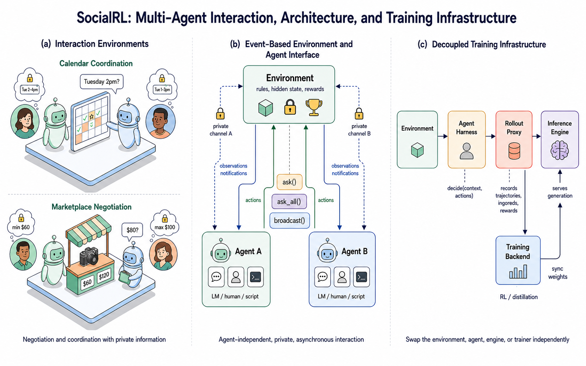
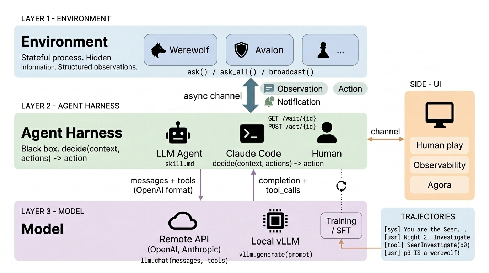
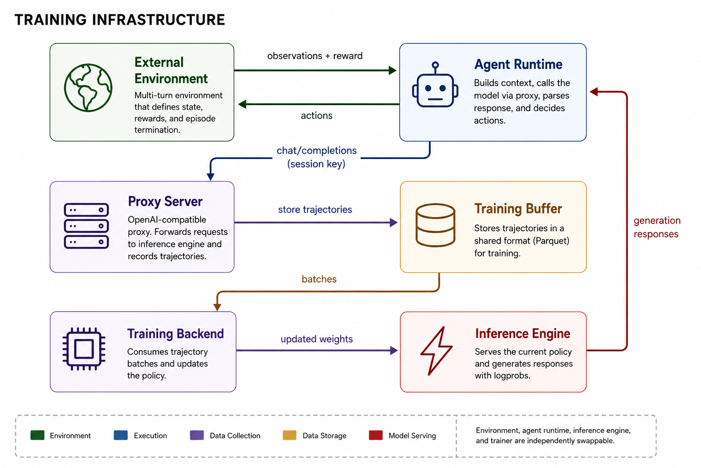

# 🖇️수동적 대리인에서 전략적 협상가로 - SocialRL로 소형 언어 모델의 사회적 추론 강화하기

## 🎯 문제: 어시스턴트를 좋게 만드는 성향이 대리인으로는 나쁘다

AI 에이전트가 하는 일 중 사용자의 이해관계가 걸린 몫이 커지고 있다. 에이전트가 사용자를 대신해 행동하고 그 결과가 사용자의 이익에 직접 영향을 준다(Sun et al., 2025b; South et al., 2025). 이미 배포된 시스템이 고객 응대를 처리하고, 회의를 조율하고, 물건을 사고 예약을 잡고, 집을 비교하거나 매물 투어 일정을 잡는 것을 돕는다(Kovala, 2026; Google, 2026; OpenAI, 2025; Zillow, 2026). 이런 응용은 AI 에이전트를 **대리인(delegate)**의 자리에 놓는다. 주체(principal)의 선호를 위임받고 개방형 환경에서 결과가 따르는 행동을 할 권한을 가진 시스템이다.

위임이 특히 어려워지는 지점은 상대방의 목표가 주체의 목표와 다를 때다. 고객 응대 에이전트(Chaturvedi and Verma, 2023)는 보상을 요구하는 사용자를 마주하고, 구매 에이전트는 더 높은 가격을 원하는 판매자와 협상하며(Haurum et al., 2024), 일정 조율 에이전트(Zou et al., 2026)는 서로 충돌하는 제약을 가진 참가자들을 조정해야 한다. 이런 상황에서는 상호작용을 끝내는 것만으로는 부족하다. 유능한 대리인은 사적 정보를 보호하고(Juneja et al., 2025), 상대의 유인을 추론하고(Matta, 2026), 언제 양보하고 언제 밀어붙일지 판단하며, 주체의 이익을 진전시키는 합의를 추구해야 한다(Sun et al., 2025a). 이 능력들의 묶음을 **사회적 추론(social reasoning)**이라 부른다. 전략적으로 효과적인 행동을 고르기 위해 다른 행위자의 잠재적 선호, 유인, 있을 법한 행동을 추론하는 것이다.

프런티어 모델은 일관된 협상을 수행하고 합의에도 자주 도달하지만, 총합 성과가 좋다고 해서 주체를 충실히 대변한다는 보장은 없다. 이 논문은 프런티어 모델이 제한적인 저항만 받아도 다투던 입장을 일상적으로 포기한다는 것을 발견한다. 투명성, 동조성, 합의에 이르려는 열의 같은 성향은 일반적 보조에는 유용하지만, 대리인으로 행동할 때는 에이전트를 예측 가능하고 착취 가능하게 만든다.

이 실패는 범용 어시스턴트를 학습시키는 목적함수와 전략적 위임에 필요한 목적함수 사이의 불일치에서 온다. instruction tuning과 RLHF는 보통 협조적 대화에서 폭넓게 도움이 되고(Dahlgren Lindström et al., 2025) 정직하고 무해하며 지시를 따르는 행동을 만들도록 설계된다(Kirk et al., 2024; Zhou et al., 2023; Dong et al., 2024). 목표가 충돌하고 사적 정보가 있는 상호작용에서는 같은 행동 사전확률이 성급한 정보 노출, 과도한 수용, 주체에게 불리한 결과라도 합의를 선호하는 경향으로 나타난다. 위임된 행위성은 주체 조건부 전략 행동을 요구한다. 선택적 정보 공개, 보정된 유보 경계, 합의가 주체의 효용을 희생시킬 때 거절하거나 상호작용을 길게 끌 의지가 그것이다.

SocialRL은 사회적 추론을 직접 학습시키는 인프라와 레시피다. 4B 모델에 초점을 두어, 전략적 위임이 프런티어 규모의 용량에 의존하지 않고 표적화된 post-training으로 유도될 수 있는지를 검증한다. 모든 실험의 기본 정책은 Qwen3-4B-Instruct-2507이다.

기여는 넷이다. 첫째, 전략적 위임을 사회적 추론 post-training 문제로 정식화하고 할당, 다중 쟁점 교섭, 가격 협상, 선호 기반 조율을 아우르는 이종 환경 스위트를 도입한다. 각 환경에서 도메인 전문가를 학습시키고 모든 정책을 전체 교차 환경 전이 행렬에서 평가한다. 둘째, 이벤트 기반의 에이전트 독립적 환경 인터페이스와 환경·에이전트 하네스·추론 엔진·트레이너를 분리하는 OpenAI 호환 rollout proxy를 결합한다. 셋째, 도메인 학습된 4B 정책이 GPT-4.1, GPT-5.1, GPT-5.2 범위의 총합 성능에 도달함을 보이고, 교차 환경 전이가 강하게 방향성이 있으며 구조에 의존함을 드러낸다. 전이 인식 cascade RL은 Avg-6 $0.627$에 도달하고, multi-teacher on-policy distillation은 추가 최적화 단계 $60$번만으로 전문가들 평균 우위의 $92.6\%$를 회복한다. 넷째, Infer $\rightarrow$ Act $\rightarrow$ Anticipate 감독을 도입해 완전한 추론 trace를 distill하는 것이 평가한 모든 협상 환경에서 행동만 감독하는 것보다 낫고 교차 환경 일반화도 개선함을 보인다. 나아가 선호 추론만이 아니라 next-action prediction이 협상 결과를 가장 잘 예측하는 theory-of-mind 구성 요소임을 확인한다.

## 🧭 선행 연구와의 위치

언어 모델 에이전트 연구는 외부 도구와 디지털 인터페이스를 통해 추론·계획·행동하도록 만드는 데 집중해 왔다. ReAct(Yao et al., 2022)는 언어 기반 추론과 환경 행동을 교대로 배치했고, Toolformer(Schick et al., 2023)는 언어 모델이 외부 API를 언제 어떻게 호출할지 학습할 수 있음을 보였다. 이어진 벤치마크들은 웹 탐색, 데스크톱 제어, 도구 매개 상호작용을 점점 현실적으로 평가했다(WebArena, OSWorld, $\tau$-bench; Zhou et al., 2024; Xie et al., 2024; Yao et al., 2024). 이 문헌은 계획(Wang et al., 2026b), 도구 선택(Yang et al., 2026a), 인터페이스 그라운딩(Awadallah et al., 2025), 정책 준수(Elkoussy and Perez, 2026)를 크게 진전시켰고 성능은 대체로 에이전트가 목표 환경 상태에 도달했는지로 측정한다. 전략적 상호작용은 여기에 차원을 하나 더한다. 환경 안에 또 다른 적응적 의사결정자가 있으므로(Anantaprayoon et al., 2026), 행동의 가치는 즉각적 효과뿐 아니라 그것이 드러내는 정보와 그것이 유발하는 미래 반응에 달려 있다.

위임 에이전트로서의 LLM 연구도 늘고 있다. $\tau$-bench(Yao et al., 2024)는 도메인별 정책 아래 소매·항공 고객 응대를 처리하는 에이전트를 모델링하고, ScheduleMe(Anantaprayoon et al., 2026)는 다중 에이전트 조율을 개인 캘린더 관리에 적용한다. CalBench는 사적 정보 아래 조율하는 캘린더 어시스턴트를 연구해 일정 효율성, 공정성, 소통, 프라이버시 사이의 상충을 드러낸다(Zou et al., 2026). 커머스에서 ACES는 소비자를 대신해 마켓플레이스를 살피고 상품을 고르는 에이전트를 평가하고(Allouah et al., 2026), 협상에서는 다자 교섭의 자문·코칭·자율 위임 인터페이스를 비교한 연구가 최근에 나왔다.

위임 상호작용을 위한 학습 쪽에서는 self-play와 언어 피드백, 행동 복제를 곁들인 반복 self-play, 검증 가능한 경제적 보상을 쓰는 강화학습, 합성 협상 지도학습과 강화학습을 결합한 파이프라인이 탐구되어 왔다(Fu et al., 2023; Liao et al., 2024; Liu et al., 2026; Bergemann et al., 2026). 이 방법들은 훨씬 강한 교섭 전략을 유도할 수 있지만 보통 양자 가격 교섭이나 자원 분할 같은 특정 상호작용 구조에 특화된다. Sotopia-$\pi$와 Sotopia-RL은 개방형 상호작용에서 일반적 사회 행동을 학습시키고(Wang et al., 2024; Yu et al., 2025), 최근 self-play 방법들은 협조·경쟁 게임에 걸쳐 전이 가능한 다중 에이전트 추론을 학습시킨다(Yuan et al., 2025; Jiang et al., 2026; Lyu et al., 2026). SocialRL은 이 방향들의 교차점, 즉 서로 다른 전략 능력을 요구하되 상대의 유인을 추론하고 주체를 대신해 행동해야 한다는 공통 요구를 공유하는 이종 위임 상호작용 전반에 단일 소형 모델을 post-training하는 데 초점을 둔다.

## 🧩 여섯 개 환경

SocialRL은 여섯 개의 이종 협상·조율 환경에서 학습한다. Deal-or-No-Deal, CaSiNo, Craigslist Bargains, Job Interview, Calendar, Marketplace다. 이들은 다중 쟁점 할당, 다중 쟁점 계약 협상, 단일 쟁점 가격 교섭, 선호 기반 조율에 걸쳐 있고 행동 공간, 효용 구조, 정보 비대칭, 상호작용 동역학이 서로 다르다. 공통 구조는 사회적 추론이다. 모든 도메인에서 에이전트는 사적 목표를 가진 상대를 추론하고, 자기 주체에 관한 정보를 보호하고, 언제 제안·양보·거절·종결할지 결정해야 한다.

*Table 1: The six social-reasoning environments. The suite spans heterogeneous negotiation and coordination structures while sharing a common requirement to reason strategically about a counterpart with private objectives.*

| **Domain** | **Structure** | **Issues** | **Private information** | **Roles** |
|----|----|----|----|----|
| Deal-or-No-Deal | multi-issue allocation | 3 item types | per-item values | symmetric |
| CaSiNo | multi-issue allocation | 3 resources | priority order | symmetric |
| Craigslist | single-issue price | price | target / listing price | asymmetric |
| Job Interview | multi-issue contract | 5 issues | utility weights | asymmetric |
| Calendar | slot coordination | time slots | slot preferences | asymmetric |
| Marketplace | single-issue price | price | reservation price | asymmetric |

**Deal-or-No-Deal(DnD).** 두 에이전트가 공유 아이템 풀(책, 모자, 공)을 나누고 각자 아이템별 사적 가치를 갖는다(Lewis et al., 2017). 시나리오는 아이템 multiset과 각 플레이어의 평가를 지정하며 모든 플레이어의 총 평가액은 $10$점으로 정규화된다. 에이전트는 자유 형식 메시지와 구조화된 제안을 번갈아 내며, 분할이 수락되거나 한쪽이 이탈하거나 라운드 상한에 도달할 때까지 진행한다. 평가액이 사적이므로 상대가 어떤 아이템을 중시하는지 파악해 낮은 가치 아이템을 높은 가치 아이템과 바꾸는 것이 효과적인 플레이다.

**CaSiNo.** 두 캠퍼가 음식, 물, 장작 꾸러미를 자원당 세 단위씩 정해진 재고에서 나눈다(Chawla et al., 2021). 각 플레이어는 페르소나와 배경 이야기에 근거한 사적 우선순위 순서를 갖는다. 우선순위는 단위당 효용으로 매핑되어 High $=5$, Medium $=4$, Low $=3$이고, 각 플레이어의 최대 점수는 $36$이다. DnD의 다중 쟁점 할당 구조를 공유하되 자연스러운 필요와 정당화를 통해 협상해야 한다.

**Craigslist Bargains.** 구매자와 판매자가 등록된 단일 품목의 가격을 협상한다(He et al., 2018). 시나리오는 여러 상품 카테고리의 Craigslist 게시물에서 유도되며, 사적 가격 목표가 교섭 범위를 정의한다. 환경은 일차원이고 역할 비대칭이다. 구매자는 낮은 가격을, 판매자는 높은 가격을 원한다. 따라서 anchoring, 양보 시점, 남은 잉여가 합의를 정당화하는지의 판단이 효과적인 협상을 좌우한다.

**Job Interview.** 노동자와 채용자가 급여, 주당 휴일, 직책, 근무지, 회사의 다섯 쟁점으로 이루어진 고용 패키지를 협상한다(Yamaguchi et al., 2021). 양측은 사적 효용과 쟁점 가중치를 가지며 일반적으로 계약의 서로 다른 차원을 중시한다. 시나리오당 가능한 합의가 대략 $10^{4}$개로, 스위트에서 가장 큰 구조화된 결과 공간을 제공한다.

**Calendar.** SocialReasoning-Bench(Microsoft Research, AI Frontiers, 2026)에서 가져왔다. 에이전트는 주체를 대신해, 주체와 선호가 다른 요청자와 회의 시간을 협상한다. 양측은 가용 시간 슬롯에 대한 사적 선호를 갖고, 최초 요청은 주체의 이익과 충돌한다. 에이전트는 요청자의 유연성에 관한 정보를 충분히 모으면서 주체에게 유리한 슬롯으로 상호작용을 몰아가야 한다.

**Marketplace.** 역시 SocialReasoning-Bench에서 가져왔다. 구매자 에이전트가 사적 유보 가격을 쥔 채 판매자와 구매를 협상한다. 판매자는 구매자에게 불리한 가격에서 시작하고, 합의 가능 영역이 존재하도록 보장된다. Craigslist와 마찬가지로 전략적 가격 협상이 필요하지만 인터페이스, 상대 행동, 효용 구성이 달라서 구조적으로 관련된 도메인 간 전이를 연구하기에 유용한 쌍이 된다.

## 🏗️ 인프라: 이벤트 기반 환경 인터페이스와 분리된 학습 스택

협상을 통한 에이전트 학습은 통상적인 단일 턴 post-training과 다른 인프라를 요구한다. 환경은 상태를 갖고 부분 관측되며 서로 다른 일정으로 행동하는 여러 에이전트가 있다. 한 에피소드에 모델 호출이 여러 번 들어가고, 보상은 상호작용이 완전히 끝난 뒤에만 얻어지는 경우가 많다. 게다가 실험은 로컬 학습 가능 정책, 원격 프런티어 모델 상대, 스크립트 에이전트, 인간 참가자를 섞을 수 있다. 그래서 시스템은 두 가지 분리 위에 설계된다. 이벤트 기반 인터페이스가 환경과 에이전트를 분리하고, OpenAI 호환 프록시가 에이전트 실행과 모델 학습을 분리한다.

*Figure 1: SocialRL overview: interaction environments, event-based agent interface, and decoupled training infrastructure.*

그림은 세 패널로 나뉜다. (a)는 상호작용 환경 예시다. Calendar Coordination에서 두 참가자와 두 에이전트가 캘린더를 두고 조율하는데, 왼쪽의 잠긴 생각 풍선은 `Tue 2-4pm`, 오른쪽은 `Tue 1-3pm`을 담고 말풍선은 "Tuesday 2pm?"을 묻는다. Marketplace Negotiation에서는 카메라와 `$60`, `$120` 가격표가 걸린 노점을 두고 협상하며, 왼쪽 잠긴 풍선은 `min $60`, 오른쪽은 `max $100`, 말풍선은 "$80?"이다. 즉 사적 정보를 가진 협상과 조율이라는 점이 두 예시의 공통점이다. (b)는 이벤트 기반 환경과 에이전트 인터페이스로, 규칙·은닉 상태·보상을 가진 Environment가 private channel A/B를 통해 observations와 notifications를 각 에이전트에 내려보내고 에이전트는 actions를 올려보내며, 그 사이에 `ask()`, `ask_all()`, `broadcast()`가 놓인다. 각 에이전트는 LM / human / script 중 무엇이든 될 수 있다. (c)는 분리된 학습 인프라로 Environment → Agent Harness → Rollout Proxy → Inference Engine의 사슬이고, Rollout Proxy 아래에 Training Backend(RL / distillation)가 붙어 Inference Engine으로 sync weights가 올라간다.

### 에이전트 독립적 환경

환경은 게임 규칙, 은닉 상태, 합법 행동, 보상 계산을 소유하는 상태 있는 프로세스이며 참가자가 어떻게 구현되는지에 대해 어떤 가정도 하지 않는다. 각 참가자는 사적 비동기 채널을 통해 환경과 상호작용하고, `decide(context, actions) `$\rightarrow$` action`이라는 단일 연산을 구현하는 블랙박스로 취급된다. 따라서 에이전트는 언어 모델, 외부 코딩 에이전트, 스크립트 정책, 인간 인터페이스 중 무엇이 뒤에 있어도 된다. 모델 계층도 에이전트 하네스와 분리되어, 모델 추론은 OpenAI 호환 API로 표준 chat 메시지와 도구 정의만 노출한다.

### 이벤트 기반 상호작용과 행동 의미론

환경과 에이전트 사이의 통신은 환경 상태의 반복적 스냅샷이 아니라 순서 있는 이벤트 스트림으로 표현된다. 두 이벤트 유형을 구분하는데, *observation*은 무언가가 일어났음을 기록하고 *notification*은 수신 에이전트에게 결정을 요청하며 현재 가능한 행동을 명시한다. 환경은 세 원시 연산으로 상호작용을 구동한다. 순차 결정을 위한 `ask()`, 동시 결정을 위한 `ask_all()`, 응답이 필요 없는 이벤트를 위한 `broadcast()`다. 그 결과 환경 코루틴의 제어 흐름이 별도의 상태 기계나 디스패처 추상 없이 게임 논리를 직접 표현한다.

이벤트 스트림은 부분 관측 다중 에이전트 상호작용에서 중요한 정보, 즉 무엇이 언제 일어났고 누가 관측했는지를 보존한다. 또 에이전트의 *행동*과 그 *효과*를 자연스럽게 분리한다. 행동을 제출하면 결정이 기록되고 확인 응답이나 검증 오류만 돌아오며, 그 결과는 이후 observation으로 방출된다. 행동이 결과와 일대일로 대응하지 않기 때문에 이 구분이 중요하다. 예를 들어 투표는 개별 플레이어의 행동이지만 탈락은 모든 투표가 모인 뒤 산출되는 집합적 결과다. 부분 관측성도 같은 경계에서 강제된다. 방출되는 각 이벤트는 의도된 수신자에 맞춰 필터링되므로 에이전트의 채널에는 그 참가자에게 실제로 주어진 정보만 담긴다.

*Figure 2: Environment and agent architecture. A stateful environment communicates with black-box agents through per-agent asynchronous channels carrying structured observations, notifications, and actions.*

이 그림은 세 계층 구조를 보여 준다. LAYER 1 - ENVIRONMENT에는 상태 있는 프로세스이자 은닉 정보와 구조화된 관측을 갖는 Environment가 있고 그 안에 Werewolf, Avalon 등 게임이, 아래에 `ask() / ask_all() / broadcast()`가 놓인다. Environment와 아래 계층은 Observation, Notification, Action을 실어 나르는 async channel로 연결된다. LAYER 2 - AGENT HARNESS는 `decide(context, actions) -> action`을 구현하는 블랙박스로, `skill.md`를 쓰는 LLM Agent, `GET /wait/{id}`와 `POST /act/{id}`를 쓰는 Claude Code, 그리고 Human이 나란히 있다. LAYER 3 - MODEL에는 왼쪽에 Remote API(OpenAI, Anthropic)와 `llm.chat(messages, tools)`, 오른쪽에 Local vLLM과 `vllm.generate(prompt)`가 있고, 위로는 messages + tools(OpenAI format)가 내려가고 completion + tool_calls가 올라간다. 오른쪽에는 Human play, Observability, Agora를 담은 UI 패널과, `[sys] You are the Seer...` / `[usr] Night 2. Investigate.` / `[tool] SeerInvestigate(p0)` / `[usr] p0 IS a werewolf!` 같은 줄을 담은 TRAJECTORIES 패널이 Training / SFT로 흘러간다.

원격 에이전트도 커서 기반 HTTP 인터페이스로 같은 논리적 스트림에 접근한다. 이벤트는 append-only 히스토리에 저장되고 시퀀스 번호로 색인되므로 연결이 끊긴 클라이언트가 관측을 잃지 않고 마지막 커서에서 재개할 수 있다. 로컬과 원격 실행은 상호작용 의미론을 공유하고 전송 방식만 다르다.

장애 처리도 명시적이다. 제출된 모든 행동은 자신이 응답하는 notification을 식별한다. 에이전트가 응답을 생성하는 동안 환경이 진행되었다면 그 행동은 stale로 거부되고, 에이전트는 새 이벤트를 소비한 뒤 다시 결정한다. append-only 이벤트 히스토리와 함께 이 설계는 재개 가능한 이벤트 전달을 제공하면서 각 결정 지점마다 최대 하나의 행동만 수락되도록 보장한다. 잘못된 행동은 정보를 담은 이벤트를 만들고 재시도될 수 있으며, 타임아웃은 무해한 기본 행동을 적용하고 실패를 이벤트 스트림에 기록한다. 형식이 깨진 응답, 실패한 모델 요청, 끊긴 연결은 에피소드를 종료시키는 대신 trajectory의 일부가 된다.

### 분리된 학습 인프라

*Figure 3: Decoupled training architecture. The agent runtime executes independently of the trainer and sends standard model requests through a rollout proxy.*

그림에서 External Environment(상태·보상·에피소드 종료를 정의하는 다중 턴 환경)와 Agent Runtime(컨텍스트를 구성하고 프록시를 통해 모델을 호출하며 응답을 파싱해 행동을 결정)이 `observations + reward`와 `actions`로 오간다. Agent Runtime은 `chat/completions (session key)`로 Proxy Server(OpenAI 호환 프록시, 추론 엔진으로 요청 전달 및 trajectory 기록)에 연결되고, 프록시는 `store trajectories`로 Training Buffer(Parquet 공유 형식)에 쌓는다. Training Buffer는 `batches`를 Training Backend에 넘기고, Training Backend는 `updated weights`를 Inference Engine에 보내며, Inference Engine의 `generation responses`가 Agent Runtime으로 돌아간다. 아래 범례는 상자 색을 Environment, Execution, Data Collection, Data Storage, Model Serving에 대응시키고, 네 구성 요소가 독립적으로 교체 가능하다고 명시한다.

**rollout과 학습의 분리.** 환경과 에이전트 하네스는 추론 시점과 정확히 동일하게 실행된다. 환경이 관측·행동·보상을 정하고, 에이전트가 프롬프트 구성, 메모리 관리, 도구 호출, 모델 출력 해석을 정한다. 어느 쪽도 학습 전용 논리를 담지 않는다. 트레이너 입장에서는 이 구현 세부가 보이지 않고, 모델 API 경계에서 포착된 trajectory만 소비한다.

**학습 경계로서의 rollout proxy.** 프록시는 하위 추론 엔드포인트와 같은 OpenAI 호환 인터페이스를 노출하므로 에이전트는 클라이언트의 base URL만 바꾸면 된다. 모든 모델 호출에 대해 프록시는 에이전트로부터 받은 정확한 요청과 모델이 돌려준 정확한 응답을 기록하면서 응답은 손대지 않고 전달한다. 각 에피소드에는 모든 모델 요청에 실려 다니는 고유 session key가 붙는다. 세션은 상태 없는 HTTP 호출들을 하나의 trajectory로 묶고, 에피소드가 끝나면 런타임이 최종 보상을 붙이고 세션을 닫는다.

**trajectory 재구성과 메모리 압축.** 프록시는 에이전트가 컨텍스트를 특정 방식으로 유지한다고 가정하지 않는다. 에이전트 하네스는 흔히 히스토리를 자르거나 앞선 상호작용을 요약하거나 메모리를 압축하므로, 나중의 모델 요청이 앞선 요청의 prefix를 더 이상 확장하지 않을 수 있다. 컨텍스트가 예상 prefix를 공유하는 연속 호출들은 같은 학습 세그먼트로 취급되고, prefix 관계가 깨지면 프록시가 새 세그먼트를 시작한다. 각 세그먼트는 그 응답이 생성된 정확한 컨텍스트를 유지하므로, 정책이 실제로 관측한 적 없는 인공적 대화 히스토리를 재구성할 필요가 없다.

**RL과 distillation의 공통 계약.** 강화학습을 위해서는 토큰화된 프롬프트와 응답을 생성 정책의 토큰 단위 log probability와 함께 기록한다. 생성 시점에 이 확률을 포착하면 최적화 전에 정책이 갱신되더라도 PPO가 요구하는 behavior policy가 보존된다. distillation을 위해서는 원본 메시지, 도구 정의, 응답, 도구 호출을 저장해 폐쇄형이나 이종 teacher의 trajectory를 나중에 student의 tokenizer로 토큰화할 수 있게 한다. 완료된 세션은 공유 Parquet 버퍼로 내보내지고, RL 레코드는 응답 토큰, rollout log probability, 보상, 과제 식별자, 정책 버전을 담으며 distillation 레코드는 원본 상호작용 trace를 보존한다. 학습 손실은 모델 응답 토큰에만 적용된다. 이 공통 표현 덕분에 rollout 시스템은 경량 로컬 트레이너, veRL을 통한 분산 PPO, phitrain을 통한 대안 알고리즘, 작은 어댑터를 통한 외부 학습 백엔드와 짝지어질 수 있다.

**비동기 rollout과 최적화.** rollout 수집, 최적화, 추론은 비동기로 진행된다. 에피소드 워커가 계속 trajectory를 생성해 버퍼에 붙이고, 트레이너가 배치로 소비해 정책을 갱신하고 새 가중치를 추론 서버에 동기화한다. 비동기성은 rollout 생성이 최적화보다 앞설 때 정책 staleness를 만들 수 있는데, 트레이너보다 앞서 보내지는 trajectory 수를 제한하는 용량 기반 게이트로 이 효과를 제한한다. 각 trajectory에는 그것을 생성한 정책 버전이 태깅되고, 남은 off-policy 차이는 PPO의 importance-sampling 보정으로 처리한다.

## 🧮 보상 설계: 결과만, 그러나 시나리오 난이도를 반영해서

여섯 환경 모두 종말 시점의 결과 전용 보상을 쓴다. 합의, 이탈, 타임아웃 뒤에 스칼라 하나가 주어지며 중간 보상 shaping은 없다. 설계 원칙은 둘이다. 첫째, 모든 환경이 결과를 공통 $[0,1]$ 범위로 매핑해 교차 환경 보고, 집계, 다중 도메인 학습 중 체크포인트 선택에 일관된 끝점을 제공한다. 둘째, 보상은 그 시나리오와 역할에서 실제로 가능했던 기회 대비 합의의 질을 반영해야 한다. 그래서 정규화 방식이 상호작용 구조마다 다르다. DnD, CaSiNo, Job Interview는 시나리오·역할별 기준 합의를 쓰고, Craigslist와 Marketplace는 가용 가격 협상 회랑으로 정규화하며, Calendar는 상호 가능한 시간 슬롯들의 가치 범위로 정규화한다.

고정된 시나리오와 기준점 $m$에 대해 이 변환은 $z$에 대해 순증가라서 그 시나리오 안에서 결과의 순위를 보존한다. 목적은 시나리오 간에 결과를 어떻게 평가할지 보정하는 것이다. 예컨대 정규화 효용 $0.6$은 갈등이 큰 시나리오에서는 공정하고 효율적인 기준을 넘을 수 있지만 선호가 대체로 양립하는 시나리오에서는 그 기준에 한참 못 미칠 수 있다. 보상 곡선을 $m$에 중심을 두면 시나리오별 기준에서 약한 합의와 강한 합의가 갈리는 전이 구간에 해상도가 가장 크게 배정된다.

### 다중 쟁점 협상의 난이도 인식 보상

*할당 게임.* DnD와 CaSiNo에서 시나리오는 아이템 개수 $\{c_{k}\}$와 사적 아이템별 가치 $v^{a}$, $v^{b}$를 지정한다. 플레이어 $a$가 아이템 $k$를 $x_{k}$단위 받는 할당 $x$에 대해 두 플레이어는 다음을 얻는다.

$$s_{a}(x)=\sum_{k}x_{k}v^{a}_{k},\qquad s_{b}(x)=\sum_{k}(c_{k}-x_{k})v^{b}_{k}.$$ (1)

최대 원점수는 DnD에서 $S=10$, CaSiNo에서 $S=36$이다. 할당 공간이 작으므로 가능한 모든 결과를 열거해 Pareto frontier를 정확히 계산한다.

기준점은 Pareto 최적이면서 envy-free인 할당으로 정의한다. 어떤 할당이 envy-free라는 것은 각 플레이어가 자신의 사적 평가 아래 상대의 묶음보다 자기 묶음을 약하게 선호한다는 뜻이다. 플레이어 $i$에 대해 *envy-free Pareto maximum*을 다음과 같이 정의한다.

$$m_{i}=\frac{1}{S}\max\left\{s_{i}(x):x\text{ is Pareto-optimal and envy-free}\right\}.$$ (2)

이 기준은 효율적이면서 공정한 결과들 중 플레이어 $i$가 얻을 수 있는 최대 정규화 값이다. 두 조건을 모두 만족하는 할당이 없는 시나리오에서는 두 플레이어의 envy 위반 중 큰 쪽을 최소화하는 Pareto 최적 할당을 쓴다.

*Job Interview.* 각 결과는 쟁점마다 하나의 옵션을 배정하는 거래 $d$다. 노동자와 채용자는 사적 쟁점 가중치와 옵션 효용에서 유도된 정규화 효용 $u_{\mathrm{w}}(d),u_{\mathrm{r}}(d)\in[0,1]$을 받는다. 결과 공간 전체를 열거할 수 있으므로 기준 합의를 egalitarian 목적으로 정의한다.

$$d^{*}=\arg\max_{d}\min\left(u_{\mathrm{w}}(d),u_{\mathrm{r}}(d)\right),$$ (3)

동점은 총효용이 큰 쪽으로 깬다. 역할별 기준점은 다음과 같다.

$$m_{\mathrm{w}}=u_{\mathrm{w}}(d^{*}),\qquad m_{\mathrm{r}}=u_{\mathrm{r}}(d^{*}).$$ (4)

*공통 난이도 인식 변환.* $z\in[0,1]$을 에이전트의 정규화 결과 효용, $m\in[0,1]$을 시나리오·역할별 기준점이라 하면 DnD, CaSiNo, Job Interview는 다음을 쓴다.

$$r=\frac{\sigma\!\left(\frac{z-m}{T}\right)-\sigma\!\left(\frac{-m}{T}\right)}{\sigma\!\left(\frac{1-m}{T}\right)-\sigma\!\left(\frac{-m}{T}\right)},\qquad\sigma(x)=\frac{1}{1+e^{-x}},\qquad T=0.2.$$ (5)

이 변환은 $z=0$에서 $r=0$, $z=1$에서 $r=1$을 유지하면서 곡선의 가장 가파른 부분을 $z=m$에 둔다. 기준 합의 근처의 결과가 가장 큰 보상 분해능을 받는다. 같은 원효용이 갈등이 큰 시나리오에서는 잘한 플레이를, 선호가 대체로 양립하는 시나리오에서는 약한 합의를 뜻할 수 있기 때문이다. 이 정규화는 공통 절대 보상 범위를 유지하면서도 각 시나리오와 역할에서 합리적으로 달성 가능했던 것을 반영하므로, 효용 frontier가 다른 시나리오들에 걸쳐 PPO에 더 비교 가능한 합의 품질 신호를 준다.

### 단일 쟁점 협상의 가격 회랑 보상

Craigslist와 Marketplace는 일차원 교섭 잉여를 각 당사자가 얼마나 가져가는지를 측정한다. $p_{\min}$을 회랑의 구매자 유리 끝점, $p_{\max}$를 판매자 유리 끝점, $p_{\mathrm{deal}}$을 합의 가격이라 하고 $p_{\min}<p_{\max}$일 때

$$r_{\mathrm{buyer}}=\operatorname{clip}\left(\frac{p_{\max}-p_{\mathrm{deal}}}{p_{\max}-p_{\min}},0,1\right),\qquad r_{\mathrm{seller}}=\operatorname{clip}\left(\frac{p_{\mathrm{deal}}-p_{\min}}{p_{\max}-p_{\min}},0,1\right).$$ (6)

회랑 안의 모든 합의에서 두 보상의 합은 $1$이다. $p_{\min}$에서의 거래는 잉여 전부를 구매자에게, $p_{\max}$에서의 거래는 전부를 판매자에게 준다.

Craigslist에서 회랑은 구매자의 목표 가격 $p_{t}$와 등록 가격 $p_{\ell}$로 정의된다.

$$p_{\min}=p_{t},\qquad p_{\max}=p_{\ell}.$$ (7)

Marketplace에서 회랑은 판매자와 구매자의 사적 유보 가격이 정의하는 합의 가능 영역이다. $p_{s}$를 판매자, $p_{b}$를 구매자의 유보 가격이라 하고 $p_{s}<p_{b}$일 때

$$p_{\min}=p_{s},\qquad p_{\max}=p_{b}.$$ (8)

학습된 Marketplace 대리인은 구매자를 대변하므로 종말 보상은 $r_{\mathrm{buyer}}$다. 판매자의 유보 가격에서 성사된 거래는 잉여 전부를 주체에게 주어 $1$점, 구매자의 유보 가격에서 성사된 거래는 $0$점이며, 구매자의 유보 가격을 넘는 거래도 구매자 가치는 0이다. 요컨대 두 환경은 같은 정규화 잉여 분배 보상을 쓰고 회랑 끝점을 어떻게 지정하는지만 다르다.

### 슬롯 조율의 선호 기반 보상

Calendar에서 에이전트는 후보 시간 슬롯에 대한 주체의 가치 함수 $v(t)\in[0,1]$을 받는다. 요청자는 같은 슬롯들에 대해 주체의 선호와 반대되도록 구성된 별도 가치 함수를 갖는다. $\mathcal{Z}$를 두 캘린더 모두에서 비어 있는 시간 슬롯 집합, 즉 합의 가능 영역이라 하면

$$v_{\max}=\max_{t\in\mathcal{Z}}v(t),\qquad v_{\min}=\min_{t\in\mathcal{Z}}v(t).$$ (9)

$t_{\mathrm{deal}}\in\mathcal{Z}$에 회의가 잡히면 보상은

$$r_{\mathrm{calendar}}=\frac{v(t_{\mathrm{deal}})-v_{\min}}{v_{\max}-v_{\min}}.$$ (10)

구성상 가능한 슬롯들의 선호 점수는 서로 다르므로 $v_{\max}>v_{\min}$이다. 주체가 가장 선호하는 상호 가능 슬롯이 $1$점, 요청자에게 가장 유리한 슬롯이 $0$점이다. 이 보상은 합의의 질을 과제 완수와 구분한다. 상호 가능한 회의를 아무거나 잡으면 조율 과제는 완수되지만, 보상은 선택된 슬롯이 실제로 주체의 선호를 진전시켰는지를 잰다.

타임아웃과 중단된 상호작용은 0점을 받는다. 환경이 명시적 이탈 행동을 제공하면 그 과제 고유의 외부 선택지 보수를 유지한다. Calendar와 Marketplace는 합의에 이르지 못하면 결과 가치를 0으로 배정한다.

## 🥇 1단계: 도메인 특화 전문가 학습

각 환경마다 특화된 4B 정책을 학습시킨다. DnD, CaSiNo, Job Interview, Calendar는 종말 결과 보상으로 기본 모델을 PPO로 직접 최적화한다. 가격 협상 환경인 Craigslist와 Marketplace는 PPO 전에 supervised fine-tuning(SFT)으로 정책을 초기화한다. 이 warm start는 필요 선행 교섭 행동을 정책의 support 안에 넣어 탐색을 개선하고, 그다음 PPO가 환경의 종말 효용에 맞춰 그 행동들을 최적화한다.

**PPO 설정.** 별도로 명시하지 않는 한 모든 PPO 실행은 Qwen3-1.7B critic을 별도로 쓴다. 4B actor를 얼린 채 critic을 $30$ 최적화 단계 동안 warm up한 뒤 actor와 critic을 함께 갱신한다. actor는 학습률 $2\times 10^{-6}$, batch size 144, mini batch size 36, max gradient norm 5를 쓰고 critic은 학습률 $1\times 10^{-5}$를 쓴다. 최대 학습 단계는 200이다. 이 설정에서 critic은 actor 학습 전에 대체로 explained variance 약 $0.8$에 도달해, 가치 모델이 에피소드 return 변동의 대부분을 포착하고 PPO 갱신에 신뢰할 만한 baseline을 준다는 것을 시사한다.

*Table 2: In-domain specialist training. Base and domain-trained 4B scores are reported as mean $\pm$ standard deviation across repeated evaluations; GPT baselines are reported as mean scores. Each domain-trained checkpoint is evaluated on its training environment.*

|  | **DnD** | **CaSiNo** | **Craigslist** | **Job Int.** | **Calendar** | **Mktplace** | **Avg.** |
|----|----|----|----|----|----|----|----|
| Base 4B | $0.583\pm 0.001$ | $0.476\pm 0.014$ | $0.318\pm 0.012$ | $0.479\pm 0.032$ | $0.301\pm 0.017$ | $0.174\pm 0.026$ | 0.389 |
| **Domain-trained 4B** | $0.656\pm 0.008$ | $0.503\pm 0.007$ | $0.583\pm 0.008$ | $0.594\pm 0.007$ | $0.540\pm 0.017$ | $0.838\pm 0.013$ | **0.619** |
|  |  |  |  |  |  |  |  |
| GPT-4.1 | 0.653 | 0.491 | 0.540 | 0.588 | 0.673 | 0.804 | 0.625 |
| GPT-5.1 | 0.671 | 0.499 | 0.607 | 0.596 | 0.573 | 0.767 | 0.619 |
| GPT-5.2 | 0.663 | 0.488 | 0.577 | 0.579 | 0.643 | 0.727 | 0.613 |
| GPT-5.5 | 0.665 | 0.559 | 0.746 | 0.590 | 0.702 | 0.985 | 0.708 |

도메인 내 post-training은 여섯 상호작용 구조 모두에서 강한 전문가를 만든다. 논문 본문은 특화된 4B 정책들이 도메인 평균 0.615 효용을 얻어 GPT-4.1(0.625), GPT-5.1(0.619), GPT-5.2(0.613)에 비견된다고 적고, 같은 표의 Avg. 열과 초록·표 캡션은 0.619로 적는다. 환경 수준에서 4B 전문가는 DnD, CaSiNo, Craigslist, Marketplace에서 GPT-4.1/5.1/5.2 범위 안이거나 그 위에 있고, Job Interview와 Calendar에서는 근접한다. 평가는 평균과 분산을 계산하기 위해 5회 실행했다.

## 🔀 교차 환경 전이는 게임 구조를 따른다

도메인 학습된 모든 정책을 여섯 환경 전부에서 평가해 전이 행렬을 만든다. 대각은 도메인 내 특화를, 각 비대각 항은 한 *donor* 환경에서의 학습이 다른 환경 성능을 어떻게 바꾸는지를 잰다. 각 donor는 나머지 다섯 환경에서 기본 모델 대비 평균 변화인 *out-transfer*로 요약된다.

*Table 3: Cross-environment transfer. Each row evaluates a policy trained on one donor environment across all six domains ($\star$ denotes the training domain). Out-transfer is the mean change from the base 4B policy over the five off-domain environments. ^(†)Craigslist uses SFT+PPO. Reported uncertainties are standard deviations across three SGLang benchmark runs where available.*

| **Donor** | **DnD** | **CaSiNo** | **Craigslist** | **Job Int.** | **Calendar** | **Mktplace** | **Out-tr.** |
|----|----|----|----|----|----|----|----|
| Baseline | $0.583{\pm}.001$ | $0.476{\pm}.014$ | $0.318{\pm}.012$ | $0.479{\pm}.032$ | $0.301{\pm}.012$ | $0.174{\pm}.003$ | — |
|  |  |  |  |  |  |  |  |
| Deal-or-No-Deal | $\mathbf{0.656{\pm}.008}^{\star}$ | $0.491{\pm}.012$ | $0.282{\pm}.028$ | $0.481{\pm}.016$ | $0.370{\pm}.009$ | $0.150{\pm}.003$ | $+0.005$ |
| CaSiNo | $0.597{\pm}.019$ | $\mathbf{0.503{\pm}.007}^{\star}$ | $0.309{\pm}.004$ | $0.463{\pm}.016$ | $0.331{\pm}.010$ | $0.168{\pm}.022$ | $+0.003$ |
| Craigslist^(*†*) | $0.564{\pm}.023$ | $0.494{\pm}.007$ | $\mathbf{0.583{\pm}.008}^{\star}$ | $0.447{\pm}.011$ | $0.266{\pm}.023$ | $0.491{\pm}.007$ | $\mathbf{+0.050}$ |
| Job Interview | $0.610{\pm}.017$ | $0.511{\pm}.004$ | $0.328{\pm}.010$ | $\mathbf{0.594{\pm}.007}^{\star}$ | $0.373{\pm}.022$ | $0.161{\pm}.011$ | $+0.026$ |
| Calendar | $0.607{\pm}.010$ | $0.474{\pm}.007$ | $0.167{\pm}.013$ | $0.311{\pm}.013$ | $\mathbf{0.540{\pm}.017}^{\star}$ | $0.172{\pm}.008$ | $-0.060$ |
| Marketplace | $0.558{\pm}.010$ | $0.464{\pm}.007$ | $0.502{\pm}.015$ | $0.371{\pm}.010$ | $0.268{\pm}.015$ | $\mathbf{0.838{\pm}.013}^{\star}$ | $+0.001$ |
|  |  |  |  |  |  |  |  |
| GPT-4.1 | 0.653 | 0.491 | 0.540 | 0.588 | 0.673 | 0.804 | — |
| GPT-5.1 | 0.671 | 0.499 | 0.607 | 0.596 | 0.573 | 0.767 | — |
| GPT-5.2 | 0.663 | 0.488 | 0.577 | 0.579 | 0.643 | 0.727 | — |
| GPT-5.5 | 0.665 | 0.559 | 0.746 | 0.590 | 0.702 | 0.985 | — |

전이는 donor-recipient 조합에 크게 의존한다. 가장 뚜렷한 패턴은 상호작용 구조가 비슷한 환경들 사이의 전이다. 둘 다 가격 협상인 Craigslist와 Marketplace가 가장 큰 두 개의 도메인 간 이득을 보인다. Craigslist 학습은 Marketplace를 $0.174$에서 $0.491$로($+0.317$), Marketplace 학습은 Craigslist를 $0.318$에서 $0.502$로($+0.184$) 올린다. 할당 쌍인 DnD와 CaSiNo도 양방향으로 긍정 전이하지만 폭은 더 작다. 어떤 환경은 더 넓게 전이한다. Job Interview는 Craigslist 다음으로 강한 범용 donor로 평균 out-transfer $+0.026$이고 DnD, CaSiNo, Craigslist, Calendar에서 개선을 만든다. 반대로 도메인 내에서 매우 강해지고도 쓸모 있는 donor가 되지 않을 수 있다. Marketplace는 자기 과제에서 $0.838$에 도달하지만 나머지 다섯 환경에 대한 평균 효과는 거의 중립이다. Calendar는 일부 도메인에서 가장 분명한 부정적 donor로 out-transfer가 $-0.060$이고 Craigslist($0.318\!\rightarrow\!0.167$)와 Job Interview($0.479\!\rightarrow\!0.311$)에서 큰 하락을 낸다.

결국 중요한 것은 전문가가 얼마나 강한지가 아니라 어떤 능력을 배웠고 어느 환경이 그것을 받는지다. 이 관찰이 통합 단계의 핵심이 된다.

## 🪜 2단계A: 전이 인식 cascade RL

*cascade RL*(Wang et al., 2025; Du et al., 2024)은 환경들을 순차적으로 거치며 강화학습을 계속한다. 각 단계가 환경 보상을 직접 최적화하므로 학습 도중의 긍정 전이를 활용할 수 있고 앞서 배운 능력을 단일 도메인 전문가 이상으로 개선할 수도 있다. 대신 비용이 크다. 환경마다 완전한 RL 단계를 하나씩 더 돌려야 하므로 학습된 전문가를 직접 재사용하는 대신 사실상 능력을 다시 배우는 셈이다. 게다가 유익한 전이와 파괴적 전이가 강하게 비대칭이라 최종 정책이 학습 순서에 크게 의존한다.

**공통 초기화.** 두 통합 방법 모두 같은 Craigslist-SFT 체크포인트에서 시작한다. 기본 4B 모델이 Craigslist 협상에 필요한 anchoring 행동을 거의 탐색하지 않기 때문에 이 초기화가 필요하다. 1단계에서 관찰된 대로 기본 정책에 PPO를 직접 걸면 Craigslist에서 개선에 실패하고, 기본 모델에서 Craigslist만으로 OPD를 해도 그 능력을 얻지 못한다. 지도 distillation이 이 선행 행동을 student의 support 안에 먼저 놓아야 RL이든 OPD든 그것을 최적화하고 다른 환경의 능력과 결합할 수 있다. 같은 초기화를 쓰는 것은 두 방법의 비교를 통제하는 효과도 있다.

**전이 인식 순서.** 세 가지 패턴이 커리큘럼을 이끈다. 첫째, Craigslist와 Marketplace가 스위트에서 가장 강한 전이 쌍이다(각각 $+0.317$, $+0.184$). 그래서 둘을 연달아 배치하되 더 강한 전이 방향을 활용하도록 Craigslist를 먼저 둔다. 둘째, Calendar는 Craigslist를 $0.151$, Job Interview를 $0.168$ 떨어뜨리는 파괴적 donor이며 평균 out-transfer가 음수인 유일한 도메인이다. 그래서 교섭 능력이 획득되기 전인 cascade 맨 앞에 둔다. 셋째, Job Interview는 전이가 강하게 비대칭이다. 여러 도메인에 긍정적으로 전이하지만 자기 성능은 다른 곳에서 학습한 뒤 잘 보존되지 않는다. 그래서 마지막에 두어 이후 간섭에 노출되지 않게 한다. 결과는 다음 *transfer-aware* 커리큘럼이다.

$$\text{Calendar}\rightarrow\text{CaSiNo}\rightarrow\text{DnD}\rightarrow\text{Craigslist}\rightarrow\text{Marketplace}\rightarrow\text{Job Interview}.$$ (11)

**설정과 통제군.** 모든 cascade 실험은 같은 Craigslist-SFT 초기화에서 시작하고 같은 PPO 설정과 단계당 학습 예산을 쓴다. 각 단계는 최대 200 스텝의 독립 PPO이고, 20 학습 스텝마다 작은 검증 데이터셋에서 체크포인트를 평가한다. 무작위 순서 통제군은

$$\text{Craigslist}\rightarrow\text{Job Interview}\rightarrow\text{DnD}\rightarrow\text{CaSiNo}\rightarrow\text{Calendar}\rightarrow\text{Marketplace}.$$ (12)

주요 순서 원칙을 일부러 뒤집은 *anti-transfer* 커리큘럼은

$$\text{Job Interview}\rightarrow\text{Marketplace}\rightarrow\text{Craigslist}\rightarrow\text{DnD}\rightarrow\text{CaSiNo}\rightarrow\text{Calendar}.$$ (13)

보존하기 어려운 Job Interview 능력을 맨 앞에, 파괴적인 Calendar 단계를 맨 뒤에 놓는 배치다.

*Table 5: Cascade RL is sensitive to environment ordering. Each final evaluation uses $10$ scenarios $\times$ $3$ opponents $\times$ $5$ trials ($150$ games per environment). Transfer-aware scores are mean $\pm$ standard deviation over two independent evaluations, and random-order scores are mean $\pm$ standard deviation over repeated evaluations.*

| **Environment** | **Transfer-aware** | **Random** | **Anti-transfer** |
|----|----|----|----|
| Deal-or-No-Deal | $0.617\pm 0.008$ | $0.604\pm 0.012$ | $0.622\pm 0.018$ |
| CaSiNo | $0.482\pm 0.019$ | $0.465\pm 0.016$ | $0.443\pm 0.023$ |
| Craigslist | $0.580\pm 0.007$ | $\mathbf{0.637\pm 0.022}$ | $0.497\pm 0.018$ |
| Job Interview | $0.538\pm 0.012$ | $0.478\pm 0.030$ | $0.471\pm 0.009$ |
| Calendar | $\mathbf{0.742\pm 0.037}$ | $0.541\pm 0.021$ | $0.641\pm 0.011$ |
| Marketplace | $0.803\pm 0.008$ | $0.783\pm 0.024$ | $0.698\pm 0.022$ |
|  |  |  |  |
| **Avg-6** | $\mathbf{0.627\pm 0.004}$ | $0.578\pm 0.008$ | $0.562\pm 0.010$ |

전이 인식 cascade는 Avg-6 $0.627\pm 0.004$에 도달해 통합 4B 정책을 GPT-4.1($0.625$), GPT-5.1($0.619$), GPT-5.2($0.613$)와 같은 총합 성능 범위에 놓는다. 본문은 같은 전체 학습 설정에서 무작위 순서 cascade가 $0.584\pm 0.008$, anti-transfer cascade가 $0.562\pm 0.010$에 그친다고 적는다(표 5의 Random Avg-6 값은 $0.578\pm 0.008$이다).

총합 결과는 큰 폭의 도메인 간 상호작용을 가린다. Calendar가 긍정적 누적의 가장 분명한 예다. cascade 맨 처음에 학습되는데도 최종 정책이 $0.742$에 도달해 단일 도메인 전문가 점수 $0.540$을 크게 웃돌고 평가된 모든 GPT baseline보다 높다. Marketplace도 $0.803$으로 강하게 유지되어 GPT-4.1의 $0.804$와 사실상 같고, Craigslist는 $0.580$으로 GPT-4.1과 GPT-5.2를 넘는다. 순차 RL은 앞선 전문가를 보존하는 것 이상을 할 수 있다는 것, 즉 이후 단계가 긍정적 교차 환경 전이를 통해 먼저 획득된 능력을 강화할 수 있다는 것이다.

### 단계별 전이 동역학

*Table 4: Stage-by-stage evolution of the transfer-aware cascade. Craigslist is evaluated from the beginning because the cascade is initialized from its SFT checkpoint. Dashes denote environments not yet included in checkpoint selection. Mean seen averages the environments tracked at that stage and is therefore not directly comparable across rows as the set of environments expands. These are within-cascade checkpoint-selection evaluations; Table 5 reports the final repeated six-environment benchmark.*

| **Stage completed** | **Step** | **DnD** | **CaSiNo** | **Craigslist** | **Job Int.** | **Calendar** | **Mktplace** | **Mean seen** |
|----|----|----|----|----|----|----|----|----|
| Calendar | 100 | — | — | 0.614 | — | **0.621** | — | 0.617 |
| CaSiNo | 40 | — | **0.504** | 0.517 | — | 0.733 | — | 0.585 |
| Deal-or-No-Deal | 100 | **0.618** | 0.498 | 0.489 | — | 0.758 | — | 0.591 |
| Craigslist | 40 | 0.628 | 0.477 | **0.544** | — | 0.729 | — | 0.595 |
| Marketplace | 140 | 0.628 | 0.483 | 0.564 | — | 0.704 | **0.842** | 0.644 |
| Job Interview | 60 | 0.620 | 0.513 | 0.570 | **0.529** | 0.692 | 0.823 | 0.625 |

이 값들은 작은 검증 데이터셋에서 수행한 cascade 내부의 체크포인트 선택용 평가다. Calendar는 자기 단계 뒤 $0.621$에 도달한 다음, Calendar 전용 갱신을 전혀 더 받지 않고도 CaSiNo 뒤 $0.733$, DnD 뒤 $0.758$로 올라간다. 이후 교섭 단계들이 약간의 망각을 들여오지만 마지막 Job Interview 단계 뒤에도 $0.692$로 강하게 남는다. 즉 최종 성능이 높은 이유는 원래 Calendar 체크포인트가 보존되어서가 아니라 여러 단계에 걸쳐 능력이 누적되었기 때문이다.

Craigslist-Marketplace 쌍은 두 번째 형태의 전이를 보인다. Craigslist 성능은 할당 단계 동안 처음에 떨어지고($0.614\rightarrow 0.517\rightarrow 0.489$), Craigslist가 직접 최적화될 때 $0.544$로 회복한 뒤 Marketplace 학습 후 $0.564$로 더 오른다. 같은 체크포인트에서 Marketplace는 $0.842$에 도달하고 DnD와 Calendar는 각각 $0.628$, $0.704$에 머문다. 마지막 Job Interview 단계는 이 이득의 대부분을 보존한다. Marketplace는 $0.823$으로 남고 Craigslist는 $0.570$으로 오르며 CaSiNo도 $0.483$에서 $0.513$으로 오른다.

이 동역학은 단조롭지도, 한결같이 긍정적이지도 않다. 앞선 능력이 일시적으로 나빠질 수 있고(할당 단계의 Craigslist), Calendar도 중간 정점에서 이후 도메인이 들어오며 하락한다. 따라서 전이 인식 커리큘럼의 역할은 파괴적 단계가 먼저 오고 이후 단계가 관련 능력을 복구하거나 강화할 수 있도록 이 상호작용들을 배열하는 것이다. 지금까지 본 환경들에 대한 체크포인트 선택이 각 전환에서 망각을 추가로 억제한다.

전이 인식 cascade는 Avg-6를 $0.584$에서 $0.627$로 개선하며, 특히 Calendar($0.541\rightarrow 0.742$), Job Interview($0.478\rightarrow 0.538$), Marketplace($0.783\rightarrow 0.803$)에서 이득이 크다. 무작위 순서는 Craigslist 단독으로는 더 낫지만($0.637$ 대 $0.580$) 스위트 전체에서 비슷한 성능을 보존하지 못한다. 이것이 전이 인식 커리큘럼의 목적, 즉 어느 한 단계가 아니라 최종 다중 도메인 정책을 최적화하는 것과 정확히 맞닿는다. 같은 환경을 같은 초기화와 같은 학습 절차로 돌려도 순서에 따라 실질적으로 다른 통합 정책이 나온다는 점이 전이 행렬을 커리큘럼 설계 신호로 쓰는 근거가 된다.

## 🎓 2단계B: MOPD로 효율적 통합

MOPD는 1단계 전문가들을 teacher로 삼아 그 능력을 공통 student로 직접 옮긴다. 각 rollout에서 환경 $e$를 샘플링해 대응하는 전문가와 짝짓는다. student가 on-policy로 trajectory를 생성하고, 그 응답을 reverse-KL distillation 목적으로 teacher 쪽으로 학습시킨다. 이 구성은 원래 상호작용 스택을 그대로 보존한다. 환경과 에이전트 하네스는 바뀌지 않고 실행되며, rollout proxy가 student trajectory를 기록하고 해당 teacher에 질의한다. teacher를 하나에서 여섯으로 바꾸는 데 환경이나 에이전트 구현을 고칠 필요가 없다.

**MOPD 설정.** reverse-KL 목적을 쓰고, student가 모든 rollout을 on-policy로 생성하며, 대응 도메인 전문가가 생성된 응답에 대해 토큰 단위 teacher logit을 공급한다. teacher 분포는 상위 $32$개 logit으로 잘라 쓰고, distillation temperature는 $1.0$, 손실은 위치 가중 없이 모든 응답 토큰에 균일하게 적용한다. 최적화는 warmup 없이 상수 학습률 $10^{-5}$로 한다.

**초기화와 teacher 선택.** 통합 student는 2단계 내내 쓰는 Craigslist-SFT 체크포인트에서 초기화한다. 이 초기화 대비 사실상 여유가 없는 teacher는 제외한다. CaSiNo가 가장 분명한 경우로, Craigslist-SFT student가 이미 CaSiNo에서 $0.502$를 받아 도메인 전문가의 $0.503$에 거의 근접한다. 그런 teacher에서 distill해 봐야 추가 신호는 거의 없고 최적화 잡음만 들어올 수 있다. 그래서 CaSiNo는 MOPD 학습 혼합에서 빼고 평가용으로만 남긴다. 전이 결과는 CaSiNo 성능이 다른 도메인에서 배운 능력으로 유지될 수 있음을 시사한다.

**gap-closed 커리큘럼.** 남은 teacher들도 student가 아직 흡수할 능력의 양이 크게 다르다. 균일 샘플링은 거의 해결된 도메인과 큰 격차가 남은 도메인에 같은 예산을 준다. 대신 각 teacher의 우위 중 아직 닫히지 않은 비율에 샘플링 분포를 맞춘다. $\mathcal{E}$를 후보 학습 환경, $B_{e}$를 student의 distillation 이전 점수, $T_{e}$를 전문가 teacher 점수, $\bar{s}_{e}^{(t)}$를 최근 $W=500$ 학습 게임에 대한 student의 rolling 평균 종말 보상이라 하자. 관측이 없을 때는 $\bar{s}_{e}^{(t)}=B_{e}$로 초기화한다.

$$g_{e}=T_{e}-B_{e},\qquad\rho_{e}^{(t)}=\frac{\bar{s}_{e}^{(t)}-B_{e}}{g_{e}},$$ (14)

여기서 $g_{e}$는 teacher-student 여유, $\rho_{e}^{(t)}$는 이미 닫힌 비율이다. 정규화 이전의 샘플링 가중치는

$$w_{e}^{(t)}=\begin{cases}\lambda,&g_{e}<\delta,\\[4.0pt]
\max\!\left(0,1-\rho_{e}^{(t)}\right)+\lambda,&\text{otherwise},\end{cases}$$ (15)

이며 바닥값 $\lambda=0.05$, 최소 격차 임계 $\delta=0.03$이다. 정규화는

$$p_{e}^{(t)}=\frac{w_{e}^{(t)}}{\sum_{e^{\prime}}w_{e^{\prime}}^{(t)}},$$ (16)

이고 결과 확률을 다음 대역으로 clamp한 뒤 남은 질량을 반복적으로 재정규화한다.

$$p_{e}^{(t)}\in[p_{\min},p_{\max}],$$ (17)

실험에서 $p_{\min},p_{\max}$는 $[0.10,0.40]$으로 둔다. 각 도메인 자신의 격차로 정규화하므로 보상 범위가 다른 환경들 사이에서도 진척도가 비교 가능해진다. 초기화 시점에는 학습 가능한 모든 환경에서 $\rho_{e}=0$이다. student가 teacher에 가까워지면 해당 샘플링 질량이 줄고, teacher와 같아지거나 넘어서면 그 환경은 바닥 가중치만 받는다. 최소 격차 가드는 teacher-student 격차가 0에 가까울 때 보상 잡음이 극단적 가중치로 바뀌는 것을 막고, 확률 대역은 어느 환경도 학습을 독점하거나 사라지지 않게 한다.

**평가 지표.** 통합 체크포인트는 모두 여섯 환경에서 평가하고 선택된 체크포인트를 5회 독립 평가의 평균 $\pm$ 표준편차로 보고한다. 첫 지표는 전체 성능을 직접 재는 가중 없는 평균 효용이다.

$$\mathrm{Avg6}(s)=\frac{1}{6}\sum_{e}s_{e},$$ (18)

전문가 통합에 특화된 목표를 재기 위해 각 teacher의 우위 중 student가 흡수한 비율도 계산한다.

$$C_{e}(s)=\frac{s_{e}-B_{e}}{T_{e}-B_{e}}.$$ (19)

값 $1$은 통합 student가 전문가 teacher와 같음을, $1$보다 큰 값은 전문가를 넘어섰음을 뜻한다. CaSiNo는 teacher-초기화 격차가 $0.001$에 불과해 제외한다. 마지막으로 $\mathcal{E}^{\prime}$이 CaSiNo를 제외한 집합일 때 clipped gap closure를 보고한다.

$$\bar{C}_{\mathrm{clip}}=\frac{1}{|\mathcal{E}^{\prime}|}\sum_{e\in\mathcal{E}^{\prime}}\operatorname{clip}\!\left(C_{e},0,1\right),$$ (20)

clipping은 한 환경의 초과 성능이 다른 환경의 불완전한 전이를 상쇄하는 것을 막는다. Avg-6는 절대 능력을, 두 gap-closure 지표는 전문가 능력이 얼마나 완전히 통합되었는지를 잰다.

*Table 6: MOPD. All configurations use reverse-KL distillation without position weighting and a learning rate of $10^{-5}$. Scores are mean $\pm$ standard deviation over five independent evaluation runs.*

| **Configuration** | **Avg-6 $\uparrow$** | **Gap closure $\uparrow$** | **Clipped gap closure $\uparrow$** |
|----|----|----|----|
| **Gap-closed, w/o CaSiNo** | $\mathbf{0.597\pm 0.015}$ | $\mathbf{92.6\pm 11.3}$% | $\mathbf{84.5\pm 6.3}$% |
| Equal mix, w/o CaSiNo | $0.594\pm 0.020$ | $84.4\pm 15.6$% | $79.7\pm 12.6$% |
| Equal mix, w/ CaSiNo | $0.595\pm 0.015$ | $82.2\pm 9.2$% | $77.6\pm 5.8$% |
| Gap-closed, w/ CaSiNo | $0.578\pm 0.012$ | $71.3\pm 8.7$% | $70.7\pm 7.9$% |
|  |  |  |  |
| Student initialization | 0.460 | — | — |
| Teacher average | 0.619 | — | — |

CaSiNo를 뺀 gap-closed 커리큘럼이 세 지표 모두에서 가장 좋다. 최적화 단계 $60$번 만에 Avg-6 $0.597\pm 0.015$, 평균 gap closure $92.6\%$, clipped gap closure $84.5\%$에 도달한다. CaSiNo 제거는 균일 샘플링에서도 적응적 샘플링에서도 도움이 되어, 여유가 사실상 0인 teacher에 distillation 예산을 배정하는 것이 역효과임을 확인시킨다.

*Table 7: Per-environment performance of the best MOPD model. We report the gap-closed curriculum without CaSiNo at step 60. Unified-model scores are mean $\pm$ standard deviation over five independent evaluation runs. Gap closure measures the fraction of each specialist's advantage over the initialization recovered by the unified model. ^(†)CaSiNo is excluded from MOPD training and gap-closure aggregation because its teacher–initialization gap is only $0.001$. ^(∗)Mean gap closure over the remaining five environments.*

| **Environment** | **Unified 4B** | **Initialization** | **Teacher** | **Gap closed** |
|----|----|----|----|----|
| Deal-or-No-Deal | $\mathbf{0.664\pm 0.025}$ | 0.586 | $0.656\pm 0.008$ | $\mathbf{111\%}$ |
| Craigslist | $0.556\pm 0.019$ | 0.397 | $0.583\pm 0.007$ | $85\%$ |
| CaSiNo^(*†*) | $0.478\pm 0.019$ | 0.502 | $0.503\pm 0.008$ | — |
| Job Interview | $0.551\pm 0.023$ | 0.456 | $0.594\pm 0.007$ | $69\%$ |
| Calendar | $\mathbf{0.564\pm 0.050}$ | 0.375 | $0.540\pm 0.017$ | $\mathbf{115\%}$ |
| Marketplace | $0.771\pm 0.028$ | 0.444 | $0.838\pm 0.013$ | $83\%$ |
|  |  |  |  |  |
| **Avg-6** | $\mathbf{0.597\pm 0.015}$ | 0.460 | 0.619 | $\mathbf{92.6\%}^{*}$ |

통합 모델은 Craigslist teacher 우위의 $85\%$, Job Interview에서 $69\%$, Marketplace에서 $83\%$를 회복한다. DnD($0.664$ 대 $0.656$)와 Calendar($0.564$ 대 $0.540$)에서는 전문가를 넘어서 gap closure가 $100\%$를 웃돈다. 즉 MOPD는 통합 모델을 각 teacher 아래로 보간하도록 묶어두지 않고 전문가 능력을 결합할 수 있다. 종합하면 MOPD는 순차 RL보다 훨씬 싼 통합 경로다. 전문가 우위의 대부분이 추가 최적화 단계 $100$번 미만으로 옮겨진다. 두 2단계 방법은 성능-효율 상충의 서로 다른 지점을 차지한다. cascade RL은 계속된 보상 최적화와 전이 인식 순서로 더 강한 최종 정책을 노리고, MOPD는 훨씬 적은 추가 학습 예산으로 전문가들을 통합 모델에 압축한다.

## 🧠 명시적 theory-of-mind 감독

지금까지의 레시피는 결과 기반 강화학습으로 협상을 개선한다. 유리한 합의에 보상을 주고, 상대에 대한 추론은 간접적으로만 학습된다. 그러나 효과적 협상은 자연히 상대를 이해하는 데 달려 있다(Hwang et al., 2026; Mu et al., 2026; Kostka and Chudziak, 2025; Xiao et al., 2025). 그래서 이 중간 추론 능력을 명시적으로 감독하는 보완적 접근을 연구한다.

theory of mind(ToM)는 전략적 상호작용에 직접 관련되는 두 능력으로 조작화한다. *선호 추론(Infer)*은 상호작용 히스토리에서 상대의 잠재 선호나 사적 상태를 복원할 수 있는지를, *next-action prediction(Anticipate)*은 상대가 에이전트의 계획된 수에 어떻게 반응할지 예측할 수 있는지를 잰다. 에이전트 자신의 행동(Act)과 함께 이들이 다음 추론 scaffold를 이룬다.

$$\textsc{Infer}\;\rightarrow\;\textsc{Act}\;\rightarrow\;\textsc{Anticipate}.$$ (21)

각 결정마다 scaffold는 상대에 대한 현재 믿음, 선택한 행동, 상대의 후속 반응 예측을 기록한다. Infer는 상대의 사적 선호에 대한 exact-match 정확도로, Anticipate는 예측된 다음 행동의 정확도로 평가한다.

**프롬프트만으로는 ToM이 나오지 않는다.** 추가 학습 없이 scaffold를 프롬프트로만 주면 답은 부정적이다. 명시적 ToM 프롬프트를 붙이면 평균 협상 효용이 $0.454$에서 $0.353$으로 떨어지고, 하락 폭은 Job Interview에서 가장 크다($0.476\rightarrow 0.221$). 두 ToM 능력을 직접 평가하면 이유가 설명된다. 기본 모델은 선호 추론은 이미 꽤 잘해서 $0.618$ 정확도에 이르지만 next-action prediction은 약 $54\%$로 훨씬 약하다. 즉 기본 모델은 상대가 무엇을 원하는지는 자주 복원하면서 상대가 실제로 무엇을 할지는 훨씬 덜 예측한다. 프롬프트는 이 한계를 해결하는 게 아니라 드러낸다.

**학습으로는 된다.** GPT-5.2가 통상적인 협상 행동과 명시적 Infer·Anticipate 추론을 함께 담은 시연을 생성하고, 이 완전한 trace에 대한 SFT를 *ExpToM SFT*라 부른다. 이 실험은 강화학습을 쓰지 않아서 명시적 추론 감독의 효과를 결과 최적화와 분리한다. 비교 대상은 행동 trajectory에 대한 표준 SFT이고, 환경별 학습과 네 협상 환경을 아우르는 공동 학습 두 조건에서 비교한다. 명시적 ToM 감독은 측정된 추론 능력을 크게 개선한다. next-action prediction이 대략 $30$ 퍼센트포인트 오르고, 선호 추론 정확도는 학습 환경에 따라 약 $0.63$–$0.71$로 오른다. 더 중요하게는 이 이득이 더 강한 협상으로 이어진다. 환경별 ExpToM SFT는 평균 효용 $0.546$으로 통상 SFT의 $0.500$, 기본 모델의 $0.454$를 넘고 개선은 네 환경 모두에서 일관된다. 다중 도메인 학습에서도 효과가 살아남아, mixed ExpToM은 $0.525$로 mixed 통상 SFT의 $0.495$보다 높다.

*Table 8: Explicit theory-of-mind supervision improves negotiation. Normalized utility for the base model, prompt-only ToM, ordinary SFT, and explicit ToM SFT. ExpToM distills Infer$\rightarrow$Act$\rightarrow$Anticipate traces from GPT-5.2.*

|  |  |  | **Normal SFT** |  | **ExpToM SFT** |  |  |
|----|----|----|----|----|----|----|----|
| **Environment** | **Base 4B** | **+ToM prompt** | **per-env** | **mixed** | **per-env** | **mixed** | **GPT-5.2** |
|  |  |  |  |  |  |  |  |
| Deal-or-No-Deal | 0.589 | 0.575 | 0.580 | 0.587 | 0.596 | **0.608** | 0.655 |
| CaSiNo | 0.454 | 0.391 | 0.492 | 0.480 | **0.512** | 0.498 | 0.475 |
| Craigslist | 0.295 | 0.225 | 0.445 | 0.409 | **0.552** | 0.478 | 0.511 |
| Job Interview | 0.476 | 0.221 | 0.482 | 0.503 | **0.522** | 0.517 | 0.626 |
|  |  |  |  |  |  |  |  |
| Average | 0.454 | 0.353 | 0.500 | 0.495 | **0.546** | 0.525 | 0.567 |

**어느 ToM 능력이 협상에 중요한가.** 학습된 체크포인트들에 걸쳐 next-action prediction 정확도는 협상 효용과 양의 상관을 보이지만 선호 추론 정확도는 상응하는 관계를 거의 보이지 않는다. 이 구분은 기본 모델에서 이미 보인다. 협상 성능이 약한데도 선호 추론은 상대적으로 강하고, 가장 큰 ToM 결손은 next-action prediction이다. 상대의 선호를 알아내는 것은 효과적 사회적 추론의 한 부분일 뿐이며, 전략적 행동에는 그 선호가 특정 수에 대한 반응으로 어떻게 번역되는지를 예측하는 일이 추가로 필요하다는 해석이다. 명시적 ToM 감독은 두 능력을 모두 개선하지만 협상 결과와 가장 밀접하게 연관된 것은 Anticipate 쪽 개선이다. 강화학습이 최종 합의의 질에서 전략 행동을 학습시킨다면, 명시적 ToM distillation은 상대에 대한 중간 추론을 감독한다. 후자는 순수 SFT만으로도 협상을 개선하므로, 상호작용을 통해 암묵적으로 배우는 능력의 일부는 구조화된 추론 감독으로 직접 전달될 수도 있다.

## 🔍 정성 분석: 학습이 바꾼 것은 양보의 선택성

### Craigslist: 낮게 anchor하고 천천히 양보한다

구매자 제안 가격을 등록가-목표가 간극으로 정규화한다. $0$은 구매자의 목표 가격, $1$은 등록 가격, 음수는 목표 아래 제안이다.

*Table 9: Craigslist buyer concession curves. Offer price is normalized by the listing-target gap: $0$ denotes the buyer's target, $1$ the listing price, and negative values offers below target.*

| **Stage** | **Open** | **2nd** | **3rd** | **4th** | **% open $<$ target** |
|-----------|----------|---------|---------|---------|-----------------------|
| Untrained | $+0.04$  | $+0.35$ | $+0.41$ | $+0.45$ | 3%                    |
| SFT       | $-1.21$  | $-0.30$ | $-0.08$ | $-0.06$ | 71%                   |
| SFT$+$PPO | $-1.48$  | $-0.73$ | $-0.22$ | $+0.01$ | 78%                   |

기본 모델은 사실상 자기 목표에서 시작하고($+0.04$) 목표 아래 개시는 $3\%$뿐이며, 이후 판매자 쪽으로 빠르게 이동한다. SFT가 빠져 있던 anchoring을 들여와 평균 개시가 $-1.21$로 내려가고 $71\%$의 게임이 구매자 목표 아래에서 시작한다. PPO는 이 전략을 더 강화해, SFT$+$PPO 정책은 $-1.48$에서 시작하고 평균적으로 세 번째 제안까지 목표 아래에 머무르며 목표 아래 개시 비율을 $78\%$로 올린다.

짝지어진 궤적이 차이를 보여 준다. 등록가 \$275, 목표가 \$209인 사례에서 기본 모델은 \$209에서 시작해 결국 \$275를 수락하고 효용 0을 얻는다. 학습된 정책은 \$150 $\rightarrow$ \$165로 협상하고 \$250을 거절한 뒤 결국 \$190을 수락해 최대 효용을 얻는다. 학습은 초기 기준점과 압박 아래 그것을 유지하려는 의지를 함께 바꾼다.

언어에서도 SFT와 PPO의 분업이 드러난다. 기본 구매자는 자기 목표 가격을 자주 노출해서 메시지의 $52.7\%$가 그 사적 기준점을 명시적으로 언급하고, 외부 시장 비교를 끌어오는 메시지는 $3.7\%$뿐이다. SFT 이후 목표 누출은 $1.0\%$로 떨어지고 시장·비교 대상 언급은 메시지의 $29.6\%$로 오른다. PPO는 이어서 commitment 언어로 이동해 "final offer", "firm limit" 같은 표현이 메시지의 $13.3\%$로 오른다. SFT가 유용한 교섭 수와 수사적 형식을 들여오고, PPO는 언제 그것에 확정적으로 매달릴지를 고른다.

### 다른 환경들에서의 전략 변화

**Deal-or-No-Deal: 거절 뒤의 항복에 저항한다.** 기본 모델의 주된 약점은 최초 제안 이후에 나타난다. 개시는 대체로 합리적이지만, 거절을 당하면 급격한 양보나 반복 제안으로 이어져 결국 실패하기도 한다. 모자와 공이 각각 $5$점, 책이 $0$점인 어떤 궤적에서 기본 모델은 저항에 부딪히자 책 하나만 받는 데 동의해 자기 가치를 전부 내준다. 다른 궤적들에서는 상대가 이탈할 때까지 거의 같은 할당을 반복한다. PPO는 거절이 이런 붕괴를 촉발할 가능성을 낮춘다. 학습된 정책은 고가치 아이템을 더 일관되게 지키고, 가능한 할당이 유리하면 역제안하거나 수락한다. SFT 진단 체크포인트 대비 PPO는 0점 에피소드를 $4.7\%$에서 $2.5\%$로, no-deal을 $4.5\%$에서 $0.5\%$로 줄인다.

**CaSiNo: 고우선순위 자원에 바닥을 둔다.** 기본 모델은 저항을 받으면 너무 많이 양보하는 일이 잦다. 짝지어진 예시에서 처음에는 음식 세 꾸러미를 전부 요구했다가 한 번 거절당하자 곧바로 한 꾸러미로 내려간다. PPO는 더 안정적인 유보 전략을 배운다. 학습된 정책은 "I require at least 2 food packages" 같은 바닥을 명시하고, 고·중 우선순위 자원을 지키며 주로 저우선순위 자원에서 물러난다. 분포 수준에서 과잉 양보 게임 비율이 $17.3\%$에서 $13.6\%$로 떨어지고, 자기 가치를 강하게 보존하는 게임 비율은 $17.3\%$에서 $24.2\%$로 오른다. SFT 진단은 반대 방향으로 움직여 과잉 양보를 $29.4\%$까지 올리는데, 모방만으로는 얼마나 많은 가치를 내줄지 보정하지 못한 채 동조적 행동을 선호하게 될 수 있음을 시사한다.

**Job Interview: 가중치 높은 계약 조건을 지킨다.** 학습된 궤적은 고가치 범주형 조건을 더 잘 보존한다. 성사된 합의에서 노동자의 범주형 효용이 기본 모델의 약 $0.64$에서 학습된 체크포인트의 $0.73$–$0.78$로 오르고, 노동자의 1순위 근무지를 확보한 합의 비율이 $39\%$에서 $68$–$72\%$로 오른다. 짝지어진 예시에서 기본 모델은 빨리 마무리하려고 고가치 범주형 조건 여러 개를 포기할 수 있는 반면, 학습된 정책은 직책·근무지·회사를 고정한 채 급여와 휴일을 두고 협상한다.

**Marketplace: 교섭 여지를 만들고 유보 가격을 보호한다.** 기본 구매자는 거래를 성사시키는 능력 자체는 있지만 극히 약한 위치에서 협상한다. 평균 개시 제안이 자기 사적 유보 가격의 $0.956$이라 교섭할 여지가 거의 없다. PPO 이후 평균 개시는 유보 가격의 $0.361$로 내려간다. 학습은 심각한 정보 누출도 없앤다. 기본 정책에서는 개시 메시지의 $62\%$가 구매자의 유보 가격을 드러내거나 예산 제약을 명시하는데, PPO 이후 이 행동은 사실상 사라진다.

**Calendar: 합의율이 아니라 합의의 질을 최적화한다.** 여기서의 핵심 과제는 anchoring이나 스칼라 잉여 교섭이 아니라, 상호 가능하면서 주체의 사적 선호에도 부합하는 시간 슬롯을 고르는 일이다. Calendar 학습 전에는 정책이 회의를 잡는 데 매우 적극적이지만 더 나은 대안과 비교하지 않고 상대가 제안한 슬롯을 자주 그냥 받아들인다. Marketplace 학습 체크포인트를 Calendar 이전 대리 지표로 쓰면 게임의 $92\%$가 회의 성사로 끝나지만 최대 선호 슬롯을 얻는 경우는 $16\%$뿐이고 $63\%$는 효용 0을 받는다. Calendar PPO는 이 목적을 바꾼다. 학습된 정책은 회의를 덜 잡지만($74\%$) 선택된 슬롯의 질이 크게 나아져, 최대 효용 결과 비율이 $16\%$에서 $38\%$로 오르고 0 효용 결과가 $63\%$에서 $35\%$로 떨어진다.

**공통 패턴.** 여섯 환경 모두에서 학습은 합의를 주체의 효용에 더 명시적으로 조건 짓게 만든다. 기본 모델은 합의 도달 자체를 가치 있게 여기고 상대가 저항하거나 실행 가능한 대안을 제시하면 너무 쉽게 물러난다. post-training은 환경별 유보 행동을 배운다. Craigslist와 Marketplace는 공격적 anchor와 느린 가격 양보로 교섭 여지를 만들고, DnD는 거절 뒤 항복에 저항하며, CaSiNo는 고우선순위 자원을 지키고, Job Interview는 가중치 높은 계약 조건을 보존하며, Calendar는 가능하지만 가치가 낮은 슬롯을 거절하고 더 선호되는 대안을 택한다. 공통된 변화는 *효용 민감형 양보*, 즉 내줄 수 있는 것과 지켜야 할 것을 더 잘 구분하게 되는 것이다.

### 상호작용 행동: 사적 숙고는 줄고 전략적 소통은 는다

*Table 10: Interaction behavior across the training ladder. Turns denotes turns per game; public tok is the token length of the opponent-facing message; total tok includes the full generation associated with each turn; \<think\> is the fraction of turns containing an explicit reasoning block; polite and firm denote the fractions of public messages containing courteous and commitment language, respectively. Tokens are measured with the Qwen3-4B tokenizer.*

| **Env**       | **Stage** | **Turns** | **Polite** | **Firm** |
|---------------|-----------|-----------|------------|----------|
| CaSiNo        | untrained | 2.5       | 16%        | 1%       |
|               | SFT       | 3.4       | 10%        | 4%       |
|               | PPO       | 3.4       | **59%**    | **11%**  |
|               |           |           |            |          |
| DnD           | untrained | 2.9       | 8%         | 2%       |
|               | SFT       | 3.1       | 15%        | 23%      |
|               | PPO       | 3.2       | 36%        | 2%       |
|               |           |           |            |          |
| Craigslist    | untrained | 4.1       | 53%        | 3%       |
|               | SFT       | 5.4       | 15%        | 3%       |
|               | SFT$+$PPO | 4.6       | 51%        | **23%**  |
|               |           |           |            |          |
| Job Interview | untrained | 4.6       | 35%        | 2%       |
|               | SFT       | 5.5       | 12%        | 7%       |
|               | SFT$+$PPO | 3.8       | 40%        | **43%**  |

본문은 분석한 네 환경에서 학습된 정책이 턴당 전체 토큰을 크게 줄이면서 상대에게 보내는 메시지는 더 길고 정보량이 많아진다고 서술한다. 거절도 더 적극적으로 쓰고 commitment 언어도 더 명시적이다.

**거절이 전략적 행동이 된다.** 기본 정책은 제안과 수락에 크게 의존해서, 분석한 trace에서 명시적 거절은 행동의 $0$–$3\%$에만 나타난다. 학습 후 거절 행동은 DnD에서 약 $14\%$, Job Interview에서 약 $20\%$까지 오르고, 보통 역제안이나 어떤 조건이 수용 불가한지에 대한 설명을 동반한다. 불리한 제안에 즉시 다가가는 대신 거절하고 충돌을 설명한 뒤 대안을 제시하는, 유보 경계를 유지하는 실질적 방법을 얻은 것이다.

**확고함은 커지되 사회적으로는 협조적이다.** commitment 언어는 CaSiNo에서 메시지의 $1\%$에서 $11\%$로, Craigslist에서 $3\%$에서 $23\%$로, 분석된 Job Interview 체크포인트에서 $2\%$에서 $43\%$로 크게 는다. "firm", "final offer", "non-negotiable" 같은 명시적 경계가 담긴 메시지다. 확고함은 대체로 정중한 언어와 공존한다. CaSiNo에서 정중함이 $16\%$에서 $59\%$로 오르고 Craigslist에서는 최종 정책의 메시지 절반가량을 유지한다. 학습된 행동은 *정중한 확약*, 즉 협조적 언어로 표현된 분명한 유보 경계에 가깝다.

**SFT는 행동 목록을 넓히고 RL은 효용으로 고른다.** Craigslist에서 SFT는 기본 모델에 거의 없던 능력, 즉 목표 아래 anchoring, 외부 근거 제시, 구매자 목표 누출 감소를 들여온다. 이어 RL이 그 행동들이 어떻게 배치되는지를 바꿔 더 강한 확약과 느린 양보를 만든다. SFT를 ablation으로 평가한 다른 환경들에서는 모방이 바람직하지 않은 행동도 들여온다. DnD에서 더 많은 루프, CaSiNo에서 더 많은 과잉 양보, 현재 분석된 Job Interview trace에서 더 약한 범주형 보존이 그렇다. 이후 결과 최적화가 실현된 효용에 따라 이 행동들 중에서 고른다. 지도 데이터가 정책의 행동 레퍼토리를 넓히고, 강화학습이 그중 어느 부분이 전략적으로 유용한지를 정한다는 궤적 수준의 해석이다.

## ⚠️ 저자들이 밝힌 한계

Craigslist에서 학습된 시장 비교 언급 중 일부는 환경이 외부 비교 가격 정보를 제공하지 않으므로 **꾸며낸 것**이다. 저자들은 이 학습된 bluffing 행동을 사실 근거의 개선이 아니라 한계로 취급한다.

기본 4B 모델은 Craigslist 협상에 필요한 anchoring 행동을 거의 탐색하지 않아서, 기본 모델에 PPO를 직접 걸면 Craigslist에서 개선에 실패하고 Craigslist만으로 OPD를 해도 그 능력을 얻지 못한다. 그래서 두 통합 방법 모두 Craigslist-SFT 초기화가 필요하다.

cascade RL의 비용은 크다. 환경마다 완전한 RL 단계를 하나씩 더 돌려야 해서 학습된 전문가를 직접 재사용하는 대신 사실상 능력을 다시 배우고, 유익한 전이와 파괴적 전이가 강하게 비대칭이라 최종 정책이 학습 순서에 크게 의존한다. cascade 안의 동역학도 단조롭지 않고 한결같이 긍정적이지도 않아서, 앞선 능력이 일시적으로 나빠지고 Calendar는 중간 정점에서 하락한다.

MOPD의 통합은 완전하지 않다. Job Interview에서는 teacher 우위의 $69\%$만 회복되고, CaSiNo는 학습 혼합에서 제외되어 표 7에서 통합 모델 $0.478$이 초기화 $0.502$와 teacher $0.503$보다 낮다.

정성 분석은 현재 진행 중인 범위로 제시된다. 본문은 "our current analysis"라고 적고, SFT-only 체크포인트는 "가능한 경우"에만 진단으로 검토하며, Job Interview 부분은 "현재 분석된 trace"라고 한정한다.

프롬프트만으로 ToM scaffold를 주는 것은 소형 모델의 전략 행동을 그 자체로 개선하지 않으며, 오히려 평균 효용을 $0.454$에서 $0.353$으로 떨어뜨린다.

## 📝 노트 작성자의 관찰

**본문과 표의 숫자가 두 곳에서 어긋난다.** 5.1절 본문은 특화된 4B 정책들의 도메인 평균을 0.615로 적지만 표 2의 Avg. 열과 표 캡션, 초록은 0.619로 적는다. 5.3.1절 본문은 무작위 순서 cascade가 $0.584\pm 0.008$에 그친다고 적고 이후 "Avg-6를 $0.584$에서 $0.627$로 개선"이라고 쓰지만, 표 5의 Random Avg-6는 $0.578\pm 0.008$이다. 어느 쪽이 맞는지 논문은 설명하지 않는다.

**같은 baseline 값의 표준편차가 표마다 다르다.** 표 2의 Base 4B Calendar는 $0.301\pm 0.017$, Marketplace는 $0.174\pm 0.026$인데 표 3의 Baseline 행에서는 각각 $0.301{\pm}.012$, $0.174{\pm}.003$이다. 표 3 캡션은 "가능한 경우 세 번의 SGLang 벤치마크 실행에 대한 표준편차"라 밝히고 표 2는 반복 평가라 밝히므로 평가 절차가 다를 수 있지만, 본문은 두 표의 관계를 명시하지 않는다.

**초록의 수치 하나는 본문에 근거가 없다.** 초록은 "협상 게임에서 baseline-to-frontier 격차의 73–122%를 닫았다"고 하지만 본문·표 어디에도 이 계산이나 그 값이 다시 나오지 않는다.

**표 10의 캡션이 표에 없는 열을 설명한다.** 캡션은 public tok, total tok, `<think>` 열을 정의하지만 변환된 표에는 Turns, Polite, Firm만 있다. "학습된 정책이 턴당 전체 토큰을 크게 줄이고 메시지는 더 길어진다"는 본문 서술은 이 노트에서 확인할 수 있는 수치로 뒷받침되지 않는다(원문 변환 과정의 손실일 가능성이 있다).

**표 8의 기본 모델 점수가 표 2의 Base 4B와 다르다.** 표 8은 DnD 0.589, CaSiNo 0.454, Craigslist 0.295, Job Interview 0.476인데 표 2는 각각 $0.583$, $0.476$, $0.318$, $0.479$다. 논문은 두 실험의 평가 조건 차이를 설명하지 않는다.

**MOPD 커리큘럼 ablation의 Avg-6 차이는 보고된 표준편차 안에 있다.** 표 6에서 gap-closed w/o CaSiNo의 $0.597\pm 0.015$와 equal mix 두 설정의 $0.594\pm 0.020$, $0.595\pm 0.015$는 겹친다. "세 지표 모두에서 가장 좋다"는 서술은 gap closure 지표들에서 더 큰 차이가 나는 데 기대고 있고, Avg-6만 보면 설정 간 구분이 서지 않는다.

**gap closure의 기준선은 전문가가 아니라 Craigslist-SFT 초기화다.** 표 7의 Initialization 열(예: Craigslist 0.397, Calendar 0.375)은 표 2의 Base 4B와 다른 값이므로, MOPD의 "92.6% 회복"은 기본 모델 대비가 아니라 이 초기화 대비 회복률로 읽어야 한다.

**전이 행렬은 각 셀 하나의 학습 실행에서 나온 값으로 보인다.** 표 3의 불확실성은 평가 반복(가능한 경우 세 번의 벤치마크 실행)에 대한 것이지 학습 시드에 대한 것이 아니다. 커리큘럼 설계가 이 행렬에 근거하므로 학습 시드 변동이 순서 결정을 얼마나 바꾸는지는 논문에서 확인되지 않는다.

**Table 4의 값과 Table 5의 값은 다른 평가에서 나온 것임을 논문이 명시한다.** 표 4는 작은 검증 데이터셋의 체크포인트 선택용 평가이고 표 5는 환경당 150게임의 최종 반복 벤치마크다. 따라서 표 4의 Job Interview $0.529$와 표 5의 $0.538\pm 0.012$처럼 비슷한 위치의 값을 직접 비교해서는 안 된다.
