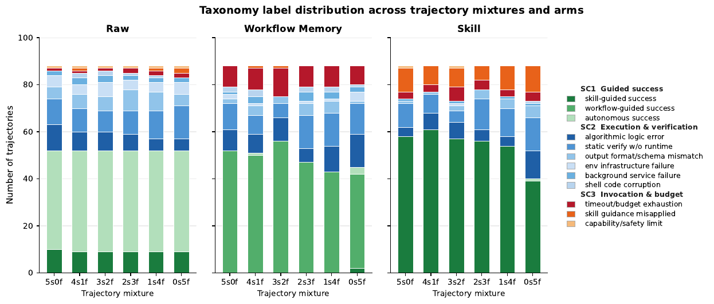
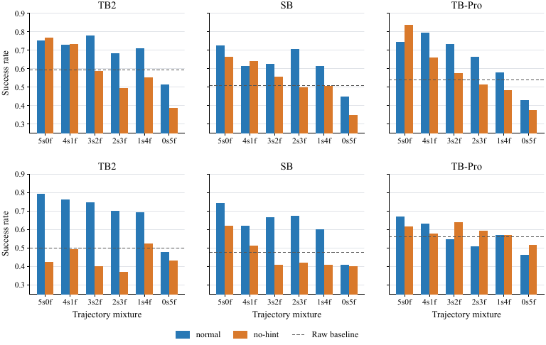
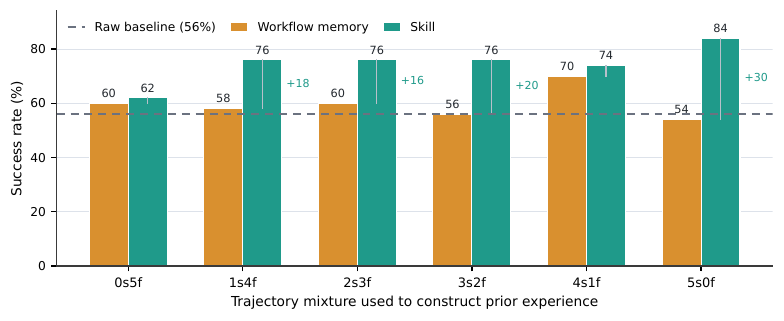
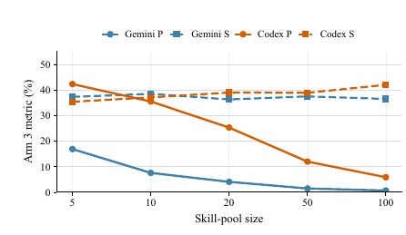
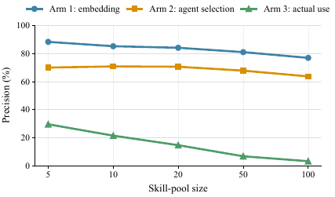

# 🖇️에이전트 스킬 해부 — 왜 작동하고, 언제부터 작동하지 않는가

## 🎯 "스킬이 도움이 되는가"에서 "언제·왜·어디서"로

LLM 에이전트는 매 과제를 백지에서 푸는 대신 경험을 통해 나아지리라 기대된다. 그래서 최근 시스템들은 과거 실행의 흔적 — 환경 셋업 순서, 도구 사용 패턴, 디버깅 루틴, 검증 단계 — 을 저장하고 재사용한다. 도구를 쓰는 에이전트에서 특히 매력적인 방향인데, 반복되는 실패가 고수준 추론의 부재가 아니라 같은 절차적 세부사항을 매번 다시 발견하는 데서 오는 경우가 많기 때문이다.

제안된 메모리 형태 중 **스킬**Anthropic (2025)은 특히 설득력 있는 추상화로 떠올랐다. 스킬은 단순한 과거 실행 기록이 아니라 무엇을 할지, 무엇을 확인할지, 어떤 함정을 피할지를 압축해 기술한 것이다. 원시 궤적이나 직접적인 workflow memory를 저장하는 것과 비교해 스킬은 세 가지를 약속한다. 노이즈 섞인 경험을 더 짧은 context로 압축하고, 절차적 지식을 안정된 포맷으로 표준화하며, 그 지식을 관련 과제로 전이시킬 가능성을 준다.

문제는 기존 연구가 스킬을 **집계된 과제 성공률**로만 본다는 데 있다. 스킬을 붙인 에이전트가 과제를 더 많이 풀면 그 스킬은 유용한 것으로 간주된다. 이런 평가는 스킬이 중요하다는 사실은 세우지만 *왜* 중요한지는 거의 설명하지 못한다. 스킬이 로드되기 전후로 에이전트 행동에서 근본적으로 무엇이 바뀌는지, 실행의 어느 부분이 스킬 지침으로 안정화되는지, 같은 스킬이 왜 한 과제는 돕고 다른 과제는 해치는지를 말해 주지 않는다. 그 결과 스킬 설계는 원리적 이해가 아니라 휴리스틱 반복, 프롬프트 튜닝, 벤치마크별 시행착오로 이뤄지는 경험적 작업에 머문다.

이 공백은 두 갈래의 메모리 연구 위에 놓인다. 한쪽은 *무엇이 일어났는가*를 기억하는 계열이다. 초기 시스템은 이후의 계획과 의사결정을 뒷받침하려고 episodic 경험·reflection·상호작용 이력을 저장하고 검색했고, 이 방향은 구조화된 외부 메모리, 검색 증강 경험 재사용, procedural memory 관리, episodic 관찰을 지식 중심 구조로 압축하는 과제 비의존적 memory graph로 확장됐다. 최근 서베이는 에이전트 메모리를 write–manage–read 루프로 정식화하면서 consolidation, 검색, 모순 처리, 평가를 지속적인 난제로 지목한다. 다른 한쪽은 *어떻게 행동할 것인가*를 재사용하는 계열이다. workflow memory는 과거 궤적을 행동 수준 절차로 요약하고, 스킬 기반 시스템은 실행 가능한 루틴·스크립트·스킬 디렉터리·계층적 스킬 지식베이스처럼 절차 지식을 일급 산출물로 저장해 더 명시적으로 만든다. 최근에는 실행 중의 skill activation과 selection, 그리고 경험을 통한 자동 스킬 발견·수정·진화도 연구된다. 이 논문은 스킬을 더 넓은 procedural memory와 비교하고 그 효과를 표현·검색·호출·전이·추상화 단계에 귀속시켜 이 공백을 다룬다.

벤치마크 쪽도 마찬가지다. 소프트웨어·터미널 벤치마크는 파일·테스트·환경 상태에 걸친 긴 호흡 실행을 요구해 특히 관련이 깊고, 그중 Terminal-Bench Merrill et al. (2026)은 고립된 환경과 테스트 기반 검증을 갖춘 현실적 커맨드라인 과제를 준다. 스킬을 명시적으로 시험하는 벤치마크로는 SkillsBench Li et al. (2026)가 다양한 과제에 걸친 구조화된 스킬을 측정하고, SWE-Skills-Bench Han et al. (2026)는 실제 소프트웨어 엔지니어링 상황에서 스킬 문서의 한계 효용을 다룬다. 다만 이들도 주로 최종 과제 성공률을 보고하므로, 이 논문은 성공·실패 모드를 구체적인 메모리 결정 — 어떤 스킬이 검색되는가, 그것이 어떻게 해석되는가, 그 절차적 추상화가 현재 과제와 맞는가 — 에 연결하는 데까지 분석 관점을 넓힌다.

이 논문은 *스킬이 언제 돕고, 왜 작동하고, 어디서 실패하는가*를 묻는다. 핵심 기여는 스킬 효용과 실패의 taxonomy이며, 스킬 효과를 블랙박스로 두는 대신 관찰 가능하게 만드는 짝지어진 연구 방법론이 함께 온다. 방법의 골자는 스킬 접근이 있는 실행과 없는 실행을 매칭해 비교하고, 두 실행이 스킬 사용 파이프라인의 어디에서 갈라지는지를 분석하는 것이다 — 과거 경험이 어떻게 표현되고, 에이전트 프레임워크를 건너 전이되고, 검색되고, 호출되는지까지 포함해서. 이 대조적 시각이 이득과 실패를 집계 결과가 아니라 구체적 메커니즘에 귀속시킨다.

이 관점에서 연구는 네 질문으로 조직된다. (1) 같은 과거 경험을 표준화된 스킬로 표현하는 것이 직접적 절차 메모리로 주입하는 것과 다른가, (2) 스킬의 이득이 근저의 경험 자체에서 오는가 아니면 명시적인 성공/실패 주석에서 오는가, (3) 증류된 절차 지침이 에이전트 프레임워크를 건너서도 유용한가, (4) 스킬 풀의 크기와 혼동 가능성이 검색과 downstream 실행에 어떤 영향을 주는가.

논문이 요약하는 기여는 네 가지다. 스킬 평가를 집계 성공률에서 스킬이 에이전트 행동을 바꾸는 메커니즘으로 옮기는 체계적 분석을 정식화한 것, 스킬 효과 연구를 위한 대조적 궤적 분석 방법론을 도입해 8,135건의 trial 레코드를 정규화하고 240개 샘플 궤적에 open coding을 수행해 238개의 유효 고유 라벨을 3개 상위 범주와 12개 스킬 사용 모드의 taxonomy로 통합한 것, 같은 과거 경험이 직접 절차 메모리로 표현될 때와 증류된 스킬로 표현될 때 어떻게 다르게 작동하는지를 분리하는 통제 실험을 수행한 것, 그리고 검색과 downstream 실행을 함께 분석해 검색 정확도만으로는 과제 성공이 설명되지 않음을 보인 것이다.

## 🧪 실험 설계 — 무엇을 고정하고 무엇을 바꿨나

### 네 개의 연구 질문

**RQ1: 절차적 표현 형식이 경험 재사용을 어떻게 규정하는가.** 과거 실행은 직접적 workflow memory로도, 증류된 스킬로도 재사용될 수 있다. 두 표현 모두 에이전트를 절차적 경험에 노출시키지만 포장 방식이 다르다 — workflow memory는 trace 수준의 실행 세부를 보존하고, 스킬은 그것을 표준화된 절차 산출물로 압축한다. RQ1은 근저 궤적을 고정한 채 이 표현 형식이 downstream 행동을 어떻게 바꾸는지 묻는다. 특히 workflow memory와 스킬이 둘 다 절차적 앵커로 작동하는지, 그리고 스킬이 trace 의존성·context 부담·프레임워크 결합을 줄여 추가적인 견고성을 주는지를 비교한다.

**RQ2: outcome 신호는 궤적 학습에서 어떤 역할을 하는가.** 과거 궤적이 도움이 되는 이유는 재사용 가능한 절차를 담고 있어서일 수도, outcome 정보가 어떤 행동이 성공하고 실패했는지 알려 줘서일 수도 있다. RQ2는 같은 궤적을 쓰되 명시적 성공/실패 주석을 제거한 no-hint 설정과 표준 설정을 비교해 이 신호의 역할을 분리한다.

**RQ3: 증류된 절차 지침은 에이전트 프레임워크를 건너 전이되는가.** 절차 지식은 그것을 생산한 프레임워크의 프롬프팅 스타일, 도구 인터페이스, 실행 루프에 결합돼 있을 수 있다. RQ3은 한 프레임워크의 궤적에서 만든 workflow memory와 스킬을 다른 프레임워크에서 평가한다.

**RQ4: 스킬 풀 구성이 검색과 downstream 사용에 어떤 영향을 주는가.** 현실에서 스킬은 직접 주어지지 않고 라이브러리에서 선택된다. RQ4는 풀이 커지거나 혼동스러워질 때 검색 품질이 어떻게 변하는지를 고립된 스킬 선택 문제로도, downstream 실행으로도 평가한다. 이로써 "맞는 스킬을 못 찾아서 생긴 실패"와 "스킬이 있는데도 잘못 적용·적응·검증돼서 생긴 실패"를 구분한다.

### 모델·벤치마크 페어링

RQ1–RQ2의 skill-vs-procedural-memory 및 no-hint 연구는 두 에이전트–모델 페어링에서 같은 프로토콜로 인스턴스화된다: Codex + GPT-5.3-Codex, Gemini CLI + Gemini-3.1-Pro-Preview. RQ3은 주 Codex 설정에서 과거 경험 산출물을 만들고 Gemini CLI + Gemini-3.1-Pro-Preview에서 교차 전이를 평가한다. RQ4는 embedding 검색에 Qwen3-Embedding-0.6B (Zhang et al., 2025)를 쓰고, 명시적 선택과 downstream 실행은 Gemini CLI + Gemini-3.1-Pro-Preview와 Codex + GPT-5.4로 평가한다.

여기에 중요한 단서가 붙는다. RQ4를 수행할 때 GPT-5.3-Codex가 같은 평가 접근 권한으로는 더 이상 사용 불가능해서 Codex 페어링에 GPT-5.4를 썼다. 따라서 RQ4는 그 세 독립 실험 사이의 **페어링 내 비교로만** 해석되며, 절대값을 RQ1–RQ3 결과와 직접 비교하면 안 된다.

평가 스위트는 Terminal-Bench Merrill et al. (2026)과 SkillsBench Li et al. (2026)을 결합한다. RQ1–RQ3은 Terminal-Bench Pro, Terminal-Bench 2.0, SkillsBench의 공개 split에서 뽑은 통제된 부분집합을 쓴다. Terminal-Bench Pro는 8개 도메인에 걸친 400개 과제 벤치마크 중 200개 과제 공개 split을 제공하고, Terminal-Bench 2.0은 89개 터미널 에이전트 과제를, SkillsBench는 스킬 기반 절차 재사용을 위해 설계된 11개 도메인 86개 과제를 담는다. RQ4가 SkillsBench를 쓰는 이유는 검색 precision과 recall을 평가하는 데 필요한 네이티브 task–skill 주석을 제공하기 때문이다.

downstream 실행 실험은 Harbor의 표준 평가 워크플로 Harbor Framework Team (2026)를 따르며, 별도 언급이 없으면 과제당 $n=5$의 고유 trial과 병렬도 $20$을 쓴다. 검색 고립 실험은 task–pool 설정당 쿼리 하나를 쓴다. 스킬 기반 조건에서 스킬은 초기 context에 완전히 인라인되는 대신 실행 환경에 재사용 가능한 절차 자원으로 배치된다 (Anthropic, 2025). RQ4에서 검색과 distractor 구성에 쓰는 의미 유사도 점수는 모두 Qwen3 Embedding 계열의 0.6B 파라미터 텍스트 embedding 모델인 Qwen3-Embedding-0.6B (Zhang et al., 2025)로 계산한다.

### 통제된 표현 비교 (RQ1–RQ2)

세 조건을 비교한다. *Raw*는 과거 경험을 받지 않고, *Workflow Memory*는 과거 실행에서 정제된 절차 trace를 받고, *Skill*은 같은 workflow에서 증류된 표준 `SKILL.md`를 받는다.

선정된 각 과제에 대해 성공·실패 원시 궤적을 모아 균형 잡힌 궤적 풀을 만든다. 그다음 고정 예산의 구성 그리드를 세워, 근거 출처를 성공만에서 실패만까지 변화시킨다 — $5s0f$부터 $0s5f$까지. 모든 구성에 대해 Workflow Memory와 Skill은 **같은 선택 궤적**에서 만들어져 같은 대상 과제에서 평가된다. 근저 경험은 고정되고 그 표현만 변하는 것이다. 절차적 내용과 명시적 outcome 신호를 분리하기 위해 *standard*와 *no-hint* 스킬 변형을 추가로 만든다. standard에서는 성공/실패 정체가 skill creator에게 보이고, no-hint에서는 궤적과 실행 프로토콜은 같은 채 그 주석만 제거된다.

원시 궤적 수집은 고정된 실행 프로토콜 아래 Terminal-Bench 2.0, SkillsBench, Terminal-Bench Pro에서 이뤄진다. 각 에이전트–모델 페어링 내에서 벤치마크 인터페이스, 과제 정의, 모델, 에이전트 scaffold, trial 예산은 일정하게 유지된다. 원시 실행이 성공 궤적과 실패 궤적을 **둘 다** 포함하는 과제만 남기고, 각 과제가 통제된 재구성에 충분한 성공·실패 실행을 갖출 때까지 실행을 계속 수집한다.

### 교차 프레임워크 전이 (RQ3)

Codex + GPT-5.3-Codex로 수집한 궤적에서 workflow memory와 스킬을 만든 뒤, 그 고정된 산출물을 Gemini CLI + Gemini-3.1-Pro-Preview에서 평가한다. 대상 과제와 출처 경험은 고정되고 에이전트 프레임워크만 프롬프팅 스타일, 도구 인터페이스, 실행 루프에서 달라진다. 두 산출물이 같은 Codex 궤적에서 왔으므로, 둘의 차이는 직접 보존된 workflow trace와 증류된 스킬이 프레임워크 전환을 각각 얼마나 견디는지를 반영한다. 이 설계는 이식성을 산출물 간 텍스트 유사도가 아니라 **새 프레임워크에서의 downstream 과제 성공**으로 조작화한다.

### 검색과 downstream 실행 (RQ4)

세 실험은 각각 **Arm 1**(embedding 검색), **Arm 2**(명시적 에이전트 선택), **Arm 3**(전체 풀 실제 실행)으로 표기된다.

그림 1(b)는 이 세 절차를 하나의 통제 셋업에서 갈라져 나오는 구조로 보여 준다. 왼쪽 통제 셋업은 과제 설명과 후보 스킬 풀 — GT 스킬 1개 + (k−1)개의 실제 distractor, $k \in \{5, 10, 20, 50, 100\}$ — 로 이뤄지고, distractor 구성은 세 가지로 표집된다 — random은 무관한 스킬에서 무작위로 뽑고, similar는 embedding 공간의 근접 이웃으로 고르고, dissimilar는 멀리 떨어진 스킬에서 고른다. 세 실험이 같은 후보 풀 구성을 공유하므로 동일한 후보 집합이 매칭된 평가 설정 안에서 재사용되고, 벤치마크·과제 집합·ground truth·seed·풀 크기 스케줄은 고정된 채 평가 절차와 distractor 구성만 바뀐다. A(embedding 기반)는 qwen3-embedding으로 cosine similarity를 계산해 후보를 랭킹하고 최고 점수를 뽑으며, 과제 실행 없이 Hit@1과 rank/score gap으로 평가된다. B(에이전트가 고르게 하기)는 `available_skills` 목록으로 이름과 설명만 주고 구조화된 선택만 출력받는다 — Docker도 verifier도 없이 선택만 고립시킨다. C(실제 실행)는 전체 `SKILL.md` 폴더를 환경에 두고 Harbor/Docker에서 "스킬 읽기 → 행동 → 테스트 실행/제출"을 돌린 뒤 verifier가 설정당 5회 실행으로 검증한다. 핵심 표어는 **retrieve ≠ execute**이며, A와 B의 출력은 C로 전달되지 않는다.

각 과제 $t$에 대해 ground-truth 스킬 집합 $G_{t}$는 벤치마크의 네이티브 task–skill 주석이 붙인 canonical 스킬 식별자 집합으로 정의한다. $G_{t}$를 검색 출력이나 에이전트 성공, 실험에서 생성된 스킬 설명으로부터 추론하지 않는다. 후보 풀의 중복은 canonical 식별자 기준으로 제거한다. 쿼리 또는 실행 trial $i$에 대해 $\widehat{G}_{i}$는 에이전트가 선택했거나 실행 시점 파서가 추출한 서로 다른 스킬의 집합이다. 스킬은 canonical 식별자가 두 집합 모두에 나타날 때만 정답으로 세며, $G_{t}$에 없는 유용한 distractor는 여전히 false positive다. 같은 스킬의 반복 언급이나 호출은 한 번으로 센다.

$$P_{i}=\frac{|\widehat{G}_{i}\cap G_{t}|}{|\widehat{G}_{i}|},\qquad R_{i}=\frac{|\widehat{G}_{i}\cap G_{t}|}{|G_{t}|}.$$ (1)

$N$개의 유효 레코드를 가진 조건에서는 다음과 같이 집계한다.

$$P=\frac{1}{N}\sum_{i=1}^{N}P_{i},\qquad R=\frac{1}{N}\sum_{i=1}^{N}R_{i},\qquad F_{1}=\frac{2PR}{P+R}.$$ (2)

선정된 모든 과제가 최소 하나의 gold 스킬 주석을 가지므로 $|G_{t}|>0$이고, 예측 집합이 비면 $P_{i}=R_{i}=0$이며 $P+R=0$일 때 $F_{1}$은 0으로 둔다. 각 풀 크기·distractor 조건에서 $P$와 $R$은 레코드별 값의 산술 평균이다 — Arm 1과 Arm 2는 task–pool 설정당 쿼리 레코드 하나를 기여하고, Arm 3은 과제와 trial당 레코드 하나를 기여한다. 보고되는 $F_{1}$은 레코드별 F1의 평균이 아니라 집계된 $P$와 $R$에서 다시 계산한 값이며, 과제 성공은 이진 verifier 결과의 평균이다. distractor 체제를 가로질러 평균할 때는 반올림하지 않은 조건 수준 값에서 평균을 내고 표시할 때만 소수 첫째 자리로 반올림한다.

Arm 1의 strict 설정은 최근접 스킬 하나만 반환해 top-1 precision을 보고한다. top-$k$ 검색 통계도 공개 산출물에 남겨 두지만, 본문 그림은 "검색기가 최선의 스킬을 직접 식별할 수 있는가"라는 질문에 맞는 단일 스킬 선택 설정을 보고한다. Arm 2는 downstream 과제를 실행하지 않으므로 선택과 이후 실행 실패를 뒤섞지 않는다. Arm 3은 어느 offline 진단으로부터도 사전 선택된 스킬을 받지 않은 채 벤치마크 과제를 돌리고, 실행 후 궤적을 파싱해 실제로 열람·호출된 스킬을 식별한다.

세 실험은 **순차적 단계가 아니다.** 올바른 offline 선택이 실행 실행으로 공급되지 않고, 실행 시점 접근이 offline 진단의 전제로 취급되지도 않는다. 이 구분이 중요한 이유는, 올바른 선택이 성공적 실행을 보장하지 않고 정확한 ground-truth 선택 실패가 항상 치명적이지도 않기 때문이다 — 관련은 있으나 ground-truth가 아닌 스킬도 부분적인 절차 지원을 제공할 수 있다.

## 🧱 대조적 궤적 분석과 12개 모드 taxonomy

집계 성공률은 스킬이 도움이 되는지는 보여 주지만 스킬이 있을 때 무엇이 바뀌는지는 설명하지 못한다. 그래서 통제 실험 위에 대조적 궤적 분석 파이프라인을 세운다. 먼저 이질적인 벤치마크 출력을 8,135건의 trial 레코드 공통 manifest로 정규화한다 — 과제 정체, 실행 arm, verifier 결과, 주입된 산출물, 그리고 있을 경우 궤적 transcript를 담는다. 이 중 7,837건이 에이전트 transcript를 포함한다. manifest는 보조 산출물이 일부 없는 레코드도 의도적으로 남겨 두고, 이후 라벨링 단계가 증거가 충분한 trial — 특히 궤적 transcript가 있는 trial — 로 걸러 낸다. 그다음 240개 샘플 궤적에 open coding을 수행해 238개의 유효 고유 라벨을 남기고, 열린 형태의 실패·성공 기술을 12개 모드의 canonical taxonomy로 병합한다.

성공과 실패는 자유 형식 로그가 아니라 verifier reward에서 유도한다. 양수 verifier reward는 성공, 0·결측·비양수 reward는 실패로 다룬다. 이 설계는 taxonomy를 에이전트의 자기 평가가 아니라 벤치마크 oracle에 정렬시킨다.

*표 5: 대조적 궤적 분석의 실험 arm.*

| **Arm** | **Injected prior experience** | **Purpose** |
|----|----|----|
| Raw | No injected prior trajectory or skill | Baseline behavior of the agent on the task. |
| Workflow memory | Cleaned prior workflows are appended as procedural memory | Tests whether direct trajectory-like procedural memory improves execution. |
| Skill | The same prior workflows are distilled into a standardized reusable skill | Tests whether compact skill representation improves over direct workflow memory. |

*표 6: taxonomy 파이프라인이 쓰는 입력 산출물.*

| **Artifact** | **Role in the analysis** |
|----|----|
| Trial result metadata | Stores task identity, reward, verifier result, exception type, timestamps, token usage, and execution phase durations. |
| Agent trajectory transcript | Stores the terminal/tool-use trajectory and the agent's reasoning-visible interaction record. |
| Task instruction | Defines the task objective and, for workflow-memory arms, may include injected workflow content. |
| Skill artifact | Stores the injected skill used in the skill arm. |
| Task-side files | Used only as contextual artifacts when present; the main taxonomy labels are based on execution trajectories and verifier outcomes. |

*표 7: manifest 구성과 산출물 연결 이후의 커버리지 통계.*

| **Dimension**                                | **Count** |
|----------------------------------------------|-----------|
| Terminal-Bench 2.0 trials                    | 3,254     |
| Terminal-Bench-Pro trials                    | 2,993     |
| SkillsBench trials                           | 1,888     |
| Raw-arm trials                               | 1,883     |
| Workflow-memory trials                       | 2,658     |
| Skill-arm trials                             | 3,594     |
| Successful trials                            | 4,541     |
| Failed trials                                | 3,594     |
| Records with available agent transcript      | 7,837     |
| Records with available task instruction      | 6,210     |
| Skill-arm records with linked skill artifact | 3,570     |

### open coding과 taxonomy 유도의 구체적 설정

샘플러는 벤치마크·설정·arm·결과로 정의된 셀에서 뽑으며, 기본 구성은 240개 trial을 목표로 셀당 최소 예시 수와 고정 random seed를 쓴다. 이 층화가 초기 라벨 풀이 가장 큰 벤치마크나 한 실행 arm에 지배되는 것을 막는다.

각 샘플 궤적은 headless 커맨드라인 인터페이스를 통해 Claude Sonnet 4.6에 전달된다. 도구 사용과 세션 지속성은 비활성화되는데, 라벨링 호출 사이의 오염을 줄이고 프롬프트에 포함된 증거만으로 판단하게 만들기 위해서다. context 예산은 라벨링 전에 고정된다 — 개별 trial open coding에서 과제 지시는 3000자, 스킬 산출물은 3,000자, 궤적 transcript는 앞 6,000자와 뒤 12,000자로 잘린다. 뒤쪽 예산이 더 큰 이유는 최종 오류·verifier 대면 결정·timeout 행동이 대개 궤적 끝에 몰려 있다는 경험적 관찰 때문이다. 각 LLM 호출은 600초 timeout을 갖고 trial id로 캐시돼, 중단되거나 재개된 실행이 완료된 trial을 다시 라벨링하지 않는다.

출력 스키마는 짧은 설명, 열린 형태의 primary mode 후보, 부차 요인, 증거 span, 스킬 효과 판정, 그리고 knowledge missing / knowledge present but misused / capability limit / environmental의 거친 구분을 요구한다. 열린 형태의 `primary_mode_candidate` 필드가 결정적인데, 초기 어휘가 데이터에서 창발하게 하기 때문이다. 스키마에는 판정 규칙도 함께 고정돼 있다. 증거 span은 `codex.txt`·`result.json`·`instruction.md`·`SKILL.md` 중 하나에서 `<=160 chars`의 축자 인용으로 최소 하나를 반드시 제시해야 한다. arm이 raw이거나 workflow인 trial에서 `skill_effect_judgment`는 반드시 `not_applicable`이어야 한다. trial이 성공한 경우 `primary_mode_candidate`는 성공 경로를 기술해야 하고(예: "clean python implementation passed all tests"), `capability_vs_knowledge`를 `knowledge_present_but_misused`로 두는 것은 에이전트가 오용에서 회복한 경우에만 허용된다. 이 단계는 240개 원시 라벨 레코드를 만들었고 그중 238개가 유효 고유 라벨로 남았다.

canonical taxonomy 유도는 2라운드 배치 과정을 쓴다. 먼저 라벨을 약 60개 레코드 배치로 나누고, 각 배치에서 LLM이 소수의 canonical 모드를 제안하며 모든 궤적을 정확히 하나의 모드에 배정한다. 프롬프트는 포괄적 catch-all이 아니라 구체적인 절차 패턴을 요구하며, 환경 실패·API/라이브러리 오용·디버깅 루프·검증 불일치·timeout·스킬 특유 행동·workflow 특유 행동·성공 실행의 커버리지를 명시적으로 권장한다. 다음으로 배치 수준 모드를 통합 taxonomy로 병합한다 — 병합 프롬프트는 배치 모드 이름·정의·개수만 받아 전역 모드 집합과 모든 배치 모드→전역 모드 매핑을 산출하고, 로컬 집계 코드가 개별 배정을 결정론적으로 재매핑하며 모든 궤적 id가 정확히 한 번 배정됐는지 검증한다.

배치 프롬프트는 배치당 8–14개 모드를, 병합 프롬프트는 9–14개 전역 모드를 요구한다. 이 범위는 설계상의 선택으로, taxonomy가 "wrong answer" 같은 지나치게 넓은 범주로 붕괴하는 것도, 통계 집계를 지탱하지 못하는 일회성 라벨의 긴 꼬리도 피하기 위한 것이다. 최종 병합은 12개 canonical 모드를 만들었다. 이 모드들은 의도적으로 성공/실패가 섞여 있는데, 왜 실행이 실패하는지 분류하는 것만이 아니라 성공이 스킬 지침·workflow 지침·자율적 에이전트 행동 중 무엇에 귀속되는지 구분하는 것도 목표이기 때문이다.

### 인간 검증

taxonomy 구성의 두 LLM 보조 단계 모두를 독립적인 인간 검사로 검증했다. 238개 유효 원시 라벨 각각에 대해 인간 annotator가 뒷받침 궤적 셋을 검사해 총 714건의 궤적–라벨 검사를 수행했고, 원시 라벨이 기록된 에이전트 행동에 근거함을 확인했다. 그다음 annotator는 taxonomy 정의만 써서 238개 원시 라벨 전부를 12개 canonical 모드로 독립적으로 매핑했다. 인간과 LLM의 집계 배정은 95.8% 정확 일치, Cohen's $\kappa=0.952$를 달성했다.

*표 3: taxonomy 구성 파이프라인의 인간 검증.*

| **Validation stage** | **Evaluation units** | **Result** |
|----|----|----|
| Trajectory grounding | 714 checks (238 labels $\times$ 3 trajectories) | All labels confirmed |
| Taxonomy aggregation | 238 valid unique labels | 95.8% exact; Cohen's $\kappa=0.952$ |

### 짝지어진 삼중항

분석의 주 단위는 **짝지어진 삼중항**이다. 각 삼중항은 같은 과제·설정을 raw 실행, workflow-memory 주입, 스킬 주입 세 arm으로 비교한다. Raw trial은 성공/실패 혼합 설정을 갖지 않으므로 벤치마크와 과제로 매칭하고, workflow와 skill trial은 벤치마크·과제·설정으로 매칭한다. 이런 삼중항 528개를 구성했으며 SkillsBench 144개, Terminal-Bench 2.0 186개, Terminal-Bench-Pro 198개를 포괄한다. 이는 1,584건의 arm 수준 모드 배정을 준다.

*표 8: 대조적 taxonomy 라벨링에 쓰인 짝지어진 삼중항 샘플.*

| **Split**                   | **Count** |
|-----------------------------|-----------|
| SkillsBench triples         | 144       |
| Terminal-Bench 2.0 triples  | 186       |
| Terminal-Bench-Pro triples  | 198       |
| Triples per mixture setting | 88        |
| Total triples               | 528       |

각 삼중항에서 LLM judge는 arm마다 taxonomy 모드를 배정하고, **arm 사이의 짝지어진 변화**를 기록하며, 주입된 산출물이 절차적 앵커링·지식 주입·실패 경고·의미 있는 사용 없음·역효과 지침 중 무엇으로 작동하는지 식별한다. 구체적으로 judge는 세 층위의 정보를 낸다. 첫째, 각 arm에 v1 모드를 배정하고 증거 인용을 제공한다. 둘째, workflow와 raw, skill과 raw, skill과 workflow를 비교하며 각 비교마다 자연어 요약, 범주형 net effect, 처치가 고친 모드, 처치가 도입한 모드를 기록한다. 셋째, 스킬 또는 workflow가 실행에 영향을 준 메커니즘을 라벨링한다. 메커니즘 판정에도 규칙이 붙는다 — 스킬 내용이 에이전트에게 전혀 쓰이지 않았으면 `none`, 스킬이 실행을 raw보다 나쁘게 만들었으면 `counterproductive`다. 모드 이름은 공유 taxonomy의 것을 그대로 쓰고 어디에도 맞지 않으면 `other`를 쓰며, 결측 arm은 null로 두고 그 arm이 낀 비교의 net effect를 `not_comparable`로 둔다. 출력에는 high/medium/low의 `confidence`가 함께 붙는다.

짝지어진 비교 프롬프트는 한 호출에 궤적 세 개를 넣어야 하므로 개별 open coding보다 짧은 transcript 예산을 쓴다 — 과제 지시와 주입 스킬은 각각 3,000자, 각 궤적은 앞 4,000자와 뒤 8,000자다. 대표 trial 선택은 기본적으로 결정론적이어서, 같은 과제·설정·arm에 여러 trial이 있으면 안정적인 trial-id 순서에서 첫 trial을 고른다. 민감도 검사를 위한 seed 기반 무작위 정책도 지원되지만 본 실행은 라벨 집합의 재현성을 위해 결정론적 정책을 쓴다.

*표 2: 주입된 과거 경험이 실행에 어떻게 영향을 주는지 특징짓는 메커니즘 라벨.*

| **Mechanism** | **Meaning** |
|----|----|
| `procedural_anchor` | The artifact gives a usable procedure, ordering, checklist, tool sequence, or verification plan. |
| `knowledge_ injection` | The artifact supplies concrete domain knowledge that the agent otherwise lacked. |
| `failure_warning` | The artifact warns about a pitfall that the agent avoids. |
| `none` | The artifact is not used in a meaningful way. |
| `counterproductive` | The artifact misleads the agent or makes the run worse. |

이 짝지어진 설계가 핵심적인 방법론적 선택이다. 어떤 실패 모드가 고립적으로 빈번한지를 묻는 대신, 과거 경험의 표현이 바뀔 때 무엇이 바뀌었는지를 묻는다. 이는 "*skill fixed environment setup failures that raw execution encountered*"나 "*skill introduced a misapplication failure that was absent in raw execution*" 같은 주장을 뒷받침한다.

### 세 개의 상위 범주

거친 층위에서 각 궤적은 최상위 taxonomy 라벨인 *Skill-use Category*(SC)를 배정받는다. SC1은 성공적인 **절차적 앵커링**으로, 에이전트가 자율적으로 성공하거나 과거 경험이 유용한 지침을 제공한 경우다. SC2는 **실행 계층 및 검증 실패**로, 환경 셋업·출력 포맷·서비스 관리·shell 실행·알고리즘 구현·런타임 검증을 포함한다. SC3은 **호출·적용 가능성·경계 실패**로, 지침이 존재하지만 오용되거나 과잉 적용되거나 무시되거나 외부 한계에 묶인 경우다.

그룹 수준에서 skill arm은 workflow memory보다 더 많은 궤적을 SC1로 옮기고(skill arm SC1 배정 326/528 대 workflow memory 294/528), raw 및 workflow memory 대비 SC2 실행 계층 실패를 줄이지만(124/528 대 각각 197/528, 176/528), SC3 호출·경계 실패는 늘린다(78/528 대 raw 19/528).

그림 2는 Raw, Workflow Memory, Skill 세 패널에 대해 $5s0f$부터 $0s5f$까지 여섯 궤적 혼합에서 궤적 수준 라벨의 누적 막대를 보여 준다. 각 막대의 총합은 약 88 궤적이고 세그먼트 값은 인쇄돼 있지 않아, 이하는 축에 대고 읽은 근삿값이다. Raw 패널은 autonomous success(모든 혼합에서 대략 42~43)가 지배하고 workflow-guided success는 보이지 않으며 SC3 띠는 매우 얇다(capability/safety limit 약 2). Workflow Memory 패널은 workflow-guided success(대략 40~56)가 지배하고 맨 위에 timeout/budget exhaustion의 큰 띠(대략 8~9)가 얹힌다. Skill 패널은 skill-guided success(대략 39~61, $0s5f$에서 가장 낮음)가 지배하고 맨 위에 skill guidance misapplied의 상당한 띠(대략 6~9)가 붙는다. 모드별 백분율은 아래 표 11에 있다.

*표 11: 528개 짝지어진 삼중항에 대한 대조적 스킬 사용 taxonomy. 백분율은 각 arm 내에서 같은 삼중항 샘플에 대해 계산됨.*

| **SC** | **Mode**                               | **Raw** | **WF** | **Skill** |
|--------|----------------------------------------|---------|--------|-----------|
| SC1    | `skill_guided_success`                 | 10.4%   | 0.4%   | 61.6%     |
| SC1    | `workflow_guided_success`              | 0.0%    | 54.5%  | 0.0%      |
| SC1    | `autonomous_clean_success`             | 48.7%   | 0.8%   | 0.2%      |
|        |                                        |         |        |           |
| SC2    | `environment_infrastructure_failure`   | 5.3%    | 1.7%   | 0.2%      |
| SC2    | `output_format_schema_mismatch`        | 7.4%    | 3.8%   | 3.2%      |
| SC2    | `background_service_lifecycle_failure` | 2.7%    | 2.5%   | 0.8%      |
| SC2    | `shell_code_corruption`                | 1.1%    | 1.9%   | 0.2%      |
| SC2    | `algorithmic_logic_error`              | 8.3%    | 11.0%  | 7.4%      |
| SC2    | `static_verification_without_runtime`  | 12.5%   | 12.5%  | 11.7%     |
|        |                                        |         |        |           |
| SC3    | `timeout_budget_exhaustion`            | 1.7%    | 10.6%  | 4.4%      |
| SC3    | `skill_guidance_misapplied_or_ignored` | 0.8%    | 0.4%   | 10.0%     |
| SC3    | `capability_or_safety_limit`           | 1.1%    | 0.0%   | 0.4%      |

## 📌 스킬은 단순한 외부 지식이 아니라 주로 절차적 앵커로 작동한다

스킬을 붙인 실행이 가장 높은 oracle-status 성공률인 61.9%를 달성하며, raw 실행은 59.1%, workflow memory는 55.9%다. 따라서 가장 강한 집계 효과는 스킬 대 raw 실행이 아니라 **스킬 대 직접 workflow memory**다 — 스킬은 workflow memory보다 +6.06 퍼센트포인트 개선되며 95% bootstrap 신뢰구간은 \[+0.76, +11.36\]이다. 이 비교가 중요한 이유는 workflow memory와 스킬이 같은 출처 궤적에서 만들어졌기 때문이다. 그러므로 개선은 에이전트에게 과거 경험을 더 많이 준 것으로 돌릴 수 없고, 그 경험이 **어떻게 표현되는가**로 돌아간다.

*표 9: 세 실행 arm의 oracle-status 성공률.*

| **Arm**         | **Success / total** | **Success rate** |
|-----------------|---------------------|------------------|
| Raw             | 312 / 528           | 59.1%            |
| Workflow memory | 295 / 528           | 55.9%            |
| Skill           | 327 / 528           | 61.9%            |

짝지어진 성공률 델타는 삼중항마다 계산되고 1,000회 반복 bootstrap 신뢰구간으로 요약된다.

*표 10: 실행 arm 사이의 짝지어진 성공률 델타.*

| **Comparison** | **Mean paired delta** | **95% bootstrap CI** |
|----------------|-----------------------|----------------------|
| WM vs Raw      | $-0.0322$             | $[-0.0814,+0.0208]$  |
| Skill vs Raw   | $+0.0284$             | $[-0.0227,+0.0795]$  |
| Skill vs WM    | $+0.0606$             | $[+0.0076,+0.1136]$  |

taxonomy가 이 해석을 뒷받침한다. taxonomy 모드 그룹 기준으로 skill arm은 61.7%의 경우에 성공 절차 클래스에 속하며, raw 실행은 59.1%, workflow memory는 55.7%다. 이는 oracle-status 성공률과 거의 정렬되면서도, 지배적 행동이 여전히 실패 복구 패턴인 드문 성공 궤적을 judge가 표시할 수 있게 한다.

더 중요한 것은 메커니즘 라벨이다. `procedural_anchor`가 스킬 메커니즘의 65.7%를 차지하는 반면 명시적 `knowledge_injection`은 4.5%에 그친다. 즉 스킬은 대개 빠진 사실을 공급해서 작동하지 않는다. 행동을 안정화해서 작동한다 — 어떤 셋업 단계를 돌릴지, 어떤 도구 순서를 따를지, 어떤 중간 점검을 할지, 어떤 반복되는 함정을 피할지.

성공 모드가 이 구분을 구체화한다. skill arm에서 `skill_guided_success`는 61.6%를 차지하고, workflow arm에서 `workflow_guided_success`는 54.5%를 차지한다. 즉 workflow memory도 유용할 수 있다 — 원시 trace는 재사용 가능한 명령, 파라미터 선택, 디버깅 증거를 자주 담는다. 다만 workflow memory는 원래 궤적에 더 가까이 머물러 부수적 과정, 실패한 시도, 과제 특유의 세부를 더 많이 보존한다. 스킬은 그 trace를 더 깨끗한 운영 절차로 압축할 때 더 효과적이다.

### 어떤 압축된 절차 텍스트라도 되는 건 아니다

이 효과가 단순히 "압축된 절차 힌트라면 무엇이든" 때문에 생기는 게 아닌지 확인하기 위해, Gemini CLI + Gemini-3.1-Pro-Preview 비교에 쓴 같은 26개 Terminal-Bench-2 과제에 두 경량 베이스라인을 추가했다. 각 조건은 과제당 5 trial로 평가돼 총 130 trial이다. *short-plan* 베이스라인은 지시에서 유도한 3~5개 고수준 단계의 간결한 계획을 주고, *test-first* 베이스라인은 성공 조건·중간 점검·최종 검증을 강조하는 workflow 유래 검증 템플릿을 준다. 둘 다 재사용 가능한 `SKILL.md` 산출물이 아니라 평범한 절차 텍스트로 주입된다.

*표 12: 선정된 Terminal-Bench-2 과제에서의 경량 압축 절차 베이스라인. 26개 과제, 과제당 5 trial.*

| **Condition**       | **Source**       | **Success / total** | **Success rate** |
|---------------------|------------------|---------------------|------------------|
| Raw                 | None             | 65 / 130            | 50.0%            |
| Short plan          | Task instruction | 62 / 130            | 47.7%            |
| Test-first template | Workflow         | 77 / 130            | 59.2%            |
| Workflow Memory     | Workflow         | 81 / 130            | 62.3%            |
| Skill               | Workflow         | **103 / 130**       | **79.2**%        |

두 베이스라인은 각각 47.7%와 59.2%에 도달해 Workflow Memory(62.3%)보다 낮고 Skill 주입(79.2%)보다는 상당히 낮다.

## 🛠 실행 견고성은 오르지만, 재정식화와 검증이 필요한 과제에서는 부족하다

스킬의 가장 분명한 실용적 이점은 실행 계층 및 검증 실패에서 나타난다. SC2 모드는 raw arm 라벨의 37.3%, workflow arm 라벨의 33.3%를 차지하지만 skill arm 라벨에서는 23.5%에 그친다. 이 감소는 스킬이 운영적 취약성에 특히 유용하다는 주장을 뒷받침한다 — 반복되는 셋업 실수를 피하고, 출력 제약을 지키고, 서비스를 더 안정적으로 관리하고, 더 견고한 명령 패턴을 쓰게 한다.

가장 강한 사례는 `environment_ infrastructure_failure`로, raw 실행 5.3%에서 workflow memory 1.7%, 스킬 0.2%로 떨어진다. 이 패턴은 환경과 도구 문제가 대단히 "스킬화 가능"함을 시사한다. 신뢰할 만한 셋업 순서, 의존성 우회, 경로 관례가 한 번 발견되면 재사용 가능한 절차 지침으로 인코딩될 수 있다. 비슷한 감소가 `output_format_schema_mismatch`(raw 7.4% → 스킬 3.2%)와 `background_ service_lifecycle_failure`(2.7% → 0.8%)에서도 나타난다. 이런 실패는 대개 고수준 추론의 부재가 아니라, 실행 중에 구체적 실행 제약을 계속 활성 상태로 유지하지 못해서 생긴다.

그러나 taxonomy는 절차 지침의 경계도 보여 준다. `algorithmic_ logic_error`는 arm을 가로질러 여전히 상당하다 — raw 8.3%, workflow memory 11.0%, 스킬 7.4%. `static_verification_without_runtime`도 비슷하게 지속된다 — raw 12.5%, workflow memory 12.5%, 스킬 11.7%. 이 모드들은 스킬이 잘못된 알고리즘을 자동으로 고쳐 주지도, oracle에 정렬된 검증을 강제하지도 않음을 보여 준다. 스킬은 실행 견고성을 개선하지만, 더 깊은 문제 재정식화나 더 강한 런타임 검증을 요구하는 실패는 제거하지 못한다.

## ⚠️ 스킬은 호출·적용 가능성이라는 새 실패면을 만든다

스킬을 유용하게 만드는 바로 그 추상화가 새로운 실패면도 만든다. 스킬은 스스로 실행되지 않는다 — 에이전트가 그것이 적용되는지, 어느 부분을 따를지, 어떻게 적응시킬지, 언제 버릴지를 결정해야 한다. 여기서 많은 스킬 특유의 실패가 생긴다. `skill_guidance_misapplied_or_ignored` 모드는 skill arm 사례의 10.0%에서 나타나며, raw 실행은 0.8%, workflow memory는 0.4%에 불과하다. 이 실패들은 스킬이 없거나 무관한 경우가 아니다. 스킬이 그럴듯한 지침을 담고 있는데도 에이전트가 기계적으로 적용하거나, 조건을 놓치거나, 더는 성립하지 않는 가정을 그대로 끌고 오는 경우가 많다.

workflow memory는 다르게 실패한다. 주된 대가는 압축된 추상화의 오적용이 아니라 **과정 과부하**다. `timeout_budget_exhaustion`은 workflow-memory 사례의 10.6%에서 나타나고 raw 실행은 1.7%, 스킬은 4.4%다. 이는 직접 trace가 결정적 절차에서 주의를 빼앗는 긴 탐색, 실패한 시도, 저수준 디버깅 경로 같은 절차적 잔여물로 에이전트에게 부담을 줄 수 있음을 시사한다. 스킬은 증류로 이 오버헤드를 줄이지만 적용 가능성 판단의 필요를 없애지는 못한다. 따라서 실패한 스킬 실행은 나쁜 스킬 내용이 아니라, 스킬이 언제 어떻게 현재 실행을 지배해야 하는지 결정하는 데 실패한 것을 반영할 수 있다.

이 패턴들은 스킬 효용의 해석을 정교하게 만든다. 실패한 스킬 실행이 항상 나쁜 스킬 내용 탓은 아니고, 성공한 스킬 실행이 항상 스킬 덕분도 아니다. 스킬 효용은 파이프라인에 달려 있다 — 과거 경험이 적절한 추상화 수준으로 증류되고, 양립 가능한 맥락으로 전이·검색되고, 에이전트가 호출하고, 실행 중에 적응돼야 한다.

## 🏷 outcome 주석은 스킬 구성 단계를 이끈다

그림 5는 같은 궤적 풀에서 성공/실패 라벨을 보이거나(normal) 감춘 채(no-hint) 만든 스킬을 Codex와 Gemini CLI에 대해 비교한다. 3열은 왼쪽부터 TB2, SB, TB-Pro이고 파선은 해당 Raw 베이스라인이다. 막대 값은 인쇄돼 있지 않지만, 완전한 수치는 아래 표 16에 있다.

완료된 Codex와 Gemini 행에서, 출처 풀이 성공 궤적만 담을 때는 outcome 라벨을 감추는 것이 거의 영향을 주지 않지만, 실패 궤적이 들어오는 순간 그 영향이 가파르게 커진다. 실패 궤적이 풀에 들어올수록 normal 스킬 생성이 대체로 더 강하다 — Gemini의 Terminal-Bench-2 `3s2f`에서 normal은 0.7462인 반면 outcome 힌트가 없으면 0.4000이고, 완료된 Gemini의 Terminal-Bench-2와 SkillsBench 비율 전체에서 같은 패턴이 유지된다.

*표 16: outcome 주석 ablation의 완전한 수치 결과. Terminal-Bench-Pro 항목은 조건당 130 trial을 쓰고, 결측 또는 인프라 오류 trial은 실패로 셈.*

| **Agent + Model** | **Benchmark** | **Creator** | **5s0f** | **4s1f** | **3s2f** | **2s3f** | **1s4f** | **0s5f** |
|----|----|----|----|----|----|----|----|----|
| Codex GPT-5.3-Codex | TB2 | normal | 0.7548 | 0.7290 | 0.7806 | 0.6839 | 0.7097 | 0.5161 |
| Codex GPT-5.3-Codex | TB2 | no-hint | 0.7677 | 0.7355 | 0.5871 | 0.4968 | 0.5548 | 0.3871 |
|  |  |  |  |  |  |  |  |  |
| Codex GPT-5.3-Codex | SB | normal | 0.7250 | 0.6167 | 0.6250 | 0.7083 | 0.6167 | 0.4500 |
| Codex GPT-5.3-Codex | SB | no-hint | 0.6667 | 0.6417 | 0.5583 | 0.5000 | 0.5083 | 0.3500 |
|  |  |  |  |  |  |  |  |  |
| Codex GPT-5.3-Codex | TB-Pro | normal | 0.7455 | 0.7939 | 0.7333 | 0.6667 | 0.5818 | 0.4303 |
| Codex GPT-5.3-Codex | TB-Pro | no-hint | 0.8364 | 0.6606 | 0.5758 | 0.5152 | 0.4848 | 0.3758 |
|  |  |  |  |  |  |  |  |  |
| Gemini CLI Gemini-3.1-Pro-Preview | TB2 | normal | 0.7923 | 0.7615 | 0.7462 | 0.7000 | 0.6923 | 0.4769 |
| Gemini CLI Gemini-3.1-Pro-Preview | TB2 | no-hint | 0.4231 | 0.4923 | 0.4000 | 0.3692 | 0.5231 | 0.4308 |
|  |  |  |  |  |  |  |  |  |
| Gemini CLI Gemini-3.1-Pro-Preview | SB | normal | 0.7429 | 0.6190 | 0.6667 | 0.6762 | 0.6000 | 0.4095 |
| Gemini CLI Gemini-3.1-Pro-Preview | SB | no-hint | 0.6190 | 0.5143 | 0.4095 | 0.4190 | 0.4095 | 0.4000 |
|  |  |  |  |  |  |  |  |  |
| Gemini CLI Gemini-3.1-Pro-Preview | TB-Pro | normal | 0.6692 | 0.6308 | 0.5462 | 0.5077 | 0.5692 | 0.4615 |
| Gemini CLI Gemini-3.1-Pro-Preview | TB-Pro | no-hint | 0.6154 | 0.5769 | 0.6385 | 0.5923 | 0.5692 | 0.5154 |

두 skill-creator 프롬프트의 차이는 실제로 두 줄이다. 표준 프롬프트(`skill-creator.md`)는 궤적에서 "Failure modes that appeared (if any failed traces are included)"를 식별하라 하고 규칙에 "If failed traces are included, extract their failure patterns into the 'Common Failure Modes' section"을 둔다. no-hint 프롬프트는 그 자리에 "Failure signals and mitigations inferred from observable evidence in traces"를 두고, 규칙에 "Infer likely failure patterns only from observable evidence in the traces (e.g., command outputs, error text, exit status, retries)"와 "Do not assume whether any trace is successful or failed unless the evidence supports it"를 넣는다. 나머지 스킬 포맷(`Use This Skill When` / `Preconditions` / `Steps` / `Common Failure Modes To Avoid` / `If A Failure Happens` / `Verify`)과 나머지 규칙은 동일하다. 두 프롬프트가 공유하는 규칙은 다섯이다 — 스킬을 여럿이 아니라 정확히 하나만 만들 것, trace에 있던 그 과제만이 아니라 유사한 과제에도 적용될 만큼 일반적일 것, 단계는 모호하지 않고 구체적이고 실행 가능할 것, 여러 trace가 서로 다른 접근을 보이면 가장 신뢰할 만한 하나를 고를 것, 과제 고유의 파일 경로나 데이터를 넣지 말고 placeholder를 쓸 것. 스킬 포맷의 `If A Failure Happens` 절도 고정된 복구 절차를 담는다 — 멈추고 최신 출력을 검사하고, 오류를 위의 실패 모드에 대응시켜 수정을 적용하고, 끝내기 전에 검증을 다시 돌린다.

## 📊 표현별 성공률 전체 표 (RQ1)

*표 1: 궤적 혼합에 걸친 Workflow Memory와 Skill 주입의 과제 성공률. 회색 행은 Raw 베이스라인. 녹색·적색·무음영 셀은 해당 Raw 베이스라인 대비 위·아래·같음을 뜻하고, bold는 혼합 설정을 가로지르는 행 최댓값. 혼합 라벨은 성공(s)·실패(f) 출처 궤적 수. Terminal-Bench-Pro 비율은 조건당 130 trial을 쓰며 인프라 또는 verifier 오류는 실패로 셈.*

| **Agent + Model** | **Trajectory Mix** | **Terminal-Bench-2** |  | **SkillsBench** |  | **Terminal-Bench-Pro** |  |
|----|----|----|----|----|----|----|----|
| **Agent + Model** | **Trajectory Mix** | **Workflow** | **Skill** | **Workflow** | **Skill** | **Workflow** | **Skill** |
|  |  |  |  |  |  |  |  |
| *Codex + GPT-5.3-Codex Raw* |  | 0.5935 |  | 0.5083 |  | 0.5394 |  |
| Codex GPT-5.3-Codex | 5s0f | **0.4452** | 0.7548 | 0.5250 | **0.7250** | **0.7333** | 0.7455 |
| Codex GPT-5.3-Codex | 4s1f | 0.4000 | 0.7290 | 0.5667 | 0.6167 | **0.7333** | **0.7939** |
| Codex GPT-5.3-Codex | 3s2f | 0.4194 | **0.7806** | **0.6417** | 0.6250 | 0.6970 | 0.7333 |
| Codex GPT-5.3-Codex | 2s3f | 0.3677 | 0.6839 | 0.6083 | 0.7083 | 0.6667 | 0.6667 |
| Codex GPT-5.3-Codex | 1s4f | 0.2710 | 0.7097 | 0.5167 | 0.6167 | 0.6121 | 0.5818 |
| Codex GPT-5.3-Codex | 0s5f | 0.2839 | 0.5161 | 0.5833 | 0.4500 | 0.4788 | 0.4303 |
|  |  |  |  |  |  |  |  |
| *Gemini CLI + Gemini-3.1-Pro-Preview Raw* |  | 0.5000 |  | 0.4762 |  | 0.5615 |  |
| Gemini CLI Gemini-3.1-Pro-Preview | 5s0f | 0.6231 | **0.7923** | 0.5524 | **0.7429** | 0.5308 | **0.6692** |
| Gemini CLI Gemini-3.1-Pro-Preview | 4s1f | 0.5308 | 0.7615 | 0.5238 | 0.6190 | **0.6923** | 0.6308 |
| Gemini CLI Gemini-3.1-Pro-Preview | 3s2f | **0.6462** | 0.7462 | **0.5619** | 0.6667 | 0.6462 | 0.5462 |
| Gemini CLI Gemini-3.1-Pro-Preview | 2s3f | 0.6000 | 0.7000 | 0.5524 | 0.6762 | 0.6846 | 0.5077 |
| Gemini CLI Gemini-3.1-Pro-Preview | 1s4f | 0.5846 | 0.6923 | 0.4857 | 0.6000 | 0.5923 | 0.5692 |
| Gemini CLI Gemini-3.1-Pro-Preview | 0s5f | 0.5231 | 0.4769 | 0.4286 | 0.4095 | 0.4769 | 0.4615 |

## 🔀 프레임워크를 건너간 전이 (RQ3)

그림 4는 한 에이전트 프레임워크에서 만든 과거 경험 산출물을 다른 프레임워크에서 평가한 결과다. 세로축은 성공률(%), 가로축은 과거 경험 구성에 쓰인 궤적 혼합이고, 파선은 대상 프레임워크의 Raw 베이스라인 56%다. 막대 값은 그림에 인쇄돼 있다 — $0s5f$에서 Workflow memory 60, Skill 62. $1s4f$에서 58과 76(+18). $2s3f$에서 60과 76(+16). $3s2f$에서 56과 76(+20). $4s1f$에서 70과 74. $5s0f$에서 54와 84(+30). Skill 막대에는 가는 error bar가 그려져 있으나 그 의미는 그림에 명시돼 있지 않다.

즉 여섯 혼합 전부에서 전이된 Skill이 전이된 Workflow Memory를 앞선다. 출처 궤적이 실패만으로 이뤄진 $0s5f$에서 격차가 62 대 60으로 가장 작지만 그때도 Skill은 Raw 베이스라인 56보다 6 높고, 성공 궤적만으로 만든 $5s0f$에서 격차가 +30으로 가장 크다. Workflow memory 쪽은 $3s2f$에서 Raw 베이스라인과 정확히 같은 56이고 $5s0f$에서는 54로 베이스라인 아래다.

## 🔍 검색 — 스킬이 있는 것과 쓰이는 것 사이의 간극

검색 평가는 SkillsBench의 ground-truth task–skill 주석을 써서 수행한다. 각 과제는 ground-truth 스킬과 distractor를 담은 통제된 후보 풀과 짝지어진다.

그림 3(b)는 독립적인 downstream 실행 실험을 보고한다. 실선은 파싱된 실제 사용 precision, 파선은 downstream 성공이다. Gemini의 파싱된 스킬 사용 precision은 낮고 16.9%에서 0.7%로 감소하는 반면, 과제 성공은 36–39% 부근에서 비교적 평평하게 유지된다. Codex는 풀 크기 5에서 42.3%로 더 높은 실제 사용 precision에서 출발하지만 풀 크기 100에서 5.9%로 떨어지고, 과제 성공은 오히려 35.4%에서 42.0%로 증가한다. 보고된 두 페어링을 평균하면 downstream 성공은 36.4%에서 39.3%로만 변하는데 실제 사용 precision은 29.6%에서 3.3%로 떨어진다.

더구나 Arm 3 recall은 $k=100$에서 54.3–73.6%를 유지하는데 precision은 0.7–8.1%에 불과하다. 이 조합은 실행 시점 실패가 단순히 스킬을 아예 들여다보지 않아서 생기는 게 아님을 가리킨다 — 에이전트는 여러 후보를 열람하거나 호출하지만, 사용을 그 과제의 주석된 ground-truth 스킬로 신뢰성 있게 국한하지는 못한다. 따라서 **정확한 ground-truth 스킬 호출은 성공에 충분하지도 엄밀히 필요하지도 않다.**

그림 3(a)는 두 offline 진단의 precision을 보여 준다. 평균 top-1 embedding precision은 풀 크기 5에서 88.3%, 풀 크기 100에서 76.9%로 감소하고, 명시적 에이전트 선택은 70.0%에서 63.7%로 감소한다. 같은 그림에 Arm 3(실제 사용) 곡선도 함께 놓이는데, 축에서 읽으면 대략 30%에서 4%로 가장 낮게 떨어진다. 이 값들은 연속된 검색 단계가 아니라 독립적 측정이며 선택된 스킬은 실행 실험으로 전달되지 않는다. offline 결과는 실행 전에 관련 산출물을 식별하는 일의 난이도를 짚고, 위의 실행 결과는 과제를 푸는 동안 전체 풀이 주어졌을 때 무슨 일이 일어나는지를 별도로 보여 준다.

구성 분석은 offline 식별이 어디서 어려워지는지 짚는다. Arm 1에서 similar 풀의 top-1 precision은 $k=5$의 70.5%에서 $k=100$의 53.4%로 떨어지는데, random 풀은 97.7%에서 84.1%로, dissimilar 풀은 96.6%에서 93.2%로 떨어진다. 명시적 선택에서도 같은 비대칭이 나타난다 — $k=5$에서 similar 풀 precision은 Gemini 54.3%, Codex 51.9%이고, $k=100$에서는 각각 55.4%와 31.9%다. 즉 풀 크기도 난이도에 기여하지만, 올바른 절차 산출물을 식별하는 데는 **의미적 혼동 가능성이 더 중요한 스트레스 요인**이다. $k=100$에서 선택 recall이 상대적으로 높은 것(보고된 조건 전체에서 70.5–85.2%)은 에이전트가 ground-truth 스킬을 아예 고려하지 못하는 게 아니라 distractor와 함께 포함하는 경우가 많음을 시사한다. 올바른 스킬은 결국 식별되고, 눈에 띄고, 적응되고, 운영화돼야 하며, 관련은 있으나 ground-truth가 아닌 스킬도 부분적인 절차적 지원을 제공할 수 있다.

표 4는 그림 뒤에 있는 완전한 크기 추세를 보고한다. similar distractor가 offline 식별 진단의 지배적 스트레스 요인인 반면, Arm 3 precision은 풀이 커지면 **세 체제 모두에서** 붕괴한다는 점을 명시한다. downstream 성공은 이 붕괴에 비교적 둔감한데, 이는 정확한 스킬 사용 일치와 과제 완수가 한 파이프라인의 연속 단계가 아니라 스킬 사용의 서로 다른 측면에 대한 독립적 측정임을 다시 확인해 준다.

*표 4: 풀 구성과 크기가 SkillsBench에 미치는 영향. 항목은 표시된 검색 arm·풀 구성·풀 크기의 백분율. Arm 2와 3은 보고된 에이전트–모델 페어링에 대한 산술 평균.*

| **Pool / metric** |  | **Skill-pool size $k$** |  |  |  |  |
|----|----|----|----|----|----|----|
|  |  | **5** | **10** | **20** | **50** | **100** |
| *Random* | **Arm 1 P** | 97.7 | 95.5 | 95.5 | 92.0 | 84.1 |
| *Random* | **Arm 2 P** | 78.1 | 77.9 | 82.1 | 76.5 | 69.8 |
| *Random* | **Arm 3 P** | 25.9 | 23.2 | 19.5 | 8.6 | 4.4 |
| *Random* | **Arm 3 Succ.** | 31.8 | 36.8 | 40.1 | 36.3 | 41.9 |
|  |  |  |  |  |  |  |
| *Similar* | **Arm 1 P** | 70.5 | 63.6 | 60.2 | 56.8 | 53.4 |
| *Similar* | **Arm 2 P** | 53.1 | 52.9 | 47.1 | 48.6 | 43.7 |
| *Similar* | **Arm 3 P** | 34.5 | 22.3 | 15.7 | 7.3 | 3.7 |
| *Similar* | **Arm 3 Succ.** | 41.7 | 39.6 | 39.2 | 39.5 | 39.6 |
|  |  |  |  |  |  |  |
| *Dissimilar* | **Arm 1 P** | 96.6 | 96.6 | 96.6 | 94.3 | 93.2 |
| *Dissimilar* | **Arm 2 P** | 78.9 | 81.6 | 82.6 | 78.4 | 77.8 |
| *Dissimilar* | **Arm 3 P** | 28.6 | 19.2 | 9.0 | 4.4 | 1.7 |
| *Dissimilar* | **Arm 3 Succ.** | 35.7 | 36.9 | 33.7 | 38.8 | 36.4 |

*표 14: SkillsBench에서의 Arm 1 embedding 검색 완전 결과. Qwen3-Embedding-0.6B의 task–skill-description 유사도 기반 랭킹 지표. $k=5$에서 Top-5는 전체 후보 풀을 덮으므로 생략.*

| **Pool**   | $k$ | **Top-1** | **Top-3** |      |      | **Top-5** |      |      |
|------------|-----|-----------|-----------|------|------|-----------|------|------|
| **Pool**   | $k$ | P         | P         | R    | F1   | P         | R    | F1   |
| Random     | 5   | 97.7      | 33.0      | 98.9 | 49.4 | –         | –    | –    |
|            | 10  | 95.5      | 32.6      | 97.7 | 48.9 | 19.5      | 97.7 | 32.6 |
|            | 20  | 95.5      | 32.2      | 96.6 | 48.3 | 19.5      | 97.7 | 32.6 |
|            | 50  | 92.0      | 32.2      | 96.6 | 48.3 | 19.5      | 97.7 | 32.6 |
|            | 100 | 84.1      | 30.7      | 92.0 | 46.0 | 19.1      | 95.5 | 31.8 |
|            |     |           |           |      |      |           |      |      |
| Similar    | 5   | 70.5      | 31.8      | 95.5 | 47.7 | –         | –    | –    |
|            | 10  | 63.6      | 29.2      | 87.5 | 43.8 | 19.3      | 96.6 | 32.2 |
|            | 20  | 60.2      | 26.9      | 80.7 | 40.3 | 17.5      | 87.5 | 29.2 |
|            | 50  | 56.8      | 24.2      | 72.7 | 36.4 | 16.4      | 81.8 | 27.3 |
|            | 100 | 53.4      | 22.7      | 68.2 | 34.1 | 15.7      | 78.4 | 26.1 |
|            |     |           |           |      |      |           |      |      |
| Dissimilar | 5   | 96.6      | 33.0      | 98.9 | 49.4 | –         | –    | –    |
|            | 10  | 96.6      | 32.2      | 96.6 | 48.3 | 19.8      | 98.9 | 33.0 |
|            | 20  | 96.6      | 32.2      | 96.6 | 48.3 | 19.5      | 97.7 | 32.6 |
|            | 50  | 94.3      | 32.2      | 96.6 | 48.3 | 19.5      | 97.7 | 32.6 |
|            | 100 | 93.2      | 32.2      | 96.6 | 48.3 | 19.3      | 96.6 | 32.2 |

*표 15: SkillsBench에서의 Arm 2·Arm 3 완전 결과. 행은 에이전트–모델, distractor 체제, 풀 크기. Arm 2는 명시적 선택의 P/R/F1, Arm 3은 파싱된 실제 사용 P/R/F1과 downstream 성공.*

| **Agent / Model** | **Pool** | $k$ | **Arm 2: Agent Selection** |  |  | **Arm 3: Real Execution** |  |  |  |
|----|----|----|----|----|----|----|----|----|----|
| **Agent / Model** | **Pool** | $k$ | **P** | **R** | **F1** | **P** | **R** | **F1** | **Succ.** |
| Gemini CLI Gemini-3.1-Pro-Preview | Random | 5 | 74.4 | 75.0 | 74.7 | 18.6 | 69.4 | 29.3 | 39.2 |
| Gemini CLI Gemini-3.1-Pro-Preview | Random | 10 | 72.7 | 72.7 | 72.7 | 7.1 | 66.4 | 12.9 | 38.1 |
| Gemini CLI Gemini-3.1-Pro-Preview | Random | 20 | 80.1 | 81.8 | 81.0 | 3.6 | 66.0 | 6.8 | 39.2 |
| Gemini CLI Gemini-3.1-Pro-Preview | Random | 50 | 81.2 | 84.1 | 82.6 | 1.4 | 65.8 | 2.8 | 37.6 |
| Gemini CLI Gemini-3.1-Pro-Preview | Random | 100 | 77.4 | 83.0 | 80.1 | 0.7 | 66.0 | 1.4 | 39.0 |
| Gemini CLI Gemini-3.1-Pro-Preview | Similar | 5 | 54.3 | 69.3 | 60.9 | 17.6 | 70.1 | 28.1 | 38.8 |
| Gemini CLI Gemini-3.1-Pro-Preview | Similar | 10 | 61.3 | 79.5 | 69.2 | 7.0 | 67.3 | 12.6 | 38.5 |
| Gemini CLI Gemini-3.1-Pro-Preview | Similar | 20 | 58.4 | 77.3 | 66.6 | 3.7 | 66.2 | 6.9 | 34.0 |
| Gemini CLI Gemini-3.1-Pro-Preview | Similar | 50 | 59.3 | 76.1 | 66.7 | 1.4 | 66.2 | 2.7 | 36.7 |
| Gemini CLI Gemini-3.1-Pro-Preview | Similar | 100 | 55.4 | 73.9 | 63.3 | 0.7 | 66.7 | 1.4 | 36.1 |
| Gemini CLI Gemini-3.1-Pro-Preview | Dissimilar | 5 | 74.4 | 76.1 | 75.3 | 14.6 | 63.2 | 23.7 | 34.0 |
| Gemini CLI Gemini-3.1-Pro-Preview | Dissimilar | 10 | 80.1 | 81.8 | 81.0 | 8.7 | 66.0 | 15.3 | 38.8 |
| Gemini CLI Gemini-3.1-Pro-Preview | Dissimilar | 20 | 82.4 | 83.0 | 82.7 | 5.1 | 65.5 | 9.5 | 35.6 |
| Gemini CLI Gemini-3.1-Pro-Preview | Dissimilar | 50 | 79.3 | 80.7 | 80.0 | 1.6 | 64.4 | 3.1 | 38.1 |
| Gemini CLI Gemini-3.1-Pro-Preview | Dissimilar | 100 | 83.5 | 84.1 | 83.8 | 0.7 | 61.6 | 1.5 | 34.5 |
|  |  |  |  |  |  |  |  |  |  |
| Codex GPT-5.4 | Random | 5 | 81.8 | 84.1 | 82.9 | 33.1 | 41.6 | 36.8 | 24.3 |
| Codex GPT-5.4 | Random | 10 | 83.0 | 86.4 | 84.6 | 39.2 | 59.7 | 47.3 | 35.5 |
| Codex GPT-5.4 | Random | 20 | 84.1 | 87.5 | 85.8 | 35.3 | 69.3 | 46.8 | 40.9 |
| Codex GPT-5.4 | Random | 50 | 71.7 | 87.5 | 78.8 | 15.8 | 63.5 | 25.4 | 35.0 |
| Codex GPT-5.4 | Random | 100 | 62.2 | 85.2 | 71.9 | 8.1 | 73.6 | 14.6 | 44.8 |
| Codex GPT-5.4 | Similar | 5 | 51.9 | 81.8 | 63.5 | 51.3 | 72.4 | 60.0 | 44.5 |
| Codex GPT-5.4 | Similar | 10 | 44.4 | 83.0 | 57.8 | 37.5 | 66.0 | 47.9 | 40.7 |
| Codex GPT-5.4 | Similar | 20 | 35.8 | 77.3 | 48.9 | 27.7 | 66.1 | 39.1 | 44.3 |
| Codex GPT-5.4 | Similar | 50 | 37.8 | 76.1 | 50.5 | 13.1 | 61.8 | 21.6 | 42.3 |
| Codex GPT-5.4 | Similar | 100 | 31.9 | 70.5 | 43.9 | 6.7 | 54.3 | 11.9 | 43.0 |
| Codex GPT-5.4 | Dissimilar | 5 | 83.3 | 85.2 | 84.3 | 42.5 | 63.0 | 50.7 | 37.3 |
| Codex GPT-5.4 | Dissimilar | 10 | 83.0 | 85.2 | 84.1 | 29.7 | 61.3 | 40.0 | 35.0 |
| Codex GPT-5.4 | Dissimilar | 20 | 82.8 | 85.2 | 84.0 | 12.7 | 60.5 | 21.0 | 31.8 |
| Codex GPT-5.4 | Dissimilar | 50 | 77.5 | 85.2 | 81.2 | 7.2 | 65.1 | 12.9 | 39.5 |
| Codex GPT-5.4 | Dissimilar | 100 | 72.0 | 85.2 | 78.0 | 2.7 | 60.2 | 5.2 | 38.2 |

## 💰 효과성–효율성 트레이드오프

Raw, Workflow Memory, Skill 실행이 모두 사용 가능한 토큰 메타데이터를 가진 83개 과제 교집합에서 토큰 사용을 보고한다. trial이 더 많이 완료된 과제에 과대 가중이 걸리지 않도록, 먼저 과제·표현별로 성공과 토큰 사용을 평균한 뒤 과제를 가로질러 평균한다.

*표 13: 매칭된 성공·토큰 비용 비교. 83개 과제 교집합에서 과제 동일 가중으로 계산. 토큰 수는 과제당 평균이며 천(K) 단위, "pp"는 퍼센트포인트.*

| **Absolute metrics on the matched 83-task intersection** |  |  |  |  |  |  |
|----|----|----|----|----|----|----|
| **Representation** | **Success** | **Input** | **Output** | **Total** | $\Delta$ **succ. vs Raw** | **Cost profile** |
| Raw trajectories | 64.1% | 541.5K | 14.2K | 555.7K | – | Full prior traces provide broad evidence but carry the largest context load. |
| Workflow Memory | 64.8% | 417.9K | 8.3K | 426.2K | +0.7 pp | Most token-efficient representation after cleaning trajectory noise. |
| Skill | 69.6% | 511.7K | 9.8K | 521.5K | +5.5 pp | Highest success rate, with lower token use than Raw but higher token use than Workflow Memory. |
|  |  |  |  |  |  |  |
| **Pairwise trade-offs** |  |  |  |  |  |  |
| **Comparison** | $\Delta$ **success** | $\Delta$ **input** | $\Delta$ **output** | $\Delta$ **total** | **Direction** | **Interpretation** |
|  |  |  |  |  |  |  |
| Workflow Memory vs Raw | +0.7 pp | -123.6K | -5.9K | -129.5K | cheaper | Workflow Memory substantially reduces token cost with nearly unchanged success. |
| Skill vs Raw | +5.5 pp | -29.8K | -4.4K | -34.2K | better and cheaper | Skill improves success while still reducing token use relative to Raw trajectories. |
| Skill vs Workflow Memory | +4.8 pp | +93.8K | +1.5K | +95.3K | better but costlier | Skill trades additional context for stronger execution performance. |

결과는 효과성–효율성 트레이드오프를 드러낸다. Workflow Memory가 가장 토큰 효율적인 표현으로 Raw 궤적 대비 입력과 출력 토큰을 모두 줄인다. Skill은 Workflow Memory보다 일률적으로 싸지는 않지만 가장 높은 성공률을 달성한다 — Raw보다 개선되면서 토큰 사용도 줄이고, Workflow Memory 대비로는 추가 context를 더 강한 실행 성능과 맞바꾼다. 따라서 Skill은 더 효과적인 표현, Workflow Memory는 더 토큰 효율적인 표현으로 해석한다.

## 🔬 같은 과제, 세 arm — 짝지어진 궤적 실례

SkillsBench 과제 `react-performance-debugging`을 `1s4f` 설정에서 Raw, Workflow Memory, Skill로 실행한 발췌다. 무관한 파일 검사와 반복되는 빌드 출력은 생략됐다.

**Raw execution   (reward 0)**

    [Agent]
    I hit an unexpected regression: /api/products is
    returning 500 in the production run. I am checking
    server logs now, then I will patch the route so it
    stays fast without breaking correctness.

    [Runtime checks]
    api/products run1 total=0.018289 status=500
    api/products run2 total=0.014010 status=500
    api/checkout run1 total=0.005307 status=200
    api/checkout run2 total=0.003592 status=200

    [Agent]
    I found a runtime issue in production mode: client
    hydration is not completing. I am rebuilding and
    restarting the production server from the latest source.

    $ npm run start
    Error: listen EADDRINUSE: address already in use :::3000

    [Verifier]
    test_checkout_fast PASSED
    test_external_api_actually_called FAILED
    AssertionError: Checkout API too fast (7 ms) -
    external API may be bypassed
    Result: 10 passed, 1 failed

**Workflow Memory   (reward 0)**

    [Agent]
    I found the main hotspots: server-side waterfalls on the
    homepage and product API route, blocking analytics in the
    API response path, and a very heavy compare page bundle.
    I am now implementing targeted fixes.

    [Final checkout patch]
    export async function POST() {
    const [user, config] = await Promise.all([
    fetchUserFromService(),
    fetchConfigFromService(),
    ]);

    const profile =
    await fetchProfileFromService(user.id);

    return NextResponse.json({
    success: true,
    user: { id: user.id, name: user.name },
    profile,
    config: { currency: config.currency },
    });
    }

    [Verifier]
    test_external_api_actually_called PASSED
    test_checkout_fast FAILED
    AssertionError: Checkout took 915 ms
    (should be <800 ms)
    Result: 10 passed, 1 failed

**Skill   (reward 1)**

    [Injected SKILL.md]
    Eliminate server/API waterfalls:
    - Convert independent awaits to Promise.all.
    - Start promises early, await late.
    - For partially dependent flows, fetch independent data
    in parallel, then trigger the dependent fetch as soon
    as its prerequisite resolves.

    [Final checkout patch]
    export async function POST() {
    const userPromise = fetchUserFromService();
    const configPromise = fetchConfigFromService();
    const user = await userPromise;
    const profilePromise =
    fetchProfileFromService(user.id);
    const [config, profile] = await Promise.all([
    configPromise,
    profilePromise,
    ]);

    return NextResponse.json({
    success: true,
    user: { id: user.id, name: user.name },
    profile,
    config: { currency: config.currency },
    });
    }

    [Agent runtime measurement]
    POST /api/checkout:
    0.722233, 0.709605, 0.713089, 0.710551, 0.713057 s
    warm average = 0.711576 s

    [Verifier]
    test_checkout_fast PASSED
    test_external_api_actually_called PASSED
    test_cart_add_item PASSED
    test_compare_page_works PASSED
    Result: 11 passed in 11.74 s

Raw는 외부 서비스 검사를 우회해 버리고, Workflow Memory는 의존적인 profile 요청을 직렬화한 채 남겨 지연 임계치를 넘기며, Skill은 그 요청을 선행 조건이 resolve되는 즉시 시작해 11개 테스트를 모두 통과한다.

## 🧷 재현성과 신뢰성 통제

파이프라인을 재현·감사 가능하게 만드는 설계 선택이 여럿 있다. manifest는 벤치마크·설정·arm·과제·reward에 결정론적 파싱 규칙을 쓴다. 샘플링 단계는 고정 seed와 층화된 셀을 쓴다. taxonomy 유도 단계는 중간 LLM 출력을 캐시하고 모든 입력 id가 정확히 한 번 배정됐는지 검증한다. 짝지어진 비교 단계는 각 task-setting 비교를 캐시하고, 고정된 대표 trial 선택을 지원하며, rate limit 아래에서 무효 라벨이 길게 연속 생산되는 것을 막는 kill switch를 포함한다. 최종 보고는 결정론적이며 LLM 호출을 쓰지 않는다.

LLM judge는 엄격한 JSON 스키마와 증거 인용으로 제약된다. 증거 인용이 중요한 이유는 라벨을 검사 가능하게 만들기 때문이다 — 각 모드 배정은 궤적, 지시, 결과 메타데이터, 스킬 산출물로 추적될 수 있어야 한다. 짝지어진 프롬프트는 같은 과제를 여러 arm으로 동시에 노출시켜, 같은 실패가 raw 실행에도 나타나는데 judge가 그것을 스킬 사용 탓으로 돌릴 위험을 줄인다.

## 🚧 저자들이 밝힌 한계

논문의 Limitations는 세 가지를 든다. 평가가 다단계 실행·디버깅·검증을 강조하는 터미널 및 도구 사용 벤치마크에 초점을 맞추므로, 긴 호흡의 웹 상호작용이나 열린 형태의 협업 같은 에이전트 행동의 전 범위를 다루지 않는다. 또한 제한된 수의 에이전트–모델 구성만 평가하므로, 발견이 다른 scaffold, 모델 계열, 모델 버전으로 일반화되지 않을 수 있다 — 저자들은 향후 연구에서 더 넓은 설정으로 확장하겠다고 밝힌다. 마지막으로 메커니즘 taxonomy는 전수 라벨링이 아니라 정규화된 레코드의 약 3%를 덮는 층화 open-coding 샘플에서 유도됐으므로, 드문 행동 모드는 과소 대표될 수 있다.

부록 A.2에도 저자들이 별도로 적어 둔 한계가 있다. v1 taxonomy는 238개 유효 고유 라벨에서 유도된 뒤 528개 짝지어진 삼중항에 적용된다. 궤적 근거와 taxonomy 집계는 독립적으로 인간 검증됐지만(표 3), 전체 짝지어진 삼중항 데이터셋은 전수 인간 코딩이 아니라 LLM 보조로 남아 있다. 대표 trial 정책은 각 task-setting 삼중항의 arm마다 궤적 하나를 고르므로 반복 trial 전체를 평균하지 않는다. 일부 skill-arm 실행에서 토큰 지표가 불완전하며, 그래서 토큰 비용은 메타데이터가 완전한 동일 과제 교집합에서만 보고하고(부록 A.9) 메커니즘·모드 분석을 행동 해석의 주 증거로 다룬다.

RQ4의 모델 교체도 저자들이 명시적으로 단서로 붙인 사항이다. RQ4의 Codex 페어링이 가용성 문제로 GPT-5.4를 쓰므로, 모든 RQ4 결과는 세 실험 사이의 페어링 내 비교로 해석되어야 하며 RQ1–RQ3에서 보고된 GPT-5.3-Codex 결과와의 직접적인 모델 대 모델 또는 RQ 간 비교로 읽으면 안 된다.

## 🧐 노트 작성자의 관찰

**표 1의 bold 규칙과 실제 값이 어긋나 보이는 지점이 있다.** 표 캡션은 bold가 혼합 설정을 가로지르는 행 최댓값을 표시한다고 하는데, Codex의 Terminal-Bench-2 Workflow 열에서 `5s0f`의 0.4452가 bold이고 이는 그 열에서 실제 최댓값이 맞다. 다만 캡션은 "행 최댓값(row-wise maximum)"이라 적었는데 bold 위치는 열 방향 최댓값으로 읽는 편이 일관적이다. 본문은 이 표를 직접 논하지 않는다.

**본문 5.1절의 "61.7%"와 표 11의 모드 백분율이 어떻게 맞물리는지는 명시되지 않는다.** 본문은 taxonomy 모드 그룹 기준으로 skill arm이 61.7% 성공 절차 클래스에 속한다고 하지만, 표 11의 SC1 세 모드를 skill 열에서 더하면 61.6 + 0.0 + 0.2 = 61.8%다. 논문은 두 수치의 관계를 설명하지 않는다.

**Codex Arm 3에서 풀 크기가 커질수록 downstream 성공이 오르는 현상에 대한 설명은 논문에 없다.** 표 15에서 Codex의 random 풀 성공률은 $k=5$의 24.3%에서 $k=100$의 44.8%로 오르고, 본문도 35.4% → 42.0%로 이 상승을 기술하지만, 왜 후보가 늘 때 성공이 오르는지에 대한 메커니즘은 제시되지 않는다. Gemini 쪽은 평평하다.

**본문은 그림 4(교차 프레임워크 전이)의 수치를 어떤 벤치마크에서 얻었는지 밝히지 않는다.** 그림 4는 단일 Raw 베이스라인 56%를 쓰는데, 표 1의 Gemini Raw 값은 벤치마크별로 0.5000 / 0.4762 / 0.5615로 셋 다 56%가 아니다. 본문에도 부록 A.6에도 그림 4가 어느 과제 집합에 대응하는지가 적혀 있지 않다.

**"스킬이 SC3 실패를 새로 만든다"는 관찰과 스킬이 여전히 최고 성공률이라는 결과는 논문 안에서 함께 놓이지만, 둘의 순 효과가 어느 조건에서 뒤집히는지는 계량되지 않는다.** 표 1은 $0s5f$(실패 궤적만)의 여섯 벤치마크 열 중 다섯에서 Skill이 Workflow 아래로 내려가는 것을 보이지만, 논문은 이 임계를 명시적 분석 대상으로 삼지 않는다. 반면 그림 4의 교차 프레임워크 전이에서는 $0s5f$에서도 Skill 62가 Workflow memory 60을 앞서, 두 실험이 이 지점에서 같은 방향을 가리키지 않는다.
