# 🖇️LLM 추론에서 에이전트 워크로드로 - 특성 분석과 서빙 시스템에 대한 함의

## 🧩 무엇이 문제인가 - 서빙 시스템이 재래식 추론의 가정을 물려받고 있다

AI 서빙의 단위가 바뀌고 있다. 재래식 LLM 서빙은 토큰 생성 요청 하나를 작업 단위로 다루지만, 에이전트 애플리케이션은 사용자 요청 하나를 LLM 호출·도구 실행·환경 상호작용·상태 갱신이 뒤섞인 장시간 실행으로 바꾼다. 사용자 요청 하나가 최종 답을 내놓기까지 검색, 코드 실행, 브라우저나 GUI 조작, API 호출, 그리고 수십 번의 모델 호출을 촉발할 수 있다. 이런 실행들의 분포를 이 논문은 **에이전트 워크로드(agentic workload)** 라 부른다.

그런데 이 워크로드의 시스템 동작은 아직 제대로 특성화되어 있지 않다. 넓은 범위의 에이전트 애플리케이션을 하나의 통일된 서빙 스택에서 계측하고, 거기서 나온 통제 실험 결과를 프로덕션 트레이스 동작으로 보완한 연구가 없다. 그래서 시스템 개발자는 기본적인 질문에도 답하지 못한다 — 종단 지연 중 도구가 차지하는 비율과 모델이 차지하는 비율은 각각 얼마인지, 세션 상태는 어떻게 자라는지, 병목이 요청과 배포에 따라 이동하는지, 생산적인 작업과 제어 평면 오버헤드의 비율은 얼마인지. 그 결과 에이전트 워크로드용 서빙 시스템이 재래식 LLM 추론(Kwon et al., 2023; Zheng et al., 2024)에서 물려받은 가정 위에 설계되는 일이 잦다. 에이전트는 훨씬 넓고 이질적인 실행 스택을 쓰는데도 그렇다.

기존 연구가 남긴 공백은 세 가지다. **첫째**, 최근의 에이전트 서빙 시스템(Tan et al., 2025; Santhanam et al., 2024; Lin et al., 2024; Luo et al., 2025)은 보통 1~3개의 애플리케이션만, 그것도 도구·환경·모델·오케스트레이션 가정이 서로 호환되지 않는 조건에서 다룬다. 유용한 점 해법(point solution)이지만 시스템 간 비교가 어렵고, 어떤 성질이 근본적이고 어떤 성질이 애플리케이션 특유인지 드러내지 못한다. **둘째**, SWE-bench(Jimenez et al., 2023), AgentBench(Liu et al., 2023), WebArena(Zhou et al., 2023), OSWorld(Xie et al., 2024) 같은 능력 벤치마크는 과제 완수를 측정할 뿐 지연 분해, 자원 프로파일, 상태 풋프린트, 도구 호출 동작, 요청 간 중복 같은 시스템 수준 정보를 거의 기록하지 않는다. **셋째**, 에이전트 실행에 대한 최근 측정 연구(Yuan et al., 2025; Raj et al., 2025; Kim et al., 2025; Team, 2025a)는 트레이스, CPU 측 오버헤드, 추론 비용에 대해 유용한 관찰을 내놓지만, 각각 고정된 서빙 스택 하나 위에서 돌기 때문에 하드웨어 할당·컴포넌트 배치·프로덕션 조건을 변수로 다루지 않는다.

## 📐 워크로드와 서빙 시스템을 함께 통제해야 하는 이유

에이전트 실행은 챗봇 요청처럼 상태 없는 추론 호출 하나로 다룰 수 없다. 실행 구조는 체인, 분기, 루프, 병렬 하위 작업을 가진 실행 그래프를 이루고, 요청 하나는 그 그래프를 지나는 하나의 경로를 실현하며, 그 경로를 따라 기록된 이벤트가 실행 트레이스가 된다.

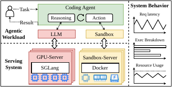

그림 1은 코딩 에이전트를 예로 세 층을 나눠 보여준다. 위쪽 "Agentic Workload" 영역에서는 사용자가 Coding Agent에 Task를 보내고 Result를 받으며, 에이전트 안에서 Reasoning과 Action이 반복 루프로 연결되어 추론은 LLM으로, 행동은 Sandbox로 디스패치된다. 아래쪽 "Serving System" 영역에서는 LLM이 SGLang이 도는 GPU 서버에, Sandbox가 Docker가 도는 별도의 Sandbox 서버에 각각 대응한다. 오른쪽 "System Behavior" 영역은 요청 지연, 실행 분해, 자원 사용량이라는 세 개의 도식적 플롯으로 관측 결과를 나타낸다.

시스템 연구에서 다뤄야 할 대상은 실행 하나가 아니라 실행들의 분포이고, 이 논문은 그것을 네 인자로 요약한다: $W{=}\langle R,T,M,O\rangle$. 요청 분포 $R$은 애플리케이션 시나리오, 과제 난이도, 페이로드 크기를 담는다. 도구·환경 집합 $T$(샌드박스, 브라우저, 벡터 DB 등)는 I/O 동작, 상태 풋프린트, 실패 양상, non-LLM 병목을 결정한다. 모델 선택과 추론 정책 $M$은 지연, 비용, 토큰 볼륨, 컨텍스트 길이, 캐시 동작을 결정한다. 오케스트레이션 구조 $O$(사전 정의 파이프라인, ReAct 루프, planner–executor 설계 등)는 동적성, 병렬성, 상태 유지를 좌우한다.

에이전트 동작은 워크로드만으로 특성화할 수 없다. 관측되는 결과는 그 워크로드를 **어떻게 서빙했는지**에도 달려 있기 때문이다. 그래서 서빙 시스템도 $S{=}\langle H,C,A\rangle$로 모델링한다. $H$는 GPU, CPU, DRAM, 스토리지, 네트워크 대역폭을 포함한 하드웨어 자원이고, $C$는 컴포넌트별 서빙 메커니즘 — LLM 엔진, 임베딩/리랭킹 서비스, 벡터 DB, 샌드박스 매니저, 브라우저나 GUI 환경, 코디네이터를 각각 어떻게 서빙하는지 — 이며, $A$는 배포 아키텍처, 즉 컴포넌트를 코로케이션할지, 별도 컨테이너로 둘지, 원격 클라우드 서비스로 서빙할지다.

따라서 측정된 결과는 상호작용 $Y=\Phi(W,S)$다. 같은 애플리케이션이라도 느린 모델과 함께면 LLM 지배로, 느린 샌드박스와 함께면 도구 지배로, 큰 라이브 컨텍스트와 함께면 상태 지배로, 원격 배치와 함께면 네트워크 지배로 보일 수 있다. 서빙 스택이 불충분하게 명세되면 실은 하드웨어 할당·서빙 정책·배치가 만든 병목을 워크로드 탓으로 돌리게 되고, 워크로드가 불충분하게 명세되면 한 구성에만 맞춰진 최적화가 일반화 근거 없이 제안된다.

통제 실험만으로도 부족하다. 통제 실험은 합성 도착 과정을 부과하고 과제를 고립된 채 완료까지 돌리므로 현실적인 요청 도착과 사용자 생각 시간, 유휴 상태로 상태를 붙들고 있는 장수 세션, 서로 다른 사용자의 요청들 사이의 중복을 드러내지 못한다. 프로덕션 트레이스는 이 현상들이 실제로 결과를 좌우함을 보여준다 — 세션은 라이브 상태를 붙든 채 수 분에서 수 시간을 기다리고, 외부 검색 호출의 다수는 앞선 요청이 이미 낸 질의를 반복한다.

### 벤치마크 스위트가 만족해야 할 네 요구사항

**R1: 워크로드 대표성.** 스위트는 좁은 프롬프트나 과제 레이블 모음이 아니라 $R$, $T$, $M$, $O$의 다양한 조합을 덮어야 한다. 좁은 커버리지는 관찰을 애플리케이션 특유 현상에 가둔다.

**R2: 통제 가능한 서빙 시스템 인자.** 실험이 하드웨어 할당($H$), 컴포넌트 서빙 메커니즘($C$), 배포 아키텍처($A$)를 통제된 조건에서 변화시킬 수 있어야 한다. 그렇지 않으면 관측된 병목을 워크로드 탓인지 인프라 탓인지 귀속할 수 없다.

**R3: 통일된 컴포넌트 수준 계측.** 애플리케이션과 배포를 가로질러 측정이 직접 비교 가능해야 하고, 계측은 종단 결과뿐 아니라 개별 LLM 호출·도구 호출·상태 연산까지 닿아야 한다.

**R4: 프로덕션 상보성.** 통제 벤치마크를 프로덕션 배포에서 수집한 트레이스와 짝지어야 한다. 프로덕션 연구는 통제 실험을 직접 검증하는 것이 아니라, 배포 환경에서만 나타나는 추가 동작을 드러냄으로써 **보완**한다.

## 🛠️ AgentSysBench - 열 개 애플리케이션, 모듈형 서빙 스택, 통일 계측

*Table 1. Compact overview of the AgentSysBench suite.*

| **Domain** | **Application** | **Domain** | **Application** |
|----|----|----|----|
| QA | RAG (Gao et al., 2024) | AI search | DeepResearch (AI, 2024) |
|  |  |  |  |
| Multimodal processing | HuggingGPT (Shen et al., 2023) | Software engineering | Mini-SWE (Team, 2025b) |
|  |  |  |  |
| Terminal use | Codex (OpenAI, 2025) | Browser use | WebAgent (Research, 2025) |
|  |  |  |  |
| Computer use | GUIAgent (Xie et al., 2024) | Tool-rich assistants | Claude Code (Anthropic, 2025) |
|  |  |  |  |
| Office work | Openclaw (WW-AI-Lab, 2025) | AutoResearch | Pi-AutoR (Barcelona, 2025) |

*Table 2. Systems-oriented overview of the benchmarking suite in AgentSysBench.*

| **Application** | **Domain** | **Datasets** | **Key Tools/Envs** | **Major Orch.** | **Model** |
|----|----|----|----|----|----|
| RAG (Gao et al., 2024) | Retrieval QA | WQA (Yang et al., 2015), MS-MARCO (Nguyen et al., 2016) | VecDB, embed | Pipeline | Qwen2.5-7B |
|  |  |  |  |  |  |
| HuggingGPT (Shen et al., 2023) | Multimodal | TaskBench (Shen et al., 2024) | Specialized models | Plan-Exec | DS-V4-Pro |
|  |  |  |  |  |  |
| OpenDR (AI, 2024) | AI Search | YDC (Su-Sea, 2024), GAIA (Mialon et al., 2023), HLE (Phan and Alice Gatti, 2025) | Search, VecDB, embed | Parallel, Plan-Exec, | Qwen3.7-Max; |
| OpenDR (AI, 2024) | AI Search | YDC (Su-Sea, 2024), GAIA (Mialon et al., 2023), HLE (Phan and Alice Gatti, 2025) | Search, VecDB, embed | Branching, Loop | DS-V4-Pro, V4-Flash |
|  |  |  |  |  |  |
| Mini-SWE (Team, 2025b) | Coding | SWEBench Verified (Jimenez et al., 2023) | FS, shell | ReAct | DS-V4-Pro |
|  |  |  |  |  |  |
| Codex (OpenAI, 2025) | Terminal | Terminal Bench (Shaw et al., 2025) | FS, shell | ReAct | DS-V4-Pro |
|  |  |  |  |  |  |
| WebAgent (Chezelles and others, 2024) | Browser | WebArena Verified (Research, 2025) | Browser | ReAct | Kimi-K2.6 |
|  |  |  |  |  |  |
| GUIAgent (Xie et al., 2024) | GUI | OSWorld (Xie et al., 2024) | Desktop | ReAct | Kimi-K2.6 |
|  |  |  |  |  |  |
| Claude Code (Anthropic, 2025) | Tool-rich assistant | MCP-Atlas (AI, 2025) | MCP, search, FS, shell | ReAct | DS-V4-Pro |
|  |  |  |  |  |  |
| Openclaw (WW-AI-Lab, 2025) | Office | WildClawBench (Ding et al., 2026) | MCP, search, FS, shell | ReAct | DS-V4-Pro |
|  |  |  |  |  |  |
| Pi-AutoR (Barcelona, 2025) | AutoML/research | MLEBench (OpenAI, 2024) | MCP, search, FS, shell | ReAct | DS-V4-Pro |

애플리케이션 선정의 목표는 모든 에이전트를 통계적으로 표집하는 것이 아니라, 현실적인 과제 의미를 보존하면서 지연·자원 수요·상태 풋프린트·비용을 좌우하는 성질들을 덮는 것이다. 요청 분포 $R$ 쪽에서는 짧은 문서 QA 요청이 작은 페이로드와 잦은 질의를, 브라우저·GUI 과제가 분 단위 상호작용을, AutoML/연구 잡이 더 긴 시간 지평과 더 큰 산출물을 담당한다. 도구·환경 $T$ 쪽에서는 검색·AI 서치 워크로드가 임베딩·리랭킹·벡터 DB·외부 검색을, 코딩·터미널 워크로드가 셸과 파일시스템 실행을, 브라우저·GUI·MCP 기반 워크로드가 상태를 가진 사용자 인터페이스, 원격 서비스, 네트워크 대면 I/O를 각각 압박한다. 오케스트레이션 $O$와 모델 선택 $M$ 쪽에서는 RAG가 거의 사전 결정된 파이프라인을, 대화형 에이전트가 ReAct 루프를, DeepResearch가 병렬 실행·계획·분기·루프 기반 정련의 조합을 대표한다.

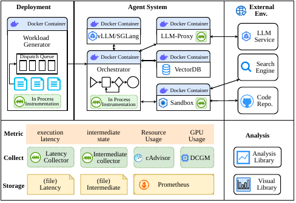

그림 2는 스위트 전체 구조를 위쪽 시스템 배치와 아래쪽 측정·분석 배치로 나눠 보여준다. 위쪽은 Deployment(Workload Generator, Dispatch Queue, In-Process Instrumentation을 담은 Docker 컨테이너), Agent System(LLM/SGI Call, LLM-Proxy, Orchestrator, VectorDB, Sandbox의 다섯 Docker 컨테이너), External Env.(LLM Service, Search Engine, Code Repo)로 나뉜다. Orchestrator 안에는 네 개의 추상 노드가 좌우 체인으로 연결되고 In-Process Instrumentation이 붙어 있으며, VectorDB로 이어진다. 아래 왼쪽 Metric 영역은 execution latency, intermediate state, Resource Usage, GPU Usage 네 열로 나뉘고, Collect 행에 Latency Collector, Intermediate Collector, cAdvisor, DCGM이, Storage 행에 Latency 파일, Intermediate 파일, 그리고 Resource/GPU 두 열에 걸치는 Prometheus가 배치된다. 아래 오른쪽 Analysis 영역에는 Analysis Library와 Visual Library가 있다.

워크로드 생성기가 $R$을 소유한다. 원본 데이터셋에서 과제를 샘플링하고, one-by-one·Poisson·트레이스 기반 같은 도착 과정을 적용해 오케스트레이터의 프로토콜로 요청을 제출한다. 각 오케스트레이터는 $O$를 소유하며 설정 가능한 도구·환경($T$)과 모델 서비스($M$)를 호출한다. 지도 원리는 **인자 고립**이다. 한 인자를 바꿔도 나머지는 가능한 한 보존되어야 한다 — 새 도착 과정은 같은 오케스트레이터를 재사용하고, 새 모델 엔드포인트는 같은 도구 경로를 유지하며, 새 도구 배포는 요청 분포를 그대로 둔다. 배포 계층은 런타임 컴포넌트를 Docker 컨테이너로 패키징해 $H$, $C$, $A$를 통제된 자원 한계와 배치 선택 아래 재현한다. 예를 들어 SGLang 인스턴스를 vLLM 인스턴스로 갈아끼워 LLM 서빙 엔진의 효과만 분리하거나, 임베디드 함수 호출을 고립된 온라인 서비스로 옮겨 disaggregation을 연구할 수 있다.

계측은 종단 지연, 연산별 지연, 입출력 크기, 토큰 사용량, 가능한 경우 금전 비용을 기록하고, 여기에 CPU·메모리·디스크·네트워크·GPU 사용량을 더한다. 소스를 고칠 수 있는 화이트박스 애플리케이션(RAG, HuggingGPT, DeepResearch, Mini-SWE, WebAgent)은 경량 애노테이션으로 레코드를 방출하고, 블랙박스 서드파티 애플리케이션(Codex, GUIAgent, Claude Code, Openclaw, Pi-AutoR)은 LLM/도구 프록시와 샌드박스 훅으로 추적한다. 샌드박스가 무거운 애플리케이션에는 SSH 기반 원격 샌드박스를 써서 훅 메서드로 행동을 가로챈다. 두 경로 모두 같은 트레이스 스키마로 흘러든다. 자원 관측에는 cAdvisor(CPU·메모리·디스크·네트워크), NVIDIA DCGM Exporter(GPU 사용률·메모리), Prometheus(시계열 저장)를 붙이고, 실험 후 분석 라이브러리가 트레이스를 정규화해 전용 그림이나 Grafana 대시보드를 만든다.

오케스트레이션 프레임워크, 도구 유형, 모델 능력, 배포 패턴은 빠르게 새로 등장하므로 스위트를 최신으로 유지하는 확장 방법도 같은 공간 위에 놓인다. 애플리케이션을 추가하려면 그것의 요청 분포, 도구·환경, 모델, 오케스트레이션, 하드웨어 자원, 컴포넌트 서빙 메커니즘, 배포 아키텍처를 기존 스위트와 동일한 워크로드·서빙 시스템 공간의 항목으로 기술하면 된다. 측정 툴킷이 이미 연산 트레이스와 자원 시계열을 정규화하고 있으므로 **새 애플리케이션에는 새로운 지표 정의도 새로운 귀속 로직도 필요하지 않다.** 통합은 실제로 다른 부분에만 국한된다 — 새 워크로드는 기존 도착 패턴을 재사용하고, 자기 오케스트레이터를 도구·모델 인터페이스에 연결하며, 소스를 고칠 수 있는지에 따라 애노테이션 기반 추적과 프록시 기반 추적 중 하나를 고른다. 그러면 배포 프레임워크가 내장 애플리케이션에 쓰던 것과 같은 로컬–원격 변환을 새 애플리케이션에도 그대로 준다.

### 기본 벤치마킹 설정

별도 언급이 없으면 통제 특성 분석은 다음 기본 배포를 쓴다. RAG를 제외한 각 워크플로는 최신 NVIDIA GPU 서버 한 대에서 돌고, 각 모듈은 Docker 컨테이너 하나에 놓이며 컨테이너들은 공유 메모리 기반 가상 네트워크로 통신한다. Mini-SWEAgent는 SGLang v0.5.12로 자체 배포한 DeepSeek-V4-Pro를 쓰고, 나머지 non-RAG 워크플로는 Alibaba-Bailian API를 쓴다. RAG는 8$\times$ 4090D GPU가 달린 x86_64 서버 한 대에서 돈다. 도구 배포에서는 임베딩 과제가 *jina-embeddings-v3* 를 TEI로 서빙하고, RAG와 DeepResearch는 공식 Docker 이미지의 *Milvus* 를 배포하며, DeepResearch는 Exa 검색 서비스를, HuggingGPT는 HuggingFace Pipeline을 쓴다.

이 특성 분석이 다룬 규모는 통제 실험에서 4,641개 벤치마크 요청, 64,924회 LLM 호출, 118,274회 도구 호출이고, 프로덕션에서는 하루 동안의 178,799개 세션이다.

## 🏋️ 발견 1 - 실행은 무겁고 상태를 지니며, non-LLM이 지배한다

### 오래 걸리고 꼬리가 두꺼운 실행

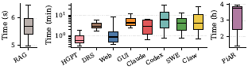

그림 3은 열 개 애플리케이션의 종단 지연 분포를 순차 실행 조건에서 상자 그림으로 보여준다. 축에 숫자가 인쇄되어 있지 않아 아래 값들은 축에서 읽은 근사치다. 왼쪽 패널은 RAG를 초 단위 선형 축(눈금 5, 6)에 그리는데 수염이 대략 5.0~6.5초, 상자가 약 5.2~5.9초, 중앙값이 약 5.5초다. 가운데 패널은 분 단위 로그 축(눈금 $10^0$, $10^1$)에 HGPT, DRS, Web, GUI, Claude, Codex, SWE, Claw를 그린다 — 중앙값은 각각 약 0.6분, 3.1분, 0.9분, 4.6분, 3.1분, 6.7분, 4.4분, 4.4분이고, 수염은 HGPT 약 0.3~2분, DRS 약 1.8~6.4분, Web 약 0.4~9분, GUI 약 2.6~13분, Claude 약 0.7~7분, Codex 약 0.8~35분, SWE 약 0.8~14분, Claw 약 0.7~30분이다. 오른쪽 패널은 시간 단위(눈금 2, 3, 4) 축의 PiAR로, 수염이 약 1.4~4시간, 상자가 약 2.4~3.9시간, 중앙값이 약 3.8시간이다.

에이전트 실행은 **장시간이고 꼬리가 무겁다**. 서브초에서 초 단위에 끝나는 챗봇이나 마이크로서비스 워크로드와 달리 에이전트 요청은 초에서 수 시간까지 걸친다. `Mini-SWE`의 코딩 과제는 10분을 넘기는 일이 잦고, `PiAutoResearch`의 연구 과제는 수 시간에 이를 수 있다.

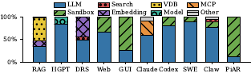

그림 4는 종단 실행 시간을 LLM, Sandbox, Search, Embedding, VDB, Model, MCP, Other로 분해한 100% 누적 막대다. 값이 인쇄되어 있지 않아 비율은 축에서 읽은 근사치다 — 아래에서 위로 RAG는 LLM 약 34%에 Embedding 약 13%와 VDB 약 52%, HGPT는 LLM 약 84%에 Model 약 16%, DRS는 LLM 약 48%에 Search 약 5%와 Embedding 약 45%, Web은 LLM 약 66%에 Sandbox 약 34%, GUI는 LLM 약 25%에 Sandbox 약 75%, Claude는 LLM 약 59%에 MCP 약 32%와 Other 약 9%, Codex는 LLM 약 80%에 Sandbox 약 20%, SWE는 LLM 약 89%에 Sandbox 약 11%, Claw는 LLM 약 77%에 Sandbox 약 12%·Search 약 5%·Other 약 5%, PiAR은 LLM 약 11%에 Sandbox 약 89%다.

특성 분석 대상의 절반에서 **non-LLM 컴포넌트가 임계 경로를 지배한다**. 본문이 명시하는 값으로는, `GUIAgent`의 컨테이너화된 데스크톱 샌드박스가 전체 실행 시간의 70% 이상을 차지하고, `Pi-AutoR`에서는 실험 런타임이 90%를 소모한다.

**함의.** 길어진 실행 시간은 시스템 신뢰성과 최적화 요구를 근본적으로 바꾼다. 첫째, 요청 하나가 도는 동안 노드나 네트워크 장애가 날 확률이 극적으로 커져서 단순한 재시도 전략은 비용이 감당 불가능해진다. 서빙 시스템은 에이전트 세션을 체크포인트하고 재개할 **가볍고 오버헤드 낮은 내결함성**을 제공해야 한다. 둘째, non-LLM 컴포넌트가 실행 시간을 지배하므로 모델만 최적화하면 수확 체감이 온다.

### 토큰 사용량의 증가

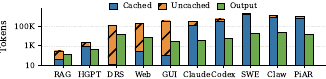

그림 5는 세션당 토큰 소비를 로그 축 막대로 보여준다. 범례는 Cached, Uncached, Output이고, 애플리케이션마다 Cached 위에 Uncached를 쌓은 입력 막대와 Output 막대를 나란히 따로 그린다. 인쇄된 눈금은 10, 1K, 100K뿐이고 막대에 값이 없어 아래는 로그 축에서 읽은 근사치다 — Cached / 입력 합계 / Output 순으로 RAG 약 30·300·100, HGPT 약 700·2K·350, DRS는 Cached가 눈에 띄지 않고 입력 합계 약 100K에 Output 약 12K, Web 약 200·150K·6K, GUI 약 80·400K·2K, Claude 약 100K·250K·3K, Codex 약 250K·500K·5K, SWE 약 1.3M·1.3M(Uncached가 거의 없다)·15K, Claw 약 700K·1M·20K, PiAR 약 500K·800K·12K다. 입력 막대가 가장 높은 것은 백만 토큰 규모의 SWE이고 Claw와 PiAR이 뒤를 잇는다.

**멀티턴 토큰 증폭.** 반복 추론 루프를 쓰는 애플리케이션(`Mini-SWE`, `Codex`의 ReAct 패턴)은 실행 단계를 거치며 토큰을 초선형으로 누적한다. 연속된 LLM 호출마다 전체 대화 이력, 도구 실행 로그, 시스템 프롬프트를 컨텍스트 윈도에 덧붙이므로 입력 크기가 턴 수에 대해 이차로 커진다. 그래서 ReAct 스타일 워크로드는 고정된 단일 턴 프롬프트로 도는 전형적인 RAG 워크로드보다 세션당 토큰을 몇 자릿수 더 쓴다.

**prefix cache 동역학.** prefix cache 적중률은 워크로드마다 극적으로 다르고, 이는 프롬프트 엔지니어링과 애플리케이션 워크플로의 차이를 반영한다. 정적인 시스템 프롬프트와 append-only 실행 이력을 가진 애플리케이션(`Claude Code`)은 최대 99%의 적중률을 얻는 반면, 매 턴 컨텍스트를 재구성·재정렬하거나 동적으로 가져오는 애플리케이션(`DeepResearch`)은 prefix 재사용이 1% 이하로 떨어진다.

**함의.** 캐시 적중 토큰이 지배적이라는 사실은 prefix caching을 선택적 최적화가 아니라 절대적 필수로 만든다. 서빙 시스템은 컨텍스트 캐시를 일급의 장수 자원으로 다뤄야 하고, 그러면 문제는 이 캐시된 성능 상태의 거대한 메모리 풋프린트 관리로 옮겨간다.

### 관리해야 할 상당한 양의 상태

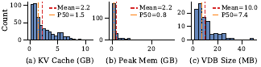

그림 6은 세 개의 히스토그램이다. 세로축은 모두 Count지만 눈금이 패널마다 달라 (a)는 0·50·100, (b)는 0·100, (c)는 0·10·20이고, 막대 높이가 인쇄되어 있지 않아 아래 빈도는 축에서 읽은 근사치다. (a) KV Cache (GB)는 범례에 Mean=2.2, P50=1.5가 적혀 있고 0.5~1.5 GB의 가장 높은 막대가 약 100회이며 관측이 대체로 2 GB 아래에 몰리고 약 3~9 GB 구간에 성긴 막대가 있다. (b) Peak Mem (GB)는 Mean=2.2, P50=0.8이고 1 GB 아래 막대가 100 눈금을 훌쩍 넘겨 약 150회에 이르며 나머지는 대부분 3 GB 아래, 약 8~9 GB 부근에 고립된 작은 막대가 있다. (c) VDB Size (MB)는 Mean=10.0, P50=7.4이고 0~10 MB에서 가장 높아 약 27회이며 약 47 MB의 고립된 막대까지 성긴 오른쪽 꼬리가 이어진다. 세 분포 모두 오른쪽으로 치우쳐 평균이 P50보다 크다.

논문은 캐시된 **성능 상태**와 **지속적 정확성 상태**를, 활성 **워킹셋 메모리**와 구분한다. 앞의 둘은 세션 일시정지를 가로질러 관리되어야 하고, 마지막은 일시적 자원 수요이며 정지 경계에서 반드시 체크포인트되어야 하는 상태는 아니다.

**성능 상태**는 실행 정확성을 해치지 않고 버릴 수 있지만 잃으면 상당한 재계산 지연을 무는 캐시된 중간 산출물이다. 대표적인 예가 LLM KV cache로, 이어지는 단계에서 길고 여러 턴에 걸친 컨텍스트를 다시 평가하지 않으려면 GPU HBM이나 호스트 DRAM에 남겨야 한다. 그림 6(a)에서 보듯 수십 번의 반복을 거치며 컨텍스트가 누적되면, DeepSeek-V4 같은 큰 모델을 도는 `Claude Code` 세션 하나가 KV cache 저장에 최대 11 GB의 GPU 메모리를 쓸 수 있다. 추론 엔진이 다음 호출에서 이력을 다시 prefill해 캐시를 복원할 수 있으므로 이 상태의 축출은 의미상 안전하지만, prefill 재계산의 가파른 지연·연산 비용 때문에 기회주의적 축출은 값비싼 트레이드오프가 된다.

**지속적 정확성 상태**는 잃으면 프로그램의 실행 의미가 깨지는 가변 실행 데이터다. `DeepResearch` 같은 검색 집약 애플리케이션에서는 세션마다 독립적인 벡터 DB 컬렉션이 만들어져 동적으로 검색된 문서와 임베딩 인덱스를 담는다. 그림 6(c)에서 컬렉션 크기의 중앙값은 7.4 MB에 이르고, 큰 세션은 49 MB를 넘는다. `Codex` 같은 코딩 에이전트는 지속적인 파일시스템 변경, 설치된 의존성, 프로세스 메타데이터도 필요로 한다. 에이전트 애플리케이션은 나아가 외부 부수 효과(예: 이메일 전송)를 낼 수 있고, 그러면 해당 외부 컴포넌트의 상태도 정확성의 일부가 된다.

**활성 워킹셋 메모리.** 살아 있는 샌드박스는 명령이 실행되는 동안 DRAM을 쓴다. 그림 6(b)에서 샌드박스 피크 DRAM 사용량의 중앙값은 약 0.8 GB인 반면, 세션당 피크는 컴파일과 단위 테스트 중 28 GB에 이른다. 이 28 GB는 워킹셋 피크다 — 일시적인 컴파일러·테스트 페이지는 반드시 지속적 정확성 상태인 것도 아니고, 전부가 계속 살아 있거나 정지 시점 체크포인트에 복사되어야 하는 것도 아니다.

**함의.** 성능 상태, 지속적 정확성 상태, 큰 활성 워킹셋이 공존하면 자원 관리가 복잡해진다. 상태 없는 마이크로서비스는 값싼 재시도로 장애를 견디지만, 에이전트 세션을 실패 처리하거나 마이그레이션하려면 LLM 엔진과 도구 런타임을 가로지르는 상태 체크포인팅을 협응해야 하고, 자원 프로비저닝은 일시적인 샌드박스 피크를 따로 수용해야 한다. 결정적으로 그림 6(b)의 전형값과 피크 사이의 큰 격차는 **정지 시점 스냅샷(quiescent-point snapshotting)** 이라는 최적화 기회를 드러낸다. 컴파일이 한창일 때 체크포인트를 시작하는 것은 매우 비효율적이므로, 에이전트 워크플로가 자연히 활성 단계와 유휴 기간을 번갈아 간다는 점을 이용해 단계 사이 유휴 구간(예: LLM 생성 결과를 기다리는 동안)에 샌드박스 체크포인트를 잡으면 된다. 대칭적으로, 에이전트가 오래 걸리는 샌드박스 도구 실행을 기다리는 동안 호스트는 유휴 세션의 GPU KV cache를 오프로드하거나 페이지 아웃할 수 있다.

### 방대한 데이터 I/O

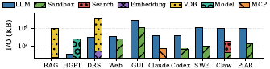

그림 7은 컴포넌트 유형별 평균 수신(왼쪽 막대)과 송신(오른쪽 막대) 데이터 볼륨을 로그 축(약 $10^0$~$10^3$ KB)으로 그린다. 값이 인쇄되어 있지 않아 근사치로 읽으면 왼쪽/오른쪽 막대가 RAG 약 4와 100 KB, HPTR 약 15와 20 KB, DRS 약 3과 600 KB, Web 약 10과 300 KB, GUI 약 15와 500 KB, Claude 약 400과 100 KB, Codex 약 30과 30 KB, SWE 약 30과 100 KB, Claw 약 100과 100 KB, PiAR 약 100과 100 KB다.

에이전트 실행 하나가 수십 MB의 데이터를 만들고 옮길 수 있다. 원인은 셋이다. 첫째, **샌드박스 환경**의 시각화·파일 동기화 오버헤드다. `GUIAgent`에서 데스크톱 샌드박스는 상호작용 단계마다 고해상도 GUI 화면 프레임을 캡처해 전송해야 하고, 이는 벤치마크 전체에서 단계당 최대 데이터 볼륨을 만든다. 둘째, **임베딩 모델과 벡터 DB**가 만드는 밀집 검색 표현이다. 이 논문의 `DeepResearch` 구성에서 임베딩 서비스는 1,024차원 FP32 벡터를 내보내고, 요청 하나가 20 MB 넘는 직렬화 임베딩 페이로드를 옮긴다 — 프로토콜 오버헤드를 빼고 약 5,000개 벡터, 즉 약 5백만 개의 스칼라 임베딩 원소에 해당한다. 셋째, **LLM 컨텍스트 누적**이다. 개별 LLM 텍스트 출력은 비교적 작지만 멀티턴 상호작용은 긴 시스템 지시, 도구 응답, 과거 관측을 매번 보내야 하고, `GUIAgent` 같은 애플리케이션에서는 이 반복 왕복이 세션당 10 MB 넘는 텍스트로 쌓인다.

**함의.** 이 I/O는 상태성의 부수 효과가 아니라 일급 병목이다. 분산 배포에서 임베딩·샌드박스 관측·누적 컨텍스트의 직렬화·역직렬화·네트워크 전송은 상당한 대역폭과 CPU 사이클을 먹고, 따라서 컴포넌트 간 네트워크 용량과 직렬화 효율이 연산 프로비저닝과 무관하게 달성 가능한 동시성과 종단 지연을 제약한다.

### 종량제 비용 분해(추정)

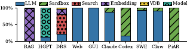

그림 8은 공개 클라우드 가격 기준으로 추정한 요청당 종량제 운영 비용을 100% 누적 막대로 그린다. 값이 인쇄되어 있지 않아 비율은 축에서 읽은 근사치다 — RAG는 거의 전부 Embedding이고, HGPT는 LLM 약 11%에 Model 약 89%, DRS는 LLM 약 20%에 Search 약 60%·Embedding 약 17%·VDB 약 2%, Web과 GUI는 전부 LLM이다. Claude는 LLM 약 87%에 Sandbox 약 13%, Codex는 LLM 약 15%에 Sandbox 약 85%, SWE는 LLM 약 93%에 Sandbox 약 7%, Claw는 LLM 약 91%에 Sandbox 약 9%, PiAR은 거의 전부 Sandbox다. 가격 산정에는 LLM API(cache-read, prefill, decode), 샌드박스 실행(E2B), 웹 검색 서비스(Firecrawl)를 쓴다.

**도구가 무거운 애플리케이션에서는 non-LLM 인프라 요금이 이 추정을 지배한다.** `Pi-AutoR`에서는 과학 시뮬레이션용 GPU 가속 컨테이너 때문에 샌드박스 요금이 요청당 비용의 99% 이상을 차지한다. 이 운영 비용 이동을 근본적으로 이끄는 것은 순차 실행 중의 자원 유휴 시간이다. 전용 샌드박스나 검색 환경이 세션에 할당되면, 그 세션이 오래 걸리는 GPU 바운드 모델 추론 단계를 기다리는 동안에도 계속 과금되어 자원 활용률은 낮고 금전 낭비는 커진다.

**함의.** 비용을 의식하는 서빙 시스템은 토큰 효율을 넘어 도구 사용 생애주기 전체를 오케스트레이션해야 한다. 대규모에서 비용 효율적으로 운영하려면 능동적인 샌드박스 다중화와 동적 자원 프로비저닝이 필요하다. 서버리스 콜드스타트 최적화처럼, 서빙 스택은 유휴 기간에 컨테이너 환경을 동적으로 일시정지·스냅샷·재개해 물리 자원 과금을 에이전트 루프의 유휴 시간으로부터 분리해야 한다.

## 🧬 발견 2 - 교차 스택 이질성

에이전트 애플리케이션은 LLM, 작은 모델, 다양한 도구를 조합하는데 이들의 자원 수요와 런타임 특성은 근본적으로 다르다. 명시적 관리가 없으면 이 이질성은 자원 단편화와 성능 간섭을 낳는다. 논문은 이질성을 컴포넌트, 태스크, 개별 호출의 세 수준에서 본다.

### 컴포넌트 수준

이질성은 컴포넌트를 가로지를 때 가장 잘 보인다. 애플리케이션 하나가 GPU 바운드 LLM, CPU 바운드 샌드박스(WebArena의 브라우저, GUIAgent의 데스크톱), 메모리 바운드 벡터 DB, 네트워크 바운드 검색 서비스(DeepResearch)에 걸쳐 있고, GPU 계층 안에서도 이질성이 남는다 — HuggingGPT 하나가 16.8-to-6032-GFLOP 범위의 모델들을 조율하며 각각 다른 메모리 풋프린트와 지연 프로파일을 갖는다. 생애주기도 다르다. 상태를 가진 LLM과 오래 도는 샌드박스는 지속적인 메모리와 빠른 로컬 스토리지를 요구하는 반면, 상태 없는 임베딩 모델은 일시적이고 탄력적으로 확장된다. 동질적 하드웨어 위에서 이 갈라진 프로파일들은 자원을 단편화해 GPU는 포화시키고 CPU는 놀게 만들며, 어떤 정적 프로비저닝 계획도 불가능하게 한다.

### 태스크 수준

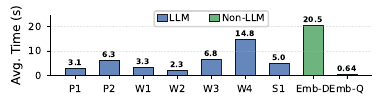

그림 9는 DeepResearch의 아홉 태스크 평균 실행 시간을 막대로 인쇄한다: P1 3.1 s, P2 6.3 s, W1 3.3 s, W2 2.3 s, W3 6.8 s, W4 14.8 s, S1 5.0 s, Embed-Q 0.64 s, Embed-Doc 20.5 s. 범례는 LLM과 Non-LLM을 나누는데 Non-LLM으로 색칠된 것은 두 임베딩 태스크인 Embed-Doc과 Embed-Query이고 나머지 일곱이 LLM이다.

같은 컴포넌트가 서빙하는 태스크들끼리도 지연이 최대 32$\times$ 차이 난다. DeepResearch의 두 LLM 단계 *write-search-plan*(W2)과 *write-section*(W4)은 같은 모델에 요청하는데도 W4가 6.43$\times$ 느리다. 임베딩에서는 격차가 더 심해서 Embed-Doc이 같은 모델 위에서 Embed-Query보다 32$\times$ 느리다.

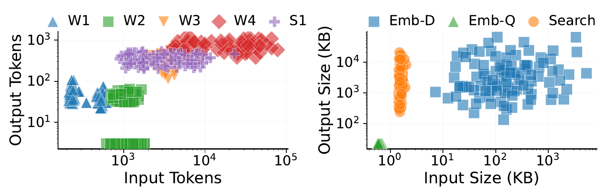

그림 10은 두 개의 로그 축 산점도다. 왼쪽은 가로축 Input Tokens, 세로축 Output Tokens로 W1, W2, W3, W4, S1을 그린다 — 개별 점에 숫자 라벨이 없어 아래는 축에서 읽은 근사치다. W1은 입력 약 $2\times10^2$~$7\times10^2$, 출력 약 $2\times10^1$~$1.3\times10^2$이고, W2는 대부분 입력 약 $6\times10^2$~$2\times10^3$에 출력 약 $2\times10^1$~$7\times10^1$이며 출력 2~4 부근의 별도 조밀 띠가 있다. W3은 입력 약 $2\times10^3$~$5\times10^3$, 출력 약 $10^2$~$7\times10^2$인데 대부분의 점이 $10^2$~$2\times10^2$에 몰려 있고 위쪽은 S1 점들에 가려 일부만 보이며, W4는 입력 약 $3\times10^3$~$9\times10^4$, 출력 약 $4\times10^2$~$1.5\times10^3$으로 가장 높은 출력과 가장 넓은 입력 분포를 갖는다. S1은 입력 약 $8\times10^2$~$2\times10^4$, 출력 약 $2\times10^2$~$6\times10^2$이다. 오른쪽은 가로축 Input Size (KB), 세로축 Output Size (KB)로 Emb-D, Emb-Q, Search를 그린다 — Emb-Q는 입력 약 0.5~0.8 KB, 출력 약 15~30 KB의 조밀한 군집이고, Search는 입력 약 1.2~2.5 KB에 출력 약 $2\times10^2$~$2\times10^4$ KB의 좁은 수직 분포이며, Emb-D는 입력 약 3~$5\times10^3$ KB, 출력 약 $10^2$~$8\times10^4$ KB로 넓게 흩어진다.

격차를 만드는 것은 컴포넌트 자체가 아니라 입출력 규모다. W2·W4 같은 LLM 태스크의 실행 비용은 주로 prefill할 입력 토큰 수와 decode할 출력 토큰 수로 정해진다. W4의 평균 입력 토큰은 W2보다 26$\times$ 크고 평균 출력 토큰은 16$\times$ 커서, 6.43$\times$의 격차를 설명한다. 임베딩 태스크의 비용도 임베딩할 텍스트 페이로드가 주로 결정하는데, Embed-Doc의 페이로드는 Embed-Query보다 325$\times$ 크다.

### 호출 수준

그림 10은 두 번째 층의 이질성도 드러낸다. 각 태스크 **내부**의 산포 자체가 크다는 것 — 호출당 워크로드는 태스크 유형 사이에서만이 아니라 한 태스크 안에서도 넓게 변한다. 이는 서로 다른 실행을 뭉쳐 놓아서 생긴 결과만이 아니다. 하나의 에이전트 실행 안에서도 반복 호출되는 태스크가 호출마다 상당히 다르다.

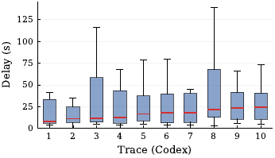

그림 11은 열 개 Mini-SWE 트레이스의 반복 간 LLM 호출 지연 분포를 상자 그림으로 보여준다. 세로축 Delay (s)의 눈금은 0, 25, 50, 75, 100, 125이고 값이 인쇄되어 있지 않아 아래는 근사치다. 트레이스별로 (하단 수염, 하단 상자, 중앙값, 상단 상자, 상단 수염)이 대략 Trace 1은 4·5·8·33·41초, Trace 2는 1·6·11·25·35초, Trace 3은 5·7·11·58·116초, Trace 4는 4·5·12·43·68초, Trace 5는 5·8·16·37·78초, Trace 6은 4·6·18·39·79초, Trace 7은 4·6·18·40·45초, Trace 8은 3·13·21·68·139초, Trace 9는 5·10·23·41·66초, Trace 10은 5·10·24·40·73초다. Trace 8의 산포가 가장 넓고, Trace 9와 10의 중앙값이 약 23~24초로 가장 높다. 하나의 트레이스 안에서 같은 LLM 태스크가 최대 30$\times$까지 변한다.

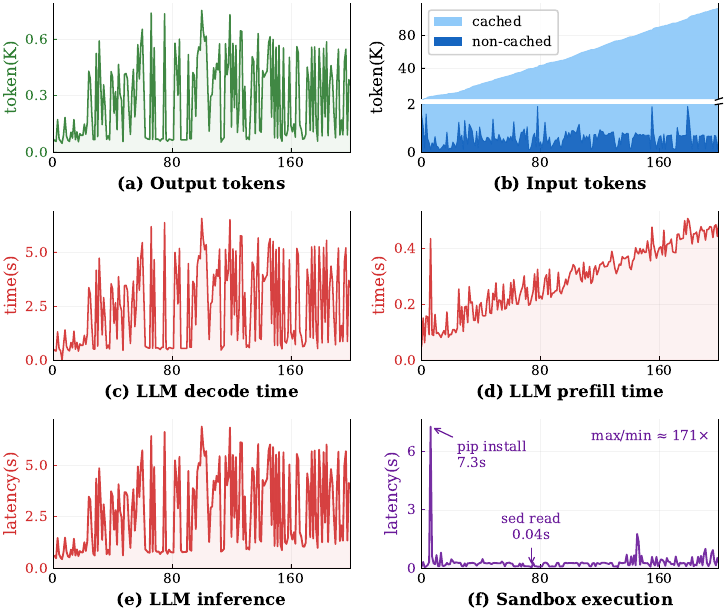

그림 12는 Mini-SWE 실행 하나에서 반복(0~약 200)에 따른 여섯 패널을 그린다. 값이 인쇄되어 있지 않아 아래는 축에서 읽은 근사치다. (a) 출력 토큰은 약 0.05K~0.75K 사이를 불규칙하게 오간다. (b) 입력 토큰은 cached와 non-cached로 나뉘는데, cached 성분이 처음 수 K에서 끝의 약 100K까지 단조 증가하고 non-cached 성분은 대개 약 1K 아래에 머물다 간헐적으로 약 2K까지 튄다. (c) LLM decode 시간은 대개 약 0.2~4.5초에서 크게 요동하며 약 6.5초까지 반복적으로 치솟는다. (d) LLM prefill 시간은 초반 약 0.4초의 스파이크 뒤 대체로 약 0.1~0.25초이며, 요동하면서 마지막 반복 부근에서 약 0.48초까지 전반적으로 상승한다. (e) LLM 추론 지연은 대부분 약 0.5~5.5초로 매우 가변적이고 약 6.5~6.8초의 봉우리가 반복되며 decode 시간의 요동을 대체로 따라간다. (f) 샌드박스 실행 지연은 대부분 약 0~0.5초이고 후반에 약 1.5~1.8초의 스파이크가 있으며, 초반의 지배적인 스파이크에는 "pip install 7.3s", 중간의 작은 사건에는 "sed read 0.04s"가 인쇄되어 있고 패널에 "max/min ≈ 171×"도 인쇄되어 있다.

LLM 태스크의 호출 수준 이질성도 호출별 워크로드 — decode하는 출력과 prefill해야 하는 입력 — 가 이끈다. 출력 길이가 한 트레이스 안에서 넓게 변하며 decoding 지연의 요동에, 따라서 종단 호출 지연의 요동에 직접 기여한다. 입력 길이는 반복 에이전트 루프가 각 행동과 관측을 대화 이력에 덧붙이므로 일관되게 증가한다. prefix caching은 이 누적 컨텍스트의 KV 상태를 재사용해 캐시된 토큰의 projection과 feed-forward 층 재계산을 피한다(Zheng et al., 2024). 그럼에도 캐시된 prefix가 공짜는 아니다. 새로 덧붙는 토큰마다 앞선 캐시된 key/value에 대해 attention을 해야 한다. 어떤 호출에 캐시된 토큰이 $C$개, 캐시되지 않은 토큰이 $U$개 있다면 남은 attention 작업량은 대략 $U(C+U)$로 자라고, $C$가 커질수록 attention 커널이 읽어야 할 캐시된 KV 상태도 늘어난다. 그래서 자라나는 캐시 prefix가 반복 전반에 걸쳐 prefill 지연의 전역 기준선을 끌어올린다. 한편 $U$ — 새로 덧붙은 비캐시 관측 — 의 변동은 이 토큰들이 전체 모델 연산을 요구하고 추가 attention 질의를 도입하기 때문에 국소적 요동을 만든다. 즉 전체 컨텍스트 길이가 prefill 지연의 전역 상승을, 비캐시 입력 길이가 반복 간 변동을 더 잘 설명한다.

샌드박스 호출도 호출 수준 이질성이 크다. 같은 Mini-SWE 트레이스에서 가장 긴 호출(`pip install` 명령)이 가장 짧은 호출(`sed` 명령)보다 최대 171$\times$ 느리다. 이 현상은 반복 루프형 애플리케이션에 국한되지 않는다. 예컨대 실행마다 여러 검색 질의를 촉발하는 DeepResearch에서는 검색 지연이 호출마다 예측 불가능하게 변한다 — 결과 페이로드가 짧은 스니펫에서 수 MB 웹 페이지까지 걸치고, 수십 개의 병렬 질의가 외부 대역폭을 두고 경쟁하면서 네트워크 조건도 흔들린다. 동시에 검색이 돌려주는 웹 페이지 크기의 변동이 임베딩 태스크의 페이로드를 변동시켜 같은 실행 안에서 임베딩 지연까지 들쭉날쭉하게 만든다.

### 성능 간섭 - 세 가지 메커니즘

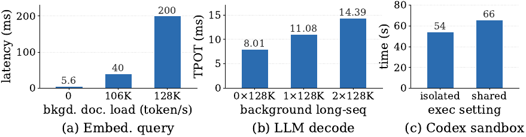

그림 13의 세 패널에는 값이 인쇄되어 있다. (a) "Embed. query"는 배경 문서 임베딩 부하 0, 106K, 128K token/s에 대해 지연 5.6, 40, 200 ms. (b) "LLM decode"는 배경 long-seq 0×128K, 1×128K, 2×128K에 대해 tPOT 8.01, 11.08, 14.39 ms. (c) "Codex sandbox"는 isolated와 shared 설정에 대해 실행 시간 54 s와 66 s.

**큐잉 간섭.** 가벼운 *embed-query* 태스크와 무거운 *embed-doc* 태스크가 서비스 인스턴스 하나와 요청 큐 하나를 공유한다. 배경 문서 트래픽이 없으면 embed-query 요청은 평균 5.6 ms에 끝난다. 배경 embed-doc 부하가 106K, 128K tokens/s로 오르면 평균 지연은 각각 40 ms와 200 ms로 올라가 7.1$\times$, 35.7$\times$의 감속이 된다. 큰 문서 요청이 임베딩 워커를 더 오래 점유해 지연에 민감한 질의 요청이 그 뒤에 줄을 서게 만든다 — head-of-line(HOL) 블로킹이다.

**코배칭 간섭.** LLM 엔진은 decoding 반복마다 활성 요청을 배칭해 GPU 활용률을 올린다(Kwon et al., 2023; Zheng et al., 2024). 각 반복은 배치의 모든 요청에 대해 새 토큰 하나를 계산하고, attention 커널은 각 요청의 KV cache를 읽는다. 긴 컨텍스트 요청은 짧은 요청보다 훨씬 많은 KV cache 트래픽과 attention 작업을 더한다. 배치의 요청들이 같은 decoding 반복을 함께 통과하므로 이 추가 작업은 짧은 요청이 관측하는 출력 토큰당 시간(TPOT)까지 늘린다. 짧은 컨텍스트(10K 토큰) 요청 하나를 지연 민감 피해자로 고정하고 128K 토큰 컨텍스트의 배경 요청 수를 바꾸면, 단독 서빙 시 TPOT 평균은 8.01 ms인데 긴 컨텍스트 요청 하나와 함께 서빙하면 11.08 ms로 38.3% 증가하고, 둘과 함께면 14.39 ms로 79.7%(1.80$\times$) 증가한다. 단조 감속은 긴 컨텍스트 배경 부하 증가가 고정된 짧은 요청까지 공유 decoding 반복을 통해 지연시킨다는 것을 보여준다.

**공유 자원 경합.** *install-klee-minimal* 벤치마크 태스크를 여덟 개의 동시 Codex 샌드박스에서 재생한다. *isolated* 설정에서는 각 샌드박스가 서로 겹치지 않는 16-CPU 집합에 고정되고, *shared* 설정에서는 여덟 개 모두가 동일한 128 CPU 풀 위에서 스케줄된다. 총 CPU 용량은 같지만 공유는 CPU 스케줄링과 공유 캐시·메모리 서브시스템을 통한 간섭을 허용한다. 평균 실행 시간이 54 s에서 66 s로 1.22$\times$ 느려진다. 이 실험은 공유 자원 경합이 있다는 사실을 확립하는 것이고, 감속을 last-level cache 같은 특정 자원에 귀속시키려면 하드웨어 카운터 측정이 추가로 필요하다.

세 메커니즘은 서로 배타적이지도 전부를 망라하지도 않지만, 교차 스택 이질성이 성능 저하로 번역되는 흔한 세 경로를 포착한다.

## 🔀 발견 3 - 병목은 이동한다

재래식 LLM 서빙에서 병목은 명확하다. GPU 추론이 종단 지연을 지배한다. 에이전트 서빙에서는 더 이상 그렇지 않다. 측정된 시스템 동작 $Y=\Phi(W,S)$는 $W$와 $S$ 모두에 달려 있으므로, 종단 지연을 지배하는 컴포넌트라는 관측량도 $W$나 $S$의 어떤 인자를 바꾸든 이동한다.

### 워크로드가 이끄는 이동

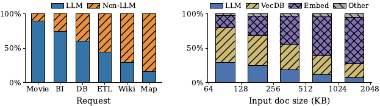

그림 14는 두 개의 100% 누적 막대다. 값이 인쇄되어 있지 않아 아래는 축에서 읽은 근사치다. 왼쪽은 요청 유형(Movie, BI, DB, ETL, Wiki, Map)에 대한 LLM/Non-LLM 비율로 대략 Movie 89%/11%, BI 74%/26%, DB 60%/40%, ETL 44%/56%, Wiki 29%/71%, Map 15%/85%다. 오른쪽은 입력 문서 크기 축(눈금 64, 128, 256, 512, 1024, 2048 KB)에 대한 LLM/VecDB/Embed/Other 비율인데, 눈금 여섯 개에 막대는 다섯 개뿐이라 막대가 눈금 사이에 반 칸씩 어긋나 놓여 있다. 작은 문서 쪽에서 큰 문서 쪽으로 가며 막대는 차례로 29%/50%/19%/2%, 24%/43%/30%/3%, 18%/36%/43%/3%, 11%/27%/58%/4%, 6%/20%/70%/4%가 되어 LLM과 VecDB 비중이 줄고 Embed는 세 번째 막대부터 최대 성분이 된다.

**요청 분포($R$).** *요청 유형* 쪽에서는 MCP-Atlas(AI, 2025)의 여섯 요청 범주에 Claude Code를 돌린다. 각 범주는 서로 다른 MCP 도구로 다른 문제를 푼다. 병목은 요청 유형에 따라 뚜렷이 달라져서 Movie, BI, DB에서는 LLM이 전체 시간의 최대 90%까지 지배하고, ETL, Wiki, MAP에서는 도구 실행이 전체 시간의 최대 84%까지 지배한다. *요청 페이로드 크기* 쪽에서는 LLM 기반 분기가 전혀 없이 실행 그래프가 완전히 사전 정의된 RAG로 효과를 분리한다. 64에서 2,048 KB에 이르는 MS-MARCO 문서(Nguyen et al., 2016)로 구동하면, 문서가 커질수록 `embed_doc` 비중이 늘고 `vdb_store`와 LLM 비중이 줄어 병목이 작은 입력에서의 벡터 DB 저장에서 큰 입력에서의 임베딩으로 이동한다.

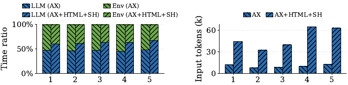

그림 15는 WebAgent의 관측 형식 구성에 따른 결과다. 왼쪽 누적 막대는 다섯 개 범주 각각에 대해 AX와 AX+HTML+SH 두 스택의 LLM/Env 시간 비율을 그린다 — 값이 인쇄되어 있지 않아 축에서 읽으면 범주 1~5의 AX가 각각 LLM 47%/Env 53%, 46%/54%, 47%/53%, 47%/53%, 48%/52%이고, AX+HTML+SH가 61%/39%, 61%/39%, 64%/36%, 62%/38%, 67%/33%다. 오른쪽 그룹 막대는 입력 토큰(k)으로 범주 1~5의 AX가 약 12k, 8k, 9k, 10k, 12k이고 AX+HTML+SH가 약 45k, 32k, 40k, 65k, 63k다.

**도구 집합($T$).** 도구 집합은 에이전트가 처리해야 할 관측을 결정하고 따라서 LLM 비용을 결정한다. WebAgent는 브라우저 상태를 accessibility tree, HTML, 스크린샷 세 형식 또는 그 조합으로 관측하는데, 형식을 더할수록 더 많은 상태가 드러나지만 LLM에 보내는 프롬프트도 길어진다. 다섯 개 웹 브라우징 과제를 단일 형식(accessibility tree만)과 세 형식 전부로 돌리면, 단일 형식에서는 관측이 작아 브라우저 상호작용이 지배하고, 세 형식을 모두 더하면 단계당 입력 토큰이 4.8$\times$ 늘면서 LLM 추론이 전체 지연의 46.9%에서 61.6%로 올라간다.

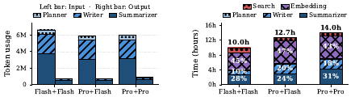

**모델 선택($M$).** 모델 선택은 LLM 태스크의 토큰당 서비스 시간을 바꾸므로 실행 그래프와 요청 집합이 고정되어 있어도 병목을 이동시킬 수 있다. DeepResearch는 계획, 보고서 작성, 요약에 각각 별도의 LLM 단계를 쓴다. 플래너는 Qwen3.7-Max로 고정하고 writer와 summarizer를 DeepSeek-V4-Flash와 DeepSeek-V4-Pro 사이에서 바꿔 세 구성(writer를 앞에 적어 *Flash+Flash*, *Pro+Flash*, *Pro+Pro*)을 평가한다. 고립된 단일 요청 측정에서 V4-Flash는 초당 51 출력 토큰을, V4-Pro는 초당 21 출력 토큰을 생성해 V4-Flash가 출력 토큰 처리량에서 2.43$\times$ 빠르다.

그림 16은 세 구성의 토큰 사용량(왼쪽)과 절대 실행 시간 분해(오른쪽)를 비교한다. Flash+Flash와 Pro+Flash에서는 임베딩이 여전히 최대 기여자로 전체 실행 시간의 각각 45%와 47%를 차지하고, LLM 단계 합계는 38%와 44%다. Pro+Pro에서는 LLM 비중이 49%로 올라 임베딩의 43%를 제치고 새 병목이 된다. 이에 따라 총 실행 시간은 Flash+Flash의 10.0시간에서 Pro+Flash 12.7시간, Pro+Pro 14.0시간으로 늘어난다.

이 이동을 이끄는 것은 주로 토큰 볼륨이 아니라 모델 속도 격차다. Flash+Flash에서 Pro+Flash로 옮기면 총 토큰 볼륨은 줄어드는데도 LLM 시간 비중은 38%에서 44%로 늘고, Pro+Flash에서 Pro+Pro로 옮기면 토큰 사용량은 조금만 바뀌는데 LLM 비중은 49%로 더 오른다. 즉 토큰 수만으로는 지연 분해를 예측할 수 없고, writer와 summarizer의 서빙 속도를 바꾸는 것만으로 병목이 임베딩에서 LLM 실행으로 옮겨간다.

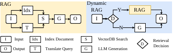

그림 17은 RAG와 Dynamic RAG(RAG\*)의 오케스트레이션 구조 차이를 보여준다. 왼쪽 RAG는 정적 파이프라인이다 — 입력 I가 Idx(Index Document)와 T(Translate Query)로 갈라지고 둘이 S(VectorDB Search)로, S가 G(LLM Generation)로, G가 출력 O로 간다. 오른쪽 Dynamic RAG는 I가 D(Retrieval Decision)라는 마름모로 들어가고, Y 분기는 RAG를 거쳐 O로, N 분기는 곧장 G를 거쳐 O로 간다.

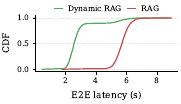

그림 18은 두 구성의 종단 지연 CDF다. 값이 인쇄되어 있지 않아 축에서 읽으면 Dynamic RAG는 약 2초에서 가파르게 오르기 시작해 약 2.5초에서 0.5, 약 3.2초에서 0.9에 이른 뒤 완만한 어깨를 이루다 약 6.2초에서 1.0에 닿고, RAG는 약 4.8초까지 0 근처에 머물다 약 5.7초에서 0.5, 약 6.8초에서 1.0에 이른다. 즉 Dynamic RAG의 종단 지연이 분포 전반에서 훨씬 낮지만, 상위 10% 요청의 꼬리는 6초 너머까지 이어진다.

**오케스트레이션($O$).** 같은 과제, 같은 도구 집합, 같은 모델이라도 개발자마다 다른 오케스트레이션 구조를 설계한다. RAG(embed$\to$retrieve$\to$generate의 정적 파이프라인)와 Dynamic RAG(RAG\*)를 비교하면, RAG\*는 불필요하다고 판단될 때 임베딩과 검색을 건너뛰는 LLM 기반 검색 결정 단계를 추가한다. Table 2의 워크로드에서는 질의의 90%가 RAG\*에서 검색을 우회해 임베딩을 놀게 만들고, 병목을 임베딩에서 LLM 추론으로 이동시킨다.

### 서빙 시스템이 이끄는 이동

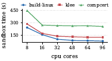

그림 19는 CPU 코어 수(8, 16, 32, 48, 64, 96)에 따른 샌드박스 시간(s)을 세 대표 과제로 그린 선 그래프다. 세로축 눈금은 150, 300, 450이고 축의 아래끝이 0이 아니라 약 64초라 낮은 값들이 실제보다 작아 보인다. 값이 인쇄되어 있지 않아 축에서 읽으면 build-linux가 약 245, 155, 100, 85, 85, 80초, klee가 약 285, 170, 140, 130, 125, 125초, compcert가 약 445, 270, 265, 265, 260, 255초다. build-linux와 klee는 코어가 늘수록 가파르게 줄고, compcert는 16코어 이후 약 270초에서 평평해진다.

**하드웨어 자원($H$).** 샌드박스 성능은 특히 코드를 컴파일하거나 실행할 때 할당된 자원에 크게 좌우된다. Codex Agent 아래에서 값비싼 코드 실행을 포함하는 TerminalBench 과제 열 개를 골라 샌드박스 할당을 8, 16, 32, 48, 64, 96 CPU 코어로 바꿔가며 전부 측정한다. 코어를 더 주면 샌드박스 실행 시간이 줄고 병목이 샌드박스 실행에서 LLM 추론으로 바뀔 수 있다.

**컴포넌트 서빙 메커니즘($C$).** 컴포넌트를 어떻게 서빙하느냐가 그 태스크 지연을, 따라서 애플리케이션의 지연 분해를 좌우한다. LLM 서빙만 놓고 봐도 개발자는 프레임워크(vLLM 대 SGLang), 실행 아키텍처(chunked-prefill 대 prefill–decode disaggregation), 배치 크기 같은 파라미터를 고른다. GUIAgent의 LLM을 SGLang(Zheng et al., 2024)으로 서빙하며 배치 크기를 1에서 4로 바꾸면, 배치 크기 1에서는 TPOT이 7 ms이고 도구 실행(데스크톱 상호작용)이 지배하지만, 배치 크기 4에서는 decode 경합이 TPOT을 30 ms로 올려 LLM 추론이 4$\times$ 느려지고 병목이 된다 — 순전히 엔진 노브 하나가 만든 이동이다.

**배포 아키텍처($A$).** 배포 아키텍처는 컴포넌트가 어디서 돌고 어떻게 통신하는지를 지배한다. 각 컴포넌트를 자기 요구에 맞춘 서버에 둘 수도, 자원 수요가 상보적인 컴포넌트와 코로케이션할 수도, 통신이 많은 컴포넌트와 코로케이션해 네트워크 오버헤드를 줄일 수도 있고, 선택마다 다른 병목이 나온다. RAG의 코로케이션 배포와 분산 배포(LLM, 임베딩 서비스, 벡터 DB를 각각 다른 머신에)를 비교하면, 코로케이션에서는 네트워크 전송이 무시할 만하고 *vector-db* 가 지연의 47%로 지배하는 반면, 요청 동시성을 10으로 올린 분산 배포에서는 네트워크가 혼잡해져 전송이 전체 시간의 67.5%로 자란다.

병목은 워크로드 인자($R$, $T$, $M$, $O$)든 서빙 시스템 인자($H$, $C$, $A$)든 무엇 하나가 바뀔 때마다 이동한다. 정적 프로파일링과 고정 자원 할당으로는 이 이동을 좇을 수 없고, 그래서 서빙 시스템은 온라인으로 요청마다 적응하는 방식을 채택해야 한다.

## 🏭 프로덕션 트레이스가 드러낸 것

통제 실험은 실험실 조건에서 인자를 고립시킨다. 프로덕션 배포는 벤치마크가 억누르는 동작을 더한다 — 사용자 생각 시간과 승인, 긴 일시정지를 넘어 재개 가능하게 남는 세션, harness가 만들어내는 컨텍스트와 보조 모델 호출, 사용자를 가로지르는 반복 도구 요청. 분석 대상은 배포된 세 애플리케이션의 24시간 트레이스다: (1) *코딩 에이전트* (35,037 세션), (2) *검색 기반 QA 에이전트* (141,376 세션), (3) *Openclaw 유사 에이전트* (2,386 세션).

### 길고 유휴하지만 살아 있는 구간

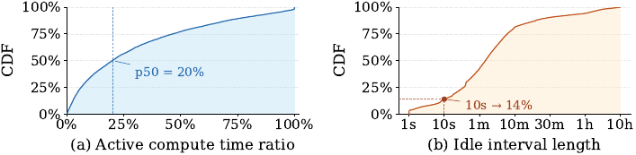

그림 20(a)는 활성 연산 시간 비율의 CDF다. 곡선은 0 근처에서 가파르게 오른 뒤 완만해지며, 20%에서 약 50%, 50%에서 약 70%, 75%에서 약 85%에 이르고 100%에서 100%가 된다. 20% 지점에 "p50 = 20%"라는 점선 표시가 인쇄되어 있다. (b)는 유휴 구간 길이의 CDF로 가로축이 1s, 10s, 1m, 10m, 30m, 1h, 10h의 로그 축이다 — 1s 부근에서 약 5%로 시작해 "10s → 14%" 주석이 붙고, 1m에서 약 30%, 10m에서 약 80%, 30m에서 약 90%, 1h에서 약 95%, 10h에서 100%에 이른다.

벤치마크 실행은 앞 연산이 끝나자마자 다음 단계로 넘어간다. 프로덕션 세션은 사람의 승인, 서브에이전트 결과, 후속 지시를 기다리며 자주 멈춘다. 그런 세션은 논리적으로는 살아 있지만 국소적으로는 비활성일 수 있다 — 새 LLM이나 도구 작업을 내지 않는 동안에도 샌드박스, 터미널 컨텍스트, KV cache, 대화 이력은 재개를 위해 남아 있어야 한다. 35,037개 세션에서 LLM·도구 실행에 귀속된 시간을 세션 총 수명으로 나누면, 중앙값 세션은 수명의 20%만 실행하고 세션의 70%는 수명의 절반이 안 되게 실행한다. 유휴 구간은 도구 결과나 사람 승인을 기다리는 몇 초부터 밤샘 정지를 포함한 몇 시간까지 걸치며, 대부분은 1분에서 10분 사이에 든다. 이 구간 내내 정확성에 결정적인 상태를 쥔 세션별 샌드박스는 할당된 채로 남는다.

**함의.** "실행 중"과 "종료"의 이분 생애주기로는 부족하다. harness는 세 번째의 정지 상태인 "대기(waiting)"를, 가능하면 예상 재개 트리거나 데드라인과 함께 노출해야 한다. 그러면 서빙 계층은 정확성 상태와 성능 상태를 따로 관리할 수 있다 — 샌드박스와 터미널 상태는 내구성 있는 계층으로 체크포인트하거나 오프로드하고, KV cache는 예상 재사용 이득에 따라 유지·마이그레이션·축출한다. 재개 예측과 프리페치로 복원 지연을 숨길 수도 있다.

### 에이전트 제어 평면 세금

프로덕션 에이전트는 애플리케이션 수준 제어 평면을 구현하는 *harness* 안에서 돈다. harness는 프롬프트를 조립하고, 컨텍스트 윈도를 관리하고, 도구 호출 루프를 구동·감시하며, 장수 세션을 가로질러 상태를 보존한다. 이 기계장치는 다단계 실행에 필요하지만, 목표 지향적인 모델·도구 실행 너머에 추가 서빙 비용을 도입한다. 논문은 이를 **에이전트 제어 평면 세금(agent control-plane tax)** 이라 부르고 세 형태로 나눈다: 제어 평면 상태가 컨텍스트 윈도 용량을 점유하고, 보조 태스크가 추가 LLM 작업을 부르며, 세션 유휴와 캐시 수명의 상호작용이 반복 prefill을 낳는다.

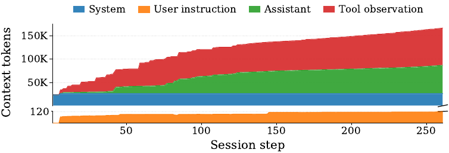

그림 21은 프로덕션 세션 하나에서 LLM 입력 컨텍스트 구성을 세션 단계(약 260까지)에 따라 쌓은 면적 그래프다. 세로축은 축이 끊겨 위쪽이 50K·100K·150K, 아래쪽이 120이다. 값이 인쇄되어 있지 않아 아래는 축에서 읽은 근사치다. "System"은 전 구간 약 25K 토큰으로 거의 일정하고, "User instruction"은 끊긴 축의 아래 구간에 있어 처음 약 60~70 토큰에서 끝에 약 110~120 토큰까지 서서히 는다. "Assistant"는 초기 약 2K에서 step 260의 약 60~62K까지 계단식으로 자란다. "Tool observation"은 처음에는 미미하다가 급격히 커져 가장 큰 증분이 되며, 전체 스택은 시작 약 28K에서 step 50 약 77~80K, step 100 약 118~122K, step 150 약 135~138K, step 200 약 150~153K, step 250 약 163~165K를 거쳐 끝에 약 166~168K가 된다.

**컨텍스트 용량 세금.** 각 LLM 호출용으로 조립된 입력을 세 의미 범주로 나눈다. *시스템 메시지* 는 역할 정의, 도구·스킬 설명, 메모리, 날짜·시간 알림이나 세션 설정 같은 프레임워크 지시를 포함하는, 대체로 정적인 시스템 프롬프트다. *사용자 지시* 는 사용자의 요청으로 보통 짧지만 한 세션에 여러 번 나올 수 있다. *이력* 은 모델의 추론, 행동(도구 호출), 그리고 그 결과인 관측(도구 출력)이 쌓인 실행 궤적이다.

여러 사용자 상호작용을 담은 이 예시 프로덕션 세션에서, 첫 단계에는 시스템 메시지가 조립된 입력 토큰의 99.7%를 차지한다. 세션이 진행되면서 도구 호출과 관측이 지배하는 이력이 빠르게 자라 결국 입력의 84.3%를 차지한다. 마지막 단계(step-261)에서 모델은 다음 행동을 위해 151 토큰만 내놓지만 그 전에 166,721 컨텍스트 토큰을 처리해야 한다. 짧은 제어 결정 하나에도 아주 큰 prefill이 필요할 수 있다는 뜻이다. 이 분해가 말하는 것은 모든 과거 토큰이 회피 가능하다는 것이 아니라, 제어 상태를 앞으로 나르는 데 필요한 컨텍스트 용량과 prefill 작업량을 정량화한다는 것이다.

프로덕션 에이전트는 *컨텍스트 압축(context compaction)* 으로 이 성장을 통제한다. harness가 자동으로, 또는 사용자가 수동으로 촉발하며, 모델에게 현재 컨텍스트를 이후 단계가 필요로 할 정보를 보존하는 더 짧은 대체물로 요약하라고 요청한다. 보고되는 값은 압축 후 컨텍스트 길이를 압축 전 길이로 나눈 비이고, 낮을수록 압축이 강하다.

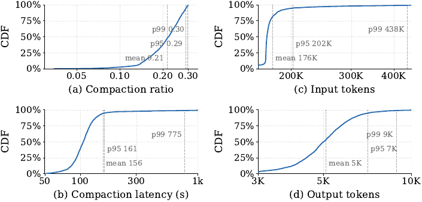

그림 22는 네 개의 경험적 CDF다. (a) Compaction ratio는 요약값 mean 0.21, p95 0.29, p99 0.30이 인쇄되어 있고, 가로축은 눈금 0.05·0.10·0.20·0.30의 간격이 고르지 않은 로그 축이다. 곡선에는 값이 인쇄되어 있지 않아 축에서 읽으면 0.10까지 거의 0에 붙어 있다가 0.15 부근에서 약 15%, 0.20에서 약 40%, 0.25에서 약 65%로 오르고 0.29 부근에서 약 90%에 이른 뒤 0.30 직전에 1.0이 된다. (b) Compaction latency (s)는 로그 축이며 mean 156, p95 161, p99 775가 인쇄되어 있고 꼬리가 약 775초 너머까지 뻗는다. (c) Input tokens는 200K·300K·400K 눈금 간격이 좁아지는 로그 축이며 mean 176K, p95 202K, p99 438K가 인쇄되어 있다. (d) Output tokens는 로그 축이며 mean 5K, p95 7K, p99 9K가 인쇄되어 있다.

35,037개 세션에서 3,170건의 압축 이벤트가 관측된다. 이벤트의 99%가 컨텍스트를 70% 넘게 줄이는데, 이는 프로덕션 컨텍스트의 상당 부분이 축어적 재생을 요구하기보다 압축 가능하다는 것을 가리킨다.

**보조 연산 세금.** 압축 자체가 공짜가 아니다. 이벤트 하나가 평균 176K 입력 토큰을 소비하고 5K 출력 토큰을 생성한다. 이전 prefix가 캐시에 남아 있으면 입력 토큰 대부분은 재계산을 피할 수 있지만, 압축된 요약을 만들어내는 데는 여전히 긴 decode가 필요하다. 3,170건 전체에서 압축 지연은 평균 156 s이고 p95와 p99가 각각 161 s와 775 s다. harness는 주 추론–행동 루프 바깥의 보조 태스크에도 LLM을 부른다 — 행동을 심사하는 안전 가드레일, 진전 없는 실행을 식별하는 루프 탐지 등이다. 압축을 제외한 이 보조 태스크들은 35,037개 세션에 걸쳐 도합 2,684회의 LLM 호출, 6.5M 입력 토큰, 50K 출력 토큰을 더한다.

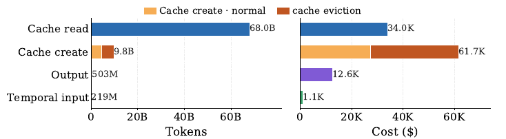

그림 23의 두 패널에는 값이 인쇄되어 있다. 왼쪽 Tokens에서 Cache read는 68.0B, Cache create는 normal과 cache eviction으로 나뉜 누적 막대로 합계 9.8B, Output은 503M, Temporal input은 219M이다. 오른쪽 Cost ($)에서 Cache read는 34.0K, Cache create는 같은 두 조각으로 나뉜 합계 61.7K, Output은 12.6K, Temporal input은 1.1K다.

**캐시 재prefill 세금.** 각 LLM 입력은 크지만 harness는 보통 이전 입력에서 키워 나가므로 prefix 연속성이 보존되어 서빙 엔진이 KV cache를 재사용할 수 있다. 그러나 긴 컨텍스트 KV 상태를 유지하는 것은 비싸서 프로덕션 캐시 항목에는 유한한 TTL이 걸린다 — 이 배포에서는 5분이다. TTL이 지나면 다음 호출이 축출된 prefix를 다시 prefill해야 한다. 이 고정 TTL은 사람의 속도로 흘러가는 에이전트 세션과 잘 맞지 않는다. 앞서 관측된 1~10분 유휴 구간이 TTL과 자주 겹치거나 그것을 넘긴다. 35,037개 세션 중 59.4%가 최소 한 번의 축출 이벤트를 겪는다. 총 토큰 사용량을 배포가 보고하는 네 범주 — *cache-read*, *cache-create*(KV cache가 캐시될 토큰), *temporal-input*(KV cache가 버려질 토큰), *output* — 로 나누고, Claude Opus 4.6 모델의 공표 가격(각각 \$0.5/MToks, \$6.25/MToks, \$5/MToks, \$25/MToks)으로 금전 비용 분해를 추정한다. 캐시 축출은 총 *cache-create* 토큰의 55.9%에 기여하고, 최종적으로 이 세션들의 총 금전 비용의 31.5%를 차지한다.

**함의.** 제어 평면 세금은 단순한 프롬프트 엔지니어링 문제가 아니라 계층을 가로지르는 시스템 문제다. 첫째, 도구 인터페이스가 *에이전트 네이티브* 여야 한다. 매 턴 전체 스키마와 날것의 출력을 다시 주입하는 대신, 도구는 안정적인 스키마 식별자, 타입이 있고 크기가 제한된 관측, 증분 델타, 전체 산출물로 가는 조회 가능한 핸들을 노출해야 한다. 그러면 harness는 현재 결정에 필요한 필드만 실체화해 토큰 볼륨과 prefill을 줄이면서도 정확한 상태를 컨텍스트 윈도 바깥에 보존할 수 있다. 둘째, 컨텍스트를 계층화된 상태로 가상화해야 한다. 구조화된 이력, 계층적 요약, 필요 시 조회하는 상세 정보가 차가운 관측을 프롬프트 밖에 두어, 한계 근처에서 한꺼번에 하는 압축을 대체할 수 있다. 셋째, harness와 모델 서버가 캐시 정책을 협응해야 한다. 고정 TTL 축출은 세션의 대기 상태와 예측된 복귀에 기반한 재사용 인지형 KV 유지·오프로드·프리페치에 자리를 내줘야 한다. 보조 호출도 목적별로 태깅해 서빙 시스템이 따로 회계하고, 정확성과 안전이 허락하는 한 배칭·캐싱하거나 더 저렴한 모델로 라우팅할 수 있게 해야 한다.

### 요청을 가로지르는 활용 가능한 중복

검색 기반 QA 에이전트는 사용자 요청마다 답하기 전에 웹 검색을 한 번 낸다. 141,376개 세션이 373,678회의 검색 호출을 만들고, 그 지연의 평균·중앙값·p90은 각각 1.349 s, 1.258 s, 1.708 s다. 검색은 세션 종단 지연의 중앙값 35%, 평균 52%를 차지한다. Openclaw 유사 사무 자동화 에이전트는 때때로 URL의 전체 내용을 가져온다. 최소 한 번의 fetch를 내는 2,386개 세션을 분석하면 4,389회의 fetch 호출이 있고 지연의 평균·중앙값·p90은 2.657 s, 1.482 s, 4.987 s다. fetch는 세션 지연의 중앙값 2.9%, 평균 6%를 차지한다.

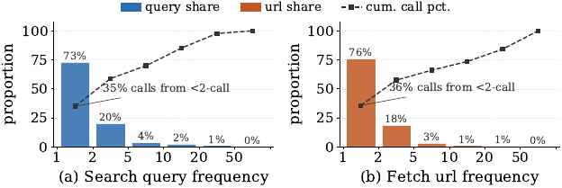

그림 24는 두 패널의 막대·선 혼합 그래프로, 막대에 값이 인쇄되어 있다. (a) Search query frequency에서 빈도 1, 2, 5, 10, 20, 50에 대한 query share가 73%, 20%, 4%, 2%, 1%, 0%이고, 누적 호출 비율 점선은 축에서 읽으면 각각 약 35%, 58%, 70%, 85%, 97%, 100%이며 "35% calls from <2-call" 주석이 인쇄되어 있다. (b) Fetch url frequency에서 url share가 76%, 18%, 3%, 1%, 1%, 0%이고, 누적 점선은 약 36%, 58%, 66%, 74%, 85%, 100%이며 "36% calls from <2-call" 주석이 붙어 있다.

24시간 트레이스 안에서 고유 검색 질의와 fetch된 URL의 호출 횟수를 세면, 고유 검색 질의의 27%가 세션을 가로질러 재발하고 이 재발 질의들이 전체 검색 호출의 67.3%를 차지한다. Openclaw 유사 에이전트에서는 고유 URL의 24%가 재발해 전체 fetch 호출의 64%를 차지한다. 즉 소수의 고유한 도구 입력이 외부 호출의 큰 몫을 만들어내며 반복적으로 지연을 더하고 네트워크 대역폭을 소모한다.

**함의.** 세션을 가로지르는 재사용은 공유된 도구 서빙 경계에서의 캐싱을 요구한다. 그 자리에서는 재사용이 한 세션 안에 숨지 않고 에이전트들을 가로질러 집계될 수 있다. 첫 계층은 정확한 질의–결과 매핑을 캐시하고, 둘째 계층은 URL fetch를 중복 제거해 가져온 객체(그리고 해당되면 그 파싱 표현)를 재사용한다. 이 메커니즘은 에이전트의 제어 로직을 바꿀 필요가 없다. 이 절의 결론은 **신선도(freshness)와 테넌시(tenancy)를 인지하는 공유 캐시**가 세션별 최적화로는 보이지 않는 지연과 비용을 상당히 걷어낼 수 있다는 것이다 — 결과가 얼마나 오래되었는지뿐 아니라 어느 테넌트의 것인지도 캐시가 함께 따져야 한다는 조건이 붙는다.

## 🚀 네 개의 설계 탐색

이들은 하나의 통짜 시스템을 이루는 구성요소가 아니라, 각각 워크로드를 모르는 베이스라인 대비 유의미한 이득을 보이는 독립적이고 특성 분석에 이끌린 개입이다.

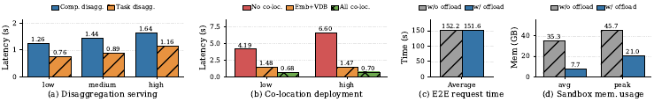

그림 25의 네 패널에는 값이 인쇄되어 있다. (a) Disaggregation serving은 low·medium·high 부하에서 Comp. disagg.가 1.26, 1.44, 1.64 s, Task disagg.가 0.76, 0.89, 1.16 s. (b) Co-location deployment는 low에서 No co-loc. 4.19, Embed+VDB 1.48, All co-loc. 0.68 s이고 high에서 6.60, 1.47, 0.70 s. (c) E2E request time은 평균이 w/o offload 152.2 s, w/ offload 151.6 s(그림에서 읽은 인쇄값). (d) Sandbox mem. usage는 avg가 w/o offload 35.3 GB, w/ offload 7.7 GB이고 peak가 45.7 GB와 21.0 GB다.

### 태스크 인지 서빙

같은 컴포넌트를 공유하는 태스크들이 입력 크기·지연·자원 풋프린트에서 몇 자릿수씩 다르므로, 이들을 단일 워커 풀에서 함께 서빙하면 HOL 블로킹과 성능 간섭이 생긴다. 태스크 분해 서빙은 각 논리 태스크(`embed-query`, `embed-doc`, `llm-judge` 등)를 전용 자원을 가진 독립 서비스로 배포해 성능 격리, 태스크별 최적화, 세분화된 독립 스케일링을 가능하게 한다.

Dynamic RAG에서 최대 처리량의 0.5$\times$, 0.7$\times$, 0.9$\times$에 해당하는 저·중·고 요청률로 평가하면, 같은 GPU 수를 쓰는 컴포넌트 공유 베이스라인 대비 평균 지연이 각각 40%, 38%, 29% 줄어든다. 개선은 주로 같은 임베딩·LLM 인스턴스를 공유하는 이질적 태스크 사이의 큐잉 지연과 간섭을 완화한 데서 온다.

### 통신 인지 배치

태스크 분해는 격리를 개선하지만 배치 문제를 낳는다. 각 태스크 유형을 순진하게 전용 머신에 배정하면 거대한 중간 상태 때문에 감당 못 할 네트워크 오버헤드가 생기고 이질적 하드웨어 수요 때문에 자원이 낭비된다. 통신 인지 코로케이션은 통신량이 많은 태스크(임베딩 모델과 벡터 DB)를 같은 서버에 두어 데이터 전송을 최소화하고, 자원 프로파일이 상보적인 태스크(GPU 바운드 LLM과 메모리 바운드 벡터 DB)를 짝지어 하드웨어 활용률을 올린다.

RAG를 다중 노드 클러스터에 배포해 세 배치 전략 — (1) `co-none`, 각 컴포넌트를 전용 서버에; (2) `co-vdb-embed`, 벡터 DB와 임베딩 태스크를 코로케이션; (3) `co-all`, 모든 태스크를 한 서버에 — 을 비교하면, 벡터 DB와 임베딩 태스크를 코로케이션하는 것만으로 평균 지연이 저부하와 고부하에서 각각 2.8$\times$, 4.5$\times$ 줄어든다. 상세 프로파일링은 `co-none` 베이스라인에서 네트워크 통신이 실행 시간의 67.5%를 차지하지만 코로케이션에서는 무시할 만해진다는 것을 확인해 준다.

### 상태 오프로딩

프로덕션 세션은 수명의 대부분을 유휴 상태로, 그러나 비싼 상태(샌드박스 환경, 터미널 컨텍스트, KV cache, 대화 이력)를 붙든 채 보낸다. 이 상태를 성급히 회수하면 재개 가능성이 깨질 위험이 있고, 할당된 채 두면 일시정지된 세션 수에 비례해 메모리가 낭비된다. 여기서 쓰인 통제 Mini-SWE 실험은 §7.1의 사람 속도 프로덕션 정지가 아니라 **컴포넌트 간** 유휴 구간을 겨냥한 관련 개념 증명이다. LLM 계획 호출이 도는 동안 샌드박스는 비활성이므로 다음 도구 단계까지 오프로드할 수 있다.

그림 12는 컨텍스트에 의존하는 prefill 기준선의 상승 추세를 보여주지만, 출력 길이와 새로 덧붙는 입력이 반복마다 흔들리므로 총 LLM 지연은 여전히 가변적이다. 그래서 이 프로토타입은 단조 지연을 가정하지도, 컨텍스트 길이를 지속 시간 예측자로 쓰지도 않는다. 대신 진행 중인 계획 호출의 경과 시간을 트리거로 삼아, 그 시간이 고정 임계값을 넘으면 샌드박스를 오프로드하고 다음 도구 단계로 제어가 돌아가기 전에 복원한다.

선제적 오프로딩은 평균·피크 메모리 소비를 각각 4.6$\times$, 2.1$\times$ 줄이면서 지연 증가는 0.5% 이내다. 이 메모리 막대는 이 Mini-SWE 실행에서 동시에 활성인 모든 샌드박스 프로세스의 총 상주 메모리를 보고하는 것이지 세션당 피크가 아니다. 따라서 그림 6(b)의 28 GB 세션당 워킹셋 피크와 직접 비교할 수 없다.

### 도구 결과 캐싱

이 중복은 에이전트 로직이나 도구 인터페이스를 전혀 고치지 않고도 쓸 수 있는 지렛대가 큰 캐싱 기회를 만든다. 두 계층 도구 결과 캐시를 §7.3의 프로덕션 트레이스로 평가한다. 첫 계층은 정확 질의 매칭으로, 들어온 검색 질의가 앞서 본 질의와 일치하면 캐시된 결과를 바로 돌려준다. 둘째 계층은 URL 수준 중복 제거로, 웹 fetch 요청의 대상 URL 내용이 설정 가능한 staleness 윈도 안에서 이미 가져와졌다면 캐시된 페이지 내용을 재사용한다.

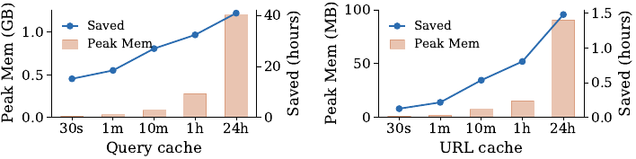

그림 26은 TTL(30s, 1m, 10m, 1h, 24h)에 따른 결과를 이중 축으로 그린다. 값이 인쇄되어 있지 않아 아래는 축에서 읽은 근사치다. 왼쪽 Query cache 패널에서 Peak Mem은 약 0.02, 0.03, 0.08, 0.28, 1.2 GB이고 Saved는 약 14, 18, 27, 32, 40시간이다. 오른쪽 URL cache 패널에서 Peak Mem 막대는 30s와 1m에서 보이지 않고 10m, 1h, 24h에서 약 8, 15, 90 MB이며, Saved는 약 0.1, 0.2, 0.5, 0.8, 1.5시간이다.

본문이 명시하는 값으로는, 10분 TTL에서 질의 캐시가 검색 기반 QA 에이전트의 중복 검색 호출 중 35.2%를 제거하며 집계 검색 지연 27시간(전체의 19.3%)을 아낀다. 마찬가지로 10분 TTL에서 URL 캐시는 Openclaw 유사 에이전트의 중복 웹 fetch 호출 중 11.65%를 제거하며 집계 fetch 지연 32분(전체의 16.5%)을 아낀다.

## ⚠️ 저자들이 인정한 한계

논문이 스스로 밝힌 제약은 흩어져 있지만 분명하다.

**프로덕션 연구는 통제 실험을 검증하지 않는다.** R4에서 저자들은 프로덕션 연구가 통제 실험을 직접 검증하는 것이 아니라, 배포 환경에서만 나오는 추가 동작을 드러냄으로써 보완한다고 명시한다.

**공유 자원 경합의 원인은 특정되지 않았다.** 샌드박스 실험은 공유 자원 경합이 존재한다는 사실을 확립할 뿐이고, 감속을 last-level cache 같은 특정 자원에 귀속시키려면 하드웨어 카운터 측정이 추가로 필요하다고 저자들은 적는다.

**28 GB는 워킹셋 피크지 체크포인트 대상 상태가 아니다.** 저자들은 이 값이 워킹셋 피크이며, 일시적인 컴파일러·테스트 페이지가 반드시 지속적 정확성 상태인 것도 아니고 전부가 계속 살아 있거나 정지 시점 체크포인트에 복사되어야 하는 것도 아니라고 못 박는다. 나아가 8.3절의 메모리 막대는 동시 활성 샌드박스 프로세스들의 총 상주 메모리이므로 그림 6(b)의 세션당 28 GB 피크와 직접 비교할 수 없다고 스스로 경고한다.

**상태 오프로딩 실험은 프로덕션 정지를 재현하지 않는다.** 저자들은 이 통제 Mini-SWE 실험이 §7.1의 사람 속도 프로덕션 정지가 이끄는 평가가 아니라 컴포넌트 간 유휴 구간에 대한 관련 개념 증명이라고 명시한다. 또한 그림 12에서 총 LLM 지연이 가변적이므로 단조 지연을 가정하거나 컨텍스트 길이를 지속 시간 예측자로 쓰지 않았다고 밝힌다.

**컨텍스트 분해가 "낭비"를 뜻하지는 않는다.** 모든 과거 토큰이 회피 가능한 것은 아니며, 그림 21의 분해는 제어 상태를 앞으로 나르는 데 필요한 컨텍스트 용량과 prefill 작업량을 정량화하는 것이라고 저자들은 적는다.

**설계 탐색은 개념 증명이다.** 네 개입은 통짜 시스템의 구성요소가 아니라 독립적인 개입이며, 이득이 완전한 시스템 최적화가 아니라 단순하고 특성 분석에 이끌린 메커니즘에서 나온다고 저자들은 밝힌다.

**비용 분해는 추정이다.** 그림 8은 공개 클라우드 가격 기준의 추정치이고, 그림 23의 금전 비용도 Claude Opus 4.6의 공표 가격을 써서 추정한 것이다.

## 🔎 노트 작성자의 관찰

여기부터는 논문이 하지 않은 말이고, 노트를 쓰며 눈에 띈 지점이다.

**프로덕션 트레이스 세 개의 신원과 서빙 조건이 명세되지 않았다.** 코딩 에이전트, 검색 기반 QA 에이전트, Openclaw 유사 에이전트는 세션 수와 하루라는 기간 외에 어떤 모델을 어떤 하드웨어에서 서빙했는지가 본문에 적혀 있지 않다. 논문 스스로 "서빙 스택이 불충분하게 명세되면 워크로드에 잘못 귀속된다"는 논지를 세웠으므로, 프로덕션 절의 관측이 그 기준을 어디까지 만족하는지는 본문만으로 판단하기 어렵다.

**"5 of 10"이라는 요약과 그림 4의 읽기가 정확히 맞물리는지는 본문이 밝히지 않는다.** 초록과 서론은 열 개 중 다섯 개에서 non-LLM이 지연을 지배하거나 공동 지배한다고 적지만, 어느 다섯 개인지는 열거되지 않는다. 본문이 값으로 명시하는 것은 GUIAgent(70% 초과)와 Pi-AutoR(90%) 둘뿐이다.

**같은 트레이스에 대한 두 배수(30$\times$와 171$\times$)의 관계가 설명되지 않는다.** 그림 11의 30$\times$는 LLM 호출 지연의 트레이스 내 변동이고 그림 12의 171$\times$는 샌드박스 호출의 최대/최소 비인데, 이 둘이 같은 실행에서 나온 것인지 다른 실행에서 나온 것인지 본문은 관계 짓지 않는다.

**Table 1과 Table 2의 애플리케이션 이름이 일부 어긋난다.** Table 1은 AI search 항목을 DeepResearch로, Table 2는 같은 자리를 OpenDR로 적고, 본문은 DeepResearch와 OpenDR을 뒤섞어 쓴다. Table 2의 WebAgent 인용도 Chezelles and others (2024)인 반면 Table 1은 Research (2025)를 단다. 이것이 같은 대상의 다른 표기인지 본문은 명시하지 않는다.

**설계 탐색의 이득 수치들이 서로 다른 워크로드에서 나온 것이다.** 태스크 분해는 Dynamic RAG, 통신 인지 배치는 RAG, 상태 오프로딩은 Mini-SWE, 도구 결과 캐싱은 프로덕션 트레이스에서 각각 측정됐다. 초록과 결론은 이 넷을 한 줄에 나열하지만, 하나의 시스템에서 함께 얻어진 수치가 아니다.

**그림 26의 "Saved"와 8.4절의 서술 사이에 축 단위 대응이 있다.** 10분 TTL의 질의 캐시가 27시간을 아낀다는 본문 값은 그림 26 왼쪽 패널의 10m 지점 읽기(약 27시간)와 맞아떨어지지만, URL 캐시의 32분은 오른쪽 패널의 10m 지점 읽기(약 0.5시간)에 대응한다. 그림에서 읽은 값과 본문 값을 혼동하지 않도록 여기 적어 둔다.
