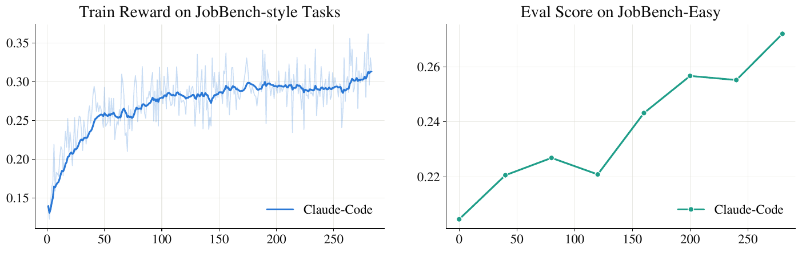
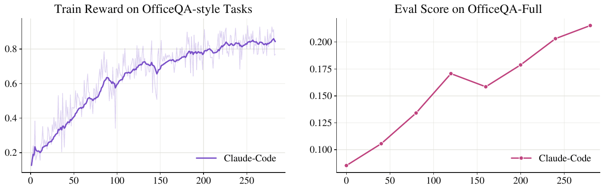
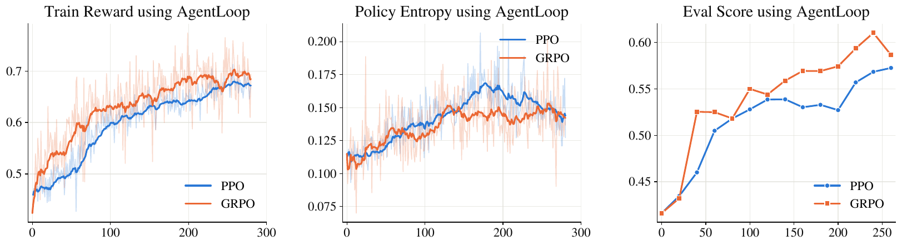

# 🖇️ClawGym II: 에이전트 하네스 위에서의 블랙박스 RL 탐구

## 🎯 하네스가 좋아져도 모델이 그걸 못 쓰면 소용없다

에이전트 하네스는 자율 에이전트 시스템의 기반 운영 계층으로 자리 잡아, 대규모 언어 모델과 환경 사이의 상호작용을 과제 해결 전 과정에 걸쳐 조율한다. 하네스는 보통 시스템 프롬프트, 도구 인터페이스, context 관리, 워크플로 오케스트레이션, 재시도·복구 메커니즘을 하나의 런타임으로 통합한다. Claude Code, Codex, OpenClaw 같은 프로덕션 급 시스템은 잘 설계된 하네스가 복잡한 long-horizon 과제에서 에이전트 성능을 크게 끌어올릴 수 있음을 보여 준다.

하네스가 강력해지면서 소프트웨어 엔지니어링, 오피스 애플리케이션, AI 어시스턴트 워크플로, MCP 기반 도구 사용에 이르는 실제 워크스페이스 전반에서 동작하는 범용 자율 에이전트의 개발이 가속되고 있다. 최근의 진전은 주로 하네스 설계·최적화·자기진화 같은 추론 쪽 발전에서 나왔다. 그러나 하네스가 강력해진 이득은 설계만이 아니라 밑에 있는 모델이 그 하네스를 얼마나 잘 활용하느냐에도 달려 있다. 강한 모델이라도 적절히 학습되지 않았다면 뛰어난 하네스 안에서 부진할 수 있고, 그래서 모델이 하네스를 더 잘 활용하도록 만드는 노력 — 보통 강화학습(RL) 알고리즘을 통한 — 이 필요해진다.

현대 하네스의 결정적 특성은 내재된 복잡성이다. 설계와 구현이 충분히 복잡하기 때문에, 하네스를 대상으로 하는 RL 학습 알고리즘은 순수 텍스트 환경이나 단순한 환경에서 쓰던 것과 상당히 달라질 수 있다. 단순한 single-turn이나 경량 에이전트 세팅에서는 상호작용 과정이 명시적이고 직접 관측 가능해서, 복잡한 은닉 실행 로직을 고려하지 않고도 잘 정의된 모델 trajectory를 최적화할 수 있다. 반면 현대 하네스에서는 내부 제어 흐름과 실행 로직을 불투명한 것으로 취급하고 블랙박스 RL 알고리즘을 설계하는 것이 주류 접근이다. 실제로 블랙박스 RL은 범용 에이전트를 위한 강력한 하네스를 개발하고 활용하는 핵심 기술적 초석이 되었다. 그럼에도 그런 하네스를 통한 범용 에이전트 과제의 안정적이고 확장 가능한 정책 최적화는 기존 문헌에서 상대적으로 덜 탐구되어 있다. 이 논문이 던지는 연구 질문은 하나다. **하네스를 통과하는 블랙박스 RL로 범용 에이전트를 어떻게 안정적으로 최적화할 수 있는가?**

이 질문은 세 가지 근본 난제로 나뉜다. 첫째, **블랙박스 RL을 위한 확장 가능하고 안정적인 인프라**다. 범용 에이전트 과제는 RL 중에 전용의 stateful한 환경을 요구하고, 대규모 동시 rollout은 실행 인프라에 상당한 부담을 준다. long-horizon 과제에서는 런타임 지연과 실패가 상호작용 단계마다 누적되어 trajectory 전체를 무효화할 수 있어, 대규모로 적시에 신뢰할 수 있는 데이터를 생성하기 어렵다. 둘째, **파편화된 블랙박스 trace로부터의 효율적·효과적 정책 최적화**다. 블랙박스 하네스는 완결된 상호작용 trajectory가 아니라 파편화되고 분기하며 종종 중복되는 모델 호출을 노출하므로, 이 trace를 RL에 그대로 쓰기 어렵다. 게다가 불투명한 내부 연산은 training–inference 불일치를 더 증폭시켜 학습을 불안정하게 만들 수 있다. 셋째, **이종 하네스 간 확장성**이다. 하네스마다 상호작용 프로토콜, 도구 인터페이스, context 관리, 실행 워크플로가 크게 다르다. 실용적인 프레임워크라면 특정 실행 시스템 하나에 정책을 최적화하는 대신, 시스템별 개조를 최소화하면서 다양한 하네스를 지원하고 그들 사이의 통합 학습을 가능케 해야 한다.

## 🧩 과제와 하네스의 형식화

범용 에이전트 과제는 사용자 지시와, 그 과제가 실행되는 격리된 stateful 환경으로 구성된다. 환경은 워크스페이스로부터 초기화되며 파일, 디렉터리, 문서, 소프트웨어 저장소, 실행 중인 서비스 등 과제별 자원을 포함하는 실행 컨텍스트를 제공한다. 에이전트는 웹 검색, 파일 편집, 코드 실행, 셸 명령, API 호출 같은 외부 도구를 통해 여러 turn에 걸쳐 환경과 상호작용하며 상태를 목표 쪽으로 점진적으로 변형시킨다. 결과는 최종 환경 상태에 반영되는데, 보통 생성된 산출물(문서, 프레젠테이션, 리포트 등)이거나 성공적으로 완료된 조작(저장소 수정, 시스템 설정 등)이다. 과제는 $q=(u,\mathcal{W}_{0})$로 표기하며 $u$가 사용자 지시, $\mathcal{W}_{0}$가 초기 워크스페이스이고, $\mathcal{E}_{q}$는 $\mathcal{W}_{0}$에서 초기화된 실행 환경, 과제는 $q\sim\mathcal{D}$로 샘플링된다.

실행 중 에이전트는 관측과 행동을 번갈아 수행하며 trajectory를 만든다.

$$\tau=(o_{1},a_{1},\ldots,o_{T},a_{T}),$$

여기서 $o_{t}$는 $t$ 단계의 관측, $a_{t}$는 대응하는 에이전트 행동이다. 상호작용은 과제가 완료되거나 실행이 멈출 때 종료되며 최종 워크스페이스 상태 $\mathcal{W}_{T}$를 남긴다. 이 최종 상태를 평가해 rollout 수준의 보상을 얻는다.

실제 과제 평가는 보통 두 패러다임을 따른다. rule-based 보상은 단위 테스트, 프로그램 실행, exact-match 검증 같은 결정론적 절차로 최종 워크스페이스의 정확성을 검증한다. rubric-based 보상은 더 강한 평가자(예: LLM-as-a-Judge)에 의존해 과제별 평가 기준에 따라 생성 산출물이나 최종 워크스페이스의 전반적 품질을 평가한다.

현대의 범용 에이전트는 OpenClaw, Claude Code, Codex 같은 성숙한 하네스를 통해 배포되는 경우가 늘고 있다. 표준 ReAct 패러다임에 기반한 전통적 수작업 에이전트 루프와 비교하면, 이런 하네스는 언어 모델과 외부 워크스페이스 사이에 훨씬 풍부한 실행 추상을 제공한다. 도구 오케스트레이션, context 관리, 내장 스킬, subagent 위임, 실패 복구를 하나의 런타임 시스템으로 통합해, 저수준 실행 세부를 모델로부터 추상화하면서도 훨씬 복잡한 long-horizon 과제를 풀게 한다.

이 실행 패러다임에서 모델은 더 이상 워크스페이스와 직접 상호작용하지 않는다. 모델 행동 $a_{t}$가 주어지면 하네스가 해당 도구를 실행하고 워크스페이스와 실행 컨텍스트를 갱신한 뒤 다음 결정을 위한 처리된 관측을 반환한다. 이 상호작용은 다음처럼 추상화된다.

$$(\mathcal{W}_{t+1},\,o_{t+1},\,c_{t+1})=\mathcal{H}(\mathcal{W}_{t},\,c_{t},\,a_{t}),$$ (1)

여기서 $\mathcal{H}$는 하네스, $\mathcal{W}_{t}$는 워크스페이스 상태, $c_{t}$는 유지되는 실행 컨텍스트, $o_{t+1}$은 모델에 반환되는 관측이다. 따라서 상호작용 trajectory는 모델 단독이 아니라 모델과 하네스가 함께 결정하며, 이 점이 하네스를 현대 long-horizon 에이전트 시스템의 근본 실행 추상으로 만든다.

## 📐 배경이 되는 RL 알고리즘: PPO와 GRPO

명시적 value 모델에 의존하는지로 구분되는 두 주류 RL 패러다임을 다룬다. critic 기반인 PPO와 critic-free인 GRPO다. 이하에서 상태 $s_{t}$는 행동 $a_{t}$에 선행하는 상호작용 이력 $(o_{1},a_{1},\dots,o_{t})$를 가리키며, 정책 $\pi_{\theta}(a_{t}\mid s_{t})$와 가치 함수 $V_{\phi}(s_{t})$는 모두 이 이력 위에 정의된다.

PPO는 상태-가치 함수를 추정하는 보조 value 모델 $V_{\phi}(s)$와 함께 정책 모델 $\pi_{\theta}(a|s)$를 최적화한다. 환경이 생성한 토큰과 무효 토큰을 정책 최적화에서 배제하기 위해 이진 마스크 $M_{t}\in\{0,1\}$를 적용한다. 마스킹된 clipping 목적함수는 다음과 같다.

$$\mathcal{L}_{\text{PPO}}(\theta)=\hat{\mathbb{E}}_{t}\left[M_{t}\cdot\min\left(\rho_{t}(\theta)\hat{A}_{t},\,\text{clip}\bigl(\rho_{t}(\theta),1-\epsilon,1+\epsilon\bigr)\hat{A}_{t}\right)\right],$$ (2)

여기서 $\rho_{t}(\theta)=\frac{\pi_{\theta}(a_{t}\mid s_{t})}{\pi_{\theta_{\text{old}}}(a_{t}\mid s_{t})}$는 토큰 수준 정책 확률비이고, $M_{t}=1$은 유효한 정책 생성 토큰, $0$은 그 외를 가리킨다.

같은 마스크를 GAE에도 넣어 무효 위치가 시간적 credit assignment에 기여하지 못하게 한다.

$$\hat{A}_{t}=\sum_{l=0}^{\infty}(\gamma\lambda)^{l}\delta_{t+l}\cdot M_{t+l},$$ (3)

여기서 $\delta_{t}=r_{t}+\gamma V_{\phi}(s_{t+1})M_{t+1}-V_{\phi}(s_{t})$는 시간차 잔차다. critic 네트워크는 마스킹된 평균제곱 손실을 최소화해 최적화한다.

$$\mathcal{L}_{\text{Value}}(\phi)=\hat{\mathbb{E}}_{t}\left[M_{t}\cdot\left(V_{\phi}(s_{t})-G_{t}\right)^{2}\right],$$ (4)

여기서 $G_{t}$는 마스킹된 할인 return이다.

GRPO는 별도 value 모델 $V_{\phi}(s)$의 메모리 부담과 학습 복잡도를 피하기 위해, 샘플링된 rollout 그룹에 상대적으로 advantage를 추정한다. 주어진 과제 $q$에 대해 정책 모델 $\pi_{\theta}$가 $G$개의 독립 trajectory $\{\tau_{1},\tau_{2},\dots,\tau_{G}\}$와 대응 보상 $\{R_{1},R_{2},\dots,R_{G}\}$를 만들면, $i$번째 trajectory의 advantage $\hat{A}_{i}$는 그룹 보상으로부터 직접 계산된다.

$$\hat{A}_{i}=\frac{R_{i}-\mu_{q}}{\sigma_{q}+\varepsilon},\qquad\mu_{q}=\frac{1}{G}\sum_{j=1}^{G}R_{j},\qquad\sigma_{q}=\sqrt{\frac{1}{G}\sum_{j=1}^{G}\left(R_{j}-\mu_{q}\right)^{2}}.$$ (5)

위의 토큰 수준 마스크와 정책비를 trajectory 인덱스를 붙여 재사용하면, 마스킹된 GRPO 목적함수는 다음과 같다.

$$\displaystyle\mathcal{L}_{\text{GRPO}}(\theta)=\frac{1}{G}\sum_{i=1}^{G}\frac{1}{\sum_{t=1}^{|\tau_{i}|}M_{i,t}}\sum_{t=1}^{|\tau_{i}|}M_{i,t}\Big[$$ $$\displaystyle\min\big(\rho_{i,t}(\theta)\hat{A}_{i},\,\operatorname{clip}\big(\rho_{i,t}(\theta),1-\epsilon,1+\epsilon\big)\hat{A}_{i}\big)$$ (6)

$$\displaystyle-\beta\mathbb{D}_{\mathrm{KL}}\left(\pi_{\theta}(\cdot\mid s_{i,t})\|\pi_{\mathrm{ref}}(\cdot\mid s_{i,t})\right)\Big].$$

여기서 $M_{i,t}$와 $\rho_{i,t}$는 각각 $M_{t}$, $\rho_{t}$의 trajectory 인덱스 버전이다. $\pi_{\text{ref}}$는 정책 drift를 제약하는 reference policy이고 $\mathbb{D}_{\text{KL}}$은 KL divergence다.

## 🏗️ 아이디어: 하네스는 손대지 않고 서빙 경계에서만 관측한다

이 논문의 블랙박스 RL 정식화는 수정되지 않은 불투명한 에이전트 하네스를 통해 학습 대상 모델을 직접 최적화하면서, 정책 최적화를 하네스 실행으로부터 분리한다.

### 🧱 확장 가능한 블랙박스 실행 인프라

범용 에이전트 과제의 블랙박스 RL은 전용 stateful 환경을 대규모로 동시에 실행해야 한다. stateless 생성과 달리 각 rollout은 여러 상호작용 단계에 걸쳐 파일, 프로세스, 도구 상태, 기타 과제별 자원을 변경할 수 있으므로 격리 실행이 필수다. 각 과제 $q$에 대해 초기 워크스페이스 $\mathcal{W}_{0}$로부터 과제별 환경을 초기화하고 선택한 하네스를 임시 sandbox 안에서 띄운다. sandbox는 격리된 워크스페이스와 하네스가 요구하는 런타임 의존성을 제공해, 동시 실행되는 rollout끼리 간섭하지 않게 한다. 각 sandbox는 rollout 시작 시 프로비저닝되고 완료 후 해제되므로, 실행 규모는 가용 sandbox 용량만큼 확장된다. 과제 상태를 격리하는 것에 더해, 각 sandbox는 rollout 중 필요한 외부 역량도 제공한다. 선택한 하네스가 기본 제공하는 도구 외에, 웹 검색 같은 공통 역량과 과제별 도구는 sandbox 안에서 띄운 MCP(Model Context Protocol) 서버로 노출한다. 표준화된 MCP 인터페이스가 실행 내내 이 서비스들에 대한 신뢰할 수 있는 접근을 보장하고, 하네스의 네이티브 워크플로를 수정하지 않고도 새 역량을 붙일 수 있게 한다.

정책 최적화와 하네스 실행은 분리된다. training engine이 정책 최적화를 담당하고, inference engine이 rollout 동안 현재 정책을 서빙한다. 하네스 자신은 sandbox 안에서 상호작용을 주도하며 도구 사용, context 관리, 재시도, 환경 상호작용의 통제권을 유지한다. 이 분리 덕분에 하네스별 제어 흐름을 학습 파이프라인에 다시 구현할 필요가 없고, 서로 다른 블랙박스 하네스를 최소한의 개조로 통합할 수 있다.

하네스의 내부 제어 흐름에는 접근할 수 없지만, 모델 서빙 경계에서는 모델 동작이 여전히 관측 가능하다. 모델이 생성한 모든 행동은 이 경계를 넘는 모델 요청을 통해 만들어지기 때문이다. 그래서 이 경계에 serving proxy를 놓아 하네스가 사용하는 모델 엔드포인트로 삼는다. proxy는 요청마다 현재 rollout 정책을 호출하고, 하네스가 기대하는 프로토콜로 생성 응답을 반환하며, 정확한 입력 토큰·생성 토큰·rollout log-probability·관련 과제 메타데이터를 기록한다. 이 경계 수준 포착이 하네스 내부 로직을 계측하지 않고도 최적화에 필요한 모델 측 정보를 제공한다.

그림 1은 프레임워크 전체를 두 덩어리로 보여 준다. 왼쪽 "I. Inference"에서는 sandbox 안에 불투명한 하네스(OpenClaw 또는 ClaudeCode)와 워크스페이스(파일·자원 등)가 들어 있고, 하네스가 Proxy와 request/response를 주고받는다. Proxy는 모든 상호작용 $\{x_i, y_i\}$를 기록하고, 그 아래 Trajectory Assembly 블록에서 Prefix Tree를 만들어 Trajectories로 펼친다. 오른쪽 "II. Training"에서는 Verification 블록이 Final Workspace를 Verifier에 넣어 보상을 얻고, Trajectory와 Reward가 Policy Optimization으로 들어가 PPO/GRPO RL Update를 거쳐 Updated Policy가 되며, 이것이 다시 Inference 쪽으로 돌아간다. 그림 오른쪽 패널 A(Prefix Tree Construction)는 Virtual Root 아래 Main SP, Subagent SP, Compaction SP 세 갈래를 그려 Main SP 계열만 Kept(색칠된 노드), 나머지는 Discarded(빈 노드)임을 점선/실선으로 구분하고, Main SP 아래에는 "Before Compaction"과 "After Compaction" 분기를 표시한다. 패널 B(Trajectory Extraction and Filtering)는 필터링 세 가지 — 1. Dead Leaves, 2. Aux Trajectories, 3. Over-Branching — 를 작은 트리 그림으로 나열한다.

각 rollout은 sandbox 안에서 과제 환경과 하네스를 띄우고, 이후 모든 모델 요청이 serving proxy를 지난다. 완료 시 verifier가 최종 워크스페이스 상태를 평가해 rollout 수준 보상을 만든다. 포착된 모델 호출 기록과 보상이 학습 파이프라인으로 넘어가 학습 가능한 multi-turn trajectory로 재구성되고, training engine이 정책 모델을 갱신한 뒤 다음 반복을 위해 파라미터를 inference engine에 동기화한다.

### 🌳 prefix tree로 파편화된 호출을 다시 엮기

블랙박스 rollout 중 포착된 모델 호출은 파편화되어 있고, 분기하며, 중복일 수 있다. 이들을 독립적으로 최적화하면 long-horizon 상호작용 구조가 파괴되고, 연속된 호출들에 걸쳐 반복 등장하는 공유 이력 위에서 거듭 학습하게 된다. 그래서 각 rollout에서 포착된 모델 호출을 *rollout 수준 prefix tree*로 조직해 공유 상호작용 구조를 복원하고, 이것을 정책 최적화가 수행되는 학습 표현으로 삼는다.

구체적으로, 한 rollout이 모델 호출 $\mathcal{C}=\{(x_{i},y_{i})\}_{i=1}^{m}$를 낳는다고 하자. $x_{i}$는 $i$번째 호출의 입력 context, $y_{i}$는 대응하는 모델 응답이다. 끊기지 않은 상호작용 구간 안에서는 나중 입력이 앞선 호출이 만든 이력을 연장한다. context compaction이나 subagent 실행은 짧아지거나 대체된 context에서 새 구간을 시작할 수 있고, 이후 호출들은 새로 만들어진 이력을 이어 나간다. 초기 과제 프롬프트를 루트로 하는 트리 $T$를 만들고, 각 호출을 그 누적 이력이 $x_{i}$의 가장 긴 prefix를 이루는 기존 노드에 붙인다. 자식 호출의 입력을 누적된 부모 이력 및 기록된 부모 응답과 비교함으로써, 하네스가 끼워 넣은 비-모델 내용(도구 출력과 그 밖의 환경 피드백)도 복원한다.

leaf는 뒤따르는 어떤 호출도 연장하지 않는 호출이며, 각 root-to-leaf 경로가 후보 multi-turn trajectory를 정의한다. 성숙한 하네스는 context 관리나 subagent 스케줄링을 통해 현재 갈래를 잇는 대신 새 상호작용 분기를 시작하면서 여러 leaf를 만들 수 있다. 공유 상호작용 이력을 공통 트리 노드로 표현함으로써, prefix tree는 각 공유 prefix를 한 번만 저장하면서 서로 다른 연장은 별개 분기로 보존한다.

### ✂️ 어떤 trajectory를 버리는가

유효한 leaf에서 루트까지 되짚으면 후보 multi-turn 학습 trajectory가 복원되지만, 모든 leaf가 주 과제 해결 과정의 완료에 대응하지는 않는다. 어떤 것은 오류 처리, context 관리, subagent 과정에서 생긴다. 세 가지 필터를 건다.

**dead leaf 제거.** inference 서버가 요청을 재시도하거나, OpenClaw가 잘못된 형식의 tool call 이후 그러듯 하네스가 무효 응답을 재생성하면, 한 turn이 여러 번 생성될 수 있다. 대체된 시도들은 이후 연장을 받지 못한 채 prefix tree에 dead leaf로 남는다. 후보 trajectory들을 context-compaction 지점으로 구분되는 상호작용 구간으로 분할하고, 각 구간 안에서 가장 긴 유효 연장을 가진 leaf를 남긴다. 재시도로 생긴 dead leaf에서 끝나는 더 짧은 형제 trajectory는 버린다.

**과분기 과제 폐기.** 한 rollout의 prefix tree가 지나치게 많은 leaf로 분기하면, 그 rollout은 정당한 상호작용 분기가 아니라 반복 생성이나 실패 생성에 빠진 경우가 대부분이고 결과 trajectory는 학습 신호로서 쓸모가 거의 없다. leaf 수가 사전 설정 임계값을 넘으면 해당 rollout을 폐기한다. 적은 양의 데이터를 희생해 손상된 신호가 gradient 업데이트에 들어오는 것을 막는 선택이다.

**보조 trajectory 배제.** subagent와 compaction trajectory는 하네스 안에서의 역할이 주 과제 해결 trajectory와 다르고 그 기여가 rollout 수준 과제 보상과 직접 정렬되지 않으므로 배제한다. 동일한 terminal 보상을 이런 보조 상호작용에 뿌리면 모호한 credit assignment와 잡음 섞인 최적화 신호가 생겨 학습을 불안정하게 만들 수 있다. 그래서 main-agent trajectory만 최적화하고, 보조 상호작용의 효과적 활용은 향후 과제로 남긴다.

### 🔀 트리 구조 위에서의 정책 최적화

prefix tree를 만들고 무효 leaf를 걸러낸 뒤에도, 한 rollout은 상호작용 이력의 일부를 공유하는 여러 유효 root-to-leaf trajectory를 남길 수 있다. 이들을 하나의 trajectory로 합치는 대신 다중 trajectory 구조를 유지한 채 복원된 트리 위에서 정책을 최적화한다. 각 rollout은 최종 워크스페이스 상태를 근거로 한 번만 평가되므로, 같은 rollout에서 복원된 모든 trajectory는 동일한 terminal 보상을 물려받는다. 최적화 시 남은 모든 trajectory가 복원된 트리 위 정책 손실에 함께 기여한다. 분기별 연장 위의 학습 가능한 토큰 노드는 정상적으로 포함되지만, 공유 prefix의 노드는 rollout당 한 번만 계산되어 더 많이 분기한 rollout이 불균형하게 큰 최적화 가중치를 받는 일을 막는다.

형식적으로 과제 $q$의 $n$개 rollout을 $\{g_{1},\dots,g_{n}\}$라 하고, rollout $g_{i}$는 trajectory $\{\tau_{i,1},\dots,\tau_{i,m_{i}}\}$를 담으며 이들 사이에 공유되는 terminal 보상 $R_{i}$를 배정받는다. 핵심 개조는 rollout 수준 보상 의미론을 보존하면서, 같은 블랙박스 rollout에서 재구성된 모든 trajectory가 정책 최적화에 기여하도록 하는 것이다.

**GRPO의 advantage 추정.** GRPO는 이 구조를 자연스럽게 수용한다. 같은 과제에 대한 rollout 그룹으로부터 advantage를 추정하며 value 모델이 필요 없기 때문이다. 그룹을 $q$의 $n$개 rollout으로 잡고 각 rollout의 보상을 그룹 통계로 정규화한다.

$$\hat{A}_{i}\;=\;\frac{R_{i}-\mu_{q}}{\sigma_{q}+\varepsilon},\qquad\mu_{q}=\frac{1}{n}\sum_{j=1}^{n}R_{j},\qquad\sigma_{q}=\sqrt{\frac{1}{n}\sum_{j=1}^{n}\left(R_{j}-\mu_{q}\right)^{2}},$$ (7)

여기서 $\varepsilon$은 0으로 나누는 것을 막는다. advantage $\hat{A}_{i}$는 rollout당 한 번 계산되어 $g_{i}$에 남은 trajectory들이 덮는 모든 학습 가능 토큰 노드에 배정되고, 공유 prefix의 토큰은 손실에 한 번만 기여한다.

**PPO의 advantage 추정.** PPO는 토큰 수준 advantage 추정을 위해 추가 value 모델 $V_{\phi}$를 쓰고 정책과 value 모델을 함께 최적화한다. 분기된 trajectory들 사이의 의존성을 완전히 모델링하려면 복원된 트리 구조 위에서 더 복잡한 credit assignment가 필요하다. 그래서 같은 rollout 안의 trajectory들을 독립적으로 취급하는 단순화된 PPO 변형을 채택하고, $\gamma=1$, $\lambda=1$로 둔다.

구체적으로 각 trajectory $\tau_{i,j}$는 자신의 마지막 토큰에서 소속 rollout에 배정된 보상 $R_{i}$를 받고 독립적으로 GAE backup을 수행한다. 형제 trajectory를 잇는 분기점을 가로질러 advantage 신호가 전파되지는 않는다. 이 설정에서 표준 GAE 재귀는 다음으로 축약된다.

$$\hat{A}_{t}=R_{i}-V_{\phi}(s_{t}),$$ (8)

즉 advantage는 최종 보상과 현재 상태의 value 추정에만 관계된다. 이 단순화는 value 모델이 중간 상태로부터 long-horizon return을 추정하도록 요구하며, 시간 할인이 적용되지 않으므로 advantage 분산을 키울 수 있다. 분기 trajectory에 대한 더 원칙적인 처리는 향후 과제로 남긴다.

### 🔒 training–inference 일관성

RL 중 정책 모델은 rollout 때 생성된 바로 그 토큰 열 위에서 학습되어야 하며, training engine에 제시되는 열이 정책이 실제로 샘플링한 열과 일치해야 한다. 블랙박스 세팅에서는 tool-call 정규화나 assistant 메시지 재직렬화 같은 하네스 측 변환이 모델 출력의 표현을 이후 상호작용에 다시 들어가기 전에 바꿀 수 있어 이 요구가 까다로워진다. 복원된 root-to-leaf trajectory를 단순히 재토큰화하면 하네스가 변형한 모델 응답이 인코딩되어, 원래 rollout에서 샘플링된 것과 다른 토큰 열이 나올 수 있다.

학습되는 열을 생성된 열과 동일하게 유지하기 위해, 모든 모델 호출에 대해 두 개의 분리된 뷰를 유지하는 *black-box token-in-token-out* 규율(Gallouédec and Rasul (2026))을 채택한다. inference engine이 생성한 토큰이 prefix tree에 그대로 접붙여져 학습 데이터의 유일한 출처가 되고, 하네스가 받는 구조화된 텍스트는 그 동일한 토큰에서 디코딩되어 오직 하네스가 행동하기 위한 용도로만 쓰이며 학습 trajectory로 다시 인코딩되지 않는다. tool call이 완료되면 그 결과인 환경 응답이 다음 모델 요청에 제시되는 그대로의 토큰 열로 인코딩되어 prefix tree에 덧붙는다. 두 뷰는 서로 다른 소비자를 섬긴다. 하네스는 디코딩된 텍스트로 상호작용을 이끌고, 학습은 생성된 토큰을 문자 그대로 읽는다. 하네스가 표시하고 이후 turn에 먹이는 것을 어떻게 재포맷하거나 표준화하든 그 편집은 자기 뷰에만 머물고 토큰 기록을 교란할 수 없으므로, training engine에 넘겨지는 열은 구성상 정책 모델이 샘플링한 열과 동일하다.

토큰 열이 정확한 것만으로는 부족하다. 어떤 토큰이 샘플링될 때의 확률과 학습 시점에 그 토큰에 귀속되는 확률이 다를 수 있기 때문이다. inference engine은 rollout 정책 $\pi_{\text{rollout}}$을 실현하며 샘플링된 각 토큰의 로그 확률을 기록하는 반면, training engine은 다른 수치 정밀도·커널·병렬화 하에서 별도의 forward pass로 토큰 확률을 재계산하며 이를 $\pi_{\text{old}}$로 표기한다. 같은 prefix 하의 같은 토큰이라도 두 확률은 다를 수 있다.

$$\pi_{\text{rollout}}(a_{t}\mid s_{t})\;\neq\;\pi_{\text{old}}(a_{t}\mid s_{t}).$$ (9)

이 불일치를 무시하면 gradient 추정량에 off-policy 편향이 들어간다. 남은 불일치를 완화하기 위해 importance-sampling rollout correction(Yao et al. (2025))을 적용한다. 원칙적으로는 sequence 수준 importance ratio가 비편향 추정량을 주지만 긴 trajectory에서 분산이 클 수 있다. $\pi_{\text{rollout}}$과 $\pi_{\text{old}}$ 사이의 불일치가 대체로 작으므로, 추정 편향을 감수하고 더 낮은 분산을 택해 토큰 수준 importance-sampling ratio를 쓴다. 구체적으로 각 학습 토큰의 손실을 다음으로 스케일한다.

$$w_{t}\;=\;\min\!\big(\exp\!\big(\log\pi_{\text{old}}(a_{t}\mid s_{t})-\log\pi_{\text{rollout}}(a_{t}\mid s_{t})\big),\;\bar{c}\big),$$ (10)

여기서 $\log\pi_{\text{rollout}}$은 rollout 시점에 inference engine이 기록하고, $\log\pi_{\text{old}}$는 정책 갱신 전에 training engine이 재계산하며, 절단 임계값 $\bar{c}$가 이상치 비율에서 오는 분산을 제한한다.

### 🧬 mix-harness training

하네스마다 상호작용 프로토콜, 도구 인터페이스, context 관리 전략, 제어 흐름이 크게 다를 수 있다. 이 프레임워크는 각 하네스를 동일한 모델 서빙 경계와 동일한 복원 trajectory 표현에 연결하므로, 밑에 있는 정책 최적화 절차를 바꾸지 않고도 서로 다른 하네스를 하나의 학습 파이프라인에 쉽게 통합할 수 있다.

다만 고정된 하네스 하나로만 학습하면 정책이 그 하네스의 도구 사용 관례, context 관리 전략, 실행 워크플로에 특화될 수 있다. 그런 특화는 같은 과제를 다른 상호작용 패턴을 가진 하네스로 실행할 때 더 넓은 일반화를 제한할 수 있다. 그래서 여러 이종 하네스에서 나온 rollout으로 하나의 공유 정책을 같은 학습 run 안에서 함께 최적화하는 *mix-harness training*을 도입한다.

환경 $\mathcal{E}_{q}$를 가진 각 과제 $q$에 대해, 서로 다른 호환 하네스 $H_{k}$와 짝지어 별개의 학습 인스턴스 $(q,\mathcal{E}_{q},H_{k})$를 구성한다. 환경이 과제로부터 유일하게 결정되므로 각 인스턴스를 task–harness pair라 부른다. 서로 다른 하네스에 속한 인스턴스는 각 학습 batch 안에서 무작위로 섞이고 공유 학습 파이프라인을 통해 함께 처리된다.

추가로 고려할 주된 지점은 rollout 그룹 구성이다. 그룹 기반 advantage 추정에서는 그룹 안의 rollout이 서로 비교 가능해야 한다. 그래서 최적화 그룹을 과제 단독이 아니라 task–harness pair로 정의한다. 같은 과제의 서로 다른 하네스 rollout이 같은 batch에 나타날 수는 있지만, advantage는 분리된 task–harness 그룹 안에서 정규화된다. 이것이 하네스에 의존하는 상호작용 패턴과 보상 분포가 상대적 advantage 추정을 왜곡하는 일을 막으면서, 모든 그룹이 공유 정책을 함께 갱신하게 한다.

개별 하네스 학습과 mix-harness 학습 모두 두 대표 하네스 OpenClaw와 Claude Code로 구현한다. OpenClaw는 다양한 워크스페이스 기반 과제를 지원하는 범용 AI 어시스턴트 하네스이고, Claude Code는 long-horizon 코딩과 터미널 상호작용을 위해 설계된 성숙한 하네스다.

### 🛡️ 신뢰성을 위한 안전장치

실제 하네스와 원격 프로비저닝된 sandbox로 RL을 돌리면 정책 모델이 아니라 실행 인프라에서 비롯되는 실패와 이상이 생긴다. rollout 수집과 학습의 신뢰성을 높이기 위한 엔지니어링 안전장치를 둔다.

**견고한 sandbox 실행과 오류 처리.** 블랙박스 RL은 실제 하네스를 실행하기 위해 원격 프로비저닝된 sandbox에 의존하므로 실행 타임아웃, 연결 손실, 일시적 플랫폼 오류 같은 인프라 수준 실패는 불가피하지만 정책 모델 자체와는 무관하다. 방치하면 rollout 수집이 멈추거나 무효 trajectory가 학습에 들어올 수 있다. long-horizon 과제는 wall-clock 타임아웃에 도달하면 강제 종료하고, HTTP 오류나 초기화 실패 같은 명시적 sandbox 실패를 겪은 과제는 폐기해 advantage 추정과 정책 최적화 양쪽에서 제외한다.

**버퍼링된 pseudo-streaming 파싱.** 대부분의 블랙박스 하네스는 streaming 생성으로 에이전트와 상호작용하고 증분 tool-call 파서로 구조화된 도구 호출을 온라인 복원한다. 드물게 증분 파싱이 파싱 오류 때문에 tool call을 조기 종료시킬 수 있는데, 모델이 올바른 응답을 생성했더라도 그렇다. 이를 위해 *pseudo-streaming* 파싱 방식을 쓴다. 생성 중에는 출력 토큰을 버퍼링하면서 합성 SSE(Server-Sent Events)를 계속 내보내 streaming 연결을 유지하고, turn 전체가 끝난 뒤 버퍼된 출력을 비-streaming 파서로 한 번에 파싱한다. streaming 인터페이스는 유지하면서 증분 파싱 오류를 없애는 방식이다.

**settling을 통한 완전한 trajectory 포착.** 블랙박스 하네스는 비동기로 실행되고 백그라운드에서 재시도나 오류 처리를 할 수 있으므로, 외부 요청의 완료나 실패가 모든 trajectory 기록이 기록되었음을 보장하지 않는다. 즉시 수집하면 불완전한 trajectory가 나올 수 있다. trajectory 조립 전에 기록 수가 여러 번의 검사에 걸쳐 변하지 않고 대기 중인 기록이 없을 때까지 기다린다. 고정 타임아웃이 무한 대기를 막는다.

## 🧪 실험 설정

**평가 데이터셋과 지표.** 모든 모델을 ClawGym-Bench와 PinchBench에서 Pass@1로 평가하며, 코드 기반 검증과 rubric 기반 판정을 결합한 하이브리드 프로토콜을 쓴다. ClawGym-Bench에서 verifier가 코드 체크로만 구성된 과제는 그 verifier만으로 채점하고, 코드 체크와 rubric을 결합한 verifier를 가진 과제는 둘의 가중합으로 채점하며 가중치는 각각 $0.7$과 $0.3$이다. PinchBench는 2026년 4월 10일 공개된 task set을 쓰되 멀티모달 과제를 버리고 $30$개 과제를 남기며, 각 과제는 벤치마크가 제공하는 verifier로 채점한다. 모든 rubric 기반 판정에는 GPT-5.4를 쓴다.

**평가 모델.** 베이스라인은 Qwen3 계열과 ClawGym-Agents다. 블랙박스 RL로는 Qwen3-8B와 Qwen3-30A3B를 두 대표 하네스 OpenClaw와 Claude Code 하에서 학습해 각각 ClawII-OC, ClawII-CC 두 모델 계열을 만든다. 학습 과제는 ClawGym-SynData에서 가져온다. 데이터 가용성 때문에 ClawII-OC는 ClawGym-SynData 위에서 가벼운 cold start를 거친 ClawII-Cold 계열로부터 초기화되고, ClawII-CC는 대응 base 모델에서 직접 학습된다. 모든 모델은 해당 하네스를 통한 블랙박스 rollout으로 평가한다. 최대 context window는 64K 토큰으로 두고, 그보다 긴 trajectory는 해당 하네스의 context 관리가 처리한다.

rubric 기반 판정 프롬프트는 부록 A에 있다. 시스템 프롬프트는 평가자에게 도구를 호출하거나 브라우징·파일 검사·추가 컨텍스트 요청을 하지 말고 오직 user prompt 내용만 쓰라고 지시하며, 응답은 `scores`와 `notes` 두 키를 가진 단 하나의 독립 JSON 객체로 끝나야 한다고 요구한다. `scores`는 모든 rubric id(`criterion_1`, `criterion_2`, ...)를 그 rubric이 허용하는 score anchor 중 하나의 수치로 매핑해야 하고, `notes`는 점수 이유를 요약한 간결한 문자열이어야 한다. 최종 JSON에 전체 점수를 포함하거나 최종 집계 점수를 계산·보고해서는 안 되며, 점수 집계는 후처리에서 별도로 처리한다. user prompt는 과제, 최종 출력 파일, 추가로 변경된 워크스페이스 파일, 선택적 transcript, rubric을 플레이스홀더로 받는다.

## 📊 결과: 블랙박스 RL이 실제로 올린다

*표 1: ClawGym-Bench와 PinchBench에서 여러 모델의 성능 비교. 각 모델 그룹 안에서 최고와 차순위 Pass@1 결과를 각각 굵게와 밑줄로 표시.*

| **Model** | Pinch- Bench | **ClawGym-Bench** |  |  |  |  |  |  |
|----|----|----|----|----|----|----|----|----|
| **Model** | Pinch- Bench | Product. & Collab. | Systems & Auto. | Analysis & Reason. | Content & Domain | Planning & Knowl. | Software Dev. | **Avg.** |
|  |  |  |  |  |  |  |  |  |
| **OpenClaw as Harness** |  |  |  |  |  |  |  |  |
| Qwen3-8B | 54.50 | 37.46 | 29.06 | 30.40 | 41.12 | 44.47 | 30.69 | 35.02 |
| Qwen3-32B | 49.40 | 40.68 | 36.21 | 37.84 | 47.16 | 49.29 | 33.11 | 40.32 |
| Qwen3-30A3B | 55.60 | 42.47 | 42.09 | 45.04 | 51.95 | 45.98 | 46.24 | 45.11 |
| Qwen3-235A23B | 60.60 | 53.66 | 52.27 | 47.18 | 61.39 | **67.33** | 49.23 | 54.48 |
| ClawGym-8B | 75.70 | 49.47 | 46.83 | 46.35 | 55.37 | 52.29 | 54.78 | 50.24 |
| ClawGym-30A3B | 86.00 | 52.98 | 50.97 | **64.64** | 61.46 | 57.90 | 56.13 | 56.82 |
| ClawII-Cold-8B | 71.29 | 48.80 | 42.49 | 45.06 | 51.39 | 54.74 | 42.47 | 47.06 |
| ClawII-Cold-30A3B | 75.61 | 54.34 | 47.61 | 52.58 | 53.42 | 60.64 | 48.88 | 52.64 |
| **ClawII-OC-8B** | 77.44 | 53.17 | 55.99 | 51.28 | 59.60 | 61.68 | 50.83 | 54.98 |
| **ClawII-OC-30A3B** | **87.32** | **62.75** | **59.81** | 64.09 | **62.18** | 63.12 | **66.71** | **62.62** |
|  |  |  |  |  |  |  |  |  |
| **Claude Code as Harness** |  |  |  |  |  |  |  |  |
| Qwen3-8B | 27.40 | 16.19 | 13.94 | 20.26 | 25.37 | 23.62 | 14.65 | 18.54 |
| Qwen3-32B | 53.27 | 33.34 | 25.63 | 27.68 | 33.03 | 27.85 | 28.30 | 29.37 |
| Qwen3-30A3B | 54.14 | 38.75 | 33.06 | 32.99 | 45.43 | 41.62 | 32.26 | 37.06 |
| Qwen3-235A23B | 62.47 | 41.74 | 40.53 | 43.70 | 50.35 | 49.03 | 54.90 | 45.59 |
| **ClawII-CC-8B** | 61.21 | 41.27 | 38.19 | 41.65 | 49.33 | 44.61 | 39.37 | 42.05 |
| **ClawII-CC-30A3B** | **71.42** | **47.84** | **45.59** | **48.88** | **57.05** | **56.93** | **62.93** | **51.87** |

표 1에서 세 가지가 읽힌다.

**블랙박스 RL은 상당한 이득을 준다.** 30A3B 백본에서 ClawII-OC와 ClawII-CC는 각각의 초기 정책을 ClawGym-Bench 기준으로 OpenClaw와 Claude Code 하에서 9.98점, 14.81점 능가한다. OpenClaw 하에서 ClawII-OC-30A3B는 ClawGym-30A3B SFT 베이스라인을 5.80점 더 앞선다. PinchBench에서의 일관된 이득은 이 개선이 외부 벤치마크로도 전이됨을 보여 준다.

**이종 하네스 전반에서 일관된 이득.** 블랙박스 RL은 구조적으로 서로 다른 두 하네스 OpenClaw와 Claude Code 모두에서 유효하다. 각 모델이 대응 하네스 안에서 학습·평가될 때, 8B와 30A3B 백본을 OpenClaw에서는 $7.92$점과 $9.98$점, Claude Code에서는 $23.51$점과 $14.81$점 개선한다. 그 결과 30A3B 모델은 두 세팅에서 Qwen3-235A23B를 각각 $8.14$점, $6.28$점 더 앞선다.

**초기화 전략에 대한 견고성.** 블랙박스 RL은 cold-start 단계가 있든 없든 성공한다. ClawII-OC는 ClawII-Cold에서 초기화되고 ClawII-CC는 대응 base 모델에서 직접 최적화되는데, 두 계열 모두 모델 규모와 과제 카테고리 전반에서 일관되게 개선된다. 이는 특화된 warm-up 단계가 효과적 학습에 필수는 아님을 시사한다. 그럼에도 OpenClaw 하네스에서는 가벼운 cold start를 도입하면 더 강한 초기화를 제공해 추가 성능 이득으로 이어질 수 있다.

## 📈 학습 동역학: PPO와 GRPO가 하네스를 가리지 않는다

Qwen3-30A3B로 OpenClaw와 Claude Code 양쪽에서 critic 기반 PPO와 critic-free GRPO로 학습해, 프레임워크가 이종 하네스와 RL 알고리즘 전반에서 안정적 정책 최적화를 지원하는지 본다. 모든 실험은 ClawGym-SynData 과제를 쓰고 ClawGym-Bench에서 주기적으로 평가한다. 앞서 말한 데이터 가용성 제약 때문에 OpenClaw run은 cold start된 정책 모델에서, Claude Code run은 대응 base 모델에서 곧바로 시작한다. GRPO는 과제 $32$개에 과제당 rollout $8$개의 batch를, PPO는 과제 $256$개에 과제당 rollout $1$개의 batch를 써서 업데이트당 rollout 예산을 동일하게 맞춘다. 이 맞춰진 예산 하에서 PPO는 업데이트당 더 많은 고유 과제를 커버하고, GRPO는 그룹 기반 advantage 추정을 위해 과제마다 여러 rollout을 배정한다. PPO는 추가로 value 모델을 요구하며, RL 최적화 전에 별도의 value-pretraining 단계로 초기화된다.

그림 2(OpenClaw를 rollout 하네스로 쓴 PPO·GRPO 학습 동역학)와 그림 3(Claude Code를 쓴 경우)에 따르면, PPO와 GRPO 모두 대략 200–400 step에 걸쳐 안정적 최적화를 유지하며 학습 보상과 downstream 평가 성능에서 뚜렷한 상승 추세를 보이고 최종 결과도 대체로 비슷하다. PPO는 대체로 더 매끄러운 entropy 동역학을 보이는 반면 GRPO는 더 큰 변동을 보이며, OpenClaw에서는 후반부 entropy 하락도 나타난다. Claude Code 하에서는 두 알고리즘 모두 안정화 이전에 OpenClaw 때보다 높은 entropy를 보인다. 이 차이는 하네스 자체보다는 Claude Code run에 cold-start 초기화가 없었던 데서 부분적으로 비롯됐을 수 있다.

## 🧬 mix-harness 결과

cold-start 초기화 없이 Qwen3-30A3B에서 곧바로 출발해 OpenClaw와 Claude Code 양쪽으로 GRPO 학습을 수행한다. 각 과제에 대해 같은 과제 환경을 OpenClaw와 Claude Code로 각각 실행하는 두 개의 task–harness pair를 만든다. 두 실행 시스템의 task–harness pair는 같은 학습 batch 안에서 무작위로 섞이되, GRPO 그룹 구성과 상대 advantage 정규화는 pair별로 독립 수행된다. 즉 서로 다른 하네스로 생성된 rollout이 같은 batch에 공존할 수는 있지만 같은 그룹 통계나 advantage 기준선을 공유하지는 않는다. 모든 task–harness 그룹에서 나온 gradient는 같은 최적화 step 안에서 합산되어 하나의 정책 모델을 함께 갱신한다. 개별 하네스 세팅과 mix-harness 세팅 모두 task–harness 인스턴스 32개에 인스턴스당 rollout 8개라는 동일한 rollout batch 구성을 쓰고, ClawGym-Bench에서 주기적으로 평가한다.

그림 4(단일 하네스 RL과 mix-harness RL 비교)에 따르면 mixed 모델은 대응하는 개별 하네스 모델과 비슷한 학습 보상을 보인다. OpenClaw 하에서는 학습 후반으로 갈수록 초기 격차를 점차 좁히고, Claude Code 하에서는 학습 보상이 Claude-Code 전용 모델과 대등하거나 더 높게 유지된다. downstream 평가에서도 비슷한 패턴이 나타나, mixed 모델이 두 하네스 모두에서 대응 개별 하네스 모델과 대등하거나 약간 앞선다. 전체적으로 이종 하네스의 rollout을 합치는 것이 뚜렷한 학습 불안정이나 체계적 성능 저하를 유발하지 않는다.

## 🧗 더 어려운 과제로의 확장: JobBench와 OfficeQA

프레임워크의 일반성을 더 평가하기 위해 JobBench와 OfficeQA에서 온 더 어렵고 구조적으로 다양한 과제 세팅으로 블랙박스 RL을 확장한다. JobBench는 이미지, 데이터베이스, 네이티브 Office 파일 등 다양한 파일 형식을 담은 이종 워크스페이스 위의 전문 워크플로를 겨냥하며, 에이전트가 여러 출처의 정보를 해석하고 통합해 복잡한 과제를 완수하도록 요구한다. OfficeQA는 대신 대규모 문서 코퍼스 위의 answer-centric 추론을 강조해, 에이전트가 관련 근거를 검색하고 다단계 분석이나 계산을 수행해 워크스페이스 산출물이 아닌 검증 가능한 최종 답을 내도록 한다. 둘을 합치면 산출물 중심 워크스페이스 실행부터 문서 기반 분석적 추론까지 상당히 다른 형태의 복잡한 에이전트 상호작용을 포괄한다.

각 과제 형식에 맞춰 **JobBench-style**과 **OfficeQA-style** 학습 과제를 합성하고, Claude Code를 rollout 하네스로 하여 Qwen3-30A3B에 블랙박스 RL을 수행한다. 이 통합 프레임워크에서는 새 과제를 지시, 초기화된 워크스페이스, verifier의 삼중항으로 형식화하기만 하면 RL 파이프라인에 과제별 수정 없이 곧바로 넣을 수 있다. 평가 성능은 JobBench-Easy에서 $20.46$에서 $27.20$으로, OfficeQA-Full에서 $8.53$에서 $21.54$로 개선된다. 학습 보상도 최적화 내내 뚜렷하고 안정적인 상승 추세를 유지한다.

그림 5는 Claude Code로 JobBench-style 과제를 학습한 동역학을 두 패널로 보여 준다. 왼쪽 "Train Reward on JobBench-style Tasks"에서는 심하게 요동치는 원 곡선 위에 굵은 추세선이 겹쳐 있고, 축에서 읽은 근사값으로 보상은 약 0.135에서 시작해 step 20 무렵 약 0.20, step 45–50 무렵 약 0.25, step 100 근처 약 0.28, step 150–200 구간 약 0.29를 지나 step 280에서 약 0.31로 끝난다. 오른쪽 "Eval Score on JobBench-Easy"는 여덟 개 점으로 이루어지며 축에서 읽은 근사값으로 x=0에서 약 0.205, 40에서 약 0.221, 80에서 약 0.227, 120에서 약 0.221, 160에서 약 0.243, 200에서 약 0.257, 240에서 약 0.255, 280에서 약 0.272다. 80→120과 200→240에서 소폭 하락하지만 전반적으로 상승하며 마지막 점이 최고값이다. 본문이 인쇄한 값은 $20.46$에서 $27.20$이고, 위 수치는 그림에서 축을 읽은 근사값이라 이와 별개다.

그림 6은 같은 형식으로 OfficeQA-style 과제의 동역학을 보여 준다. 왼쪽 "Train Reward on OfficeQA-style Tasks"의 평활화된 곡선은 축에서 읽은 근사값으로 step 0에서 약 0.13, step 40에서 약 0.34, step 60에서 약 0.46, step 85 근처에서 약 0.63으로 뛰었다가 step 100 근처에서 약 0.59로 내려가고, step 120에서 약 0.68, step 170에서 약 0.75, step 200 근처에서 약 0.79, step 280에서 약 0.85로 끝난다. 오른쪽 "Eval Score on OfficeQA-Full"의 여덟 점은 x가 각각 0, 40, 80, 120, 160, 200, 240, 280일 때 근사값으로 약 0.085, 0.106, 0.135, 0.170, 0.159, 0.178, 0.203, 0.215다. 앞 네 점까지 오르다가 160에서 한 번 꺾이고 이후 다시 오른다. 본문이 인쇄한 값은 $8.53$에서 $21.54$다.

## ⚖️ 화이트박스 AgentLoop RL과의 비교

불투명한 하네스와 상호작용하며 서빙 경계의 모델 호출만 관측하는 블랙박스 RL과 달리, 화이트박스 RL은 명시적으로 구성된 agent loop를 통해 전체 상호작용 과정을 직접 노출한다. 여기에는 시스템 프롬프트, 도구 인터페이스, 관측 표현, context 관리, 워크플로가 포함되며, 이 구성요소들을 독립적으로 설계·조립해 서로 다른 agent loop를 만들 수 있다.

rollout 중 모델 생성, 도구 실행, 관측 반환, context 갱신이 완결된 multi-turn trajectory로 직접 기록되므로, agent loop가 만든 정확한 상호작용 trace 위에서 곧바로 최적화할 수 있다. 구체적으로 bash, search, fetch, code interpreter, file operations 다섯 범주의 기본 도구로 화이트박스 agent loop를 구성한다. sandbox 기반 환경에서 이 agent loop를 통해 RL 학습을 수행하고, 결과 정책 모델을 같은 화이트박스 agent loop와 외부 블랙박스 하네스 양쪽에서 평가해 in-loop 성능과 white-to-black 일반화 전이를 본다. 모든 실험은 블랙박스 쪽과 동일한 데이터셋·평가 설정을 따라 학습 패러다임 간 공정한 비교를 보장한다.

*표 2: 화이트박스 AgentLoop와 OpenClaw 하네스 하에서 ClawGym-Bench의 하네스 교차 Pass@1 성능. ClawII-OC-30A3B와 WhiteBox-30A3B는 각각 OpenClaw 기반 블랙박스 RL과 화이트박스 AgentLoop RL로 학습됐다. 각 평가 하네스 안에서 최고와 차순위 결과를 각각 굵게와 밑줄로 표시.*

| **Model** | Product. & Collab. | Systems & Auto. | Analysis & Reason. | Content & Domain | Planning & Knowl. | Software Dev. | **Avg.** |
|----|----|----|----|----|----|----|----|
| **White-Box AgentLoop as Harness** |  |  |  |  |  |  |  |
| Qwen3-32B | 28.79 | 24.38 | 22.34 | 27.88 | 27.25 | 26.69 | 26.43 |
| Qwen3-30A3B | 44.22 | 35.93 | 36.85 | 39.76 | 49.55 | 48.09 | 41.69 |
| ClawII-OC-30A3B | 50.22 | 46.09 | 51.64 | 53.55 | 59.11 | 51.72 | 51.37 |
| WhiteBox-30A3B | **62.49** | **53.36** | **58.75** | **61.35** | **68.50** | **57.33** | **59.90** |
|  |  |  |  |  |  |  |  |
| **OpenClaw as Harness** |  |  |  |  |  |  |  |
| Qwen3-32B | 40.68 | 36.21 | 37.84 | 47.16 | 49.29 | 33.11 | 40.32 |
| Qwen3-30A3B | 42.47 | 42.09 | 45.04 | 51.95 | 45.98 | 46.24 | 45.11 |
| ClawII-OC-30A3B | **62.75** | **59.81** | **64.09** | **62.18** | **63.12** | **66.71** | **62.62** |
| WhiteBox-30A3B | 49.13 | 44.60 | 51.10 | 50.36 | 57.91 | 53.01 | 50.33 |

**화이트박스 agentloop 안에서의 효과.** 학습에 쓴 것과 같은 상호작용 프레임워크에서 평가하면 화이트박스 agentloop RL은 큰 이득을 낸다. 표 2에서 WhiteBox-30A3B는 평균 59.90을 달성해 Qwen3-30A3B 초기화 대비 18.21점, 블랙박스로 학습된 ClawII-OC-30A3B 대비 8.53점 앞선다. 개선은 여섯 개 과제 카테고리 전부에서 일관된다.

그림 8은 화이트박스 AgentLoop RL을 GRPO와 PPO로 돌린 학습 동역학을 학습 보상, policy entropy, 평가 점수 세 패널로 보여 준다. 수치 라벨이 인쇄되어 있지 않아 아래 값은 축에서 읽은 근사값이다. 왼쪽 "Train Reward using AgentLoop"에서 PPO는 약 0.46에서 시작해 50 step에서 약 0.49, 100에서 약 0.59, 150에서 약 0.62, 200에서 약 0.64, 250–280 부근에서 약 0.67이다. GRPO는 약 0.43에서 시작해 50에서 약 0.55, 100에서 약 0.63, 150에서 약 0.65, 200에서 약 0.68이고 250–270 부근에서 약 0.70으로 정점을 찍은 뒤 약 0.68로 끝난다. GRPO가 이르게 PPO를 추월해 끝까지 위에 있지만 격차는 대략 0.01–0.02로 좁혀진다. 가운데 "Policy Entropy using AgentLoop"에서 PPO는 약 0.112에서 시작해 120–140 step 무렵 약 0.14, 175 근처에서 약 0.167로 최고점을 찍은 뒤 진동하며 하락해 약 0.145로 끝난다. GRPO는 약 0.108에서 시작해 60에서 약 0.13, 135–150 근처에서 약 0.15의 국소 정점을 찍고 대체로 0.14–0.15 사이에 머물다가 250 근처에서 다시 약 0.15로 올랐다 약 0.143으로 끝난다. 전체 최고점은 PPO 쪽이 높다. 오른쪽 "Eval Score using AgentLoop"에서는 x=0, 20, 40, 60, 80, 100, 120, 140, 160, 180, 200, 220, 240, 260의 14개 점이 찍히는데, PPO는 각각 약 0.415, 0.430, 0.460, 0.505, 0.519, 0.528, 0.538, 0.539, 0.530, 0.533, 0.527, 0.556, 0.567, 0.572이고 GRPO는 약 0.415, 0.432, 0.525, 0.524, 0.519, 0.550, 0.544, 0.558, 0.570, 0.570, 0.575, 0.595, 0.610, 0.586이다. 두 방법은 거의 같은 지점에서 출발하고 이후 거의 모든 점에서 GRPO가 위이며, x=80에서는 거의 같다. 이 그림이 본문에서 뒷받침하는 주장은 GRPO와 PPO 모두 화이트박스 agentloop 하에서 안정적 최적화 동역학을 보이며 학습 보상과 평가 성능이 학습 과정에서 개선된다는 것이다.

**white-to-black 전이.** 화이트박스 agentloop로 학습된 정책 모델은 추가 학습 없이 외부 OpenClaw 하네스로도 전이된다. WhiteBox-30A3B는 OpenClaw에서 평균 50.33에 도달해 원래의 Qwen3-30A3B를 5.22점 앞서고 여섯 카테고리 중 다섯에서 성능을 개선한다. 이 전이는 서로 다른 하네스가 화이트박스 학습으로 획득 가능한 공통의 기저 에이전트 역량을 공유함을 시사한다. 다만 WhiteBox-30A3B는 OpenClaw 하에서 직접 학습되어 62.62를 얻은 ClawII-OC-30A3B에는 여전히 못 미치는데, 이는 단순한 화이트박스 agentloop 위에서의 학습만으로는 미지의 블랙박스 시스템이 요구하는 하네스별 상호작용 패턴을 충분히 포착하지 못할 수 있음을 드러낸다.

## 🧭 cold-start 초기화의 효과

Qwen3-30A3B로 OpenClaw를 rollout 하네스, GRPO를 최적화 알고리즘으로 두고 cold-start 초기화의 효과를 조사한다. 비교 대상은 ClawGym-SynData trajectory 일부에 대한 경량 지도 학습과, base 모델에서의 직접 초기화 두 가지다.

그림 7(OpenClaw 블랙박스 RL에서 cold-start 초기화의 효과)에 따르면 두 설정 모두 RL의 이득을 보지만, cold start된 모델이 일관되게 더 유리한 학습 동역학을 보인다. 훨씬 높은 학습 보상에서 출발하고 최적화 내내 더 매끄러운 상승 궤적을 따른다. policy entropy도 비교적 안정적으로 유지되는 반면, base 모델에서의 직접 학습은 더 큰 변동과 뚜렷한 후반부 entropy 하락을 보여 entropy 동역학이 더 요동치고 탐색이 덜 안정적일 가능성을 시사한다. 게다가 cold start된 모델은 downstream 성능도 일관되게 더 강하다. 이는 경량 cold-start 학습이 이 설정에서 더 나은 행동 prior를 제공하고 최적화 안정성을 높인다는 뜻이지만, base 모델에서의 직접 RL 학습도 여전히 유효하다.

## 🧾 결론이 주장하는 것

복잡한 배포 하네스를 통해 범용 자율 에이전트를 직접 학습시키는 실용적·확장 가능한 접근으로 블랙박스 강화학습을 자리매김한다. 네이티브 하네스는 수정되지 않은 불투명한 rollout 엔진으로 취급되어 정책 최적화가 하네스 실행과 분리된다. rollout을 임시 sandbox에 격리하고, 서빙 경계에서 충실한 모델 동작을 포착하며, prefix tree로 분기된 multi-turn trajectory를 재구성하고, training–inference 일관성을 보존하는 end-to-end 인프라를 만든다. 그 위에서 여러 trajectory를 낳을 수 있는 과제에 맞게 PPO와 GRPO를 개조하고, 나아가 하나의 모델이 이종 하네스로부터 통합 최적화 파이프라인 안에서 함께 학습하는 mix-harness training으로 정식화를 확장한다. Qwen3-30A3B에서 블랙박스 RL은 ClawGym-Bench Pass@1을 $9.98$점과 $14.81$점, PinchBench를 $11.71$점과 $17.28$점 개선하며 200–400 최적화 step에 걸쳐 안정적으로 유지된다.

## 🚧 저자들이 인정한 한계와 향후 계획

저자들이 스스로 밝힌 제약은 다음과 같다. 첫째, PPO 쪽은 분기된 trajectory 사이의 의존성을 완전히 모델링하지 않고 같은 rollout 안의 trajectory를 독립 취급하는 단순화된 변형이다. 이 단순화는 value 모델이 중간 상태로부터 long-horizon return을 추정하도록 요구하며, 시간 할인이 적용되지 않으므로 advantage 분산을 키울 수 있다. 분기 trajectory에 대한 더 원칙적인 처리는 향후 과제다. 둘째, subagent와 compaction trajectory는 학습에서 배제되며, 보조 상호작용의 효과적 활용도 향후 과제로 남는다. 향후 연구에서는 이런 보조 상호작용을 배제하는 대신 정책 최적화에 포함시키는 방향을 탐색할 계획이다. 셋째, 화이트박스 agentloop로 학습한 모델이 OpenClaw로 전이되긴 하지만 OpenClaw에서 직접 학습한 모델에는 못 미치며, 저자들은 이를 단순한 화이트박스 agentloop 학습이 미지의 블랙박스 시스템이 요구하는 하네스별 상호작용 패턴을 충분히 포착하지 못할 수 있다는 뜻으로 읽는다. 넷째, Claude Code 하에서 두 알고리즘이 더 높은 entropy를 보인 것은 하네스 자체보다 cold-start 초기화의 부재에서 부분적으로 비롯됐을 수 있다고 유보적으로 말한다. 다섯째, ClawII-OC가 cold start에서 초기화되고 ClawII-CC는 그렇지 않은 비대칭은 설계 선택이 아니라 데이터 가용성 제약 때문이다. 마지막으로 프레임워크를 더 넓은 범용 에이전트 과제와 더 다양한 실행 환경으로 확장해 확장성과 일반성을 더 평가할 계획이다.

## 🔍 노트 작성자가 짚어 두는 지점

아래는 논문이 하지 않은 말이고, 이 노트를 정리하며 눈에 띈 것들이다.

원문 변환본에는 그림 2, 3, 4, 7의 캡션만 있고 이미지 파일이 들어 있지 않다. 즉 하네스별 PPO/GRPO 학습 곡선, mix-harness 비교 곡선, cold-start 비교 곡선은 본문 서술로만 확인할 수 있고 곡선 자체를 볼 수 없다. 이 그림들에 대한 서술에는 "대략 200–400 step", "대등하거나 약간 앞선다" 같은 정성적 표현만 있고 수치가 인쇄되어 있지 않으므로, mix-harness가 실제로 몇 점 차이인지는 이 소스만으로는 확인할 수 없다.

표 1의 두 하네스 블록은 서로 다른 초기화 조건을 담고 있는데, 본문에서 인용하는 개선 폭도 그에 맞게 다른 기준선을 쓴다. OpenClaw 쪽 9.98점은 ClawII-Cold-30A3B(52.64) 대비이고, Claude Code 쪽 14.81점은 Qwen3-30A3B(37.06) 대비다. 두 숫자를 나란히 두고 "Claude Code에서 이득이 더 크다"고 읽는 것은 기준선이 다르다는 점을 지우는 독해가 된다. 논문은 이 대응을 "각각의 초기 정책 대비"로 명시하고 있어 틀린 서술은 아니지만, 두 값을 직접 비교 가능한 것으로 제시하지도 않는다.

과분기 폐기의 leaf 수 임계값, sandbox wall-clock 타임아웃 값, settling의 검사 횟수와 고정 타임아웃, importance-sampling의 절단 임계값 $\bar{c}$, KL 계수 $\beta$, clipping $\epsilon$, 학습률 등 하이퍼파라미터의 구체적 수치가 본문에 제시되어 있지 않다. 재현하려면 이 값들을 따로 정해야 한다.

mix-harness 실험은 cold start 없이 Qwen3-30A3B에서 GRPO로만 수행됐다. PPO 하에서의 mix-harness, 또는 cold start된 초기화 하에서의 mix-harness는 실험되지 않았다. 또한 mix-harness 모델을 학습에 쓰지 않은 제3의 하네스에서 평가한 결과도 없어서, mix-harness가 "특화를 완화한다"는 동기가 실제로 미지 하네스로의 일반화를 개선하는지는 검증되지 않았다.

화이트박스 비교(표 2)는 30A3B 한 규모, OpenClaw 한 하네스에 대해서만 수행됐다. 화이트박스로 학습한 모델을 Claude Code에서 평가한 결과는 없다.

`verified` 프론트매터와 `conversion.route: html`, `coverage: 1.0`이 붙어 있으므로 텍스트 자체는 원문을 온전히 담고 있다고 봐도 된다. 다만 위에 적은 대로 그림 파일 네 개는 변환본에 포함되지 않았다.
