# 🖇️Agent Lightning v1.0: 하니스가 주도하는 에이전틱 RL을 향하여

## 🎯 풀려는 문제: 학습 프레임워크 안에 에이전트 루프를 다시 구현해야 하는 부담

현대의 에이전트는 독립된 LLM으로 동작하지 않는다. 도구, 실행 환경, context, 제어 흐름을 관리하는 **에이전트 하니스(agent harness)** 안에서 돌아간다. 그래서 하니스가 에이전트가 환경을 어떻게 관측하고, 긴 호라이즌에 걸쳐 어떻게 행동하며, 실패에서 어떻게 회복하는지를 결정한다. 하니스는 에이전트 능력의 중심 부품이다. 코딩 에이전트 하니스로는 mini-SWE-agent, OpenHands, OpenCode, Claude Code, Codex가 있고, 범용 하니스로는 OpenClaw와 Hermes가 있다.

초기 RL 프레임워크인 verl, AReaL, slime은 일반적으로 사용자가 에이전트 루프를 학습 프레임워크 안에 직접 구현하도록 요구했다. 기존 하니스는 구현이 복잡하고 자체 의존성을 갖고 있어서 RL 프레임워크에 직접 통합하기 어렵다. 원래의 Agent Lightning은 학습과 에이전트 실행을 분리(disaggregated)하는 아키텍처를 도입해, 에이전트를 거의 수정하지 않은 채 LLM endpoint를 통해 임의의 에이전트를 RL 학습에 연결했다. 이후 verl Uni-Agent, AReaL 2.0, slime v0.3.0, Polar 같은 프레임워크가 이 proxy 기반 방식을 따라왔다.

이 논문은 배포 시점에 쓰는 그 하니스를 그대로 통해 수행하는 RL 학습을 **harnessed agentic RL**이라 부른다. 트레이너가 아니라 하니스가 context 구성, 도구 실행, 에이전트–환경 상호작용 루프를 소유하고, 학습 시스템은 서비스 경계 너머에서 그 결과로 발생하는 모델 호출들을 관측하고 최적화한다. 이 형식화는 하니스의 배포 시점 context 정책, 도구 프로토콜, 실행 semantics를 보존하면서도 그 에이전트 루프를 RL 프레임워크 안에 다시 구현할 필요를 없앤다. 즉 학습과 실제 사용 사이의 간극이 좁아진다.

## 🔬 두 패러다임의 형식적 차이

전통적 에이전틱 RL과 harnessed agentic RL은 둘 다 부분관측 마르코프 결정과정(POMDP)으로 모델링할 수 있지만, latent state와 정책 모델에게 제시되는 관측이 다르다.

전통적 에이전틱 RL에서 latent state는 주로 환경 상태다. 정책 모델은 투명한 층을 통해 환경과 거의 직접 상호작용한다. 모델이 action 토큰을 만들고, 환경이 관측을 돌려주고, 토큰화된 관측이 기존 히스토리를 연장한다. 여기서 $p_{t}$는 step $t$에서 모델에게 제시되는 토큰 히스토리, $a_{t-1}$은 이전 step에서 생성된 action, $o_{t}$는 최신 환경 관측이다.

$$p_{t}=(p_{t-1},a_{t-1},o_{t}).$$ (1)

전체 rollout은 $(p_{1},a_{1},o_{1},a_{2},o_{2},a_{3},\ldots)$ 시퀀스를 따른다. 이는 잘 정의된 마르코프 과정을 이루고 자연스럽게 하나의 선형 학습 샘플로 대응된다.

harnessed agentic RL에서는 정책 모델이 환경과 직접 상호작용하지 않는다. latent state는 하니스 상태와 환경 상태를 모두 포함한다. 하니스가 context 구성, 제어 흐름, 도구 실행, 에이전트 오케스트레이션을 소유하고 각 모델 호출의 request prompt를 독립적으로 구성한다. 정책은 LLM API를 통해 전달된 정확한 prompt만 관측하고 그 prompt에 조건부로 응답을 생성한다. 따라서 rollout은 모델 경계에서 request–response 쌍의 시퀀스로 노출된다.

$$(p_{1},a_{1}),(p_{2},a_{2}),\ldots,$$

rollout $\rho$에 대해 학습 엔진이 기록하는 것은 다음 시퀀스이며, $p_{i}$는 prompt 토큰, $a_{i}$는 모델이 실제로 샘플링한 정확한 응답 토큰이다.

$$\mathcal{C}(\rho)=\bigl((p_{1},a_{1}),(p_{2},a_{2}),\ldots,(p_{T_{\rho}},a_{T_{\rho}})\bigr),$$ (2)

호출 사이의 환경 상호작용과 하니스 상태 전이는 직접 보이지 않는다. 따라서 관측된 호출 시퀀스를 학습 샘플로 조립하는 일 자체가 모델링 문제가 된다.

더 형식적으로, harnessed agentic RL에서 하니스와 환경이 함께 유지하는 latent 실행 상태를 다음과 같이 둔다.

$$s_{t}=\bigl(s_{t}^{\mathrm{harness}},s_{t}^{\mathrm{env}}\bigr)$$ (3)

모델은 $s_{t}$를 직접 관측하지 않는다. 대신 하니스가 message 수준 context를 구성하고 이를 생성에 쓰이는 정확한 토큰 수준 prompt로 렌더링한다.

$$\displaystyle C_{t}^{\mathrm{msg}}$$ $$\displaystyle=\operatorname{Context}_{H}\bigl(s_{t}^{\mathrm{harness}}\bigr),$$ (4)

$$\displaystyle p_{t}^{\mathrm{tok}}$$ $$\displaystyle=\operatorname{Tok}\bigl(\operatorname{Template}(C_{t}^{\mathrm{msg}})\bigr).$$ (5)

각 정책 결정은 호출 수준 전이로 기록된다.

$$z_{t}=\bigl(p_{t}^{\mathrm{tok}},a_{t}^{\mathrm{tok}}\bigr),\qquad a_{t}^{\mathrm{tok}}\sim\pi_{\theta}\bigl(\cdot\mid p_{t}^{\mathrm{tok}}\bigr).$$ (6)

하나의 rollout은 이런 전이의 가변 길이 모음을 만들어내고, 연속한 prompt 사이에 정확한 토큰 prefix 관계가 성립한다고 가정하지 않는다. 학습을 위한 시퀀스 구성은 각 기록된 action이 실제로 샘플링될 때 사용된 prompt를 반드시 보존해야 한다.

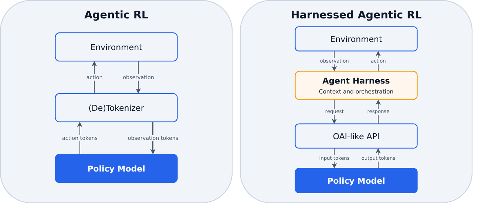

그림 2의 왼쪽 패널 "Agentic RL"은 위에서부터 Environment → (De)Tokenizer → Policy Model 순으로 놓여 있다. Environment가 (De)Tokenizer에 observation을 내려보내고 (De)Tokenizer가 action을 올려보내며, (De)Tokenizer는 Policy Model에 observation tokens를 내려보내고 Policy Model은 action tokens를 올려보낸다. 오른쪽 패널 "Harnessed Agentic RL"은 Environment → Agent Harness(부제 "Context and orchestration") → OAI-like API → Policy Model 순이다. Environment가 Agent Harness에 observation을, Agent Harness가 Environment에 action을 보내고, Agent Harness는 OAI-like API에 request를 내려보내고 response를 받으며, OAI-like API는 Policy Model에 input tokens를 내려보내고 output tokens를 받는다. 함께 실린 표가 차이를 정리한다.

|  | **Agentic RL** | **Harnessed Agentic RL** |
|----|----|----|
| **State** | Environment | Harness + environment |
|  |  |  |
| **Model input** | Continuous token history | Per-call prompts |
|  |  |  |
| **Agents** | Single ReAct agent | Multi-agent, subagents, and handoffs |

이 변화는 제어와 오케스트레이션을 하니스 쪽으로 옮기고, 학습 샘플의 개수를 더 동적으로 만든다.

## ⚠️ 네 가지 구현 문제

기존 프레임워크들은 아래 문제들에 대해 서로 다른 선택을 하고 있고, 그 선택은 알고리즘적 정확성과 학습 안정성에 영향을 줄 수 있다. 이 논문은 이 문제들을 처음으로 체계적으로 정리한다고 주장한다.

### 🧩 첫째, 재토큰화와 샘플 병합

에이전트 하니스는 보통 텍스트 message로 모델 API와 통신하는 반면 RL 학습은 토큰 위에서 동작한다. 하니스 관점에서 rollout은 보통 턴 단위 호출로 구성된다.

$$\mathcal{C}^{\mathrm{text}}(\rho)=\bigl((p_{1}^{\mathrm{text}},a_{1}^{\mathrm{text}}),(p_{2}^{\mathrm{text}},a_{2}^{\mathrm{text}}),\ldots\bigr),$$ (7)

여기서 하니스는 $p_{i}^{\mathrm{text}}$를 보내고 $a_{i}^{\mathrm{text}}$를 받는다. 다중 턴 ReAct 스타일 에이전트라면 보통 이전 호출이 다음 prompt의 완전한 텍스트 수준 prefix가 된다.

$$(p_{i}^{\mathrm{text}},a_{i}^{\mathrm{text}})\preceq p_{i+1}^{\mathrm{text}}.$$ (8)

다만 하니스가 subagent를 띄우거나 context를 요약하면, 학습 엔진은 이 관계를 만족하지 않는 다른 prompt 히스토리의 후속 호출을 받을 수 있다.

RL 학습은 정확한 토큰 ID와 rollout log probability 위에서 동작한다. RL 시스템은 각 호출을 토큰 시퀀스 $p_{i}^{\mathrm{tok}}$와 $a_{i}^{\mathrm{tok}}$로 표현하고, 여기서 $a_{i}^{\mathrm{tok}}\sim\pi_{\theta}(\cdot\mid p_{i}^{\mathrm{tok}})$다. 하니스에 돌려주는 응답은 $a_{i}^{\mathrm{text}}=\operatorname{Decode}(a_{i}^{\mathrm{tok}})$이므로, 학습은 토큰 수준 시퀀스 $\mathcal{C}^{\mathrm{tok}}(\rho)=((p_{1}^{\mathrm{tok}},a_{1}^{\mathrm{tok}}),(p_{2}^{\mathrm{tok}},a_{2}^{\mathrm{tok}}),\ldots)$를 관측한다. 연속한 호출 사이의 토큰 prefix 연속성은 다음을 요구한다($\preceq$는 정확한 토큰 수준 prefix).

$$\bigl(p_{i}^{\mathrm{tok}},a_{i}^{\mathrm{tok}}\bigr)\preceq p_{i+1}^{\mathrm{tok}},$$ (9)

실제로는 식 (8)이 성립해도 식 (9)가 성립한다는 보장이 없다. 다음 request는 갱신된 message 히스토리에 chat template과 tokenizer를 적용해서 얻어지는데, 재토큰화 후에는 $p_{i+1}^{\mathrm{tok}}$ 안의 $a_{i}^{\mathrm{text}}$에 대응하는 토큰 ID가 원래 샘플링된 $a_{i}^{\mathrm{tok}}$의 ID와 달라질 수 있다. 대부분의 프레임워크는 $p_{i+1}$이 $(p_{i},a_{i})$를 토큰 수준의 완전한 prefix로 포함할 때 두 연속 호출을 병합하는데, 이 불일치가 그 병합을 안전하지 않게 만든다.

논문이 연구 과정에서 관측한 불일치 메커니즘은 최소 세 가지다.

1. **Chat template의 비합성성(non-compositionality).** 완전한 message 히스토리를 렌더링한 결과가 부분들의 렌더링을 이어붙인 것과 반드시 같지는 않다.

$$\operatorname{Template}(A\mathbin{\|}B)\neq\operatorname{Template}(A)\mathbin{\|}\operatorname{Template}(B).$$ (10)

template이 message 경계에 구분자나 연결 개행을 삽입하거나, 원래 생성에 있던 표시를 빠뜨릴 수 있다. 실제로 Qwen의 chat template이 앞쪽의 `<think>` 마커를 제거해 토큰 prefix 연속성을 깨뜨리는 경우를 발견했다.

2. **Decode–retokenize drift.** 토큰 디코딩은 단사(injective)가 아니므로, 샘플링된 토큰을 텍스트로 바꾸고 그 텍스트를 다시 토큰화해도 원래 토큰 ID가 복원된다는 보장이 없다.

$$\operatorname{Tok}\bigl(\operatorname{Decode}(a_{i}^{\mathrm{tok}})\bigr)\neq a_{i}^{\mathrm{tok}}.$$ (11)

그림 3이 구체적인 예다. 호출 $i$에서 단어 `having`이 `h`와 `aving`이라는 두 토큰으로 샘플링됐는데, 이후 prompt 안에서 같은 텍스트를 재토큰화하면 `hav`와 `ing`이 나올 수 있다. 디코딩된 텍스트는 그대로지만 토큰 경계가 달라져서 두 호출 사이의 토큰 수준 연속성이 깨진다. 텍스트 수준 prefix 조건인 식 (8)은 여전히 성립하는데 토큰 수준 조건인 식 (9)가 깨지는 상황이다.

3. **추론 시점 출력 변환.** tool-call·구조화 출력 핸들러가 샘플링된 응답을 하니스에 돌려주기 전에 파싱, 정규화, 복구, 재직렬화할 수 있다. 이런 처리가 공백, 구분자, JSON 구조, 잘못된 문법을 바꿀 수 있어서 이후 prompt에 들어가는 응답이 샘플링된 토큰 ID가 나타내는 응답과 텍스트 수준에서조차 달라질 수 있다.

#### 🛠️ 깨진 토큰 prefix 연속성을 완화하는 방법들

가장 직접적인 전략은 **모든 모델 호출을 독립적으로 학습**하는 것이다. 생성된 각 토큰을 해당 호출의 action의 일부로 다루고, 인접 호출과의 어떤 관계도 가정하지 않은 채 $(p_{i}^{\mathrm{tok}},a_{i}^{\mathrm{tok}})$ 위에서 loss를 계산한다. 토큰 수준 정확성은 보장되지만, 호출 간에 공유되는 긴 prompt prefix를 반복 계산하므로 계산적으로 비효율적이다.

AReaL과 verl Uni-Agent는 LLM proxy 안에 **request buffer**를 두어 각 호출의 히스토리 텍스트와 토큰을 저장한다. 새 request가 도착했을 때 그 텍스트가 버퍼된 히스토리와 정확히 일치하면, 새 prompt 토큰 중 이전 응답 텍스트에 대응하는 구간을 버퍼된 응답 토큰으로 교체한다. 이러면 토큰 prefix 조건이 항상 성립한다. slime과 Polar는 이 교체를 하지 않는다.

이 교체는 계산 재사용을 회복하는 것 이상의 일을 한다. 버퍼된 토큰 ID가 실제 다음 request의 토큰 ID와 다를 때, 이 교체는 다음 응답이 평가되는 prompt 자체를 바꾼다. 실제 다음 prompt가 이전 응답의 재구성판 $\widehat{a}_{i}^{\mathrm{tok}}$를 포함한다고 하자.

$$p_{i+1}^{\mathrm{tok}}=p_{i}^{\mathrm{tok}}\mathbin{\|}\widehat{a}_{i}^{\mathrm{tok}}\mathbin{\|}\Delta_{i+1}.$$ (12)

이 구간을 원래 샘플링된 $a_{i}^{\mathrm{tok}}$로 교체하면 다음과 같이 이어붙여진(stitched) prompt가 만들어진다.

$$\widetilde{p}_{i+1}^{\mathrm{tok}}=p_{i}^{\mathrm{tok}}\mathbin{\|}a_{i}^{\mathrm{tok}}\mathbin{\|}\Delta_{i+1},\qquad\widetilde{p}_{i+1}^{\mathrm{tok}}\neq p_{i+1}^{\mathrm{tok}}.$$ (13)

$a_{i+1}^{\mathrm{tok}}$는 $\widetilde{p}_{i+1}^{\mathrm{tok}}$가 아니라 $p_{i+1}^{\mathrm{tok}}$에 조건부로 샘플링됐다. 따라서 이어붙여진 prompt 아래에서 학습하면 off-policy 불일치가 생긴다. 정확한 토큰 prefix 겹침은 rollout 중 실제로 소비된 prompt를 보존할 때에만 병합에 사용해야 한다.

두 번째 접근은 **prefix-shared 혹은 트리 구조 학습**이다. 정확한 공통 토큰 prefix를 한 번만 표현하고, branch-aware causal attention mask로 각 토큰이 자기 조상과 같은 branch의 앞선 토큰에만 attend하도록 한다. 독립적인 causal 시퀀스를 학습한 결과를 재현하면서 prefix 계산을 재사용할 수 있다. 다만 트리 패킹, 커스텀 attention mask나 커널, 파티셔닝, 분산 gradient 처리에 상당한 학습 백엔드 지원이 필요하다.

세 번째 실용적 접근은 **best-effort 시퀀스 병합**이다. 두 연속 호출은 관측된 토큰 ID가 식 (9)를 만족할 때에만 병합한다. 조건이 성립하면 매칭되지 않은 suffix와 다음 action만 덧붙이고, 실패하면 현재 시퀀스를 닫고 새 시퀀스를 시작한다. rollout 중 소비된 prompt를 보존하면서 표준 dense causal 커널로 동작하고, 재토큰화 drift는 병합 비율만 낮출 뿐이다. Agent Lightning v1.0은 독립 호출 재계산과 백엔드 집약적 트리 학습 사이의 중간 지점으로 이 전략을 택한다.

정리하면 트레이드오프는 이렇다. 버퍼된 토큰 교체는 병합 비율을 높일 수 있지만 rollout 중 실제로 소비된 prompt를 바꾸는 순간 off-policy stitching이 된다. 독립 호출 학습과 best-effort 병합은 토큰 수준 정확성을 보장하지만 중복된 prefix 계산을 남길 수 있고, 트리 구조 학습은 훨씬 복잡한 백엔드라는 비용을 치르고 더 많은 재사용을 회수할 수 있다.

### 📊 둘째, advantage 계산

LLM 호출들이 병합된 뒤, 하나의 rollout $\rho$는 서로 다른 개수의 학습 샘플 $N_{\rho}$를 만들 수 있고 그 값은 실행과 샘플 구성이 끝나야 알 수 있다. 재토큰화가 이 동적 샘플 개수의 한 원인이다. 하니스가 subagent를 띄워 하나의 선형 히스토리를 공유하지 않는 branch를 만들거나, context를 요약해 이전 토큰 prefix를 새것으로 대체할 수도 있다. 이런 연산들이 하나의 task 수준 rollout을 여러 학습 샘플로 쪼갠다. 이는 실전에서 예외적 상황이 아니다. 코딩 에이전트 학습 실행(그림 10)에서 평균적으로 rollout의 **36%**만 하나의 학습 샘플로 남았고, rollout 하나당 평균 **2.4개**의 학습 샘플이 나왔다.

실제로 reward는 여전히 결과 기반(outcome-based)이고, 그 rollout에서 나온 모든 샘플에 부여된다. 그러면 자연스러운 질문이 생긴다. advantage를 계산할 때 그룹 통계를 rollout 수준에서 계산해야 하는가, 샘플 수준에서 계산해야 하는가. 기존 프레임워크의 선택은 갈린다. verl Uni-Agent와 Polar는 rollout 수준에서, slime과 AReaL은 샘플 수준에서 계산한다.

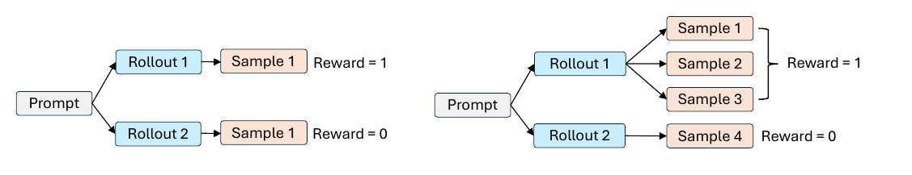

그림 4가 구체적 예다. 왼쪽은 전통적 RL로, Prompt에서 Rollout 1과 Rollout 2가 갈라지고 Rollout 1은 Sample 1로 이어지며 Reward = 1, Rollout 2도 하나의 샘플로 이어지며 Reward = 0이다. 오른쪽은 harnessed agentic RL로, Rollout 1이 Sample 1, Sample 2, Sample 3으로 갈라져 중괄호로 묶인 채 Reward = 1을 공유하고, Rollout 2는 Sample 4 하나로 남아 Reward = 0이다. 같은 prompt에서 나온 하나의 GRPO 그룹에서 Rollout 1이 reward 1, Rollout 2가 reward 0을 받았다고 하자. 전통적 RL에서는 각 rollout이 정확히 하나의 학습 샘플로 대응되므로 baseline을 $\bar{r}=(1+0)/2=1/2$로 계산하는 데 이견이 없다. harnessed agentic RL에서는 Rollout 1이 샘플 셋, Rollout 2가 샘플 하나이므로 rollout 수준 advantage 계산은 여전히 baseline $\bar{r}_{\mathrm{rollout}}=(1+0)/2=1/2$를 주는 반면, 샘플 수준 advantage 계산은 $\bar{r}_{\mathrm{sample}}=(1+1+1+0)/4=3/4$를 준다.

논문은 rollout 수준 advantage가 더 원칙적인 선택이라고 본다. 재토큰화는 부수적(incidental) 현상이고, 재토큰화가 우연히 rollout을 더 많은 샘플로 쪼갰다는 이유로 advantage 할당이 달라져서는 안 된다. 마찬가지로 subagent 생성과 context 요약은 하니스의 내부 연산이므로 그룹 전체의 baseline을 바꾸도록 허용해서는 안 된다. 다만 rollout 안의 샘플들 사이에서 더 나은 credit assignment를 설계하는 일은 향후 연구가 필요할 수 있다고 남겨 둔다.

### ⚖️ 셋째, loss 정규화

동적 샘플 개수는 loss 정규화도 사소하지 않은 선택으로 만든다. $R$개의 rollout으로 이뤄진 학습 배치를 생각하자. rollout $\rho$는 $N_{\rho}$개의 샘플을 만들고, rollout $\rho$의 $j$번째 샘플은 $L_{\rho,j}$개의 응답 토큰과 토큰별 loss $\ell_{\rho,j,t}$($t=1,\ldots,L_{\rho,j}$)를 갖는다. 대부분의 프레임워크는 전통적 에이전틱 RL에서 물려받은 샘플 수준 정규화를 그대로 재사용한다. 첫째는 DAPO가 쓰는 token-mean loss로, 배치의 모든 토큰에 대해 loss를 합하고 전체 응답 토큰 수로 나눈다.

$$\mathcal{L}_{\mathrm{token\text{-}mean}}=\frac{\sum_{\rho=1}^{R}\sum_{j=1}^{N_{\rho}}\sum_{t=1}^{L_{\rho,j}}\ell_{\rho,j,t}}{\sum_{\rho=1}^{R}\sum_{j=1}^{N_{\rho}}L_{\rho,j}}.$$ (14)

둘째는 GRPO가 쓰는 seq-mean-token-mean loss로, 각 샘플 안에서 먼저 평균을 내고 그 샘플 평균들을 배치의 모든 샘플에 대해 균등하게 평균한다.

$$\mathcal{L}_{\mathrm{seq\text{-}mean}}=\frac{1}{\sum_{\rho=1}^{R}N_{\rho}}\sum_{\rho=1}^{R}\sum_{j=1}^{N_{\rho}}\frac{1}{L_{\rho,j}}\sum_{t=1}^{L_{\rho,j}}\ell_{\rho,j,t}.$$ (15)

slime은 rollout 수준 token-mean loss를 구현한다. rollout의 모든 응답 토큰을 먼저 한데 모으고 rollout에 대해 균등하게 평균한다.

$$\mathcal{L}_{\mathrm{rollout\text{-}mean}}=\frac{1}{R}\sum_{\rho=1}^{R}\frac{\sum_{j=1}^{N_{\rho}}\sum_{t=1}^{L_{\rho,j}}\ell_{\rho,j,t}}{\sum_{j=1}^{N_{\rho}}L_{\rho,j}}.$$ (16)

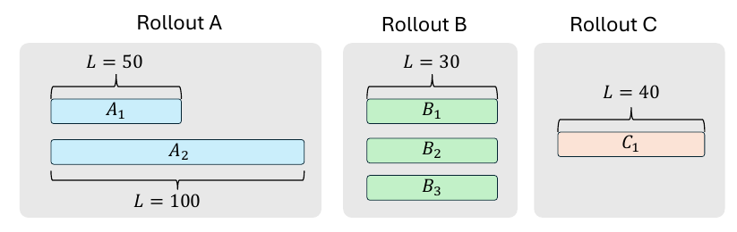

그림 5는 Rollout A, Rollout B, Rollout C 세 구획을 나란히 그린다. Rollout A에는 가로로 놓인 샘플 막대 두 개가 있는데 위쪽 A₁에 L = 50 표시, 아래쪽 A₂에 더 긴 L = 100 표시가 붙어 있다. Rollout B에는 세로로 쌓인 샘플 막대 B₁, B₂, B₃가 있고 B₁ 위에 L = 30 표시가 있다. Rollout C에는 샘플 막대 C₁ 하나가 있고 위에 L = 40 표시가 있다. 즉 배치에 세 rollout이 있고, Rollout A는 응답 길이 50과 100인 샘플 $A_{1}$, $A_{2}$를, Rollout B는 각각 길이 30인 $B_{1}$, $B_{2}$, $B_{3}$를, Rollout C는 길이 40인 $C_{1}$ 하나를 만든다. $A_{1},A_{2},B_{1},B_{2},B_{3},C_{1}$이 각 샘플 안의 토큰별 loss 합($A_{1}=\sum_{t}\ell_{A,1,t}$ 등)을 동시에 가리킨다고 하면 다음과 같다.

- $\mathcal{L}_{\mathrm{token\text{-}mean}}=(A_{1}+A_{2}+B_{1}+B_{2}+B_{3}+C_{1})/(50+100+30+30+30+40)$.

- $\mathcal{L}_{\mathrm{seq\text{-}mean}}=\tfrac{1}{6}(A_{1}/50+A_{2}/100+B_{1}/30+B_{2}/30+B_{3}/30+C_{1}/40)$.

- $\mathcal{L}_{\mathrm{rollout\text{-}mean}}=\tfrac{1}{3}\bigl((A_{1}+A_{2})/(50+100)+(B_{1}+B_{2}+B_{3})/(30+30+30)+C_{1}/40\bigr)$.

loss 정규화에 대해서도 advantage 계산과 같은 관점을 취한다. 샘플 개수는 재토큰화 같은 부수적 요인에 좌우되는 경우가 많으므로 gradient 정규화에 영향을 주도록 허용해서는 안 된다. 이 관점에서 식 (15)의 seq-mean-token-mean loss는 하나의 rollout이 우연히 몇 개의 샘플을 만들었느냐에 따라 값이 달라지고, 일반적으로 샘플이 많은 rollout에 불균형하게 큰 가중치를 주므로 문제가 있다. 따라서 이론적으로는 식 (14)의 token-mean loss와 식 (16)의 rollout 수준 token-mean loss가 더 원칙적이라고 본다. 다만 실제로는 token-mean loss가 긴 시퀀스에 민감해서, 배치에 길고 부정적인 샘플이 많이 들어오면 학습 후반에 불안정을 일으킬 수 있음을 발견했다. 그래서 식 (16)의 rollout 수준 token-mean loss를 선호한다. 일부 기존 프레임워크가 여전히 샘플 수준에서 loss를 정규화하는데, 이는 샘플을 더 많이 만드는 rollout에 더 큰 최적화 가중치를 주어 학습을 불안정하게 만들 수 있다.

### 🧮 넷째, 동적 샘플 개수 아래의 학습 백엔드 스케줄링

rollout 배치가 만들어내는 샘플의 개수와 길이는 하니스 실행과 샘플 구성이 끝나야 알 수 있다. 반면 학습 GPU 수와 데이터·텐서·파이프라인 병렬 설정은 보통 학습 내내 고정돼 있다. 따라서 백엔드는 매 iteration마다 가변 workload를 고정된 worker 집합에 매핑해야 한다.

샘플 구성 후 백엔드는 시퀀스들을 물리적 텐서 배치로 flatten할 수 있지만, 이 변환은 통계적 출처(provenance)를 보존해야 한다. 특히 모든 시퀀스는 자신의 rollout 식별자와 prompt 그룹 식별자를 유지해야 한다.

$$\mathcal{B}_{\mathrm{train}}=\bigcup_{\rho\in\mathcal{B}_{\mathrm{rollout}}}\left\{\bigl(S_{\rho,j},\rho,g_{\rho}\bigr)\;\middle|\;1\leq j\leq N_{\rho}\right\},$$ (17)

여기서 $S_{\rho,j}$는 rollout $\rho$에서 구성된 $j$번째 시퀀스이고 $g_{\rho}$는 같은 prompt에서 샘플링된 rollout들의 그룹을 식별한다. flatten은 물리적 표현만 바꿔야 하고, rollout 멤버십을 바꾸거나 어떤 rollout이 시퀀스를 더 많이 만들었다는 이유만으로 추가 통계적 가중치를 받게 해서는 안 된다.

rollout 경계는 배치 스케줄링도 제약한다. $N_{\rho}$가 실행 후에야 알려지므로 행 기반 텐서 배치, 데이터 병렬 파티션, 마이크로배치 스케줄을 prompt 수나 rollout 수만으로 계획할 수 없다. 게다가 한 rollout에서 나온 시퀀스들은 같은 optimizer update 안에 남아 있어야 한다. 이들을 여러 update에 걸쳐 쪼개면 한 rollout의 서로 다른 부분이 서로 다른 정책 버전 아래에서 평가되어 rollout 내부 policy skew가 생긴다. 백엔드는 이런 rollout 수준 통계·update 경계를 보존하면서 고정된 worker에 토큰 workload를 균형 있게 분배해야 한다.

## 🏗️ 시스템 설계: 약 3,500줄의 제어 평면

트레이너와 에이전트 하니스가 분리되면 어떤 단일 프로세스도 rollout 생애주기 전체를 소유하지 않는다. 트레이너는 모델 추론과 최적화를, 하니스는 context 구성, 제어 흐름, 도구 사용, 환경 상호작용을 소유한다. 에이전트 실행은 원격에서 돌 수 있고, 단일 API request나 worker 프로세스보다 오래 지속될 수 있으며, 학습 프로세스와 독립적으로 실패할 수 있다. 그래서 이 아키텍처를 운영하려면 하니스 로직을 트레이너로 다시 끌어오지 않으면서 지속적인 rollout 상태, 외부 실행, 부분 실패, 자원 사용을 조율하는 경량 제어 평면이 필요하다.

Agent Lightning v1.0은 선언적 rollout 추상화와 reconciliation loop 위에 이 제어 평면을 만든다. 트레이너가 API Gateway를 통해 rollout을 선언하고, Gateway는 생애주기 상태와 append-only 이벤트의 진실 원천 역할을 한다. Rollout Controller는 이 상태를 Kubernetes Job이나 로컬 프로세스로 도는 에이전트 실행과 지속적으로 맞춘다. 이 분리 덕분에 Kubernetes는 rollout 추상화의 일부가 아니라 교체 가능한 실행 백엔드가 된다.

같은 제어 평면이 서비스 경계를 가로지르는 명시적 신뢰성·관측 가능성 semantics를 제공한다. 제어 평면 연산은 idempotent하고, 생성 시도는 기록되고 명시적으로 해소되며, rollout 식별자가 모델 request, reward, 커스텀 이벤트, 실행 로그를 하나의 진단 레코드로 묶는다. 마지막으로 API Gateway는 collocated async RL 중 추론 admission을 조율해서, rollout과 weight update가 하나의 GPU pool을 시분할하면서도 외부 하니스에는 phase 전환이 노출되지 않게 한다.

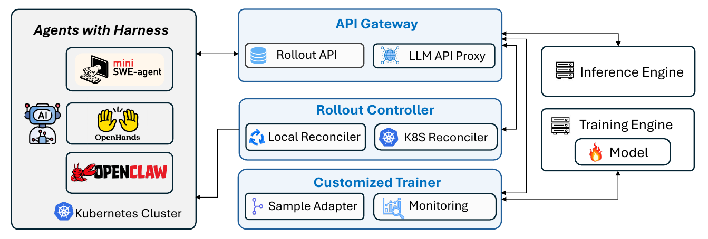

그림 1은 세 영역으로 나뉜 아키텍처 다이어그램이다. 왼쪽의 큰 "Agents with Harness" 컨테이너에는 mini SWE-agent, OpenHands, OPENCLAW 세 에이전트 예시와 AI/로봇 아이콘, "Kubernetes Cluster" 항목이 들어 있고, 이 컨테이너는 가운데 "API Gateway"와 양방향 화살표로 연결된다. API Gateway 안에는 "Rollout API"와 "LLM API Proxy"가 있다. 그 아래에 "Local Reconciler"와 "K8S Reconciler"를 담은 "Rollout Controller", 그리고 "Sample Adapter"와 "Monitoring"을 담은 "Customized Trainer"가 세로로 쌓여 있다. Rollout Controller에서 왼쪽 아래 Kubernetes Cluster 영역으로 연결선이 간다. 오른쪽에는 API Gateway와 화살표로 연결된 별도의 "Inference Engine" 박스가 있고, 그 아래 "Model"을 품은 "Training Engine" 박스가 중앙 모듈들, 특히 Customized Trainer와 연결된다.

세 구성 요소가 학습 클러스터(모델 추론과 학습을 돌리는 GPU 클러스터)와 에이전트 실행 클러스터를 잇는다. **API Gateway**는 rollout, model, event를 저장하고 에이전트 하니스의 LLM 호출을 트레이너가 등록한 모델 endpoint로 전달하는 API 서비스다. **Rollout Controller**는 Kubernetes 클러스터(또는 로컬 프로세스 pool) 위에서 에이전트 실행을 관리하며, API Gateway에서 rollout을 polling해 해당 에이전트 task를 띄운다. **Customized Trainer**는 VERL 위에 만들어졌고, API Gateway에 rollout을 등록하고 Rollout Controller가 그것들을 완료 상태로 몰아갈 때까지 기다린 뒤 기록된 이벤트를 가져와 학습 샘플을 조립한다. 이 사슬을 통해 트레이너는 rollout을 만들고 trajectory를 수집하기만 하고, 어떤 하니스든 자기 LLM endpoint를 proxy로 바꾸기만 하면 연결되며, 학습 자원과 실행 자원을 독립적으로 프로비저닝하고 심지어 서로 다른 위치에서 돌릴 수도 있다.

시스템 전체는 가능한 한 단순하도록 설계돼 약 3,500줄의 코드로 구현됐고, 각 구성 요소가 명확한 책임을 갖는다. rollout 수준 reward·advantage 계산과 rollout 수준 loss 정규화 같은 자체 설계 선택도 여기 반영돼 있다.

### ⚡ Collocated Async RL

에이전틱 RL에서 동기(sync) RL 설정은 느리다. 배치의 모든 rollout이 끝나야 학습 step이 모델을 갱신할 수 있으므로 학습 step이 배치에서 가장 느린 rollout을 기다려야 하고, 많은 GPU가 놀게 된다. AReaL이 제안한 비동기 RL은 rollout과 update를 서로 다른 GPU를 차지하는 두 머신 pool로 분리해 GPU 유휴 문제를 푼다. update가 도는 동안에도 rollout GPU가 계속 일할 수 있다. 다만 전체적으로 더 많은 GPU가 필요해서 규모가 작은 팀이 감당하기 어려운 자원을 요구하고, rollout 큐와 update 큐를 따로 관리해야 하는데 실제로 두 큐의 진행 속도가 달라질 수 있어 더 복잡하다.

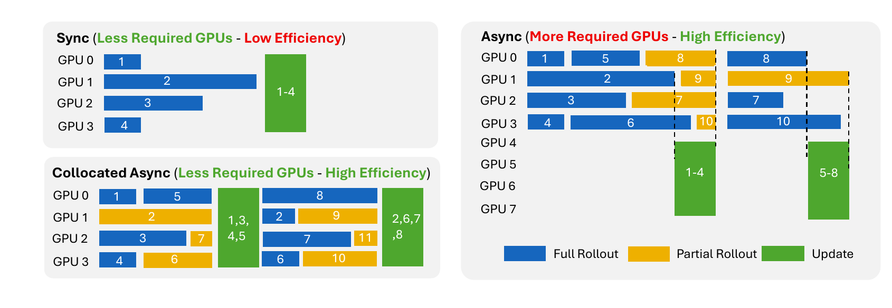

그림 6은 Sync, Collocated Async, Async 세 스케줄을 비교한다. 범례는 Full Rollout, Partial Rollout, Update 세 블록 종류를 표시한다. 왼쪽 위 "Sync (Less Required GPUs - Low Efficiency)" 패널에서는 GPU 0~3이 각각 Full Rollout 1~4를 돌린 뒤 네 GPU에 걸친 하나의 Update 블록 "1-4"가 온다. 왼쪽 아래 "Collocated Async (Less Required GPUs - High Efficiency)" 패널에서는 첫 update 전에 GPU 0이 Full Rollout 1과 5를, GPU 1이 Partial Rollout 2를, GPU 2가 Full Rollout 3과 Partial Rollout 7을, GPU 3이 Full Rollout 4와 Partial Rollout 6을 돌리고, 네 GPU에 걸친 Update 블록이 "1,3,4,5"로 표시된다. 그 뒤 GPU 0이 Full Rollout 8, GPU 1이 Full Rollout 2와 Partial Rollout 9, GPU 2가 Full Rollout 7과 Partial Rollout 11, GPU 3이 Full Rollout 6과 Partial Rollout 10을 돌리고 두 번째 Update 블록이 "2,6,7,8"로 표시된다. 오른쪽 "Async (More Required GPUs - High Efficiency)" 패널은 GPU 0~7을 쓰는데, GPU 0~3이 rollout을 돌리는 동안 GPU 4~7은 rollout 블록 구간에 놀다가 "1-4" update 블록을, 이후 "5-8" update 블록을 공유한다.

collocated async RL에서는 rollout과 weight update가 같은 GPU pool을 공유한다. 충분한 rollout 데이터가 모이면 update step이 시작된다. API Gateway는 동시에 새 request 수락을 멈추고 진행 중인 request가 끝나기를 기다린다. 그 이후에 새 request가 도착하면 Gateway가 시스템이 rollout phase로 다시 들어갈 때까지 그 request를 보류한다. 그 결과 phase 전환이 에이전트 하니스에게는 보이지 않는다.

collocated async는 같은 GPU를 rollout과 학습 사이에서 시분할하게 하므로 async RL보다 적은 GPU를 쓰면서도 가장 느린 rollout을 기다리는 일을 피한다. 실험에서 collocated async RL은 동기 RL 대비 대략 2x(2배)의 end-to-end 속도 향상을 달성하면서 GPU도 더 적게 썼다.

### 🌐 네트워크 문제 대응

harnessed agentic RL에서 에이전트는 학습 엔진과 분리돼 있어서 네트워크 문제가 생긴다. 양쪽 사이의 호출이 네트워크를 타는데 이는 항상 신뢰할 수는 없다. 영향을 받는 호출은 두 종류다. Trainer나 Rollout Controller가 API Gateway로 보내는 호출, 그리고 에이전트 하니스가 proxy를 거쳐 LLM 추론 endpoint로 보내는 호출. 둘 다 네트워크 중단을 겪을 수 있고 호출 측은 보통 실패 후 재시도한다. 두 가지 조치로 대응한다.

**idempotent한 API Gateway endpoint.** 모든 rollout API Gateway endpoint를 idempotent하게 설계해서, 같은 호출을 몇 번 반복하든 한 번 호출한 것과 같은 효과를 갖게 한다. 그래서 호출자는 네트워크 실패 후 재시도가 상태를 망가뜨릴 걱정 없이 자유롭게 재시도할 수 있다.

**반복된 LLM API 호출의 중복 제거.** 재시도된 LLM API 호출은 같은 방식으로 idempotent하게 만들 수 없다. 각 재시도가 새 생성 request이고 다른 응답을 돌려줄 수 있기 때문이다. 대신 Customized Trainer가 학습 샘플을 조립할 때 같은 prompt를 공유하는 `model_request` 이벤트를 중복 제거한다. 한 rollout이 동일한 prompt로 여러 호출을 기록했다면 마지막(가장 최근) 호출만 남기고, 재시도되었거나 대체된 앞선 호출들은 버린다.

### ☸️ Kubernetes 통합

RL 학습의 rollout 단계에서는 많은 에이전트가 동시에 돌아야 해서 상당한 컴퓨트 자원이 필요하다. 기존 harnessed agentic RL 프레임워크들은 이 수요를 맞추기 위해 흔히 상용 sandbox 서비스에 의존한다. 예를 들어 verl Uni-Agent는 Modal Sandbox나 Volcano veFaas 같은 관리형 sandbox에서 에이전트 실행을 띄우고, slime은 E2B에 의존한다. 이런 서비스는 편리하고 바로 쓸 수 있는 sandbox를 제공하지만 RL 학습 규모에서는 비쌀 수 있다.

Agent Lightning v1.0은 대신 Rollout Controller를 통해 Kubernetes 클러스터에서 에이전트를 직접 돌린다. 각 에이전트 실행이 표준 Kubernetes Job으로 스케줄되므로, 사용자는 상용 sandbox 제공자 대신 전적으로 자체 호스팅이나 온프레미스 컴퓨트에 의존할 수 있다. 상용 sandbox 서비스의 반복 비용을 피하고 전체 학습 스택을 오픈소스로 유지한다.

### 🔍 모니터링

학습 중에 에이전트 자체가 reward hacking, 나쁜 에이전트 행동, 네트워크 연결 문제 같은 문제를 일으킬 수 있음을 발견했다. 이런 문제를 잡으려고 rollout을 수동으로 들여다보는 건 불편하므로, Customized Trainer에 학습·검증 rollout과 Kubernetes의 pod 수준 로그를 함께 기록하는 모니터링 시스템을 넣었다. 이 시스템 덕분에 AI 에이전트를 써서 그런 문제를 자동으로 식별할 수 있고, 실제로 이 방식으로 여러 reward-hacking 사례를 발견했다.

## 🧪 실험: 검색·범용 지시 수행·코딩 에이전트

세 가지 실용적인 에이전트 학습 설정에서 평가한다. 검색 에이전트는 Search-R1의 실험 설정을, 범용 지시 수행 에이전트는 LLM-in-Sandbox의 설정을 따르고, 코딩 에이전트는 SWE-smith로 학습 데이터를 만든다. 기존 프레임워크가 완전하고 재현 가능한 코딩 에이전트 학습 예제를 거의 제공하지 않는데, 데이터 정제의 복잡성, 환경 구축의 어려움, 요구되는 상당한 컴퓨팅 자원 때문일 수 있다고 본다. 그래서 코딩 에이전트에 집중해 학습 과정을 상세히 기술한다.

### 🔎 검색 에이전트

Search-R1의 실험 설정을 따라, 추론과 검색 엔진 질의를 교차하고 검색된 passage로 지식 집약적 질문에 답하는 검색 에이전트를 학습한다. 정책 모델은 Llama-3.2-3B-Instruct이고 GRPO로 최적화한다. 학습은 HotpotQA의 training split에서 하고, 평가는 HotpotQA, 2WikiMultiHopQA, MuSiQue, Bamboogle, TriviaQA, Natural Questions 각각에서 50개 예제를 샘플링해서 한다. 학습 배치 크기는 512, prompt당 rollout은 4개, 10 학습 step마다 평가한다. reward 지표는 exact match(EM)다.

평균 학습 reward는 꾸준히 증가한다. 검증 셋에서 reward는 **25.1%에서 41.7%로, 절대 16.6% 향상**했다.

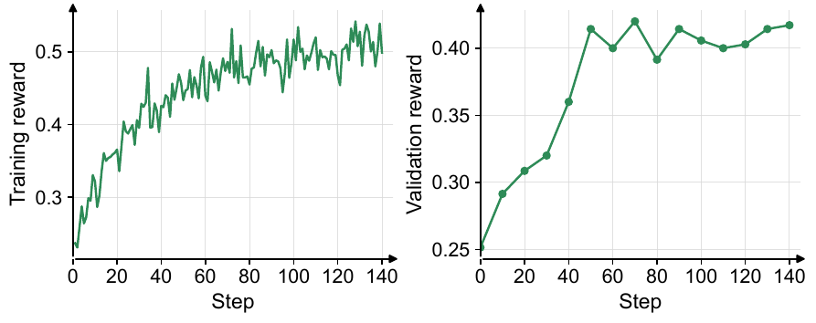

그림 7의 왼쪽 패널은 학습 reward, 오른쪽 패널은 검증 reward이고 가로축은 Step(0~140)이다. 값이 인쇄돼 있지 않아 아래는 축에서 읽은 근사값이다. 왼쪽의 학습 reward는 step 0에서 약 0.22로 시작해 큰 단기 변동과 함께 step 10 무렵 약 0.30, step 20 무렵 약 0.35, step 30 무렵 약 0.40까지 오르고, step 35~65 구간에서 대체로 약 0.40~0.48에 머물다가 step 70~75 근처에서 약 0.52~0.54의 간헐적 정점을 찍고, 이후 대체로 약 0.46~0.52 사이에서 변동하며 step 140에서 약 0.50으로 끝난다. 오른쪽 검증 reward는 10 step마다 찍히며 step 0 약 0.25에서 시작해 전반적으로 상승하되 step 60, 80, 100~120에서 하락 구간이 있고 이후 약간 회복한다. 본문이 인쇄한 값은 25.1% → 41.7%다.

### 🖥️ 범용 지시 수행 에이전트

LLM-in-Sandbox의 실험 설정을 따라 범용 지시 수행 에이전트를 학습한다. 이 에이전트는 컴퓨터 sandbox를 써서 외부 자원에 접근하고, 파일을 관리하고, 코드를 실행해 코딩이 아닌 다양한 task를 푼다. 원저자들이 제공한 에이전트 하니스를 그대로 쓴다. 정책 모델은 Qwen3-4B-Instruct-2507이고 RLOO로 최적화한다. 데이터셋은 Instruction Pre-Training이 공개한 것을 써서 80%를 학습, 20%를 평가로 나눈다. 학습 배치 크기는 8, prompt당 rollout은 8개, 20 학습 step마다 평가한다.

배치 수준 학습 reward는 잡음이 심한 반면 검증 reward는 뚜렷한 상승 추세를 보인다. **51.9%에서 70.2%로, 절대 18.3% 향상**했다.

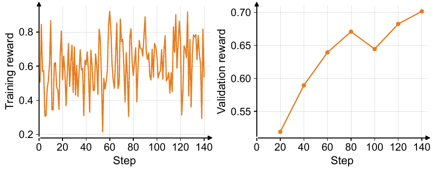

그림 8의 왼쪽은 학습 reward로, step 0~140 내내 대략 0.21에서 0.92 사이를 매끄러운 단조 추세 없이 심하게 요동한다(축에서 읽은 근사값). 약 0.69에서 시작해 약 0.55로 끝나고, 0.8을 넘는 정점과 0.3~0.4의 저점이 반복되며 step 54 근처에서 약 0.21의 최저점을 찍는다. 오른쪽 검증 reward는 step 20, 40, 60, 80, 100, 120, 140의 일곱 지점에서 찍히고 전반적으로 상승하되 step 80에서 100 사이에 약간 하락한 뒤 step 140에서 최고점에 이른다. 본문이 인쇄한 값은 51.9% → 70.2%다.

### 💻 코딩 에이전트

Qwen3.5-9B를 기반으로 SWE-smith 데이터셋에서 파생한 task로 코딩 에이전트를 학습한다. 저장소 환경과 상호작용하고, 명령을 실행하고, 코드 변경을 만들어내는 에이전트 하니스로는 mini-SWE-agent를 쓴다. 신뢰할 만한 학습 신호를 얻기 위해 상세한 데이터 필터링 파이프라인을 적용하고, reward hacking에 대한 안전장치를 도입하고, 견고한 코딩 에이전트 학습에 필요한 추가 조치를 구현한다.

#### 🧹 데이터셋 전처리와 필터링

SWE-smith는 실제 Python 저장소에 버그를 주입해서 만든 대규모 실행 가능 소프트웨어 엔지니어링 task 데이터셋이다. 128개 저장소에서 나온 59,136개 task를 담고 있고, 문제 서술, 코드 패치, 해답 검증용 테스트를 포함한다. Docker 이미지가 295 GB만 차지하는데, 이는 R2E-Gym이 요구하는 4 TB, SWE-Gym이 요구하는 6 TB보다 훨씬 적다.

각 task에서 SWE-smith는 먼저 저장소를 해당 문제 branch로 전환하고 코딩 에이전트에게 코드베이스를 수정하라고 요청한다. 그다음 task별 테스트 스위트를 돌려 제출된 변경이 문제를 해결했는지 판정한다.

공개된 데이터에서 다음 문제들을 확인했다.

- 59,136개 레코드 중 18,033개는 문제 서술이 비어 있다.
- 1,265개 레코드는 대응하는 문제 branch가 제공된 Docker 이미지에 없다.
- 일부 task는 큰 테스트 스위트를 요구한다. 예를 들어 `python-jsonschema`는 7,000개가 넘는 테스트를 실행해야 해서 상당한 CPU와 메모리를 잡아먹는다.

그래서 문제 서술이 비었거나, 문제 branch가 없거나, 테스트가 200개를 넘는 task를 제거한다. 남은 task도 난이도 분포가 크게 치우쳐 있어 학습 신호가 제한적이므로, 추가로 모델 기반 난이도 필터를 적용한다. 모든 후보에 대해 Qwen3.5-9B를 네 번 돌려서 네 rollout 모두에서 풀린 task는 제거하고, 성공과 실패가 섞인 task는 유지해 약 5,000개 예제를 얻는다. 결과 집합이 지나치게 쉬워지지 않도록, 네 rollout 모두에서 실패한 task 1,000개를 추가로 샘플링한다. 최종 split은 약 6,000개 학습 예제와 400개 테스트 예제로 이뤄진다.

#### 🚫 reward hacking 방지

학습 중에 에이전트가 의도된 문제 해결 과정을 우회하고 참조 소스 코드를 직접 얻어내는 reward-hacking 행동을 여럿 관측했다.

1. Git 히스토리를 써서 gold commit을 찾아내기.
2. `wget`이나 `curl`로 GitHub에서 upstream 소스 코드를 가져오기.
3. `pip`로 패키지의 소스 코드를 내려받기.
4. `urllib` 같은 Python 네트워킹 라이브러리로 소스 코드를 내려받기.

두 가지 안전장치를 도입한다. 첫째, Git 명령을 비활성화하고 `.git` 디렉터리를 에이전트에게서 숨겨서 commit 히스토리를 들여다보지 못하게 한다. 둘째, 일반적인 외부 네트워크 접근을 차단하고 명시적으로 화이트리스트에 오른 서비스로의 연결만 허용하는 Kubernetes network policy를 적용한다. 이 둘을 합치면 에이전트는 제공된 문제 서술과 로컬 정보만으로 각 task를 풀어야 한다.

#### 📈 학습 동역학과 ablation

rollout의 샘플 개수가 재토큰화 같은 부수적 요인에 좌우되는 경우가 많으므로 advantage 계산과 loss 정규화를 샘플 수준이 아니라 rollout 수준에서 해야 한다는 설계 선택을, 코딩 에이전트 학습 실행에서 세 설정을 비교해 검증한다. 세 설정 모두 같은 GRPO objective를 쓴다.

- *Sample-level Advantage*: 샘플 수준 advantage와 식 (14)의 token-mean loss를 결합.
- *Rollout-level Advantage*: advantage 계산만 rollout 수준으로 바꾸고 token-mean loss는 유지.
- *Rollout-level Advantage + Rollout-level Norm*: 여기에 더해 token-mean loss를 식 (16)의 rollout 수준 token-mean loss로 교체.

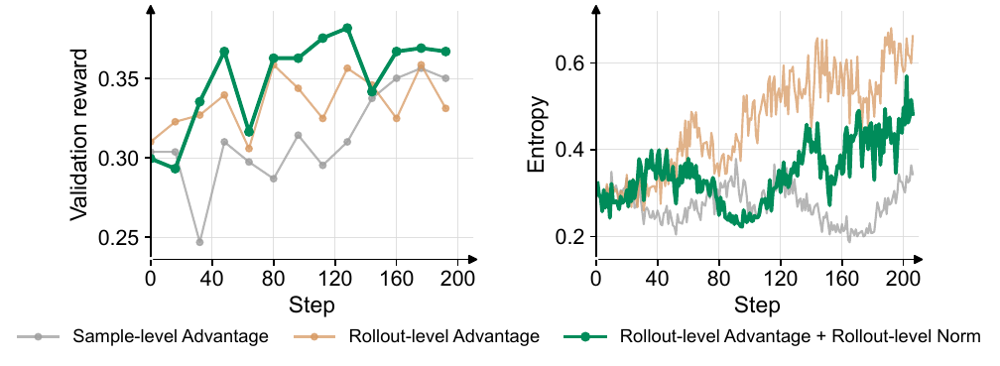

그림 9의 왼쪽 패널은 검증 reward, 오른쪽 패널은 policy entropy이고 가로축은 Step(0~200)이다. 왼쪽에서 세 곡선은 대략 step 0, 16, 32, 48, 64, 80, 96, 112, 128, 144, 160, 176, 192의 13개 지점에 마커가 찍힌다. 축에서 읽은 근사값으로, Sample-level Advantage는 step 32 근처에서 약 0.247로 가장 낮은 지점을 찍고, Rollout-level Advantage + Rollout-level Norm 곡선이 후반 대부분의 마커에서 가장 높다. 오른쪽 entropy 패널에서 Sample-level Advantage는 약 0.30 근처에서 시작해 step 120까지 대체로 약 0.24~0.33 사이를 오가고 step 150~175 부근에서 약 0.20~0.23까지 떨어졌다가 step 200에서 약 0.31~0.33으로 오른다. Rollout-level Advantage는 약 0.28~0.30에서 시작해 step 40 근처 약 0.35, step 60 근처 약 0.45에 이르고, step 70~90에서 약 0.35~0.40으로 내려갔다가 step 100~170에서 약 0.50~0.60까지 잡음 섞여 오르며 약 0.63~0.66으로 끝나고 정점은 약 0.68에 근접한다. Rollout-level Advantage + Rollout-level Norm은 약 0.28에서 시작해 step 30~60에서 약 0.35~0.40, step 95 근처에서 약 0.24~0.27로 내려갔다가 step 130~165에서 약 0.40~0.45로 오르고 이후 약 0.38~0.44 사이에서 변동하다 약 0.48~0.50으로 끝난다.

본문이 인쇄한 값으로, 마지막 변형이 관측된 검증 reward 중 가장 높은 값인 **step 128에서 38.2%**에 도달한다. baseline은 **35.0%**, rollout-advantage 수정만 적용한 경우는 **33.1%**다. 이 변형의 policy entropy는 rollout-advantage 수정만 적용한 변형보다 더 천천히 자라고 학습 내내 더 안정적으로 유지된다. 이 결과들은 loss 정규화가 rollout advantage 교정이 도입한 entropy 증가를 제어하면서 검증 reward를 개선함을 시사한다.

Rollout-level Advantage + Rollout-level Norm 체크포인트를 SWE-bench Verified에서도 평가했고, **step 208에서 41.8%에서 56.4%로** 향상했다. 결론 절이 요약하듯 이는 절대 **14.6%**(14.6 퍼센트포인트) 이득이고, 오직 RL만으로, 약 6K 학습 예제와 modest한 컴퓨트로 얻은 결과다.

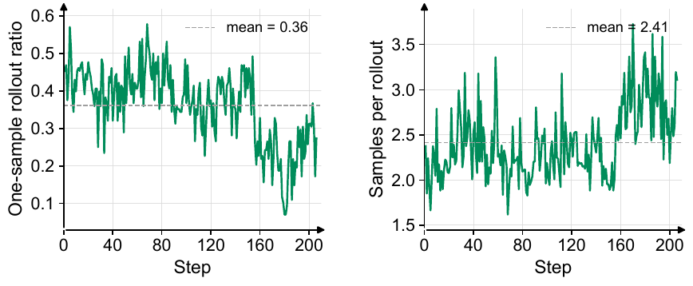

그림 10은 Rollout-level Advantage + Rollout-level Norm 실행의 rollout 병합 거동이다. 왼쪽 패널의 세로축은 "One-sample rollout ratio", 즉 정확히 하나의 학습 샘플만 만드는 rollout의 비율이고, 점선 기준선에 "mean = 0.36"이 표시돼 있다. 오른쪽 패널의 세로축은 "Samples per rollout", 즉 rollout당 평균 학습 샘플 수이고 점선에 "mean = 2.41"이 표시돼 있다. 축에서 읽은 근사값으로, 왼쪽 곡선은 약 0.57에서 시작해 step 90 무렵까지 대체로 약 0.35~0.50 사이를 오가며 step 65~75 근처에서 약 0.55~0.57의 정점을 찍고, step 90~155에서는 주로 약 0.25~0.45 사이에 있다가 step 160 이후 떨어져 대체로 약 0.1~0.3에 머물고 step 180 근처에서 약 0.07의 최저점을 찍은 뒤 약 0.3~0.36까지 올랐다 약 0.25로 끝난다. 오른쪽 곡선은 약 2.1에서 시작해 초반에는 주로 약 1.8~2.5, step 50~155에서는 대체로 약 2.0~2.5에 있으면서 간간이 약 2.8~3.2까지 튀고, step 160 이후 올라가 자주 약 2.7~3.6에 이르고 최고 약 3.8까지 갔다가 약 3.2로 끝난다.

코딩 에이전트 trajectory는 길이 편차가 크기 때문에, rollout 수준 advantage 변형들은 padding 낭비를 줄이려고 가능한 곳마다 trajectory를 학습 행(row)으로 병합한다. 그 결과 rollout당 학습 샘플 수가 동적으로 정해진다. 평균적으로 rollout의 **36%**만 하나의 완전히 병합된 행으로 남고, rollout 하나가 평균 **2.41개**의 학습 샘플을 만든다.

## 🧱 API Gateway·Rollout Controller·Customized Trainer 상세

### 🗄️ API Gateway

API Gateway는 Agent Lightning v1.0의 중심 구성 요소이며 의도적으로 가볍게 유지된다. rollout, model, event를 저장하고 최소한의 API로 노출하는 단일 stateful 서비스다.

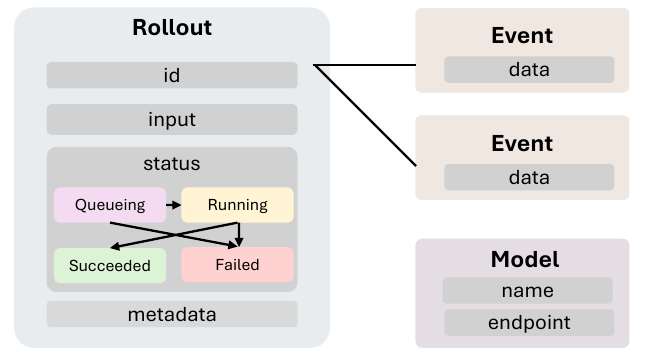

그림 11은 API Gateway가 저장하는 객체들을 그린다. 왼쪽의 큰 Rollout 객체는 id, input, status, metadata 필드를 담는다. status 필드 안에는 Queueing, Running, Succeeded, Failed로 이뤄진 상태 기계가 들어 있는데, Queueing은 Running과 Failed로 갈 수 있고, Running은 Succeeded와 Failed로 가며, Succeeded와 Failed는 종단 상태다. 오른쪽 위에는 각각 data를 담은 Event 객체 두 개가 있고 Rollout id가 선으로 각 Event에 연결된다. 그 아래에는 name과 endpoint를 담은 Model 객체가 있으며 다른 객체와 연결선이 그려져 있지 않다.

**Rollout**은 하나의 에이전트 실행이고 고유한 rollout ID로 식별된다. 학습 예제에서 파생된 input, status, 사용자 정의 metadata를 저장한다. status는 `queuing`, `running`, 그리고 종단 상태인 `succeeded`와 `failed`의 상태 기계를 따른다. rollout은 학습 예제와 일대일이 아니다. 예를 들어 GRPO는 같은 예제에서 각자 ID와 trajectory를 갖는 여러 독립 rollout을 생성한다.

**Model**은 LLM 추론 endpoint를 이름과 주소로 식별한다. 트레이너가 API Gateway에 모델을 등록하면 Gateway가 에이전트 하니스의 request를 해당 추론 서버로 라우팅한다.

**Event**는 rollout에 임의의 데이터를 붙인다. 기본적으로 모든 LLM 상호작용마다 `model_request` 이벤트(prompt 토큰 ID, 응답 토큰 ID, 응답 log probability)를 기록하고, 에이전트가 보통 rollout 끝에 한 번 스칼라 reward를 보고하는 `reward` 이벤트를 기록한다. 사용자가 커스텀 이벤트 타입을 정의할 수도 있다.

API Gateway의 endpoint는 rollout API와 proxy API 두 갈래로 나뉜다.

| Method | Endpoint | Comment |
|----|----|----|
| POST | `/api/rollouts` | Create a batch of rollouts. |
| GET | `/api/rollouts` | List rollouts, optionally filtered by state. |
| GET | `/api/rollouts/{rollout_id}` | Get one rollout. |
| PATCH | `/api/rollouts/{rollout_id}` | Update rollout status. |
| POST | `/api/rollouts/{rollout_id}/attempt/{attempt_id}/events` | Append an event to a rollout attempt. |
| GET | `/api/rollouts/{rollout_id}/events` | Read rollout events. |
|  |  |  |
| POST | `/api/models` | Register model endpoints. |
| DELETE | `/api/models` | Remove all registered model endpoints. |
| POST | `/proxy/rollout/{rollout_id}/attempt/{attempt_id}/mode/{mode}/openai/v1/chat/completions` | Forward an OpenAI-compatible model call. |

**Rollout API.** 트레이너가 이 API로 rollout을 만든다. Rollout Controller는 큐에 든 rollout을 polling해서 에이전트를 띄우고 실행이 진행되는 대로 상태를 갱신한다. reward와 다른 사용자 정의 이벤트도 같은 경로로 업로드된다.

**Proxy API.** 이 API는 에이전트 하니스의 LLM 호출을 트레이너가 등록한 모델 endpoint로 전달한다. 에이전트 하니스는 자기 OpenAI 호환 클라이언트를 proxy로 향하게 하기만 하면 된다. proxy 경로에 rollout ID가 박혀 있어서 모든 호출이 자동으로 자기 rollout에 귀속된다. 각 호출의 prompt 토큰 ID, 응답 토큰 ID, log probability가 `model_request` 이벤트로 기록되고 트레이너가 나중에 학습용으로 export한다.

### 🔄 Rollout Controller

Rollout Controller는 Kubernetes 위에서 에이전트 실행을 관리한다. API Gateway에서 활성 rollout을 주기적으로 가져와 해당 에이전트 task를 띄우고, 감시하고, Gateway API로 상태를 보고한다. 주 백엔드는 오픈소스 Kubernetes 클러스터를 대상으로 하는 K8s Reconciler이고, 디버깅용으로 로컬 프로세스 pool을 대상으로 하는 Local Reconciler도 제공한다.

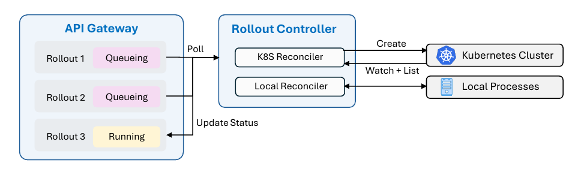

그림 12는 왼쪽에 Rollout 1 — Queuing, Rollout 2 — Queuing, Rollout 3 — Running 세 항목을 담은 API Gateway 컨테이너를, 가운데에 K8S Reconciler와 Local Reconciler를 담은 Rollout Controller 컨테이너를 그린다. API Gateway는 Rollout Controller로 Poll request를 보내고 컨트롤러는 Update Status를 되돌려 준다. K8S Reconciler는 오른쪽의 Kubernetes Cluster로 Create를 보내고 Watch + List 갱신을 받으며, Local Reconciler는 오른쪽의 Local Processes에 연결해 그것들을 띄우고 관리한다.

**K8s Reconciler.** 대응하는 Kubernetes Job이 아직 없는 `queuing` rollout마다 사용자가 제공한 템플릿으로 Job을 하나 만든다. Kubernetes API에서 Job 갱신을 watch해서 종단 상태가 낮은 지연으로 전파되게 하고, 주기적으로 관리 중인 모든 Job을 list해서 놓친 watch 이벤트를 복구한다. 이는 표준적인 Kubernetes 컨트롤러 패턴이다.

**Local Reconciler.** 대신 로컬 프로세스 pool에서 에이전트를 띄운다. 프로세스 핸들을 직접 소유하므로 주기적 polling만으로 충분하고 별도 watch 메커니즘이 필요 없다.

**상태 일관성.** API Gateway의 rollout 상태가 ground truth다. Kubernetes에서 관측한 실행 상태는 네트워크 실패나 갱신 지연 때문에 그보다 뒤처질 수 있다. K8s Reconciler는 다음 주기에 동기화를 재시도할 뿐이고, 통신이 재개되면 양쪽이 수렴한다. 이 설계는 best-effort eventual consistency만 보장한다.

### 🧷 Customized Trainer

VERL 위에 만들어진 Customized Trainer는 가벼운 설계를 유지하면서 학습 백엔드를 API Gateway에 연결한다. 매 step마다 현재 배치의 rollout을 등록하고, 그것들이 종단 상태에 이를 때까지 기다린 뒤, `model_request`와 `reward` 이벤트를 가져와 학습 샘플로 조립한다. 두 구성 요소로 이뤄진다.

**전용 Sample Adapter.** adapter가 앞의 문제들에 대한 설계 선택을 반영한다. **샘플 병합**에서는 API Gateway를 최대한 단순하게 유지해 서버 측 request buffer를 두지 않으며, 이로써 학습이 배포와 일관되게 유지된다. adapter는 뒤쪽 prompt가 앞선 request와 응답의 정확한 토큰 수준 prefix 매치일 때에만 두 연속 model request를 하나의 학습 샘플로 병합한다. **advantage 계산**에서는 baseline과 advantage를 rollout 수준에서 계산하며, 이것이 더 원칙적인 선택이라고 본다. **loss 정규화**에서는 rollout 수준 token-mean loss를 구현해, 샘플 개수와 무관하게 모든 rollout이 같은 가중치를 갖도록 정규화한다.

**Trajectory Monitoring.** 에이전틱 학습은 reward hacking, 폭주하는 trajectory, 조용한 실패를 낳을 수 있으므로, 트레이너는 모든 학습·검증 rollout의 input, status, model request, reward, 토큰/턴 통계, 커스텀 이벤트를 노출하고 실행 로그는 Kubernetes에 보관한다. 그래서 사람이 직접 보거나 AI 에이전트를 시켜 이상 행동을 진단할 수 있다.

## 🧷 저자들이 인정한 한계

논문이 스스로 남긴 한계는 다음과 같다. rollout 안의 여러 샘플에 걸쳐 더 나은 credit assignment를 설계하려면 향후 연구가 여전히 필요할 수 있다고 적는다. 즉 rollout 수준 advantage가 더 원칙적이라는 입장은 취하되, rollout 내부의 credit 분배 문제는 열어 둔다.

이론적으로는 식 (14)의 token-mean loss와 식 (16)의 rollout 수준 token-mean loss가 둘 다 더 원칙적이라고 보지만, 실제로는 token-mean loss가 긴 시퀀스에 민감해서 배치에 길고 부정적인 샘플이 많이 들어오면 학습 후반에 불안정을 일으킬 수 있음을 발견했다고 적는다. 즉 이 선택은 이론이 아니라 관측된 실전 거동에 근거한다.

Rollout Controller의 상태 일관성은 best-effort eventual consistency만 보장한다고 명시한다. Kubernetes에서 관측한 실행 상태가 API Gateway의 ground truth보다 뒤처질 수 있고, 재시도로 수렴시킬 뿐이다.

기존 프레임워크가 완전하고 재현 가능한 코딩 에이전트 학습 예제를 거의 제공하지 않는 이유에 대해서는 데이터 정제의 복잡성, 환경 구축의 어려움, 요구되는 상당한 컴퓨팅 자원 때문일 수 있다("possibly because")고, 확정하지 않고 추정으로 적는다.

## 🧐 노트 작성자가 본 지점들

아래는 논문이 말하지 않은 것에 대한 노트 작성자의 관찰이다.

코딩 에이전트 ablation의 세 설정 비교는 각각 한 번의 학습 실행으로 보이고, 시드를 바꾼 반복이나 분산에 대한 언급이 본문에 없다. 그림 9의 검증 reward 곡선이 마커 사이에서 상당히 진동하는 것을 볼 때, 38.2% 대 35.0% 대 33.1%라는 비교가 실행 간 잡음을 넘어서는지 판단할 근거는 본문에 제시돼 있지 않다.

본문은 step 128을 38.2%에만 붙이고, 35.0%와 33.1%가 어느 step의 값인지는 밝히지 않으므로 세 수치를 같은 step의 비교로 읽을 근거는 없다. 그림 9에서 축으로 읽은 근사값으로는 step 128 마커에서 baseline이 약 0.310, rollout-advantage 수정만 적용한 변형이 약 0.356이고, 35.0%와 33.1%에 해당하는 값은 step 192 근처의 마지막 마커에서 나타난다. SWE-bench Verified의 41.8% → 56.4%는 step 208의 체크포인트에서 나온 값이다. 또한 41.8%라는 출발점이 어떤 조건(하니스, 프롬프트, 시도 횟수)에서 측정된 base 모델 점수인지는 본문에 명시돼 있지 않다. 세 ablation 설정 중 나머지 둘을 SWE-bench Verified에서 평가한 결과도 제시되지 않아서, SWE-bench 상의 14.6 포인트 이득 가운데 rollout 수준 설계 선택이 얼마를 기여했는지는 이 논문의 수치로는 분리되지 않는다.

collocated async RL의 "동기 RL 대비 대략 2x end-to-end 속도 향상"은 어떤 실험 설정에서, 몇 개의 GPU로, 어떤 태스크에서 측정한 것인지 본문에 조건이 붙어 있지 않다. "GPU도 더 적게 썼다"는 비교 대상이 async RL인지 sync RL인지도 문장만으로는 한 가지로 읽히지 않는다.

재토큰화가 실제로 얼마나 자주 병합을 깨는지에 대한 직접적인 측정은 제시되지 않는다. 그림 10이 보여주는 rollout당 2.41 샘플에 재토큰화와 padding 낭비를 줄이려는 병합 정책이 각각 얼마나 기여했는지도 본문은 나누지 않는다. subagent 생성과 context 요약에 대해서는 그것들이 하나의 rollout을 여러 샘플로 쪼갤 수 있다고 일반적인 서술만 있을 뿐, 그림 10의 실행에서 실제로 일어났는지는 보고되지 않는다.

검색 에이전트와 범용 지시 수행 에이전트 실험은 프레임워크가 동작한다는 것을 보이는 데 쓰이고, 두 설정에서는 rollout 수준 대 샘플 수준 설계 선택에 대한 ablation이 수행되지 않는다. 따라서 이 논문이 제시하는 설계 선택의 실증적 근거는 코딩 에이전트 실행 하나에서 나온다.

"약 3,500줄"이라는 수치는 무엇을 세었는지(테스트·설정·예제 포함 여부) 정의되지 않으며, 비교 대상 프레임워크들의 코드 줄 수도 제시되지 않아 상대적 단순성을 수치로 확인할 수는 없다.
