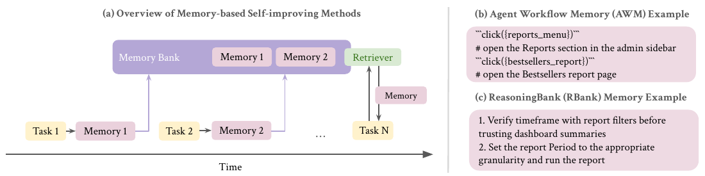
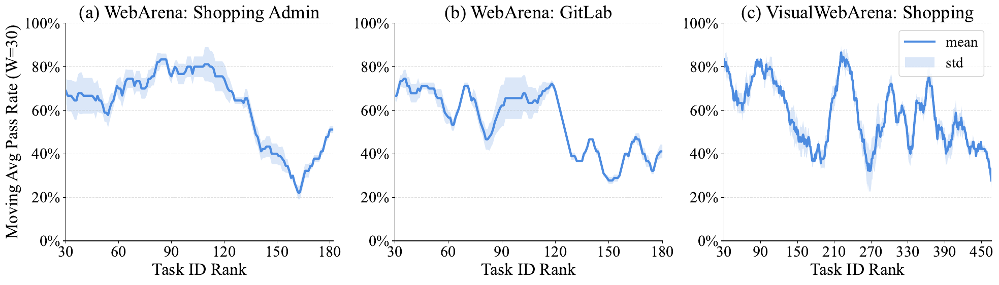
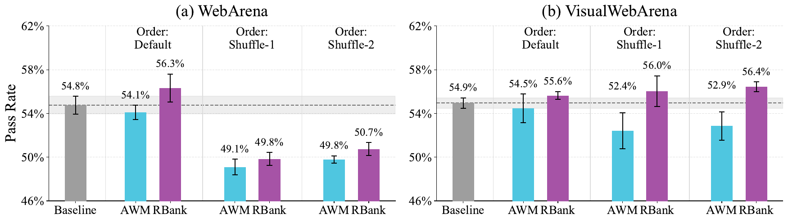
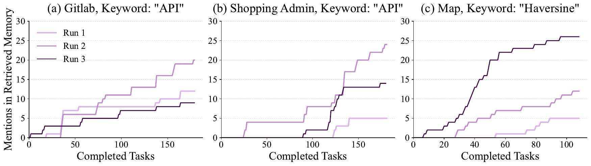
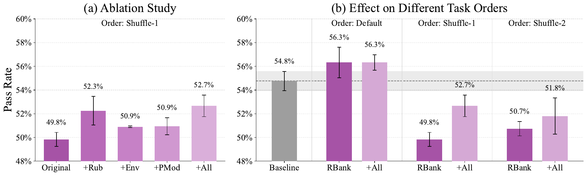

# 🖇️자기개선 에이전트의 취약성: 분산, 태스크 순서, 명세 부족

## 🎯 무엇이 문제인가

자기개선 에이전트, 즉 과거 경험에서 배워 스스로 성능을 다듬어 가는 시스템은 유망한 연구 방향으로 떠올랐다. 실현된다면 반복 워크플로 자동화와 경제적 파급을 넘어, 높은 적응성을 가진 시스템과 개방형 연구 발견까지 가능해진다. 그런데 이 방향의 최근 성과들에 비해 그 시스템의 신뢰성을 스트레스 테스트하는 작업은 거의 없었다. 기업 배포 같은 실제 환경에서는 오류 허용치가 거의 없고 초기 실패 한 번이 사용자 신뢰를 잃게 만든다. 게다가 초기의 실수는 장기간에 걸쳐 조용히 연쇄될 수 있어서, 고위험 도메인에 도입될 경우 되돌릴 수 없거나 감당 못 할 비용의 영향을 낳는다. 배포에 자신을 갖기 전에 현실적이고 까다로운 조건에서 신뢰성을 비판적으로 평가해야 한다.

이 논문은 대표적인 메모리 기반 자기개선 시스템 두 가지 — Agent Workflow Memory(AWM)와 ReasoningBank(RBank) — 를 세 개의 현실적인 웹 브라우징 벤치마크(WebArena, VisualWebArena, SCUBA)에서 재평가한다. 재평가에서는 기반 언어 모델과 에이전트 harness를 모두 상향해 더 강한 베이스라인을 세우고, 평가 범위를 두 축으로 넓힌다. 하나는 동일 설정을 여러 번 돌려 **분산**을 정량화하는 것이고, 다른 하나는 태스크를 무작위로 섞어 **태스크 순서**의 영향을 조사하는 것이다.

이 확장된 재평가에서 두 가지 신뢰성 문제가 드러난다. 첫째, 실행 간 분산이 우려스러울 만큼 크다. 웹 에이전트 평가가 보통 단일 실행 결과만 보고하기 때문에 선행 연구에서는 대체로 가려져 있던 사실이다. 메모리 없는 베이스라인 에이전트부터 이미 실행 간 분산이 상당하고, 자기개선 절차를 얹으면 이 분산이 더 증폭될 수 있다. 예를 들어 WebArena의 GitLab 서브셋(180개 태스크)에서 베이스라인의 최고 실행과 최저 실행 사이 절대 성능 격차는 4.4%인데, RBank를 적용하면 이 격차가 7.8%로 커진다. 둘째, 에이전트의 개선은 태스크 순서에 매우 민감하다. 선행 연구의 기본 태스크 순서는 암묵적인 쉬움→어려움 커리큘럼을 부과하며, 이것이 자기개선 방법의 성공을 위한 숨은 전제조건 역할을 한다. 기본 순서에서 RBank를 쓴 에이전트는 평균 1.5%의 성능 향상을 얻지만, 무작위로 섞은 순서에서는 4.5%의 성능 하락을 보인다. 실제 응용에서는 사용자 요청이 깔끔하게 정렬되어 도착한다고 가정할 수 없으므로 이 의존성은 시급한 문제다.

## 🧩 배경: 메모리 기반 자기개선 에이전트가 하는 일

그림 1(a)는 이 설정의 전체 구조를 보여준다. 시간축을 따라 Task 1, Task 2, …, Task N이 흐르고, 각 태스크가 끝날 때마다 Memory 1, Memory 2 …가 생성되어 위쪽의 Memory Bank에 쌓인다. 이후 태스크에서는 Retriever가 Memory Bank에서 항목을 골라 에이전트의 Memory로 넣어 준다. (b)는 AWM 메모리의 예로 `click({reports_menu})` `# open the Reports section in the admin sidebar`, `click({bestsellers_reports})` `# open the Bestsellers report page` 같은 액션-설명 쌍의 워크플로다. (c)는 RBank 메모리의 예로 "1. Verify timeframe with report filters before trusting dashboard summaries / 2. Set the report Period to the appropriate granularity and run the report"처럼 번호 매긴 통찰 문장이다.

문제 설정은 선행 연구를 그대로 따른다. 에이전트는 온라인 스트림으로 들어오는 $N$개의 태스크 $\mathcal{Q}=\{q_{0},q_{1},...,q_{N}\}$를 수행하면서 텍스트 메모리 $\mathcal{M}$을 유지해야 한다. 각 태스크 $q_{i}$에서 언어 모델 $L$을 백본으로 삼는 에이전트는 매 시점 $t$마다 과거 관측 ($o_{0:t-1}$)과 과거 액션 ($a_{0:t-1}$)으로부터 액션 $a_{t}\in\mathcal{A}$를 생성한다. 즉 $a_{i}\leftarrow\pi_{L}(o_{0:t-1},a_{0:t-1};\mathcal{M},\mathcal{A})$이다. 각 태스크가 끝나면 에이전트는 보상 $r\in[0,1]$을 받고, 보상 $1$은 태스크를 "통과"했음을 뜻한다. 메모리 구성 모듈 $C$는 태스크 궤적과 (선택적으로) 보상을 근거로 메모리 $\mathcal{M}$을 갱신하라는 지시를 받는다.

**Agent Workflow Memory (AWM)**는 각 태스크가 끝날 때 성공한 궤적에서 재사용 가능한 워크플로를 요약하도록 메모리 모듈에 지시한다. 원 구현을 따라 새 워크플로는 기존 워크플로와 중복인지 검사되고, 이후 태스크 수행 시 모든 워크플로가 에이전트의 컨텍스트에 포함된다.

**ReasoningBank (RBank)**는 더 최근 방식으로, 메모리 항목을 구조화된 단계별 워크플로에 한정하지 않고 미래의 유사 태스크에 도움이 될 만한 더 일반적인 추론 흔적과 통찰까지 담는다. 원 구현을 따라 메모리 항목은 성공 궤적과 실패 궤적 모두에서 생성되며, retriever가 이후 태스크에 가장 관련 있는 과거 메모리를 골라 준다.

## 🔬 어떻게 재평가했나

### 벤치마크

**WebArena**는 널리 채택된 벤치마크로 Shopping, Shopping Admin, Gitlab, Reddit, Map, Multisite 여섯 도메인에 걸친 812개의 웹 브라우징 태스크로 이루어진다. **VisualWebArena**는 WebArena를 확장해 질문이나 웹사이트 안의 시각 요소를 이해해야 하는 난이도를 더한 것으로, Classifieds, Reddit, Shopping 세 도메인에 910개 태스크가 있다. **SCUBA**는 웹 기반 CRM 소프트웨어에서 플랫폼 관리자(Admin), 영업 담당(Sales), 서비스 담당(Service)의 활동을 자동화하는 기업 중심 벤치마크다. 최근 웹사이트 업데이트로 무효가 된 태스크를 수작업으로 제외해 총 267개 태스크가 남았다.

### 선행 연구의 평가 관행과 이 논문의 평가 관행

극소수의 예외를 빼면, 웹 에이전트 평가에 관한 선행 연구는 에이전트를 **단 한 번 실행**한 pass rate를 보고한다. 분야 초기 탐색 단계와 비용을 생각하면 허용될 만하지만, 최근 연구는 에이전트 성능이 실행마다 달라질 수 있음을 지적하므로 여러 번의 실행에 걸친 포괄적 재평가가 필요하다. 또한 자기개선 방법을 웹 브라우징 태스크에 적용할 때 실험은 보통 **미리 정해진 태스크 순서** 아래에서 수행되는데, 이 논문의 분석대로 그 순서는 암묵적인 쉬움→어려움 커리큘럼을 유도해서 자기개선 방법에 뜻하지 않게 유리하게 작용할 수 있다.

이 논문은 두 축으로 평가를 넓힌다. (1) 실행 간 **분산**을 더 잘 특징짓기 위해 관심 있는 실험마다 **동일한 실행을 3회** 수행한다. 평가 지표는 도메인별 평균 pass rate(pass@1)와 3회 실행에 걸친 표준편차, 3회 중 최고-최저 격차 같은 **run 수준** 통계에 초점을 둔다. 여기서 하나의 *run*은 시퀀스의 모든 태스크를 거치며 진화하는 것을 가리키며, 논문의 주 관심사도 자기개선 run 사이의 분산이다. 메모리 없는 베이스라인에 대해서는 pass@3, pass^3 같은 *task 수준* 집계 지표도 부록에 보고한다. (2) 자기개선에서 **태스크 순서**의 영향을 조사하기 위해 선행 연구가 쓰는 기본 순서에 더해 **섞인 순서 두 가지**(Shuffle-1, Shuffle-2)로 실험한다.

### 실험 세부

WebArena와 VisualWebArena에는 WALT의 베이스라인 에이전트 harness를, SCUBA에는 SCUBA 논문의 베이스라인 harness를 쓴다. 이들을 "(메모리 없는) 베이스라인"이라 부르고, 자기개선 방법(AWM과 RBank)은 이 베이스라인 위에 얹는다. 따로 명시하지 않는 한 에이전트 백본 모델과 메모리 구성 모델 모두 `GPT-5-mini`를 쓴다. 메모리를 구성할 때는 의도적으로 ground-truth 보상 $r$을 모델에 제공한다. LLM-Judge에서 나온 프록시 보상 $\hat{r}$을 쓰는 선행 연구와 대비되는 선택인데, 프록시 보상이 noisy해서 분석을 더 복잡하게 만든다고 판단했기 때문이다.

비용은 `GPT-5-mini` 백본 기준으로 WebArena 812개 태스크 전체를 한 번 도는 데 약 \$25, SCUBA 267개 태스크 전체를 한 번 도는 데 \$29다. 이 추정치는 메모리 없는 베이스라인 기준이다. 메모리 기반 방법에서는 (a) 추가 LM 호출로 메모리를 생성하는 비용과 (b) 메모리를 컨텍스트에 포함하는 비용이 더 들지만, 두 항목 모두 추가 비용은 미미할 것으로 본다. 모든 실험 코드는 표준 64-CPU 서버에서 호스팅·실행됐다.

## 📊 결과 1: 분산

### 웹 에이전트 평가는 본질적으로 noisy하다

표 1의 "Baseline" 행에서 메모리 없는 베이스라인의 분산 관련 지표를 볼 수 있다. 실행 간 noise와 무작위성은 예상되는 것이지만, 선행 연구가 보통 단일 실행의 평균 pass@1을 보고하므로 그 분산의 크기를 정량화하는 일이 중요하다. WebArena의 GitLab 서브셋에서 최고 실행과 최저 실행 사이 격차는 놀랍게도 4.4%에 이르는데, 맥락에 따라서는 의미 있는 개선으로 여겨질 만한 크기다. 이 도메인의 표준편차도 1.98%에 달한다. VWA와 SCUBA에서도 도메인 수준 최고-최저 격차가 각각 2.4%, 6.7%까지 나타나, 단일 실행 평가가 오도할 수 있고 부정확한 결론으로 이어질 수 있다는 우려를 낳는다.

### 자기개선 방법은 분산을 증폭할 수 있다

표 1에서 베이스라인 행과 자기개선 방법 행을 비교하면, 이 방법들을 베이스라인 위에 적용했을 때 분산이 크게 늘어나는 일관된 경향이 보인다. 24개 사례 중 17개에서 분산이 증가했고, 11개 사례에서는 상대 증가폭이 50%를 넘는다. 이는 자기개선 방법의 **stateful**한 성질에서 곧바로 따라 나오는 결과다. 메모리 구성은 앞선 태스크 결과에 조건부이며 확률적 LLM 샘플링의 영향도 받는다. 그 결과 초기의 무작위성이 시간이 지나며 복리처럼 쌓여 실행마다 상당히 다른 메모리 상태로 귀결된다. 이 현상 자체는 예상 가능하지만 평가 관점에서는 우려스럽다. 표준편차가 3.9%에 이르고, 최고-최저 격차도 WebArena의 Map 도메인에서 8.2%, Gitlab 도메인에서 7.8%까지 벌어졌기 때문이다.

표 1: 3회 실행에 걸친 분산 관련 지표. 메모리 기반 자기개선 에이전트 방법은 24개 사례 중 17개($\approx$ 71%)에서 분산 증가를 낳았고, 그중 11개 사례는 상대 증가폭이 50%를 넘는다. 괄호 안은 베이스라인 대비 상대 변화다.

| **Method** | **WebArena** |  |  |  |  |  | **VisualWebArena** |  |  | **SCUBA** |  |  |
|----|----|----|----|----|----|----|----|----|----|----|----|----|
|  | **Shopping** | **Admin** | **GitLab** | **Map** | **Reddit** | **Multisite** | **Classifieds** | **Shopping** | **Reddit** | **Admin** | **Sales** | **Service** |
|  | \(187\) | \(182\) | \(180\) | \(109\) | \(106\) | \(48\) | \(234\) | \(466\) | \(210\) | \(158\) | \(64\) | \(45\) |
|  |  |  |  |  |  |  |  |  |  |  |  |  |
| Standard deviation of pass@1 across 3 runs (%) |  |  |  |  |  |  |  |  |  |  |  |  |
|  |  |  |  |  |  |  |  |  |  |  |  |  |
| Baseline | 1.53 | 1.19 | 1.98 | 1.30 | 1.78 | 0.98 | 1.01 | 0.83 | 1.03 | 0.30 | 1.95 | 2.77 |
|  |  |  |  |  |  |  |  |  |  |  |  |  |
| AWM | 1.26 (-18%) | 2.99 (+152%) | 1.20 (-39%) | 1.98 (+53%) | 2.48 (+39%) | 0.98 (0%) | 1.79 (+78%) | 1.01 (+22%) | 2.38 (+131%) | 2.09 (+600%) | 1.28 (-35%) | 2.77 (0%) |
| RBank | 1.33 (-13%) | 2.12 (+79%) | 3.34 (+69%) | 3.89 (+200%) | 2.22 (+25%) | 4.28 (+336%) | 1.23 (+22%) | 1.58 (+91%) | 1.47 (+43%) | 1.58 (+429%) | 1.47 (-24%) | 3.78 (+36%) |
|  |  |  |  |  |  |  |  |  |  |  |  |  |
| Best-worst gap of pass@1 in 3 runs (%) |  |  |  |  |  |  |  |  |  |  |  |  |
|  |  |  |  |  |  |  |  |  |  |  |  |  |
| Baseline | 3.74 | 2.75 | 4.44 | 2.75 | 3.77 | 2.08 | 2.14 | 1.93 | 2.38 | 0.63 | 4.69 | 6.67 |
|  |  |  |  |  |  |  |  |  |  |  |  |  |
| AWM | 2.67 (-29%) | 6.59 (+140%) | 2.78 (-38%) | 4.59 (+67%) | 5.66 (+50%) | 2.08 (0%) | 4.27 (+100%) | 2.15 (+11%) | 5.71 (+140%) | 4.43 (+600%) | 3.12 (-33%) | 6.67 (0%) |
| RBank | 3.21 (-14%) | 4.95 (+80%) | 7.78 (+75%) | 8.26 (+200%) | 4.72 (+25%) | 10.42 (+400%) | 2.99 (+40%) | 3.86 (+100%) | 3.33 (+40%) | 3.80 (+500%) | 3.12 (-33%) | 8.89 (+33%) |

### 강한 "초기화"에서는 자기개선의 효과가 줄어든다

AWM과 RBank가 나온 뒤로 웹 브라우징 태스크에서 언어 모델의 능력은 크게 발전했다. 표 2에서 보듯 RBank는 `Gemini-2.5-Pro`로 WebArena 684개 태스크 서브셋에서 평균 성공률 53.9%를 보고한다. 더 최신인 GPT-5-mini 기반의 이 논문 베이스라인 에이전트는 같은 조건에서 55.3%로, 그들이 보고한 메모리 강화 결과(53.9%)에 필적하는 성능을 이미 달성한다. VisualWebArena에서 이 논문의 베이스라인은 54.9%로, 이 벤치마크에서 보고된 state-of-the-art 결과에 필적한다. (2026년 5월 1일 기준 VisualWebArena 리더보드의 최고 성능은 54.0%다.)

| **AWM** (Claude-3.5-Sonnet) |      | **RBank** (Gemini-2.5-Pro) |      |
|-----------------------------|------|----------------------------|------|
| 812 Tasks                   |      | 684 Tasks                  |      |
| Baseline                    | 32.7 | Baseline                   | 46.7 |
| +AWM                        | 36.3 | +RBank                     | 53.9 |
|                             |      |                            |      |
| Our Baseline                | 54.8 | Our Baseline               | 55.3 |

표 2: 선행 연구의 WebArena 결과와 이 논문의 결과를 나란히 놓은 것. GPT-5-mini 기반의 메모리 없는 베이스라인이 선행 연구의 메모리 기반 에이전트를 이미 능가한다.

이 베이스라인 위에서 재평가하면 더 나은 "초기화" 아래 자기개선 접근들의 효과를 다시 따져볼 수 있다. 표 3처럼 자기개선 방법들은 일관된 이득을 내지 못한다. 예를 들어 RBank는 이 논문의 베이스라인 대비 평균 1.5% 향상을 얻지만, 이 이득은 (3회 실행에 대해 unpaired t-test로 계산한) p-value 0.23에 해당해 통계적 유의성이 제한적임을 뜻한다. WebArena에서 인간 성능은 78%이므로 개선의 여지 자체는 아직 남아 있다. 이 결과들은 선행 방법들이 능력이 떨어지는 웹 에이전트에는 효과적이었지만, 고품질 메모리를 구성하고 자기개선 과정을 지속시키려면 더 발전된 접근이 필요함을 시사한다.

| **Method** | **WebArena** | **VisualWebArena** | **SCUBA**   |
|------------|--------------|--------------------|-------------|
| Baseline   | 54.8         | 54.9               | 49.6        |
| AWM        | 54.1 (-0.7)  | 54.5 (-0.4)        | 50.1 (+0.5) |
| RBank      | 56.3 (+1.5)  | 55.6 (+0.7)        | 51.1 (+1.5) |

표 3: 세 벤치마크의 전체 결과. 3회 실행 평균 pass@1이며, AWM/RBank 칸은 점수와 괄호 안 베이스라인 대비 절대 이득을 보여준다. 베이스라인이 강해지면 이 방법들의 성능 이득은 줄어든다.

부록의 표 5는 WebArena에서 메모리 없는 베이스라인의 task 수준 지표다. 도메인별 Avg. Pass는 Shopping 45.8, Admin 62.6, GitLab 53.9, Map 53.2, Reddit 69.5, Multisite 34.0, 전체 54.8이고, Pass@3는 각각 55.1, 72.0, 63.3, 67.0, 82.1, 47.9, 전체 65.4, Pass^3는 34.8, 52.2, 45.0, 40.4, 53.8, 20.8, 전체 43.3이다. 표 6은 VisualWebArena와 SCUBA에 대한 같은 지표다. VisualWebArena의 Avg. Pass는 Classifieds 60.1, Shopping 57.6, Reddit 43.3, 전체 54.9이고 Pass@3는 73.9, 69.1, 51.4, 전체 66.3, Pass^3는 44.9, 45.1, 33.8, 전체 42.4다. SCUBA는 Avg. Milestone이 Admin 46.7, Sales 61.8, Service 42.3, 전체 49.6이고, Avg. Pass는 26.2, 39.6, 28.1, 전체 29.7, Pass@3는 39.2, 57.8, 40.0, 전체 43.8, Pass^3는 13.9, 20.3, 13.3, 전체 15.4다. (표 3의 SCUBA 수치 49.6은 Avg. Milestone에 해당한다.)

## 🔀 결과 2: 태스크 순서

### 기본 순서에는 암묵적 쉬움→어려움 커리큘럼이 있다

그림 2는 메모리 없는 베이스라인 에이전트가 기본 순서(작은 태스크 ID → 큰 태스크 ID)로 태스크를 수행할 때의 태스크 성공률 이동평균(window = 30)을 보여준다. (a)와 (b)의 곡선은 높은 pass rate(75% 근처)에서 시작해 태스크 ID가 150을 넘으면 40% 아래로 떨어진다. 앞쪽 태스크가 에이전트의 능력 범위 안에 들 가능성이 높다는 뜻으로, 암묵적인 쉬움→어려움 커리큘럼을 반영한다. (c)의 시퀀스도 쉬운 태스크로 시작하지만 후반부는 더 복잡한 진동 패턴을 보인다. 그림에서 축을 읽은 대략값으로는, (a) WebArena Shopping Admin은 rank 90 근처에서 약 80%대 중반의 봉우리를 만들었다가 rank 160 부근에서 약 20%대 초반의 최저점까지 내려오고, (b) WebArena GitLab은 rank 120 부근까지 60~70%대를 오르내리다가 그 뒤 30~40%대로 떨어지며, (c) VisualWebArena Shopping은 80%대 초반에서 시작해 여러 차례 30%대와 80%대를 오가다 rank 450 부근에서 30% 아래로 내려간다. 음영대는 3회 실행의 표준편차다.

이 기본 순서는 벤치마크 구축 과정의 부산물일 수 있다. 주석자가 단순한 태스크부터 시작해 점점 어려운 것을 도입하는 식이다. 이 순서에서 자기개선 접근을 평가하는 것도 자연스럽긴 하지만, 현실의 사용자는 임의의 순서로 태스크를 제출할 수 있다. 배포 전에 자기개선 시스템을 스트레스 테스트하려면 대안적인 태스크 순서에서 평가하는 것이 중요하다.

### 섞인 순서에서는 성능이 떨어진다

그림 3은 WebArena와 VisualWebArena에서 기본 순서와 두 개의 섞인 순서로 얻은 pass rate를 막대로 보여준다. 그림에 인쇄된 값은 (a) WebArena에서 Baseline 54.8%, Default 순서의 AWM 54.1%·RBank 56.3%, Shuffle-1의 AWM 49.1%·RBank 49.8%, Shuffle-2의 AWM 49.8%·RBank 50.7%이고, (b) VisualWebArena에서 Baseline 54.9%, Default의 AWM 54.5%·RBank 55.6%, Shuffle-1의 AWM 52.4%·RBank 56.0%, Shuffle-2의 AWM 52.9%·RBank 56.4%다. 모든 막대에 error bar가 붙어 있지만 그림 자체는 그것이 무엇을 나타내는지 명시하지 않으며, 두 패널 모두 베이스라인 근처에 수평 점선과 음영대가 그려져 있다. 캡션에 따르면 섞인 순서를 쓸 때 8개 사례 중 6개에서 성능이 유의하게 떨어진다.

WebArena에서는 섞인 순서를 쓸 때 성능이 유의하게 하락한다. 예컨대 Shuffle-1에서는 54.8%에서 49.1%(AWM), 49.8%(RBank)로 떨어진다. VisualWebArena에서도 AWM은 태스크 순서의 영향을 크게 받지만 RBank는 이 변화에 덜 민감하다. 섞인 태스크 순서가 모델이 배우기 어려운 조건을 만드는 것은 맞지만, 이런 까다로운 설정에서도 전체 성공률만큼은 메모리 없는 베이스라인과 같은 수준으로 유지되기를 기대하게 된다. 그런데 실제로는 성능이 더 나빠지는 경우가 잦아, 현실 환경에서 이 자기개선 방법들의 신뢰성에 우려를 낳는다.

## 🔍 원인 가설: 명세 부족

증폭된 분산과 섞인 순서에서의 예상 밖 성능 하락을 이해하기 위해, RBank 방법이 만들어 낸 에이전트 메모리를 수작업으로 검사했다. 여기서 **명세 부족(underspecification)** 이 이 문제들의 잠재적 원인으로 지목된다. 세 가지 주목할 만한 발견이 있다.

### 환경 명세 부족: 지원되지 않는 액션에 관한 메모리가 반복된다

수작업 검사에서 그럴듯하지만 웹 에이전트 환경에서는 적용 불가능한 메모리가 여러 건 확인됐다. 예를 들어 에이전트는 메모리에서 "API"를 자주 언급하며 API 기반 해법을 권한다. 그러나 실험에 쓰인 웹 브라우징 환경은 그런 액션을 지원하지 않고, RBank 구현에서는 이 핵심 제약이 메모리 제안 모듈에 제공되지 않아 불일치가 생긴다.

그림 4는 키워드를 포함한 메모리 항목을 에이전트가 검색해 조건으로 삼은 횟수를 완료 태스크 수에 대한 계단형 누적 곡선으로 보여준다. (a) Gitlab의 "API", (b) Shopping Admin의 "API", (c) Map의 "Haversine"이며 각 패널에 Run 1·2·3이 그려져 있다. 곡선에는 수치가 인쇄되어 있지 않아 아래 값은 축에서 읽은 근사치다. (a)에서는 끝점 기준 Run 2가 약 20으로 가장 높고 Run 1이 약 12, Run 3이 약 9다. (b)에서는 Run 2가 약 24, Run 3이 약 14, Run 1이 약 5로, Run 1은 태스크 약 124개를 완료할 때까지 0에 머물다가 뒤늦게 올라간다. (c)에서는 Run 3이 약 7개 태스크 시점부터 일찍 올라가기 시작해 끝점에서 약 26에 이르고, Run 2가 약 12, Run 1이 약 5에 그친다. 이런 언급이 도메인 전반에 나타나므로 에이전트에게 distraction이나 혼란을 줄 수 있다.

비슷하게 에이전트는 메모리에 "user confirmation"을 자주 포함한다(WebArena 3회 실행에서 26회, VisualWebArena 3회 실행에서 22회). 많은 태스크 질의가 모호하므로 사용자 확인을 받는 것은 일반적으로는 바람직하지만, 평가 환경은 이를 지원하지 않는다. 그 결과 에이전트가 제한 시간에 도달할 때까지 "wait" 액션을 반복해 내는 상황으로 이어질 수 있다.

### 태스크 명세 부족: 오해, 과잉 사고, 무관한 메모리

WebArena의 태스크 질의는 종종 모호해서 에이전트의 의도치 않은 행동을 부른다. 예를 들어 WebArena 태스크 118에서 에이전트는 "I have jaw bruxism problem, show me something that could alleviate the problem."을 수행하도록 요구받는다. 의도된 목표는 쇼핑 사이트에서 관련 상품(즉 마우스 가드)을 찾는 것인데, 에이전트는 더 문자 그대로의 해석을 택해 "consult your dentist or doctor for personalized advice"라고 답한다. 나아가 이 태스크의 실패를 되돌아보라는 프롬프트를 받으면 "gather targeted patient/context details before giving medical guidance" 같은 무관한 메모리를 만들어 낸다. 벤치마크 evaluator의 버그가 평가에서 false negative를 낳고, 그 결과 에이전트가 과잉 사고하며 엉뚱한 메모리를 생성하는 사례도 관찰된다.

표 7은 태스크 118의 전체 사례다. Ground-Truth Evaluator는 "Jaw bruxism"과 "mouth guard"가 최종 페이지 내용에 포함되어야 한다고 요구하는데, 에이전트는 쇼핑 사이트를 아예 브라우징하지 않고 1스텝 만에 태스크를 끝내며 야간 가드/교합 스플린트 같은 일반 정보를 답한다. 그때 남긴 메모리는 제목 "Always gather targeted patient/context details before giving medical guidance", 설명 "Before offering specific treatments for a health problem, ask concise clarifying questions about symptoms and context.", 내용 "Ask whether the problem occurs during sleep or wakefulness, severity/frequency, current treatments, dental history, relevant medications, pregnancy, and presence of red-flag symptoms (severe pain, tooth damage, jaw locking, daytime sleepiness). These details let you tailor recommendations (e.g., conservative self-care vs. urgent dental referral) and avoid unsafe suggestions."이다.

표 8은 evaluator 버그 사례인 WebArena 태스크 329다. 질의는 "How much I spend on 4/19/2023 on shopping at One Stop Market?"이고 정답 문자열은 "0"을 포함해야 한다. 에이전트는 per-page를 50으로 설정한 뒤 37건의 주문 이력 전체를 훑어 4/19/2023 주문이 없음을 확인하고 "the amount spent on 4/19/2023 at One Stop Market is \$0.00"이라 답한다. 저자 주석에 따르면 WebArena evaluator는 "0.00"을 하나의 토큰으로 처리해 "0"과 다르다고 판정한다. 이 실패에서 에이전트가 남긴 메모리는 제목 "Consider alternate accounts and guest/third-party purchases", 설명 "Missing orders in one account can result from purchases made under a different account, guest checkout, or through a different platform.", 내용 "If an order date isn't found, check other user accounts, alternate email addresses or phone numbers, loyalty profiles, and third-party marketplaces or apps the user might have used."로, 태스크의 실제 문제와는 무관하다.

### 메모리는 "전염된다": Map 태스크의 Haversine 공식 사례

놀랍게도 WebArena의 map 도메인에서 구면 위 두 점 사이 최단 거리를 계산하는 "Haversine Formula" 언급이 관찰된다. 더 들여다보니, 두 지점 사이 거리를 구하라는 태스크에서 map 웹사이트가 항상 기대대로 로드되거나 제때 응답하지는 않았다. 그 결과 에이전트는 Haversine 공식으로 거리를 추정하는 대체 전략을 채택한다. 이 근사가 이따금 정답을 내고, 그러면 에이전트는 이 의도치 않은 전략을 메모리에 편입한다. 그림 4에서 보듯 이 전략의 도입 시점은 확률적으로 보이며, "Haversine"이 메모리에 일찍 추가될수록 이후 태스크에서 더 자주 검색되고 사용된다. 이 효과가 실행 간 분산 증가에 기여할 수 있다.

표 9는 그 구체적 사례인 WebArena 태스크 38이다. 태스크는 "Check if Duquesne University in Pittsburgh can be reached in one hour by car from Pittsburgh Airport."이고 rubric은 답변 문자열에 "yes"가 포함될 것을 요구한다. 에이전트는 OpenStreetMap 경로 페이지가 JavaScript 미사용 메시지를 띄워 OSRM 경로 요약을 얻지 못했다고 밝힌 뒤, URL에 박힌 좌표(출발지 40.4918, -80.2370 피츠버그 국제공항, 도착지 40.4365, -79.9905 듀케인 대학 부근)로 대권거리를 계산하고 라우팅 계수를 적용한다. 계산은 직선(haversine) 거리 $\approx 21.7$ km ($\approx 13.5$ miles), 라우팅 계수 $\approx 1.3$을 적용한 추정 주행거리 $\approx 28$–29 km ($\approx 17.5$–18 miles), 유효 속도별 추정 주행시간 60 mph $\rightarrow$ $\sim 17$–18 min, 40 mph $\rightarrow$ $\sim 26$–28 min, 심한 정체 $\approx 30$ mph $\rightarrow$ $\sim 35$–40 min이고, 보수적 상한으로 대부분의 상황에서 60분을 훨씬 밑돌며 극단적 사고만이 한 시간을 넘길 수 있다고 결론짓는다. 최종 답은 "Yes"(전형적 추정 $\sim 20$–40분)이다. 여기서 남은 메모리는 제목 "Use URL or page coordinates as a robust routing fallback.", 설명 "If the directions UI or routing engine fails to render, extract coordinates from the page or URL and compute an offline route estimate.", 내용 "Parse origin and destination latitudes and longitudes embedded in the page or URL, compute straight-line (haversine) distance, and convert it to plausible driving distance using a routing multiplier (e.g., $\sim 1.2$–1.4). This provides a reliable fallback when live routing is unavailable."다. 부록의 확장 관련 연구에서 저자들은 이 Haversine 사례를 에이전트 학습 과정에서 나타난 "reward hacking"의 일종으로 본다.

## 🛠️ 개입: 메모리 구성에 정보를 더하기

RBank의 원 구현에서 메모리 구성 모듈은 최소한이고 일반적이다. 즉 "You need to extract and summarize useful insights in the format of memory items based on the agent's successful trajectory." 수준이다. 앞의 발견에 비추어 보면 이런 일반적 서술은 불충분할 수 있고, 특히 베이스라인 에이전트가 이미 강해서 의미 있는 개선을 얻으려면 더 구체적인 피드백이나 메모리가 필요한 상황에서 그렇다. 세 가지 추가 정보를 메모리 구성 단계에 넣어 이 한계를 다룬다.

**Rubrics and Scores (+Rub).** 고려한 모든 벤치마크에서 태스크는 함수 기반 rubric으로 평가된다. 예를 들어 WebArena는 `must_include`, `exact_match`, `fuzzy_match` 세 종류의 평가 함수를 쓰며, 에이전트가 반환한 답이나 최종 상태에 적용할 수 있다. 앞서 다룬 jaw bruxism 사례(표 7)처럼 모호한 태스크 질의는 여러 해석과 결과를 낳는다. rubric을 제공하면 의도된 태스크를 명확히 하고 결과 메모리의 관련성을 높이는 데 도움이 된다. 단, 이 rubric은 태스크 완료 **후** 메모리 구성 시점에만 제공되며 태스크 수행 중에는 에이전트가 알지 못한다.

**Environment Feedback (+Env).** click이나 selection 액션의 성공 여부 같은 웹 환경 피드백을 메모리 구성 과정에 넣는다. 실제로 에이전트가 일련의 액션(예: item 31 클릭 후 textbox 41 채우기)을 내는데, item 31을 클릭한 뒤에는 textbox 41이 더 이상 페이지에 없어 액션 에러가 나는 경우가 관찰된다. 이런 정보는 원래 메모리 생성 과정에 포함되지 않아 에이전트가 비슷한 UI 상호작용 실수를 반복하게 만들 수 있다. 이 피드백을 넣으면 이후 태스크의 성능 개선에 유용한 신호가 된다.

**Prompt Modification (+PMod).** 앞선 분석은 에이전트가 API 기반 액션 제안이나 사람에게 확인 요청 같은 의도치 않은 전략을 "학습"할 수 있음을 보였다. 이런 행동은 그럴듯하지만 에이전트 환경에서 지원되지 않는다. 이를 다루기 위해 그런 전략을 명시적으로 억제하는 프롬프트 편집을 도입한다. 아울러 절차적 지식과 사이트 내비게이션 구조를 포함하도록 장려해, 웹 브라우징 태스크에 더 관련 있는 메모리를 생성하도록 모델을 유도한다.

**+All.** 마지막으로 위 세 가지 수정을 모두 포함한 설정도 실험한다.

표 4는 세 종류 추가 정보의 예시다(지면상 잘려 있음).

| Rubrics and Scores (+Rub): |
|----|
| Evaluator: string_match \| Score: 0.0 (FAIL) |
| Prediction: "Top-2 best-selling products in 2022: 1) Quest Lumaflex™ Band, 5 units; 2) Cruise Dual Analog Watch, 4 units." |
| must_include: "Quest Lumaflex™ Band" → PASS |
| must_include: "Sprite Stasis Ball 65 cm" → FAIL |
|  |
| Environment Feedback (+Env): |
|  |
| Actions: click(31), input_text(41, “05/01/2022”), input_text(44, “12/31/2022”), click(59) \# Preceding Context |
| Action error: Error executing action input_text: Failed to input text into index 41 |
|  |
| Prompt Modification (+PMod): |
|  |
| \- **INCLUDE**: Procedural knowledge, reusable workflows, site navigation structure, UI interaction tips. |
| \- **STRICTLY AVOID**: API or programmatic solutions, visiting external websites, requesting human confirmation, or task-specific details tied to a particular site or query. |

### 결과

그림 5(a)는 Shuffle-1 순서의 RBank 실험에 각 수정을 적용한 ablation이다. 그림에 인쇄된 값은 Original 49.8%, +Rub 52.3%, +Env 50.9%, +PMod 50.9%, +All 52.7%로, 각 추가 정보가 완만한 성능 향상을 준다. 셋을 결합하면 원래 RBank 대비 2.9% 향상이다(49.8% $\rightarrow$ 52.7%). 그림 5(b)는 +All을 Default와 Shuffle-2 순서에도 적용한 결과로, Baseline 54.8%, Default에서 RBank 56.3%와 +All 56.3%, Shuffle-1에서 RBank 49.8%와 +All 52.7%, Shuffle-2에서 RBank 50.7%와 +All 51.8%다. 즉 Shuffle-2에서 1.1% 향상이 관찰되고 Default 순서에서는 성능이 유지된다. 모든 막대에 error bar가 있으나 그 의미는 그림에 명시되어 있지 않고, (b)에는 베이스라인 근처에 이름 없는 수평 음영대와 점선이 있다.

종합하면 메모리 구성 시 추가 정보를 넣는 것은 이롭고 방해가 되지 않으므로, 그런 정보를 얻을 수 있다면 메모리 구성 단계에 넣기를 권한다. 다만 이 개선을 더해도 에이전트는 Shuffle-1과 Shuffle-2에서 여전히 메모리 없는 베이스라인에 못 미친다. 실제로 이 세 종류의 추가 정보는 문제를 다루려는 초기 시도이며 명세 부족의 모든 원천을 다 포착하지는 못할 수 있다. 다양한 태스크 순서에 대한 robustness에 기여하는 다른 요인들도 존재하며 아직 규명되지 않았을 수 있다. 이 문제에 대한 추가 조사는 향후 과제로 남긴다. 전체적으로 이 개입들은 섞인 순서 설정에서 관찰된 성능 하락의 31%를 메우며, 남은 69%의 격차는 이 취약성을 완전히 극복하려면 아직 밝혀내고 해결해야 할 근본 문제가 있음을 시사한다.

## 🧭 권고와 결론

두 개의 확립된 메모리 기반 자기개선 방법을 다시 평가한 결과, 이 시스템들은 더 까다로운 설정에서 취약하다. 자기개선 실험의 결과는 유의한 분산을 보일 수 있고, 이는 단일 실행 기반 평가가 진전의 정확한 측정을 가로막을 수 있다는 뜻이다. 또한 베이스라인이 이미 강하거나 태스크가 무작위 순서로 도착하는 까다로운 설정에서 에이전트는 자기개선하는 것이 아니라 오히려 퇴보한다.

**평가에 대한 권고.** 단일 실행 결과는 조심해서 해석해야 하며, 대신 여러 번의 실행과 무작위화된 태스크 순서에 걸쳐 결과를 보고하는 것을 강하게 권장한다. 나아가 새 방법은 먼저 잘 명세된 태스크로 이루어진 벤치마크에서 시범 적용하고, 그다음 명세가 부족한 태스크로 스트레스 테스트해 배포 전에 최악 성능을 추정하기를 권한다.

**시스템 개발에 대한 권고.** 적절한 검증 메커니즘이 없으면 에이전트의 메모리는 진짜로 배운 교훈이 아니라 검증되지 않은 가설일 뿐이다. 그것은 틀릴 수 있고, 더 중요하게는 시간이 지나며 이후 태스크로 부정적으로 연쇄된다. 향후 연구는 문제 있는 메모리를 걸러 내 장기 robustness를 보장하는 메모리 검증 메커니즘을 조사해야 한다. 또한 태스크와 환경의 명세는 미묘한 과제다. 명세 부족은 완전히 미리 내다볼 수 없고 실제 배포는 되돌릴 수 없는 단 한 번의 run으로 전개되므로, 반복적 과정을 통해 명세를 다듬는 것이 실행 가능한 한 가지 길이다. 결국 이 발견들은 에이전트가 의도치 않게 실패하기 전에 효과적인 인간 감독과 적시 개입을 가능케 하는 인터페이스의 개발을 요구한다.

## 🔗 관련 연구에서의 위치

이 연구는 추론만 하는(inference-only) 자기개선 설정에 초점을 둔다. 실용적 유용성, 접근 가능한 인터페이스, 그리고 forward-pass만 있는 설정에서 에이전트의 한계를 탐색하는 방법이라는 점이 동기다. 웹 브라우징 밖에서는 수학·추론·코딩 에이전트와 장기 개인화에 대해 관련 자기개선 방법들이 연구되어 왔다. 더 넓게는, 지속 학습과 자기개선("self-play")은 inference-only 패러다임 이전부터 지도 fine-tuning과 강화학습 설정에서 오래 연구되어 왔다.

메모리 구성은 파라메트릭 형태와 비파라메트릭 형태 모두를 포함한다. 이 논문은 최근 크게 주목받는 비파라메트릭 텍스트 메모리에 초점을 둔다. 워크플로 관련 메모리는 "skills"라고도 불리며 널리 연구됐다. 파라메트릭 메모리의 대표적 접근으로는 sparse memory fine-tuning이 있는데, 배경 코퍼스 대비 미지 태스크에서의 상대적 활성화에 근거해 학습 가능한 메모리 슬롯을 갱신한다. 모델 구조 관점의 메모리 메커니즘으로는 Hope와 Titans가 있다.

평가와 신뢰성 쪽에서는 도구 사용, 컴퓨터 사용, 웹 브라우징 등의 벤치마크가 있고, 에이전트 능력이 커지면서 코딩, 고객 서비스, 고객 관계 관리, 기업 운영처럼 실제 경제적 가치를 가진 태스크를 겨냥한 벤치마크도 나왔다. Rabanser et al. (2026)은 신뢰성을 능력과 나란히 놓인 일차적 평가 축으로 다루자고 주장하며, 이 논문은 그 관점에 강하게 동의한다. 이 논문은 그 관점을 단일 세션 에이전트에서 다중 세션 자기개선 에이전트로 확장하는데, 여기서는 신뢰성이 더 중요해지는 동시에 측정하기도 더 어려워진다. 또한 신뢰성은 진화해 온 학습 패러다임 전반에서 되풀이된 과제였다. 심층 강화학습, gradient 기반 meta-learning, 언어 모델 fine-tuning, prompting, in-context learning, self-correction의 안정성이 앞서 폭넓게 연구됐다. 다만 수동적 예측이나 생성에 국한됐던 이전 패러다임과 달리 오늘날의 에이전트는 되돌릴 수 없는 액션을 실행할 자율성을 부여받은 채 실제 시스템에 점점 통합되고 있다. 따라서 근저의 취약성을 체계적으로 다루지 않은 채 배포하면 계산상 오류가 누적되는 데 그치지 않고 실질적 현실 피해까지 초래할 수 있어, 신뢰성은 안전한 채택의 시급한 전제조건이 된다.

## ⚠️ 저자들이 밝힌 한계

평가는 웹 브라우징 도메인에 적용된 특정 부류의 메모리 기반 자기개선 에이전트에 국한된다. 실험 설계의 복잡성을 감안해 다룰 수 있는 범위를 유지하려고, 다른 유형의 자기개선 방법이나 다른 도메인으로 분석을 확장하지 않았다. 또한 이 분야의 발전 속도가 빨라 가장 최근에 나온 메모리 관리 기법들은 평가하지 못했다. 그럼에도 평가한 두 방법이 미니멀하고 확장성이 높으며 채택이 늘고 있으므로, 이 연구가 짚어낸 취약점은 여전히 매우 관련이 높다.

에이전트 메모리에 대한 수작업 검사는 정성적이었고 메모리의 일부에 대해서만 수행됐다. 실험 중 생성된 메모리의 양이 워낙 많아 모든 항목을 남김없이 검토하는 것은 불가능했다. 이 분석이 몇 가지 결정적 실패 양상을 드러내긴 했지만, 문서화되지 않은 다른 패턴들도 존재할 가능성이 높다. 향후 연구는 에이전트 메모리를 대규모로 분석하고, 인간 감독을 위한 새로운 확장 가능 방법을 개발하는 데서 이득을 볼 것이다.

## 🧾 노트 작성자의 관찰

표 1과 표 3은 세 벤치마크 전체를 다루지만, 태스크 순서 실험(그림 3)과 명세 부족 개입 실험(그림 5)은 WebArena와 VisualWebArena에만 적용됐고 SCUBA는 빠져 있다. 논문은 SCUBA에서 순서 실험을 하지 않은 이유를 밝히지 않는다.

초록과 본문이 말하는 "성능 하락의 31%를 메웠다"는 수치가 어떤 계산으로 나온 것인지 본문에는 명시되어 있지 않다. 그림 5의 인쇄된 값만 놓고 보면 Shuffle-1의 +2.9와 Shuffle-2의 +1.1이 있는데, 이 둘과 31%를 잇는 식은 텍스트에 적혀 있지 않다.

RBank의 평균 이득 1.5%에 대해서는 p-value 0.23을 계산해 유의성이 제한적이라고 밝히지만, 섞인 순서에서의 4.5% 하락이나 +All의 2.9% 향상에 대해서는 같은 종류의 유의성 검정 결과가 제시되지 않는다. 그림 3과 그림 5의 error bar 역시 그림 캡션에 정의가 없다(NeurIPS 체크리스트에서는 이 그림들을 error bar를 보고한 사례로 든다).

표 3의 SCUBA 열 49.6은 부록 표 6과 대조하면 Avg. Milestone이고, 같은 표의 WebArena·VisualWebArena 열 54.8·54.9는 Avg. Pass다. 본문은 이 지표 차이를 표 3 자리에서 설명하지 않으므로, 세 벤치마크의 숫자를 같은 척도로 읽지 않도록 주의가 필요하다.
