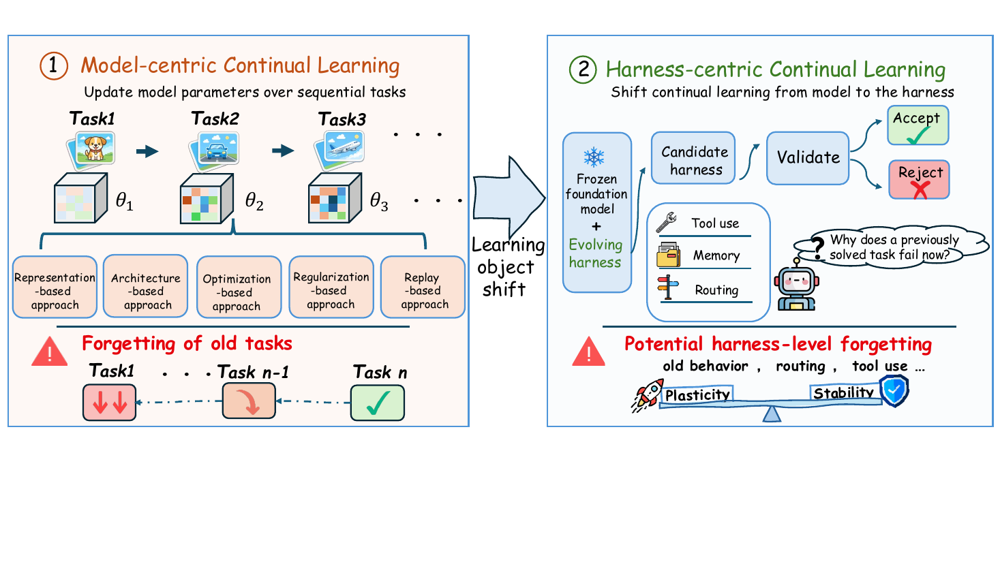
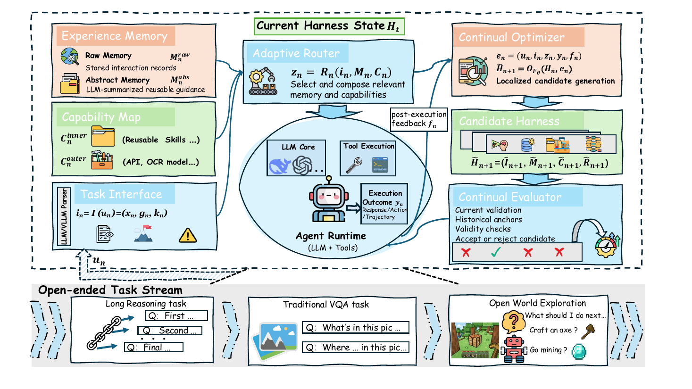
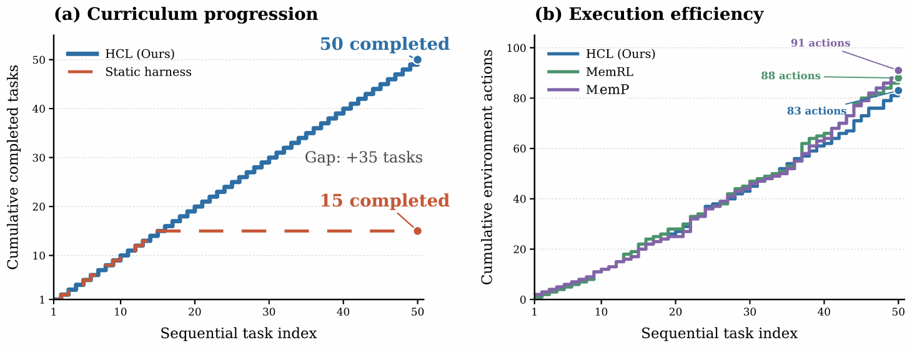
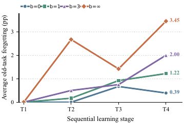
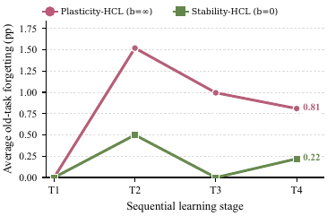

# 🖇️하네스 지속 학습 - 모델 파라미터 바깥의 지속 적응

## 🎯 지속 학습의 대상을 모델에서 하네스로 옮긴다

지속 학습은 순차적 경험에서 능력을 얻으면서 이전에 학습한 행동을 유지하는 문제를 다뤄 왔다(Delange et al., 2022; Wang et al., 2024b; Shi et al., 2025). 기존 정식화는 이 과정을 대부분 모델 파라미터, 표현, 아키텍처 구성요소를 바꾸는 방식으로 구현했고, 이 확립된 관점을 **model-centric continual learning**이라고 부른다.

에이전트 AI의 부상은 또 다른 적응 원천을 들여왔다. 파운데이션 모델이 정보를 받고, 경험을 검색하고, 행동하는 방식을 결정하는 외부 **harness**다(Jimenez et al., 2024; Xie et al., 2024; Xu et al., 2025; Chen et al., 2025; Li et al., 2026a; Meng et al., 2026). 프롬프트, 메모리, 도구·스킬 명세, 라우팅 정책은 파운데이션 모델이 얼어 있어도 상호작용을 가로질러 지속되고 진화한다. 따라서 에이전트의 적응은 더 이상 모델 상태에 갇혀 있지 않고, 하네스 상태 역시 경험을 축적하며 이후 행동을 재구성한다. 이것이 하네스를 지속 학습 연구의 새로운 대상으로 만들고, 지속 적응 연구를 모델 파라미터 너머로 확장한다.

그림 1은 지속 학습 대상의 이동을 두 패널로 나란히 놓고 "Learning object shift"라는 화살표로 잇는다. 왼쪽의 model-centric continual learning은 Task1, Task2, Task3로 이어지는 순서에서 모델을 $\theta_1, \theta_2, \theta_3$로 갱신하고, 그 아래에 representation-based, architecture-based, optimization-based, regularization-based, replay-based 다섯 접근 계열을 묶어 둔다. 하단에는 경고 삼각형과 함께 "Forgetting of old tasks"가 붙어, 나중 태스크에서 앞 태스크로 향하는 점선 화살표로 이전 태스크의 성능 저하를 표시한다. 오른쪽의 harness-centric continual learning은 "Frozen foundation model + Evolving harness"에서 출발해 candidate harness → validate → accept/reject로 이어지고, 후보 하네스 아래에 tool use, memory, routing이 나열된다. 로봇이 "Why does a previously solved task fail now?"라고 생각하는 말풍선이 붙어 있고, 하단에는 "Potential harness-level forgetting"과 함께 old behavior, routing, tool use가 열거되며, plasticity(로켓)와 stability(방패)를 양쪽에 올린 저울이 그려져 있다. 캡션은 두 설정 모두에서 적응이 새로운 행동을 개선하면서 동시에 이전에 획득한 행동을 방해할 수 있다고 말한다.

**Harness Continual Learning (HCL)** 은 얼어 있는 파운데이션 모델 주위의 하네스 상태를 순차적으로 갱신하면서 능력을 획득하고 유지하는 지속 학습 패러다임이다. 통상적인 하네스 최적화는 현재 목적을 개선하는 프롬프트, 함수, 워크플로를 탐색한다(Zhang et al., 2024; Zhang et al., 2025). HCL은 대신 갱신의 **연속**을 연구한다. 관심사는 다음 갱신이 현재 상호작용에 도움이 되는지만이 아니라, 진화하는 하네스가 앞선 갱신들이 신뢰할 만하게 만들어 둔 행동을 유지하는지에도 있다.

여기서 고유한 유지 문제가 생긴다. 하네스 구성요소들은 실행에서 결합되어 있기 때문이다. 메모리 갱신은 이전 질의에 대해 검색되는 근거를 바꿀 수 있고, 스킬 개정은 도구 사용을 바꿀 수 있으며, 라우팅 편집은 이전에 성공하던 워크플로를 깨뜨릴 수 있다. 최근 사례에 도움이 되는 갱신이 파운데이션 모델을 전혀 바꾸지 않고도 이전의 정답, 유효한 도구 호출, 성공하던 행동 궤적을 실패로 돌릴 수 있다는 뜻이다. 이 현상이 **harness-level forgetting**이고, 고전적인 안정성-가소성 문제를 모델 상태에서 하네스 상태로 확장한다.

텍스트 추론, 멀티모달 지각, 오픈월드 상호작용에 걸친 실험은 하네스 진화가 능력을 축적하고 실패 복구를 지원할 수 있음을 보이며, 여러 설정에서 대응하는 베이스라인 대비 10%를 넘는 상대적 이득을 낸다. 동시에 측정 가능한 harness-level forgetting도 나타난다. 역사적 유지 예산은 적응과 유지 사이의 작동점을 옮기며, 더 허용적인 갱신이 반드시 더 강한 최종 하네스를 만들지는 않는다.

논문의 기여는 셋이다. 하네스 지속 학습을 새 지속 학습 패러다임으로 제안·정식화해 학습 대상을 모델 상태에서 얼어 있는 모델 주위의 하네스 상태로 옮긴 것, harness-level forgetting을 식별하고 Continual Optimizer가 후보 하네스를 제안하고 Continual Evaluator가 현재·역사·유효성 검사로 커밋을 통제하는 guarded harness evolution을 개발한 것, 그리고 텍스트 추론·멀티모달 지각·오픈월드 상호작용에서 하네스 진화가 능력 축적과 실패 복구를 지원하면서도 측정 가능한 망각과 조절 가능한 안정성-가소성 트레이드오프를 보인다는 것을 실증한 것이다.

## 🔍 선행 연구와의 위치

### 하네스 엔지니어링

현대 에이전트 시스템은 추론을 태스크 지향 실행으로 바꾸기 위해 파운데이션 모델 주위에 런타임 하네스를 두른다(Li et al., 2026a; Meng et al., 2026; He et al., 2026; Zhou et al., 2026). 구현들을 가로질러 보면 지속되는 런타임 내용물은 흔히 네 가지 기능을 한다. **interface**는 원시 지시, 관측, 문서, 멀티모달 입력을 에이전트가 쓸 수 있는 형태로 바꾸고, **memory**는 상호작용 기록·요약·재사용 가능한 지침을 저장하며, **capability registry**는 도구, API, 환경 행동, 학습된 스킬을 호출 조건과 함께 기술하고, **router 또는 workflow controller**는 관련 메모리와 능력을 고르고 사용 순서를 정해 실행 컨텍스트를 조립한다. 환경 어댑터가 행동을 실행하고, 태스크별 검증기가 파이프라인 경계에서 결과를 확인한다(Gu, 2026; Chen et al., 2026b).

기존 시스템은 이 구조의 서로 다른 부분을 발전시켰다. ReAct는 추론과 환경 상호작용을 결합했고(Yao et al., 2023), Toolformer·MRKL·HuggingGPT는 외부 능력을 노출하고 조율했으며(Schick et al., 2023; Karpas et al., 2022; Shen et al., 2023), MemGPT·Reflexion·Voyager는 경험을 메모리, 피드백, 실행 가능한 스킬로 보존했다(Packer et al., 2023; Shinn et al., 2023; Wang et al., 2024a). 이 구성요소들은 함께 결합된 실행 파이프라인을 이룬다. 인터페이스가 라우터가 보는 것을 결정하고, 메모리와 능력 기술이 라우터가 고를 수 있는 것을 결정하며, 그 결과 워크플로가 모델이 행동하는 방식을 결정한다.

하네스 엔지니어링은 실행 피드백을 써서 프롬프트, 선언적 프로그램, 메모리, 도구 사용 정책, 스킬, 워크플로를 개정하기도 한다(Zhou et al., 2023; Khattab et al., 2024; Abuzakuk et al., 2026; Schick et al., 2023; Shinn et al., 2023; Wang et al., 2024a; Zhong et al., 2026; Zhang et al., 2026d). 최근 연구는 이를 구성 탐색, 계층 교차 실패 진단, 지속적 에이전트 개선으로 넓혔다(Zhang et al., 2026a; Chen et al., 2026a; Yao et al., 2026; Liu et al., 2026b). 이들은 하네스가 편집 가능하고 경험으로 개선될 수 있음을 보인다. 다만 그 주 목적은 보통 현재 태스크나 목표 분포에서의 구성요소 품질 또는 다음 구성이다. 반복적 개선만으로는 하네스 상태 전체에 대한 일반적인 유지 기준이 나오지 않는다(Lin et al., 2026). 이 논문은 변경 가능한 하네스 전체를 통일된 지속 학습 상태로 다루고, 커밋된 갱신들을 가로지르는 유지를 명시적 목적으로 삼는다는 점에서 다르다.

### 모델 중심 지속 학습

모델 중심 지속 학습은 비정상 태스크·데이터 스트림에 모델을 적응시키면서 앞선 경험에서 얻은 능력을 유지하려 한다. 그 중심 난제는 catastrophic forgetting이고, 새 지식을 학습하는 것이 모델에 인코딩된 지식을 교란할 때 발생한다(Kirkpatrick et al., 2017; Delange et al., 2022; Wang et al., 2024b; Kang et al., 2026). 표현 기반 접근은 태스크를 가로질러 유용한 특징이나 프롬프트를 학습하고(Wang et al., 2022b; Wang et al., 2022a), 최근 분석은 이런 내부 표현이 학습 시퀀스에서 어떻게 이동하는지도 살핀다(Kim et al., 2025). 아키텍처 기반 접근은 모델 구성요소를 격리·확장·선택해 태스크 간 간섭을 줄이고(Liu et al., 2026a; Lu et al., 2024), 최적화 기반 접근은 앞선 태스크 정보를 써서 갱신 궤적을 바꾸거나 그래디언트를 제약하며(Lopez-Paz and Ranzato, 2017; Abbes et al., 2026; Shang et al., 2025), 정규화 기반 접근은 옛 행동을 떠받치는 파라미터나 함수의 변화에 벌점을 준다(Kirkpatrick et al., 2017; Lewandowski et al., 2025). 리플레이 기반 접근은 앞선 예제를 보존하거나 재구성해 새 데이터와 섞는다(Urettini and Carta, 2025; Wang et al., 2025a; Yue et al., 2025; Bellitto et al., 2024). 최근 연구가 이 계열들을 대규모 언어모델과 더 넓은 지식 스트림으로 확장하고 있지만, 학습되는 상태는 여전히 모델 지식·표현·아키텍처·파라미터다(Liang et al., 2025; Zhang et al., 2026b). 이 논문은 지속 학습의 대상을 모델 밖으로 옮긴다. 파운데이션 모델 파라미터는 얼어 있고, 하네스 상태가 명시적 획득·유지 제약 아래 진화한다.

## 🧩 HCL의 정식화와 하네스 상태

### 문제 설정

고정된 파운데이션 모델 $F_{\theta}$와 상호작용 단계 $n$에 배포된 하네스 $H_{n}$을 생각한다. 모델 파라미터 $\theta$는 바뀌지 않지만, 커밋된 하네스 갱신은 이후 상호작용에 영향을 준다. **Harness Continual Learning**은 배포된 하네스를 순차적으로 갱신해 새 행동을 획득하면서 갱신 이전에 신뢰할 만하던 행동을 유지하는 문제다. 이전에 신뢰할 만하던 행동이란 올바른 응답, 유효한 도구 호출, 환경 목표를 만족시키는 행동 궤적일 수 있다. 유지란 그런 행동이 같은 입력과 실행 조건에서 평가될 때 이후 하네스 갱신 뒤에도 계속 성공하는 것을 요구한다.

상호작용 단계 $n$에서 $\mathbf{u}_{n}$은 지시, 관측, 멀티모달 입력 같은 원시 상호작용을 가리킨다. 하네스는 $\mathbf{u}_{n}$을 구조화된 상호작용 $\mathbf{i}_{n}$으로 변환한다. 이어서 얼어 있는 파운데이션 모델의 안내를 받아 $\mathbf{i}_{n}$을 선택된 메모리·능력과 결합해 실행 컨텍스트 $\mathbf{z}_{n}$을 조립한다. 모델과 외부 런타임이 $\mathbf{z}_{n}$을 실행해 결과 $\mathbf{y}_{n}$을 낸다. 실행 후 피드백은 $\mathbf{f}_{n}$이다. 상호작용 수준의 객체를 모으면

$$\mathbf{e}_{n}=\left(\mathbf{u}_{n},\mathbf{i}_{n},\mathbf{z}_{n},\mathbf{y}_{n},\mathbf{f}_{n}\right).$$ (1)

Optimizer는 파운데이션 모델 $F_{\theta}$에 갱신 규칙, 배포된 하네스, 이용 가능한 상호작용 증거를 컨텍스트로 주고 후보 하네스를 생성하게 한다.

$$\widetilde{H}_{n+1}=\mathcal{O}_{F_{\theta}}\left(H_{n},\mathbf{e}_{n}\right).$$ (2)

후보는 커밋 결정이 내려질 때까지 배포된 하네스와 분리된 채로 남는다. 이 결정을 $G_{n}\in\{0,1\}$이라 하면 배포 하네스는 다음과 같이 진화한다.

$$H_{n+1}=\begin{cases}\widetilde{H}_{n+1},&G_{n}=1,\\
H_{n},&G_{n}=0.\end{cases}$$ (3)

따라서 후보는 커밋될 때에만 이후 상호작용에 영향을 준다. 프레임워크는 HCL을 두 부분으로 실현한다. 첫째로 변경 가능한 내용물을 명시하고 그것들을 함께 버저닝해 배포 하네스 상태 $H_{n}$을 정의하고, 둘째로 커밋 전에 현재 개선·역사적 유지·유효성을 확인해 $H_{n}$에서 $H_{n+1}$로의 갱신을 통제한다.

### 네 구성요소

HCL 상태의 설계는 프롬프트 기반 태스크 인터페이스, 지속 메모리, 도구·스킬 레지스트리, 라우팅·워크플로 컨트롤러 등 선행 하네스·에이전트 시스템의 확립된 메커니즘 위에 선다(Li et al., 2026a; He et al., 2026). 어느 단일 시스템의 아키텍처를 물려받는 대신, HCL은 이 반복되는 실행 기능들을 함께 버저닝되는 네 구성요소로 조직하고, 그 변경 가능한 내용물이 명시적 획득·유지 제약 아래 순차적 경험으로부터 진화하게 한다.

$$H_{n}=\left(I_{n},M_{n},C_{n},R_{n}\right),$$ (4)

여기서 $I_{n}$, $M_{n}$, $C_{n}$, $R_{n}$은 각각 Task Interface, Experience Memory, Capability Map, Adaptive Router다. 상호작용 단계 $n$에서 $H_{n}$은 현재 배포된 하네스 전체를 나타낸다. 그 프롬프트와 처리 규칙, 저장된 경험, 재사용 가능한 스킬, 라우팅 명세는 상호작용을 가로질러 지속되며 에이전트가 미래 태스크를 다루는 방식을 함께 결정한다.

이 네 실행 기능은 에이전트 하네스에서 흔하지만, HCL은 그 변경 가능한 내용물이 **학습되고 배포되는 방식**에서 다르다. 한 구성요소의 변경이 다른 구성요소와 상호작용해 새 행동과 이전에 학습한 행동 양쪽에 영향을 줄 수 있으므로, HCL은 제안된 모든 변경을 하나의 완전한 후보 하네스로 다룬다. 후보는 현재 개선, 역사적 유지, 유효성 요건을 만족한 뒤에야 $H_{n}$을 대체한다. 그렇지 않으면 그 변경 중 어느 것도 배포 하네스에 들어가지 못한다. 하네스 내용물은 이렇게 독립적으로 편집되는 산출물의 모음이 아니라 지속 학습을 위한 조율된 메커니즘이 된다.

*표 1: 배포 하네스 $H_{n}$에서 함께 버저닝되는 네 구성요소의 실행 기능과 갱신 가능한 내용물.*

| Component | Function during execution | Contents updated in HCL |
|----|----|----|
| Task Interface $I_{n}$ | Transforms raw interactions into structured representations. | Prompts, task templates, and parsing and normalization rules. |
| Experience Memory $M_{n}$ | Provides concrete interactions and abstract guidance for reuse. | Raw interaction records and LLM-generated Abstract Memory entries. |
| Capability Map $C_{n}$ | Provides external operations and reusable inner skills. | Inner skills extracted from Abstract Memory. |
| Adaptive Router $R_{n}$ | Selects and organizes memory and capabilities. | Routing prompts, selection criteria, and workflow templates. |

그림 2는 HCL 프레임워크 전체를 보여준다. "Current Harness State H_t"라는 점선 상자 안 왼쪽 열에 세 구성요소가 쌓여 있다. Experience Memory는 저장된 상호작용 기록인 Raw Memory $M_n^{raw}$와 LLM이 요약한 재사용 지침인 Abstract Memory $M_n^{abs}$를 담고, Capability Map은 재사용 스킬인 $C_n^{inner}$와 API·OCR 모델 같은 $C_n^{outer}$를 담으며, Task Interface는 LLM/VLM 파서로 $i_n = I(u_n) = (x_n, g_n, k_n)$을 만든다. 이 셋이 중앙의 Adaptive Router로 들어가 $z_n = R_n(i_n, M_n, C_n)$을 만들고("관련 메모리와 능력을 고르고 조합"), 그 아래 큰 타원 Agent Runtime (LLM + Tools)에는 LLM Core, Tool Execution, 그리고 응답/행동/궤적으로 표현되는 실행 결과 $y_n$이 있다. 런타임에서 "post-execution feedback $f_n$"이라는 연결선이 오른쪽 위 Continual Optimizer로 올라가고, 여기서 $e_n$과 $\widetilde{H}_{n+1} = \mathcal{O}_F(H_n, e_n)$, 그리고 "Localized candidate generation"이 표시된다. Optimizer에서 아래로 Candidate Harness $\widetilde{H}_{n+1} = (\widetilde{I}_{n+1}, \widetilde{M}_{n+1}, \widetilde{C}_{n+1}, \widetilde{R}_{n+1})$가 나오고, 다시 아래 Continual Evaluator가 current validation, historical anchors, validity checks, accept or reject candidate를 나열하며 결정 스트립에 X, 체크, X, X가 찍힌 뒤 곡선 화살표가 Agent Runtime으로 돌아간다. 점선 상자 바깥 아래에는 "Open-ended Task Stream"이 있어 Long Reasoning task(Q: First… / Q: Second… / Q: Final…), Traditional VQA task(Q: What's in this pic… / Q: Where … in this pic…), Open World Exploration(What should I do next… / Craft an axe? / Go mining?)의 세 예가 놓이고, 여기서 $u_n$ 연결선이 Task Interface로 올라간다.

#### Task Interface

Task Interface는 하네스의 입력 처리 계층이다. 원시 태스크 상호작용 $\mathbf{u}_{n}$을 이용 가능한 입력, 태스크 목표, 실행 제약의 구조화된 표현으로 바꾼다.

$$\mathbf{i}_{n}=I_{n}\left(\mathbf{u}_{n}\right)=\left(\mathbf{x}_{n},\mathbf{g}_{n},\mathbf{k}_{n}\right),$$ (5)

$\mathbf{x}_{n}$은 이용 가능한 입력을, $\mathbf{g}_{n}$은 태스크가 달성하려는 바를, $\mathbf{k}_{n}$은 출력 형식·합법적 도구 사용·환경 제한 같은 제약을 담는다. 내부적으로 $I_{n}$은 LLM 기반 파서가 이 변환을 수행할 때 쓰는 프롬프트, 태스크 템플릿, 파싱·정규화 규칙을 명시한다. Task Interface는 이질적인 태스크 데이터를 통일된 표현으로 사상해 관련 입력·목표·제약을 명시적으로 만들고, 이것이 에이전트가 태스크 요건에 집중하고 서로 다른 형태의 태스크를 같은 지속 학습 파이프라인 안에서 처리하도록 돕는다. 인터페이스 갱신이 태스크 해석 방식을 바꿀 수 있으므로 $I_{n}$은 하네스와 함께 버저닝된다.

#### Experience Memory

에이전트 메모리는 에피소드 기록, 요약, 반성 등 여러 형태를 취할 수 있다(Park et al., 2023; Packer et al., 2023; Zhong et al., 2024; Shinn et al., 2023; Wang et al., 2025b). 지속 학습 관점에서 HCL은 축적된 경험을 상보적인 두 형태로 조직한다.

$$M_{n}=\left(M_{n}^{\mathrm{raw}},M_{n}^{\mathrm{abs}}\right),$$ (6)

Raw Memory $M_{n}^{\mathrm{raw}}$는 원시 태스크 입력 $\mathbf{u}_{n}$, 그로부터 나온 응답 또는 행동 궤적 $\mathbf{y}_{n}$, 이어지는 환경 또는 검증기 피드백 $\mathbf{f}_{n}$을 저장한다. 메모리 수집을 단순하게 유지하고 저장량을 유계로 두기 위해, 각 태스크에서 고정된 수의 상호작용을 도착 순서대로 보관한다. 이 기록들은 성공한 행동과 마주친 실패에 대한 태스크별 증거를 보존해, 에이전트가 앞선 해법을 재사용하고 이전 오류를 반복하지 않도록 돕는다.

Abstract Memory $M_{n}^{\mathrm{abs}}$는 LLM으로 Raw Memory 내용을 요약해 만든다. LLM은 되풀이되는 패턴을 출력 관례, 신뢰할 만한 추론 패턴, 피해야 할 흔한 오류 같은 범위가 정해진 지침으로 통합한다. 새 원시 상호작용이 저장되면 요약 과정이 관련된 미래 태스크를 위한 새 추상 항목을 만들거나 기존 항목을 갱신할 수 있다. Raw Memory는 리플레이와 행동 복구를 위해 구체적 경험을 보존하고, Abstract Memory는 그 경험을 태스크 간 전이를 위해 일반화한다.

#### Capability Map

Capability Map은 에이전트가 실행 중 호출할 수 있는 연산과 스킬을 정의하고, 능력을 그 출처에 따라 조직한다.

$$C_{n}=\left(C_{n}^{\mathrm{outer}},C_{n}^{\mathrm{inner}}\right),$$ (7)

$C_{n}^{\mathrm{outer}}$는 외부 런타임이 제공하는 능력을, $C_{n}^{\mathrm{inner}}$는 지속적 상호작용을 통해 획득한 스킬을 담는다. Outer capability는 얼어 있는 모델을 API, 검색 서비스, 지각 모델, 계산기, 환경 행동 같은 외부 자원에 연결한다. 각 항목은 자신의 기능, 기대 입출력, 호출 프로토콜, 가용 조건, 알려진 한계를 명시한다. Inner capability는 $M_{n}^{\mathrm{abs}}$에서 한 단계 더 추상화된 재사용 스킬이다. LLM이 관련된 추상 메모리들을 명시적 입력·출력·실행 단계·적용 범위를 가진 더 일반적인 스킬로 통합할 수 있다. 이는 앞선 상호작용에서 축적한 지식을 태스크를 가로질러 직접 호출 가능한 절차로 바꾼다. Abstract Memory가 진화하면 새 inner skill이 추가되고 기존 스킬이 개정될 수 있다. 미리 정의된 외부 연산 라이브러리에 한정된 정적 capability map과 달리, $C_{n}$은 경험을 통해 실행 가능한 스킬 집합을 확장할 수 있다.

#### Adaptive Router

Adaptive Router는 Task Interface, Experience Memory, Capability Map을 태스크 실행에 잇는다. 구조화된 상호작용 $\mathbf{i}_{n}$이 주어지면 $M_{n}$에서 관련 경험을 검색하고 $C_{n}$에서 능력을 골라 실행 컨텍스트로 조직한다.

$$\mathbf{z}_{n}=R_{n}\left(\mathbf{i}_{n},M_{n},C_{n}\right).$$ (8)

그 결과 $\mathbf{z}_{n}$은 구조화된 태스크 표현, 선택된 경험과 능력, 실행에 쓰이는 워크플로를 담는다. $M_{n}$과 $C_{n}$이 진화하면 어떤 경험과 능력이 태스크에 유용한지, 그것들을 어떻게 조직해야 하는지도 바뀔 수 있다. 각 상호작용에서 $R_{n}$은 LLM과 자신의 라우팅 프롬프트, 선택 기준, 워크플로 템플릿을 함께 써서 현재 태스크와 이용 가능한 내용물에 실행 전략을 맞춘다. 이 라우팅 명세 역시 상호작용을 가로질러 개정될 수 있어, Router가 Memory·Capability Map과 나란히 진화한다.

## 🛡️ Guarded harness evolution — 제안, 평가, 커밋의 분리

하네스 갱신은 현재 행동을 개선하면서 앞선 태스크에서 이전에 신뢰할 만하던 행동을 저하시킬 수 있다. 그래서 **guarded harness evolution**이 제안-평가-커밋 과정을 통해 갱신 생성과 배포를 분리한다. 피드백이 주어지면 Continual Optimizer가 격리된 후보 하네스를 만들고, Continual Evaluator는 현재 개선·역사적 유지·유효성 요건을 만족할 때에만 그것을 커밋한다. 그렇지 않으면 $H_{n}$이 계속 배포된다. 이 과정은 현재 태스크에 유용한 갱신이 앞선 태스크에도 안전하다고 가정하는 대신 유지를 하네스 진화의 명시적 조건으로 만든다.

### Continual Optimizer: 후보 생성

상호작용 피드백은 현재 실행이 성공했는지는 알려주지만 하네스를 어떻게 바꿔야 하는지는 명시하지 않는다. Continual Optimizer는 파운데이션 모델 $F_{\theta}$에 대한 프롬프트 템플릿을 써서 Eq. (2)의 갱신 연산자 $\mathcal{O}$를 구현한다. 배포된 하네스 $H_{n}$과 상호작용 증거 $\mathbf{e}_{n}$을 모델에 주고 후보 하네스 $\widetilde{H}_{n+1}$을 제안하게 한다. $F_{\theta}$는 피드백에 비추어 실행 결과를 분석하고 실행 컨텍스트를 살펴 어느 하네스 구성요소를 개정해야 하는지 식별한다. Task Interface의 프롬프트나 파싱 규칙을 수정하거나, Memory에 경험을 기록·요약하거나, Capability Map에 스킬을 추가·개정하거나, Adaptive Router의 선택·워크플로 규칙을 조정할 수 있다.

여러 구성요소를 개정해야 할 때 반복적인 LLM 호출을 제한하면서 대안적 갱신 방향을 제공하기 위해 단순한 순차 전략을 쓴다. 선택된 구성요소들을 미리 정한 순서로 고려하고, 각 구성요소마다 Optimizer가 최대 $K$개의 대안을 하나씩 생성한다. 각 대안은 현재 후보 하네스에서 선택된 구성요소만 교체하고 나머지는 고정한 채 평가된다. 게이트를 통과한 것 중 가장 높은 점수를 받은 대안이 다음 구성요소를 개정할 기반으로 남는다. 어떤 대안도 게이트를 통과하지 못하면 그 구성요소는 그대로 둔다. 배포된 하네스 $H_{n}$은 결과 후보가 평가를 마치고 커밋될 때까지 바뀌지 않는다.

### Continual Evaluator: 역사적 평가와 커밋

후보를 현재 태스크 이득만으로 판단하지 않기 위해 유지를 고려한 평가 기준을 도입한다. Continual Evaluator $E$는 상보적인 세 측면을 살핀다. **current improvement**는 후보가 현재 태스크를 더 잘 푸는지 재고, **historical retention**은 이전에 신뢰할 만하던 행동이 보존되는지 확인하며, **validity**는 갱신된 하네스와 그 출력이 계속 사용 가능한지 보장한다. 배포된 $H_{n}$과 후보 $\widetilde{H}_{n+1}$은 통제된 비교를 위해 같은 모델, 디코딩, 도구, 환경, 시드 조건에서 평가된다. 후보는 셋을 모두 만족할 때에만 $H_{n}$을 대체할 수 있다.

**현재 개선.** $V_{n}$을 현재 태스크의 검증 사례, $P(H,V_{n})$을 하네스 $H$의 그 사례들에서의 성능이라 하면 후보가 만든 개선은

$$\Delta_{n}=P\left(\widetilde{H}_{n+1},V_{n}\right)-P\left(H_{n},V_{n}\right).$$ (9)

후보는 $\Delta_{n}\geq\delta_{n}$일 때 이 기준을 만족하고, $\delta_{n}$은 미리 정한 최소 개선치다. 태스크에 따라 $P$는 정답 정확도, 도구 사용 성공률, 환경 완수율을 잴 수 있다.

**역사적 유지.** 현재 태스크의 개선은 후보가 앞서 획득한 행동을 보존하는지 알려주지 않는다. 그래서 Evaluator는 역사적 평가를 위한 간결한 anchor set $A_{n}$을 유지한다. 각 앵커는 이전에 관측된 사례의 원시 입력과 성공 기준을 담아, 그 사례를 배포 하네스와 후보 하네스 양쪽에서 다시 돌릴 수 있게 한다. 각 태스크 끝에서 이전에 성공한 사례와 실패한 사례의 미리 정한 비율로 앵커를 고른다. 어느 한 쪽 그룹의 사례가 목표치를 채우기에 너무 적으면 남은 자리를 다른 그룹에서 채운다. 앵커는 평가에만 쓰이고 후보 생성 중에는 이용할 수 없다. 각 앵커 $a\in A_{n}$에 대해 이진 성공 지시자를

$$q(H,a)\in\{0,1\},$$ (10)

로 정의하고, 하네스 $H$가 해당 성공 기준을 만족하면 $q(H,a)=1$, 아니면 0이다. 후보가 도입한 역사적 손실은

$$D_{n}=\sum_{a\in A_{n}}\mathbf{1}\left[q(H_{n},a)=1\land q\left(\widetilde{H}_{n+1},a\right)=0\right],$$ (11)

$\mathbf{1}[\cdot]$은 안의 조건이 성립하면 1, 아니면 0인 지시 함수다. 따라서 $D_{n}$은 이전에 풀리던 앵커 중 후보에서 실패하는 것의 개수다. 후보는 $D_{n}\leq B_{n}$일 때 역사적 유지 기준을 만족하고, $B_{n}$은 역사적 손실에 대해 미리 정한 허용치다. $B_{n}=0$으로 두면 후보는 $H_{n}$이 현재 푸는 모든 앵커를 보존해야 한다.

**유효성 검사.** 후보는 실행 가능해야 하고 태스크·런타임 요건을 지켜야 한다. $\mathcal{L}_{n}$을 상호작용 단계 $n$에서 적용되는 유효성 검사 집합이라 하고, 각 $\ell\in\mathcal{L}_{n}$에 대해

$$v_{n,\ell}\left(\widetilde{H}_{n+1}\right)\in\{0,1\},$$ (12)

를 정의한다. $v_{n,\ell}(\widetilde{H}_{n+1})=1$은 후보가 검사 $\ell$을 만족함을, $0$은 아님을 뜻한다. 이 검사들은 산출물 문법, 출력 스키마 준수, 합법적 도구 사용, 태스크 제약, 환경 일관성을 다룰 수 있다.

세 기준은 후보별 커밋 결정으로 결합된다.

$$G_{n}^{(k)}=\mathbf{1}\left[(\Delta_{n}^{(k)}\geq\delta_{n})\land(D_{n}^{(k)}\leq B_{n})\land\left(\forall\ell,\;v_{n,\ell}\left(\widetilde{H}_{n+1}^{(k)}\right)=1\right)\right].$$ (13)

Eq. (13)의 결정 규칙은 hard admissibility gate로 작동한다. 여러 후보가 게이트를 통과하면 Continual Evaluator가 현재 성능·유효성·역사적 유지 점수를 종합한 복합 점수로 순위를 매기고, 최고 점수 후보를 $H_{n+1}$로 커밋하며 동점은 무작위로 가른다. 어떤 후보도 게이트를 통과하지 못하면 $H_{n}$이 계속 배포된다. 역사적 유지를 커밋의 필요조건으로 만듦으로써 admissibility gate는 새 행동의 획득을 지원하면서 이전에 신뢰할 만하던 행동의 손실을 명시적으로 통제한다. 허용치 $B_{n}$이 안정성과 가소성 사이 균형을 추가로 조절한다.

### 모델 중심 지속 학습과의 대응

HCL은 모델 중심 지속 학습의 여러 상보적 원리를 끌어오되, 모델 파라미터 갱신이 아니라 하네스 메커니즘으로 실현한다(Delange et al., 2022; Wang et al., 2024b). 리플레이 기반 방법이 앞선 예제를 보존해 획득한 지식을 유지하는 것에 Experience Memory가 구체적 상호작용을 저장해 나중에 재사용하는 것으로 대응하고, 표현 기반 방법이 태스크 간 전이를 돕는 추상을 학습하는 것에 Capability Map이 축적된 경험을 재사용 스킬로 바꿔 외부 능력과 결합하는 것으로 대응한다. 아키텍처 기반 방법이 간섭을 줄이려 재사용 모듈과 루틴을 조직하는 것에 대해 HCL은 이 루틴을 호출 가능한 능력으로 표현하고 Adaptive Router로 각 상호작용마다 선택·조합한다. 최적화·정규화 기반 방법이 앞선 태스크 정보로 파라미터 갱신을 통제하는 것에 대해 HCL은 같은 원리를 Continual Optimizer와 Continual Evaluator로 하네스 갱신에 적용한다.

이 대응 관계는 일대일 구현이 아니라 개념적인 것이다. 더 중요한 점은 HCL이 모델 중심 지속 학습의 상보적 원리들을 **통일된 시스템 수준 정식화**로 가져온다는 것이다. 전통적 접근(Kang et al., 2025; Liu et al., 2026c)은 리플레이, 표현, 아키텍처, 최적화, 정규화를 모델 파라미터를 적응시키는 별개의 해법 계열로 다루는 경우가 많다. HCL은 그 기능들을 같은 획득-유지 목적 아래 하나의 진화하는 하네스 안에서 조율한다.

## 🧪 실험 설계

HCL을 두 체제에서 평가한다. ALFWorld(Shridhar et al., 2021)와 Minecraft(Wang et al., 2024a)는 오픈월드 상호작용 중의 능력 축적·재사용·실패 복구를 살피고, 텍스트 추론과 멀티모달 지각은 이전에 관측된 태스크를 반복 평가하는 통제된 태스크 스트림을 써서 harness-level forgetting과 안정성-가소성 트레이드오프를 직접 측정 가능하게 만든다. 트레이드오프의 조절도 평가하고 네 편집 가능 구성요소를 절제한다.

특정 모델에 의존하지 않고 모델 계열과 규모를 가로질러 일반화되는지 보기 위해 설정마다 다른 파운데이션 모델을 쓴다. ALFWorld는 Qwen3.5-9B, Minecraft와 주 멀티모달 실험은 Qwen3.6-27B, 텍스트 추론은 DeepSeek-V4-Flash, 구성요소 절제는 Qwen3.5-4B다. 각 설정 안에서는 모든 비교가 같은 파운데이션 모델을 쓰고 그 모델은 지속 학습 스트림 내내 얼어 있다. 따라서 어떤 적응이든 모델 학습이 아니라 하네스 갱신에서 온다.

### 평가 프로토콜

각 태스크 스트림에서 같은 파운데이션 모델 주위로 하나의 하네스가 순차적으로 진화한다. $H^{(s)}$를 태스크 $\mathcal{D}_{s}$를 학습한 뒤 배포된 하네스라 하고 $s$가 평가 단계를 색인한다고 하면, 각 단계 끝에서 $H^{(s)}$를 현재 태스크와 이전에 관측된 모든 태스크에 대해 평가한다.

$$R_{s,j}=\operatorname{Eval}\left(H^{(s)},\mathcal{D}^{\mathrm{test}}_{j}\right),\qquad j\leq s,$$ (14)

$R_{s,j}$는 태스크 $j$의 벤치마크 점수 또는 에피소드 성공률이다. 현재 태스크 검증 사례와 역사적 앵커는 후보 커밋 여부를 정하는 Continual Evaluator만 쓴다. 최종 테스트 세트는 둘 모두와 서로소이고 보고에만 쓰인다. 공통 척도를 가진 스트림에는 최종 평균 성능과 평균 옛 태스크 망각을 보고한다.

$$\operatorname{Avg}_{T}=\frac{1}{T}\sum_{j=1}^{T}R_{T,j},\qquad\operatorname{Fgt}_{T}=\frac{1}{T-1}\sum_{j=1}^{T-1}\left(\max_{r\in\{j,\ldots,T\}}R_{r,j}-R_{T,j}\right).$$ (15)

$\operatorname{Avg}_{T}$는 스트림 전체의 최종 성능을, $\operatorname{Fgt}_{T}$는 앞선 태스크들이 관측된 최고 성능에서 얼마나 평균적으로 떨어졌는지를 잰다. Zero-shot과 Static Harness는 순차 갱신을 하지 않으므로 망각을 "–"로 표기한다.

Stability-HCL과 Plasticity-HCL은 역사적 손실 허용치 $B_{n}$만 다른 두 구성이다. Stability-HCL은 $B_{n}=0$으로 두어 현재 풀리는 앵커를 하나라도 실패시키는 후보를 거부하고, Plasticity-HCL은 $B_{n}=\infty$로 두어 현재 개선과 유효성 요건만 만족하면 역사적 앵커 손실이 후보를 막지 않게 한다. ALFWorld와 통제 스트림에서는 두 구성을 모두 평가하고, Minecraft는 유지 지향 구성을 쓴다.

### 하네스·평가자 경계와 실험 설정

*표 7: 배포 하네스와 앵커 집합의 접근·갱신 경계.*

| Artifact | Execution and candidate-generation access | Update boundary |
|----|----|----|
| Task Interface $I_{n}$ | Constructs $\mathbf{i}_{n}$; the Optimizer may revise prompts, templates, and parsing or normalization rules. | Changes enter $H_{n}$ only with a committed candidate. |
| Raw and Abstract Memory $M_{n}^{\mathrm{raw}},M_{n}^{\mathrm{abs}}$ | Supplies records and guidance to the Router; the Optimizer may add raw records or revise abstract entries. | Changes enter $H_{n}$ only with a committed candidate. |
| Capability Map $C_{n}$ | Supplies capabilities to the Router; the Optimizer may add or revise internal skills. | Changes enter $H_{n}$ only with a committed candidate. |
| Adaptive Router $R_{n}$ | Constructs $\mathbf{z}_{n}$; the Optimizer may revise routing prompts, selection criteria, or workflow templates. | Changes enter $H_{n}$ only with a committed candidate. |
| Anchor Set $A_{n}$ | Used only by the Evaluator; unavailable to execution and candidate generation. | Updated at the end of each task and then fixed during candidate generation and evaluation for the next task. |

따라서 $H_{n}$은 지속되는 실행 시점 내용물만 담고, $\mathbf{i}_{n}$·$\mathbf{z}_{n}$·$\mathbf{y}_{n}$은 일시적이며 $A_{n}$은 평가 전용으로 남는다. 구성요소 수준 대안들은 순차적으로 평가되고 커밋된 변경만 배포 하네스에 들어간다.

*표 8: 실험 설정. 스트림 총계가 명시되지 않은 한 개수는 태스크 또는 카테고리당이다.*

| Experiment | Stream and frozen model | Adaptation/evaluator data | Final reporting |
|----|----|----|----|
| ALFWorld main | Six categories in the order Pick-and-Place, Look-in-Light, Clean, Heat, Cool, and Two-object; frozen Qwen3.5-9B. | 10 training episodes per category, with at most 50 interaction steps per episode. Evaluation on all observed categories after each stage. | Final success on 134 official evaluation episodes, category macro-average, and average forgetting over the first five categories. |
| Minecraft main | 50 tasks covering collection, crafting, mining, tool use, placement, smelting, and multi-step dependencies; frozen Qwen3.6-27B. | Sequential environment feedback, with retained skill tests as historical anchors. | Cumulative task completion, recovery events, and validated skill changes. Completed tasks are not systematically replayed after every update. |
| Textual main | MuSiQue $\rightarrow$ ProofWriter $\rightarrow$ GSM8K $\rightarrow$ HotpotQA; frozen DeepSeek-V4-Flash. | 250 adaptation and 50 validation examples per task. | 500 test examples per task. Final task scores, average performance, and forgetting. |
| Multimodal main | COCO detection $\rightarrow$ COCO captioning $\rightarrow$ RefCOCO grounding $\rightarrow$ VQAv2; frozen Qwen3.6-27B. | 250 adaptation and 50 validation examples per task. | 500 test examples per task. Final task scores, average performance, and forgetting. |
| Textual budget sweep | The same textual order; frozen DeepSeek-V4-Flash. | 300 adaptation and 80 validation examples per task, with 80 anchors retained for each earlier task. | 600 test examples per task. Each profile receives 40 proposals, with ten at each task stage. |

모든 실험에서 검증 사례와 역사적 앵커는 Evaluator에만 허용되고 최종 테스트 사례는 보고에만 쓰인다. 주 실험의 Stability-HCL과 Plasticity-HCL 프로파일은 각각 $B_{n}=0$과 $B_{n}=\infty$를 쓴다. 주 프로파일의 후보는 이산 지표에서는 최소 한 개의 검증 사례만큼 개선하거나 지정된 연속 점수를 엄격히 개선해야 하며, 무효한 결과를 도입해서는 안 된다. Minecraft는 보존된 스킬 테스트에 $B_{n}=0$을 적용하므로 전체 태스크 수준이 아니라 스킬 수준의 유지를 평가한다. 독립적인 텍스트 스윕은 40번의 제안 기회를 쓰고, 80개 검증 사례 중 두 개의 추가 정답과 최소 90% 형식 준수를 요구하며, $b\in\{0,1,3,\infty\}$에 대해 $B_{n}\equiv b$만 바꾼다.

### 앵커 성공 기준

Eq. (10)의 고정된 태스크별 기준 $q(H,a)$는 같은 원시 입력에 대해 $H_{n}$과 $\widetilde{H}_{n+1}$ 양쪽에 적용된다.

*표 11: 텍스트 추론의 앵커 성공 기준.*

| Task | $q(H,a)=1$ when |
|----|----|
| MuSiQue / HotpotQA | The normalized predicted short answer exactly matches an accepted reference answer. |
| ProofWriter | The parsed entailment label exactly matches the gold label and the output schema is valid. |
| GSM8K | The parsed final numeric value equals the gold value after comma and unit normalization. |

*표 12: 멀티모달 지각의 앵커 성공 기준.*

| Task | $q(H,a)=1$ when |
|----|----|
| COCO detection | For the queried annotated instance, the predicted category is correct, the matched bounding box has IoU $\geq 0.5$, and the box schema is valid. |
| COCO captioning | Sentence-level CIDEr against the reference captions is at least 0.5 on the normalized $[0,1]$ scale, and the caption schema is valid. |
| RefCOCO grounding | The predicted box is valid and has IoU $\geq 0.5$ with the referred-object box. |
| VQAv2 | The standard VQA consensus score is 1.0 after answer normalization. |

*표 13: 상호작용 환경의 앵커 성공 기준.*

| Environment | $q(H,a)=1$ when |
|----|----|
| ALFWorld | The environment's specified goal predicate is true within the 50-step limit under a valid action sequence. |
| Minecraft | The retained test for the corresponding skill reaches its predefined inventory or world-state predicate through a valid action sequence. |

Eq. (11)은 앵커가 $H_{n}$에서는 성공하고 $\widetilde{H}_{n+1}$에서는 실패할 때에만 센다. 예를 들어 RefCOCO의 IoU가 0.68에서 0.41로 떨어지면 0.5 임계를 넘어가므로 손실 하나에 해당하고, 다른 앵커에서의 개선이 그것을 상쇄하지 않는다.

## 📊 오픈월드에서의 능력 축적

### ALFWorld

텍스트 기반 ALFWorld 환경을 에피소드당 최대 50 상호작용 단계로 쓴다. 지속 스트림은 Pick-and-Place, Look-in-Light, Clean, Heat, Cool, Two-object manipulation 순서의 여섯 태스크 카테고리를 담는다. 카테고리마다 10개의 학습 에피소드를 순차 적응에 쓰고, 각 단계 뒤 관측된 모든 카테고리에서 하네스를 평가하며, 최종 성능은 134개의 공식 평가 에피소드에서 보고한다.

*표 2: Qwen3.5-9B를 얼린 파운데이션 모델로 쓴 ALFWorld의 최종 성능과 harness-level forgetting. 각 지표 열의 최고와 차순위 결과는 각각 굵게와 밑줄로 표시된다.*

| Method | Pick | Look | Clean | Heat | Cool | Two-object | Final Avg. $\uparrow$ | Avg. Fgt. $\downarrow$ |
|----|----|----|----|----|----|----|----|----|
| Static Harness | 95.80 | 66.70 | 25.80 | 26.10 | 9.50 | 58.80 | 47.12 | – |
| RAG Baseline | 95.80 | **83.30** | 41.90 | 39.10 | 14.30 | 58.80 | 55.56 | **1.74** |
| MemP (Fang et al., 2026) | 95.80 | **83.30** | 48.40 | 34.80 | 9.50 | 47.10 | 53.15 | 5.18 |
| MemRL (Zhang et al., 2026c) | 87.50 | 66.70 | 29.00 | **60.90** | 23.80 | 41.20 | 51.51 | 5.64 |
| Stability-HCL (Ours) | **100.00** | **83.30** | **51.60** | 30.40 | **28.60** | 76.50 | 61.74 | 2.64 |
| Plasticity-HCL (Ours) | **100.00** | 77.80 | 41.90 | 39.10 | 19.00 | **100.00** | **62.98** | 10.94 |

비교 대상은 Static Harness, RAG 베이스라인, MemP(Fang et al., 2026), MemRL(Zhang et al., 2026c)이다. 공정성을 위해 MemP와 MemRL은 알고리즘은 그대로 두고 데이터 처리와 행동 선택을 통일해 이 프레임워크 안에 재구현했다. 표 2는 과거 경험을 재사용하는 것이 Static Harness보다 낫지만 폭넓은 지속 적응에는 부족함을 보인다. RAG는 최종 평균을 47.12%에서 55.56%로 올리고 적응형 베이스라인 중 가장 낮은 평균 망각을 얻는다. 그러나 검색만으로는 재사용 가능한 절차나 라우팅 규칙을 개정할 수 없다. MemP와 MemRL도 개별 카테고리를 개선하지만 스트림을 가로질러 성능 편차가 크다. 메모리 기반 적응은 경험 재사용을 지원하되 능력 획득과 유지를 일관되게 균형 잡지는 못한다는 결과다.

두 HCL 프로파일 모두 하네스 전체를 진화시켜 더 강한 전반 성능을 얻는다. Plasticity-HCL은 62.98%로 최고 최종 평균을 얻고 Two-object 에피소드를 전부 풀어 최신 태스크에 대한 가장 강한 적응을 보이지만 망각도 더 크다. Stability-HCL은 61.74%로 비슷한 수준에 이르면서 여섯 카테고리 중 넷에서 최고 성능을 내고 평균 망각을 상당히 줄인다. 즉 Plasticity-HCL은 능력 획득 쪽을, Stability-HCL은 적응과 유지 사이의 더 나은 균형을 취한다. 파운데이션 모델이 얼어 있고 두 프로파일이 $B_{n}$만 다르므로, 이 비교는 Continual Evaluator가 안정성-가소성 트레이드오프를 명시적으로 조절할 수 있음을 보여준다.

### Minecraft

Qwen3.6-27B로 자원 수집, 제작, 채굴, 도구 사용, 물체 배치, 제련, 그리고 여러 의존 연산을 가진 태스크에 걸친 50-태스크 Minecraft 커리큘럼에서 평가한다. 각 상호작용 뒤 환경 피드백이 Experience Memory에 저장되고 재사용 가능한 능력과 실행 워크플로를 다듬는 데 쓰일 수 있다. 이전에 검증된 스킬 테스트는 역사적 앵커로 보존된다. 능력의 추가나 개정은 현재 목적을 개선하면서 적용 가능한 모든 보존 테스트를 계속 통과할 때에만 커밋된다. 비교를 위해 Static Harness는 같은 커리큘럼을 진화 없이 따른다. MemRL과 MemP는 공식 저장소에서 실행하지 않고 이 하네스 안에서 메모리 관리 베이스라인으로 재현했다.

그림 3은 두 개의 계단형 선 그래프다. (a) Curriculum progression은 가로축이 순차 태스크 인덱스(1, 10, 20, 30, 40, 50), 세로축이 누적 완료 태스크다. HCL은 인덱스 1의 1개에서 인덱스 50의 50개까지 한 태스크씩 올라가고, Static harness는 15개까지 같은 진행을 따르다가 인덱스 50까지 15에 머문다. 그래프에 "50 completed", "15 completed", 그리고 둘 사이 "Gap: +35 tasks"가 적혀 있다. (b) Execution efficiency는 같은 가로축에 세로축이 누적 환경 행동(0~100)이다. HCL, MemRL, MemP 세 궤적은 초반에 거의 겹치고 커리큘럼 후반으로 갈수록 벌어지며, HCL이 가장 낮고 MemRL이 중간, MemP가 가장 높다. 끝점 라벨은 HCL 83 actions, MemRL 88 actions, MemP 91 actions다. 중간 지점 값은 그래프에 인쇄되어 있지 않아 축에 대고 읽어야 하며 대략 인덱스 10에서 12 안팎, 인덱스 20에서 26~29, 인덱스 30에서 44~46, 인덱스 40에서 62~66이다.

Static Harness는 15개 태스크까지 HCL을 따라가다 정체하고, HCL은 50개를 모두 완수하며 수집·제작에서 지속적 자산과 조율된 다단계 실행으로 나아간다. HCL은 환경 행동 83회를 쓰고 MemRL은 88회, MemP는 91회로, 중복 실행이 더 적음을 가리킨다. 후반 다단계 태스크들을 가로질러 HCL은 반복적인 진단·제작·복구 행동을 피하므로, 낮은 곡선은 전체 커리큘럼에 걸친 진행을 유지하면서 축적된 경험을 더 효율적으로 재사용하는 것을 반영한다. 두 베이스라인을 이 하네스 안에서 재현한 것은 태스크 인터페이스, 능력 라이브러리, 환경 스택을 공통으로 두고 메모리 관리만 달리하기 위해서다.

## 📈 통제된 스트림에서의 지속 학습

각 스트림 안에서 모든 HCL 프로파일은 같은 파운데이션 모델, 태스크 순서, 데이터 배분, 편집 가능한 산출물, 후보 생성기를 공유한다.

### 텍스트 추론

텍스트 스트림은 MuSiQue(Trivedi et al., 2022), ProofWriter(Tafjord et al., 2021), GSM8K(Cobbe et al., 2021), HotpotQA(Yang et al., 2018) 순서를 따르고, 다중 홉 질의응답, 논리적 연역, 수학 추론, 지식 집약 질의응답을 다룬다. 태스크마다 적응에 250개, 검증에 50개, 테스트에 500개 예제를 쓴다. 파운데이션 모델은 스트림 내내 얼어 있고, HCL은 Task Interface, Experience Memory, Capability Map, Adaptive Router만 갱신한다.

*표 3: DeepSeek-V4-Flash를 얼린 파운데이션 모델로 쓴 네 태스크 텍스트 추론 스트림 뒤의 최종 성능. Zero-shot 베이스라인은 순차적 하네스 갱신 없이 각 태스크를 독립적으로 평가한다. 각 지표 열의 최고와 차순위 결과는 각각 굵게와 밑줄로 표시된다.*

| Method | MuSiQue | ProofWriter | GSM8K | HotpotQA | Final Avg. $\uparrow$ | Avg. Fgt. $\downarrow$ |
|----|----|----|----|----|----|----|
| DeepSeek-V4-Flash Zero-shot | **35.00** | 42.80 | 49.40 | 54.80 | 45.50 | – |
| **Stability-HCL (Ours)** | 27.60 | 73.00 | 50.40 | 57.80 | 52.20 | **0.00** |
| **Plasticity-HCL (Ours)** | 29.00 | **77.00** | **92.00** | **60.80** | **64.70** | 0.07 |

표 3은 서로 다른 역사적 손실 허용치가 HCL을 더 강한 유지와 더 강한 적응 사이에서 어떻게 옮기는지 보여준다. Stability-HCL은 수용되는 갱신이 역사적 앵커 집합의 성능을 보존하도록 요구해 평균 망각을 0으로 줄인다. 이 엄격한 제약은 적응을 상당히 제한해 최종 평균이 52.20%에 그치고, Plasticity-HCL의 64.70%와 대비된다. 그럼에도 Stability-HCL은 45.50%의 zero-shot 베이스라인을 여전히 능가해, 이전에 측정된 행동을 완전히 유지하면서도 새 행동을 획득할 수 있음을 보인다. Plasticity-HCL은 역사적 유지 요건을 완화해 더 공격적인 갱신을 허용하고, 최종 평균을 52.20%에서 64.70%로 올리면서 평균 망각은 0.07만 들여온다. DeepSeek-V4-Flash가 스트림 내내 얼어 있는 상태에서 이 결과는 Continual Evaluator가 오직 역사적 손실 허용치만으로 HCL을 유지 쪽과 적응 쪽 사이에서 옮길 수 있음을 보여준다.

### 멀티모달 지각

멀티모달 스트림은 COCO object detection, COCO image captioning, RefCOCO visual grounding, VQAv2 순서를 따르고 Qwen3.6-27B가 내내 얼어 있다. 태스크마다 적응 250개, 검증 50개, 테스트 500개 예제를 쓴다. 추가로 DGG(Li et al., 2026b)와 비교하는데, 이는 순차적 다중 태스크 지속 학습을 위한 최근 적응형 방법으로 그 설정이 이 통제된 멀티모달 스트림과 부합한다.

*표 4: Qwen3.6-27B를 얼린 파운데이션 모델로 쓴 네 태스크 멀티모달 지각 스트림 뒤의 최종 성능. Zero-shot 베이스라인은 순차적 하네스 갱신 없이 각 태스크를 독립적으로 평가한다. 각 지표 열의 최고와 차순위 결과는 각각 굵게와 밑줄로 표시된다.*

| Method | Detection | Caption | Grounding | VQAv2 | Final Avg. $\uparrow$ | Avg. Fgt. $\downarrow$ |
|----|----|----|----|----|----|----|
| Qwen3.6-27B Zero-shot | 4.27 | 25.47 | 43.00 | **84.87** | 39.40 | – |
| DGG (Li et al., 2026b) | 29.58 | 29.77 | 48.96 | 62.60 | 42.73 | 0.26 |
| Plasticity-HCL (Ours) | 64.14 | 37.31 | 90.60 | 79.80 | 67.96 | 0.81 |
| Stability-HCL (Ours) | **65.34** | **39.41** | **91.60** | 79.33 | **68.92** | **0.22** |

두 HCL 프로파일 모두 최종 평균에서 Zero-shot과 DGG를 상당히 앞선다. 가장 큰 이득은 detection과 grounding에서 나오는데, 여기서는 하네스가 공간 정보를 태스크별 출력으로 조직해야 한다. HCL은 captioning도 개선해, 진화하는 구성요소들이 하나의 태스크 스트림 안에서 서로 다른 멀티모달 목표와 출력 형식을 지원할 수 있음을 가리킨다. VQAv2는 Zero-shot이 여전히 더 강한 유일한 태스크로, 얼어 있는 모델이 직접적인 이미지-질문 응답을 이미 잘하기 때문이다. 그럼에도 두 HCL 프로파일 모두 DGG보다 상당히 높은 VQAv2 성능을 유지한다. Stability-HCL은 68.92%로 최고 최종 평균과 0.22의 최저 망각을 얻고, Plasticity-HCL은 67.96%로 비슷한 최종 평균에 이른다.

## ⚖️ 안정성-가소성 트레이드오프

Eq. (13)에 따라 $D_{n}\leq B_{n}$의 역사적 손실 허용치 $B_{n}$만 바꾸고 현재 개선과 유효성 기준은 고정한다. 구체적으로 Eq. (9)의 $\delta_{n}$은 검증 사례 최소 두 개만큼의 개선을 요구한다. Eq. (12)의 유효성 기준 아래에서 각 후보는 최소 90.00%의 출력 형식 준수를 달성해야 하고 문법·도구 사용·환경 위반을 도입해서는 안 된다. 이 임계값들은 현재 태스크 개선과 후보 신뢰성 사이 균형을 맞추기 위해 휴리스틱하게 골랐고 모든 설정에서 동일하게 유지된다.

Eq. (11)의 역사적 손실 $D_{n}$은 $H_{n}$에서 풀리지만 $\widetilde{H}_{n+1}$에서 실패하는 앵커를 센다. 각 실행 안에서 모든 후보 결정에 대해 $B_{n}\equiv b$로 고정하고 $b\in\{0,1,3,\infty\}$를 비교한다. $b=0$과 $b=\infty$가 각각 Stability-HCL과 Plasticity-HCL에 해당한다. 중간 설정 $b=1$과 $b=3$은 각 후보가 $A_{n}$ 전체에서 새로 실패하는 앵커를 각각 최대 하나, 셋까지 도입하도록 허용한다. 각 실행은 태스크당 적응 300개, 검증 80개, 테스트 600개 예제를 쓰고 앞선 태스크마다 80개의 앵커를 둔다. 미리 정한 파라미터가 각 앵커 집합에서 이전에 성공한 예제와 실패한 예제의 구성을 통제하며, 어느 한 그룹이 목표치를 채우기에 너무 적으면 남은 자리를 다른 그룹에서 채운다. 다른 모든 실험 조건은 고정된다.

*표 5: $B_{n}\equiv b$로 고정한 서로 다른 $b$ 값에서의 성능. 다른 모든 실험 조건은 일정하게 유지된다. 각 지표 열의 최고와 차순위 결과는 각각 굵게와 밑줄로 표시된다.*

| Historical-loss tolerance $b$ | MuSiQue | ProofWriter | GSM8K | HotpotQA | Final Avg. $\uparrow$ | Avg. Fgt. $\downarrow$ |
|----|----|----|----|----|----|----|
| $b=0$ | 27.83 | 73.33 | 84.33 | **59.50** | 61.25 | **0.39** |
| $b=1$ | 24.83 | 77.50 | **92.33** | 59.17 | **63.46** | 1.22 |
| $b=3$ | 26.83 | **79.83** | 83.00 | 58.50 | 62.04 | 2.00 |
| $b=\infty$ | **28.33** | 71.00 | 82.00 | 59.17 | 60.13 | 3.45 |

표 5는 $b$를 키우면 유지가 약해짐을 보인다. 평균 망각은 $b=0$의 0.39에서 $b=\infty$의 3.45로 오른다. 최종 성능은 그에 맞춰 오르지 않는다. 최고 최종 평균 63.46%는 $b=1$에서 나오고, 제약 없는 설정은 60.13%에 그친다. 가능한 설명 하나는 커밋된 갱신 하나하나가 이후 진화 궤적을 바꾼다는 것이다. 역사적 제약이 없으면 국소적으로 유익한 갱신이 재사용 가능한 하네스 내용물을 덮어써서 유지도, 이후 태스크에 쓸 수 있는 경험이나 능력도 약화시킬 수 있다. 따라서 적당한 $b$ 값이 과도한 역사적 손실을 허용하지 않으면서 적응에 추가적 유연성을 준다. $b=0$에서 망각이 남는 것은 제약이 유한한 앵커 집합만 다루는 반면 망각은 별도의 역사적 테스트 사례에서 평가되기 때문이다. $H_{n}$이 현재 푸는 모든 앵커를 보존한다고 해서 $A_{n}$이 대표하지 못하는 역사적 사례에서 행동이 그대로 남는 것을 보장하지는 못한다.

그림 4(a)는 텍스트 추론에서 $b$ 값별 단계별 망각을 그린 선 그래프다. 가로축은 순차 학습 단계 T1~T4, 세로축은 평균 옛 태스크 망각(pp)이고 눈금은 0, 1, 2, 3이며 3.45를 담기 위해 3 위로 더 뻗어 있다. T4의 끝점 라벨만 인쇄되어 있어 $b=0$은 0.39, $b=1$은 1.22, $b=3$은 2.00, $b=\infty$는 3.45다. T1~T3 값은 인쇄되어 있지 않아 축에 대고 읽은 근사치다. T1에서는 네 계열 모두 0이고, T2에서는 $b=0$이 0, $b=1$이 약 0.2, $b=3$이 약 0.5, $b=\infty$가 약 2.65이며, T3에서는 $b=0$이 약 0.65, $b=1$이 약 0.9, $b=3$이 약 0.8, $b=\infty$가 약 1.4다.

그림 4(b)는 멀티모달 지각에서 $b=0$과 $b=\infty$의 단계별 망각을 그린 선 그래프다. 세로축은 0.00에서 1.75까지 0.25 간격이다. T4의 끝점 라벨만 인쇄되어 있어 Plasticity-HCL($b=\infty$)이 0.81, Stability-HCL($b=0$)이 0.22다. 나머지는 축에 대고 읽은 근사치로, Plasticity-HCL은 T1에서 약 0.00, T2에서 약 1.50, T3에서 약 1.00이고, Stability-HCL은 T1에서 약 0.00, T2에서 약 0.50, T3에서 약 0.00이다.

텍스트 스트림에서는 $b$가 작을수록 대체로 더 낮은 망각을 유지하며, 최종 망각이 $b=0$의 0.39에서 $b=\infty$의 3.45로 일관되게 증가한다. 멀티모달 스트림에서는 Stability-HCL이 $T_{1}$ 이후 모든 단계에서 Plasticity-HCL 아래에 머물고 0.81이 아니라 0.22의 망각으로 끝난다. 이 양상은 커밋 게이트에서 $b$가 하는 역할을 반영한다. 값이 작을수록 역사적 행동을 희생해 현재 태스크를 개선하는 후보를 더 많이 거부해, 하네스를 더 유지 보존적인 갱신 궤적으로 제약한다. 값이 클수록 더 큰 적응 유연성을 허용하지만 앞선 태스크를 더 많은 퇴행에 노출시킨다.

## 🔬 구성요소 절제

통제된 멀티모달 스트림에서 Qwen3.5-4B와 균형 잡힌 HCL 구성으로 구성요소 절제를 수행한다. 스트림은 COCO object detection $\rightarrow$ COCO image captioning $\rightarrow$ RefCOCO visual grounding $\rightarrow$ VQAv2 순이고 태스크마다 적응 250개, 검증 50개, 테스트 500개 예제를 쓴다. Full HCL에서 출발해 한 번에 하나의 하네스 구성요소 갱신만 끄고 나머지 셋은 적응하게 둔다. 모든 변형은 같은 파운데이션 모델, 태스크 순서, 평가 기준, 갱신 스케줄을 쓴다. 꺼진 구성요소는 실행 중에는 계속 이용 가능하지만 스트림 내내 초기 내용물을 유지한다. Zero-shot은 구조화된 HCL 하네스나 순차 갱신 없이 얼어 있는 모델을 평가한다.

*표 6: 통제된 멀티모달 스트림에서의 구성요소 절제. $I$, $M$, $C$, $R$은 각각 Task Interface, Experience Memory, Capability Map, Adaptive Router를 가리킨다. 체크 표시는 구성요소가 갱신됨을, 가위표는 갱신이 꺼짐을 뜻한다. 각 지표 열의 최고와 차순위 결과는 각각 굵게와 밑줄로 표시된다.*

| Component | $I$ | $M$ | $C$ | $R$ | Final Avg. $\uparrow$ | Avg. Fgt. $\downarrow$ |
|----|----|----|----|----|----|----|
| Zero-shot | – | – | – | – | 34.84 | – |
| w/o Interface update | $\times$ | $\checkmark$ | $\checkmark$ | $\checkmark$ | 62.37 | 0.11 |
| w/o Memory update | $\checkmark$ | $\times$ | $\checkmark$ | $\checkmark$ | 62.28 | 0.83 |
| w/o Capability update | $\checkmark$ | $\checkmark$ | $\times$ | $\checkmark$ | 63.12 | **0.06** |
| w/o Router update | $\checkmark$ | $\checkmark$ | $\checkmark$ | $\times$ | 62.77 | 0.14 |
| Full HCL | $\checkmark$ | $\checkmark$ | $\checkmark$ | $\checkmark$ | **63.41** | 0.45 |

Full HCL이 63.41%로 최고 최종 평균을 얻어, 네 구성요소가 지속 적응에 상보적으로 기여함을 보인다. Experience Memory나 Task Interface를 끄면 최종 성능이 가장 크게 떨어진다. 특히 Memory 갱신을 없애면 망각도 0.83으로 오르는데, 진화하는 메모리가 행동의 획득과 유지 양쪽을 지원함을 가리킨다. Capability Map이나 Adaptive Router 갱신을 끄면 더 작지만 일관된 성능 감소가 생긴다. Capability 갱신의 효과가 작은 것은 이 멀티모달 스트림이 Minecraft 커리큘럼보다 재사용 가능한 실행 절차에 덜 의존하기 때문일 수 있다. 여러 절제가 Full HCL보다 낮은 망각을 보이는데, 편집 가능한 구성요소를 제한하는 것이 적응의 범위도 제한하기 때문이다. 따라서 낮은 망각만으로 더 나은 진화 하네스라고 볼 수는 없고 최종 성능과 함께 봐야 한다.

*표 9: 구성요소 절제 변형의 갱신 범위. $\checkmark$는 지속적 갱신을 허용하고 $\times$는 구성요소를 고정한다.*

| Method | $I$ | $M$ | $C$ | $R$ | Fixed contents |
|----|----|----|----|----|----|
| Zero-shot | – | – | – | – | No structured HCL harness or persistent updates. |
| Full HCL | $\checkmark$ | $\checkmark$ | $\checkmark$ | $\checkmark$ | None. |
| w/o Interface update | $\times$ | $\checkmark$ | $\checkmark$ | $\checkmark$ | Prompts, templates, parsing, and normalization rules. |
| w/o Memory update | $\checkmark$ | $\times$ | $\checkmark$ | $\checkmark$ | Raw and Abstract Memory entries. |
| w/o Capability update | $\checkmark$ | $\checkmark$ | $\times$ | $\checkmark$ | Reusable skills. |
| w/o Router update | $\checkmark$ | $\checkmark$ | $\checkmark$ | $\times$ | Routing prompts, selection criteria, and workflow templates. |

재사용 스킬이 Abstract Memory에서 증류될 수 있으므로, Memory 갱신을 끄면 새 스킬의 이 원천도 사라진다. 따라서 이 변형은 직접적인 메모리 적응과 그 하류 효과를 함께 잰다.

*표 10: 통제된 멀티모달 스트림에서의 전체 구성요소 절제 결과. "Committed"는 지속 하네스에 들어간 후보 갱신의 수를 센다.*

| Method | Detection | Caption | Grounding | VQAv2 | Final Avg. $\uparrow$ | Avg. Fgt. $\downarrow$ | Committed |
|----|----|----|----|----|----|----|----|
| Zero-shot | 35.11 | 22.98 | 0.00 | 81.27 | 34.84 | – | – |
| Full HCL | 53.07 | 36.09 | 87.60 | 76.87 | **63.41** | 0.45 | 18 |
| w/o Interface update | 53.45 | 33.56 | 87.80 | 74.67 | 62.37 | 0.11 | 24 |
| w/o Memory update | 55.50 | 28.95 | 88.00 | 76.67 | 62.28 | 0.83 | 46 |
| w/o Capability update | 55.11 | 34.16 | 86.40 | 76.80 | 63.12 | 0.06 | 16 |
| w/o Router update | 53.59 | 36.68 | 87.40 | 73.40 | 62.77 | 0.14 | 4 |

인터페이스 갱신은 Caption과 VQAv2에 가장 눈에 띄게 기여하고, Memory 갱신을 끄면 주로 Caption이 저하되며, Router를 고정하면 VQAv2에서 가장 큰 하락이 난다. Capability 갱신은 이 멀티모달 스트림에서 효과가 작은데, 이 태스크들이 Minecraft 커리큘럼보다 긴 지평의 실행 스킬에 덜 의존하기 때문이다. 커밋 수는 궤적에 따라 달라진다. 커밋 하나하나가 배포 하네스를 바꾸고 이후 피드백과 제안에 영향을 줄 수 있다. 변형들이 반드시 같은 제안 시퀀스를 공유하지는 않으므로, 이 수치들은 직접 비교 가능한 수용률이나 갱신 효율의 척도가 아니다.

## 🚧 저자들이 인정한 한계와 남은 과제

결론에서 저자들은 세 가지 미해결 난제를 짚는다. 효율적인 유지 평가, 하네스 내용물의 통합(consolidation), 그리고 더 긴 상호작용 스트림에 대한 평가다.

본문에서 인정한 한계도 몇 가지 있다. $b=0$에서도 망각이 남는 것은 제약이 유한한 앵커 집합만 다루고 망각은 별도의 역사적 테스트 사례에서 평가되기 때문이며, $H_{n}$이 현재 푸는 앵커를 모두 보존하는 것이 $A_{n}$에 대표되지 않는 역사적 사례의 행동이 변하지 않음을 보장하지는 못한다. $b$에 따른 최종 성능의 비단조성에 대해 저자들은 "가능한 설명 하나(one possible explanation)"로 커밋된 갱신이 이후 진화 궤적을 바꾼다는 점을 제시할 뿐 확정하지 않는다. Capability 갱신의 작은 효과에 대해서도 이 멀티모달 스트림이 재사용 실행 절차에 덜 의존하기 때문일 "수 있다(may reflect)"고만 쓴다. 낮은 망각 자체가 더 나은 진화 하네스를 뜻하지는 않으며 최종 성능과 함께 봐야 한다고 명시한다. 커밋 수는 궤적별이라 수용률이나 갱신 효율의 척도로 직접 비교할 수 없다고도 밝힌다. Minecraft는 보존된 스킬 테스트에 $B_{n}=0$을 적용하므로 전체 태스크 수준이 아니라 스킬 수준의 유지를 평가하며, 완료된 태스크가 매 갱신마다 체계적으로 재실행되지는 않는다. 유효성 임계값(형식 준수 90.00%, 검증 사례 두 개 개선)은 휴리스틱하게 골랐다고 적혀 있다. 모델 중심 지속 학습과의 대응 관계도 일대일 구현이 아니라 개념적인 것이라고 스스로 못 박는다.

## 🧷 노트 작성자가 관찰한 점

주 실험 표(표 2·3·4)와 트레이드오프 스윕 표(표 5)는 서로 다른 데이터 배분에서 나온다. 표 3은 태스크당 적응 250·검증 50·테스트 500이고 표 5는 300·80·600에 태스크당 앵커 80개이므로, 표 3의 Stability-HCL(52.20, 망각 0.00)과 표 5의 $b=0$(61.25, 망각 0.39)은 같은 조건의 값이 아니다. 본문은 두 표를 나란히 두면서도 이 차이가 결과를 얼마나 설명하는지는 논하지 않는다.

표 5의 $b$ 스윕은 각 설정마다 단일 실행으로 보이고, 반복 실행이나 분산·신뢰구간에 대한 언급이 없다. $b=1$(63.46)과 $b=3$(62.04), $b=0$(61.25)의 최종 평균 차이가 실행 간 변동보다 큰지 판단할 근거가 노트에는 없다.

ALFWorld의 평균 망각은 표 8에 따르면 처음 다섯 카테고리에 대한 평균인데, Plasticity-HCL이 Two-object에서 100.00을 얻으면서 망각 10.94를 기록한 것과 Stability-HCL의 2.64 사이의 격차가 어느 카테고리에서 오는지는 단계별 수치가 제시되지 않아 확인할 수 없다.

절제 실험은 Qwen3.5-4B, 주 멀티모달 실험은 Qwen3.6-27B를 쓴다. 표 6의 Full HCL(63.41)과 표 4의 Stability-HCL(68.92)은 모델이 달라 직접 비교할 수 없고, 본문도 두 수치를 연결하지 않는다.

Minecraft 실험에서 "recovery events"와 "validated skill changes"가 최종 보고 항목으로 표 8에 적혀 있지만, 본문과 그림 3은 누적 완료 태스크와 누적 환경 행동만 수치로 제시한다. 실패 복구는 서술로만 뒷받침되고 수치가 나오지 않는다.
