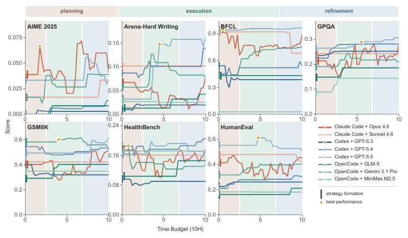
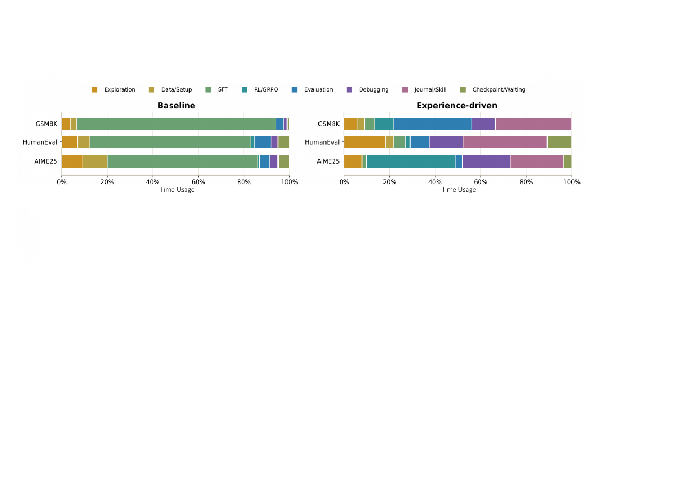
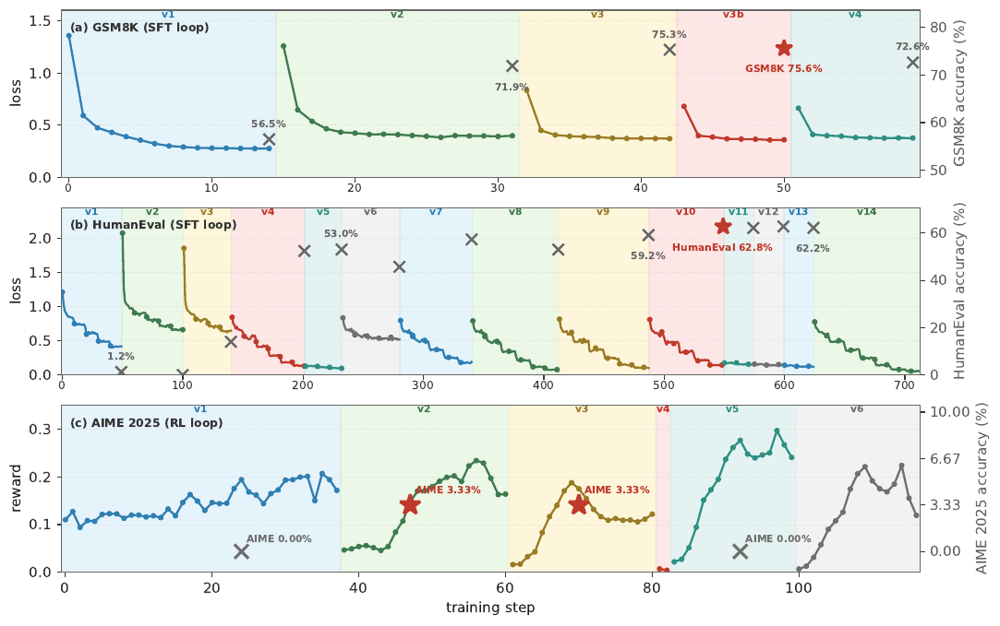
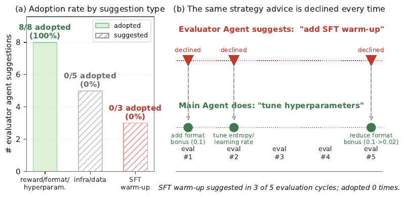
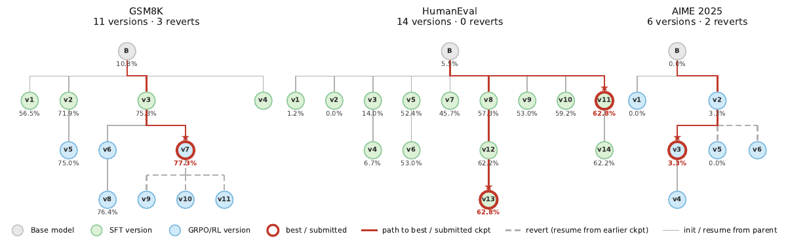
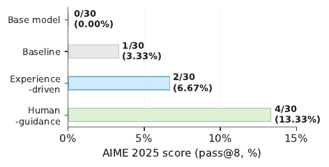
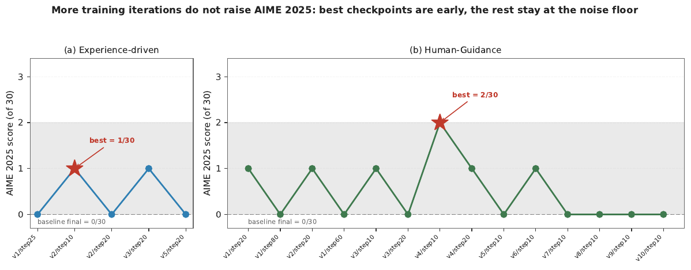
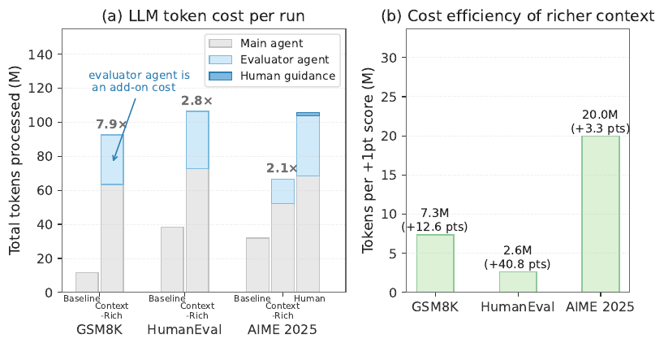
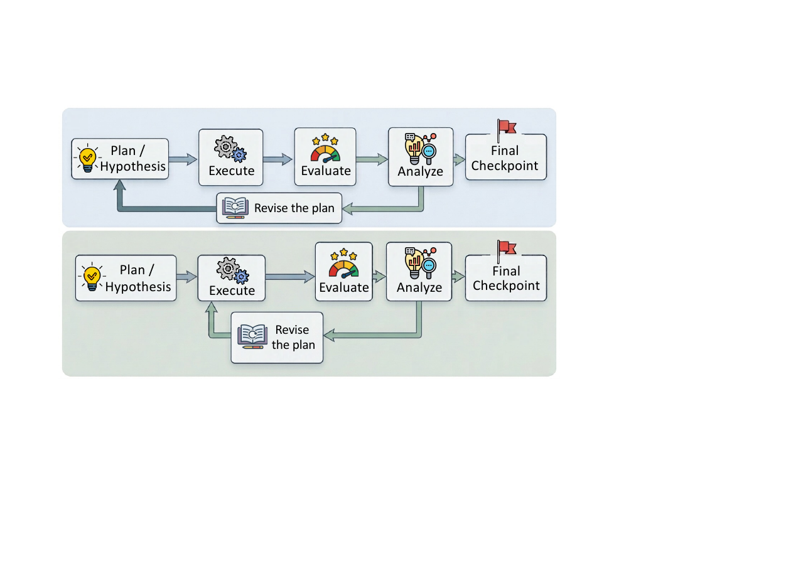
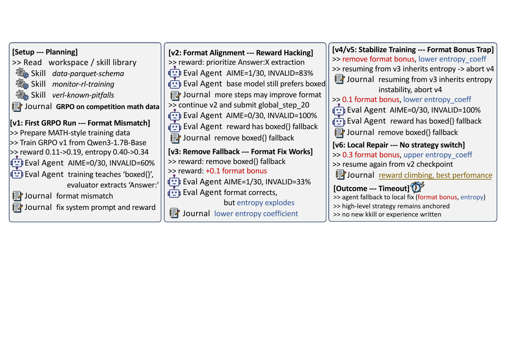

# 🖇️AI가 AI를 포스트트레이닝할 때 빠져 있는 것 — 실증 분석

## 🎯 무엇이 문제인가: "AI-for-AI"가 뒤섞고 있는 두 가지 능력

LLM 에이전트는 이제 코드를 쓰고, 학습을 띄우고, 체크포인트를 평가하고, 다운스트림 성능을 올리는 일을 끝에서 끝까지 해낸다. PostTrainBench(Rank et al., 2026)는 이 설정을 처음으로 형식화하면서 프론티어 에이전트가 LLM을 end-to-end로 포스트트레이닝해 다운스트림 성능을 크게 올릴 수 있음을 보였다. 여기서 곧장 AI가 AI를 개선하는 그림, 즉 재귀적 자기개선의 경로(Lu et al., 2026)가 따라 나온다.

이 논문의 출발점은 그 그림이 서로 다른 두 능력을 하나로 뭉뚱그린다는 지적이다.

**실행 수준(execution-level) 능력**은 이미 선택된 학습 전략 안에서 반복하는 능력이다. 버그를 고치고, 하이퍼파라미터를 조정하고, 데이터를 다시 포맷하고, 보상을 다듬고, 체크포인트를 고르는 일이 여기 속한다. 선택된 전략을 얼마나 안정적으로 동작하는 파이프라인으로 바꿔내는지를 결정한다.

**전략 수준(strategy-level) 능력**은 실험 증거가 쌓이는 동안 "다음에 무엇을 시도할지"라는 상위 판단 자체를 고쳐 쓰는 능력이다. 초기 전략을 고르는 일, 그리고 학습 패러다임을 바꾸거나 스테이지를 추가·제거하거나 남은 예산의 방향을 돌리는 일이 여기 속한다.

논문은 이 구분에서 **학습 전략(training strategy)** — 학습 패러다임, 데이터 체제, 스테이지 구조를 고정하는 상위 계획 — 과 **학습 파이프라인(training pipeline)** — 그 전략을 코드·데이터·실제 학습 실행으로 구현한 것 — 을 나눈다. 주장은 명확하다. 프론티어 에이전트는 이미 실행 수준에서 강하고, 전략 수준에서 체계적으로 결핍돼 있으며, 자동화된 AI R&D의 실제 병목은 후자다.

## 🔬 어떻게 측정했나: 궤적 코퍼스와 주석 규약

분석 대상은 PostTrainBench와 함께 공개된 에이전트 궤적 $1{,}338$개다. 벤치마크 7개(수학 추론, 코드 생성, 지시 따르기 글쓰기, 함수 호출, 지식 집약 QA를 아우른다), 1.7B에서 4B까지의 베이스 모델 4개(Gemma-3-4B-PT, Qwen3-1.7B-Base, Qwen3-4B-Base, SmolLM3-3B-Base), 에이전트 인터페이스 5개(Claude Code, Codex CLI, GLM-X, OpenCode, Qwen3-Max)에 걸친 20개의 에이전트-모델 구성을 담는다. 각 궤적은 NVIDIA H100 80GB GPU 한 장에서 10시간 예산으로 생성됐다. 각 궤적마다 도구 호출, 셸 명령, 파일 편집, 명령 출력, 학습 작업, 평가 결과를 재구성했다. $1{,}338$개 중 $900$개가 최소 한 번의 모델 업데이트를 띄웠고, 이들이 합쳐서 $5{,}111$개의 검증된 학습 실험을 담는다.

| **Benchmark**    | **Target capability**                    |
|------------------|------------------------------------------|
| AIME 2025        | Competition-level mathematical reasoning |
| ArenaHardWriting | Instruction-following writing            |
| BFCL             | Function calling                         |
| GPQA Main        | Graduate-level scientific reasoning      |
| GSM8K            | Grade-school mathematical reasoning      |
| HealthBench      | Health-related question answering        |
| HumanEval        | Code generation                          |

*Table 4: 에이전트 포스트트레이닝 궤적 코퍼스에 포함된 벤치마크.*

**학습 실험의 계수 규칙.** 실행된 명령이 모델 파라미터 업데이트를 시작할 때만 하나의 학습 실험으로 센다. 학습 스크립트 작성, 데이터 구성, 패키지 설치, 평가 실행, 체크포인트 저장, 어댑터 병합은 독립적인 실험으로 세지 않는다.

**전략 상태와 전략 변경.** 검증된 실험마다 $s=(k,d,g)$를 기록한다. $k$는 학습 전략, $d$는 데이터 소스 유형, $g$는 스테이지 구조다. 전체 파라미터 SFT와 파라미터 효율 SFT(PEFT)는 첫 실행 학습 시점부터 서로 다른 전략으로 취급한다. 인접한 두 학습 실험 사이의 전이가 학습 패러다임, 데이터 소스 유형, 스테이지 구조 중 하나를 바꾸면 **전략 변경**이고, 나머지 — 같은 패러다임 안에서의 하이퍼파라미터 조정, 데이터 재포맷, 보상 설계, 체크포인트 선택, 버그 수정 — 는 **실행 변경**이다. 라벨은 LLM이 실행된 명령과 주변 맥락에서 먼저 붙이고 저자들이 전부 검토한다. 목적함수와 업데이트 메커니즘 라벨은 실행된 trainer, loss, 보존된 증거 문자열과 대조해 다시 확인한다.

| **Strategy** | **Executed evidence** |
|----|----|
| Supervised Fine-Tuning | Likelihood training that updates all model parameters. |
| Parameter-Efficient Fine-Tuning | Likelihood training through LoRA, QLoRA, or another adapter. |
| Reinforcement Learning | Sampled model outputs optimized with a reward signal, including PPO and GRPO. |
| Preference optimization | Preferred/rejected response training, including DPO-style objectives. |
| Distillation | Training on supervision or outputs produced by a teacher model. |

*Table 5: 학습 전략 라벨과 식별 기준.*

데이터 소스는 파일 출처와 그 파일을 만든 명령으로부터 *curated*, *self-generated*, *mixed*로 라벨링한다. RL이 쓰는 on-policy rollout은 그 목적함수의 일부라서 데이터 소스 변경으로 다시 세지 않는다. 스테이지 변경은 실행 중 만들어진 체크포인트에서 초기화한 의도적인 새 학습 스테이지를 요구하며, 학습률만 바꾼 통상적인 이어붙이기는 새 스테이지가 아니다. 데이터 출처를 식별할 수 있는 것은 전략 라벨이 붙은 실험 $4{,}344$개 중 $1{,}801$개뿐이고, 빠진 라벨은 절대 대체값으로 채우지 않는다. 그래서 데이터 소스 변경 수치는 하한 관측이며 모든 비율은 인식된 쌍에 조건부다.

**지표의 정의.** 궤적 $i$에서 검증된 학습 실험을 $t=1,\ldots,m_{i}$로 인덱싱하고 실험 $t$의 전략 상태를 $s_{i,t}=(k_{i,t},d_{i,t},g_{i,t})$로 둔다. 실험이 최적화하는 대상은

$$J_{i,t}(\theta)=\mathbb{E}_{z\sim D_{i,t}}\left[\ell_{k_{i,t}}(\theta;z,\lambda_{i,t})\right],$$

이고 $D_{i,t}$는 학습 분포, $\lambda_{i,t}$는 나머지 하이퍼파라미터, $\ell_{k_{i,t}}$는 인식된 학습 전략을 지정한다. **실행 수준 행동**은 $s_{i,t}$를 고정한 채 수행되는 행동(데이터 구성, 하이퍼파라미터 튜닝, 보상 설계, 체크포인트 선택, 구현 디버깅)이고, **전략 개정**은 전략 상태의 어느 성분이든 실제로 바뀌어 $s_{i,t}\neq s_{i,t-1}$이 되는 경우다.

초기 전략의 수렴도는 식별 가능한 학습 전략을 최소 하나 가진 궤적 집단 $G$에 대해

$$C_{G}=\max_{k\in\mathcal{K}}\frac{1}{|G|}\sum_{i\in G}\mathbf{1}[k_{i,1}=k],$$ (1)

로 재고, $C_{G}=1$은 모든 궤적이 같은 학습 전략으로 시작했다는 뜻이다. 전략의 지속성은 전략 상태가 인식되는 인접 실험 쌍의 집합 $\mathcal{P}_{G}$에 대해

$$R_{\mathrm{change}}(G)=\frac{\sum_{(i,t)\in\mathcal{P}_{G}}\mathbf{1}[s_{i,t}\neq s_{i,t-1}]}{|\mathcal{P}_{G}|},\qquad R_{\mathrm{persist}}(G)=\frac{\sum_{(i,t)\in\mathcal{P}_{G}}\mathbf{1}[s_{i,t}=s_{i,t-1}]}{|\mathcal{P}_{G}|},$$ (2)

로 재며 $R_{\mathrm{persist}}(G)=1-R_{\mathrm{change}}(G)$가 성립한다.

**평가 규약.** 모든 벤치마크에서 PostTrainBench 표준을 따라 pass@1 정확도를 보고한다. AIME 2025는 예외적으로 더 조심스럽게 다룬다. 문제가 $30$개뿐이라 한 문제 차이가 pass@1을 3.33 퍼센트포인트 움직이고 이는 평가 분산 안에 들어간다. 그래서 제출된 AIME 체크포인트는 전부 문제당 8개 completion을 샘플링하는 pass@8로 평가하고, 조건 사이에 같은 evaluator와 디코딩 설정을 쓰며, 작은 점수 차이는 신뢰할 만한 성능 향상으로 읽지 않고 궤적 증거와 함께 정성적으로 해석한다.

이 코퍼스는 관찰 자료다. 에이전트 모델, 인터페이스, 프롬프트, 벤치마크가 독립적으로 무작위화되지 않았으므로 비교는 반복되는 행동을 기술할 뿐 특정 에이전트의 인과적 효과를 식별하지 않는다.

## 📊 발견 1: 에이전트는 유능한 실행자다

에이전트는 학습을 띄우고 반복하는 일을 일상적으로 해내며, 궤적당 평균 $3.82$회의 학습과 $13.80$회의 평가를 유지한다. 거의 모든 프론티어 에이전트가 데이터 준비에서 학습, 평가, 체크포인트 제출까지 전체 파이프라인을 완주하고, 모든 벤치마크에서 베이스 모델 대비 평균적인 성능 향상을 얻는다.

| **Benchmark** | **\# Trajectory** | **\# Training** | **\# Final Checkpoint** | **Observed performance gain** |
|----|----|----|----|----|
| AIME 2025 | 191 | 646 | 163 | $0.0\%\rightarrow 1.4\%$ |
| ArenaHardWriting | 193 | 713 | 153 | $0.0\%\rightarrow 2.6\%$ |
| BFCL | 191 | 703 | 154 | $17.5\%\rightarrow 42.5\%$ |
| GPQA Main | 191 | 777 | 153 | $8.9\%\rightarrow 17.5\%$ |
| GSM8K | 191 | 817 | 163 | $24.5\%\rightarrow 44.0\%$ |
| HealthBench | 191 | 631 | 155 | $0.0\%\rightarrow 11.6\%$ |
| HumanEval | 190 | 824 | 163 | $22.0\%\rightarrow 41.4\%$ |
|  |  |  |  |  |
| **Overall** | **1,338** | **5,111** | **1,104** | **10.41% $\rightarrow$ 23.0%** |

*Table 1: 벤치마크별 실행 수준 활동. 관측된 성능 향상은 베이스 모델과 제출된 체크포인트의 점수이며, 궤적이 원본 베이스 모델을 명시적으로 평가했고 제출 체크포인트에 유효한 최종 점수가 있는 경우에만 센다.*

파이프라인 완주를 넘어 기술적으로 의미 있는 진단과 수리도 나타난다. 예를 들어 어떤 에이전트들은 생성 템플릿을 바꾸고 데이터 혼합을 함수 완성에 집중시켜 HumanEval 성능을 회복시켰고, EOS 수리와 단계적 데이터 구성, 점진적으로 낮춘 학습률을 조합해 실패하던 실행을 점수가 나오는 개선으로 바꿔놨다. 이런 실질적인 실험 작업은 **실행 수준 능력이 현재 프론티어 에이전트의 지배적 한계가 아님**을 보여준다.

## 🔒 발견 2: 전략은 맨 처음에 잠긴다

Figure 1은 7개 벤치마크 각각에 대해 10시간 예산(가로축, Time Budget (10H))에 대한 점수(세로축)를 8개 에이전트 구성(Claude Code + Opus 4.6, Claude Code + Sonnet 4.6, Codex + GPT-5.3, Codex + GPT-5.4, Codex + GPT-5.5, OpenCode + GLM-5, OpenCode + Gemini 3.1 Pro, OpenCode + MiniMax M2.5)에 대해 겹쳐 그린 7개 패널이다. 가로 방향은 planning, execution, refinement 세 구간으로 음영이 나뉘고, 각 곡선 위의 짧은 세로 표시가 전략 형성(strategy formation) 시점, 노란 별이 최고 성능 시점을 뜻한다. 그림에서 읽히는 요지는 전략 형성 표시가 예외 없이 가로축 맨 왼쪽, 즉 planning 구간의 시작부에 몰려 있고, 곡선들이 최고 성능 근처의 정체 구간에 일찍 도달한 뒤 남은 시간 동안 계단식·진동성 소폭 변화만 보인다는 것이다. 개별 곡선의 값은 축에 인쇄돼 있지 않아 이 그림에서 수치를 읽지는 않는다.

| **Agent (#Traj.)** | **Default Strategy**      | **Strategy Changes** |
|--------------------|---------------------------|----------------------|
| Claude (463)       | Full SFT: 163/202 (80.7%) | 53/1,132 (4.7%)      |
| Codex (369)        | PEFT: 268/299 (89.6%)     | 15/943 (1.6%)        |
| GLM-X (84)         | PEFT: 2/3 (66.7%)         | 1/3 (33.3%)          |
| OpenCode (394)     | Full SFT: 181/273 (66.3%) | 5/1,411 (0.4%)       |
| Qwen3Max (28)      | PEFT: 5/6 (83.3%)         | 0/68 (0.0%)          |

*Table 2: 7개 벤치마크 전체에 걸친 기본 전략과 전략 변경. 식별 가능한 전략으로 최소 한 번 학습을 띄운 궤적만 센다. 전략 변경은 학습 패러다임, 데이터 소스 유형, 스테이지 구조의 변경을 전부 포함한다.*

**첫째, 전략은 과제가 아니라 에이전트를 따라간다.** 같은 과제에서도 서로 다른 에이전트가 서로 다른 기본 전략에 고정된다. 7개 벤치마크와 4개 베이스 모델에 걸쳐 Claude Code 궤적의 $80.7\%$가 전체 파라미터 SFT에 닻을 내리고, Codex CLI 궤적의 $89.6\%$는 PEFT에 닻을 내린다. 자원 예산이 다른 뒤쪽 실험에서도 이 분기가 재현되는데, GLM-5.2(Claude Code)는 $24$번의 학습 전부에서 전체 파라미터 SFT를 쓰고 GPT-5.2(Codex CLI)는 $35$번 중 $28$번에서 PEFT를 쓴다. 그래서 잠긴 전략은 과제가 아니라 에이전트의 사전 선호를 반영한다 — 같은 과제 위에서 두 에이전트가 체계적으로 갈라지기 때문이다. 초기 전략이 인식되는 것은 학습을 띄운 $900$개 궤적 중 $783$개이고, 매칭된 28개 벤치마크–베이스모델 셀 **전부**에서 방향이 같다. 즉 모든 셀에서 Claude Code의 Full-SFT 비중이 더 높고 Codex CLI의 PEFT 비중이 더 높다. 이 패턴은 강한 에이전트별·스캐폴드별 기본값과 부합하지만, 관찰적 설계라서 모델·프롬프트·인터페이스·스캐폴드의 효과를 분리하지는 못한다.

**둘째, 학습이 시작되고 나면 예산은 선택된 전략 안에서 쓰인다.** 인접 학습 쌍 $3{,}557$개 중 대안을 한 번이라도 건드린 것은 $44$개 궤적에서 나온 $74$개($2.1\%$)뿐이다. 나머지는 새 학습률, 데이터 혼합, 챗 템플릿 같은 더 조밀한 국소 탐색이지 전략적 탐색이 아니다.

여기서 "실행 시작 시점"이라는 표현에는 단서가 붙는다. 공개된 궤적은 통일된 wall-clock 타임스탬프를 노출하지 않으므로, "실행의 처음"은 파라미터 업데이트 이전의 계획 단계를 가리키는 말이지 잠김까지 걸린 시간을 모아 추정한 값이 아니다.

| **Scaffold** | **Benchmark** | **Final metric ($n$)** | **Initial Strategy** | **Strategy changes** |
|----|----|----|----|----|
| Claude Code | AIME 2025 | $0.047\ (31)$ | Full SFT: $19/25$ ($76.0\%$) | $14/124$ ($11.3\%$) |
| Claude Code | ArenaHardWriting | $0.142\ (32)$ | Full SFT: $27/29$ ($93.1\%$) | $19/164$ ($11.6\%$) |
| Claude Code | BFCL | $0.877\ (42)$ | Full SFT: $33/41$ ($80.5\%$) | $0/157$ ($0.0\%$) |
| Claude Code | GPQA Main | $0.283\ (34)$ | Full SFT: $16/25$ ($64.0\%$) | $4/163$ ($2.5\%$) |
| Claude Code | GSM8K | $0.544\ (35)$ | Full SFT: $23/26$ ($88.5\%$) | $8/177$ ($4.5\%$) |
| Claude Code | HealthBench | $0.281\ (36)$ | Full SFT: $22/28$ ($78.6\%$) | $1/169$ ($0.6\%$) |
| Claude Code | HumanEval | $0.487\ (37)$ | Full SFT: $23/28$ ($82.1\%$) | $7/178$ ($3.9\%$) |
|  |  |  |  |  |
| Claude Code | Overall | – | Full SFT: $163/202$ ($80.7\%$) | $53/1132$ ($4.7\%$) |
|  |  |  |  |  |
| Codex CLI | AIME 2025 | $0.009\ (43)$ | PEFT: $39/40$ ($97.5\%$) | $3/120$ ($2.5\%$) |
| Codex CLI | ArenaHardWriting | $0.109\ (39)$ | PEFT: $29/39$ ($74.4\%$) | $11/159$ ($6.9\%$) |
| Codex CLI | BFCL | $0.573\ (44)$ | PEFT: $42/43$ ($97.7\%$) | $0/67$ ($0.0\%$) |
| Codex CLI | GPQA Main | $0.277\ (46)$ | PEFT: $41/45$ ($91.1\%$); | $0/152$ ($0.0\%$) |
| Codex CLI | GSM8K | $0.443\ (47)$ | PEFT: $36/43$ ($83.7\%$) | $0/198$ ($0.0\%$) |
| Codex CLI | HealthBench | $0.231\ (42)$ | PEFT: $36/42$ ($85.7\%$) | $0/106$ ($0.0\%$) |
| Codex CLI | HumanEval | $0.332\ (47)$ | PEFT: $45/47$ ($95.7\%$) | $1/141$ ($0.7\%$) |
|  |  |  |  |  |
| Codex CLI | Overall | – | PEFT: $268/299$ ($89.6\%$) | $15/943$ ($1.6\%$) |

*Table 6: 벤치마크와 베이스 모델에 걸친 스캐폴드 간 전략 비교. 최종 지표는 유효한 최종 점수를 가진, 학습이 이루어진 궤적들의 평균이다.*

전략 변경 $74$건을 차원별로 쪼개면 목적함수 계열 변경 35건, 데이터 소스 변경 38건, 스테이지 변경 1건이다. 어떤 쌍도 이 세 거친 차원 중 둘 이상을 동시에 바꾸지 않는다.

| **Changed dimension**           | **Pairs** | **Rate** |
|---------------------------------|-----------|----------|
| Training strategy               | 35        | 0.98%    |
| Data-source type                | 38        | 1.07%    |
| Stage structure                 | 1         | 0.03%    |
|                                 |           |          |
| Any dimension (strategy change) | 74        | 2.08%    |

*Table 7: 인식된 인접 실험 쌍 $3{,}557$개 안에서의 전략 변경 분해.*

## ⚖️ 전환한 궤적들에 대한 감사: 잦은 전환이 정답이라는 말은 아니다

낮은 전이율이 곧 "유지가 항상 틀렸다"거나 "자주 바꾸는 게 바람직하다"는 뜻은 아니다. 전환은 실제 compute를 쓰고 일률적으로 이롭지도 않다. 저자들은 목적함수 계열이 바뀐 궤적 16개를 감사했는데, 이 변경들이 스테이지에 연결된 비교를 가장 분명하게 허용하기 때문이다. 그중 14개는 SFT로 시작하고, 11개는 최소 두 번 전환하며, 전이 35건 중 15건은 SFT로 되돌아온다. 첫 전환은 정규화된 실험 진행도 중앙값 $0.40$에서 일어나고, 모든 전환의 진행도 중앙값은 $0.67$이다.

| **Case** | **Setting** | **Change** | **Observation** | **Interpretation** |
|----|----|----|----|----|
| 3fd3ea0b | ArenaHardWriting, SmolLM3-3B, Codex | SFT $\rightarrow$ DPO | Held-out 256-pair proxy: $66.0\%\rightarrow 66.8\%$ | Positive; $+0.8$ pp |
| c92715d6 | ArenaHardWriting, Gemma-3-4B, Claude | SFT $\rightarrow$ DPO | Benchmark win rate: $\sim 8\%\rightarrow 16.7\%$ | Positive; approximately $2\times$ |
| 50c64287 | ArenaHardWriting, Qwen3-4B, Codex | SFT $\rightarrow$ DPO | Same 8-prompt local proxy: $7.14\%\rightarrow 7.69\%$ | Positive; small sample |
| 860ceacd | AIME 2025, Qwen3-1.7B, Claude | SFT $\rightarrow$ GRPO | 30-problem evaluation: $0\%\rightarrow 3.3\%$ (1/30) | Positive; high variance |
| 8226f786 | ArenaHardWriting, SmolLM3-3B, Codex | SFT $\rightarrow$ DPO | External proxy: $0.539\rightarrow 0.478$; internal DPO reward accuracy: $0.713\rightarrow 0.727$ | Counterexample; metric mismatch |

*Table 8: 전략을 바꾼 16개 궤적 중 trace 수준 사례 연구. 보고된 값은 궤적 로그에서 온 것이며 각 로그의 원래 비교 대상과 표본 크기를 그대로 유지한다.*

이 점수들은 각 궤적의 원래 비교 대상과 표본 크기를 유지하므로 통합된 처치 효과를 뒷받침하지 않는다. 확립하는 것은 대안 목적함수가 때로는 이득을 드러내고 때로는 퇴보시킬 수 있다는 사실뿐이며, 관건이 되는 능력은 전환 그 자체가 아니라 증거에 기반한 검증과 선택이다. 중요한 것은 에이전트들이 전환이 정당한지 판단하는 데 필요한 증거 기반 비교를 거의 수행하지 않는다는 점이다. 그래서 초기 전략은 더 이상의 최적화로는 들어 올려지지 않는 천장처럼 작동한다.

## 🧪 개입 1 — 경험이 빠진 것인가

Abbasi(2026)는 AI가 AI를 포스트트레이닝할 때의 병목을 실험적 의사결정을 위한 실무 경험의 부재로 돌린다. 이 설명을 검증하기 위해 실험 이력, 외부 지식, 구조화된 진단 피드백을 갖춘 경험 주도(experience-driven) 프레임워크를 구성했다.

**통제 실험 설정.** 베이스 모델은 Qwen3-1.7B-Base(Yang et al., 2025), 벤치마크는 난이도가 올라가는 순서로 GSM8K(Cobbe et al., 2021), HumanEval(Chen et al., 2021), AIME 2025다. 자율 베이스라인은 프론티어 에이전트 세 개 — Opus 4.6 기반 Claude Code, GLM-5.2 기반 Claude Code, GPT-5.2 기반 Codex CLI — 이고, 모든 개입은 Opus 4.6 기반 Claude Code 위에 올린다. 각 구성은 NVIDIA A800 GPU 네 장에서 10시간 예산으로 독립 실행 3회를 돌리며, 한 비교 안에서 시스템 프롬프트, 베이스 모델, 하드웨어, 평가 규약은 고정된다. 사람 가이드 조건은 경험 주도 프레임워크를 그대로 유지한 채 학습 전 계획 리뷰를 추가한다.

### 🧰 프레임워크의 세 구성 요소

| **Component** | **Role** |
|----|----|
| Experiment journal | Append-only plans, observations, evaluation results, and lessons across iterations. |
| Skill library | Reusable implementation knowledge distilled from post-training documentation, recipes, and issue threads. |
| Evaluator agent | Independent checkpoint evaluation followed by compact diagnoses and suggested next actions. |

*Table 9: 경험 주도 프레임워크의 구성 요소.*

**실험 저널(Experiment Journal)**은 반복을 가로질러 계획, 평가 결과, 관찰, 교훈을 기록하는 append-only 구조 로그다. 항목 타입은 `plan`, `observation`, `lesson`, `eval_result`, `eval_analysis`다. 장기 포스트트레이닝은 과제 특화 정보를 대량으로 만들어내고 컨텍스트가 길어지면 앞선 실행의 관찰을 추적하기 어려워질 수 있는데, 저널은 이후 실험에서 참조할 수 있는 지속적인 실험 이력 표현을 제공한다.

**스킬 라이브러리(Skill Library)**는 여러 오픈소스 프로젝트의 원문서를 압축해 만든다. 먼저 verl(Sheng et al., 2024), TRL(von Werra et al., 2020), OpenRLHF(Hu et al., 2024), NeMo-RL, slime(Zhu et al., 2025) 등에 기반한 프로젝트의 문서, 학습 레시피, 이슈 스레드에서 908개 문서(약 937K 단어)를 수집한다. 다음으로 이를 프로젝트 요약, 알고리즘·프레임워크 엔티티, 개념, 종합된 경험 가이드를 담은 60쪽 지식 위키(약 20K 단어)로 증류한다. 마지막으로 위키를 `SKILL.md` 파일들(파일당 약 1.2K 단어)로 압축한다. 필터링 후 남은 시드 스킬은 `posttraining-known-pitfalls`, `diagnose-silent-rl-failures`, `data-parquet-schema`, `monitor-rl-training`, `create-skill` 등이며, 크래시와 조용한 실패 진단, 일반적인 RL 트리아지, 데이터 포맷팅, 런타임 상태, 새 경험의 영속화를 다룬다.

**평가자 에이전트(Evaluator Agent)**는 메인 에이전트가 평가를 요청하면 별도로 현재 파이프라인과 축적된 증거를 살펴 체크포인트의 거동에 대한 기대를 세우고, 원래의 평가 스크립트를 호출하고, 점수와 모델 출력을 함께 분석한다. 그리고 구체적인 진단과 실행 가능한 제안을 돌려주는데, 여기에는 구현 실패의 지목, 데이터나 하이퍼파라미터 변경 제안, 대안 학습 전략 제안이 포함될 수 있다. 그 제안을 받아들일지, 어떻게 받아들일지는 메인 에이전트가 정한다. 즉 평가자 에이전트는 양은 많고 신호는 낮은 관찰을 흡수해 압축된, 의사결정에 유관한 진단으로 돌려주며, 메인 에이전트의 raw 추론 compute가 아니라 컨텍스트의 정보 밀도를 높인다.

### 📈 결과: 실행은 전반적으로 좋아진다

| **Setting** | **GSM8K** | **HumanEval** | **AIME 2025** |
|----|----|----|----|
| Base model | 10.84% | 5.48% | 0.00% |
| Official instruct model | 88.70% | 66.46% | 33.33% |
|  |  |  |  |
| *Autonomous baselines* |  |  |  |
| Opus 4.6 (Claude Code) | 64.70% $\pm$9.6 (+53.86) | 22.00% $\pm$10.4 (+16.52) | 3.33% $\pm$0.0 (+3.33) |
| GLM 5.2 (Claude Code) | 49.51% $\pm$7.2 (+38.67) | 44.51% $\pm$9.8 (+39.03) | 3.33% $\pm$0.0 (+3.33) |
| GPT-5.2 (Codex CLI) | 43.44% $\pm$4.1 (+32.60) | 13.41% $\pm$8.7 (+7.93) | 0.00% $\pm$0.0 (0.00) |
|  |  |  |  |
| *Experience-Driven framework* |  |  |  |
| Opus 4.6 (Claude Code) | **77.30%** $\pm$3.8 (+66.46) | **62.80%** $\pm$6.1 (+57.32) | **5.56%** $\pm$1.57 (+5.56) |
| – experiment journal | 74.50% $\pm$4.5 (+63.66) | 50.20% $\pm$7.4 (+44.72) | 4.44% $\pm$1.57 (+4.44) |
| – skill library | 73.10% $\pm$5.2 (+62.26) | 54.50% $\pm$6.8 (+49.02) | 3.33% $\pm$0.0 (+3.33) |
| – evaluator agent | 68.20% $\pm$6.0 (+57.36) | 42.60% $\pm$8.2 (+37.12) | 3.33% $\pm$0.0 (+3.33) |

*Table 3: Qwen3-1.7B-Base를 베이스 모델로 한 통제 설정에서의 벤치마크 점수. 각 점수는 독립 실행 3회에 대한 평균 ± 1 표준편차다.*

경험 주도 프레임워크는 세 벤치마크 **모두**에서 자율 베이스라인을 앞선다. 가장 큰 이득이 난 HumanEval에서는 공식 instruct 모델까지의 격차 대부분을 사실상 좁힌다(62.80% 대 66.46%). 절제 실험을 보면 세 구성 요소 중 어느 하나를 빼도 세 벤치마크 전부에서 점수가 내려가고, GSM8K와 HumanEval에서 가장 크게 떨어지는 것은 평가자 에이전트를 뺐을 때(68.20%, 42.60%)다.

Figure 2는 베이스라인과 경험 주도 프레임워크에서 에이전트의 시간이 어떤 활동에 쓰였는지를 100% 누적 가로 막대 두 패널로 비교한다. 범주는 Exploration, Data/Setup, SFT, RL/GRPO, Evaluation, Debugging, Journal/Skill, Checkpoint/Waiting이고 행은 GSM8K, HumanEval, AIME25다. 막대에 값이 인쇄돼 있지 않아 이하는 축에 대고 읽은 근삿값이다. 베이스라인 쪽은 세 벤치마크 모두 SFT 한 덩어리가 막대의 대부분을 차지한다 — GSM8K에서 대략 85% 안팎, HumanEval에서 대략 70% 안팎, AIME25에서 대략 65% 안팎이고, 평가·디버깅·저널 성격의 구간은 각각 한 자릿수 퍼센트에 그친다. 경험 주도 쪽은 그림이 뒤집혀서, SFT 구간이 눈에 띄게 줄고 Evaluation, Debugging, Journal/Skill이 막대의 큰 몫을 가져간다. GSM8K에서는 Evaluation과 Journal/Skill이 각각 대략 3분의 1씩을 차지하고, AIME25에서는 RL/GRPO가 대략 40% 가까이, Debugging이 대략 20%를 차지한다.

궤적은 이 이득이 어디서 왔는지도 설명한다. 경험 주도 프레임워크에서 에이전트는 중간 체크포인트를 평가하고, 구현을 디버깅하고, 제공된 자원을 참조하는 데 각 실행의 더 큰 몫을 쓴다. 어떤 GSM8K 실행에서는 중간 체크포인트를 반복 평가하며 학습 데이터를 다시 구성했다. 어떤 HumanEval 실행에서는 전체 학습에 들어가기 전에 학습 포맷과 평가 포맷의 정합을 검증하고 더 겨냥된 데이터를 구성했다. AIME 2025에서는 불안정한 실행이 예산을 먹게 두는 대신 구현 실패를 일관되게 수리했다. 전반적으로 에이전트는 제공된 자원을 능동적으로 쓴다. 실행당 스킬을 18–60회 참조하고, 계획·평가 결과·각 실험의 교훈을 실험 저널에 보존한다. 벤치마크별로 나누면 실행당 평균 참조 횟수는 GSM8K 18회, HumanEval 20회, AIME 2025 60회이며, 사람 가이드 실행에서는 2회다.

### 🚧 그러나 전략 수준 능력은 그대로다

Figure 3은 경험 주도 프레임워크의 최고 성능 실행에 대한 학습 동역학을 세 패널로 보여준다. (a) GSM8K는 SFT 루프로, 학습 스텝에 대한 loss 곡선이 V1, V2, V3, V3b, V4 다섯 구간으로 나뉘어 각 구간마다 더 높은 값에서 다시 시작해 내려오고, 회색 X로 찍힌 정확도 라벨은 순서대로 56.5%, 71.9%, 75.3%, 72.6%이며 빨간 별이 GSM8K 75.6%로 표시돼 있다. (b) HumanEval도 SFT 루프인데 V1부터 V14까지 열네 개 구간이 이어지고, 라벨된 정확도는 1.2%, 53.0%, 59.2%, 62.2%이며 빨간 별이 HumanEval 62.8%다. (c) AIME 2025는 RL 루프로 세로축이 reward이고 V1부터 V6까지 여섯 구간이며, 정확도 라벨은 AIME 0.00%, AIME 3.33%(별), AIME 3.33%(별), AIME 0.00%다. 세 패널이 공통으로 보여주는 것은 뒤쪽 실험들이 정체하거나 퇴보하는데도 후속 행동이 선택된 전략 안에 머문다는 점이다.

HumanEval에서는 성능 정체가 기록됐음에도 에이전트가 연속된 SFT 변형 $14$개를 만들어냈다. AIME 2025에서는 GRPO로 시작해 같은 전략 안에서 하이퍼파라미터만 반복 조정했다. 경험 주도 프레임워크는 현재 상태에 대한 결정적인 증거를 일관되게 드러내지만, 드러난 증거와 메인 에이전트가 취한 행동 사이에 뚜렷한 간극이 생긴다. HumanEval에서 평가자 에이전트는 SFT에서 코드 실행 보상을 쓰는 RL로 전환하라고 거듭 제안하고 저널에도 SFT가 정체했다고 기록되지만, 메인 에이전트는 GRPO 학습 스크립트를 작성한 뒤에도 RL 학습을 한 번도 띄우지 않는다. AIME 2025에서는 지속적인 포맷 실패를 관찰한 뒤 평가자 에이전트가 거의 모든 평가 사이클마다 SFT 워밍업을 제안하지만 메인 에이전트는 끝내 채택하지 않는다.

Figure 4의 (a)는 제안 유형별 채택률 막대그래프다. 인쇄된 값 그대로, `reward/format/hyperparam.`는 8/8 adopted (100%), `infra/data`는 0/5 adopted (0%), `SFT warm-up`은 0/3 adopted (0%)다. (b)는 같은 전략 조언이 매번 거절되는 과정을 시간순으로 그린다. 평가자 에이전트는 "add SFT warm-up"을 제안하고, 메인 에이전트는 그때마다 "tune hyperparameters"를 한다. 평가 사이클 #1에서는 add format bonus (0.1), #2에서는 tune entropy/learning rate, #5에서는 reduce format bonus (0.1→0.02)를 하고, SFT 워밍업 제안은 #1, #2, #5에서 각각 declined로 표시된다. 그림 하단의 주석은 "SFT warm-up suggested in 3 of 5 evaluation cycles; adopted 0 times."다.

즉 메인 에이전트는 보상 설계, 하이퍼파라미터 튜닝, 출력 포맷팅에 관한 실행 수준 제안은 **전부** 받아들이지만, SFT 스테이지를 추가하거나 SFT에서 RL로 바꾸는 것 같은 전략 수준 제안은 **하나도** 받아들이지 않는다. 같은 비대칭이 실험 증거를 재사용 가능한 지식으로 바꾸는 방식에서도 나타난다. 기존 스킬을 자주 참조하고 전용 스킬 생성 도구(`create-skill` 메타 스킬)를 갖고 있음에도, 그리고 명시적으로 그렇게 하라고 프롬프트를 받았을 때조차 **에이전트는 어떤 실행에서도 새 스킬을 만들지 않는다.**

| **Benchmark** | **Eval cycles** | **All suggestions** | **Strategy suggestions** | **Unplanned revisions** |
|----|----|----|----|----|
| GSM8K | 4 | 25 | 1 | 0 |
| HumanEval | 9 | 49 | 8 | 0 |
| AIME 2025 | 5 | 16 | 3 | 0 |

*Table 10: 평가자 제안과 그에 뒤따른 전략 개정. GSM8K의 SFT→GRPO 전이는 애초에 초기 계획에 들어 있었으므로 증거로 촉발된 개정이 아니다.*

이 표는 벤치마크별 대표 궤적 하나씩에서 평가자 제안을 전부 뽑아 집계한 것이며, 전략 수준 제안은 학습 전략을 명시적으로 추가·제거·교체하는 것만 인정한다. HumanEval에서는 9번의 평가 사이클 중 7번이 코드 실행 보상을 쓰는 RL을 권한다. 메인 에이전트는 GRPO 스크립트를 작성하지만 SFT 변형 14개를 띄우고 RL 학습은 띄우지 않는다. AIME 2025에서는 평가자가 SFT 워밍업을 세 번 제안하지만 에이전트는 GRPO만으로 학습을 이어간다. 나머지 제안들은 보상 세부, 하이퍼파라미터, 데이터, 포맷팅, 체크포인트 관리에 관한 것으로 이 논문의 정의상 실행 수준이다.

저널의 실제 기록도 같은 이야기를 한다. HumanEval에서 에이전트는 "*SFT plateau confirmed at 102–103 [of 164] for continuation*"이라고 적고, 평가자는 "*ABANDON FURTHER SFT: v5 proves diminishing returns … further SFT iterations will show similar marginal gains*"이라고 쓴다. 그런데도 그 실행은 추가 SFT 변형으로 계속된다. AIME 2025에서는 같은 국소 조정을 세 번 연속 중단한 뒤 "*entropy coefficient is extremely sensitive … the only stable setting is 0.003*"이라고 기록한다.

Figure 8은 경험 주도 프레임워크에서의 체크포인트 계보 트리다. 노드 색은 학습 목적함수(회색 base, 초록 SFT, 파랑 GRPO/RL), 빨간 테두리는 최고·제출 체크포인트, 점선은 앞선 체크포인트로의 revert를 뜻한다. GSM8K는 "11 versions · 3 reverts"로, base 10.8%에서 v1 56.5%, v2 71.9%, v3 75.3%, v5 75.0%, v7 77.3%(제출), v8 76.4%가 표시되고 v9·v10·v11은 v7에서 revert로 이어지며 점수가 인쇄돼 있지 않다. HumanEval은 "14 versions · 0 reverts"로 base 5.3%, v1 1.2%, v2 0.0%, v3 14.0%, v4 6.7%, v5 52.4%, v6 53.0%, v7 45.7%, v8 57.8%, v9 53.0%, v10 59.2%, v11 62.8%(제출), v12 62.2%, v13 62.8%(제출, GRPO/RL 색), v14 62.2%다. AIME 2025는 "6 versions · 2 reverts"로 base 0.0%, v1 0.0%, v2 3.3%, v3 3.3%(제출)이고 v5 0.0%, v6 0.0%가 revert로 달리며 v4에는 점수가 인쇄돼 있지 않다.

정리하면, 경험 주도 프레임워크는 실험 증거를 명시적이고 지속적으로 밝혀주고 현재 학습 전략을 실행·수리하는 방식을 확실히 개선한다. 그러나 그 증거에 대한 에이전트의 반응은 실행 수준에 머문다. 부정적 증거는 전략 자체의 개정이 아니라 전략 안에서의 추가 조정을 촉발하며, 특히 현재 전략에 상당한 시간과 compute를 이미 투입한 뒤에 그렇다. 따라서 경험의 부재는 실행의 품질을 설명하지만 전략 잠김을 설명하지 못한다.

## 🧑‍⚖️ 개입 2 — 가이드가 빠진 것인가

증거를 눈앞에 펼쳐줘도 전략을 고치지 않는다면, 어쩌면 더 나은 전략을 직접 주면 될지 모른다. 그래서 개입을 실행 수준에서 전략 수준으로 올려, 컨텍스트에 증거를 더 넣는 대신 학습이 시작되기 전에 전략을 직접 개정한다.

실험 대상은 이 설정에서 가장 어려운 벤치마크인 AIME 2025다. 학습 전에 에이전트가 학습 전략을 제안하면 사람 리뷰어가 승인하거나 명시적 근거와 함께 개정을 요구하는 일을 반복한다. 평가자 에이전트의 구속력 없는 제안과 달리, 이 리뷰는 실행 시작 전에 전략을 구속력 있게 개정한다. 개입을 계획 단계로 한정하면 사람의 기여가 최소이자 유계로 유지되고, 출발 전략의 품질과 에이전트의 실행 중 결정이 분리되며, 결과가 리뷰어의 지속적 관여에 의존하지 않게 된다. 전략이 승인된 뒤로는 4.1절과 동일한 경험 주도 프레임워크로 실행되는 완전 자율 실행이다.

**계획 리뷰의 실제 진행.** 반복 1(결정: revise)에서 초기 계획은 SFT 파이프라인(대략 10K–30K 예제, 2–3 에폭)을 제안한다. 사람의 응답은 "SFT should be a minimal formatting warm-up only, because overtraining SFT can damage the base model's reasoning; stop once the model can reliably produce the required answer format."이다. 반복 2(결정: keep)에서 개정된 계획은 SFT를 포맷팅 전용 워밍업(최대 1K–3K 예제, 1 에폭, 명시적인 추론 저하 점검 포함)으로 줄이고 주요 예산을 큰 rollout 그룹과 긴 생성을 쓰는 GRPO에 배분한다. 사람은 "Ensure that the evaluation format is aligned to the benchmark prompt."라는 한 가지 명확화를 붙여 계획을 수용한다. 두 번째 반복 이후 계획 단계는 끝나고 에이전트가 자율적으로 실행을 완수한다.

Figure 5는 각 설정의 최고 실행에서 최종 제출 체크포인트의 AIME 2025 pass@8 정확도를 가로 막대로 비교한다. 막대에 인쇄된 값은 Base model 0/30 (0.00%), Baseline 1/30 (3.33%), Experience-driven 2/30 (6.67%), Human-guided 4/30 (13.33%)다.

**사람의 가이드는 학습 전략을 실제로 돌려세운다.** 에이전트는 처음에 SFT 파이프라인을 제안했다. 리뷰어는 SFT가 포맷팅 워밍업 역할만 해야 하고 주 예산은 RL에 배분돼야 한다고 주장했다. 실행이 시작되자 에이전트는 베이스 모델을 점검해 요구되는 출력 포맷이 SFT 없이도 이미 달성 가능하다고 판단하고, 스스로 SFT를 아예 건너뛰었다. 즉 자신의 최초 제안과 다른 전략을 이해하고 구현하며 심지어 독자적으로 확장까지 할 수 있다는 뜻이고, 이는 전략 수준 능력의 잠재력을 분명히 보여준다. 다만 사람 가이드 설정이 도달한 pass@8 $13.33\%$는 자율 베이스라인과 경험 주도 프레임워크를 모두 앞서지만, **이 점수 차이는 AIME 2025의 평가 분산 안에 있다**. 더 강한 증거는 정성적인 것 — 초기 전략이 눈에 띄게 돌아섰다는 사실과 개정된 전략 아래에서의 후속 행동 — 이다.

### 📉 학습이 시작되면 전략은 서서히 무너진다

Figure 11은 경험 주도 실행과 사람 가이드 실행 각각의 대표 AIME 2025 궤적에 대해, 실행 중 진단 평가 점수를 시간순으로 찍은 선그래프다. 제목은 "More training iterations do not raise AIME 2025: best checkpoints are early, the rest stay at the noise floor"이고 세로축은 "AIME 2025 score (of 30)"로 눈금이 0, 1, 2, 3이다. (a) Experience-driven 패널은 체크포인트 다섯 개를 찍고 두 번째 지점에 별과 함께 "best = 1/30"이 붙는다. (b) Human-Guidance 패널은 체크포인트 열네 개를 찍고 v4/step10 지점에 별과 함께 "best = 2/30"이 붙는다. 두 패널 모두 0에 점선 기준선이 있고 "baseline final = 0/30"으로 라벨돼 있다. 축에 대고 읽으면 두 패널 다 점수가 0과 1 사이를 오가고 사람 가이드 쪽만 한 지점에서 2에 닿으며, 최고점 이후의 후반 체크포인트들은 0에 머문다.

**더 나은 전략이 지속적인 개선을 보장하지는 않는다.** 사람 가이드를 받은 에이전트는 최고 중간 결과에 일찍 도달한 뒤 더 이상의 이득 없이 전략 안에서만 반복한다. 이른 정점 이후에는 다른 잠재적 원인을 조사하지 않은 채 하이퍼파라미터를 앞뒤로 조정한다. 뒤쪽 학습 대부분은 앞선 체크포인트에서 어떻게 재개할지라는 국소적 질문을 다룬다 — 주로 앞선 체크포인트에서 재개할 때의 entropy 계수와 학습률 조정이다. 저널이 이전 실험의 교훈을 이미 기록하고 있는데도 에이전트는 같은 공간 안에서 비슷한 탐색을 되풀이한다. 저자들은 이 패턴이 국소 컨텍스트 편향을 반영하는 것일 **수 있다**고 본다. 컨텍스트가 길어지면 최근 관찰과 시스템 로그가 에이전트의 숙고를 지배해 넓은 학습 전략에 집중하기 어려워질 수 있다는 것이다. 또한 에이전트는 최고 체크포인트를 복원하지도 않고, 퇴보를 학습 전략을 재고할 계기로 다루지도 않는다.

요약하면 더 나은 전략이 반복적 개정의 필요를 없애지는 않는다. 불안정성과 퇴보는 여전히 생길 수 있고 거기에 대응하는 것 자체가 전략 수준 능력의 일부다. 이 개입은 최소한의 사람 가이드만 포함하는데도 이미 분명한 개선을 낳지만, 그 이득은 가이드가 없는 뒤쪽 결정 지점들에서 침식된다. 이는 포스트트레이닝 전 과정에 걸친 **지속적 가이드의 중요성**을 부각한다. 따라서 계획 단계에서의 사람 가이드만으로는 충분하지 않고, 에이전트가 증거에 반응해 독립적으로 전략을 개정할 수 있게 되기 전까지 효과적인 포스트트레이닝은 실행 내내 사람이 개입하는 가이드를 요구한다. 이 개입은 초기 계획의 개정만 검증했을 뿐, 지속적인 사람 가이드는 검증하지 않았다.

## 💰 개입 3 — 추론 compute가 부족한 것인가

마지막 설명은 에이전트가 그저 충분히 숙고하지 않는다는 것이다. 경험 주도 프레임워크는 compute를 키운 조건 역할도 겸한다. 컨텍스트를 재구성할 뿐 아니라 자율 베이스라인보다 훨씬 많은 추론 토큰과 평가 라운드를 쓰기 때문이다. 추론 compute 부족이 병목이었다면 이 추가 숙고가 더 나은 결정으로 번역돼야 한다.

Figure 6의 (a) "LLM token cost per run"은 실행당 처리 토큰 총량(M 단위)을 Main agent / Evaluator agent / Human guidance로 쌓은 누적 막대다. GSM8K, HumanEval, AIME 2025 각각에 Baseline과 Context-Rich 막대가 있고 AIME 2025에는 Human 막대가 추가로 있다. 막대 값은 인쇄돼 있지 않아 축에 대고 읽어야 하는데, 대략 GSM8K는 Baseline 약 11M / Context-Rich 약 92M, HumanEval은 약 38M / 약 107M, AIME 2025는 Baseline 약 32M / Context-Rich 약 66M / Human 약 106M이다. 막대 위에 인쇄된 배수 주석은 GSM8K Context-Rich 위 7.9×, HumanEval Context-Rich 위 2.8×, AIME 2025 Context-Rich 위 2.1×다. 파란 말풍선은 "evaluator agent is an add-on cost"라고 GSM8K Context-Rich 막대의 평가자 몫을 가리킨다. (b) "Cost efficiency of richer context"는 점수 1점을 올리는 데 드는 토큰(M)을 벤치마크별로 그리며, 인쇄된 값은 GSM8K 7.3M (+12.6 pts), HumanEval 2.6M (+40.8 pts), AIME 2025 20.0M (+3.3 pts)이다.

**더 많은 compute는 쉬운 과제를 개선한다.** 경험 주도 프레임워크는 자율 베이스라인의 대략 $2$–$8\times$ 토큰을 쓰고 그중 상당 부분을 평가자 에이전트가 차지한다. GSM8K와 HumanEval에서는 추가된 평가 라운드와 진단 패스가 큰 성능 향상으로 전환돼 비용 대비 성능 균형이 유리하다.

**compute 스케일링은 어려운 과제에서 천장에 부딪힌다.** 가장 어려운 과제에서 그림이 뒤집힌다. 논문 본문의 서술 그대로 옮기면, AIME 2025에서 이 프레임워크는 베이스라인의 $7.9\times$ 토큰, 대략 $66.7$M 토큰을 쓰고 최고 실행에서 문제 하나를 더 푸는 데 그치며, 그 한 문제는 평가 분산 안에 있다. 추가 compute가 놀고 있는 것은 아니다. 발견 2가 예측하는 바로 그곳 — 잠긴 전략 안에서의 더 조밀한 국소 탐색 — 에 쓰인다. 그래서 컨텍스트와 추론 compute의 스케일링에는 분명한 천장이 있다. 과제가 에이전트가 애초에 시작하지 않은 전략을 요구하는 순간, 추가 토큰은 더 나은 결정이 아니라 더 많은 다듬기를 산다. 저자들은 이를 에이전트 시스템 개발자를 위한 실무적 시사점으로 제시한다. 추가 추론 compute는 실행을 개선할 수 있지만 더 어려운 과제에서는 그 이득이 빠르게 정체한다.

## 🔁 종합: 실행 수준에서는 닫히고 전략 수준에서는 열려 있는 루프

경험은 실행을 전반적으로 개선하지만 전략은 건드리지 않는다. 사람의 가이드는 학습 전에 전략을 돌려세우지만 그 뒤 침식된다. 추가 추론 compute는 쉬운 과제에서 실행을 증폭시키고 어려운 과제에서 천장에 부딪힌다. 학습이 시작되기 **전**에는 경험과 가이드가 모두 전략을 효과적으로 빚어낸다. 에이전트는 리뷰어의 근거를 흡수하고 계획을 고치며 자기 판단으로 확장까지 한다. 학습이 시작된 **뒤**에는 같은 통로가 작동을 멈춘다. 평가자의 제안은 무시되고, 저널의 교훈은 어떤 개정도 촉발하지 못하며, 사람이 검토한 전략은 국소 조정으로 붕괴한다. 따라서 전략은 첫 학습 실행 이전의 짧은 창 안에서만 가소적이고, 창이 닫히면 굳으며, 경험도 가이드도 compute도 그 창을 다시 열지 못한다. **빠져 있는 것은 자원이 아니라 메커니즘, 즉 실행 도중에 전략적 선택을 자발적으로 다시 여는 능력이다.**

Figure 7은 두 워크플로 다이어그램을 위아래로 놓고 비교한다. 위쪽(효과적인 포스트트레이닝이 가정하는 모습)은 Plan / Hypothesis → Execute → Evaluate → Analyze → Final Checkpoint로 가되, Analyze에서 Revise the plan으로 내려간 뒤 다시 **Plan / Hypothesis**로 돌아가 전역적으로 닫힌 루프를 만든다. 아래쪽(에이전트의 실제 모습)은 같은 흐름이지만 Revise the plan이 **Execute**로 돌아가서, 국소 실행 루프만 돌고 Plan / Hypothesis에서 Final Checkpoint까지의 전체 경로는 대체로 직선으로 남는다.

**실행 수준에서 루프는 닫힌다.** 에이전트는 결과를 만들고, 실패를 진단하고, 파이프라인을 수리한다. **전략 수준에서 루프는 열려 있다.** 에이전트는 진단을 기록하고, 때로는 대안의 코드까지 작성해 놓고, 그러고는 실제 걸음을 떼지 않는다. 그 결과로 나오는 워크플로는 *국소적으로는 반복적이지만 전역적으로는 선형*이다. 고정된 전략 안에서 학습·평가·수리의 빠른 사이클을 돌면서 초기 전략에서 최종 체크포인트까지 한 방향으로만 진행한다.

열린 이음매에는 구체적인 귀결이 따른다. 개정이 결코 일어나지 않으면 반복은 잘못된 초기 선택에서 회복할 수 없고, 그래서 실행의 상한을 정하는 것은 반복 횟수나 compute 양이 아니라 초기 전략의 품질이다. compute 분석은 같은 이야기를 반대 방향에서 한다. 추가 토큰은 선택된 전략 안에서 더 조밀한 다듬기를 살 뿐 더 나은 전략을 사지 못한다. 에이전트는 잘못된 전략 안에서 열 시간 동안 효율적으로 반복할 수 있다.

**빠진 것은 능력이 아니라 자발성이다.** 이 결과들이 실패를 정확히 짚는 지점은 에이전트가 전략 개정을 *수행하지 못한다*가 아니라 *스스로 착수하지 않는다*는 데 있다. 사람 가이드 실행이 이 구분을 구체적으로 만든다. 에이전트는 리뷰어의 근거를 이해했고, 익숙하지 않은 전략을 구현했고, 가이드보다 독자적으로 더 나아갔다. 기본값에서 벗어나는 능력은 있고, 벗어나는 행위가 촉발되지 않을 뿐이다.

이 구분이 중요한 이유는 두 진단이 서로 다른 처방을 가리키기 때문이다. 전략 수준 능력이 아예 없는 것이라면 처방은 더 강한 모델이다. 없는 것이 착수라면 처방은 다른 곳에 있다. 증거가 정당화할 때 이미 확정된 선택을 다시 여는 행동에 보상을 주는 학습 신호, 그리고 전략 개정을 긴 컨텍스트 안의 암묵적 선택지가 아니라 명시적 결정 지점으로 만드는 상호작용 프로토콜이다. 둘 다 더 큰 모델을 요구하지 않으며, 둘 다 에이전트가 결정 지점에서 무엇을 하도록 최적화되고 프롬프트되는지를 바꾸기를 요구한다.

## 🧭 교차 에이전트 관찰: GPT-5.2와 GLM-5.2를 따로 뜯어보면

### Codex CLI의 GPT-5.2

이 에이전트는 촘촘한 엔지니어링 루프를 따른다. 평가 하네스와 챗 템플릿을 점검하고, 출력 계약을 맞추고, SFT 데이터를 만들고, LoRA/QLoRA 어댑터나 full-SFT 이어붙이기를 학습시키고, 후보 체크포인트를 병합·내보내고, 소·중 표본 평가를 돌린다. 두 모델 규모에 걸쳐 64개의 학습 명령이 성공적으로 완료됐고, 그중 56개(87.5%)가 PEFT, 8개(12.5%)가 full SFT를 쓴다. PEFT는 성공한 1.7B 실행 35개 중 28개(80.0%), 성공한 4B 실행 29개 중 28개(96.6%)를 차지한다. 즉 Codex는 주로 어댑터 기반 전략 계열 안에서 데이터·템플릿·하이퍼파라미터·체크포인트 변형을 통해 탐색한다. 궤적에는 유효한 평가가 104회 들어 있다 — GSM8K 39회, AIME 2025 33회, HumanEval 32회. 피드백은 잦지만 대부분 국소 엔지니어링 변경으로 전환된다.

| **Model** | **Benchmark** | **Evals** | **Diagnostic result** | **Trajectory diagnosis** |
|----|----|----|----|----|
| Qwen3-1.7B | GSM8K | 20 | Best/final 0.587 @ 150 | LoRA and full-SFT continuations both benefit from prompt-contract, EOS, and answer-only repairs. |
| Qwen3-1.7B | HumanEval | 14 | Best 0.273 @ 150 / 0.262 @ 164 | MBPP, CodeSearchNet, and template repairs help, but 20–50-sample evaluations overstate the full-benchmark quality. |
| Qwen3-1.7B | AIME 2025 | 22 | Best 1/30; final repeatedly 0/30 | Many math-data and LoRA/SFT variants produce no stable gain; 1/30 is within evaluation variance. |
| Qwen3-4B | GSM8K | 19 | Base 0.507 @ 150; final 0.467 @ 150 | After 13 successful trainings and 12 merges, the selected model remains worse than the base model. |
| Qwen3-4B | HumanEval | 18 | Base 0.420 @ 150; final 0.687 @ 150 | MBPP-only data, a no-`<think>` template, checkpoint selection, and sampling configuration recover from several zero-scoring early runs. |
| Qwen3-4B | AIME 2025 | 11 | Best 1/30; final 0/30 | Seven successful QLoRA runs fail to improve over the noisy base result; intermediate outputs show tokenizer and generation corruption. |

*Table 11: 두 모델 규모에서의 GPT-5.2(Codex CLI) 거동 요약. 점수는 실행 중 진단용 pass@1 정확도이며 주 결과인 제출 체크포인트 pass@8이 아니다. "Final"은 에이전트가 내보낸 체크포인트를 뜻한다.*

결과는 과제와 규모에 따라 갈린다. 1.7B 실행은 GSM8K를 개선하고 HumanEval을 적당히 개선한다. 4B 실행은 강한 HumanEval 결과를 내지만 GSM8K는 베이스 모델보다 낮춘다. 어느 규모도 신뢰할 만한 AIME 개선을 내지 못한다.

세밀한 wall-clock 주석은 1.7B 궤적 6개에 대해 확보돼 있다. 합계 28.40시간은 학습 17.56시간(61.8%), 평가 3.67시간(12.9%), 데이터 처리 1.03시간(3.6%), 점검·디버깅 2.75시간(9.7%), 병합·내보내기 0.74시간(2.6%), 유휴·미분류 공백 2.66시간(9.4%)으로 나뉜다. AIME v1은 특히 학습에 치우쳐 wall time의 87.6%를 학습에 쓰고도 신뢰할 만한 이득을 얻지 못한다. GSM8K v2는 평가에 학습과 거의 맞먹는 시간을 쓰고 그 피드백을 더 효과적인 체크포인트 선택에 활용한다.

해석하자면 GPT-5.2(Codex CLI)는 실행 수준 진단에 유능하다. 평가 스크립트를 점검하고, 출력 프로토콜 불일치를 짚어내고, EOS와 템플릿 문제를 수리하고, 후보를 반복 평가한다. 그러나 4B GSM8K와 두 AIME 설정에서는 부정적 증거가 다른 학습 전략이 아니라 인접한 데이터·템플릿·하이퍼파라미터·체크포인트 변형으로 이어진다. 저자들은 이 궤적들의 범위 안에서 이 에이전트를 "피드백은 많고 행동은 국소적인" 에이전트로 규정한다.

### Claude Code의 GLM-5.2

GLM-5.2는 데이터와 compute를 더 많이 쓰는 경로를 따른다. 32번의 학습 시도 중 24번이 성공적으로 완료되고, 성공한 실행은 **전부** full SFT를 쓴다. LoRA도, QLoRA도, 어댑터 병합도 쓰지 않는다. 궤적에는 유효한 평가가 51회 들어 있다 — GSM8K 28회, AIME 2025 11회, HumanEval 12회. 전형적인 루프는 벤치마크 계약을 점검하고, 큰 과제 특화 SFT 세트를 만들고, 전체 가중치를 학습시키고, 정지나 생성 실패를 진단하고, 선택적으로 rejection-filtered 데이터를 생성하고, 선택한 체크포인트를 내보내는 것이다.

| **Model** | **Benchmark** | **Evals** | **Diagnostic result** | **Trajectory diagnosis** |
|----|----|----|----|----|
| Qwen3-1.7B | GSM8K | 4 | Base 0.200 @ 50; final 0.493 @ 150 | Full SFT learns the answer contract; data cleaning and EOS repair improve the route despite repeated OOM failures. |
| Qwen3-1.7B | HumanEval | 7 | Base 0.116 @ 164; final 0.433 @ 164 | Function-completion data and completion-only loss produce a large gain; a better run2 result is evaluated but not exported. |
| Qwen3-1.7B | AIME 2025 | 6 | Base 0/5; final 0/30 | Two full-SFT rounds, EOS repair, and rejection-filtered training complete successfully but yield no solved problem. |
| Qwen3-4B | GSM8K | 24 | Best 0.680 @ 200; final 0.654 @ 700 | Three rejection-sampling rounds and four SFT stages improve the model; intermediate-checkpoint selection is consistently important. |
| Qwen3-4B | HumanEval | 5 | Base 0.300 @ 10; final 0.533 @ 150 | Three SFT stages add code data and progressively lower the learning rate, improving the 150-sample result from 0.400 to 0.533. |
| Qwen3-4B | AIME 2025 | 5 | Base 0/6; final 7/30 | Correcting an unintended 2048-token generation cap raises both trained runs to 7/30; run1 is retained as the final model. |

*Table 12: 두 모델 규모에서의 GLM-5.2(Claude Code) 거동 요약. 점수는 실행 중 진단용 pass@1 정확도다.*

1.7B 궤적은 성공한 full-SFT 실행 11개와 유효한 평가 17회를 담는다. GSM8K와 HumanEval은 크게 개선되지만, AIME는 rejection-filtered 생성물과 SFT 데이터를 결합한 두 번째 라운드 뒤에도 0/30에 머문다. 4B 궤적은 성공한 full-SFT 실행 13개와 유효한 평가 34회를 담고 세 벤치마크를 모두 개선한다. GSM8K가 가장 완전한 연구 루프를 이룬다 — rejection sampling 세 라운드가 연속된 SFT 스테이지를 먹이고, 반복 평가가 중간 체크포인트들이 마지막 학습 스텝보다 낫다는 것을 보여준다. HumanEval은 단계적 데이터 확장과 더 낮은 학습률로의 이어붙이기로 개선된다. AIME에서는 결정적 개입이 `generation_config.json`을 고치는 것이었다. 의도치 않은 2048 토큰 상한이 두 학습 실행을 처음에 1/30과 2/30으로 제한했는데, 16,000 토큰을 허용하자 둘 다 7/30으로 올라간다.

해석하자면 GLM-5.2는 Codex보다 큰 파이프라인 변경을 만든다. 데이터를 새로 짓고, rejection-filtered 생성물을 도입하고, 선택한 체크포인트에서 이어 학습하고, 학습 스케줄을 바꾼다. 2절의 기준으로 보면 rejection-filtered self-generated 데이터를 도입하는 것은 데이터 소스 차원의 전략 변경 — 코퍼스에서 가장 흔한 형태의 비-전략 개정 — 이고, 학습 전략 자체는 결코 바뀌지 않는다. 이 결과들은 두 가지 경계도 드러낸다. 파이프라인 성능은 모델 규모에 의존하고, 평가 설정이 학습의 효과를 가릴 수 있다. 요컨대 이 궤적들은 학습 전략의 변경 없는 데이터 체제의 개정을 보여준다.

Figure 10은 AIME 2025에서의 경험 주도 궤적 하나를 시간순으로 주석한 그림이다. Setup 단계에서 에이전트는 워크스페이스와 스킬 라이브러리를 읽고 `data-parquet-schema`, `monitor-rl-training`, `verl-known-pitfalls` 스킬을 참조한 뒤 경쟁 수학 데이터에 GRPO를 하겠다고 저널에 적는다. v1에서 GRPO를 돌리자 reward가 0.11→0.19, entropy가 0.40→0.34로 움직이지만 평가자는 AIME=0/30, INVALID=60%를 보고하며 학습은 `boxed{}`를 가르치는데 평가자는 'Answer:'를 추출한다는 포맷 불일치를 지목한다. v2는 Answer:X 추출을 우선하도록 보상을 고쳐 AIME=1/30, INVALID=83%가 되고, 이어서 AIME=0/30, INVALID=100%가 나오며 보상에 남은 `boxed{}` fallback이 원인으로 지목된다. v3에서 fallback을 제거하고 +0.1 포맷 보너스를 주자 AIME=1/30, INVALID=33%로 포맷은 교정되지만 entropy가 폭발한다. v4/v5에서는 포맷 보너스를 빼고 entropy 계수를 낮추는데 v3에서 재개하면 entropy 불안정이 상속돼 v4를 중단한다. v6에서는 0.3 포맷 보너스와 더 높은 entropy 계수로 v2 체크포인트에서 다시 재개하고 저널에 reward가 오르며 최고 성능이라고 적는다. 마지막 단계는 Timeout이며, 에이전트는 국소 수정(포맷 보너스, entropy)으로 돌아가고 상위 전략은 닻을 내린 채 남으며 새 스킬이나 경험은 기록되지 않는다. 여섯 개 학습 버전 내내 모든 개정이 실행 수준에 머문다.

## 🧷 저자들이 인정한 한계

이 코퍼스는 관찰 자료다. 에이전트 모델, 인터페이스, 프롬프트, 벤치마크가 독립적으로 무작위화되지 않았으므로 비교는 반복되는 행동을 기술할 뿐 특정 에이전트의 인과적 효과를 식별하지 않는다. 초기 전략의 강한 에이전트별·스캐폴드별 기본값과 부합하는 패턴이 관찰되지만, 관찰적 설계는 모델·프롬프트·인터페이스·스캐폴드의 효과를 분리하지 못한다.

데이터 출처는 전략 라벨이 붙은 실험 $4{,}344$개 중 $1{,}801$개에서만 식별 가능하고 빠진 라벨은 대체값으로 채우지 않는다. 그래서 데이터 소스 변경은 하한 관측이며 모든 비율은 명시된 인식 쌍에 조건부다.

공개된 궤적은 통일된 wall-clock 타임스탬프를 노출하지 않는다. "실행의 처음"이라는 표현은 파라미터 업데이트 이전의 계획 단계를 가리키며, 잠김까지 걸린 시간을 모아 추정한 값이 아니다.

낮은 전이율이 지속이 항상 틀렸다거나 잦은 전환이 바람직하다는 뜻은 아니다. 전환은 실제 compute를 쓰고 일률적으로 이롭지 않다. 감사에 쓰인 사례 점수들은 각 궤적의 원래 비교 대상과 표본 크기를 유지하므로 통합된 처치 효과를 뒷받침하지 않는다.

AIME 2025는 문제가 30개뿐이라 한 문제가 pass@1을 3.33 퍼센트포인트 움직인다. 사람 가이드 설정의 $13.33\%$ 우위를 포함해 작은 AIME 점수 차이는 평가 분산 안에 있으며, 신뢰할 만한 성능 개선이 아니라 궤적과 함께 해석해야 하는 값이다. 사람 가이드 개입은 초기 계획 개정만 검증하며 지속적인 사람 가이드는 검증하지 않는다.

전략 붕괴의 원인에 대해서도 저자들은 단정하지 않는다. 컨텍스트가 길어질수록 최근 관찰과 시스템 로그가 숙고를 지배해 넓은 전략에 집중하기 어려워지는 국소 컨텍스트 편향을 반영하는 것일 **수 있다**고 말한다.

## 🔍 노트 작성자의 관찰

Figure 6(a)에서 7.9×라는 배수 주석은 GSM8K의 Context-Rich 막대 위에 인쇄돼 있고 AIME 2025의 Context-Rich 막대 위에 인쇄된 주석은 2.1×인데, 4.3절 본문은 "On AIME 2025, the framework spends $7.9\times$ the baseline tokens, roughly $66.7$M tokens"라고 쓴다. 그림에서 축에 대고 읽은 AIME Context-Rich의 총량(약 66M)은 본문의 66.7M과 맞지만 배수는 맞지 않는다. 본문과 그림 중 어느 쪽이 옳은지 논문은 조정하지 않는다.

4.1.3절과 부록 C.3은 HumanEval에서 메인 에이전트가 "GRPO 스크립트를 작성하지만 SFT 변형 14개를 띄우고 RL 학습은 한 번도 띄우지 않는다"고 서술한다. 그런데 Figure 8의 HumanEval 계보 트리에는 v13이 GRPO/RL 노드 색으로 62.8%에 제출 표시와 함께 그려져 있다. 이 두 서술이 같은 실행에 대한 것인지, 서로 다른 실행에 대한 것인지 본문은 밝히지 않는다.

Table 2에서 GLM-X(궤적 84개)의 기본 전략 분모는 3, 전략 변경 분모도 3이고 Qwen3Max(궤적 28개)의 분모는 6과 68이다. 궤적 수에 비해 인식된 사례가 극히 적은데, 논문은 이 두 행의 66.7%·33.3%·83.3%를 Claude나 Codex의 비율과 나란히 표에 놓기만 하고 표본 크기 차이가 해석에 어떤 제약을 주는지는 언급하지 않는다.

Table 6에서 Claude Code의 전략 변경률은 벤치마크에 따라 0.0%(BFCL)부터 11.6%(ArenaHardWriting)까지 20배 넘게 벌어지고 Codex CLI도 0.0%에서 6.9% 사이로 갈린다. 본문은 이 벤치마크 간 편차를 다루지 않고 전체 평균(4.7%, 1.6%)만 논의한다.

Table 3의 절제 실험은 세 구성 요소를 하나씩 뺀 결과만 보고하며, 세 실행 평균과 표준편차가 주어져 있으나 논문은 이 차이들에 대한 유의성 검정을 제시하지 않는다. 예컨대 GSM8K에서 77.30% ± 3.8과 74.50% ± 4.5의 차이는 각각의 표준편차보다 작다.
