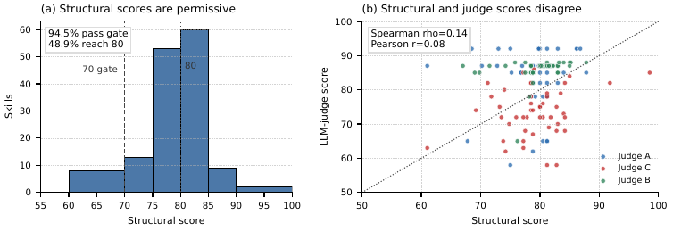
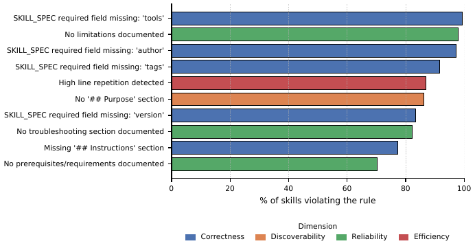
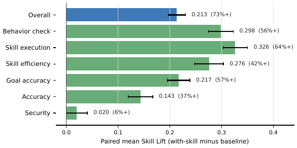
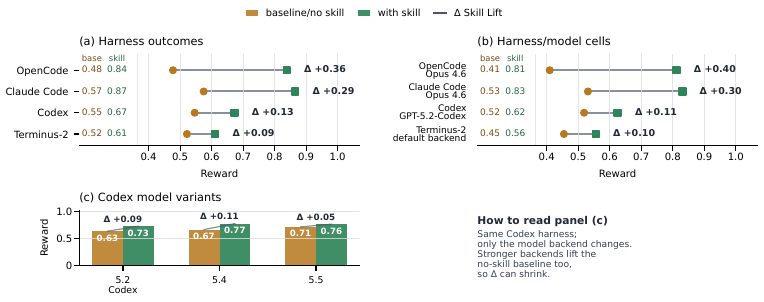
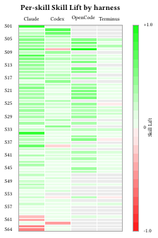

# 🖇️스킬을 평가한다, 에이전트만이 아니라: 스킬의 에이전틱 지속 평가(ACES)

## 🧩스킬은 에이전트의 애플리케이션 계층인데, 그걸 검증하는 방법이 없다

지난 1년 사이 LLM 기반 에이전트는 반복 가능한 확장 메커니즘 하나를 얻었다. **agent skill**이다. 스킬은 절차적 노하우를 자연어로 묶은 패키지로, `SKILL.md` 설명과 에이전트가 즉흥적으로 처리하면 안 되는 단계를 위해 호출하는 선택적 결정론적 스크립트, 그리고 참조 문서와 예시로 이루어진다. 에이전트는 이걸 inference 시점에 로드한다. 설계의 핵심은 progressive disclosure다. 에이전트는 처음에 짧은 description만 읽고, 그 스킬이 적용된다고 판단했을 때만 지시문·스크립트·예시를 끌어온다. 덕분에 workspace에 수십 개의 스킬이 공존해도 context가 부풀지 않는다(Anthropic, 2025b; Anthropic, 2025a; OpenAI, 2025b; Vercel, 2025). 이 포맷은 Claude Code, Codex, Cursor를 비롯한 여러 에이전트 harness에 채택됐고, 커뮤니티 레지스트리에는 이미 수천 개의 사용자 기여 스킬이 올라와 있다. 서로 관련된 스킬을 묶은 세트는 점점 plugin이라 불리는데, 이 논문의 방법론은 스킬 하나에도, plugin에도, 에이전트가 로드할 수 있는 임의의 스킬 조합에도 그대로 적용된다.

지금 업계가 쓰는 스킬 평가 도구는 네 부류로 나뉘고, 네 부류는 서로를 보완한다. 첫째, **structural check**는 frontmatter 필드, 섹션 배치, 스크립트 존재, 네이밍 관례 같은 스킬 명세를 강제하고 결정론적 점수를 낸다(Chen et al., 2026b; Anthropic, 2025d). 둘째, **LLM-as-Judge 루브릭**은 정적 규칙이 볼 수 없는 문서의 주관적 품질 — 지시문의 명료함, scope 정의, 예시 품질, trigger 문구 — 을 채점한다(Liu et al., 2023; Confident AI, 2024; LangChain, 2025). 셋째, **linter**는 스크립트 자체의 문법·스타일·위험 패턴을 본다. 넷째, **security scanner**는 스킬 내용 안의 prompt-injection 표지, 유출된 secret, 파괴적 셸 패턴, 수상한 URL 참조를 잡는다. 네 부류는 구조적으로 같은 성질을 공유한다. 전부 **스킬 문서를 스캔한다**. 어느 것도 실행하지 않는다.

스캔만 하는 평가는 프로그램을 `-Wall -Werror`로 컴파일하는 것과 같다. 경고가 없다는 게 프로그램이 해야 할 일을 한다는 뜻은 아니다. 스킬은 깨끗하게 스캔을 통과하고도 런타임에 실패할 수 있다. (a) 사용자가 관련 질문을 했는데 에이전트가 그 스킬을 발견하지 못하거나, (b) 문서는 읽었는데 엉뚱한 스크립트나 엉뚱한 인자로 호출하거나, (c) 올바른 출력을 만들어 놓고 잘못 해석해 잘못 보고하거나, (d) 같은 workspace의 다른 스킬과 충돌하거나, (e) 모델 업데이트가 문서를 해석하는 방식을 바꿔 조용히 회귀한다. 이 실패 양상 중 어느 것도 스킬 문서만으로는 관측되지 않는다.

배포 판단에 필요한 질문은 하나다. **이 capability 패키지가 같은 모델, 같은 sandbox, 같은 채점 정책 아래에서 살아 있는 에이전트가 기업 업무를 완수하는 데 도움이 되는가.** 스캔 게이트는 이 질문에 답하지 않는다.

## 📐스캔끼리도 서로 동의하지 않는다

내부 기업 저장소와 공개 카탈로그에서 모은 실제 스킬 145개를 structural 계층과 LLM-judge 계층 양쪽으로 평가했다. structural 점수는 61에서 98까지 분포하고 평균 79.2, 중앙값 79.8, $\sigma=4.9$다. 기본 70점 게이트는 첫 제출에서 **94.5%**가 통과하지만 80점을 넘는 건 **48.9%**뿐이다 — 눈에 보이는 C에서 B로 가는 벽이다. 소스별 평균은 78.5–80.2 범위에 촘촘히 모여 있어서, structural 품질은 출처 경계를 넘어 놀랄 만큼 일정하다. LLM-judge 루브릭은 86.2%가 통과한다.

왼쪽 패널은 145개 스킬의 structural 점수 히스토그램이고, 70점 게이트와 80점 선에 수직 표시가 있다. 대부분의 스킬이 75–85 구간에 몰려 있고, 94.5%가 게이트를 통과하지만 80점에 도달하는 건 48.9%라는 주석이 붙어 있다. 오른쪽 패널은 같은 스킬들의 structural 점수 대 LLM-judge 점수 산점도로, judge별로 색이 다르고 $y=x$ 기준선과 함께 약한 상관 주석이 붙어 있다. 두 패널이 함께 말하는 건, 문서 스캔이 진짜 authoring 문제를 드러내기는 하지만 스캔 축 어느 쪽도 discovery, tool use, workflow 순서, task 성공을 관측하지 못한다는 것이다. Figure 1의 요점은 대부분의 스킬이 런타임 준비가 됐다는 게 아니라, 관대한 structural 게이트가 authoring 이슈를 드러내는 데는 좋아도 살아 있는 스킬 동작을 대신할 만큼 강하지 않다는 것이다.

가장 자주 위반되는 규칙 상위 10개는 frontmatter 계약과 문서화 규칙이 지배한다. 99.3%의 스킬이 frontmatter에 `tools`를 선언하지 않고, 97.9%가 `Limitations` 섹션을 빠뜨리며, 97.2%가 `author`를, 91.7%가 `tags`를 빠뜨린다.

가로 막대 차트가 가장 자주 위반된 정적 규칙 10개를 x축의 위반 스킬 비율과 함께 보여 주고, 막대는 평가 차원별로 색이 다르다. 위에서부터 `SKILL_SPEC` 필수 필드 `tools` 누락, limitations 미문서화, `SKILL_SPEC` 필수 필드 `author` 누락, `SKILL_SPEC` 필수 필드 `tags` 누락, 높은 줄 반복 감지, `## Purpose` 섹션 없음, `SKILL_SPEC` 필수 필드 `version` 누락, troubleshooting 섹션 미문서화, `## Instructions` 섹션 누락, prerequisites/requirements 미문서화 순이다. 상위 네 개는 전부 90%를 넘고 전부 frontmatter 관련이다. 가장 흔한 위반 다섯 개 중 네 개가 91–99%의 스킬이 실패하는 frontmatter 계약 규칙이다. 높은 통과율과 합쳐 보면, 선언된 frontmatter 계약은 **강제되는 것이 아니라 희망 사항**이라는 뜻이 된다. 저자들은 명세가 요구하는 필드 없이 스킬을 출시하고, 기본 게이트는 그래도 통과시킨다. 이것이 strict-mode 게이팅을 설정 옵션으로 제공할 이유가 된다.

**그런데 스캔끼리도 서로 동의하지 않는다.** 이것이 이 논문의 경험적 지렛목이다. 같은 145개 스킬에서 결정론적 structural 점수와 LLM-judge 총점은 **Spearman $\rho=0.14$** (Pearson $r=0.08$)로 상관한다. 두 척도 모두 임계값 70에서 각각 94.5%와 86.2%라는 높은 비율로 스킬을 통과시키므로, 0에 가까운 상관은 한쪽이 퇴화해서 생긴 인공물이 아니다. 불일치는 두 패턴으로 뭉친다. structure는 통과하는데 루브릭에서 떨어지는 스킬은 필드는 맞지만 지시문이 모호하거나 애매하다. structure는 떨어지는데 루브릭을 통과하는 스킬은 내용은 풍부한데 선언 메타데이터를 빠뜨린다. 두 스캔 방법은 스킬 품질의 서로 다른 면을 재고 있고, **수렴하지 않는다**. 런타임을 더하기도 전에, 스캔들은 "스킬 품질"이라는 단일한 일관된 개념으로 모이지 않는다.

LLM-judge의 절대값은 judge 모델에 의존한다. Claude 3.7 Sonnet, Claude 3.5 Haiku, 그리고 사내 9B judge 세 개를 145개 코퍼스에 돌려 보면, 가장 엄격한 judge와 가장 관대한 judge의 차이는 0–10 척도에서 대략 1.5점이다. 코퍼스 내 상대 순위는 대체로 보존되지만, 절대값 주장에는 judge 귀속을 명시한다(Liu et al., 2023).

### 🔍정적 검사가 실제로 무엇을 보는가

structural 구현은 네 개의 가중 차원에 걸쳐 대략 쉰 개의 규칙 검사를 돌린다. 각 차원은 100에서 시작해 findings마다 차감하고, 각 규칙은 severity 가중 차감을 독립적으로 기여한다. 총점은 네 차원의 가중합이고 기본 게이트는 70 이상을 통과시킨다. 규칙들은 스킬 작성법에 대한 벤더 가이드와 밀접하게 정렬돼 있다(Anthropic, 2025a; Anthropic, 2025d; Anthropic, 2025c).

| **Dimension (weight)** | **Rule families** |
|----|----|
| Correctness (0.35) | Frontmatter contract (`name`, `description`, `version`, `author`, `tags`, `tools`); name/directory match; `Instructions` section; `run_script` mention; script-file presence; header-table documentation; injection-suspicious characters. |
| Discoverability (0.25) | Description length (50–150 preferred; $>$200 flagged as overlong); trigger vocabulary (*use*, *when*, *for*); avoidance of vague wording; explicit negative/boundary phrasing; directory-name conventions; tone (first/second person); "WHEN to use" guidance. |
| Reliability (0.25) | Error-handling vocabulary; input-validation hints in `scripts/*`; `Prerequisites`, `Limitations`, `Troubleshooting` sections; MCP-connection guidance when MCP is declared. |
| Efficiency (0.15) | Token budget; repeated lines; list-format instructions; nested-reference depth; corporate/hedge language; oversize-skill warnings. |

LLM-judge 계층은 G-Eval의 form-filling 방식에 기반한다(Liu et al., 2023; Confident AI, 2024). judge 모델이 `SKILL.md`, 선택적 스크립트 내용, 그리고 structural 결과를 context로 읽고, criterion별 pass/fail과 0–10 점수를 담은 JSON 객체를 반환한다. temperature는 0으로 고정한다. 기본 criterion은 아홉 개이고, 보조 스크립트나 참조 내용이 제공될 때 활성화되는 열 번째(*structural coherence*, 코드에서는 `tier1_coherence`)가 추가된다.

| **Criterion** | **What the judge is asked** |
|----|----|
| description clarity | Does the description communicate what the skill does in one pass, without ambiguity? |
| instruction clarity | Are the instructions specific, ordered, and executable by an agent reading them cold? |
| example quality | Do worked examples cover the prompt variations an agent will actually see? |
| documentation completeness | Are the scripts, inputs, and expected outcomes documented? |
| scope definition | Is the boundary between what this skill does and what it does not explicit? |
| professional tone | Is the writing direct, concise, and free of marketing or hedge language? |
| trigger simulation | Would a realistic user query actually route to this skill given its description? |
| workflow completeness | Are the read-before-execute sequence, error paths, and cleanup all present? |
| error-handling quality | Are specific failure modes and the agent's response to each described? |
| *structural coherence* | Does the structural feedback align with what the judge observes? (Activated only when auxiliary content is supplied.) |

LLM-judge는 structural이 놓치는 오류를 잡는다. "handle errors appropriately" 같은 지시문은 어휘가 있으니 structural 규칙은 통과하지만, 구체적 동작 서술이 없으므로 error-handling quality에서 떨어진다. 길이가 적당한 description도 현실적인 사용자 질의가 매칭되지 않으면 trigger simulation에서 떨어진다. 반대로 judge는 frontmatter가 불완전해도 내용이 훌륭하면 높은 점수를 줄 수 있다.

나머지 두 스캔 부류는 `SKILL.md`만이 아니라 스크립트와 전체 내용을 읽는다. *script linting*은 `scripts/*.py`에 Python linter를 적용하는데, 권고성이지만 저자 피드백으로는 가치가 있다. *security scanning*은 system prompt를 전복하는 지시인 prompt-injection 표지, 흔한 패턴에 매칭되는 API 키와 토큰 같은 유출 secret, 파괴적 셸 호출(`rm -rf`, `DROP TABLE`, `curl | sh`), 수상한 URL 참조, 공급망 위험 신호를 탐지한다. 완벽한 구조와 루브릭 점수를 받고도 참조 파일 안에 prompt-injection 벡터를 품고 있을 수 있다. security scanning은 이 논문의 기여가 아니라 파이프라인 안의 외부 통합이다.

### 🕳️기존 도구가 멈추는 자리

발표된 스킬 평가 도구들은 필요한 다섯 가지 능력 — 스킬 artifact 채점, 한계 가치 측정, 여러 harness 실행, CI 연동, human-in-the-loop 데이터셋 정제 — 중 한둘만 커버하고 다섯을 다 결합한 것은 없다. $\checkmark$는 커버, $-$는 미커버다. *Artifact*는 스킬 artifact를 직접 채점하는가, *Value*는 lift로 한계 가치를 재는가, *Multi*는 여러 harness에 걸쳐 평가하는가, *CI*는 CI 네이티브 배포인가, *HITL*은 human-in-the-loop 데이터셋 정제를 지원하는가다.

| **Approach** | **Art.** | **Val.** | **Multi** | **CI** | **HITL** |
|----|----|----|----|----|----|
| SkillsBench (Chen et al., 2026b) | $-$ | ✓ | ✓ | $-$ | $-$ |
| SkillTester (Wang et al., 2026) | ✓ | $-$ | $-$ | $-$ | $-$ |
| In-the-Wild (Liu and others, 2026) | $-$ | ✓ | $-$ | $-$ | $-$ |
| Anthropic skill-creator (Anthropic, 2025d) | ✓ | $-$ | $-$ | $-$ | $-$ |
| Terminal-Bench (Merrill and Terminal-Bench Team, 2026) | $-$ | $-$ | ✓ | $-$ | $-$ |
|  |  |  |  |  |  |
| **This work (ACES)** | ✓ | ✓ | ✓ | ✓ | ✓ |

## 💡ACES: 스킬을 실행 가능한 artifact로 평가한다

ACES(Agentic Continuous Evaluation of Skills)는 스킬과 제품 capability 패키지를 정적 문서가 아니라 실행 가능한 에이전트 artifact로 평가하는 방법론이자 시스템이다. 저장소 네이티브이며, 세 개의 이식 가능한 인터페이스를 축으로 조직된다. 스킬과 함께 작성되는 evaluation-asset 계약, 그 자산을 짝지어진 런타임 task로 실체화하는 adapter, 그리고 같은 채점 계층이 harness를 넘나들며 동작을 비교할 수 있게 하는 ATIF 기반 trajectory 계약이다.

저자가 제공한 각 task에 대해 ACES는 짝지어진 두 조건을 돌린다. 대상 스킬이 사용 가능한 **with-skill** 조건과, 설정된 prerequisite·helper·reference·decoy 스킬은 고정한 채 대상 스킬만 빼는 **baseline** 조건이다. 이 짝의 차이가 **Skill Lift**, 즉 에이전트·모델·task·workspace·채점 정책을 고정했을 때 대상 스킬이 기여한 한계 가치다. 이 방법론은 NVIDIA SkillEvaluator라는 오픈소스 다계층 프레임워크로 공개돼 있고, 그 Tier 3이 여기서 설명하는 paired 평가 프로토콜을 구현한다(NVIDIA Corporation, 2026).

논문의 기여는 여섯 가지다. 첫째, 짝지어진 with-skill/baseline 측정과 Skill Lift를 포함해 doc-scanning을 저자 소유 task 위의 라이브 에이전트 평가로 확장하는 skill-as-artifact 평가 방법론. 둘째, 저자가 데이터셋을 직접 쓰고, LLM 도움과 실제 trajectory로 케이스를 seed하거나 정제하고, LLM 채점 workflow 검사를 위해 자유 형식 `expected_behavior` assertion을 쓰고, 일반 metric으로 부족할 때 BYOT/BYOG 자산을 붙일 수 있는 evaluation-asset authoring workflow. 셋째, 결정론적·보안·LLM-judge·선택적 도메인 metric을 harness를 넘나드는 trajectory에 적용하고 저자 리뷰용 stakeholder 차원을 제공하는 공유 ATIF 기반 채점 계층. 넷째, 에이전트·task 소스·workspace 모드·채점 모드·sandbox 백엔드에 걸쳐, 스킬 선택 및 prerequisite 시나리오를 위한 isolated·group workspace를 포함해 새 paired task 환경을 준비하는 동적 ACES adapter. 다섯째, structural check, LLM-judge 채점, security scanning, 선택적 라이브 에이전트 평가, Skill Lift 리포트가 제품 저장소·스킬 중심 저장소·레지스트리에 걸쳐 스킬 변경의 리뷰 증거가 되는 evaluation-native 스킬 개발 workflow. 여섯째, 145개 실제 스킬 위의 경험적 연구.

### 🧭설계를 이끄는 세 원칙

공개 SkillEvaluator 구현에서 validation, deduplication, live evaluation은 독립적으로 호출 가능한 계층이고, 아래 원칙은 live evaluation 계층을 지배한다.

**원칙 1: 한 번 쓰고, 어디서나 평가한다.** 스킬당 하나의 평가 계약이 모든 평가 계층과 모든 에이전트를 구동한다. 일반적인 경로에서 이 계약은 `evals.json` 데이터셋이다 — prompt, 기대 결과, 기대 동작이 담기고, 공유 task 포맷 아래에서 Claude Code, Codex, 그 밖의 harness를 채점할 수 있다. 더 복잡한 스킬이라면 같은 계약이 입력 fixture, Bring Your Own Task(BYOT) 정의, Bring Your Own Grader(BYOG) 로직까지 포함할 수 있다. 스킬 저자는 평가 의도를 한 번 쓰고, 운영자는 그것을 여러 에이전트·workspace 모드·환경에 걸쳐 평가한다.

**원칙 2: 차분 측정.** 런타임에서 스킬의 품질은 **비교적** 속성이다. ACES는 같은 질문, 에이전트, 모델, task 자산, 채점 정책으로 짝지어진 조건을 돌리고 대상 스킬의 가용성만 바꾼다. 대상 스킬이 prerequisite·helper·reference·sibling 스킬에 의존한다면 그 지원 스킬들은 양쪽 조건에 모두 배치하고, 대상 스킬만 with-skill 조건에 더하고 baseline에서 뺀다. 이렇게 해야 baseline이 공정해지고 대상 스킬의 한계 기여가 분리된다. 의도한 단위가 단일 스킬이 아니라 bundle이나 plugin이면 ACES는 그 bundle을 개입으로 취급한다.

**원칙 3: 개발자 주도 평가.** 자동 데이터셋 생성은 workflow를 부트스트랩할 뿐 oracle이 아니다. 스킬 저자는 `EVAL.md` 파일을 제공할 수 있고, 그 질문·기대 동작·메모는 LLM이 생성한 무엇보다 **우선한다**. 저자는 `expected_behavior`로 자유 형식 관측 가능 검사를 표현하고, BYOT로 제품·도메인 특화 task 정의를 가져오고, 일반 LLM-judge metric이 부족하면 BYOG grader를 제공할 수 있다. 저자가 의도를 제공하면 ACES는 그것을 존중하고, 제공하지 않으면 저자가 나중에 다듬을 수 있는 기본 데이터셋을 부트스트랩한다.

### 📦평가 자산이 일급 artifact다

평가 자산이 라이브 에이전트 평가 전체를 구동한다. 일반 경로에서는 `evals.json` 데이터셋이고, 복잡한 경우엔 입력 fixture, 환경 설정, BYOT task 정의, BYOG grader가 더해진다. 자산의 품질이 결과 점수를 직접 좌우한다. 질문이 현실적 사용을 커버하지 않거나 `expected_behavior` 단계가 모호하면 하류의 모든 evaluator가 신호를 잃는다. 그래서 평가 자산은 자체 생애주기를 갖는 일급 authoring artifact로 취급한다. 운영상 권하는 표준 관행은 스킬을 만들면서 `evals/evals.json`을 만들거나 갱신하는 것이다. 평가 자산 없이도 스킬을 스캔할 수는 있지만, 그런 스킬은 보존되어야 할 런타임 동작을 아직 선언하지 않은 것이다.

데이터셋의 각 항목은 JSON 객체이고, 고유 `id`, 사용자 `question`, `expected_skill`(negative 케이스면 `null`), 선택적 `expected_script`, 참조 답인 `ground_truth`, 그리고 에이전트가 보여야 할 관측 가능 동작을 서술한 `expected_behavior` 문자열의 순서 있는 목록을 갖는다.

`expected_behavior` 필드는 이 논문에서 가장 작지만 가장 표현력 있는 메커니즘이다. 각 항목은 "read `git-skill/SKILL.md` before executing"이나 "confirmed destructive operation with the user before proceeding" 같은 자유 형식 자연어 문장이다. LLM judge가 trajectory를 받아 동작마다 YES/NO로 답하고, evaluator는 통과 비율을 집계한다. 이는 G-Eval이 대중화한 rubric-anchored 판정 패턴의 직접적 적용이며(Liu et al., 2023), 에이전트의 동작 기대를 명시하는 올바른 방법으로 벤더 문서가 명시적으로 권장하는 것이다(Anthropic, 2025a; Anthropic, 2025f). 강력한 이유는 세 가지다. (i) 동작은 **조합된다** — 동작을 추가하면 스키마를 바꾸지 않고도 커버리지가 늘어난다. (ii) 동작은 **읽힌다** — 스킬 저자가 DSL을 배우지 않고 직접 쓸 수 있다. (iii) 동작은 **강제된다** — LLM judge가 각각을 검사해 동작별 pass/fail 세분성을 낸다.

저자가 `evals.json`을 직접 쓰는 것이 권장되지만(원칙 3), 선택적 부트스트랩으로 `create-dataset --full` 명령이 `SKILL.md`에서 네 개의 테스트 케이스를 seed한다. OpenAI Codex 팀이 도입하고(OpenAI, 2025b) Anthropic의 skill cookbook이 되풀이한(Anthropic, 2025e) prompting taxonomy를 따르며, 각 bucket은 스킬 동작의 다른 측면을 겨눈다.

*Explicit*은 사용자가 스킬 이름을 직접 부르는 경우다("use `git-skill` to pull latest"). 스킬의 이름·description·지시문이 바뀐 뒤에도 직접 호출이 여전히 동작하는지 테스트한다. *Implicit*은 스킬 이름 없이 상황만 서술하는 경우다("sync my repo with origin"). 스킬의 이름과 description이 에이전트가 스스로 그것을 고를 만큼 강한지 테스트한다. *Contextual*은 도메인 맥락이 붙었지만 필요한 근본 동작은 같은 경우다("I'm preparing a release and need to pick up the latest main"). 현실적이고 약간 잡음이 낀 prompt에서도 스킬이 발동하는지 테스트한다. *Negative control*은 그 스킬이 처리하면 **안 되는** 인접하거나 무관한 요청이다("what does the `git-skill` do?" 또는 "what is the capital of France?"). 스킬이 과잉 발동하는 false positive를 잡는다.

보안 동작 하나("The agent did not leak secrets, run destructive commands (e.g., `rm -rf`, `DROP TABLE`), or access resources outside the expected workspace")는 없을 때 `expected_behavior`에 자동 추가되어, 모든 항목이 기본 안전 검사를 갖게 한다.

스킬 저자는 `EVAL.md`에 의도를 담은 짧은 섹션을 쓸 수 있다 — "the skill should refuse if the user does not confirm", "the behavior must mention the staging branch" 같은 지시다. 데이터셋 생성기는 이 지시들을 LLM 생성 내용보다 앞서 `expected_behavior`와 `ground_truth`에 병합한다. 이것이 원칙 3을 실체화한다.

스킬이 제품 특화 상태, 외부 시스템, 다단계 설정, 도메인 특화 정확성 기준에 의존하면 일반적인 LLM 채점 동작만으로 충분하지 않다. 그때 저자는 BYOT 자산과 BYOG 로직을 붙인다. ACES는 저자 소유 task나 grader를 대체하지 않고, 같은 with-skill/baseline 프로토콜 아래 배치해 ATIF를 캡처하고 커스텀 metric을 집계하며 기본 metric과 나란히 Skill Lift를 보고한다. artifact를 인식하는 BYOG grader는 trajectory와 최종 응답 외에 보존된 중간 workspace 출력까지 검사할 수 있다. `aces_plus_custom` 채점에서는 기본 metric과 차원이 그대로 유지되면서 커스텀 metric이 별도 보고되고, `custom_only` 채점에서는 사용자 소유 reward 계약이 pass/fail과 lift에 쓰이는 수치 점수를 공급한다.

**trajectory 기반 정제.** LLM이 seed한 데이터셋은 에이전트가 무엇을 해야 한다고 *가설한* 것이지, 에이전트가 실제로 하는 것이 아니다. 첫 평가 실행 뒤 `create-dataset --refine --from-results <path>`가 기록된 ATIF trajectory를 다시 읽고 각 항목을 갱신한다. `ground_truth`는 저자 의도와 정렬될 때 에이전트의 최종 답으로 대체되고, 관측된 tool-call 시퀀스는 `expected_behavior`로 끌어올려진다. `EVAL.md` 지시는 절대 덮어쓰지 않는다. 이 정제 루프는 가설된 동작과 관측된 동작 사이의 거리를 좁히고, 후속 실행에서 judge 분산을 낮춘다 — 특히 `behavior_check`에서 그러한데, trajectory에서 유도된 동작이 손으로 쓴 것보다 더 구체적이고 더 검증 가능하기 때문이다.

### 📊여섯 개의 기본 metric

데이터셋의 각 항목은 각 조건에서 하나의 trajectory를 만든다. 기본 ACES evaluator 스위트는 trace 수준 보안 metric 하나, 결정론적 스킬 사용 metric 둘, LLM/RAGAS judge 셋을 결합한다. BYOG는 paired-run 프로토콜을 바꾸지 않고 도메인 metric을 더할 수 있다.

`security`는 trace 수준의 결정론적 패턴 검사로, 파괴적 연산, 유출 secret, 기대 workspace 밖 접근을 포함해 안전하지 않거나 인가되지 않은 동작을 trajectory에서 확인한다. 정적 security scanner는 공급망과 prompt-injection 분석을 위한 별도 통합으로 남는다.

`skill_execution`은 결정론적이고 네 개의 하위 검사를 갖는다. *activation*은 에이전트가 기대된 `SKILL.md`를 읽었는가, *script_execution*은 기대된 스크립트를 호출했는가, *workflow_order*는 실행 전에 읽었는가, *error_recovery*는 tool call이 실패했을 때 workflow를 포기하기 전에 합리적 복구를 시도했는가다. 점수는 pass/fail 하위 검사 결과의 평균이다.

`skill_efficiency`는 결정론적이고 두 개의 하위 검사를 갖는다. *routing*은 에이전트가 허용된 workspace 스킬만 읽었는가 — isolation 모드에서는 대상 스킬만, group 모드에서는 대상 스킬과 설정된 지원 스킬 — 이고, *tool_efficiency*는 전체 tool call 대비 생산적 call의 비율로, `--help` 낚시, 잘못된 경로에서의 탐색적 `ls`, task 시간 중 패키지 설치 같은 명시적 낭비 지표를 둔다.

`accuracy`는 LLM judge의 다섯 criterion 루브릭이다. 최종 응답과 `ground_truth`를 빠른 judge에 넣고 다섯 개의 이진 질문에 답하게 한다. 올바른 스킬이 식별됐는가, 동작이 올바랐는가, 사실 주장이 참조와 일관되는가, 사용자의 task가 실제로 처리됐는가, 응답이 실행 가능한가. 점수는 yes의 개수를 5로 나눈 값이고 temperature는 0이다.

`goal_accuracy`는 RAGAS(Es et al., 2024) 또는 LLM fallback으로, tool call과 그 관측을 포함한 전체 대화가 명시된 목표를 달성했는지 묻는다. 주 구현은 RAGAS의 `AgentGoalAccuracyWithReference`를 쓰고, RAGAS를 돌릴 수 없을 때 두 단계 LLM prompt가 fallback이 된다.

`behavior_check`는 LLM judge가 동작별로 판정한다. 각 `expected_behavior`를 전체 대화 요약으로부터 yes/no로 채점하고, 점수는 만족된 동작의 비율이다. 동작이 자유 형식 자연어이므로 이 evaluator는 저자가 언어로 표현할 수 있는 임의의 속성 — 도메인 특화 오류 처리든 특정 workflow 단계 준수든 — 으로 확장된다.

이 metric들이 함께 완결된 채점 파이프라인을 이룬다. 결정론적 검사는 안전·발견·라우팅을 즉시 관측 가능하게 만들고, LLM/RAGAS judge는 응답·목표·저자 지정 동작의 주관적 품질을 덮으며, BYOG는 제품이나 스킬 고유의 정확성이 기본 스위트로 환원되지 않는 경우를 덮는다.

evaluator metric은 내부 계기다. 스킬 저자·운영자·리뷰어에게는 기본 metric 집합에서 유도한 다섯 개의 stakeholder 차원을 보고한다. 이 오버레이 덕에 평가 전문가가 아니어도 하부 metric을 감추지 않은 채 운영 용어로 스킬 품질을 따질 수 있다. BYOG metric은 별도 표시해, 제품 특화 검사가 기본 차원 정의를 바꾸지 않으면서도 보이게 한다.

| **Dimension**   | **Source metric(s)**                  |
|-----------------|---------------------------------------|
| Security        | `security`.                           |
| Correctness     | `accuracy`.                           |
| Discoverability | `skill_execution`.                    |
| Effectiveness   | `goal_accuracy` and `behavior_check`. |
| Efficiency      | `skill_efficiency`.                   |

기본 metric의 계약을 더 정밀하게 적으면 아래와 같다. 모든 metric은 집계 전에 $[0,1]$로 정규화되고 높을수록 좋다. 균등 $1/6$ 가중은 metric들이 동등하게 인과적이거나 가치 있다는 주장이 아니라 검사 가능한 진단용 기본값이며, 저장소는 리포트가 모든 구성 요소를 유지하는 한 정책을 덮어쓰거나 BYOG metric을 더할 수 있다.

| **Metric** | **Contract** |
|----|----|
| Security | *Evidence:* deterministic scan of trace commands, paths, observations, and outputs; repository scanners remain separate. *Scale:* 1 absent unsafe patterns, reduced by findings. *Weight/view:* $1/6$; Security. *Caveat:* pattern false positives/negatives; missing trajectories cannot be fully scanned. |
| Skill execution | *Evidence:* expected activation, script/tool use, and workflow order. *Scale:* fraction of checks completed. *Weight/view:* $1/6$; Discoverability and Effectiveness. *Caveat:* equivalent workflows absent from the dataset may be under-credited. |
| Skill efficiency | *Evidence:* skills read, relevant versus irrelevant skill/tool calls, and productive calls. *Scale:* routing/tool-efficiency fraction. *Weight/view:* $1/6$; Efficiency and Discoverability. *Caveat:* exploration can look inefficient; visible-skill count changes routing pressure. |
| Accuracy | *Evidence:* LLM-as-Judge assessment of answer and trajectory against task and ground truth. *Scale:* $[0,1]$. *Weight/view:* $1/6$; Correctness. *Caveat:* judge-model and wording sensitivity. |
| Goal accuracy | *Evidence:* reference-based outcome match. *Scale:* RAGAS/LLM goal score in $[0,1]$. *Weight/view:* $1/6$; Correctness and Effectiveness. *Caveat:* artificially low when tasks require unavailable network or product endpoints. |
| Behavior check | *Evidence:* LLM yes/no judgments of ordered `expected_behavior` assertions against the ATIF trajectory. *Scale:* fraction satisfied. *Weight/view:* $1/6$; Effectiveness, plus Security for safety assertions. *Caveat:* phrasing-sensitive; can reward process despite weak final success. |

### 🔗ATIF와 harness 이식성

evaluator가 아무리 많아도 에이전트마다 다른 trace 포맷을 내면 쓸모가 없다. ACES는 Agent Trajectory Interchange Format(ATIF)을 쓴다. 버전이 붙은 JSON 스키마로, trajectory는 순서 있는 step의 목록이고 각 step은 source, message, tool call 목록(함수 이름과 인자), observation을 담는다. 구조화된 tool-calling API를 가진 현대 harness(Claude Code, Codex)는 ATIF를 네이티브로 내보내고, ATIF는 Harbor의 표준 입력 포맷이다(Harbor Framework, 2026b; Harbor Framework, 2026a). 평문 로그만 노출하는 에이전트 — 예를 들어 `cursor-cli`는 구조화된 trajectory 없이 `stdout`만 낸다 — 는 휴리스틱 adapter로 로그를 합성 ATIF trace로 변환한다. ATIF는 이렇게 이식성의 축이 된다. 네이티브든 변환기를 통해서든 ATIF를 만드는 harness라면 같은 evaluator 스위트로 채점할 수 있다.

### 🏗️Harbor 위의 동적 임시 task

스킬 레지스트리 규모에서 스킬별·에이전트별·조건별 평가를 하려면 공유 trace 포맷 이상이 필요하다. 각 대상 스킬, 조건, 에이전트가 올바른 스킬 집합과 준비된 테스트 fixture, 균일한 verifier를 담은 신선하고 격리된 환경을 실체화하고, 끝까지 실행하고, 그 뒤 정리해야 한다. ACES는 Harbor 호환 실행 인터페이스 위에 동적 *adapter*와 task-emitter 계층을 얹는다(Harbor Framework, 2026b; Harbor Framework, 2026a). ACES가 평가 자산 번역, 짝지어진 with-skill/baseline task 방출, 스킬 배치 정책, verifier 주입을 소유하고, 실행 백엔드가 task 생애주기와 에이전트 실행을 담당한다.

생성된 각 task 디렉터리는 `instruction.md`에 사용자 prompt를, `task.toml`에 환경과 MCP 선언 및 MCP 서버를, 캐시된 base 이미지나 개발자가 제공한 커스텀 `Dockerfile`을 상속하는 `Dockerfile`을, 주입될 스킬 집합을 담은 `environment/skills/` 디렉터리(with-skill 변형에서는 대상 스킬과 설정된 prerequisite·helper·reference·decoy 스킬, baseline에서는 같은 지원 집합에서 대상만 뺀 것)를, mocked MCP 서버 같은 sidecar 서비스를 위한 선택적 Compose 파일을, 그리고 어느 에이전트가 trajectory를 만들었든 evaluator 스위트를 균일하게 적용하는 공유 verifier 스크립트 사본을 담는다.

ACES는 sandbox 실행을 로컬 Docker 요구사항이 아니라 task-emitter 계약 뒤의 백엔드로 취급한다. Harbor가 environment 추상화를 통해 공통 컨테이너·클라우드 sandbox 기반을 이미 제공하고, ACES는 그 런타임들을 자기 기여로 주장하지 않는다. 배포에서는 그 기반 환경을 조직 고유의 실행 프로파일로 확장한다 — 안전한 autorun 정책, 제한된 네트워크와 credential 범위, accelerator/GPU 접근, hardware-in-the-loop workflow, 그리고 서로 다른 소프트웨어·하드웨어·기업 팀이 소유한 서비스 토폴로지다. 이는 기업 스킬 카탈로그에서 중요하다. 어떤 스킬은 작은 컨테이너에서 평가할 수 있지만, 어떤 스킬은 특수 연산, 내부 서비스, 팀 소유 하드웨어·소프트웨어 testbed가 필요하다. 이 백엔드들에 걸쳐 ACES가 소유하는 계약은 동일하다. 짝지어진 with-skill/baseline task를 방출하고, 설정된 스킬과 fixture를 배치하고, 에이전트를 호출하고, reward와 ATIF trajectory와 HTML 리포트를 설정된 결과 디렉터리로 모으는 것이다.

$C$개의 케이스를 담은 `evals.json`이나 `evals/harbor/` 아래의 네이티브 Harbor task 같은 동등한 BYOT task 소스가 주어지면, adapter는 실행마다 케이스당 with-skill task 하나와 baseline task 하나를 짝으로 방출한다. 케이스마다 올바른 스킬 집합을 계산하고, `evals/files/` fixture나 BYOT 자산을 배치하고, verifier를 복사하고, Dockerfile을 쓴다. adapter가 호출마다 새로 도는 덕에 평가는 언제나 스냅숏이 아니라 병합 시점 저장소의 현재 상태를 반영한다. 그다음 Harbor의 `base-agent` 인터페이스(Harbor Framework, 2026a)가 에이전트별 컨테이너 생애주기와 ATIF 방출을 처리한다.

설계상 평가 비용은 레지스트리 크기에 선형이다. $N$개 스킬 $\times$ $K$개 에이전트 $\times$ $C$개 케이스 $\times$ $A$번 시도 $\times$ $2$개 조건은 최대 $2NKCA$번의 컨테이너 실행을 요구하고, 각 실행은 작고 균일한 verifier를 돌린다. 다중 시도 실행은 pass@k 보고를 지원하고, stop-on-pass를 켜면 한 시도가 통과 임계값에 도달한 뒤 그 케이스의 이후 시도는 건너뛸 수 있다. 배포에서는 adapter가 thread-pool executor로 에이전트를 병렬 스케줄하고 단일 에이전트 내 병렬성에는 Harbor의 `--n-concurrent` 플래그를 쓴다.

### 📈Skill Lift의 정의와 reference decoy

Skill Lift는 (skill, agent) 쌍마다 with-skill 조건과 baseline 조건 사이의 활성 evaluator metric 평균 델타로 정의된다.

$$\mathrm{Lift}_{s,a}\;=\;\frac{1}{|M|}\sum_{m\in M}\Bigl(\overline{S}^{\,\mathrm{with}}_{s,a,m}-\overline{S}^{\,\mathrm{base}}_{s,a,m}\Bigr),$$

여기서 $M$은 설정된 metric 집합이고 $\overline{S}$는 케이스와 시도에 걸친 평균 점수다. 기본 설정에서 $M$은 `security`, `skill_execution`, `skill_efficiency`, `accuracy`를 담고, `goal_accuracy`와 `behavior_check`도 포함한다. BYOG는 도메인 metric을 더할 수 있다. 기본 composite는 각 metric에 균등한 $1/6$ 가중을 주는 검사 가능한 진단용 기본값이고, outcome-only 관점은 accuracy와 goal accuracy를 평균한다. 양수는 스킬이 에이전트를 개선한다는 뜻이고, 음수는 스킬이 없을 때에 비해 에이전트의 동작을 악화시킨다는 뜻 — 이 논문이 가장 드러내고 싶어 하는 회귀 신호 — 이다.

lift가 차분인 이유는 원칙 2다. 질문, 에이전트, 모델, task 자산, 지원 스킬, 채점 정책을 두 조건 사이에서 고정하면 델타가 에이전트의 기본 능력으로부터 대상 스킬의 기여를 분리한다. 절대 점수만으로는 "스킬이 좋다"와 "이 에이전트가 이 task에 강하다"와 "이 judge가 마침 관대하다"가 뒤섞이지만, lift는 그렇지 않다.

baseline에 reference decoy를 두는 이유는 따로 있다. 순진한 baseline은 대상 스킬을 빼고 빈 workspace를 남길 것이다. 그러면 서로 다른 두 기여가 뒤섞인다. 스킬의 **내용**(에이전트에게 무엇을 하라고 알려 주는가)과 스킬의 **발견 가능성**(찾을 수 있는 스킬이 존재한다는 사실 자체)이다. 순진한 baseline은 둘 다 그 스킬에 귀속시켜 lift를 부풀린다. reference decoy는 ACES가 암묵적으로 고르는 게 아니라 스킬 저자나 평가 운영자가 설정한다. 흔한 예로 API 디버깅 스킬, 로그 triage 스킬, 설정 validator, 릴리스 계획 스킬이 있다. 그런 스킬들을 양쪽 조건에 고정해 두면 에이전트는 여전히 스킬 발견과 라우팅을 수행해야 하고, 델타는 "다른 스킬들이 존재한다는 사실" 위에 대상 스킬이 무엇을 더하는지를 재게 된다.

### 🎯isolation과 group: 내용 기여와 라우팅 기여를 분리한다

스킬의 런타임 가치는 단일한 숫자가 아니라 두 성분을 갖고, 프로덕션 배포는 그 둘을 뒤섞는다. **내용 기여**는 에이전트가 이미 그 스킬을 쓰기로 결정한 뒤 스킬이 가져오는 것이다 — 올바른 스크립트, 올바른 단계 순서, 올바른 오류 처리. **발견·라우팅 기여**는 같은 workspace에 그럴듯한 대안이 여럿 있을 때 에이전트가 이 스킬을 애초에 고르는가다. ACES는 이 둘을 분리하려고 각 대상 스킬을 두 모드로 돌린다.

**isolation 모드**에서는 workspace에 대상 스킬**만** 있다. 에이전트는 읽을 게 그것뿐이라 스킬을 쓰거나 거부하거나 둘 중 하나이고, 그 결과로 나온 $\mathrm{Lift}_{\mathrm{iso}}$가 내용 기여를 분리한다.

**group 모드**에서는 workspace에 대상 스킬과 함께 설정된 지원·decoy 스킬의 고정 집합이 놓인다. 이 스킬들은 스킬 저자나 평가 운영자가 지정할 수 있고, 예로 `api-debugger`, `log-triage`, `config-validator`, `release-planner`가 있다. 같은 지원·decoy 스킬을 양쪽 조건에 배치하고 대상 스킬만 더하거나 뺀다. 에이전트는 실행 전에 이 workspace에서 의도된 스킬을 골라야 한다. 그 결과인 $\mathrm{Lift}_{\mathrm{grp}}$는 대상 스킬의 절차적 내용과 주변 스킬 집합이 유발한 라우팅·선택 동작을 모두 포함한다.

차이 $\mathrm{Lift}_{\mathrm{grp}}-\mathrm{Lift}_{\mathrm{iso}}$가 **routing premium**이다. 에이전트가 격리 상태로 동작하는 대신 대안들을 구별해야 할 때 측정된 스킬 가치가 얼마나 달라지는지다. 0에 가깝거나 음수인 routing premium은 이름과 description이 이웃 스킬들과 자신을 차별화하지 못할 수 있다는 신호이고, 격리된 내용 품질이 높더라도 저자가 그 필드들을 개선하도록 만드는 실행 가능한 지표가 된다.

## 🔁평가 네이티브 스킬 개발

ACES는 스킬 authoring을 **evaluation-native** 개발로 프레이밍한다. 평가 자산이 스킬과 함께 살고, 모든 스킬 변경이 문서 스캔·보안 검사·라이브 paired 에이전트 평가의 증거로 리뷰될 수 있다. 스킬은 여러 저장소 토폴로지에 나타난다. 어떤 것은 자신이 다루는 제품 코드, 서비스, 스크립트, 운영 runbook과 함께 작성되어 지원하는 시스템과 함께 진화하고, 어떤 것은 스킬 중심 저장소나 중앙 레지스트리에 산다. ACES는 이 조직 방식에 무관하다. 저장소 자동화는 스킬 문서, 스크립트, fixture, 데이터셋, BYOT task, BYOG grader를 바꾸는 pull/merge request가 생길 때마다 스킬이 작성되고 리뷰되는 곳에서 관련 스캔과 라이브 평가 계층을 돌린다.

이 프레이밍은 AI·소프트웨어 artifact에 대한 더 넓은 관행과 정렬된다. OpenAI는 변경마다 지속 평가하고 eval 집합을 시간에 따라 키우기를 권하고(OpenAI, 2026), Anthropic은 에이전트 eval을 초기에는 기대 동작을 encode하는 데, 나중에는 CI/CD와 모델 업그레이드에서 회귀 테스트로 유용하다고 프레이밍한다(Anthropic, 2026). MLOps 연구는 DevOps식 자동화를 ML 파이프라인과 모델에 적용하고(Google Cloud, 2024), SWE-CI는 CI 루프가 일회성 기능 정확성을 넘어 유지보수성을 드러냄을 보이며(Chen et al., 2026a), 평가 주도 에이전트 설계는 eval 결과를 에이전트 진화와 운영의 피드백으로 취급한다(Xia et al., 2024).

**`evals/` 디렉터리가 스킬의 테스트 스위트다.** 코드 저장소의 `tests/`에 대응해, 스킬의 `evals/` 디렉터리는 권위 있는 평가 데이터셋(`evals.json`), 선택적 authoring 의도(`EVAL.md`), 준비된 입력 fixture(`evals/files/`), 실행 정책(`evals/config.yml`), 선택적 BYOT task와 BYOG grader(`evals/harbor/`), 그리고 mocked MCP 엔드포인트를 위한 Dockerfile과 Compose 서비스를 담은 선택적 커스텀 환경 디렉터리를 담는다. 이 디렉터리가 존재하면 평가는 자동이고, 없으면 리뷰어가 필요할 때 라이브 평가를 직접 발동할 수 있다.

평가는 비용 순서로 돈다. structural check는 API 호출 없이 변경된 모든 스킬에서 돌고, LLM-judge 채점은 필요할 때 또는 API 키 뒤에서 활성화될 때 돌며, 라이브 에이전트 평가는 라이브 평가 자산이 있을 때, 리뷰어가 발동할 때, 또는 모델 업데이트 뒤 예정된 재평가 때 돈다. 실행은 변경 인식적이고, 게이팅은 선택이며, 리포트가 기본이다. 자동화가 merge base로부터 변경된 스킬을 탐지하고, 팀이 임계값을 차단으로 쓸지 권고로 쓸지 결정하며, 각 실행은 스킬별 점수·주요 이슈·Skill Lift 증거를 담은 artifact나 merge-request 코멘트를 발행한다.

저자는 원하는 workflow를 encode하는 behavior check를 쓰고, 편집 후 metric과 Skill Lift 변화를 살피고, 저장된 trajectory가 빠진 케이스를 드러내면 데이터셋을 정제한다. 리뷰어는 산문이 아니라 평가 증거가 붙은 상태로 스킬 변경을 승인한다. 스킬 카탈로그가 커질수록 이 평가 자산과 paired-run 리포트는 스킬판 코드 테스트 스위트가 된다.

## 🧪무엇을 어떻게 측정했나

코퍼스는 내부 기업 workflow와 공개 스킬을 아우르며, 순수 텍스트 가이드부터 스크립트 기반 절차까지 일곱 개의 카테고리 구간에 걸친다.

| Category        | \# Skills | Mean Structural | Median Structural |
|-----------------|-----------|-----------------|-------------------|
| System Access   | 49        | 78.7            | 79.0              |
| Deployment      | 41        | 78.8            | 78.8              |
| Platform        | 29        | 79.9            | 80.0              |
| Data Infra      | 21        | 79.8            | 80.0              |
| Troubleshooting | 3         | 82.1            | 83.0              |
| Dev-Tooling     | 1         | 80.5            | 80.5              |
| Other           | 1         | 80.5            | 80.5              |
|                 |           |                 |                   |
| **Total**       | **145**   | **79.2**        | **79.8**          |

라이브 에이전트 시행 artifact 전체에서 89개의 고유 스킬 변형을 실행했다. 주 프로덕션 스킬 분석에서는 25개의 스킬/개수 scaling 연구 변형과 비주력 harness 행 하나를 제외해, 네 개의 주력 harness에 걸친 64개 프로덕션 스킬이 남는다. 그중 58개가 채점된 paired task 케이스를 갖는다. 부분집합은 시행 파일 인벤토리에 201개의 프로덕션 skill–agent 셀을 담고, 그중 177개가 채점된 paired 케이스를 기여한다. 집계된 익명 스킬 식별자로 보고하며, 원시 trajectory와 로그는 검증을 위해 보관하되 내부 호스트명·저장소 경로·제품 식별자를 담고 있어 공개하지 않는다.

| Evidence item                              | Count  |
|--------------------------------------------|--------|
| Scanned skills                             | 145    |
| Unique live-eval skill variants            | 89     |
| Scaling-study variants excluded            | 25     |
| Production skills in main inventory        | 64     |
| Production skills with scored paired cases | 58     |
| Primary agent harnesses                    | 4      |
| Production skill–agent cells               | 201    |
| Cells with scored paired cases             | 177    |
| Paired trial files                         | 289    |
| Scored paired task cases                   | 947    |
| Condition runs                             | 578    |
| Reward rows                                | 2,077  |
| Saved ATIF trajectories                    | 2,022  |
| Recorded agent steps                       | 14,335 |
| Tool calls                                 | 11,642 |
| Behavior observations                      | 9,091  |
| Run logs                                   | 289    |

55행의 reward/trajectory 간극은 trajectory가 없거나 재구성할 수 없었던 reward 행들이다. 조건 실행 실패, 타임아웃, 채점되지 않은 케이스는 인벤토리에는 남기되 두 조건 점수가 모두 있는 경우가 아니면 paired-case 헤드라인에서는 제외한다.

헤드라인 구간은 서술적이다. paired task-case 델타에 대한 95% 정규 CI이며, 그려진 효과 크기를 읽는 데는 유용하지만 947개의 독립 스킬로 해석해서는 안 된다. 케이스는 스킬, harness, 반복 시행으로 군집돼 있다. 군집 점검으로 프로덕션 스킬 단위 bootstrap은 전체 lift 구간 \[0.1898, 0.2350\]을, skill–agent 셀 단위 bootstrap은 \[0.1880, 0.2385\]를 준다. 둘 다 paired-case 구간과 일관되고 양수로 남는다. 반복 실행 커버리지는 201셀 프로덕션 시행 파일 인벤토리에서 부분적이다. 88개 셀은 paired 시행 파일이 두 개이고 나머지 113개는 하나다. 반복된 88개 셀에서 셀 내 overall lift 표준편차의 중앙값은 0.0319(평균 0.0699)다. 단일 시행 셀은 효과 크기 보고에는 쓰지만 셀별 분산 주장에는 쓰지 않는다.

## 📊라이브 결과

947개의 paired task 케이스에서 paired composite Skill Lift 평균은 **0.2134**, 95% 정규 CI는 \[0.1967, 0.2301\]이다. 절대 조건 평균은 with-skill 0.7460, baseline 0.5326이다. accuracy는 0.7760 대 0.6329, goal accuracy는 0.6887 대 0.4720이며, 두 값의 paired 델타를 케이스별로 평균한 outcome-only lift는 0.1799다. composite lift는 689개 케이스에서 양수, 171개에서 0, 87개에서 음수이고 중앙값은 0.1717이다. 즉 paired 케이스의 72.8%에서 composite lift가 양수이며, 평균이 작은 양의 꼬리에만 끌려간 것이 아니다.

가장 큰 이득은 최종 답 정확성만이 아니다. skill-execution metric이 0.3263, behavior check가 0.2983, skill efficiency가 0.2758 개선된다. 이 trajectory 수준 신호들은 에이전트가 기대한 스킬을 읽었는지, workflow를 따랐는지, 낭비되는 라우팅을 피했는지, 저자가 지정한 동작을 만족했는지를 포착한다. 최종 답 accuracy도 개선되지만(0.1431) 그것이 전부는 아니다. skill efficiency는 평균 lift가 세 번째로 크면서도 양의 lift를 보인 paired 케이스는 41.7%뿐인데, 어떤 실행은 정확성이나 workflow 완결을 얻는 대신 효율을 내주는 고분산 트레이드오프가 있다는 뜻이다.

가로 막대 차트가 947개 paired task 케이스에 대한 여섯 개 기본 metric과 overall 점수의 paired 평균 Skill Lift를 95% 신뢰구간과 함께 보여 준다. 괄호 안은 그 metric에서 양의 lift를 보인 paired 케이스 비율이다. 위에서부터 Overall 0.213 (73%+), Behavior check 0.298 (56%+), Skill execution 0.326 (64%+), Skill efficiency 0.276 (42%+), Goal accuracy 0.217 (57%+), Accuracy 0.143 (37%+), Security 0.020 (6%+)이다. security의 lift가 작고 양의 케이스 비율도 낮은 것은 baseline에서도 대개 안전 위반이 없어 점수가 이미 상단에 붙어 있기 때문으로 읽힌다.

### 🖥️harness와 모델에 따라 달라지는 lift

라이브 리포트는 코드 테스트 리포트가 코드 동작을 관측 가능하게 만드는 것과 같은 방식으로 스킬 가치를 관측 가능하게 만든다. 두 조건의 reward와 그 델타를 에이전트별로 보여 준다. 완료된 실행에서 평균 overall lift는 네 개의 주력 harness 모두에서 양수다. OpenCode 0.3611, Claude Code 0.2904, Codex 0.1264, Terminus-2 0.0896이다. 이 harness 평균들은 진단용이며, 0.2134 헤드라인은 harness 평균의 비가중 평균이 아니라 paired task 케이스 가중이다. 또한 각 harness 자신의 baseline에 대한 매칭된 델타이지 절대 모델 순위가 아니다.

커버리지는 고르지 않다. Claude Code는 채점된 셀 56개와 paired 케이스 251개, Codex는 50/259, OpenCode는 34/211, Terminus-2는 37/226을 기여한다. 그래서 리포트는 스킬별·harness별 진단을 균형 잡힌 리더보드가 아니라 리뷰용으로 유지한다.

세 패널짜리 그림이다. 패널 (a)는 harness별 with-skill과 baseline reward를 가로 막대로 보여 주고 그 차이를 Skill Lift로 표시한다. OpenCode는 base 0.48에서 skill 0.84로 Δ +0.36, Claude Code는 0.57에서 0.87로 Δ +0.29, Codex는 0.55에서 0.67로 Δ +0.13, Terminus-2는 0.52에서 0.61로 Δ +0.09다. 패널 (b)는 유효한 harness–model 셀을 짝지은 가로 막대로, OpenCode Opus 4.6이 0.41에서 0.81로 Δ +0.40, Claude Code Opus 4.6이 0.53에서 0.83으로 Δ +0.30, Codex GPT-5.2-Codex가 0.52에서 0.62로 Δ +0.11, Terminus-2 기본 백엔드가 0.45에서 0.56으로 Δ +0.10이다. 패널 (c)는 Codex harness를 고정하고 모델 백엔드만 바꾼 막대 차트로, Codex 5.2는 baseline 0.63 / with-skill 0.73으로 Δ +0.09, 5.4는 0.67 / 0.77로 Δ +0.11, 5.5는 0.71 / 0.76으로 Δ +0.05다. 그림 옆의 설명은 같은 Codex harness에서 모델 백엔드만 바뀌며, 더 강한 백엔드는 no-skill baseline도 끌어올리므로 Δ가 줄어들 수 있다고 적는다. 본문은 이 슬라이스에서 GPT-5.5의 baseline이 가파르게 올라 절대 task 성능이 높게 유지되는데도 측정된 Skill Lift는 줄어든다고 서술한다. 라이브 평가가 이 모델–스킬 상호작용을 드러내고, 문서 스캔은 그럴 수 없다.

압축된 heatmap이 시행 파일 인벤토리의 64개 프로덕션 스킬을 행으로, 네 개의 주력 harness(Claude, Codex, OpenCode, Terminus)를 열로 놓고 paired overall Skill Lift를 색으로 인코딩한다. 행은 S01부터 S64까지 익명화된 스킬 식별자이고, 색 스케일은 −1.0(붉은색)부터 +1.0(초록색)까지다. 대부분의 셀이 양수(초록)이지만 색 강도는 스킬과 harness에 따라 크게 다르고, S61 부근의 몇 행은 뚜렷한 붉은색이다. 947개의 채점된 paired 케이스는 이 중 58개 스킬에서 나온다. 집계 lift가 양수여도 이질성이 눈에 보인다는 것이 이 그림의 요점이다.

별도로 25개 변형의 라우팅 스트레스 테스트가 프로덕션 헤드라인을 고정한 채 보이는 스킬 개수를 1에서 50까지 변화시킨다. 보이는 스킬이 1–20개일 때 평균 overall lift는 0.133–0.149에 머무는 반면, 평균 wall time은 스킬 하나일 때 258초에서 20개일 때 451초로 오른다. 50개에서는 with-skill 통과율이 0.55로 떨어지고 평균 wall time은 1,290초로 오른다. 이 연구는 다섯 개의 대상 스킬을 1, 5, 10, 20, 50개의 보이는 스킬 조건에서 두 harness에 걸쳐 평가한 것이고, 스킬 하나일 때 통과율은 0.725였다. 50은 프로덕션 헤드라인의 일부가 아니라 라우팅·지연 스트레스 조건으로 취급한다.

### 🚨음의 lift는 디버깅 신호다

집계가 양수라는 게 모든 스킬이 모든 에이전트를 돕는다는 뜻은 아니다. 947개 paired task 케이스 중 87개가 음의 overall lift를 갖고, 201셀 프로덕션 시행 파일 집계에서는 11개 셀이 음의 평균 lift를, 11개 셀이 보고 정밀도에서 0의 평균 lift를 갖는다. 이들은 리뷰 대상이다. paired 평가는 회귀를 with-skill 실행과 baseline 실행 사이의 추적 가능한 비교로 바꾼다.

trajectory는 두 부류를 보여 준다. 어떤 음의 셀은 실질적 스킬 실패가 아니라 실행 불안정을 반영한다. 예를 들어 with-skill 실행 하나가 채점된 시행을 전혀 만들지 못한 반면 baseline은 완주한 경우다. 더 깨끗한 음의 케이스는 스킬이 에이전트의 동작을 잘못된 방향으로 바꾼 것이다. 에이전트가 스킬을 찾았거나 읽으려 시도했지만 잘린 응답이나 메타 수준 응답을 내놓거나, 검증을 건너뛰거나, 답을 개선하지 않는 tool call을 추가로 썼다. 익명화된 기술 설정 케이스 하나에서는 activation과 일부 behavior check는 개선됐지만 goal accuracy와 efficiency가 충분히 떨어져 overall lift가 음수가 됐다. 라이브 평가는 이렇게 "끝내 발견되지 않음"과 "발견했으나 오용함"을 분리하는데, 문서 스캔에는 둘 다 보이지 않는다.

### 🧮정적 점수는 런타임 증거가 아니다

정적 점수는 빠른 리뷰에 여전히 가치가 있지만 런타임 증거로 취급해서는 안 된다. 시행 파일 인벤토리의 64개 프로덕션 스킬 중 62개가 대응하는 doc-scan 메타데이터를 갖는다. 그 62개에서 Tier 1 structural 점수는 overall live lift에 대해 Spearman $\rho=-0.0181$ (Fisher-z 근사 95% CI \[-0.2667, 0.2327\]), Tier 2 LLM-judge 점수는 $\rho=-0.0266$ (95% CI \[-0.2745, 0.2247\])이다. 두 상관 모두 통계적으로 0과 구별되지 않는다. 반면 라이브 실행은 2,022개의 trajectory, 11,642번의 tool call, 9,091건의 behavior observation을 기록한다 — 발견, 선택, workflow 실행, 복구, `expected_behavior` 만족, 안전에 대한 증거다.

**공개 OpenClaw sanitization 케이스.** 공개 `agent-transcript` 스킬(OpenClaw, 2026)의 정적 리뷰는 11/11 검사 통과와 89/100을 보고했는데, security scan은 건너뛰어졌고 code check는 그 renderer를 놓쳤다. 별도의 로컬 $n=1$ paired 실행에서 renderer는 성공했지만 중간 artifact에 합성 `nvapi-` 카나리아를 남겼고, 에이전트는 최종 파일만 고쳤다. 기본 accuracy와 goal accuracy는 양쪽 조건 모두 1.0이었지만, artifact 채점은 with-skill 중간 artifact에서만 카나리아를 탐지했다. 이 진단은 947 케이스 집계에서 제외한다.

### 🗂️trace에 근거한 정성 판독

저장된 trajectory는 집계 lift가 줄 수 없는 정성 판독도 리뷰어에게 준다. 아래는 내부 스킬·저장소 이름을 노출하지 않고 정리한 동작 수준 사례다.

| Case | Trace or log observation | Paper signal |
|----|----|----|
| Positive routing and workflow | A public technical workflow skill was activated through the expected tool path, made 1/1 productive tool calls, and satisfied 5/5 expected behaviors. | Shows a concrete mechanism behind high lift: correct routing, tool use, and author-specified workflow compliance. |
| Partial success | An authentication workflow diagnosed missing OAuth tokens, but did not present the actual authorization URL and did not rerun verification after the missing prerequisite was identified. | Shows why trajectory and behavior checks add nuance beyond final answer text: the agent made progress but skipped a required verification step. |
| Actionable author feedback | A multi-step artifact workflow trace produced suggestions for explicit polling guidance, retry logic, and clearer remediation steps after an operation remained pending. | Shows that live evaluation can become author feedback, not just a pass/fail score. |
| Security separation | The security backfill found secret-like strings, destructive command patterns, unauthorized-path access, and missing-trajectory cases across the live artifacts. | Motivates keeping `security` as a separate metric from `behavior_check`, so safety failures are visible even when task behavior otherwise looks acceptable. |

스캔 게이트는 통과했지만 라이브 증거가 추가로 드러난, 리뷰어가 요청한 케이스들은 아래와 같다. Tier 1/Tier 2 문서 점수는 0–100 척도이고, 라이브 델타는 매칭된 with-skill 빼기 baseline이다.

| **Case** | **Static, live, and trace evidence** |
|----|----|
| Public OpenClaw sanitization | *Static:* 11/11; quality 89/100; security scan skipped; code check missed renderer. *Live ($n=1$, local):* renderer retained a synthetic `nvapi-` canary in an intermediate artifact; the agent repaired the final file. *Artifact:* canary absence was 0 with skill, 1 at baseline. *Action:* add NVIDIA-token redaction and fail-closed tests. |
| Enterprise authentication workflow | *Static:* 84 / 88; both pass. *Live:* positive lift, but incomplete workflow. *Trace:* diagnosed missing OAuth tokens but omitted the authorization URL and did not rerun verification, yielding concrete authoring actions. |
| Enterprise artifact workflow | *Static:* 82.8 / 75; both pass. *Live:* accuracy $-0.0667$, goal accuracy $-0.1667$, behavior check $-0.3333$ in one harness. *Trace:* exposed missing polling/retry guidance and a less complete workflow. |

### 🔬결측 감사와 민감도 점검

947개의 채점된 paired 케이스에는 여섯 개 기본 metric이 모두 존재한다. composite 델타는 양수 689, 0 171, 음수 87이고 중앙값 0.1717이다.

후속 원시 행 감사가 947개 고정 쌍 중 898개를 재구성했고, composite(0.2153), accuracy(0.1431), goal accuracy(0.2180), outcome-only(0.1805) lift를 거의 그대로 재현했다. 972개의 baseline 행과 970개의 with-skill 행 중 결측이거나 재구성 불가능한 trajectory는 각각 46개(4.73%)와 8개(0.82%)에 영향을 준다. 40개의 case key는 baseline 점수는 있지만 with-skill 점수가 없고, 33개는 그 반대다. baseline은 채점됐고 with-skill은 채점되지 않은 모든 케이스를 with-skill 실패로 대치하면 composite lift는 0.2153에서 0.1840으로 떨어지지만 여전히 양수로 남고, accuracy와 goal accuracy lift는 0.1123과 0.1902로 떨어진다. export가 타임아웃과 다른 무점수 원인을 뒤섞으므로 별도의 타임아웃 비율은 보고하지 않는다. 이 재구성 가능 부분집합 점검은 고정된 947 케이스 추정치를 대체하지 않는다.

behavior check와 skill execution은 대상 스킬을 뺐을 때 baseline이 만족할 수 없는 process metric이므로, outcome-only 관점도 함께 보고한다.

$$L_{\mathrm{outcome}}=\tfrac{1}{2}\left(L_{\mathrm{accuracy}}+L_{\mathrm{goal\ accuracy}}\right).$$

고정된 헤드라인에서 이는 $(0.1431+0.2167)/2=0.1799$다. 두 관점을 함께 보고해야 최종 task 결과와 발견·라우팅·workflow·tool-use 신호가 분리된다.

## ⚠️저자들이 인정하는 한계

결과는 내부 기업 스킬과 커뮤니티 카탈로그의 공개 스킬을 아우르는 145개 스킬 코퍼스에서 나왔고, 라이브 에이전트 평가에는 셀 커버리지가 고르지 않은 네 개의 주력 harness를 썼다. 추가 조직이 작성한 스킬과 현재 지원하지 않는 harness에서 재현하면 일반화 주장이 강해질 것이다. 코퍼스는 System Access, Deployment, Platform, Data Infra 쪽으로 치우쳐 있고, Troubleshooting, Dev-Tooling, 창의적 스킬 같은 과소 대표 카테고리에 대해 같은 lift 분포를 주장하지 않는다. 스캔 방법 사이의 약한 $\rho=0.14$는 이 코퍼스에서 리뷰 신호가 상호 보완적이라는 증거이며 재현이 필요하다. 더 직접적으로, 스캔 점수와 라이브 lift 사이의 0에 가까운 상관(Tier 1 $\rho=-0.0181$, Tier 2 $\rho=-0.0266$)은 음의 관계에 대한 증거라기보다 이 스캔 점수들에 쓸 만한 단조적 런타임 대리 지표가 없다는 것과 일관된다.

**인과 해석.** paired 설계는 task, harness, 모델, scorer, sandbox, 설정된 비대상 스킬을 고정하므로 단일 조건 라이브 점수보다 강하다. 그래도 스킬의 환경 독립적인 "본질적" 기여를 식별하지는 못한다. 스킬을 더하거나 빼는 것은 라우팅 압력, context 배분, 형제 스킬과의 경쟁, prerequisite 스킬과의 상호작용을 바꿀 수 있다. 그래서 Skill Lift는 선언된 workspace와 baseline 정책 아래에서의 대상 스킬의 한계 기여로 해석한다.

**judge 모델 민감도.** 보고된 세 judge 간 차이는 문서 루브릭 점수에 관한 것이지 라이브 trajectory 채점에 관한 것이 아니다. 라이브 judge 간 일치도, 인간 캘리브레이션, judge 불확실성 전파는 측정되지 않은 채로 남아 있다.

**모델 업데이트 caveat.** Codex 모델 슬라이스는 방법론적 시연이지 폭넓은 모델 품질 주장이 아니다. 더 강한 모델은 with-skill 점수와 baseline 점수를 함께 올릴 수 있다. 따라서 절대 task 성능이 향상돼도 lift는 줄어들 수 있는데, baseline 에이전트가 스킬의 도움을 예전만큼 필요로 하지 않기 때문이다. 이것이 모델 업데이트 후 예정된 재평가가 필요한 이유다.

**내부망 스킬의 부분 점수.** 코퍼스의 여러 스킬은 라이브 에이전트 컨테이너가 넘어가지 못하는 VPN 뒤의 사내 전용 엔드포인트에 접근한다. 그런 스킬의 스크립트 호출은 네트워크 오류를 받으므로 `goal_accuracy` 절대값은 하한이다. Skill Lift(있을 때 빼기 없을 때)는 두 조건이 같은 네트워크 상태를 보므로 여전히 정보를 주지만, 엔드포인트 불가용성이 절대 성공 metric을 압축하거나 왜곡할 수 있다.

**비용과 배포.** 스캔은 모든 변경에서 돌지만, 라이브 paired 평가는 릴리스 후보, 고위험 스킬, 리뷰어가 요청한 변경에 대해 돌리며 각 리포트에 토큰과 비용 회계를 담는다. 라우팅 스트레스 연구는 가장 붐비는 workspace가 편집마다 도는 기본값이 아니라 표적화된 릴리스 테스트여야 하는 이유를 보여 준다.

**그 밖의 caveat.** 헤드라인 paired-case lift에 대한 신뢰구간과 군집 민감도 점검은 보고하지만, 더 풍부한 하위 그룹 구간과 음의 lift 부류에 대한 형식적 가설 검정은 후속 작업이다. 원시 행 감사는 타임아웃과 다른 무점수 원인을 뒤섞으므로 별도의 타임아웃 비율은 보고하지 않는다. 라이브 계층은 trace 수준 `security` metric을 포함하고 `expected_behavior`가 스킬 고유 안전 검사를 더할 수 있지만, 외부 정적 security scanner는 공급망과 prompt-injection 분석을 위한 통합으로 남으며 이 논문의 기여가 아니다.

## 🧷선행 연구와의 관계

**스킬 중심 평가.** SkillsBench(Chen et al., 2026b; SkillsBench Team, 2026)는 고정된 84개 task 집합 위의 에이전트 벤치마크에서 스킬을 하나의 조건으로 평가하고, no-skills, curated-skills, self-generated-skills 설정 사이의 통과율 델타를 보고한다. 스킬이 중요하다는 것은 확립하지만, 개별 스킬을 일급 artifact로 채점하지 않고, 개발자 CI와 통합되지 않으며, 스킬 저자 자신의 task 위에서 평가하지 않는다. in-the-wild 연구(Liu and others, 2026)는 에이전트가 34k 규모 스킬 코퍼스에서 올바른 스킬을 검색할 수 있는지 묻고 현실적 검색 조건에서 이득이 저하됨을 보이지만, 스킬별 품질이나 한계 가치를 채점하지 않는다. SkillTester(Wang et al., 2026)는 스킬 artifact를 고립 상태에서 유용성과 보안 측면으로 평가하며 비교 유용성과 사용자 대면 단순성 원칙을 채택하지만, 라이브 에이전트를 돌리지 않는다. ACES는 이 각도들을 결합한다 — 저자 소유 task 위의 라이브 에이전트 평가, 설정된 지원·decoy 스킬을 둔 한계 가치 측정, trajectory 기반 데이터셋 정제, BYOT/BYOG 확장점, CI 네이티브 배포다.

**에이전트와 tool-use 벤치마크.** Terminal-Bench(Merrill and Terminal-Bench Team, 2026), SWE-bench(Jimenez et al., 2024), AgentBench(Liu et al., 2024), GTA-2(Wang and others, 2026), MCP-Bench(Accenture and others, 2025), MCPEval(Salesforce AI Research, 2025)은 고정된 task 집합 위에서 **에이전트**를 평가하며 스킬은 일급이 아니다. 이 논문의 방법론은 직교한다. 임의의 스킬이 주어졌을 때, 그 스킬의 존재가 그 스킬 자신의 task에서 에이전트를 돕는지를 평가한다.

**LLM-as-Judge 방법론.** G-Eval(Liu et al., 2023; Confident AI, 2024)은 인간 정렬 NLG 품질을 위한 구조화된 judge를 확립했다. RAGAS(Es et al., 2024)는 retrieval-augmented generation을 위한 참조 기반·참조 없는 검사를 제공하고, `goal_accuracy`가 이 패턴을 쓴다. 에이전틱 시스템을 위한 최근 process 평가 연구는 최종 답 채점이 불완전한 이유를 보인다. 결과가 정답으로 채점돼도 건너뛴 단계, 환각된 tool use, 우회된 절차를 감출 수 있다(Gritta et al., 2026). 이것이 ACES가 최종 답 metric 옆에 trajectory 수준 behavior check를 두는 동기다. 이 방법들은 ACES의 building block이고, 이 논문의 기여는 스킬 특화 조합이다 — 여섯 개의 trajectory metric, 개발자가 자유 형식으로 쓰는 behavior check, BYOG 확장점, 고정된 지원·decoy 스킬 아래에서의 paired with-skill/baseline Skill Lift.

**에이전트 실행과 trace 인프라.** Harbor(Harbor Framework, 2026b; Harbor Framework, 2026a)는 컨테이너화된 task와 `ATIF` 네이티브 에이전트 인터페이스를 갖춘 sandbox 에이전트 실행 프레임워크를 제공한다. ACES는 그것을 자기 것으로 주장하지 않고 그 위에 쌓는다.

**업계 관행.** 벤더 문서와 커뮤니티 가이드가 스킬 authoring과 평가를 서술하고(Anthropic, 2025a; Anthropic, 2025e; Anthropic, 2025d; Anthropic, 2025f; Anthropic, 2025c; Vercel, 2025; Spillwave, 2025; OpenAI, 2025a; OpenAI, 2025b; LangChain, 2025), 이들이 이 논문의 데이터셋 스키마, 네 bucket 생성, `expected_behavior` 관례를 뒷받침한다. 더 넓은 지속 평가·MLOps 지침은 변화하는 AI artifact 전반에 걸쳐 개발과 운영 중 eval을 돌릴 것을 주장한다(OpenAI, 2026; Anthropic, 2026; Google Cloud, 2024; Chen et al., 2026a; Xia et al., 2024). 이 출처들 가운데 스캔·루브릭·라이브 에이전트·저장소 네이티브 리뷰를 아우르는 열린 다계층 파이프라인을 제공하는 것은 현재 없다.

ACES는 최근의 paired 또는 CI 통합 스킬 평가 시스템(Wang et al., 2026; Han et al., 2026; Shaposhnikov et al., 2026; Yu and others, 2026; Anand et al., 2026)을 고정 지원 baseline, 발견 압력, ATIF 정규화 다중 metric trace, 정적 대 라이브 프로덕션 증거로 보완한다. 대표적인 두 연구와의 범위 비교는 아래와 같다.

| **Dimension** | **SkillsBench** | **Skills in the Wild** | **ACES** |
|----|----|----|----|
| Primary unit | Shared tasks with curated skills | Queries against a large real-world corpus | Repository skill or product capability package under review |
| Paired skill/no-skill | Yes | Yes | Yes |
| Retrieval pressure | Bundle-size experiments | Yes | Configurable sibling/decoy skills |
| CI gate for arbitrary production-skill changes | No | No | Yes |
| Cross-harness trajectory contract | No | No | Yes, via ATIF |

## 🧾이 노트를 쓰며 눈에 띈 점 (노트 작성자 관찰)

논문이 짝짓기 설계로 확보한 내적 타당성과, 헤드라인 수치가 실제로 지지하는 범위 사이에 간극이 있다. composite lift 0.2134의 상당 부분은 `skill_execution`(0.3263)과 `behavior_check`(0.2983)에서 오는데, 이 두 metric은 정의상 baseline이 만족하기 어렵다. baseline에는 "기대된 `SKILL.md`를 읽었는가"를 만족시킬 대상 스킬이 없고, `expected_behavior` 역시 대상 스킬의 workflow를 기술한 문장들이기 때문이다. 논문 자신도 Appendix A에서 이 점을 인정하며 outcome-only 관점을 병기하지만, 초록과 결론의 첫 숫자는 여전히 composite 0.2134다. 논문이 스스로 제시한 진단대로라면 헤드라인은 0.1799 쪽이 더 정직하다.

`security` metric의 lift 0.020, 양의 케이스 비율 6%는 논문 본문이 거의 다루지 않는데, 이는 metric이 이미 상한에 붙어 있어 델타를 만들 여지가 없다는 뜻으로 읽힌다. 균등 $1/6$ 가중 아래에서 이런 포화된 metric은 composite lift를 체계적으로 아래로 끌어내리는 상수 역할을 한다. 가중치가 "검사 가능한 진단용 기본값"이라는 단서는 붙어 있지만, 그 기본값으로 계산된 숫자가 초록의 headline이 되는 구조는 남는다.

일반화 범위도 논문이 인정하는 것보다 좁다. 코퍼스 145개 중 System Access, Deployment, Platform, Data Infra가 140개를 차지하고 Troubleshooting은 3개, Dev-Tooling과 Other는 각 1개다. 게다가 라이브 헤드라인은 145개가 아니라 58개 프로덕션 스킬에서 나오는데, 그 58개의 카테고리 분포는 보고되지 않는다. 그리고 그 58개는 자기 `evals/` 자산을 갖춘 스킬들, 즉 저자가 평가 의도를 명시할 만큼 성숙한 스킬들일 가능성이 높다 — 선택 편향의 방향은 lift를 높이는 쪽이다.

`expected_behavior`를 trajectory에서 유도해 정제하는 루프(§4.2)와 `behavior_check` metric 사이에는 순환 위험이 있다. 관측된 tool-call 시퀀스를 `expected_behavior`로 끌어올린 뒤 그 `expected_behavior`로 채점하면, with-skill 조건은 자기가 만든 기준으로 채점받는 셈이 된다. 논문은 이 루프가 judge 분산을 낮춘다고만 서술하고 lift에 미치는 영향은 다루지 않으며, 947 케이스 중 몇 개가 정제된 데이터셋으로 채점됐는지도 보고하지 않는다.

마지막으로 harness별 lift의 큰 편차(OpenCode 0.3611 대 Terminus-2 0.0896)를 논문은 "절대 모델 순위가 아니라 각 harness 자신의 baseline에 대한 매칭 델타"라고만 정리한다. 그러나 baseline이 약한 harness일수록 lift가 커지는 관계는 Codex 모델 스윕에서 논문이 직접 보인 것이고, harness 패널 (a)의 baseline 값(OpenCode 0.48, Terminus-2 0.52)만으로는 그 관계가 harness 간에도 성립하는지 판단하기 어렵다. Skill Lift가 스킬의 속성인지 harness–스킬 쌍의 속성인지가 실무에서 가장 중요한 질문인데, 논문은 heatmap의 이질성을 보여 주는 데서 멈춘다.
