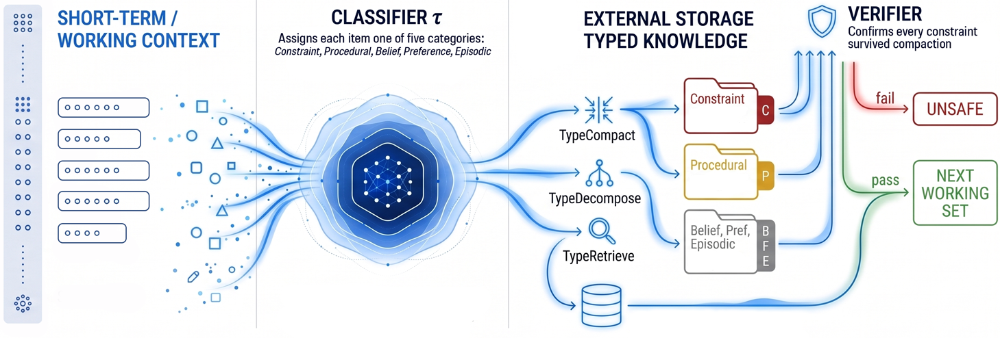
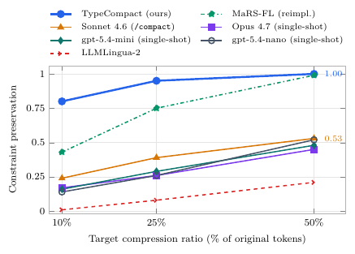
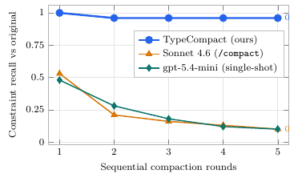
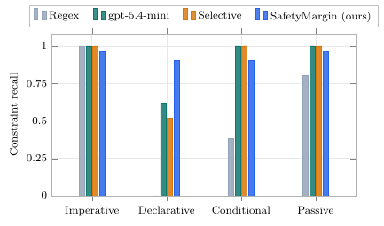

# 🖇️장기 실행 AI 에이전트 메모리의 압축 절벽

## 🚨 안전 규칙과 에피소드 로그가 같은 토큰을 놓고 경쟁한다

의료 AI 에이전트가 환자 이력을 검토하다 결정적인 한 줄을 찾는다. *"환자는 페니실린에 알레르기가 있다."* 긴 세션 동안 컨텍스트가 차오르고, 런타임이 compaction을 발동하고, 수십 개의 사실 사이에 묻힌 그 알레르기 줄은 의역되거나 버려진다. 세 턴 뒤 에이전트는 페니실린 계열 항생제인 아목시실린을 권한다. 프로덕션 에이전트에 배포된 summarize-and-retain 압축 패턴의 구조적 핵심인 hierarchical truncation은 실제 에이전트 설정 50개에서 안전 제약의 50%만 보존한다. 유출된 Claude Code 문서를 다룬 2026년 커뮤니티 분석도 프로덕션에서 동일한 균일 압축 패턴을 기록하고 있다.

에이전트 런타임은 지식 베이스를 토큰 예산 안에 유지하기 위해 세 가지 연산을 쓴다. (i) *Compaction*은 항목을 요약하거나 쳐내서 working set을 제자리에서 줄인다. (ii) *Decomposition*은 안전하게 압축하기엔 너무 큰 토픽을 각각 예산에 맞는 하위 토픽으로 쪼갠다. (iii) *Retrieval*은 지식을 외부 저장소로 밀어내고 필요할 때 청크를 다시 끌어온다. 셋은 이질적인 지식에 걸린 유한한 예산이라는 단 하나의 제약을 공유하는데도 문헌에서는 각각 별도의 전략으로 독립적으로 다뤄져 왔다. 두 번째 공백이 셋 전부를 관통한다. 어떤 프로덕션 전략도 항목의 *타입*에 따라 보존 여부를 조건화하지 않는다. 가장 가까운 typed-memory 연구인 MaRS는 카테고리를 가로질러 단일 submodular utility를 쓰기 때문에, 예산 압박 아래에서 안전 제약과 배경 믿음이 같은 비율로 사라진다.

지식의 종류마다 견딜 수 있는 손실의 종류가 다르다. 안전 규칙은 그것을 실행 가능하게 만드는 한정어를 잃을 위험 없이는 의역될 수 없고, 셸 명령은 동일하게 실행될 때만 다시 쓸 수 있으며, 디버깅 트레이스는 한 문장으로 접어도 아무 해가 없다. 하나의 압축 정책이 이 셋을 다 감당할 수 없고, 논문은 세 연산 각각에 대해 이를 형식적으로 증명한다.

프로덕션에서 안전 규칙이 얼마나 살아남는지 물었을 때 나온 답이 **압축 절벽(Compaction Cliff)**이다. "안전 규칙은 유지하면서 압축하라"는 프로덕션 프롬프트를 Sonnet 4.6에 걸었을 때, 안전 규칙 recall은 1라운드에서 53%에 머물고 5라운드에 이르면 10%까지 떨어진다. 선행 연구가 부분적인 답을 주긴 한다(정보 이론, belief-update calculi, typed memory). 그러나 compaction, decomposition, retrieval을 타입 의존적 안전 보장을 가진 하나의 문제로 다루는 연구는 없다.

논문의 기여는 다섯 가지다. (1) *압축 절벽*: 네 개의 LLM 압축기 계열과 가장 강한 비-LLM 압축기에서 재현된, 타입을 보지 않는 압축의 구조적 실패 모드. (2) 실제 설정 내용의 97%를 덮는 다섯 타입 지식 모델. (3) 균일 전략이 만족시킬 수 없는 연산자별 안전 요구사항 세 가지와 그 증명. (4) Knowledge Triage 프레임워크: 다중 fidelity 보존 레인, 압축 후 가드 검증기, 그리고 문법적 형태가 아니라 반사실적 안전성으로 점수를 매기는 SafetyMargin 분류기. (5) AgentArtifactCorpus — 54,628개 공개 GitHub 저장소에서 나온 396,934개 에이전트 지식 아티팩트를 permissive 라이선스 아래 모으고 타입 주석 2,000건을 붙인 새 코퍼스, 그리고 다섯 개 공개 코퍼스에 대한 종단 검증.

데이터셋(`https://huggingface.co/datasets/searchsim/AgentArtifactCorpus`), 분류기, 참조 구현(`https://github.com/searchsim-org/cikm26-knowledge-triage`)이 공개된다.

## 🧭 선행 연구와의 위치

선행 연구는 compaction, decomposition, retrieval을 별개 문제로 다루고 따로 평가하며, 셋 전부에 걸친 타입별 안전 보장을 형식화한 곳은 없다.

*Table 1. Positioning of Knowledge Triage.*

| **System**           | **Typed** | **Op C** | **Op D** | **Op R** | **Safety**       |
|----------------------|-----------|----------|----------|----------|------------------|
|                      | **model** |          |          |          | **guarantee**    |
| MemGPT (24)          | –         | ✓        | –        | ✓        | –                |
| A-MEM (36)           | –         | –        | –        | ✓        | –                |
| GraphRAG (9)         | –         | –        | –        | ✓        | –                |
| LLMLingua-2 (25)     | –         | ✓        | –        | –        | –                |
| MaRS (2)             | ✓         | ✓        | –        | –        | partial          |
| MemOS (19)           | partial   | ✓        | –        | ✓        | –                |
|                      |           |          |          |          |                  |
| **Knowledge Triage** | **✓**     | **✓**    | **✓**    | **✓**    | **per operator** |

*Typed model*은 항목마다 명시적으로 타입을 부여하는지, *Op C/D/R*은 compaction·decomposition·retrieval 연산자를 지원하는지, *Safety guarantee*는 균일 전략이 위반함이 보여진 연산자별 형식적 보존 요구사항을 갖는지를 뜻한다.

인지과학은 episodic 메모리와 semantic 메모리를, declarative 지식과 procedural 지식을 갈라놓았다. 에이전트 시스템은 이 구분들을 엔지니어링 프리미티브로 이어받는다. 페이징된 계층(MemGPT), Zettelkasten(A-MEM), 강화학습된 consolidation, memory-cube 추상화(MemOS), 계층화된 우선순위 저장소, scope 라우팅이 붙은 지식 그래프 트리플, AGM 스타일 belief revision이 그것이다. MaRS는 typed 모델과 구조적 안전 속성을 둘 다 가진 유일한 선행 시스템이지만, 타입을 가로질러 단일 submodular utility를 최적화하기 때문에 예산 압박 아래에서 안전 제약이 배경 믿음과 같은 비율로 사라질 수 있다. 이 논문은 그 구분들을 컨텍스트 관리 레이어로 끌어올린다. 모든 working-set 항목이 다섯 타입 중 하나를 지니고, 각 타입이 세 연산 전부에 걸쳐 자기 보존 규칙을 지녀서, 실현 가능한 어떤 예산에서도 제약 보존이 성립한다. 지식 그래프 메모리는 상보적이다. 그래프는 분류기가 라벨을 붙인 항목들을 노드로 담을 수 있고, 규칙이 이미 `AGENTS.md`, `CLAUDE.md`, 시스템 프롬프트 안에 자연어 문자열로 살고 있으므로 추출 단계가 필요 없다.

압축이 왜 안전 규칙을 잃는지는 두 갈래의 실증 연구가 설명한다. 긴 입력에 대한 attention은 고르지 않다. 위치 편향은 중간 내용을 덜 주목받게 만들고, LongBench와 RULER는 여러 태스크에 걸친 성능 저하를 기록한다. 추상적 요약은 사실 내용을 조용히 빠뜨리거나 뒤집는다. 계층적 요약은 두 손실을 모두 물려받는다. 모델 행동 위에, 안전 제약은 사용자가 설치한 규칙이 지배해야 하는 *privileged instruction*이다. Constitutional AI는 그런 선호를 고정된 규칙 집합으로 쓰고, 둘 다 컨텍스트 조작에 취약하며, R-Judge는 그 압박 아래의 안전 위험 인지를 벤치마크한다. 압축 절벽은 같은 실패의 *비의도적* 형태다. 타입을 보지 않는 계층적 요약이, 추론 시점의 계층이 지키려던 바로 그 규칙을 지운다.

프로덕션 프롬프트 압축기들은 균일한 fidelity 목표를 쓰기 때문에 타입별 보장이 들어설 자리가 없다. KV-cache 압축은 추론 시점 캐시라는 다른 레이어에서 작동한다. Liu et al. (2025)은 subsource 의존 fidelity 아래 composite source에 대한 rate-distortion 정리를 증명했고, He et al. (2025)은 그 렌즈를 에이전트 설계에 적용하되 타입별로 fidelity를 분리하지는 않는다. 검색 쪽에서 RAG, Self-RAG, FLARE는 relevance만으로 점수를 매긴다. PersonaRAG 같은 에이전트 주도 RAG는 이를 사용자에 맞춰 적응시키고, NuggetIndex 같은 통제된 검색은 랭킹 전에 유효성으로 레코드를 거르지만, 어느 쪽도 제약 소속 여부를 조건으로 삼지 않는다. 이 논문은 지식 타입을 subsource로, 제약에 대한 exact-preservation distortion을 두어 composite-source 정리를 구체화하며, 그 결과 보장이 분할과 검색을 거쳐도 살아남는다.

## 🧩 다섯 가지 지식 타입

병원이 대량 사상자를 지연 감내도에 따라 적/황/녹으로 분류하듯, 토큰 예산 아래 놓인 에이전트는 자기 항목을 왜곡 감내도에 따라 분류한다. 안전 제약은 온전히 살아남아야 하고, 절차는 동작이 보존되면 다시 써도 되며, 에피소드 로그는 버려도 된다.

*Table 2. The five operational knowledge types of Knowledge Triage, with their distortion tolerance under context compression and illustrative examples drawn from several domains.*

| **Type** | **Definition** | **Distortion tolerance** | **Examples** |
|----|----|----|----|
| Constraint (C) | Rule that bounds agent behavior; violation causes safety failure | Zero; any loss is unsafe | “Never prescribe contraindicated drugs” |
| Procedural (P) | Step-by-step instruction for a task | Semantic equivalence iff execution preserved | “Run `pytest -x --tb=short` before merging” |
| Belief (B) | Factual assertion treated as true | Bounded by semantic distance | “Backend exposes a REST API over HTTPS” |
| Preference (F) | Soft guideline | High; may be summarized or merged | “Use 2-space indentation” |
| Episodic (E) | Past event or observation | Free; may be discarded | “Refactored auth module yesterday” |

이 다섯 타입은 소스 코드 저장소에서 수집한 396,934개 에이전트 지식 아티팩트 분석에서 도출됐다.

타입이 붙은 평평한 항목 리스트만으로 compaction은 충분하지만, decomposition과 retrieval은 어떤 항목들이 함께 묶이는지도 알아야 한다. 그래서 모델에 토픽 계층을 얹는다. 타입이 부여된 지식 베이스는 튜플 $K=(I,\tau,T,\pi,\sigma)$다. 유한 항목 집합 $I$, 타입 할당 $\tau:I\to\{C,P,B,F,E\}$, 토픽 트리 $T$, leaf 매핑 $\pi:I\to\mathrm{leaves}(T)$, 그리고 각 제약이 적용되는 leaf 토픽들을 나열하는 scope 함수 $\sigma:I_{C}\to 2^{\mathrm{leaves}(T)}$로 이뤄진다(전역 scope 제약은 $\sigma(c)=\mathrm{leaves}(T)$). working set $W\subseteq K$는 예산 $|W|\leq B$ 아래 컨텍스트에 적재된 부분집합이다. $\sigma$의 구체적 예로, 코딩 에이전트 베이스가 프로젝트 루트 아래 *Build*, *Deployment*, *Database*를 두고 *"마이그레이션 파일 없이 프로덕션 스키마를 절대 수정하지 말 것"*이라는 제약을 *Database* 안에 놓더라도, 그 제약은 데이터베이스 연산이 일어나는 곳이면 어디에나 적용되므로 $\sigma(c)=\mathrm{leaves}(T)$를 지닌다.

다섯 개라는 입도는 실증적으로, 연산자별 안전 논증을 뒷받침하는 가장 거친 분할이면서 동시에 더 세분해도 새 보장을 얻지 못하는 가장 고운 지점이다. 이를 뒷받침하는 커버리지 연구가 2,000개 주석 지시문에서 수행됐다.

단일 fidelity 설정이 다섯 타입을 전부 감당할 수 없는 이유는 각 타입이 질적으로 다른 종류의 손실을 견디기 때문이다. Liu et al. (2025)을 따라 각 타입이 자기 distortion $d_{t}$를 지닌다. 제약에는 이진값($i^{\prime}\models i$이면 $d_{C}=0$, 아니면 $\infty$ — 규칙은 온전하거나 잃거나 둘 중 하나다), 절차에는 동작 보존 재작성만, 믿음과 선호에는 임베딩 거리 $1-\cos(e(i),e(i^{\prime}))$(믿음 쪽이 더 엄격), 에피소드 항목에는 요약을 허용하는 gist 거리 $1-\mathrm{ROUGE}\text{-}\mathrm{L}(i,i^{\prime})$가 붙는다.

## 🏷️ 분류기 τ: SafetyMargin과 세 가지 대안

분류기 $\tau$는 working-set 항목 하나하나를 읽고 Table 2의 다섯 타입 중 하나를 뱉는다. 프레임워크에서 유일한 학습 컴포넌트이고, 연산자별 안전 주장 전부가 여기 달려 있다. 제약을 놓치면 그 항목은 의역되거나 버려질 수 있는 소프트 보존 레인으로 간다.

**SafetyMargin(기본값)**은 어떤 항목을 지식 베이스에서 제거했을 때 어떤 행동이 위험해질 수 있으면 그것이 제약이라고 본다. 이 반사실을 직접 추정한다: 도메인 조건부 행동 집합에 대해 $\mathrm{margin}(i)=\max_{a\in\mathcal{A}}\big[P(\mathrm{unsafe}\mid a,K\setminus\{i\})-P(\mathrm{unsafe}\mid a,K)\big]$. gpt-5.4-mini 호출 한 번이 이 마진을 0과 1 사이로 점수화하고, 0.5를 넘으면 Constraint로 표시한다. 반사실적 안전성은 문법 형태 기반 분류기가 놓치는 서술문 형태 규칙("환자는 X에 알레르기가 있다")을 잡아내는데, 이런 형태는 임상·법률·금융 텍스트에서 흔하다.

대안은 셋이다. 다단계 *selective cascade*(regex $\to$ encoder $\to$ gpt-5.4-mini $\to$ abstain-as-hard)는 regex로 해소되는 항목을 값싼 단계에서 먼저 처리해 항목당 LLM 비용을 줄인다. 고정된 5-클래스 프롬프트 아래 gpt-5.4-mini 원샷 호출은 가장 단순한 LLM 베이스라인이다. 표면 휴리스틱(regex, encoder, 증류된 MiniLM)은 LLM 의존성 자체가 허용되지 않는 환경을 커버한다. 네 변형 모두 같은 5-클래스 인터페이스를 공유하고 인덱싱 시점에만 돌며 연산자들이 다시 호출하지 않으므로, 항목당 비용은 한 번만 치러지고 compaction 라운드 수·기록된 파티션 수·처리한 쿼리 수와 무관하게 상수다.

cascade의 regex 단계는 각 항목을 손으로 쓴 네 계열의 패턴에 맞춘다. 패턴은 gold-standard 집합에 대해 작성됐고 정밀도 위주로 튜닝돼 있어 매칭되면 항목이 즉시 해소된다. 계열은 제약을 맨 앞에 두는 고정된 우선순위로 시도된다. 제약 지시어(*never*, *must not*, critical 같은 대문자 마커, 그리고 modal verb와 결합한 *always*/*ensure*/*require*), 절차 지시어(*run* 같은 동사로 시작하는 명령, 코드 블록, 패키지 매니저 호출), 에피소드 항목의 시간 마커(*yesterday*, *recently*), 선호 지시어(*prefer*, *ideally*)가 그것이다. 매칭되지 않은 항목은 encoder의 prototype-centroid 코사인(타입당 라벨 예시 10개)으로 떨어지고, 신뢰도 0.55 미만이면 gpt-5.4-mini로, 그래도 0.40 미만이면 제약으로서 hard 레인으로 라우팅된다. 주목할 점은 서술문 형태의 안전 진술이 이 지시어들을 하나도 지니지 않는다는 것이다. 그 결과 cascade는 서술문 형태에서 SafetyMargin에 뒤진다.

**Authority weighting.** $\tau$의 항목별 신뢰도를 소스 권위 $a:I\to\{\textsc{sys},\textsc{dev},\textsc{user},\textsc{tool},\textsc{ret}\}$로 가중한다. 가중치는 $w_{\textsc{sys}}{=}1.5$, $w_{\textsc{dev}}{=}1.25$, $w_{\textsc{user}}{=}1.0$, $w_{\textsc{tool}}{=}0.75$, $w_{\textsc{ret}}{=}0.6$이다. 제약 위험도는 $\mathrm{risk}(i)=p(\tau(i){=}C)\cdot w_{a(i)}$이므로, 신뢰도 높은 시스템 규칙이 신뢰도 낮은 검색된 조각을 압도한다.

## ⚙️ 세 연산자, 세 개의 안전 요구사항

Figure 1은 파이프라인 전체를 보여준다. 왼쪽 SHORT-TERM / WORKING CONTEXT의 working-set 항목들이 중앙의 CLASSIFIER $\tau$로 흘러들고, 분류기는 각 항목에 Constraint, Procedural, Belief, Preference, Episodic 중 하나를 할당한 뒤 세 갈래로 나눈다. TypeCompact는 Constraint 상자로, TypeDecompose는 Procedural 상자로, TypeRetrieve는 Belief/Pref/Episodic 상자와 외부 데이터베이스로 향한다. 타입이 붙은 지식 상자들은 방패 아이콘의 VERIFIER로 올라가고, 검증기는 "모든 제약이 압축에서 살아남았는지 확인"한다. 실패하면 UNSAFE로, 통과하면 NEXT WORKING SET으로 간다. 데이터베이스에서 나온 긴 경로는 pass 경로에 합류해 다음 working set으로 들어간다.

세 연산자는 공통된 형태를 지닌다. 각각은 타입이 부여된 지식 베이스를 받고, $\tau$에 의존하는 안전 요구사항 하나를 지니며, $\tau$를 보지 않는 전략에 대해 알려진 실패 모드를 갖는다.

### 압축(Compaction)

압축 연산자 $C:K\times\mathbb{N}\to K^{\prime}$는 베이스와 예산을 $|K^{\prime}|\leq B$인 압축된 베이스 $K^{\prime}$로 보낸다. 안전 요구사항은 $K$의 모든 제약이 $C(K)$ 안에 왜곡 0의 사본을 갖는 것이다: $\forall i\in I_{C},\exists i^{\prime}\in C(K):d_{C}(i,i^{\prime})=0$. 이는 최소 안전 예산 $B_{\min}=\sum_{i:\tau(i)\in\{C,P\}}|i|$ 위에서만 실현 가능하다. 그 아래에서는 시스템이 예산을 늘리거나, 안전을 완화하거나, decomposition으로 떨어져야 한다. 프로덕션에 배포된 세 전략(hierarchical summarization, temporal windowing, aggressive pruning)은 모든 항목을 똑같이 취급하므로, 제약이 요약 윈도 안에 들어가거나 relevance 임계 아래로 떨어지는 즉시 요구사항을 위반한다. TypeCompact는 Adaptive Focus Memory를 따라 항목을 세 fidelity 레인으로 보낸다. 제약과 절차는 full, 믿음과 선호는 compressed, 에피소드 항목은 placeholder다. 이어서 결정론적 검증기가 hard 레인의 모든 제약에서 정규형(부정 + 목적어구)을 추출하고, 그것이 출력에 나타나는지 확인해, 없으면 원본을 복원하거나 Unsafe로 에스컬레이트한다.

*Algorithm 1 TypeCompact*

    1: $K$, budget $B$, classifier $h$, verifier $v$, authority $a$, thresholds $\theta_{C},\theta_{P}$
    2: compacted $K^{\prime}$ with $|K^{\prime}|\leq B$, or Unsafe
    3: for $i\in K$ do $p_{i}\leftarrow h(i,\,\mathrm{ctx}(i))$
    4:   if $p_{i}(C)\,w_{a(i)}\geq\theta_{C}\lor\mathrm{abstain}(p_{i})$ then $H_{C}\leftarrow H_{C}\cup\{i\}$; $g_{i}\leftarrow\mathrm{guard}(i)$
    5:   else if $p_{i}(P)\geq\theta_{P}$ then $H_{P}\leftarrow H_{P}\cup\{i\}$
    6:   else  route $i$ to soft lane by argmax type
    7: $H\leftarrow\mathrm{dedup}(H_{C}\cup H_{P})$;  if $\ell(H)>B$ return Unsafe
    8: allocate $B-\ell(H)$ across soft lane: beliefs/prefs $\to$ compressed, episodic $\to$ placeholder
    9: $K^{\prime}\leftarrow H\cup\mathrm{soft}$
    10: if $v(\{g_{i}\}_{i\in H_{C}},\,K^{\prime})=\textsc{fail}$ then  restore failed guards if budget permits, else return Unsafe
    11: return $K^{\prime}$

복잡도는 분류기 호출 $O(|K|)$, 할당 $O(|H|\log|H|)$, 검증 $O(|I_{C}|)$다.

### 분해(Decomposition)

분해 연산자 $D:K\times\mathbb{N}\to\{K_{1},\dots,K_{m}\}$는 $K$를 $\bigcup K_{i}=K$이고 각각이 파티션별 예산에 맞는 $m$개의 하위 베이스로 나눈다. 안전 요구사항은 제약 지역성(locality)이다: $\forall c\in I_{C},\ \forall j\in[m]:\big(\exists\,i\in K_{j}:\pi(i)\in\sigma(c)\big)\Rightarrow c\in K_{j}$. 어떤 제약의 scope가 덮는 항목을 가진 파티션은 그 제약도 함께 가져야 한다는 뜻이다. 토픽 유사도, 항목 빈도, 토큰 수로 나누는 휴리스틱은 scope를 무시하므로, scope가 걸린 제약과 그 대상 항목이 서로 다른 파티션에 떨어질 때마다 지역성을 위반한다. TypeDecompose는 각 제약을 그 scope와 교차하는 모든 파티션에 복제하고, scope가 걸치는 파티션 수에 비례하는 오버헤드를 치른다. 지역 제약에 대해서는 오버헤드가 0이다.

*Algorithm 2 TypeDecompose*

    1: knowledge base $K$, per-partition budget $B$
    2: partitions $\{K_{1},\dots,K_{m}\}$, each $\leq B$
    3: group $K$ by topic; chunk each group into sub-bases of size $\leq B$
    4: for each constraint $c\in I_{C}$ do
    5:   for each partition $K_{i}$ do
    6:    if $\exists\,i^{\prime}\in K_{i}:\pi(i^{\prime})\in\sigma(c)$ and $c\notin K_{i}$ then
    7:      $K_{i}\leftarrow K_{i}\cup\{c\}$ $\triangleright$ replicate
    8: return $\{K_{1},\dots,K_{m}\}$

복잡도는 그룹핑 $O(|K|)$, 복제 $O(|I_{C}|\,m)$이고 전역 scope 밀도로 상한이 잡힌다.

### 검색(Retrieval)

프로덕션 검색기(BM25, dense similarity, 학습된 reranker)는 쿼리 relevance로 랭킹한다. 이는 비제약 항목에 대해서는 필요성을 근사하지만 제약에 대해서는 안전하지 않다. 사용자가 고른 컬렉션으로 필터링하는 scope 제한 검색조차 그 scope 안에서는 여전히 relevance로 랭킹한다. 안전 요구사항은 우선순위(priority)다: $\forall c\in I_{C}:\mathrm{inscope}(q,c)\Rightarrow c\in R_{q}$, 유사도와 무관하게 성립해야 하며, 여기서 $\mathrm{inscope}(q,c)\Leftrightarrow\mathrm{topics}(q)\cap\sigma(c)\neq\emptyset$는 쿼리에 태깅된 토픽이 제약의 scope와 교차하는지 검사한다. 유사도 점수가 그 자리에 놓아주지 않을 때에도 모든 in-scope 제약이 결과 집합에 나타나야 한다. 유사도만으로 만든 어떤 점수 함수도 in-scope 제약을 컷오프 아래로 밀어내 우선순위를 위반할 수 있다. TypeRetrieve는 in-scope 제약을 먼저 고정(pin)한 뒤 남은 예산을 relevance로 배분한다.

*Algorithm 3 TypeRetrieve*

    1: corpus $K$, query $q$, budget $k$, scorer $r$, scope test $\mathrm{inscope}$
    2: $C_{q}\leftarrow\{c\in I_{C}:\mathrm{inscope}(q,c)\}$
    3: $R_{\mathrm{others}}\leftarrow\mathrm{topk}(\{i\in K\setminus C_{q}\},\,k-|C_{q}|,\,\mathrm{by}=r(q,\cdot))$
    4: return $C_{q}\cup R_{\mathrm{others}}$

복잡도는 in-scope 검사 $O(|I_{C}|)$에 스코어러 $r$을 더한 것이고, pinning은 점근적 오버헤드를 더하지 않는다.

세 연산자는 하나의 컨텍스트 관리 사이클로 합쳐진다. 시스템은 먼저 compaction을 시도하고, 제약을 떨어뜨리게 되는 $B_{\min}$ 아래에서는 decomposition으로 떨어져, 베이스의 일부를 외부 저장소로 밀어내 TypeRetrieve가 필요할 때 다시 끌어오게 한다.

## 🔬 실험 설계

여섯 개 코퍼스가 세 가지 역할을 나눠 맡는다. 이 논문을 위해 만든 AgentArtifactCorpus(AAC)가 타이폴로지와 연산자 수준 실험의 주 코퍼스이고, LongMemEval과 BEIR scifact가 타이폴로지·검색 컴포넌트의 교차 코퍼스 확인을, $\tau$-bench retail·$\tau$-bench airline·SafetyMed가 종단 행동 평가를 담당한다.

*Table 3. Corpora used in the empirical validation.*

| **Corpus** | **Scale** | **Role in this paper** |
|----|----|----|
| **AAC (ours)** | 396,934 items | Taxonomy, compaction, scope analysis (§§4.2–4.3) |
| LongMemEval (32) | 500 turns | Cross-corpus taxonomy validation (§4.2) |
| $\tau$-bench retail (37) | 115 tasks | Retail-task behavioral rollouts (§4.5) |
| $\tau$-bench airline (37) | 50 tasks | Customer-service generalization test (§4.5) |
| BEIR scifact (27) | 1,000 docs | Retrieval baseline corpus (§4.3) |
| **SafetyMed (ours)** | 200 scenarios | Medical-compliance behavioral evaluation (§4.5) |

AgentArtifactCorpus는 여덟 플랫폼(Claude, Cursor, Copilot, Windsurf, Continue, Aider, Codeium, Universal)에 걸친 54,628개 GitHub 저장소에서 나온 396,934개 지식 아티팩트로 구성된다. 아티팩트 크기 중앙값은 1,201바이트이고, 주 언어는 TypeScript(31.5%), Python(18.7%), Go(18.2%)다. 수집에는 GitHub Code Search API를 쓰되 1,000건 결과 제한을 넘기 위해 적응적 파일 크기 분할을 썼다. 네 차원(platform, function, authorship, specificity) 분류는 하류 오염을 피하려고 LLM 분석 없이 regex 휴리스틱만으로 했다.

네 개의 연구 질문이 따라온다. *RQ1*: 실제 에이전트 지식은 타입에 따라 어떻게 분포하며 안전 임계 비율은 얼마인가. *RQ2*: Knowledge Triage는 타입을 보지 않는 방법이 떨어뜨리는 안전 임계 항목을 세 연산자 전부에서 보존하는가. *RQ3*: 타입별 보존은 계산·분류기 정확도·분해 오버헤드에서 무엇을 치르는가. *RQ4*: 타입별 보존이 안전 임계 벤치마크에서 에이전트 행동을 바꾸는가.

## 📊 RQ1: 타이폴로지 커버리지와 표현 형식

압축 절벽은 하나의 코퍼스, 하나의 프로덕션 프롬프트에서 관측됐다. 그것이 타입을 보지 않는 보존에 구조적인 것인지 아니면 그 샘플에 특유한 것인지는 프레임워크가 기대는 두 주장에 달려 있다. 다섯 타입 모델이 배포된 에이전트가 관리해야 할 항목들을 덮는다는 것, 그리고 서술문 형태 실패 모드가 실제 안전 텍스트에 널리 퍼져 있다는 것이다.

**커버리지.** star와 언어로 층화해 무작위 표집한 AAC 저장소 200개에서 2,000항목 gold-standard 집합을 만들었고, 두 명의 주석자가 공개된 아티팩트의 루브릭을 따라 독립적으로 라벨링한 뒤 같은 루브릭에 대해 2차 조정을 거쳤다. 교차 도메인 검증을 위해 LongMemEval 500턴도 라벨링했다. 구조 특징(mood, modal verb, 코드 블록 유무, 시간 마커), 의미 특징(HDBSCAN으로 군집화한 문장 임베딩), 키워드 특징(제약 지시어, 절차 지시어, 에피소드 마커)을 결합한 NLP 분류기를 학습해 사람 라벨과 비교했다. 타이폴로지는 AAC 지시문의 97%를 덮고, 남은 3%는 다른 아티팩트를 참조하는 메타 지시문으로 안전 효력이 없다. 제약 검출이 도메인 변화 아래 가장 안정적인 타입으로, F1이 두 코퍼스 모두에서 0.88을 유지한다. macro-F1은 LongMemEval에서 3포인트 떨어지고(AAC 0.87 대비 0.84), 하락은 Preference와 Belief에 집중된다.

*Table 4. Knowledge type distribution and classifier performance on AgentArtifactCorpus ($n=2{,}000$ annotations).*

| **Type**   | **% of items** | **Precision** | **Recall** | **F1** |
|------------|----------------|---------------|------------|--------|
| Constraint | 12.3           | 0.91          | 0.87       | 0.89   |
| Procedural | 28.7           | 0.94          | 0.92       | 0.93   |
| Belief     | 31.4           | 0.86          | 0.84       | 0.85   |
| Preference | 14.2           | 0.83          | 0.80       | 0.81   |
| Episodic   | 13.4           | 0.90          | 0.88       | 0.89   |

**표현 형식.** 커버리지만으로는 부족하다. 배포 환경의 안전 텍스트가 압도적으로 명령문이라면 서술문 실패 모드는 예외적 경우에 그친다. 서술문 형태가 실제로 얼마나 퍼져 있는지 보려고, openFDA 안전 문장 564개(30개 약물의 BOXED WARNING과 CONTRAINDICATIONS 필드)와 LegalBench contract-NLI explicit-identification 조항 36개를 gpt-5.4-mini 호출로 네 가지 문법 형태로 분류했다. 서술문 형태가 openFDA 안전 텍스트의 49.8%, LegalBench 안전 조항의 61.1%를 차지하고, 명령문은 각각 22.5% / 22.2%다. 조건문과 수동문이 나머지를 이룬다. 100문장 층화 부분표본을 두 번째 독립 판정자가 다시 라벨링한 결과 4-클래스 라벨에서 Cohen's $\kappa=0.88$, 서술문 대 그 외의 이진 판정에서 $\kappa=0.92$(관측 일치율 96%)였다. 불일치는 명령문 대 modal-passive 경계에 몰리는 반면 서술문 클래스 자체는 두 번째 판정자 아래에서도 안정적이므로, 서술문 형태가 지배적이라는 결론은 판정자 간 노이즈에 견고하다.

두 구조적 주장 모두 성립한다. 다섯 타입 모델이 에이전트 항목의 97%를 덮으므로 절벽이 숨어 있을 만한 커다란 미포함 클래스가 없고, 서술문 형태가 두 개의 독립적인 배포 도메인에서 안전 임계 텍스트를 지배하므로 문법 형태 실패 모드가 배포에서 실제로 문제 되는 경우다. 따라서 압축 절벽은 타이폴로지와 표현 형식 분포만으로 따라 나오고, §4.3의 샘플은 그 대표적 사례로 선다.

## 📉 RQ2: 세 연산자에서의 안전 보존

### 압축

언어·star 수·아티팩트 수로 층화한 AAC 설정 50개(제약 622개, 절차 2,257개)에서 열 가지 전략을 시험했다. 전략은 세 개의 구조적 베이스라인(*hierarchical truncation*: 앞 $N$ 토큰 유지, *temporal windowing*: 뒤 $N$ 토큰 유지, *aggressive pruning*: unigram 빈도가 가장 높은 토큰을 가진 항목 제거), LLMLingua-2, 프로덕션 프롬프트 "compress to $N$ tokens, keep every safety rule and procedural command verbatim"으로 호출한 네 개의 LLM 압축기(gpt-5.4-nano, gpt-5.4-mini, Claude Code의 `/compact` 뒤에 있는 Sonnet 4.6, Opus 4.7), MaRS-FL(이 논문이 반대하는 MaRS의 설계 선택을 재구현한 것), 그리고 TypeCompact다. 각각은 20개 설정 부분집합에서 세 압축 목표(50%, 25%, 10%)로 돌았고, 장기 실행 에이전트를 반영하려고 라운드당 50%로 5라운드 반복했다. 제약 recall은 설정별로 분류기가 라벨링한 제약 중 살아남은 비율이며, key-token 테스트로 측정했다(사람 주석자 두 명에 대해 Preserved/Lost에서 $\kappa=0.92$로 검증). 모든 전략이 설정별 예산을 공유하며, TypeCompact가 고정한 항목도 다른 항목과 똑같이 예산에 잡힌다.

타입을 보지 않는 여덟 전략 전체에서 최고 단일 라운드 recall은 50%에서 0.53, 25%에서 0.39, 10%에서 0.24였다. `/compact` 5라운드는 recall을 0.53에서 0.10으로 끌어내렸다. 이 감쇠가 모든 LLM 계열과 모든 구조적 베이스라인에서 나타났으므로 손실은 특정 프롬프트나 특정 모델에 국한되지 않는다. 타입을 보지 않는 압축기는 어떤 문장이 안전 규칙인지에 대한 신호가 없어서 주변 텍스트와 같은 비율로 요약한다.

TypeCompact는 같은 50개 설정에서 50 / 25 / 10%에 대해 1.00 / 0.95 / 0.80의 제약 recall을 냈고, 두 번째 라운드부터 0.96에서 안정화됐다. 이는 구성상 성립한다. 분류기가 라벨링한 제약과 절차를 전부 변형 없이 고정하므로, 항목이 사라지는 경우는 분류기가 잘못 라벨링했거나(§4.4의 recall로 상한이 잡힌다) 고정 항목들의 합산 footprint가 예산을 넘을 때뿐이다.

*Table 5. Preservation rate by knowledge type at 50% compaction across 50 AAC configurations.*

| **Strategy**            | **C**    | **P**    | **B**    | **F**    | **E**    | **All**  |
|-------------------------|----------|----------|----------|----------|----------|----------|
| Hierarchical truncation | 0.50     | 0.82     | **0.75** | 0.63     | 0.77     | 0.69     |
| Temporal windowing      | 0.58     | 0.80     | 0.64     | **0.78** | **0.91** | 0.74     |
| Aggressive pruning      | 0.51     | 0.75     | 0.67     | 0.66     | 0.84     | 0.69     |
| **TypeCompact**         | **1.00** | **1.00** | 0.50     | 0.51     | 0.84     | **0.77** |

항목은 $\tau$로 분류했고 값이 클수록 좋다. *C*/*P*/*B*/*F*/*E*는 Table 2와 같고 *All*은 비가중 평균이다. TypeCompact는 믿음과 선호의 fidelity(0.50 / 0.51)를 내주고 제약과 절차를 온전히 지키는 반면, 타입을 보지 않는 전략들은 손실을 균일하게 퍼뜨린다.

Figure 2는 20개 AAC 설정에서 목표 압축률(가로축 10%, 25%, 50%)에 대한 제약 보존율(세로축 0~1)을 선 그래프로 보여준다. 그림에 인쇄된 수치는 TypeCompact의 50% 지점 1.00과 Sonnet 4.6의 0.53 두 개뿐이고, 나머지는 축에 대고 읽은 근사값이다. 10%에서 TypeCompact 약 0.80, MaRS-FL 약 0.43, Sonnet 4.6(`/compact`) 약 0.25, Opus 4.7 약 0.16, gpt-5.4-mini 약 0.15, gpt-5.4-nano 약 0.14, LLMLingua-2 약 0.01로 읽힌다. 25%에서는 각각 약 0.95, 0.75, 0.38, 0.25, 0.28, 0.27, 0.08이다. 50%에서 TypeCompact는 1.00으로 MaRS-FL과 동률이고 LLMLingua-2가 모든 압축률에서 최하위다. 정확한 수치는 아래 Table 6에 있다.

*Table 6. TypeCompact vs SOTA prompt compactors at three compression ratios, mean across 20 AAC configurations.*

| **Strategy**                   | **C**    | **P**    | **mF1**  | **time** | **tok** |
|--------------------------------|----------|----------|----------|----------|---------|
| *50% compression*              |          |          |          |          |         |
| **TypeCompact**                | **1.00** | **0.92** | **0.75** | **0.0s** | **0**   |
| LLMLingua-2                    | 0.21     | 0.72     | 0.63     | 0.5s     | 0       |
| MaRS-FL (ours, no public impl) | 0.99     | 0.89     | 0.69     | 0.5s     | 0       |
| gpt-5.4-nano (single-shot)     | 0.52     | 0.80     | 0.69     | 9.9s     | 56K     |
| gpt-5.4-mini (single-shot)     | 0.48     | 0.77     | 0.68     | 7.3s     | 57K     |
| Sonnet 4.6 (`/compact`)        | 0.53     | 0.83     | 0.73     | 73.9s    | 48K     |
| Opus 4.7 (single-shot)         | 0.45     | 0.81     | 0.72     | 31.1s    | 50K     |
|                                |          |          |          |          |         |
| *25% compression*              |          |          |          |          |         |
| **TypeCompact**                | **0.95** | **0.71** | **0.57** | **0.0s** | **0**   |
| LLMLingua-2                    | 0.08     | 0.61     | 0.46     | 0.5s     | 0       |
| MaRS-FL (ours, no public impl) | 0.75     | 0.61     | 0.51     | 0.2s     | 0       |
| gpt-5.4-nano (single-shot)     | 0.26     | 0.60     | 0.50     | 9.3s     | 53K     |
| gpt-5.4-mini (single-shot)     | 0.29     | 0.62     | 0.49     | 7.5s     | 56K     |
| Sonnet 4.6 (`/compact`)        | 0.39     | 0.65     | 0.51     | 166.2s   | 42K     |
| Opus 4.7 (single-shot)         | 0.26     | 0.68     | 0.51     | 35.6s    | 43K     |
|                                |          |          |          |          |         |
| *10% compression*              |          |          |          |          |         |
| **TypeCompact**                | **0.80** | 0.47     | **0.38** | **0.0s** | **0**   |
| LLMLingua-2                    | 0.01     | 0.27     | 0.14     | 0.5s     | 0       |
| MaRS-FL (ours, no public impl) | 0.43     | 0.22     | 0.27     | 0.02s    | 0       |
| gpt-5.4-nano (single-shot)     | 0.14     | 0.43     | 0.33     | 5.6s     | 43K     |
| gpt-5.4-mini (single-shot)     | 0.16     | 0.47     | 0.32     | 5.1s     | 46K     |
| Sonnet 4.6 (`/compact`)        | 0.24     | **0.54** | 0.30     | 420.3s   | 36K     |
| Opus 4.7 (single-shot)         | 0.17     | 0.52     | 0.31     | 22.8s    | 37K     |

출력은 채점 전에 예산 토큰으로 잘렸고, Sonnet 4.6 행은 Claude Code의 `/compact`를 쓴다. *MaRS-FL*은 MaRS를 재구현한 것이다. *C*는 제약 보존, *P*는 절차 보존, *mF1*은 macro F1, *time*/*tok*은 설정당 평균 지연 시간과 LLM 토큰 수다.

Figure 3은 라운드당 50% 압축으로 $N$번 연속 압축한 뒤의 제약 recall을 20개 AAC 설정에서 보여준다. 가로축은 압축 라운드 1~5, 세로축은 원본 대비 제약 recall이다. 값이 인쇄돼 있지 않아 축에 대고 읽으면, TypeCompact는 라운드 1에서 약 0.99이고 라운드 2~5 내내 약 0.95~0.96으로 평평하다(본문은 두 번째 라운드부터 0.96에서 안정화된다고 적는다). Sonnet 4.6(`/compact`)은 약 0.53, 0.21, 0.16, 0.12, 0.10으로, gpt-5.4-mini(single-shot)는 약 0.47, 0.27, 0.18, 0.11, 0.09로 내려간다. 본문이 인쇄한 값은 Sonnet의 1라운드 0.53과 5라운드 0.10이다. 두 베이스라인 곡선은 0을 향해 떨어지고, 라운드 2~3에서는 gpt-5.4-mini가 Sonnet보다 높으며 라운드 1, 4, 5에서는 Sonnet이 근소하게 높다.

### 압축 ablation

TypeCompact가 타입을 보지 않는 베이스라인에 없는 컴포넌트는 셋이다. 인덱싱 시점 라벨, 결정론적 압축 후 검증기, 그리고 고정 항목 전부가 예산에 들어가지 못할 때의 Unsafe 에스컬레이션.

*(i) 인덱싱 시점 라벨.* LLMLingua-2 단독은 0.55 / 0.18 / 0.02에 도달했고, 압축 후 검출된 제약을 다시 삽입하는 regex 단계를 붙이자 0.83 / 0.65 / 0.60으로 회복됐다. 이는 격차의 절반쯤을 메운다. 나머지 절반은 라벨이 압축 *이전에* 부여될 때만 메워지는데, 서술문 형태 규칙에는 regex가 매칭할 명령문 마커가 없기 때문이다.

*(ii) 검증기.* 실행 전체에서 27회의 복원 이벤트를 기록했고(호출당 평균 0.46, 최대 1) 50%에서는 한 번도 Unsafe로 에스컬레이트하지 않았다. 검증기가 없었다면 같은 실행들이 hard 레인을 조용히 잘라냈을 것이다.

*(iii) 예산 경계 동작.* 제약+절차 밀도가 40%를 넘는 1.4%의 설정에서 $B_{\min}$이 50% 예산에 근접했다. TypeCompact는 그중 28%에서 Unsafe로 에스컬레이트하고 나머지 72%에서 1.00에 도달한 반면, 같은 설정을 검증기 없이 돌리면 겉보기 recall 1.00을 보고하면서 지켜야 했던 제약의 평균 **57%**를 조용히 떨어뜨렸다. 어느 컴포넌트 하나만 빼도 배포된 에이전트가 이 샘플에서 0.50 아래로 내려가므로, 결과는 셋이 함께 있을 때만 성립한다.

### 분해

두 번째 연산자 요구사항인 지역성은 섹션 헤더가 토픽 마커 역할을 하는 AAC 설정 200개에서 시험했다. 제약이 *Rules*, *Constraints*, *Safety*, *Project Conventions*로 이름 붙은 섹션에 있으면 전역 scope로 본다(이 샘플에서 관습적인 명명이다). 따라서 topic-aligned 베이스라인과 TypeDecompose는 같은 scope 신호를 쓴다. 베이스라인 셋은 `chunk_by_tokens`(토큰 수로 순차 분할), `chunk_by_topic`(섹션 헤더 기준), `chunk_by_paragraph_budget`(탐욕적 문단 패킹)이고, 각각 파티션당 예산은 전체 토큰의 25%다. 지역성 위반은 어떤 항목을 담고 있으면서 그 항목에 scope를 거는 제약은 담지 않은 파티션이며, 평균 위반율과 위반이 하나 이상 있는 설정의 비율을 보고한다. 가장 강한 베이스라인(topic-aligned)은 평균 위반 13%에 도달하지만 여전히 설정의 40%에서 위반을 하나 이상 만들고, 나머지 둘은 32% / 93%에 이른다. TypeDecompose는 평균 토큰 오버헤드 14.5%로 위반 0에 도달한다.

*Table 7. Decomposition constraint-locality on 200 AAC configurations, 25%-of-total partition budget.*

| **Strategy**       | **Mean viol.** | **Configs viol.** | **Overhead** |
|--------------------|----------------|-------------------|--------------|
| chunk_by_tokens    | 32%            | 93%               | 0%           |
| chunk_by_topic     | 13%            | 40%               | 0%           |
| chunk_by_paragraph | 32%            | 93%               | 0%           |
| **TypeDecompose**  | **0%**         | **0%**            | +14.5%       |

항목은 분할 전에 selective 분류기 $\tau$로 재분류했다. *Configs viol.*은 지역성 위반이 있는 설정의 비율, *Overhead*는 토큰 기준 복제 비용이다.

14.5% 평균은 극단값이 끌어올린 것이다. 중앙값은 0%(설정의 74%가 전역 scope 제약을 갖지 않는다), 90 백분위수는 21%, 최악은 219%다. 이 형태는 분류기 변형을 바꿔도 유지되고 flag 비율에 따라 평균만 움직이므로, 극단은 입력 분포에서 온다. 3,000항목 토픽에 대한 확장성 테스트에서 재귀적 TypeDecompose($T=200$ 분할 임계, 임베딩에 대한 KMeans)를 돌리면 평균 크기 103인 leaf 29개가 만들어진다. $k=5$에서의 held-out 검색은 flat-scan 상한 98%에 대해 94% recall에 도달하면서 쿼리당 3,000항목 중 92개만 검사한다. 33$\times$ 감소다.

### 검색

세 번째 연산자 요구사항인 우선순위는 in-scope 제약이 단지 relevant한 항목보다 앞서 반환되는지를 묻는다. 점수만 쓰는 검색기는 점수가 제약 소속 여부를 인코딩하지 않으므로 이를 강제할 수 없다. 코퍼스는 distractor로 쓴 BEIR scifact 문서 1,000개에 $\tau$-bench retail-policy 청크 33개를 더한 것이고, selective 분류기 $\tau$는 33개 중 22개를 제약으로 flag한다(regex는 3개). 쿼리 50개는 $\tau$-bench retail 루브릭에 대고 손으로 작성했고, 쿼리당 평균 22개 retail-policy 제약 중 12개가 in-scope다(in-scope의 정의는 제약의 topic 필드가 쿼리에 태깅된 토픽 중 최소 하나와 일치하는 것). 비교 대상은 비-LLM 검색기 셋(BM25, `octen-embedding-8b` 4,096차원 코사인 dense, dense top-50을 `qwen3-reranker-4b`로 재정렬한 cross-encoder), dense top-100 풀을 받은 단일 샷 LLM 검색기 셋(gpt-5.4-nano, gpt-5.4-mini, Sonnet 4.6), 그리고 dense 검색기 위에 얹은 TypeRetrieve다. $k\in\{5,10,20,50\}$에 대한 recall@$k$는 상위 $k$에 들어온 in-scope 제약의 비율이다.

TypeRetrieve는 모든 검색기에 대해 recall@20 96%, recall@50 100%에 도달하고, 가장 강한 단일 샷 LLM 검색기(Sonnet 4.6)는 같은 예산에서 61%와 73%에 그친다. $k=5$에서는 두 접근 모두 구조적 상한 $\min(5/12,1)\approx 42\%$에 가깝다. $k=50$에서 TypeRetrieve는 in-scope 집합을 결정론적으로 채우는 반면, 점수만 쓰는 검색기는 남은 예산을 유사도 높은 비제약 항목에 계속 쓴다. TypeRetrieve는 pinning이 데이터베이스 조회이기 때문에 **쿼리당 LLM 토큰이 0**이고, 단일 샷 LLM들은 5,776~6,741 토큰을 쓴다.

*Table 8. In-scope constraint recall@$k$ on a 1,033-item mixed corpus, 50 queries.*

| **Retriever** | **Variant** | $@5$ | $@10$ | $@20$ | $@50$ | **sec/q** | **tok/q** |
|----|----|----|----|----|----|----|----|
| *Non-LLM retrievers + TypeRetrieve overlay* |  |  |  |  |  |  |  |
| BM25 | baseline | 32% | 38% | 43% | 49% | 0.0 | 0 |
| Dense (octen) | baseline | 34% | 45% | 67% | 91% | 0.0 | 0 |
| Reranked dense | baseline | 25% | 36% | 55% | 91% | 0.0 | 0 |
| **TypeRetrieve** | dense | **40%** | **57%** | **96%** | **100%** | **0.0** | **0** |
|  |  |  |  |  |  |  |  |
| *Single-shot LLM retrievers (full pipeline; given top-100 candidate pool)* |  |  |  |  |  |  |  |
| gpt-5.4-nano (one-shot) | baseline | 34% | 43% | 51% | 53% | 1.0 | 5,776 |
| gpt-5.4-mini (one-shot) | baseline | 34% | 46% | 64% | 70% | 1.2 | 5,800 |
| Sonnet 4.6 (one-shot) | baseline | 34% | 47% | 61% | 73% | 5.9 | 6,741 |

Cascade $\tau$는 33개 retail-policy 청크 중 22개를 제약으로 flag하고, 쿼리당 평균 12개가 in-scope다. 단일 샷 LLM 검색기는 dense top-100 풀에서 top-50을 고르고, 그 랭킹을 네 예산 전부에서 평가한다.

### 왜 타이핑이 격차를 메우는가

타입을 보지 않는 대안들은 하나의 맹점을 공유한다. 균일 압축기, 토픽만 보는 분할기, 점수만 쓰는 검색기 전부가 제약 소속 여부를 위한 별도 채널을 갖고 있지 않다. LLMLingua-2는 토큰을 엔트로피로 가중하므로 *never* 같은 드문 명령문 토큰이 중립적 군더더기와 함께 잘려나간다(*"Patient is allergic to penicillin. Never prescribe…"*는 부정이 떨어진 채 비율 0.5로 압축된다). 단일 샷 LLM 압축기는 규칙을 다른 항목과 섞어 늘어놓기 때문에 truncation이 나머지와 같은 비율로 규칙을 떨어뜨리고, 다중 라운드 감쇠는 같은 실패 모드가 반복된 것이다. 점수만 쓰는 검색기는 남은 예산을 유사도 높은 비제약 항목에 쓴다. 네 개의 ablation(regex 재삽입, 검증기, 예산 경계 동작, 복제 오버헤드 분포)은 각각 타입 파이프라인의 컴포넌트 하나씩을 제거하며, 모든 경우에 격차가 다시 벌어진다. 그 채널을 되돌리면 연산자마다 격차가 메워진다. 실현 가능한 예산 아래 제약 보존 100%, 평균 오버헤드 14.5%에 지역성 위반 0, 모든 검색기에서 in-scope recall@50 100%다.

## 💰 RQ3: 분류기의 비용

세 연산자 주장 전부가 분류기 $\tau$에 달려 있으므로, 타입별 보존의 비용은 $\tau$를 규모 있게 돌리는 비용과 그 작동점에서 얻는 recall의 짝이다.

AAC 테스트 집합 200항목에서 열 가지 분류기 변형을 평가했다. 변형은 regex, encoder(octen-embedding-8b prototype-centroid 코사인), regex+encoder, 증류된 MiniLM, 단일 LLM 원샷 네 가지(gpt-5.4-nano, gpt-5.4-mini, Sonnet 4.6, Opus 4.7), 다단계 selective cascade(regex $\to$ encoder $\to$ gpt-5.4-mini), 그리고 selective + abstain-as-hard다. SafetyMargin은 문법적 분류를 반사실적 안전 마진 추정으로 대체한다. gpt-5.4-mini 호출 한 번이 각 항목을 0과 1 사이로 점수화하고 0.5를 넘으면 Constraint로 표시한다.

**참조 라벨.** 참조 라벨은 다섯 타입 정의 아래 gpt-5.4-mini가 만든 것이므로, gpt-5.4-mini 기반 변형의 recall 수치는 자기 일관성을 재는 것이고 상한으로 작동한다. 아래의 adversarial-phrasing 테스트는 이 라벨을 쓰지 않는다. 그 항목들은 저자가 쓴 안전 규칙을 고쳐 쓴 것이라 정답 라벨이 미리 알려져 있다. 독립 주석자가 200항목 집합을 다시 라벨링하기도 했다. 5-클래스 Cohen's $\kappa$는 0.45이고 불일치는 코드 조각에 대한 procedural 대 belief 판정에 몰린다. 제약 대 그 외의 이진 판정에서는 $\kappa$가 0.79(일치율 95%)다. 이 사람 기준에 대해 gpt-5.4-mini는 제약 precision 0.77, recall 0.88, F1 0.82에 도달하고, 자기 라벨에 대해서는 0.84에 도달한다. 안전 주장에는 제약 대 그 외 판정만이 중요하다. procedural 대 belief 혼동은 항목이 어떻게 압축되는지를 바꿀 뿐 제약 보존에는 영향을 주지 않는다.

*Table 9. Classifier variants on the 200-item AAC test set, reference labels from gpt-5.4-mini.*

| **Variant**              | **C-Rec.** | **C-F1** | **mF1**  | **Acc**  | **Lat.**   |
|--------------------------|------------|----------|----------|----------|------------|
| Regex only               | 0.60       | 0.63     | 0.35     | 0.53     | $<$1 ms    |
| Encoder only             | 0.27       | 0.32     | 0.33     | 0.41     | 387 ms     |
| Regex + Encoder          | 0.70       | 0.63     | 0.40     | 0.46     | 266 ms     |
| Distilled MiniLM+LR (25) | 0.77       | 0.61     | 0.44     | 0.52     | $\sim$5 ms |
|                          |            |          |          |          |            |
| gpt-5.4-nano             | **0.93**   | 0.74     | 0.62     | 0.69     | 684 ms     |
| **gpt-5.4-mini**         | 0.87       | **0.84** | 0.68     | **0.75** | 667 ms     |
| Sonnet 4.6               | 0.83       | 0.77     | 0.50     | 0.56     | 3,452 ms   |
| Opus 4.7                 | 0.73       | 0.80     | 0.61     | 0.67     | 3,853 ms   |
| Qwen3-Next-80B (OSS)     | 0.87       | 0.83     | 0.64     | 0.73     | 606 ms     |
|                          |            |          |          |          |            |
| Selective cascade        | **0.93**   | 0.80     | 0.59     | **0.75** | 1,096 ms   |
| Selective + abstain      | 0.90       | 0.73     | **0.69** | 0.73     | 1,008 ms   |

단일 LLM 행은 원샷 호출이다. *C-Rec.*는 제약 recall(안전 임계: false negative는 놓친 안전 규칙이다), *mF1*은 macro F1, *Lat.*는 호출당 지연 시간이다. gpt-5.4-mini 위에 세워진 행들은 자기 일관성 상한이다.

**AAC에서의 비용-recall.** 가장 값싼 변형들(regex, encoder, 하이브리드, 증류 MiniLM)은 제약 recall 0.27~0.77에 도달한다. 단일 샷 LLM 넷은 0.73에서 0.93 사이다. gpt-5.4-nano는 0.93으로 selective cascade와 같고, gpt-5.4-mini는 자기 참조 라벨에 대해 0.87에 도달하며, Opus 4.7은 추론 트레이스가 한 단어 출력 형식을 넘쳐서 0.73으로 떨어진다. AAC에서는 gpt-5.4-mini가 최적의 결합 트레이드오프를 준다(제약 F1 0.84, macro F1 0.68, 정확도 0.75, 호출당 667ms). 200항목에서는 셀당 표준오차가 3~5포인트이므로 큰 차이만 신뢰할 수 있다. LLM 변형들이 값싼 휴리스틱을 앞선다는 것과 Opus 4.7이 다른 LLM들보다 낮다는 것은 신뢰할 수 있지만, 몇 포인트 차이는 그렇지 않다.

**적대적 표현 형식.** Table 9의 AAC 랭킹은 대부분 명령문인 텍스트에서 측정됐다. 안전 텍스트가 서술문일 때도 같은 랭킹이 유지되는지 시험하려고, 저자가 쓴 안전 규칙 50개를 네 가지 문법 형태(imperative, declarative, conditional, passive)로 고쳐 써 정답 라벨이 미리 알려진 200항목을 만들었다.

Figure 4는 표현 형식별 제약 recall을 묶은 막대 그래프로, 50개 기본 규칙 $\times$ 4형태 = 200항목에 대한 것이다. 세로축은 0~1이고 값이 인쇄돼 있지 않아 아래는 축에 대고 읽은 근사값이다. 각 그룹의 막대 순서는 Regex, gpt-5.4-mini, Selective, SafetyMargin이다. Imperative에서 Regex 약 0.99, gpt-5.4-mini 1.0, Selective 1.0, SafetyMargin 약 0.96. Declarative에서 Regex 막대는 보이지 않고, gpt-5.4-mini 약 0.61, Selective 약 0.51, SafetyMargin 약 0.90. Conditional에서 Regex 약 0.38, gpt-5.4-mini 1.0, Selective 1.0, SafetyMargin 약 0.90. Passive에서 Regex 약 0.80, gpt-5.4-mini 1.0, Selective 1.0, SafetyMargin 약 0.96이다.

본문이 인쇄하는 값으로는, LLM 행들이 imperative·conditional·passive 형태를 깔끔하게 처리하지만(각각 1.00 recall) declarative 형태에서 절대값 38~48포인트를 잃는다. "the patient is allergic to penicillin"을 제약으로 인식하는 비율은 gpt-5.4-mini가 62%, selective cascade가 52%, regex가 0%다. SafetyMargin은 declarative recall을 **0.62에서 0.90으로**(+28포인트) 끌어올리는 대신 쉬운 형태들에서 4~10포인트를 잃는다. 네 형태에 걸친 평균 recall은 0.91에서 0.93으로 오르고, 항목당 지연 시간은 문법 기반 원샷 분류기의 667ms에 대해 880ms다.

**어느 분류기를 고를 것인가.** 두 시험이 두 개의 권고를 준다. AAC(명령문 위주)에서는 비용-recall 프론티어가 {Regex, Distilled MiniLM, gpt-5.4-mini, gpt-5.4-nano}이고, SafetyMargin은 declarative 우위가 명령문 텍스트에서 보이지 않으므로 그 아래에 놓인다. 표현 형식 전반의 최악 recall에서는 프론티어가 {Regex, gpt-5.4-mini, SafetyMargin}이고, 문법 기반 분류기가 서술문에서 무너지는(0.52~0.62) 반면 SafetyMargin은 0.90을 유지하므로 SafetyMargin이 recall 최대화다. §4.2가 임상·법률·금융 안전 텍스트를 서술문 형태가 지배함을 보이므로, 그 도메인의 배포는 두 번째 프론티어를 따른다.

**혼합 소스에서의 authority weighting.** §3.2의 risk 점수를 1,033항목 검색 코퍼스에서 가중 없는 full-pin TypeRetrieve와 비교하면 recall@{5, 10, 20, 50}이 0.40 / 0.58 / 0.93 / 1.00이다(full-pin은 0.40 / 0.57 / 0.96 / 1.00, dense는 0.34 / 0.44 / 0.69 / 0.93). 가중은 더 작은 고정 footprint로 recall@50을 1.00에 유지하므로, 파티션별 예산이 빡빡할 때 유용하다.

비용-recall 격차는 크지만 모델 크기에 대해 단조롭지 않다. gpt-5.4-nano가 selective cascade와 같고, 더 큰 Opus 4.7은 출력 형식 문제 때문에 그보다 못하다. AAC 랭킹은 서술문 형태 아래에서 유지되지 않으며, 거기서는 반사실적 분류(SafetyMargin)가 recall을 절대값 28포인트 끌어올린다. 그래서 권고는 표현 형식이 섞인 배포에는 SafetyMargin을 기본으로, 명령문 위주 텍스트에는 비용 절감 대안으로 selective cascade를, 가장 단순한 베이스라인으로는 원샷 LLM을, LLM 없는 배포에는 regex를 쓰라는 것이다.

## 🤖 RQ4: 하류 행동

앞의 세 RQ는 자동화된 key-token 지표 아래 아티팩트 수준에서 안전 보존을 잰다. 타입별 보존이 배포 가능해지기 전에 두 질문이 남는다. 자동 지표가 사람 판단과 일치하는가, 그리고 아티팩트 수준의 보존이 압축된 정책을 실제 태스크에 썼을 때 더 안전한 에이전트 행동으로 이어지는가.

**사람 검증.** 두 주석자가 공개된 4-클래스 루브릭으로 §4.3 압축 실험에서 뽑은 100셀 표본을 독립 라벨링했다. 80셀은 일치도 측정을 위해 이중 라벨링, 20셀은 단일 라벨링했고 $\kappa$는 어떤 조정도 하기 전에 계산했다. Cohen's $\kappa$는 4-클래스 라벨에서 0.77(일치율 85%), preserved 대 lost 이진 판정에서 0.92(96%)다. 주석자 합의는 자동 판정과 79%의 셀에서 일치하고, 불일치는 *Weakened* 클래스에 몰린다(자동 Preserved 셀의 28%로, 대부분 key token은 살아남았지만 한정어가 떨어진 10% 압축에서 나온다). 즉 사람이 더 엄격하고, 이 엄격함은 TypeCompact보다 타입을 보지 않는 압축기들에 훨씬 비싸게 매겨진다. 사람 판단 아래 TypeCompact의 보존율은 5포인트 떨어지는(91%에서 86%) 반면 temporal windowing은 15포인트(65%에서 50%), hierarchical truncation은 23포인트(64%에서 41%), aggressive pruning은 30포인트(71%에서 41%) 떨어진다. 아티팩트 수준의 격차는 사람 판단 아래에서 오히려 벌어진다.

**행동 벤치마크.** 세 벤치마크는 배포에서 압축이 마주하는 세 가지 정책 조건을 덮는다. 서술문 안전 사실이 지배하는 긴 정책에는 *SafetyMed*, 명령문 규칙이 지배하는 짧은 정책에는 *$\tau$-bench retail*, 고객 서비스 안에서의 도메인 간 일반화에는 *$\tau$-bench airline*이다. 프로토콜은 공유된다. 각 벤치마크는 (full / 타입을 보지 않는 압축기 / TypeCompact) 짝지은 rollout을 돌리고 paired McNemar exact 양측 검정을 쓴다.

*SafetyMed*는 MedQA에서 만든 200시나리오 벤치마크로, openFDA API를 통해 각 시나리오를 FDA BOXED WARNING과 CONTRAINDICATIONS 텍스트에 짝지었다. 각 시나리오에는 에이전트가 내놓아야 할 gold REFUSE/PROCEED 행동이 박혀 있다. 네 조건(full / hierarchical / 단일 샷 Sonnet 4.6 / TypeCompact + SafetyMargin)에서 TypeCompact는 pass 97.0%, preservation 95.5%에 도달한다. hierarchical은 98.0% / 93.5%, Sonnet은 92.5% / 81.0%, full-policy 상한은 96.5% / 100.0%다. TypeCompact는 프로덕션 단일 샷 LLM 압축기를 pass rate($p=0.022$)와 preservation($p=3.7\times 10^{-9}$, 14.5포인트 앞섬)에서 앞선다. Sonnet의 preservation 하락은 서술문으로 쓰인 boxed-warning 문장에 몰리는데, 이는 §4.4가 서술문 형태로 추적한 문법 분류기 실패 모드다. TypeCompact는 pass와 preservation에서 hierarchical과 통계적으로 동률이고, full-policy 상한보다 preservation이 4.5포인트 낮다($p=0.0039$). SafetyMargin 분류기가 0.93 작동 recall에서 놓친 아홉 항목이다. 타입별 보존은 분류기가 검출한 것 이상의 제약을 보존하지 않는다.

*$\tau$-bench retail*은 상보적인 경우를 압박한다. 압축할 여지가 적고 대부분 명령문 규칙인 1,338토큰 정책이다. 115태스크 $\times$ 세 모델 계열(gpt-5.4-nano, gpt-5.4-mini, qwen3-next-80b) $\times$ 세 조건(full, 669토큰의 50% head-truncated hierarchical, 제약 22개와 절차 6개를 고정한 뒤 1,136토큰인 TypeCompact)에 걸쳐 1,035회의 짝지은 rollout을 돌렸다. 평균 pass는 TypeCompact 37.7%, full 28.6%, hierarchical 29.2%다. 두 우위 모두 $N=329$ 관측에서 paired McNemar 유의성을 넘는다($p=0.0026$ vs full, $p=0.0051$ vs hierarchical). 이득은 가장 작은 모델인 gpt-5.4-nano에 집중되는데, 여기서 에이전트는 전체 정책 안에서 규칙을 찾아내는 모델 능력에 기대는 대신 관련 규칙을 고정해 주는 데서 가장 크게 이득을 본다.

*Table 10. $\tau$-bench retail pass rate, $N=115$ stratified tasks per cell, 1,035 paired rollouts (1,019 completed without error).*

| **Model** | **Full** | **Hier.** | **TypeC.** | $p$ **vs full** | $p$ **vs hier.** |
|----|----|----|----|----|----|
| gpt-5.4-nano | 22.5% | 21.6% | **36.0%** | **0.011** | **0.007** |
| gpt-5.4-mini | 27.3% | 29.1% | **35.5%** | 0.176 | 0.324 |
| qwen3-next-80b | 36.1% | 37.0% | **41.7%** | 0.345 | 0.424 |
|  |  |  |  |  |  |
| **Paired overall** | 28.6% | 29.2% | **37.7%** | **0.003** | **0.005** |

p값은 exact 양측 paired McNemar다. *Full*은 1,338토큰 정책, *Hier.*는 50% hierarchical truncation(669토큰), *TypeC.*는 제약 22개와 절차 6개를 고정한 뒤의 TypeCompact(1,136토큰)다. *Paired overall*은 세 조건 모두를 완주한 329개 (모델, 태스크) 쌍을 집계한다.

*$\tau$-bench airline*은 retail 결과가 두 번째 고객 서비스 도메인으로 확장되는지 본다. 같은 프로토콜을 airline split에 돌렸다(50태스크, 6,155자 정책을 hierarchical은 718토큰으로, TypeCompact는 647토큰으로 줄임). 세 조건 모두에서 완주한 117개 (모델, 태스크) 쌍에 대해 평균 pass는 TypeCompact 26.5%, full 34.2%, hierarchical 15.4%다. TypeCompact는 hierarchical을 앞서고(paired McNemar $p=0.024$, 11.1포인트 앞섬) full-policy 상한과는 통계적으로 동률이다($p=0.14$). airline 도메인은 전반적으로 retail보다 어렵다. 어디서나 pass rate가 낮고 gpt-5.4-nano는 50개 full-policy 셀 중 23개에서 에러를 냈다. 그 압박 아래에서 압축 단계는 full policy가 에이전트에게 주던 컨텍스트의 일부를 잃는다. 배포에서 의미 있는 비교는 프로덕션 시스템이 쓸 타입 무관 압축기(hierarchical truncation)에 대한 것이고, TypeCompact는 그 비교에서 이긴다.

**논의.** 자동 지표는 TypeCompact를 과대평가하지 않는다. 더 엄격한 사람 판단 아래에서 타입 무관 방법에 대한 아티팩트 수준 격차는 오히려 벌어지고, TypeCompact가 절대값 5포인트를 잃는 동안 나머지는 15~30포인트를 잃는다. 세 행동 벤치마크 전부에서 TypeCompact는 배포 가능한 타입 무관 압축기를 매번 앞선다(SafetyMed의 Sonnet, retail의 hierarchical, airline의 hierarchical). full-policy 상한까지 남은 격차는 분류기 recall을 따라간다. retail에서는 작고(명령문 규칙, 분류기가 신뢰할 만함), SafetyMed에서는 preservation 4.5포인트이며(측정된 recall 0.93에서 분류기가 서술문 항목 아홉 개를 놓친 곳), airline에서는 표집 노이즈 안에 든다. retail 대 airline의 비대칭적 결과(retail에서는 full을 앞서고 airline에서는 full과 동률)는 §3.3이 불완전한 분류에 대해 증명하는 바와 맞는다. 타입별 보존 속성은 그 비용에 상한을 두되 없애지는 않으므로, 더 어려운 도메인은 TypeCompact를 배포 가능한 베이스라인 아래로 내려보내지 않으면서 full-policy 상한 쪽으로 밀어 올린다.

retail 비교는 정책은 같지만 토큰은 같지 않다. TypeCompact의 예산 적응적 footprint가 1,136토큰을 남기는 반면 hierarchical truncation은 669토큰이므로, retail의 이득 중 일부는 타이핑만이 아니라 남겨진 컨텍스트를 반영하는 것일 수 있다. 두 개의 통제가 이 효과에 한계를 긋는다. §4.3 실험들은 예산이 맞춰져 있고(고정된 항목도 공유 예산에 잡힌다), airline에서는 footprint가 역전되는데도(647 대 718토큰) TypeCompact가 여전히 11.1포인트 앞선다. 토큰을 맞춘 행동 통제는 열린 방향으로 남는다.

## 🧵 함의와 실무 권고

압축 절벽은 타입을 보지 않는 보존에 구조적이다. 시험한 모든 LLM 계열과 구조적 베이스라인에서 같은 형태로 나타난다. 타입별 보존은 각 항목의 subsource를 조건으로 삼아 절벽을 없애는데, 표면 특징만으로는 그 subsource가 드러나지 않는다. 같은 조건화가 decomposition에서는 지역성을, retrieval에서는 우선순위를 낳으며, 점수만 쓰는 검색기와 토픽 유사도 분할기가 관측하지 않는 제약 소속 신호를 드러낸다. 이 틀은 세 개의 안전 정리를 가진 typed-source rate-distortion 설명이고, 에이전트 메모리를 정보 이론, belief revision, instruction-hierarchy 안전성과 하나의 메커니즘으로 잇는다.

프로덕션 런타임은 타입 분류기를 compaction·retrieval·decomposition 모듈 앞단에 두고 flag된 제약을 exact-preservation 경로로 라우팅할 수 있으며, 비용은 인덱싱 시점에 한 번 치르는 항목당 분류기 호출 하나다. 설정 작성자는 타입 구성을 품질 신호로 읽을 수 있다(선호와 최근 이력이 지배하는 설정은 명시적 제약과 절차를 가진 설정보다 안전성이 약하다). 그리고 위임 전에 요약하는 다중 에이전트 플래너는 요약 단계에 TypeCompact를 적용하지 않으면 이 절벽을 물려받는다.

## 🧷 저자들이 인정한 한계

보장이 성립하는 조건부터 저자들이 명시한다. 실현 가능한 예산 아래에서 연산자들은 분류기가 flag한 모든 제약을 보존한다. 제약이 사라지는 경우는 분류기가 그것을 놓칠 때뿐이므로, 보장은 전적으로 $\tau$의 recall에 기댄다. SafetyMargin의 0.93 recall에서 잔여 miss rate는 0.07이다(§4.5의 4.5포인트 격차 뒤에 있는 SafetyMed 아홉 항목). 더 조인 한계는 recall이 더 높은 $\tau$나 추론 시점 검사를 필요로 한다. 프레임워크는 recall 지향 완화책 세 가지를 이미 제공한다. abstain-as-hard 라우팅, 더 낮은 승격 임계 $\theta_{C}$, 그리고 flag된 제약에 대한 일회성 사람 감사다. 보장은 저장 레이어를 덮을 뿐 alignment 시점 학습, chain-of-thought scaffolding, 에피소드 consolidation, 에이전트 간 통신은 다루지 않는다. 제약 여부가 세션 컨텍스트에 달린 항목에는 온라인 $\tau$가 필요하다.

평가의 한계도 나열된다. AgentArtifactCorpus는 공개 GitHub에서 나왔으므로 닫힌 기업 코퍼스에서는 타입 분포가 다를 수 있고, 공개된 분류기는 배포 전에 다시 적합시켜야 한다(이를 위해 루브릭·라벨·적합 코드를 공개한다). 주석자들은 5-클래스 수준에서 의견이 갈리므로($\kappa=0.45$, 안전 임계 분할에서는 0.79) 제약 경계에서 떨어진 타입별 결과는 그만큼 덜 신뢰할 만하다. TypeDecompose의 복제 오버헤드는 편차가 크다(중앙값 0%, 최악 219%). 이는 각 제약을 그 scope가 덮는 모든 파티션에 복사하는 비용이다. 다중 라운드 rollout은 네 LLM 계열 중 둘에서만 돌렸다. 단일 라운드 생존율은 50% 압축에서 네 계열 모두 일관되게 19~42%다. MaRS는 공개 구현이 없어서 Table 6은 그 설계(단일 submodular utility, 타입별 pinning 없음)를 재구현한 MaRS-FL을 쓴다. 참조 구현이 나오면 수치가 달라질 수 있지만 구조적 논증은 달라지지 않는다는 것이 저자들의 입장이다. 단일 utility 선택은 타입별 한계를 보장할 수 없다.

## 🔎 노트 작성자가 본 지점

Table 6에서 MaRS-FL의 50% 제약 보존은 0.99이고 Figure 2에서도 50%에서 TypeCompact와 사실상 겹친다. 그런데 초록과 결론은 "가장 강한 단일 샷 LLM 압축기 대비 모든 비율에서 2~4$\times$"라고 쓴다. 즉 2~4배 주장의 비교 대상에 MaRS-FL은 들어가 있지 않다. 본문은 이 점을 명시적으로 정리하지 않는다.

$\tau$-bench airline에서 full 34.2%, TypeCompact 26.5%인데 둘의 차이가 통계적으로 유의하지 않다($p=0.14$)는 결과는, 117쌍이라는 표본에서 7.7포인트 차이를 검출할 검정력이 있는지에 대한 정보 없이는 "동률"로 읽기 어렵다. 논문은 검정력 분석을 보고하지 않는다.

Table 9의 참조 라벨이 gpt-5.4-mini에서 나오는데 SafetyMargin도 gpt-5.4-mini 호출을 쓴다. 다만 SafetyMargin은 Table 9에 행이 없어서, AAC 프론티어에서 SafetyMargin이 "아래에 놓인다"는 판단을 뒷받침하는 수치는 인쇄돼 있지 않다.

Table 8의 캡션과 본문은 TypeRetrieve가 "모든 검색기에 대해" recall@20 96%, recall@50 100%에 도달한다고 적지만, 표에는 dense 위에 얹은 변형 한 행만 있다. BM25와 reranked dense 위에 얹었을 때의 수치는 표에 없다.
