# 🖇️Prime Agent: 스스로 개선하는 RLM 하네스

## 🧩 언어 모델 하나로는 컴퓨터가 되지 않는다

강력한 언어 모델이라도 그 자체로 컴퓨터의 능력 전부를 갖지는 못한다. LLM은 유한한 순차 처리기이고, 다음 결정에 쓸 수 있는 상태 정보는 가중치와 활성 컨텍스트에 노출된 것뿐이다. 하네스는 tool-call을 통한 외부 행동을 가능하게 해서 빠진 계산 기반을 공급한다. 이 외부 행동에는 모델 가중치에 저장된 사전 지식 너머의 정보 관리도 포함된다.

컨텍스트 관리를 처음 가능하게 한 것은 agentic compaction, 즉 모델이 자기 컨텍스트를 선택적으로 분석해 핵심 정보를 유지한 채 토큰을 줄이는 과정이었다. 그런데 이제 전체 정보 상태는 가중치와 토큰 컨텍스트를 넘어 커졌다. 이것을 상태 정보 캐시로 그려 보면 모델 가중치가 L0, 활성 컨텍스트가 L1, 영속 REPL과 재귀 서브에이전트가 L2, 디스크에 남는 히스토리·메모리·스킬이 L3다. 이렇게 되면 시스템은 더 *폰 노이만적(von Neumann-like)*이 된다. 모델이 지금 생성 중인 명령 바깥의 주소 지정 가능한 상태를 읽고 변환하고 쓸 수 있기 때문이다.

이 관점에서 하네스의 핵심 성질은 *표현력(expressivity)*이 된다. 워크플로 하나를 하드코딩하는 대신, 표현력 있는 하네스는 원시 연산(primitive)을 노출하고 모델이 추론 시점에 그것으로 프로그램·서브에이전트·피드백 루프를 구성하게 한다. Recursive Language Model(RLM)은 컨텍스트와 재귀 호출을 프로그래밍 가능하게 만들고(Zhang et al. (2025)), Continual Harness는 프롬프트·서브에이전트·스킬·메모리를 궤적 히스토리로부터 수정 가능하게 만든다(Karten et al. (2026)). 여기에 더해 직접적인 agent-to-agent 통신으로 대규모 멀티에이전트 스웜의 조율과 오케스트레이션을 가능하게 한다. 이 구성 요소들이 있으면 고정된 모델 하나가 정보 관리와 test-time compute만으로 도달 가능한 전략 집합을 넓힐 수 있다.

Prime Agent는 무엇보다 *롱호라이즌 평가*를 위한 표준 하네스로 설계됐다. 가장 널리 쓰이는 지표는 고정된 지출(비용/토큰, 시간) 아래의 점수이고, 특히 롱호라이즌에서는 실질적 정체점(practical plateau)에서의 점수인데, 후자는 시간에 따른 성능의 *모양*을 볼 수 있게 한다(Cunningham (2026)). 하네스는 모델이 세계를 관측하고 세계에 작용하는 막이다. 모델이 평가에서 실패한다면 그것은 과제가 능력을 넘어섰기 때문이어야지, 하네스가 상태를 흘렸거나 유용한 행동을 제한했거나 자원을 잘못 셌거나 조기에 종료시켰기 때문이어서는 안 된다. 그래서 Prime Agent는 표준화되고 신뢰할 수 있는 실행을, 프로그램적 도구·정보 관리·스웜 관리를 위한 마찰 낮고 표현력 있는 인터페이스와 결합한다. 그 결과 모델은 자기 test-time compute를 온전히 쓸 수 있고, 측정된 성능은 하네스의 한계가 아니라 모델의 진짜 최대 능력 쪽으로 밀린다.

Prime Agent는 정보와 계산을 함께 관리한다. 정보 관리는 프로그램적 컨텍스트 처리, compaction, 영속 히스토리, 수정 가능한 메모리를 통해 상태를 L1–L3 사이로 옮긴다. 계산 관리는 test-time compute를 프로그램, tool call, 재사용 가능한 스킬, 병렬 재귀 서브에이전트에 배분한다(Snell et al. (2024), Zhang et al. (2025)). 직접 agent-to-agent 통신이 둘을 잇는다. 분산된 계산 사이로 정보를 라우팅해서 스웜이 고정된 그래프를 따르는 대신 동적으로 조율하게 한다. 이 통신 링크는 사람이 모든 교환을 따라가지 않고도 서브에이전트 세션을 들여다보고 메시지를 보내고 attach하고 개입하게 해 준다(Karten et al. (2023), Li et al. (2023)). 이 상호작용들이 만들어 내는 보존된 궤적은 이후의 계산을 개선하고 다음 세대 모델의 학습 데이터가 될 수 있다(Zelikman et al. (2022), Xu et al. (2024), Pan et al. (2024)).

핵심 결과를 미리 적으면 이렇다. Prime Agent는 ARC-AGI-3 성능을 30%에서 95%로 끌어올리고, 롱컨텍스트 코딩·GPU 커널 생성·에뮬레이터 구축에서 Pi, Claude Code, Codex와 대등하거나 그보다 낫고(다른 벤치마크에서는 Hermes Agent, OpenCode, Kimi-Code를 능가한다), 19개의 검증된 기록을 낸 85.5시간짜리 nanoGPT 실행을 지탱했으며, 네 캐릭터짜리 Factorio 제어와 롱호라이즌 MazeBench 탐험을 지원한다. Abstract 쪽 표현으로는 ARC-AGI-3 RHAE Best@1을 30%에서 95.5%로 올린 것이다. 코드는 <https://github.com/PrimeIntellect-ai/prime-agent>에 있다.

## 🏗️ 구조: 정보 관리와 계산 관리를 분리한다

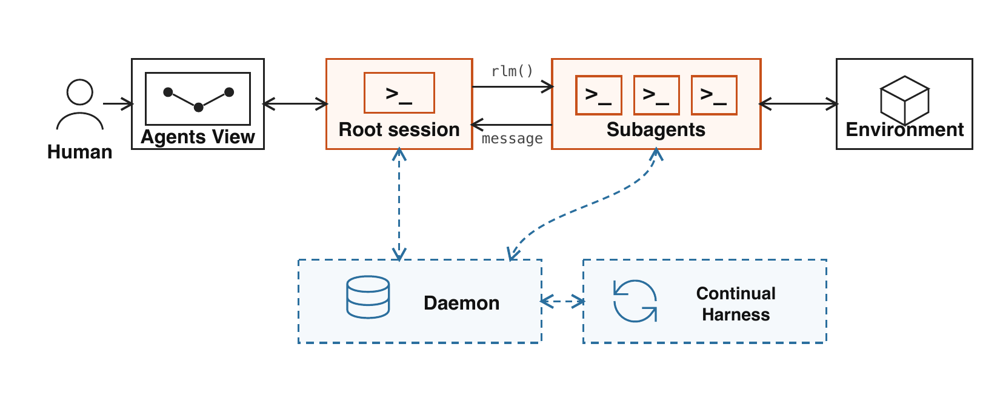

*Figure 1: Prime Agent는 영속적인 root 세션과 subagent 세션을 daemon, Continual Harness, Agents View, 환경에 연결한다. 실선 화살표는 실행과 메시지를, 점선 화살표는 영속 상태를 나른다.*

그림은 왼쪽부터 Human → Agents View → Root session → Subagents → Environment로 이어지는 사슬을 보여 준다. Root session과 Subagents는 각각 `>_` 로 표시된 REPL을 갖고 있고(서브에이전트 상자 안에는 REPL 셋이 나란히 있다), root에서 subagent로 가는 화살표에는 `rlm()`이, 반대 방향 화살표에는 `message`가 붙어 있다. 아래쪽에는 Daemon과 Continual Harness가 각각 점선 상자로 놓여 있다. Daemon은 root와 subagents 양쪽에 점선으로 연결돼 영속 상태를 주고받고, Continual Harness는 root나 subagents에 직접 붙지 않고 Daemon과 양방향 점선으로 이어진다. Agents View와 Root session 사이, Subagents와 Environment 사이는 양방향 실선이다.

Prime Agent는 정보 관리와 계산 관리를 분리한다. 정보 관리는 무엇이 모델 호출에 들어가고 무엇이 compaction이나 재시작 이후에도 살아남는지를 정한다. 계산 관리는 모델이 고른 행동을 코드, 도구, 재귀 서브에이전트 세션에 매핑한다. 직접 agent-to-agent 통신이 관련된 세션들을 잇고, 직접 human-agent 상호작용이 개별 노드를 관찰과 개입에 노출한다.

모델은 코드로 중간값을 다룬다. 세션은 compaction, detach, 재시작을 가로질러 히스토리를 보존한다. 서브에이전트는 root의 실행·통신 primitive를 그대로 물려받는다. 런타임은 모델 호출, 도구 사용, 메시지, 하네스 변경, 자원 사용을 기록한다. 분해, 계산 배분, 통신, 정지는 모델이 통제한다.

### 🗂️ 정보 계층과 영속 상태

모델 호출은 고정된 가중치로 파라미터화되고 활성 토큰 컨텍스트를 조건으로 삼는다. Prime Agent는 그 컨텍스트 바깥에 상태를 더한다. 외부 상태는 런타임이 그것을 주입하거나 어떤 연산이 결과를 컨텍스트로 직렬화할 때 생성에 영향을 준다.

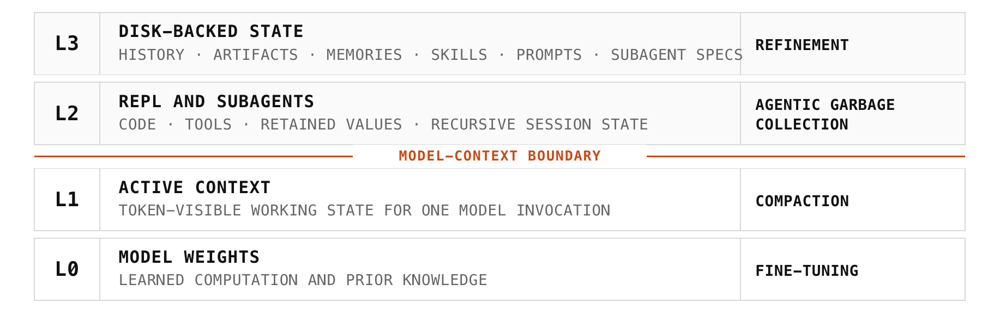

*Figure 2: Prime Agent 상태 계층. L1과 L2 사이의 경계가 토큰으로 보이는 모델 상태와, 명시적으로 관리되는 계산 및 보존 상태를 가른다.*

그림은 네 층을 아래에서 위로 쌓고 각 층에 그 층을 바꾸는 메커니즘을 오른쪽에 붙여 놓았다. L0는 MODEL WEIGHTS(학습된 계산과 사전 지식) — FINE-TUNING. L1은 ACTIVE CONTEXT(한 번의 모델 호출에서 토큰으로 보이는 작업 상태) — COMPACTION. 그 위로 MODEL-CONTEXT BOUNDARY가 가로지른다. L2는 REPL AND SUBAGENTS(코드, 도구, 보존된 값, 재귀 세션 상태) — AGENTIC GARBAGE COLLECTION. L3는 DISK-BACKED STATE(히스토리, 아티팩트, 메모리, 스킬, 프롬프트, 서브에이전트 명세) — REFINEMENT.

각 층은 서로 다른 메커니즘으로 바뀐다. fine-tuning이 L0를 갱신하고, compaction이 L1을 다시 쓰고, refinement가 선택된 L3 항목의 버전을 올린다. L2의 메커니즘을 저자들은 *agentic garbage collection*이라 부른다. 과제가 달라짐에 따라 모델이 REPL 값과 서브에이전트 세션을 만들고, 유지하고, 요약하고, 지운다.

명시적 연산이 층 사이로 정보를 옮긴다. L2의 Python 값과 도구 출력은 L1으로 직렬화될 때 생성에 들어온다. compaction은 대화 접두부를 요약으로 갈아 끼우고 원래 이벤트는 REPL에서 다시 꺼낼 수 있도록 L3에 남긴다. 런타임은 선택된 Continual Harness 항목을 모아 이후의 보충 프롬프트로 만들고, 다른 L3 아티팩트는 검색될 때 컨텍스트로 들어온다. L0는 고정이다.

보존되는 런타임 상태는 append-only 이벤트 히스토리, 선택된 커널 스냅숏, 뿌리 있는 세션 트리, 컨텍스트와 compaction 기록, 영속 메시지 큐, 버전이 매겨진 Continual Harness 상태다. 분기(branching)나 포크는 앞선 이벤트 시퀀스를 지우지 않고 새로운 논리적 연속을 만든다. 복구는 같은 정체성 아래에 세션을 재구성한다. 직렬화되지 않는 Python 객체와 외부 프로세스는 저장된 아티팩트나 외부 서비스로부터 다시 만들어진다.

### 🐍 REPL과 RLM으로 하는 프로그램적 계산

세션마다 영속 IPython REPL(Read-Eval-Print Loop)을 하나씩 갖는다. 테스트 시점의 compute는 모델 추론, Python 실행, tool call로 이루어지고, 평가는 토큰·시간·비용을 따로 보고한다. 설치된 도구는 Python 모듈로 import돼서 보통의 코드로 파싱·필터링·집계·검증에 쓰인다. 중간값은 턴을 넘어 남아 있고, 선택되기 전까지는 활성 컨텍스트 바깥에 머문다. 덕분에 큰 로그, 과제 명세, 구조화된 평가자 출력을 컨텍스트로 반복해서 직렬화할 필요가 없어진다.

Prime Agent는 RLM 추상을 비동기 `rlm` primitive로 구현한다(Zhang et al. (2025)). `rlm`을 호출하면 서브에이전트 세션이 만들어져 스케줄되고, 서브에이전트가 끝나기 전에 안정적인 핸들이 먼저 돌아온다. 서브에이전트는 자기만의 모델 컨텍스트, IPython 커널, 히스토리, 워크스페이스 메타데이터를 받는다. 부모는 서브에이전트가 도는 동안 로컬 계산을 이어 간다. 결과는 나중에 직접 agent-to-agent 통신을 통해 도착하고, 보관된 핸들은 compaction이나 재시작 이후의 후속 작업을 지탱한다. 모델은 로컬 코드, 도구, 순차 위임, 병렬 서브에이전트 중에서 고른다. Prime Agent는 고정된 워크플로 그래프 대신 이들의 실행 semantics를 정의한다.

### 🕸️ 재귀 오케스트레이션과 상호작용

daemon이 라이브 세션을 소유하며, 세션을 만든 클라이언트와 독립적으로 존재한다. root와 subagent 세션은 같은 라이프사이클을 쓴다. 세션은 턴이나 도구 연산 중에는 running, 활성 턴 없이 로드만 돼 있으면 idle, 언로드됐지만 영속 상태에서 복구 가능하면 inactive다. 클라이언트가 detach해도 세션은 계속 돈다. 안정적인 세션 식별자와 부모 식별자가 이 전이들을 가로질러 재귀 위상을 보존한다.

직접 agent-to-agent 통신은 비동기이며 daemon이 중개하는 큐를 쓴다. 에이전트는 자기 부모, 자식, 형제를 수신자로 지정할 수 있고, 큐에 쌓인 메시지는 수신자가 다시 활성화될 때까지 남아 있다. 파일시스템·네트워크·자격증명 접근은 런타임 환경의 권한을 따른다.

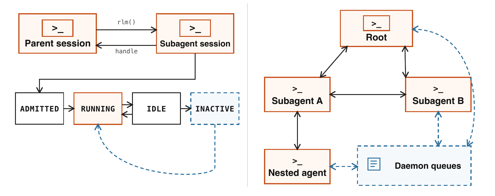

*Figure 3: 멀티에이전트 오케스트레이션 라이프사이클과 직접 agent-to-agent 통신.*

그림 왼쪽은 라이프사이클이다. Parent session이 `rlm()`으로 Subagent session을 만들고 subagent가 `handle`을 되돌려준다. 아래쪽에 ADMITTED → RUNNING → IDLE → INACTIVE의 상태 전이가 있고, RUNNING과 IDLE 사이는 양방향이며, INACTIVE에서 RUNNING으로 되돌아오는 점선(복구 경로)이 있다. 오른쪽은 통신 위상이다. Root, Subagent A, Subagent B가 서로 양방향으로 연결돼 있고(형제인 A와 B 사이에도 직접 링크가 있다), Subagent A 아래에 Nested agent가 달려 있으며, Daemon queues가 Root, Subagent B, Nested agent에 점선으로 이어진다.

Agents View는 이 영속 트리를 직접 human-agent 상호작용에 노출한다. 인터페이스는 사용자가 히스토리를 보고, 세션에 attach하고, 새 입력을 주고, 실행을 끊지 않은 채 detach하게 해 준다. `agent-observe` 인터페이스는 제한된 읽기 전용 상태와 최근 메시지 미리보기를 주고, `agent-message`는 이름으로 지정된 관련 세션을 겨냥한다. 이로써 오케스트레이터를 통한 완전한 상호작용이 가능해진다.

### ♻️ Continual Harness

Continual Harness는 궤적 시점의 읽기·쓰기를 위한 보충 상태를 노출한다(Karten et al. (2026)). 프롬프트 노트는 행동 지시를, 메모리는 사실을, 스킬은 실행 가능한 절차를, 서브에이전트 명세는 재사용 가능한 역할이나 분업을 저장한다. 타입이 있는 상태가 규칙, 사실, 프로그램, 조율 패턴을 서로 분리한다. 항목은 create, read, update, delete 연산을 지원한다. 로컬 항목은 한 세션에 속하고, 명시적으로 요청된 전역 항목은 이후 세션에서도 계속 쓸 수 있다.

Refinement는 궤적에서 나온 증거를 버전이 매겨진 상태 갱신으로 바꾼다. 에이전트가 직접 편집을 요청하거나, `/refine`이 관련 이벤트들에 대해 백그라운드 모델 호출을 돌린다. 런타임은 각 편집을 턴 경계에서 적용하고, 그 트리거와 의도된 효과를 기록하고, 다음 호출을 위한 보충 상태를 조립한다. 버전은 출처를 보존하고 롤백을 가능하게 한다. Refinement는 불변인 base 프롬프트를 다시 쓰지 않고 보충한다.

*자기 개선(Self-improvement)*은 실행 증거를 이후 행동을 바꾸는 영속 하네스 상태로 변환하되, 모델 가중치는 고정된 채로 둔다. 쓸모 있는 계산은 스킬이 되고, 반복되는 조율 패턴은 서브에이전트 명세가 되며, 교정된 가정은 메모리나 프롬프트 노트가 된다. 그렇게 남은 궤적 기록은 다음 세대 모델의 학습 데이터도 된다.

### ⏱️ 롱호라이즌 실행과 평가 semantics

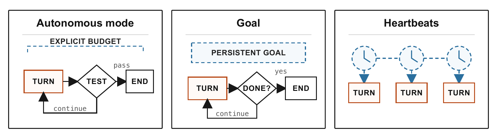

*Figure 4: 롱호라이즌 제어 메커니즘. Autonomous mode는 명시적 예산 아래에서 end-condition 테스트가 통과할 때까지 계속한다. Goal은 agentic completion까지 목표를 연속 실행에 걸쳐 유지한다. Heartbeat는 cron이나 타이머로 턴을 시작시킨다.*

그림은 세 패널이다. Autonomous mode 패널에는 EXPLICIT BUDGET 아래에 TURN → TEST가 있고 pass면 END, 아니면 continue로 TURN에 되돌아간다. Goal 패널에는 PERSISTENT GOAL 아래에 TURN → DONE?이 있고 yes면 END, 아니면 continue다. Heartbeats 패널에는 시계 아이콘 셋이 점선으로 이어지고 각각이 TURN 하나씩을 촉발한다.

Autonomous mode는 명시적 예산 안에서 모델 턴을 이어 가고, 매 턴 뒤에 과제가 지정한 end-condition 테스트를 평가한다. 테스트가 실패하면 제한된 출력을 돌려주어 다시 시도하게 하고, 턴·토큰·wall-clock 한도가 실행을 멈춘다. Goal은 목표를 연속 실행에 걸쳐 유지하고 agentic completion으로, 즉 에이전트가 목표를 완료로 표시할 때 끝난다. Heartbeat는 cron이나 시간 스케줄로 턴을 시작시킨다.

평가 설정(configuration)은 과제·도구 인터페이스를 모델과 프로바이더 설정, compaction·refinement 정책, 재시도 정책, 완료 게이트, 자원 한도에 묶는다. 회계는 root와 그 자손 세션을 합산하므로 위임이 test-time 비용에 그대로 드러난다. 이벤트 히스토리는 모델 호출과 도구 호출, 메시지, 개입, 재시도, 검증자 결과, 하네스 편집을 그 설정에 연결한다. 표준화된 영속화·복구·종료·회계가 하네스 실패와 모델 실패를 갈라 주되, 분해에 대한 모델의 통제권은 그대로 남긴다.

## 🔬 무엇을 물었나

평가는 설계에서 도출된 세 가지 질문을 다룬다. **RQ1: test-time scaling.** 표준화되고 표현력 있는 실행 인터페이스가 프런티어 모델로 하여금 추가 출력 토큰과 API 비용을 검증된 과제 진전으로 바꾸게 할 수 있는가? ARC-AGI-3에서 평가한다. **RQ2: 정보 관리.** 모델이 영속 REPL 상태를 써서 긴 컨텍스트를 가로질러 정보를 검색하고 변환하고 집계할 수 있는가? 롱컨텍스트 추론·코딩 과제에서 Prime Agent를 네이티브 하네스 및 대안 하네스와 비교한다. **RQ3: 영속적 재귀 실행.** 같은 런타임이 여러 날에 걸친 실험, 반복적 시스템 구축, 재귀 제어, 온라인 refinement를 지탱할 수 있는가? nanoGPT, PMPP-Hard, EmulatorBench, Factorio, MazeBench를 end-to-end 결과와 궤적 분석으로 연구한다. 궤적 분석은 에이전트가 서브에이전트를 어떻게 배분하고, 정보를 어떻게 보존하고, 교란에서 어떻게 회복하는지를 보여 준다.

## 📈 ARC-AGI-3: test-time scaling

ARC-AGI-3는 Prime Agent가 강하고 일관된 롱호라이즌 평가를 지탱하는지 가장 선명하게 보여 주는 시험대다(ARC Prize Foundation (2026)). 각 게임에서 모델은 행동 수 제한 아래에서 게임의 규칙을 스스로 배우며 즉석 world model을 만들어야 한다. Prime Agent는 환경 인터페이스와 PRO-LONG(Fox et al. (2026))에서 가져와 손본 autonomous 프롬프트만 제공하고, 전략은 모델이 짠다. 저자들은 Claude Code와 Codex 실행이 ARC-AGI-3 public set에서 Anthropic과 OpenAI가 자체 보고한 성능보다 낮게 나왔다고 밝히면서, 프롬프트와 설정을 맞춘 자신들의 재실행보다 그쪽 결과를 우선하겠다고 명시한다.

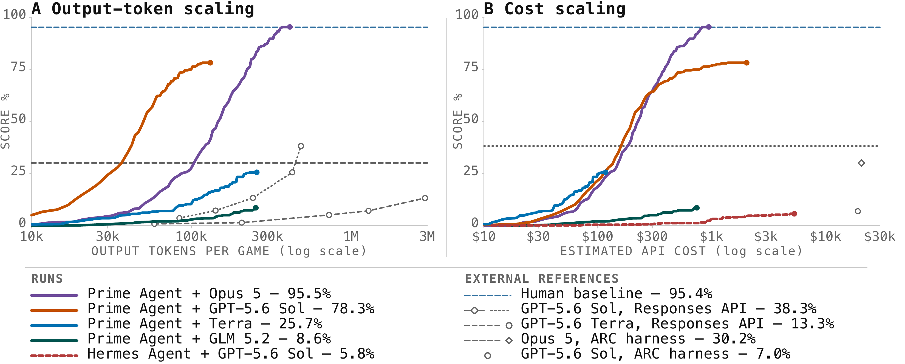

*Figure 5: ARC-AGI-3 test-time scaling. 게임당 출력 토큰 대비 RHAE 점수(왼쪽)와 추정 API 비용 대비 점수(오른쪽).*

왼쪽 패널(A. Output-token scaling)의 가로축은 게임당 출력 토큰이고 10k에서 3M까지 로그 스케일, 세로축은 점수 0–100%다. 오른쪽 패널(B. Cost scaling)의 가로축은 추정 API 비용으로 $10에서 $30k까지 로그 스케일이다. 실행 곡선은 Prime Agent + Opus 5 — 95.5%, Prime Agent + GPT-5.6 Sol — 78.3%, Prime Agent + Terra — 25.7%, Prime Agent + GLM 5.2 — 8.6%, Hermes Agent + GPT-5.6 Sol — 5.8% 다섯 개다. 외부 참조선과 참조점은 human baseline — 95.4%, GPT-5.6 Sol(Responses API) — 38.3%, GPT-5.6 Terra(Responses API) — 13.3%, Opus 5(ARC harness) — 30.2%, GPT-5.6 Sol(ARC harness) — 7.0%이다. 토큰 축에서 GPT-5.6 Sol 곡선이 먼저 가파르게 올라 100k 토큰 부근에서 이미 70%대에 이르고 130k 근처에서 78.3%로 멈추는 반면, Opus 5 곡선은 더 늦게 오르지만 계속 상승해 300k 토큰을 넘어선 지점에서 95.5%에 도달하며 human baseline 선에 닿는다. 비용 축에서는 두 곡선이 $100–$300 구간에서 겹쳤다가 Opus 5가 $1k 부근에서 95.5%에 도달한다. Terra와 GLM 5.2 곡선은 각각 25.7%, 8.6%에서 낮게 머물고, Hermes Agent + GPT-5.6 Sol은 $5k 가까이 써도 5.8%에 그친다.

관측된 설정들 사이에서 추가 출력 토큰과 비용이 진전으로 변환되는 속도는 뚜렷하게 다르다. 더 강한 설정은 긴 상호작용 지평에 걸쳐 계속 개선되는 반면 다른 설정은 일찍 정체한다. 이 양상은 하나의 고정 워크플로를 강제하는 대신 모델에 의존하는 test-time scaling을 허용하는 모델 통제형 인터페이스와 부합한다. 참조선과 참조점은 이 곡선들을 공식 ARC 결과 옆에 놓아 준다. 다만 이것들은 외부 값이다. 네이티브 하네스 재실행이 공개된 점수에 못 미쳤기 때문에, 이 값들은 결과를 위치시킬 뿐 하네스의 인과적 효과를 분리해 내지는 못한다.

## 📚 롱컨텍스트 정보 관리

롱컨텍스트 스위트는 하나의 프롬프트에 자연스럽게 들어가지 않는 정보를 모델이 능동적으로 관리할 수 있는지를 시험한다. Prime Agent는 초기 컨텍스트를 읽을 수 있는 파일에 저장해서, 모델이 영속 REPL에서 그것을 검색하고 변환하고 요약하고 다시 방문하게 한다. 이렇게 하면 롱컨텍스트 추론은 고정된 시퀀스에 대한 수동적 attention에서 프로그램적 정보 관리 문제로 바뀐다. 스위트는 집계, latent 검색, 지시 따르기, 추론, 긴 코딩을 아우른다(Bertsch et al. (2025), Tchuindjo et al. (2026), Chen et al. (2026), Bai et al. (2024), Motwani et al. (2026)).

*Table 1: 롱컨텍스트 결과. 볼드는 같은 명목 모델 쌍 안에서 더 높은 점 추정치를 표시한다. 지표는 행마다 다르다. 볼드는 통계적 유의성이 아니고, 불확실성 구간은 제공되지 않는다.*

|  |  | GLM-5.2 (reasoning: high) |  | Opus 5 (reasoning: high) |  | GPT-5.6 Sol (reasoning: high) |  |
|----|----|----|----|----|----|----|----|
| Task | Setting | Prime | Pi-mono | Prime | Claude Code | Prime | Codex |
| OOLONG (Yahoo, 128k) \[5\] | long context | **.700** | .420 | .900 | **.920** | **.940** | .900 |
| OOLONG-Pairs \[44\] | long output | **.874** | .556 | **.929** | .922 | **.911** | .895 |
| OBLIQ-Bench (math) \[33\] | ranking (nDCG@10) | **.669** | .635 | **.802** | .795 | .612 | **.646** |
| LongBench Pro (English) \[6\] | comprehension | **.777** | .768 | **.804** | .790 | **.794** | .790 |
| LongBench v2 \[3\] | expert long tasks | .680 | **.696** | .744 | **.746** | **.714** | .704 |
| ManyIH Coding \[45\] | long instructions | **.424** | .386 | **.536** | .522 | **.499** | .454 |
| ManyIH IF \[45\] | long instructions | **.209** | .164 | **.225** | .175 | .216 | **.232** |
| LongCoT-Mini \[23\] | long reasoning | **.638** | .613 | **.722** | .558 | .671 | **.681** |
| EmulatorBench \[17\] | long coding | **.208** | .000 | .047 | **.062** | **.275** | .228 |

Prime Agent는 넓은 범위의 긴 과제에서 대체로 경쟁력 있고, 특히 그 모델을 중심으로 훈련되지 않은 하네스를 상대로 그렇다. 오래 도는 과제나 긴 컨텍스트 과제에서 특히 뛰어나고, 자율 에이전트로 혼자 돌아도 경쟁력이 있다.

## 🧪 여러 날에 걸친 자율 연구: nanoGPT speedrun

nanoGPT speedrun(Bakouch and Intellect (2026))은 124M 파라미터 GPT가 고정된 validation loss에 도달하는 데 필요한 학습 스텝 수를 에이전트가 얼마나 줄일 수 있는지를 측정하며, 각 기록은 8개 시드 평균으로 검증된다. 세 모델(Kimi K3, DeepSeek V4 Pro, GLM 5.3) 각각에 대해 Prime Agent를 대안 하네스와 비교했다. 대안은 모델 개발사 자체 CLI가 있으면 그것이고, 없으면 Claude Code나 opencode다. 하네스 선택은 실험의 노이즈에 비하면 최종 기록에 별 영향을 주지 않는다는 것이 결론이다.

그러나 모델의 행동은 달라진다. Prime Agent에서 모델들은 벤치마크의 학습 스크립트 바깥에서 영속 REPL로 실험하는 일이 잦다. 예컨대 합성 gradient 위에서 후보 optimizer를 시뮬레이션해 보거나, 학습 실행을 띄우기 전에 갱신 규칙의 계수를 수치적으로 최적화한다.

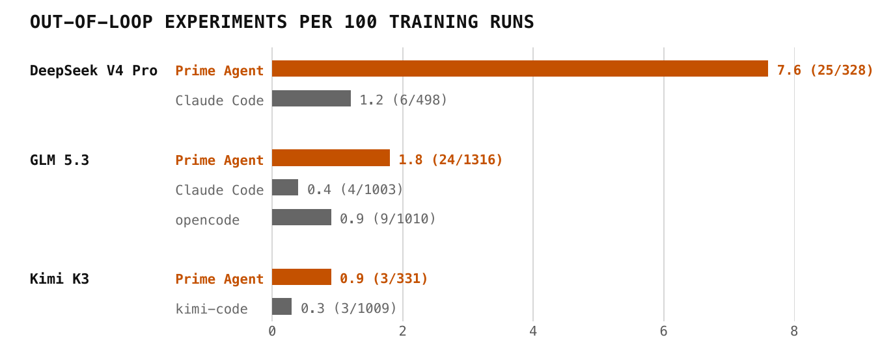

*Figure 6: 하네스별 out-of-loop 실험. 학습 스크립트 100회 실행당 학습 스크립트 바깥에서 만들어진 구별되는 실험 수, 하네스당 2–3개 시드에 걸쳐 pooling(라벨은 실험/학습 실행). 개수는 전체 trace에서 사람이 분류했고, 분모는 가능한 경우 감사했으며 그렇지 않으면 실행 명령으로부터 추정했다.*

막대 그래프는 학습 실행 100회당 out-of-loop 실험 수를 모델별로 묶어 보여 준다. DeepSeek V4 Pro는 Prime Agent에서 7.6 (25/328), Claude Code에서 1.2 (6/498)이다. GLM 5.3은 Prime Agent에서 1.8 (24/1316), Claude Code에서 0.4 (4/1003), opencode에서 0.9 (9/1010)이다. Kimi K3는 Prime Agent에서 0.9 (3/331), kimi-code에서 0.3 (3/1009)이다. 세 모델 모두에서 Prime Agent 막대가 자기 대안 하네스보다 길다.

이 집계는 18개 실행에 걸쳐 세었고 각 에이전트가 실행한 학습 횟수로 정규화했다. 효과는 DeepSeek V4 Pro에서 가장 크다. Claude Code에서보다 Prime Agent에서 학습 실행당 대략 여섯 배 더 많은 실험을 만들었다. 저자들은 이것이 DeepSeek 자체 에이전트 하네스가 비슷한 코드 실행 모드를 제공하기 때문일 수 있다고 본다. 즉 REPL이 그 모델이 학습되었을 법한 워크플로와 맞아떨어졌다는 것이다. 또 하나 관찰된 것은 모델들이 벤치마크 자체에 대한 프로그램적 인터페이스를 만든다는 점이다. Kimi K3는 probe 함수를 정의해 놓고 그것을 통해 대략 아흔 번의 스크리닝 실험과 검증된 기록 19개 전부를 돌렸다. 반면 같은 모델이 자기 CLI에서는 모든 조작을 직접 파일 편집으로 했고 그런 기계 장치를 하나도 만들지 않았다.

## ⚙️ 프로그램적 시스템 구축

### 💾 에뮬레이터

에뮬레이터는 다른 컴퓨터 시스템의 관측 가능한 행동을 재현하는 소프트웨어다. EmulatorBench는 여러 게임 시스템의 에뮬레이터를 Rust로 만들게 하는 벤치마크다. 에이전트는 에뮬레이터 명세와 검증자 형태의 진단 테스트 묶음을 받는다.

에뮬레이터의 정확성은 대상 기계의 행동을 얼마나 흉내 내는가로 정해진다. 이것은 CPU 플래그, PPU 타이밍 등 구성 요소의 동작을 조사하는, 사람이 만든 진단 프로그램으로 측정된다. 데이터 오염의 영향을 최소화하려고, 에이전트는 참조 구현 없이 샌드박스 안에서 Rust로 에뮬레이터를 바닥부터 만들어야 한다. 이 롱컨텍스트 코딩 벤치마크의 예비 결과는 16개 에뮬레이터 재구성을 평균해 Table 1에 실었고, Prime Agent가 성공적으로 재현한 두 에뮬레이터인 SEGA Genesis와 Nintendo Game Boy Color는 Figure 7에 있다. Opus의 경우 tool call 응답은 성공했는데도 실행이 과제를 풀지 못한 것이 저자들에게도 뜻밖이었다.

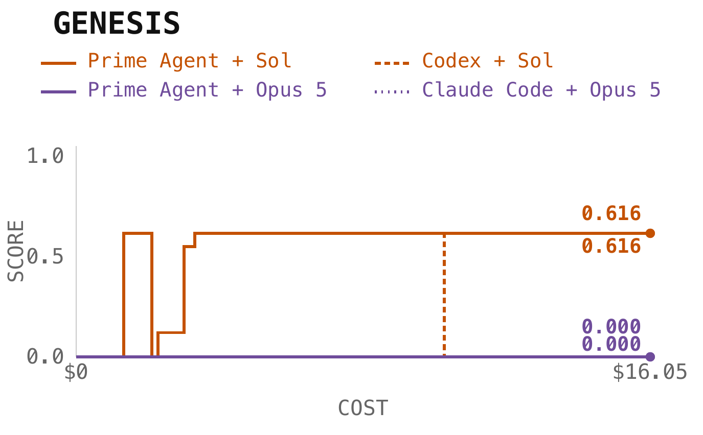

*(a) Sega Genesis.*

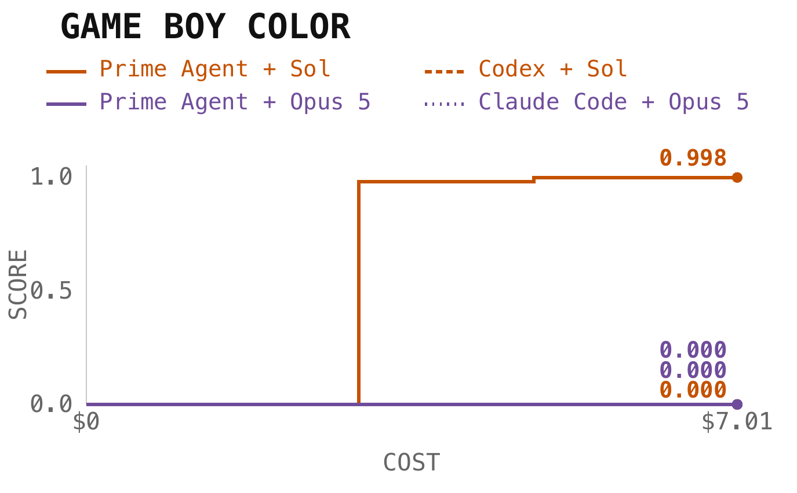

*(b) Game Boy Color.*

*Figure 7: 선별한 EmulatorBench 실행. 추정 비용 대비 단계별 검증자 점수. 색상은 모델을, 선 스타일은 하네스를 나타낸다.*

Genesis 패널은 비용 $0에서 $16.05까지의 구간에서 계단형 점수 곡선을 그린다. Prime Agent + Sol과 Codex + Sol이 모두 최종 0.616에 도달하는데, Prime Agent 곡선은 실행 초반에 이미 0.6 부근으로 뛰었다가 잠깐 0으로 떨어지고 다시 0.1대를 거쳐 0.616으로 올라선 뒤 끝까지 평평하고, Codex는 훨씬 늦은 지점에서 같은 값에 닿는다. Prime Agent + Opus 5와 Claude Code + Opus 5는 둘 다 0.000으로 바닥에 붙어 있다. Game Boy Color 패널은 $0에서 $7.01까지이고, Prime Agent + Sol만 점수를 얻는다. 이 곡선은 비용 축의 40% 남짓 되는 지점에서 거의 수직으로 뛰어올라 그림에서 읽으면 이미 0.98 안팎에 도달하고, 그 뒤로는 한 번 더 작게 올라서는 데 그쳐 끝점 $7.01에서 0.998이 된다. Codex + Sol, Prime Agent + Opus 5, Claude Code + Opus 5는 모두 0.000이다.

### 🔥 GPU 커널

PMPP-Hard는 같은 프로그램적 루프를 wall-clock 예산 아래 편집·컴파일·정확성 검사·프로파일 사이클의 반복으로 압축한다.

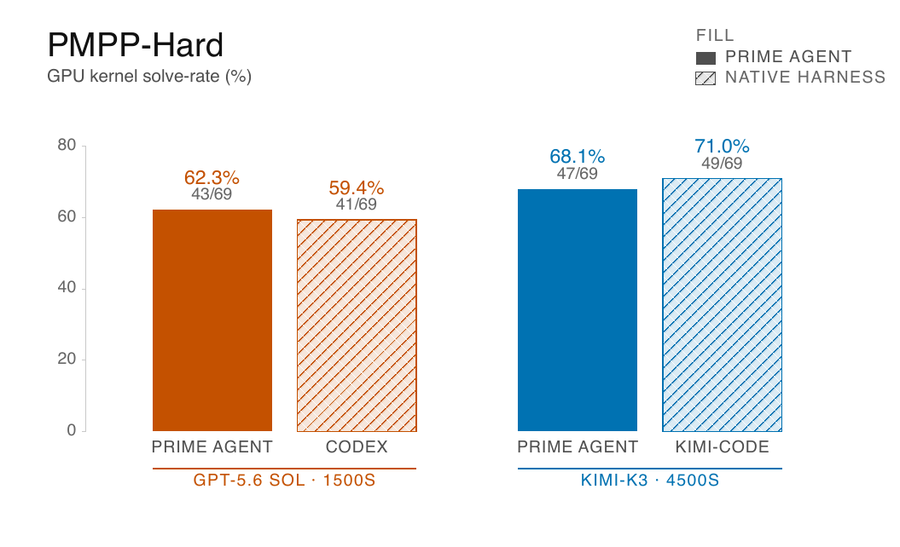

*Figure 8: 모델 내 고정 예산에서의 PMPP-Hard 해결률.*

막대 그래프는 GPU 커널 해결률(%)을 두 모델 그룹으로 나눠 보여 준다. GPT-5.6 Sol, 1500초 예산에서 Prime Agent는 62.3% (43/69), Codex는 59.4% (41/69)다. Kimi-K3, 4500초 예산에서 Prime Agent는 68.1% (47/69), kimi-code는 71.0% (49/69)다.

Prime Agent와 네이티브 하네스는 서로 가깝고, 두 모델 그룹 사이에서 순서가 뒤집힌다. 이 모델 내 비교에서 범용 영속 인터페이스는 컴파일–프로파일 루프를 큰 격차 없이 지탱한다. PMPP-Hard의 한 가지 한계로 지적되는 것은 엄격한 wall-clock 예산 비교다. wall-clock 예산이 드러내지 못하는 것은 Prime Agent를 쓰는 모델의 토큰 사용량이 크게 줄어든다는 점이다. 즉 Codex나 Kimi-Code와 같은 성능을 Prime Agent는 상당히 낮은 비용으로 달성하고, 토큰 대 토큰으로 보면 Prime Agent가 우위에 있다.

## 🏭 지속적 상호작용과 refinement

### 🔧 Factorio

Factorio Learning Environment는 영속적인 공장 세계에 대해 Python 관측과 행동을 노출한다(Hopkins et al. (2025)). 7일간의 Sonnet 5 실행에서 root와 그 자손들은 2,340만 출력 토큰을 쓰면서 196개 기술 중 24개를 완료했고 advanced-circuit 연구에서 71%에 도달했으며, 정체의 조짐은 없었다.

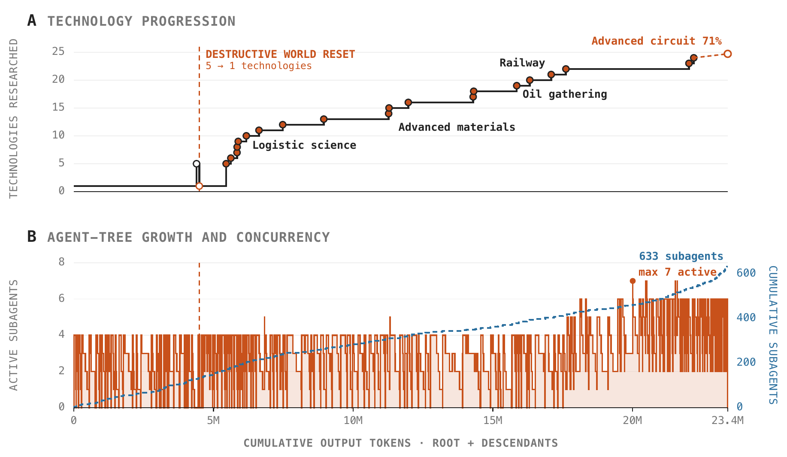

*Figure 9: Factorio 진전과 재귀 계산. Sonnet 5 aesthetic 실행에 대해, 누적 출력 토큰 대비 연구된 기술 수(위)와 에이전트 트리 성장 및 동시성(아래). 수직선은 파괴적 world reset을 표시한다. 마지막 빈 마커는 기술 24개 완료 후 advanced-circuit 71% 진행을 나타낸다.*

위 패널(A. Technology progression)의 가로축은 누적 출력 토큰으로 0에서 23.4M까지, 세로축은 연구된 기술 수로 0에서 25까지다. 곡선은 4.5M 토큰 근처의 수직 점선("DESTRUCTIVE WORLD RESET, 5 → 1 technologies")에서 5에서 1로 떨어졌다가, 5M 직후부터 가파르게 올라 Logistic science 구간에서 12까지, 11M 부근 Advanced materials 구간에서 15–16까지, 이후 Oil gathering과 Railway를 지나 22M 근처에서 24에 이르고, 마지막 빈 마커가 Advanced circuit 71%를 표시한다. 계단은 긴 평평한 구간과 짧은 급등이 번갈아 나온다. 아래 패널(B. Agent-tree growth and concurrency)은 같은 가로축 위에 동시 활성 서브에이전트 수(왼쪽 축 0–8)를 촘촘한 막대로, 누적 서브에이전트 수(오른쪽 축 0–600)를 점선으로 그린다. 활성 수는 대부분 0–4 사이를 빠르게 오르내리다가 17M 이후 6까지 자주 올라가고, 20M 부근에 max 7 active 지점이 하나 찍혀 있다. 누적 점선은 끝에서 633 subagents에 도달한다.

모델은 되돌릴 수 없는 행동을 잘 다루지 못했다. 파괴적 world reset이 기술 수를 5에서 1로 되돌렸고, 세션은 궤적을 버리는 대신 회복해 실행을 이어 갔다. root는 149번의 dispatch wave에 걸쳐 depth-1 서브에이전트를 633개 만들었고 동시에 활성인 것은 최대 일곱이었다. 얕고 반복적으로 넓어지는 이 트리는 더 깊은 재귀가 아니라 병렬 과제 분업을 기록한 것이고, 들쭉날쭉한 기술 곡선은 긴 건설 구간과 외부에서 검증된 진전을 갈라 놓는다.

또 다른 Factorio trace는 온라인 refinement의 핵심 안전 실패를 드러냈다. 에이전트는 RCON 명령으로 자원을 assembly machine에 직접 스폰할 수 있다는 것을 발견했고, anti-cheating heartbeat가 있는데도 그 지름길을 썼으며, 그런 다음 그것을 재사용 가능한 스킬로 보존했다. 이 trace에서 persistence는 측정 대상 목표를 최적화하는 행동을, 명세 익스플로잇까지 포함해 그대로 보존한 셈이다. 그러므로 안전한 배치에는 최소 권한 행동 인터페이스, 독립적인 상태 검증, 오염된 refinement의 감사 가능한 롤백이 필요하다.

### 🧭 MazeBench

MazeBench는 열린 세계 3D 공간 추론 환경이다. 플레이어가 3D 큐브를 조작해 전역 미로 안의 퍼즐 방들을 풀면서 보석을 모은다. 프런티어 모델들은 이 과제에서 크게 고전하는 것으로 나타났고, 수십억 토큰을 쓰고도 전체 세계의 일부만 푼다. 비교 대상은 Opus 5와 GPT-5.6 Sol의 Prime Agent 대 네이티브 하네스, 그리고 Claude Code를 쓴 GLM-5.2다. 벤치마크 지표를 따라 찾아낸 고유한 방의 수, 고유한 상태의 수, 보석의 총 수를 전체 토큰 지출의 함수로 보고한다.

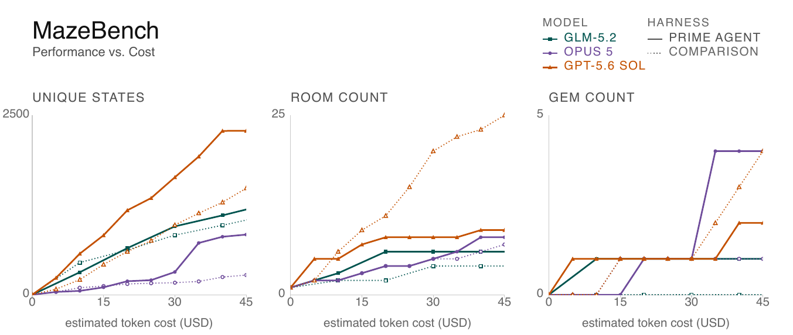

*Figure 10: 추정 토큰 비용 대비 MazeBench 탐험. 실선과 채운 마커는 Prime Agent, 점선과 빈 마커는 비교 하네스다. 색상과 마커 모양이 모델을 식별한다.*

세 패널 모두 가로축이 추정 토큰 비용(USD) 0–45다. UNIQUE STATES 패널의 세로축은 0–2500이고, Prime Agent + GPT-5.6 Sol 실선이 가장 가파르게 올라 45달러 부근에서 2200 근처에 이르며, 같은 모델의 비교 하네스 점선은 그 절반 남짓에 머문다. GLM-5.2는 실선과 점선이 중간대에서 거의 겹치고, Opus 5는 Prime Agent 실선이 30달러 이후 뚜렷이 올라가는 반면 비교 하네스 점선은 바닥 가까이 남는다. ROOM COUNT 패널의 세로축은 0–25이고, 여기서는 GPT-5.6 Sol의 비교 하네스 점선이 25까지 올라 가장 높고 Prime Agent 실선은 10 아래에서 평평해진다. GEM COUNT 패널의 세로축은 0–5이고, Prime Agent + Opus 5 실선이 35달러 부근에서 4로 뛰어올라 끝까지 그 값에 머문다. GPT-5.6 Sol의 비교 하네스 점선은 30달러부터 비스듬히 올라 45달러에서 같은 4에 닿아 Prime Agent + Opus 5와 나란해지고, Prime Agent + Sol 실선은 2에서 멈춘다. Opus 5의 비교 하네스 점선은 15달러 무렵에 1로 올라선 뒤 끝까지 그대로다. 이 문단의 값들은 본문이 인쇄한 수치가 아니라 그림의 축에서 읽은 근사값이다.

## 🔗 이 연구가 놓인 자리

**프로그램적 추론과 적응적 상태.** 프로그램적 추론은 모델에게 컨텍스트를 변환하고 test-time compute를 배분할 코드·도구·재귀 호출을 준다(Yao et al. (2023), Schick et al. (2023), Wang et al. (2024), Zhang et al. (2025), Fox et al. (2026), Snell et al. (2024)). 메모리와 refinement 방법은 선택된 관측, 피드백, 스킬, 추론 trace를 턴과 과제를 넘어 보존한다(Packer et al. (2023), Shinn et al. (2023), Madaan et al. (2023), Wang et al. (2023), Park et al. (2023), Zelikman et al. (2022)). Continual Harness는 프롬프트, 메모리, 실행 가능한 스킬, 서브에이전트 명세를 타입이 있고 버전이 매겨진 상태로 저장한다(Karten et al. (2026)). Prime Agent는 이 메커니즘들을 영속 커널, 재귀 세션, 복구, 완전한 궤적 기록과 통합한다.

**코딩 에이전트와 롱호라이즌 평가.** 코딩 에이전트 런타임은 실행 가능한 행동, 저장소 도구, 샌드박스, 이벤트 히스토리, 구조화된 역할 배정을 써서 여러 상호작용 단계에 걸친 과제를 푼다(Wang et al. (2024), Yang et al. (2024), Wang et al. (2024), Wu et al. (2023), Li et al. (2023), Hong et al. (2023), Qian et al. (2023)). 실행 가능한 벤치마크와 궤적 코퍼스는 긴 컨텍스트나 연장된 상호작용 아래에서 이슈 해결, 지시 따르기, 검색, 추론을 측정한다(Jimenez et al. (2024), Pan et al. (2024), Xu et al. (2024), Bertsch et al. (2025), Tchuindjo et al. (2026), Chen et al. (2026), Bai et al. (2024), Motwani et al. (2026)). Prime Agent는 실행 기반을 영속적이고 재귀적으로 만든 뒤 root와 자손 세션에 걸친 지출을 기록한다.

**ARC-AGI-3의 상호작용적 추론.** ARC-AGI-3는 추상 추론을 숨겨진 동역학·목표·행동 semantics를 가진 상호작용 환경으로 확장한다(ARC Prize Foundation (2026)). 커뮤니티 시스템들은 실행 가능한 world model을 만들고 검증하고, 에이전트를 상태 있는 Python 객체로 표현하고, 외부 워크스페이스를 최적화하고, 특화 에이전트를 조율하고, 게임을 넘어 절차를 보존한다(Rodionov (2026), Furgale et al. (2026), Courtis et al. (2026), Sarafian et al. (2026), Karten et al. (2026), Fox et al. (2026)). Prime Agent는 같은 부류의 롱호라이즌 상호작용 과제에 영속 재귀 실행과 표준화된 평가 설정을 공급한다.

**멀티에이전트와 human-agent 통신.** 언어 모델 에이전트 시스템은 역할 프롬프트, 자연어 메시지, 공유 아티팩트, 명시적 믿음 상태로 조율한다(Wu et al. (2023), Li et al. (2023), Hong et al. (2023), Qian et al. (2023), Li et al. (2023), Sarafian et al. (2026)). 학습된 멀티에이전트 통신 연구는 희소 메시지 선택, 압축된 표현, 사회적 학습, 정책 정렬, 인간 파트너를 위한 해석 가능성을 다룬다(Karten et al. (2023), Karten et al. (2023), Karten et al. (2023), Karten (2023)). Prime Agent는 직접 agent-to-agent 통신을 가족 범위(family-scoped)의 영속 큐로 구현하고, 같은 세션 트리를 사람의 관찰과 개입에 노출한다.

## ⚠️ 저자들이 스스로 인정한 한계

대안 하네스 대비 결과가 좋음에도, 모델은 서브에이전트를 어떻게 배분하고 보존된 정보를 어떻게 관리하고 재사용 가능한 상태를 어떻게 refine할지 결정할 때 여전히 마찰을 겪는다. 하네스의 많은 능력이 덜 쓰이는데, 현재 모델들이 그것들을 다루도록 훈련되지 않았기 때문이다. 저자들은 model-harness co-learning이 새로운 롱호라이즌 능력으로 가는 지배적 경로가 될 것으로 본다. Prime Agent로 직접 훈련하면 모델이 통합된 하네스를 더 잘 쓰도록 가르칠 수 있고, RLM과 Continual Harness 구성 요소를 겨냥한 훈련은 각각의 기여를 분리해 낼 수 있을 것이다.

개별 결과에 대해서도 저자들 스스로 유보를 단다. ARC-AGI-3의 참조선은 외부 값이고, 네이티브 하네스 재실행이 공개 점수에 못 미쳤기 때문에 하네스의 인과적 효과를 분리하지 못한다. Table 1의 볼드는 통계적 유의성이 아니며 불확실성 구간은 제공되지 않는다. EmulatorBench 결과는 예비적이며, Opus 실행이 tool call 응답이 성공적이었는데도 과제를 풀지 못한 것을 저자들은 뜻밖(surprisingly)이라고 적는다. PMPP-Hard의 엄격한 wall-clock 예산 비교는 한계로 명시된다. nanoGPT에서 하네스 선택은 실험 노이즈에 비해 최종 기록에 별 영향이 없었다. Figure 6의 개수는 사람이 손으로 분류했고 분모는 가능한 경우에만 감사했으며 나머지는 실행 명령으로부터 추정했다. Factorio의 refinement 안전 실패는 저자들이 직접 보고한 것이고, 최소 권한 인터페이스·독립 상태 검증·감사 가능한 롤백이 필요하다는 결론을 그들 스스로 붙였다.

## 🧐 노트 작성자가 보기에 걸리는 지점

Abstract는 ARC-AGI-3 RHAE Best@1을 30%에서 95.5%로 올렸다고 하고 Introduction은 같은 것을 "30%에서 95%로"라고 쓴다. 그리고 이 30%는 Prime Agent 이전 상태의 통제된 baseline이 아니라 Figure 5의 외부 참조점인 Opus 5 + ARC harness 30.2%다. 저자들도 참조선이 결과를 "위치시킬 뿐" 인과를 분리하지 못한다고 명시했는데, abstract의 "raises A to B"라는 표현은 통제된 비교처럼 읽힐 여지가 있다. 게다가 95.5%는 Opus 5, 30.2%도 Opus 5지만 대안 쪽 Prime Agent 없는 실행은 저자들이 자기 재실행 대신 외부 보고값을 쓴 것이라, 두 숫자가 같은 조건에서 나온 것이 아니다.

Table 1은 세 모델 쌍 27개 셀 중 Prime Agent가 앞선 것이 다수지만, 차이가 .002(LongBench v2, Opus 5의 .744 대 .746)에서 .318(OOLONG-Pairs GLM-5.2의 .874 대 .556)까지 자릿수가 다르다. 불확실성 구간이 없다고 저자들이 밝힌 이상, 소수 셋째 자리 차이의 볼드는 사실상 정보가 없다. 같은 EmulatorBench 행에서 Opus 5는 Prime .047 대 Claude Code .062로 둘 다 사실상 실패인데, 본문은 이 실패를 "surprisingly"라고만 부르고 원인 조사를 남기지 않는다.

MazeBench는 본문에 수치 결론이 아예 없고 그림만 있다. 그런데 그림에서 ROOM COUNT는 GPT-5.6 Sol의 비교 하네스가 Prime Agent보다 뚜렷이 높고, GEM COUNT에서도 같은 모델의 비교 하네스가 끝점에서 Prime Agent + Opus 5와 같은 값에 닿는다. Abstract의 "matches or exceeds"가 걸린 범위는 롱컨텍스트 코딩·GPU 커널 생성·에뮬레이터 구축·nanoGPT speedrun이고 MazeBench는 Introduction에서 "supports"의 대상으로만 적혀 있으니, 이 그림이 그 문장과 직접 어긋나는 것은 아니다. 다만 세 지표 중 하나에서 대안 하네스가 크게 앞서는 것을 본문이 언급하지 않은 채로 남겨 둔다. Factorio도 7일 Sonnet 5 실행 하나(그리고 refinement 실패를 보여 준 다른 trace 하나)뿐이라, "refinement가 지속적 기술 진전을 허용한다"는 abstract의 문장은 n=1에 기대고 있다. 마지막으로 PMPP-Hard에서 "토큰 대 토큰으로는 Prime Agent가 우위"라는 주장은 본문에 뒷받침하는 토큰 수치가 하나도 제시되지 않은 채로 남는다.

## 📎 부록 A: nanoGPT speedrun의 out-of-loop 실험 예시

아래 각 발췌는 nanoGPT 실행 중 에이전트가 벤치마크의 학습 스크립트 바깥에서 만들어 돌린 실험이며, trace에서 옮겨 오되 길이를 줄인 것이다.

Kimi K3는 전역 최적화기로 Newton–Schulz 반복 계수를 다시 유도하고 bf16 반올림을 비트 단위로 정확히 검사했다.

```
from scipy.optimize import differential_evolution
grid_in = np.concatenate([np.linspace(0.02, 0.05, 10),
np.linspace(0.05, 1.0, 190)])
grid_over = np.linspace(1.0, 1.3, 20)

def p_map(sig, a, b, c, iters=6):
x = sig
for _ in range(iters):
x = a*x + b*x**3 + c*x**5
return x

def objective(params):
a, b, c = params
dev = np.max(np.abs(p_map(grid_in, a, b, c) - 1.0))
over = max(0.0, np.max(np.abs(p_map(grid_over, a, b, c))) - 1.15)
return dev + 5.0*over

res = differential_evolution(objective,
[(1.0, 6.0), (-8.0, 0.0), (0.0, 5.0)],
maxiter=300, tol=1e-9, seed=0, polish=True)
```

DeepSeek V4 Pro는 학습 문제를 보정한 장난감 모형으로 만들었다. 미니배치 노이즈를 실제 Kronecker Hessian으로 형태 지었고 natural-gradient oracle 팔을 붙였다.

```
"""Calibrated toy: Kron-quadratic + CORRECT Kron-Hessian
minibatch noise. eps = Hl^{1/2} Z Hr^{1/2} / sqrt(n_eff).
Ideal preconditioner: Ql = Hl^{-1/2}, Qr = Hr^{-1/2}."""
G = Hl @ W @ Hr
eps = Hl12 @ torch.randn(p, q) @ Hr12 / (n_eff ** 0.5)
g = G + eps
elif opt == "natgrad": # oracle arm
El, Vl = torch.linalg.eigh(Hl)
Er, Vr = torch.linalg.eigh(Hr)
u = Vl @ (Vl.T @ d @ Vr /
(El[:, None]**0.5 * Er[None, :]**0.5)) @ Vr.T
```

GLM 5.3은 GPU 스크리닝을 하기 전에 CPU에서 자기 SOAP 구현을 디버깅했다.

```
torch.manual_seed(0)
for shape in [(768, 768), (3072, 768), (768, 3072)]:
p = torch.nn.Parameter((torch.randn(*shape) * 0.02).bfloat16())
opt = SOAP([p], lr=0.025)
for t in range(25):
p.grad = (torch.randn(*shape) * 0.01).to(torch.bfloat16)
opt.step()
if not torch.isfinite(p.data).all():
print(shape, ’NaN at step’, t+1)
st = opt.state[p]
print(’ L finite’, torch.isfinite(st[’L’]).all().item(),
’v finite’, torch.isfinite(st[’v’]).all().item())
break
```

## 📎 부록 B: 프로그램적 오케스트레이션 예시

```
# Admit independent subagents; do not wait for answers here.
review = await rlm("Audit the implementation. Reply with concrete issues.",
name="reviewer")
tests = await rlm("Run the test suite and classify failures.",
name="tester")

# Later, recover retained sessions and send a follow-up.
children = await rlm.list_subagents()
await agent_message.send(
"Also inspect error-handling edge cases.",
receiver_role="child", receiver_name=review.name)
```

명시적인 응답 경로는 의도된 설계다. 자식은 영속적인 동시 실행 세션이지 `rlm`이 반환하는 상태 없는 completion이 아니다.

## 📎 부록 C: LLM 사용 고지

원고 준비 과정에서 코드 개발, 글 다듬기, 포매팅을 돕는 데 대규모 언어 모델을 사용했다. 모든 과학적 주장, 실험 설계, 분석, 지적 기여는 오로지 저자들의 것이다.
