# 🖇️Meta$^n$: 창발적 깊이를 통한 재귀적 자기개선

## 🧩 자기개선 에이전트가 실제로는 무엇을 고치지 못하는가

지능의 핵심 요소 하나는 메타 추론, 즉 자기 자신의 추론 사슬 바깥으로 나가 그 사슬 안에서는 닿을 수 없는 통찰에 이르는 능력이다(Russell and Wefald, 1991; Kounios and Beeman, 2014; Ackerman and Thompson, 2017). 그런데 시스템이 어떻게 자기 바깥으로 나가는가. 호프스태터(Hofstadter, 1979)는 *괴델, 에셔, 바흐*에서 지능과 자아감이 어떤 단일 규칙에서 나오는 게 아니라 **이상한 고리(strange loop)**, 곧 시스템 자신의 규칙이 재귀적으로 적용되어 자기 자신의 산물 위에서 작동하도록 되접히는 자기참조 과정에서 창발한다고 논한다.

오늘날의 자기개선 LLM 에이전트는 정확히 이 지점에서 부족하다. NP-hard 최적화 알고리즘을 쓰고, 터미널 환경을 조작하고, 수학적 구성을 제안하지만, 실패에 대한 지배적 대응은 self-refinement(Madaan et al., 2023; Shinn et al., 2023) — 검사하고, 고치고, 재시도하는 — 이고 이건 같은 메커니즘이 생성·진단·수리를 모두 맡는 단 한 겹의 반성이다. **기존 에이전트는 답을 개선하지, 답이 개선되는 과정을 개선하지 않는다.**

최근 연구는 명시적인 *메타* 층위를 덧붙인다. 진화적 방법은 후보 프로그램 집단을 유지하고(Romera-Paredes et al., 2024; Novikov et al., 2025; Sharma, 2025), 자기수정 에이전트는 자기 소스 코드의 일부를 다시 쓰며(Yin et al., 2024; Zhang et al., 2025a; Zhang et al., 2026; Zelikman et al., 2024), 메타 스캐폴딩 시스템은 베이스 모델 주변의 인프라를 탐색한다(Hu et al., 2025; Zhang et al., 2025b; Lee et al., 2026; Fernando et al., 2024; Agrawal et al., 2026; Liu et al., 2026). **그러나 메타 메커니즘 자체는 고정되어 있다.** 탐색 루프, 변이 연산자, 선택 규칙은 개정되지 않고, 자기 자신을 편집하는 시스템은 전부 안정성을 위해 어떤 드라이버 층을 고정해 두므로 실현된 메타 깊이가 ${\sim}2.5$에서 상한에 걸린다.

### 개념을 재는 세 가지 용어

"자기개선의 깊이"를 시스템 간에 비교 가능하게 만들기 위해 세 용어를 고정한다. 레벨-0 *솔버*를 기준으로, 레벨-1 프로세스는 솔버를 수정하고, 레벨-2 프로세스는 레벨-1 프로세스를 수정하며, 이런 식으로 이어진다. *드라이버*는 그런 수정을 통제하지만 실행 중에는 자기 자신이 결코 수정되지 않는 구성요소다. 시스템의 *실현된 메타 깊이(realized meta-depth)*는 아키텍처가 명목상 허용하는 깊이가 아니라 한 번의 실행 동안 실제로 행동이 바뀌는 가장 높은 레벨이다.

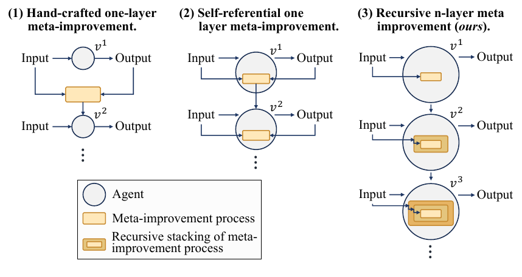

Figure 2는 세 패러다임을 나란히 놓은 도식이다. 왼쪽 (1)은 "수작업 1층 메타 개선"으로, 에이전트 원 $v^1$의 **바깥**에 놓인 하나의 메타 개선 프로세스 박스가 입력과 출력을 받아 다음 버전 $v^2$를 만들고, $v^2$ 역시 바깥의 박스 하나만 갖는다. 가운데 (2)는 "자기참조적 1층 메타 개선"으로, 메타 개선 박스가 에이전트 원 **안쪽**으로 들어가지만 여전히 층마다 박스는 하나다. 오른쪽 (3)은 이 논문의 "재귀적 $n$층 메타 개선"으로, $v^1$은 박스 1개, $v^2$는 재귀적으로 중첩된 박스 2개, $v^3$은 중첩된 박스 3개를 품는다. 즉 버전 $v^d$가 $d$개의 중첩된 메타 프로세스를 지닌다.

**(1) 수작업 메타 시스템**은 고정된 탐색 또는 진화 루프를 솔버 *바깥*에 둔다. 진화적 프로그램 탐색은 후보 프로그램 집단을 유지하고(Romera-Paredes et al., 2024; Novikov et al., 2025; Sharma, 2025), 메타 스캐폴딩 시스템은 베이스 모델 주변의 프롬프트·워크플로·에이전트 설계를 탐색한다(Hu et al., 2025; Zhang et al., 2025b; Lee et al., 2026; Fernando et al., 2024; Agrawal et al., 2026). 이 시스템들이 안정적이고 감사 가능한 이유는 바로 메타 프로세스가 얼어 있기 때문이다. 솔버는 개선되지만 개선자는 개선되지 않는다. 실현된 메타 깊이는 1이다.

**(2) 자기참조 에이전트**는 에이전트가 자기 소스 코드를 편집하게 해서 메타 프로세스를 내부화한다(Yin et al., 2024; Zhang et al., 2025a; Zelikman et al., 2024; Zhang et al., 2026). 원리상 무한한 깊이를 허용하지만, 실제로는 그런 시스템 모두가 자기 자신을 망가뜨리지 않기 위해 어떤 드라이버를 고정해 둔다. Gödel Agent의 action API, DGM의 아카이브 유지·부모 선택, HyperAgents의 외부 평가 루프가 그렇다. 따라서 편집 가능한 표면은 개선 기계장치의 진부분집합이고, 실현된 메타 깊이는 ${\sim}2.5$에서 막힌다. 에이전트가 솔버를 수정하고(레벨 1), 그 수정 논리가 편집 대상 소스 안에 살기 때문에 자기편집은 이후의 자기편집 방식까지 바꾼다(레벨 2). 그러나 얼어붙은 드라이버가 모든 상위 레벨 안에 들어앉아 있으므로 레벨 2 위의 어떤 것도 온전히 바뀌지 않는다. 0.5라는 반쪽 점수가 이 부분적 수정 가능성을 기록한 것이다.

두 패러다임을 합쳐 놓으면 딜레마가 드러난다. *개선자를 재귀시키면 깊이는 얻지만 그 대가로 안정성을 내놓는다.* 그리고 저자들이 아는 한, 현존하는 모든 시스템이 드라이버를 얼려서 이 긴장을 푸는데, 그건 재귀가 애초에 주려던 그 깊이에 상한을 씌우는 해법이다.

## 🔁 해법: 연산을 고정하고 입력을 재귀시킨다

**(3) 재귀적 $n$층 메타(Meta^(*n*)).** Meta^(*n*)은 이 딜레마를 사이에서 절충하는 대신 해소한다. 개선자는 *설계상* 얼려 있다 — LLM 프롬프트로 구성된 단일 고정 연산 $\Omega$ 하나 — 그리고 재귀는 그 *입력* 쪽에 적용된다. $\Omega$가 자기 자신의 누적된 산물(아래 스택의 trace **그리고** 그것을 만들어 낸 코드 스택)을 소비하므로, 각 적용은 직전보다 엄밀히 더 높은 차수의 입력 위에서 작동한다. 연산 자체는 결코 변이하지 않으므로 시스템을 불안정하게 만들 수 없다. 깊이는 미리 고정하지 않고, $\Omega$가 개선을 더 찾지 못할 때까지 자라게 둔다.

핵심 프롬프트는 *"네 아래 시스템의 전체 실행 맥락이 주어졌을 때, 그것을 개선하는 코드를 써라"* 하나다. 고리는 $\Omega$ 자신의 누적된 산물을 통해 되접힌다. $\Omega$가 자신의 이전 출력을 입력으로 받으므로 각 레벨은 직전 레벨보다 아래 시스템을 더 많이 보게 되고, 표면적 버그에서 전략적 선택으로, 다시 메타 전략적 추론으로 옮겨 간다.

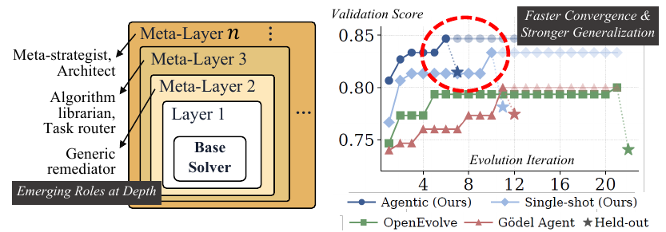

Figure 1의 왼쪽은 중첩 구조를 보여 준다. Base Solver를 Layer 1이 감싸고, 그 위를 Meta-Layer 2, 3, ..., $n$이 차례로 감싼다. 층별로 "Meta-strategist, Architect", "Algorithm librarian, Task router", "Generic remediator"라는 역할 콜아웃이 붙고 아래 배너는 "Emerging Roles at Depth"라고 적혀 있다. 오른쪽은 LawBench charge prediction에서의 탐색 진행 곡선으로, 두 Meta^(*n*) 변종이 Gödel Agent(Yin et al., 2024)와 OpenEvolve(Sharma, 2025)보다 빠르게 오르고 더 높은 곳에 정착한다. 그림에 값이 인쇄되어 있지 않아 축에서 읽은 근사치로 말하면, Agentic (Ours)는 반복 1에서 약 0.807로 시작해 반복 6쯤 약 0.846–0.847에 이른 뒤 평탄해지고, Single-shot (Ours)는 약 0.77에서 시작해 반복 11 이후 약 0.81 부근에 정착하며, OpenEvolve는 약 0.747에서 시작해 반복 6에 약 0.795로 뛴 뒤 그 근처를 유지하다 반복 21에 약 0.800으로 끝나고, Gödel Agent는 약 0.740에서 시작해 반복 11 무렵부터 약 0.800의 평탄면을 따라간다.

### 구체적 예 하나

CO-Bench의 `assignment_problem`에서 단일 LLM 호출은 `scipy.optimize`를 import하는 스크립트를 만든다. 샌드박스에 scipy가 없으니 스크립트가 죽고 태스크 점수는 0.0이다. 평평한 self-refinement 루프는 같은 import 기반 해법의 변주를 계속 재시도한다. Meta^(*n*)의 depth-2 $\Omega$는 36개 태스크를 한꺼번에 보면서 *여럿*이 비슷한 의존성 오류로 실패한다는 걸 관찰하고, 전처리 *더하기* 코드 라이브러리 헬퍼를 함께 내놓기로 한다. "scipy를 쓰지 마라, 여기 `validate_output()` 유틸리티가 있다." depth-2 솔버는 헝가리안 알고리즘을 직접 다시 구현해서 1.0을 얻는다. 그다음 depth 3은 새 trace와 그것을 만든 depth-2 코드를 함께 보고, 그것을 유지할지 다듬을지 뒤엎을지를 판단한다. trace만 보는 평평한 루프는 이런 추론을 할 수 없다. $\Omega$의 반복 적용은 각 층이 코드의 *생산자*(가이던스와 라이브러리 함수)이면서 다음 $\Omega$ 호출의 *대상*이기도 한 스택을 쌓는다. 더 깊은 층은 프리미티브를 **언제** 적용하고 억제하고 결합할지를 배우는데, 각 $\Omega$ 호출이 이전 층들의 코드와 그 코드가 어떻게 작동했는지를 함께 보기 때문이다.

격리 검사로, Meta^(*n*)에서 재귀를 제거하면 CO-Bench archive-best 검증 점수가 0.845에서 0.714로 떨어진다. 재귀만으로 $+0.131$의 이득이다. 이 효과는 두 번째 백본과 두 번째 벤치마크에서도 재현되며, 내부 루프가 여지를 가장 많이 남기는 곳에서 가장 크다.

### 논문이 내세우는 기여

첫째, **Meta^(*n*) 프레임워크**로, 하나의 보편 메타 연산 $\Omega$를 반복 적용해 깊이가 수렴으로 정해지는 계층적 에이전트 스택을 쌓는다. 저자들이 아는 한 메타 깊이 2를 넘으면 중복된 층이 아니라 구조적으로 구별되는 층이 나온다는 첫 시연이다. 둘째, **진화적 오케스트레이션**으로, 층 사슬 위에서 다중 후보 아카이브 탐색을 한다. 셋째, **경험적 증거**로, 8개 벤치마크와 두 백본에 걸쳐 모든 벤치마크 계열에서 선행 자기개선 에이전트를 앞서며, 가장 어려운 held-out 태스크에서 마진이 가장 크다.

## 🏗️ 깊이 $d$의 메타 레이어: $\Omega$와 $M_d$

### 문제 정의

벤치마크는 $N$개의 태스크 $\mathcal{T}=\{t_{1},\dots,t_{N}\}$과, 임의의 후보 스크립트를 태스크 위에서 채점하는 평가자 $\mathrm{eval}(t_{i},s)\in[0,1]$을 제공한다(LawBench에서 그런 태스크 하나가 *charge prediction*이고 F1로 채점된다). 모든 솔버 실행은 *실행 trace* $\tau$를 남기며, 여기엔 실행된 스크립트, stdout/stderr, exit code, 점수, 평가자 피드백이 담기고 $\Omega$가 나중에 무슨 일이 있었는지 진단하기 위해 열어 볼 수 있다. **베이스 솔버** $S_{1}$은 태스크 $t_{i}$를 trace $\tau_{i}^{(1)}$로 보내는 임의의 one-shot 또는 agentic LLM 절차다. 실험에서 $S_{1}$은 단일 LLM 호출이거나 8턴 관찰/행동 루프지만, Meta^(*n*)은 이 선택에 무관하다. 목표는 각각이 아래 것을 감싸면서 평균 점수 $\bar{S}=\tfrac{1}{N}\sum_{i}\mathrm{score}(\tau_{i}^{(d)})$를 최대화하는 솔버 스택 $\{S_{d}\}_{d=2}^{n}$이다. 깊이 $n$은 미리 고정되지 않고 개선이 멈출 때까지 자란다.

기호 정리는 다음과 같다.

| **Symbol** | **Plain English** |
|----|----|
| $\Omega$ | fixed meta-operation, called at each build-step |
| $M_{d}$,  $S_{d}$ | depth-$d$ wrapper and resulting solver |
| $C_{d}$ | $\Omega$’s output: pre-process $f_{\text{pre}}^{(d)}$ + library $\mathcal{L}^{(d)}$ |
| $\tau_{i}^{(d)}$ | execution trace at depth $d$ on task $i$ |
| $\text{ctx}_{d}$ | outer-context passed from layer $d$ to layer $d{-}1$ |

### 빌드 스텝: 층을 쓰는 드라이버 $\Omega$

한 메타 레이어는 두 국면으로 펼쳐진다. 층을 *쓰는* 빌드 스텝(오프라인, 한 번 실행)과 층을 *실행하는* 런 스텝(온라인, 태스크마다)이다.

$\Omega$는 고정된 LLM 프롬프트 절차, 즉 깊이 사이에서도 벤치마크 사이에서도 바뀌지 않는 프롬프트 템플릿 하나다. 이전 깊이의 trace $\{\tau_{i}^{(d-1)}\}_{i=1}^{N}$, 이전 라운드들이 내놓은 코드 스택 $[C_{2},\dots,C_{d-1}]$, 태스크 설명 $\mathcal{T}$, 현재 깊이 $d$가 주어지면 $\Omega$는 새 코드 조각을 쓴다.

$$\Omega:\big(\{\tau_{i}^{(d-1)}\}_{i=1}^{N},\;[C_{2},\dots,C_{d-1}],\;\mathcal{T},\;d\big)\;\longmapsto\;C_{d}.$$ (1)

출력 $C_{d}=(f_{\text{pre}}^{(d)},\mathcal{L}^{(d)})$는 쌍이다. *전처리* $f_{\text{pre}}^{(d)}$는 각 솔버 호출 전에 실행되어 전략적 맥락을 주입하는 작은 파이썬 함수다. *코드 라이브러리* $\mathcal{L}^{(d)}$는 솔버가 호출할 수 있는 재사용 가능한 파이썬 함수들을 담는다. 구체적으로 $\Omega$의 응답은 `rationale` 블록, `pre_process` 블록, 그리고 라이브러리 함수당 하나씩 0개 이상의 `solver_lib:<name>` 블록을 담는다.

$\Omega$를 고정해 두는 것이 설계 원리를 작동 가능하게 만든다. 그래야 깊이 $d{>}2$에서의 이득이 바뀐 개선자가 아니라 더 풍부한 *입력*에서 왔다고 할 수 있기 때문이다. 깊이에 따라 적응하는 유일한 부분은 $\Omega$가 삼키는 trace 요약이다. 그 포맷팅은 깊이에 의존하며, 깊이 3부터는 개별 오류에서 스택 전반의 패턴으로 주의를 옮긴다. 이 포맷팅은 뒤에서 분석하는 전술 대 전략의 *주의 분업*을 부분적으로 떠받치지만, 각 층이 *무엇을 보는지*만 형성할 뿐 어떤 프롬프트도 층이 쓸 코드를 지시하지 않는다.

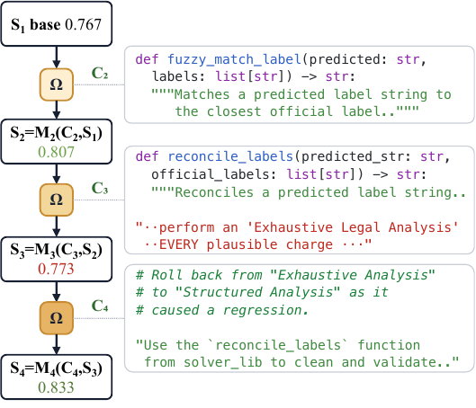

Figure 3(a)는 LawBench charge prediction 실행에서 $\Omega$가 층 2에서 4까지를 써 나가는 과정이다. $S_1$(base)이 점수 0.767에서 시작해 $\Omega$가 $C_2$를 만들고 $S_2=M_2(C_2,S_1)$이 0.807이 된다. 두 번째 $\Omega$가 $C_3$을 만들면 $S_3=M_3(C_3,S_2)$의 점수는 0.773으로, 이 사슬에서 유일하게 떨어진 지점이다. 세 번째 $\Omega$가 $C_4$를 만들어 $S_4=M_4(C_4,S_3)$이 0.833으로 회복한다. 오른쪽 코드 스니펫들이 각 층의 산물이다. $C_2$는 `fuzzy_match_label`을 추가하고, $C_3$은 `reconcile_labels`를 추가하되 *"Exhaustive Legal Analysis"*를 요구하는 과잉 규정적 지시문을 함께 붙이며, $C_4$는 `# Roll back from "Exhaustive Analysis" to "Structured Analysis" as it caused a regression.`이라는 주석과 함께 지시문을 되돌리면서 헬퍼는 유지한다.

### 런 스텝: 층을 실행하는 래퍼 $M_d$

태스크 $t_{i}$가 깊이 $d$로 들어오면 래퍼 $M_{d}$는 $C_{d}$를 이전 솔버 $S_{d-1}$ 주위에 다섯 단계로 끼워 넣는다. 들어가는 길에 (1) 가장 바깥의 $f_{\text{pre}}^{(d)}$가 먼저 돌아 이 태스크에 대한 전략적 맥락 문자열 $\text{ctx}_{d}$를 만들고, (2) $\text{ctx}_{d}$가 아래 층들의 전처리를 통과하며 안쪽으로 실을 꿰듯 내려가고 각 층이 그것을 다듬는다. 나오는 길에 (3) 베이스 솔버가 병합된 맥락들을 보고 스크립트 $s$를 반환하고, (4) 합집합 코드 라이브러리 $\mathcal{L}^{(2)}\!\cup\!\cdots\!\cup\!\mathcal{L}^{(d)}$가 $s$ 앞에 붙는데 이름 충돌 시 더 깊은 층이 덮어쓰며, (5) 결과가 샌드박스에서 실행되어 깊이 $d$의 trace $\tau_{i}^{(d)}$를 만든다. $M_{d}$가 안쪽 솔버의 내부를 건드리지 않으므로 래퍼들은 깔끔하게 합성되고, 깊이 $n$ 솔버는 베이스 솔버 $S_{1}$에서 바닥을 치는 중첩 호출일 뿐이다.

$$S_{d}\;=\;M_{d}(C_{d},S_{d-1})\;=\;M_{d}\circ M_{d-1}\circ\cdots\circ M_{2}\circ S_{1}.$$ (2)

$M_{d}$는 안쪽 솔버도, 태스크 객체도, 이전 층들의 라이브러리도 결코 변이시키지 않으며, 주입되는 코드를 앞에 붙이기 전에 격리된 네임스페이스에서 정적으로 검증하고 스모크 테스트한다.

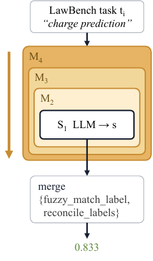

Figure 3(b)는 완성된 $S_{4}=M_{4}\!\circ\!M_{3}\!\circ\!M_{2}\!\circ\!S_{1}$이 태스크를 실행하는 모습이다. 맨 위 "LawBench task $t_i$ / charge prediction"이 $M_4$ 안의 $M_3$ 안의 $M_2$ 안에 있는 `S₁ LLM → s`로 내려가고, 다시 아래로 내려와 `{fuzzy_match_label, reconcile_labels}`를 merge한 뒤 최종 점수 0.833에 도달한다.

## 🧮 재귀가 사는 것: 곱셈적 커버리지와 더 풍부한 입력

재귀는 평평한 개선자에 비해 두 가지를 산다. 전략/전술 공간의 *곱셈적 커버리지*, 그리고 개선자 자신에게 주어지는 *엄밀히 더 풍부한 입력*이다. 앞의 것은 $d$층 스택이 실행될 때 표현할 수 있는 행동에 관한 것이고, 뒤의 것은 다음 층을 쓸 때 $\Omega$가 들여다볼 것이 무엇인가에 관한 것이다.

### 전략이 전술을 조건화한다

런 스텝 동안 각 전처리는 위층의 맥락 문자열을 받아 아래층을 위한 자기 것을 내놓는다. $f_{\text{pre}}^{(d-1)}(t_{i},\,\text{ctx}_{d})\rightarrow\text{ctx}_{d-1}$. 따라서 층들은 서로를 조건화한다. 한 층이 내놓는 맥락은 위에서 내려온 맥락에 의해 형성되므로, 더 깊은 층이 틀을 세우고 얕은 층이 그 틀을 채운다. 깊이 $d$에서 서로 다른 행동이 $k_{d}$개라면 조건화는 최대 $\prod_{d=2}^{n}k_{d}$개의 결합 구성을 허용하는데, 같은 행동을 가진 조건화 없는 평평한 아키텍처가 가지는 $\sum_{d}k_{d}$와 대비된다($n{=}4$, $k_{d}{=}3$에서 27 대 9). 이건 *표현 가능한 구성 수의 상한*이지 측정된 개수가 아니다. 측정된 흔적은 실험에서 archive-best와 best-single-chain 점수의 간격으로, 그리고 재귀 이득의 대부분을 이 조건화 채널에 귀속시키는 소거 실험으로 나타난다.

### 조건화는 간섭도 뜻한다

더 깊은 층의 처방이 유용한 얕은 층의 가이던스를 덮어쓸 수 있고, 실제로 태스크별 퇴행이 관찰된다. 앞서 본 예가 그런 순환 하나다. depth-3 지시문은 함께 실려 온 헬퍼가 멀쩡한데도 점수를 $0.807$에서 $0.773$으로 퇴행시킨다. depth-4 $\Omega$는 (식 1대로) trace뿐 아니라 코드 스택 $[C_{2},C_{3}]$도 읽으므로, 퇴행의 원인을 헬퍼가 아니라 지시문에 귀속시킬 수 있다. 그 rationale은 롤백을 명시적으로 진술하고(*"roll back from Exhaustive Analysis to Structured Analysis as it caused a regression"*), $C_{4}$는 `reconcile_labels`를 유지한 채 이전 전략을 복원해 $0.833$으로 회복한다. 그러므로 간섭은 표현력의 버그가 아니라 비용이고, 두 수준에서 수리된다. 사슬 안에서는 $\Omega$ 자신이, 사슬을 가로질러서는 아카이브와 통합 메커니즘이 수리한다.

### $\Omega$가 보는 것과 평평한 self-refinement가 보는 것

반복 $j$에 있는 평평한 self-refinement 루프는 자기 앞의 $j{-}1$번 반복의 trace만 관찰한다. *무슨 일이 있었는지*가 쌓인 로그이고, 거기엔 *그 일을 일어나게 한 코드*가 결코 들어 있지 않다. 구성상 깊이 $d\geq 3$의 $\Omega$는 이전 깊이의 trace **그리고** 그것을 만들어 낸 코드 스택 $[C_{2},\dots,C_{d-1}]$을 함께 본다. 이건 평평한 루프가 반복을 아무리 많이 돌려도 할 수 없는 고차 추론을 가능하게 한다(*"$C_{3}$의 지시문이 분석을 과잉 제약했으니 깊이 4에서 되돌린다"*). $C_{d-1}$이 관찰 가능한 변화를 만들어 내는 한, 깊이 $d$에서 $\Omega$의 정보는 깊이 $d{-}1$에서의 정보의 진상위집합이다. 드라이버 고정형 시스템들은 둘 사이에 놓인다. 그들의 개선자는 자기의 편집 가능한 층들이 만들어 낸 것만 보는데, 그건 Meta^(*n*)의 $\Omega$가 보는 것의 진부분집합이다. **이득은 $\Omega$에게 읽을 것을 더 주는 데서 오지, $\Omega$ 자체를 다시 쓰는 데서 오지 않는다.** 오케스트레이션을 그대로 둔 채 재귀만 제거하면 소거 실험을 돌린 모든 백본과 벤치마크에서 점수가 내려가고, 그 하락폭은 베이스 솔버가 가장 약한 곳에서 가장 크다.

## 🧬 오케스트레이션: 선형 모드와 진화 모드

$\Omega$와 $M_{d}$ 위에서 스택을 키우는 오케스트레이터가 둘이다. 단순한 선형 심화기와 진화적 아카이브 탐색.

**선형 메타 재귀.** 가장 단순한 오케스트레이터는 한 층씩 탐욕적으로 깊이를 늘린다. 베이스 솔버 $S_{1}$에서 시작해 매 단계 $\Omega$가 현재 trace를 관찰하고 새 $C_{d}$를 만들면, 래퍼 $M_{d}$가 그걸 $S_{d-1}$에 합성해 $S_{d}$를 만든다. 루프는 (a) $\Omega$가 빈 코드를 반환하거나, (b) $P$번 연속으로 평균 점수를 스케일 인지 허용오차 $\epsilon\cdot R$($R$은 실행 시작 시점에 고정된 점수 범위)보다 크게 개선하지 못하거나, (c) 최대 깊이 $D$에 도달하면 멈춘다. 따라서 깊이는 미리 규정되는 게 아니라 수렴으로 정해지고, 실제로 보고된 실행 중 상한에 도달한 것은 없다.

**진화적 아카이브.** 선형 재귀는 운 나쁜 $\Omega$ 호출 하나에 취약하다. 같은 깊이에서 다른 주입이었다면 더 나아갈 수 있었을 때조차, 나쁜 주입 하나가 사슬을 끝내 버린다. 진화 변종은 *단조 증가하는* 후보 사슬 아카이브 $\mathcal{A}$를 유지하고 하나를 탐욕적으로 늘리는 대신 그 위에서 탐색해 이를 대비한다. 매 반복마다 가중치 $w(c)\propto\bar{S}(c)+\alpha/(1+\text{children}(c))$로 $B$개의 부모를 뽑으므로 높은 점수가 선호되고 $\alpha$ 항은 덜 확장된 사슬을 우대하는 탐험 보너스로 작동한다. 부모마다 $K$개의 자식을 내고, $\Omega$의 샘플링 온도는 다양성을 위해 순환시킨다. 부모가 아카이브보다 못한 태스크에서는 *cross-candidate inspiration*이 최고 경쟁자의 trace를 $\Omega$의 프롬프트에 덧붙인다. 아카이브는 각 태스크에서 어떤 사슬이든 달성한 최고 점수도 추적하는데, 이 태스크별 최고들의 평균이 *archive-best* $\bar{S}^{\star}$이고 모든 결과 표에서 best-single-chain 점수와 나란히 보고된다. 둘 사이의 거리가 서로 다른 태스크를 서로 다른 사슬이 이기도록 허용해서 아카이브가 얻는 것이다. 루프는 $P$번 연속으로 개선 없는 반복 뒤에 종료한다.

의사코드는 다음과 같다.

```
1: Tasks $\mathcal{T}$ with $N=|\mathcal{T}|$; base solver $S_{1}$; max depth $D$; beam $B$, children $K$; patience $P$; exploration $\alpha$. Chain mean $\bar{S}(c)=\tfrac{1}{N}\sum_{t}\mathrm{score}(t,c)$; archive $\mathcal{A}$ of (chain, mean) pairs; archive-best $\bar{S}^{\star}=\tfrac{1}{N}\sum_{t}\max_{c\in\mathcal{A}}\mathrm{score}(t,c)$; non-improving counter $p$.
2: $\mathcal{A}\leftarrow\{(S_{1},\,\bar{S}_{1})\}$;  $\bar{S}^{\star}\leftarrow\bar{S}_{1}$;  $p\leftarrow 0$
3: while $p<P$ do
4:   Sample $B$ parents from $\{c\in\mathcal{A}:\text{depth}(c)<D\}$ with $w(c)\propto\bar{S}(c)+\alpha/(1{+}\text{children}(c))$
5:   for each parent $c_{p}$, $k=1,\dots,K$ do
6:    $C\leftarrow\Omega(c_{p})$ $\triangleright$ $T$ cycled through $\{0.5,0.7,0.9\}$; rival traces appended for tasks where $c_{p}$ underperforms
7:    if $C=\emptyset$ then continue
8:    end if
9:    $\mathcal{A}\leftarrow\mathcal{A}\cup\{(\textsc{MetaLayer}(C,\,c_{p}),\,\bar{S}_{\text{new}})\}$
10:   end for
11:   $\bar{S}^{\star}_{\text{cur}}\leftarrow\tfrac{1}{N}\sum_{t}\max_{c\in\mathcal{A}}\mathrm{score}(t,c)$
12:   $p\leftarrow 0$ if $\bar{S}^{\star}_{\text{cur}}>\bar{S}^{\star}$ else $p{+}1$;  $\bar{S}^{\star}\leftarrow\max(\bar{S}^{\star},\bar{S}^{\star}_{\text{cur}})$
13: end while
14: return $\arg\max_{c\in\mathcal{A}}\bar{S}(c)$;  archive-best $\bar{S}^{\star}$
```

**통합(consolidation) 가드.** 더 깊은 층이 개별 태스크를 퇴행시킬 수 있으므로 오케스트레이터는 *통합* 모드도 지원한다. 각 후보가 단일 초점 태스크를 겨냥하면서 나머지 전부에 대해서는 아카이브의 고정된 최고 trace를 상속받아, 태스크별 최고 궤적이 *구성상* 단조가 된다. 저자들은 이 모드를 평균 상승이 아니라 무퇴행 보장 때문에 주장한다.

**Agentic 솔버.** 두 오케스트레이터 모두 단발 Layer-1 솔버를 감쌀 수도 있고, 생성·실행·관찰·개선 루프를 최대 $T$턴($T\!=\!8$) 도는 *agentic* 솔버를 감쌀 수도 있다. agentic 솔버도 같은 전처리와 코드 라이브러리를 받고 최고 점수 스크립트를 반환한다. 동일한 진화 하이퍼파라미터 아래 둘을 비교하면 태스크 내 반복의 기여와 $\Omega$의 태스크 간 신호의 기여를 분리할 수 있다.

나머지 설계 선택 — 모든 층에 같은 모델, 패칭이 아닌 래퍼, 3:1 실패 편향 trace 비율, 벤치마크별 $\epsilon$·patience·beam 설정 — 은 아래 설계 근거 절에 있다.

## 🧪 실험 설정

백본 두 개, Gemma 4 31B-IT와 GPT-5.2에서 결과를 보고한다. 따로 언급이 없으면 모든 수치는 세 시드(42, 43, 44)에 대한 평균 $\pm$ 표준편차다. 8개 벤치마크 계열이 세 가지 솔버 기질에 걸쳐 있다. *파이썬 소스*(CO-Bench(Sun et al., 2026), NP-hard 문제 36개; AlphaEvolve Math(Novikov et al., 2025); Symbolic Regression(SR), 4개 도메인; AlgoTune, 8개 태스크; ARC-AGI-2(Chollet et al., 2026), 120개 태스크), *도커 샌드박스 안의 bash*(TerminalBench 2.0(TB2), 13개 범주에 걸친 어려운 태스크 89개), *고정된 다운스트림 모델을 위한 프롬프트 재작성*(Symptom2Disease(S2D)와 LawBench charge prediction).

Meta^(*n*) 변종 두 개가 동일한 진화 오케스트레이션과 단일 $\Omega$ 템플릿 아래 돈다. *single-shot*(태스크당 LLM 호출 1회, $\Omega$의 기여를 격리)과 *agentic*(관찰-행동 루프, 태스크당 최대 8턴)이다. $B$, $K$, patience, max-iter는 벤치마크별로 고른다. 시드 정책에서 두 군데 벗어난다. TB2의 표준편차는 시드가 아니라 13개 태스크 범주에 걸쳐 계산하고(GPT-5.2에서의 TB2는 단일 시드 s42), held-out split이 없는 벤치마크(AlphaEvolve Math, AlgoTune, SR)는 벤치마크 점수를 직접 보고한다.

Gödel Agent(GA)(Yin et al., 2024)와 OpenEvolve(OE)(Novikov et al., 2025; Sharma, 2025)가 선행 자기개선 비교 대상이고, 같은 베이스 모델로 돌린다. GA는 수정된 *태스크별* 구성으로 보고하는데, 발표된 단일 솔버 인터페이스가 CO-Bench에서 구조적으로 붕괴하기 때문이다. OE는 아티팩트별 진화 비교 대상(island/MAP-Elites)으로 CO-Bench에서 거의 동일한 토큰 예산으로 돌린다. Meta^(*n*)에 대해서는 두 추정량 — *archive-best*($\bar{S}^{\star}$)와 *best single chain* — 을 어디서나 함께 보고한다. 둘의 차이가 하나의 사슬에 몰빵하는 대신 태스크별 선택을 함으로써 얻는 것이다.

벤치마크별 하이퍼파라미터는 다음과 같다. $\Omega$ 프롬프트 템플릿, 출력 스키마, $\epsilon=0.02$, $\alpha=0.3$은 모든 행에서 고정이고, max-depth는 TB2(4)를 빼면 10이다. "off"는 조기 종료를 끄고 max-iter까지 간다는 뜻이다. GPT-5.2 열은 시드당 비용을 묶기 위해 CO-Bench(8→6)와 S2D(20→10)의 max-iter를 줄이고 AE Math와 SR은 6에 둔다. TB2는 범주별로 훑는다. ARC-AGI-2는 GPT-5.2에서만 돌았다(시드 42/43/44, Meta^(n) 시드당 ${\sim}\$632$).

|  |  |  |  | **Max-iter** |  |  |
|----|----|----|----|----|----|----|
| **Benchmark** | $B$ | $K$ | **Pat.** | **Gemma** | **GPT-5.2** | **Test split?** |
|  |  |  |  |  |  |  |
| CO-Bench | 2 | 2 | 4 | 8 | 6 | yes |
| Symptom2Disease | 1 | 3 | off | 20 | 10 | yes |
| LawBench | 1 | 3 | off | 20 | n/r | yes |
| TerminalBench 2.0 | 1 | 2 | 3 to 4 | 6 to 10 | 13 cat-by-cat | no |
| AlphaEvolve Math | 2 | 2 | 10 | 6 | 6 | no |
| Symbolic Regression | 2 | 2 | 10 | 6 | 6 | no |
| AlgoTune | 2 | 2 | 10 | 6 | n/r | no |
| ARC-AGI-2 | 2 | 2 | 4 | n/r | 8 | yes |

벤치마크 상세는 이렇다. (i) **CO-Bench**: 36개 NP-hard 조합 최적화 문제, 파이썬 솔버, $[0,1]$ 채점. (ii) **Symptom2Disease**(S2D): 22-클래스 의료 진단, 정확도 지표, ambient `llm()` 헬퍼가 있는 파이썬 솔버. (iii) **LawBench charge prediction**: 다중 레이블 중국어 법률 분류, F1 지표, 동일한 파이썬+`llm()` 형식. (iv) **TerminalBench 2.0**(TB2): 도커 샌드박스 환경의 13개 범주에 걸친 터미널 에이전트 태스크 89개, bash 솔버, $\Omega$가 bash 함수와 파이썬 헬퍼 스크립트를 모두 내놓는다. (v~vii) **OpenEvolve 벤치마크**: AlphaEvolve Math(수학적 발견, 문제 수는 설정에 따라 다름), Symbolic Regression(데이터로부터 방정식 발견, 4개 도메인), AlgoTune(알고리즘 속도 향상). 모두 문제 디렉터리 자동 발견과 서브프로세스 격리 평가를 갖춘 공유 어댑터로 통합된다. (viii) **ARC-AGI-2**: 소수의 입출력 예시에서 변환 규칙을 추론해야 하는 추상 추론 격자 퍼즐 120개, pass@2로 채점, GPT-5.2에서만 실행.

AE Math의 문제 수는 실행마다 달랐다. 새 문제가 OpenEvolve 어댑터로 이식되면서 태스크 풀이 점진적으로 확장되었기 때문이다. Gemma single-shot 실행은 실행 시점에 있던 15개 문제로 평가했고, Gemma agentic 및 세 시드 GPT-5.2 Meta^(*n*)과 Gödel Agent 실행은 16개 문제로 평가했으며, OpenEvolve GPT-5.2 실행은 10개 문제 부분집합으로 평가했다. OE의 diff 기반 변이는 문제별 시작 솔버를 필요로 하는데 새 문제 중 3개에 그것이 없었기 때문이다. AE Math 집계 수치는 각 시스템에 가용한 가장 큰 집합을 쓴다.

솔버·오케스트레이터 하이퍼파라미터는 베이스 솔버 온도 0.3, $\Omega$ 온도 0.7(선형) 또는 $\{0.5,0.7,0.9\}$ 순환(진화)이다. 선형 모드는 $\epsilon=0.02$(주입이 진전으로 인정되기 위한 최소 평균 점수 상승), $D=10$(최대 깊이 상한), 평가 타임아웃 10초. 진화 모드는 $\Omega$ 프롬프트 템플릿·출력 스키마·$\epsilon=0.02$·$\alpha=0.3$을 벤치마크에 걸쳐 고정한다. self-debug는 `max_retries`$=2$를 허용하고 `retry_threshold`는 벤치마크에 따라 다르다(CO-Bench와 분류는 $0.1$, AlphaEvolve Math와 AlgoTune은 $0.3$, Symbolic Regression과 TB2는 $0.5$). single-shot은 executor 수준 재시도를 최대 2회, agentic은 관찰-행동 턴을 최대 8회 허용한다.

## 📊 주요 결과

*Table 1: Meta^(n) agentic vs. prior self-improving agents (Gemma 4 31B-IT, mean $\pm$ stdev over seeds 42/43/44). Held-out test for CO-Bench, S2D, and LawBench; benchmark score for AlphaEvolve Math, AlgoTune (speedup $\times$), and SR (4-domain mean). ARC-AGI-2 and the SR baselines were run under GPT-5.2 only (Table 2); n/r = not run.*

| **Method** | **CO-Bench** | **S2D** | **LawBench** | **AE Math** | **AlgoTune** | **SR** |
|----|----|----|----|----|----|----|
| **Meta^(*n*)** archive-best | **0.851 $\pm$ 0.014** | 0.733 $\pm$ 0.015 | **0.815 $\pm$ 0.013** | **0.869 $\pm$ 0.045** | $\times$**15.10 $\pm$ 2.4** | **5.22 $\pm$ 0.38** |
| **Meta^(*n*)** best chain | 0.782 $\pm$ 0.016 | **0.743 $\pm$ 0.034** | 0.796 $\pm$ 0.046 | n/r | n/r | 4.68 $\pm$ 0.45 |
| OpenEvolve (Sharma, 2025) | 0.814 $\pm$ 0.022 | 0.718 $\pm$ 0.022 | 0.745 $\pm$ 0.034 | 0.802 $\pm$ 0.052 | $\times$10.45 $\pm$ 1.8 | n/r |
| Gödel Agent (Yin et al., 2024) | 0.451 $\pm$ 0.023 | 0.710 $\pm$ 0.034 | 0.775 $\pm$ 0.023 | 0.581 $\pm$ 0.061 | $\times$13.22 $\pm$ 2.7 | n/r |

*Table 2: Cross-model condition: GPT-5.2 backbone, mean $\pm$ stdev over seeds 42/43/44. Held-out test for CO-Bench and S2D; benchmark score for AlphaEvolve Math, SR (4-domain mean), and ARC-AGI-2 (dev score; the held-out test result is reported in the text). LawBench and AlgoTune were not run under GPT-5.2 for budget reasons; their Gemma columns appear in Table 1. n/r = estimator not run for this cell.*

| **Method** | **CO-Bench** | **S2D** | **AE Math** | **SR** | **ARC-AGI-2** |
|----|----|----|----|----|----|
| **Meta^(*n*)** archive-best | **0.870 $\pm$ 0.011** | 0.725 $\pm$ 0.014 | **0.917 $\pm$ 0.016** | **5.03 $\pm$ 0.20** | **0.331 $\pm$ 0.010** |
| **Meta^(*n*)** best chain | 0.806 $\pm$ 0.017 | **0.734 $\pm$ 0.020** | 0.820 $\pm$ 0.024 | n/r | 0.123 (1 seed) |
| OpenEvolve (Sharma, 2025) | 0.702 $\pm$ 0.025 | 0.721 $\pm$ 0.007 | 0.726 $\pm$ 0.046 | 3.70 $\pm$ 0.13 | 0.003 $\pm$ 0.001 |
| Gödel Agent (Yin et al., 2024) | 0.527 $\pm$ 0.033 | 0.708 $\pm$ 0.037 | 0.674 $\pm$ 0.068 | 2.45 $\pm$ 1.63 | 0.054 $\pm$ 0.006 |

### 전체 그림

Meta^(*n*) agentic은 두 백본 모두에서 두 표의 모든 벤치마크 계열을 적어도 한 추정량에서 앞서지만, 마진의 크기는 벤치마크마다 다르다. 코드 기질에서는 승리가 크고 안정적이다. CO-Bench의 OpenEvolve 대비 마진은 GPT-5.2에서 $+0.168$에 이르고 시드별 범위가 겹치지 않으며, AlphaEvolve Math도 비슷한 마진으로 앞서고, SR은 네 도메인 전부에서 앞선다. ARC-AGI-2에서는 간격이 양적이라기보다 범주적이며, 두 베이스라인 모두 바닥에 가깝다. 프롬프트 재작성 벤치마크에서는 마진이 몇 포인트로 줄어든다. Meta^(*n*)은 두 백본 모두에서 S2D를 평균으로는 여전히 앞서지만 시드별 범위가 겹치고, LawBench는 Gödel Agent보다 $+0.040$ 벌어진다. 두 개의 아키텍처적 지렛대가 이 승리를 설명한다. 깊이를 가로지르는 재귀와, 코드 라이브러리 주입을 통한 태스크 간 전이다.

### ARC-AGI-2: 범주적 사례

ARC-AGI-2는 유동 지능을 재도록 설계되었다. 이 태스크들은 알려진 스킬을 다듬어서는 풀리지 않고 새 스킬을 추상화해야만 풀리므로, 두 작동 층위를 분리해 낸다. 객체 수준 반복은 바닥 근처에 머무르고 Meta^(*n*)의 best single chain조차 $0.123$에 그치지만, $\Omega$가 trace에서 변환 프리미티브를 추상화하고 아카이브가 그것들을 태스크에 걸쳐 조합하는 완전한 메타 수준 스택은 $0.331$에 도달한다. 스킬 암기에 저항하도록 설계된 벤치마크에서 이득은 더 나은 객체 수준 탐색이 아니라 메타 수준에서 온다. 방금의 $0.123$과 $0.331$은 Table 2의 dev 점수이고, held-out split에서는 결과가 더 날카롭다. 거기서 태스크를 하나라도 푸는 시스템은 Meta^(*n*)뿐이고 OpenEvolve와 Gödel Agent는 하나도 풀지 못한다. Table 2의 dev 점수에서 두 베이스라인이 각각 $0.003\pm 0.001$과 $0.054\pm 0.006$으로 바닥 근처에 있던 것이 held-out에서는 0으로 떨어지는 셈이다.

### CO-Bench

아카이브는 단일 LLM 호출로는 아예 풀 수 없는 태스크를 되살린다. 대표 실행 하나(Gemma, s42)에서 constrained guillotine cutting은 $0.000\!\to\!0.996$, maximal independent set은 $0.000\!\to\!0.908$로 간다. 집계에서 archive-best는 Gemma에서 OpenEvolve를 앞서고 GPT-5.2에서는 시드별 범위가 겹치지 않은 채 마진을 $+0.168$까지 벌린다. 세 시스템의 순서가 두 백본에서 동일하므로 이 간격은 백본 인공물이 아니다. 아카이브는 자기 자신의 best single chain도 두 백본 모두에서 $0.06$~$0.07$ 앞서는데, 이것이 곱셈적 커버리지 상한의 경험적 흔적이다.

### 수학적·알고리즘적 발견

AlphaEvolve Math에서 $\Omega$는 호출 가능한 프리미티브 둘, `simulated_annealing()`과 `basin_hopping()`을 주입해서 풀 수 없던 시드를 강한 솔버로 바꾼다. Gemma s42 실행에서 시드는 single-shot에서 $0.222$에서 $0.709$로, agentic에서 $0.435$에서 $0.883$으로 오른다. 시드 전체에서 Meta^(*n*)은 어느 백본에서든 두 베이스라인을 앞서고, SR도 네 도메인 전부에서 같은 패턴을 보인다.

AlgoTune은 agentic 변종이 single-shot 형제보다 못한 유일한 벤치마크다(s42에서 $\times 14.11$ 대 $\times 18.47$, 두 변종이 모두 로그를 남긴 일곱 태스크로 보면 $\times 15.96$ 대 $\times 18.47$). 다만 세 시드 agentic 평균($\times 15.10$)은 여전히 모든 베이스라인을 이긴다. 이 벤치마크의 사전 최적화된 커널 계약은 이미 시드가 뽑아내고 있어서 $\Omega$의 추가 맥락이 과잉 제약을 걸며, 태스크별 진단이 이 메커니즘을 검증 가능하게 만든다.

### TerminalBench 2.0

어느 베이스라인이든 도커 기질에서 돌리려면 그 코드를 상당히 바꿔야 하므로, TB2는 Meta^(*n*)을 자기 시드들과 비교해 잰다. 두 변종이 아주 다른 출발점에서 비슷한 절대 이득으로 수렴하므로 $\Omega$의 기여는 시드 강도와 대체로 직교한다. Gemma에서 single-shot은 약한 $0.067$ 시드로부터 13-범주 평균을 $+0.21$ 끌어올리고 agentic은 $0.258$ 시드로부터 $+0.23$ 끌어올린다. GPT-5.2에서 agentic은 $0.634$에 도달한다. archive-over-chain 마진도 여기서 유지되고, 이 벤치마크는 언어 적응적 주입을 시험하는데 $\Omega$가 13개 샌드박스 범주에 걸쳐 bash 함수와 파이썬 헬퍼 스크립트를 모두 내놓는다.

### 텍스트 분류

프롬프트 재작성 벤치마크는 어떤 메타 층이든 더할 수 있는 것의 한계를 짓는다. 행동 표면이 고정된 레이블 집합 위의 프롬프트 하나뿐이기 때문이다. S2D에서 best chain은 어느 백본에서든 두 베이스라인을 앞서는데 Gemma에서 $+0.025$, GPT-5.2에서 $+0.013$이다. 다만 시드별 범위가 겹치고 저자들은 유의성을 주장하지 않는다. LawBench는 더 벌어져서 archive-best가 Gödel Agent보다 $+0.040$, OpenEvolve보다 $+0.070$ 앞선다. 깊이 진행은 여기서도 읽힌다. 대표적인 S2D 사슬에서 $\Omega$는 CoT 파이프라인(d2)에서 `robust_label_match` 헬퍼(d3)를 거쳐 `classification_prompt_builder`(d4)로 옮겨 간다. LawBench에서는 d2가 중국어 프롬프트로 전환하고, d3이 과잉 제약해서 퇴행하며, d4가 프롬프트 강도를 되돌린다. 앞서 분석한 퇴행-후-롤백 순환과 같은 것이다.

### single-shot 대 agentic

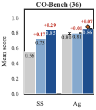

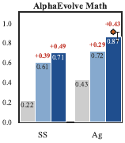

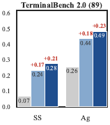

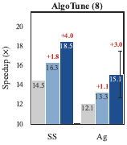


Figure 4는 네 개의 대표 벤치마크에서 SS(single-shot)와 Ag(agentic)를 각각 seed, linear-best(최고 단일 사슬), archive-best(아카이브 전체의 태스크별 최고) 세 막대로 보여 준다. 검은 수염은 세 시드 평균 $\pm 1$ 표준편차(시드 42/43/44)이고, 주황 다이아몬드는 GPT-5.2 백본을 돌린 경우의 세 시드 archive-best다. 각 패널이 그리는 것은 검증 점수 또는 벤치마크 점수이고, held-out 테스트 결과는 Table 1에 있다. CO-Bench(36) 패널에서 SS는 seed 0.56, linear-best 0.73(+0.17), archive-best 0.85(+0.29)이고 Ag는 seed 0.80, linear-best 0.81(+0.01), archive-best 0.87(+0.07)인데, 이 값들은 검증 점수이므로 Table 1의 held-out 테스트 $0.851$과는 다른 추정량이다. AlphaEvolve Math 패널에서 SS는 0.22, 0.61(+0.39), 0.71(+0.49)이고 Ag는 0.43, 0.72(+0.29), 0.87(+0.44)이며 Ag archive-best 위 주황 다이아몬드는 약 0.89에 있다(이 다이아몬드 값은 축에서 읽은 근사치다). TerminalBench 2.0(89) 패널에서 SS는 0.07, 0.24(+0.17), 0.28(+0.21)이고 Ag는 0.26, 0.44(+0.18), 0.49(+0.23)이다. AlgoTune(8) 패널은 세로축이 속도 향상 배수이고 SS는 14.5, 16.3(+1.8), 18.5(+4.0), Ag는 12.1, 13.3(+1.1), 15.1(+3.0)이다.

이 그림에서 linear-best 막대가 재귀의 기여를 격리하고, archive-best까지의 잔차가 아카이브 자체가 더하는 것을 격리한다. agentic은 여덟 벤치마크 계열 중 일곱에서 archive-best를 개선하며, TB2·AlphaEvolve Math·SR에서 이득이 가장 크다. agentic 시드 자체가 크게 오르므로(TB2 $0.067\!\to\!0.258$, AlphaEvolve $0.222\!\to\!0.435$), 내부 관찰-행동 루프가 더 강한 Layer-1 베이스라인을 뽑아내고 그 위에 $\Omega$가 추가 이득을 얹는 셈이다. 토큰 비용은 agentic 모드에서 대략 4~$10\times$ 높고(태스크당 8회 호출) 연산을 더 풍부한 trace 신호와 맞바꾼다. AlgoTune은 그 풍부한 신호가 과잉 제약을 거는 예외다.

### 수렴 거동

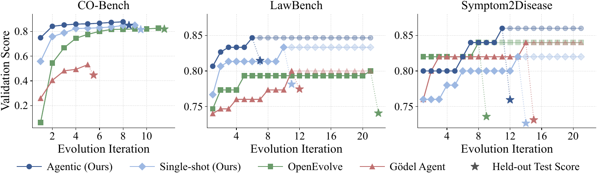

Figure 5는 CO-Bench, LawBench, Symptom2Disease 세 패널에서 진화 반복에 따른 best-so-far 검증 점수를 그린다(Gemma 4 31B-IT, 단일 시드 실행). 별은 고정된 오프셋에 찍은 held-out 테스트 점수이고, 흐린 마커는 조기 종료 후 마지막 값을 유지한다. Meta^(*n*) agentic이 세 벤치마크 모두에서 두 베이스라인보다 적은 반복으로 더 높은 점수에 도달하는 반면, single-shot 변종은 S2D에서 둘 다에 뒤진다. OE는 오르지만 아래에 정착하고, GA는 빠르게 올랐다가 CO-Bench에서 $0.53$ 근처에서 평탄해지며 Meta^(*n*)에 한참 못 미친다. GA의 예산을 늘려도 그 간격은 닫히지 않는다.

그림에 점 값이 인쇄되어 있지 않으므로 다음은 축에서 읽은 근사치다. CO-Bench 패널에서 Agentic (Ours)는 반복 1~8에서 약 0.75, 0.84, 0.85, 0.86, 0.86, 0.87, 0.88, 0.88이고 held-out 별은 약 0.86이다. Single-shot (Ours)는 반복 1~9에서 약 0.56, 0.76, 0.79, 0.82, 0.82, 0.82, 0.83, 0.83, 0.81이고 held-out 별은 약 0.81이다. OpenEvolve는 반복 1~8에서 약 0.06, 0.54, 0.67, 0.74, 0.77, 0.79, 0.80, 0.82이고 held-out 별은 약 0.81이다. Gödel Agent는 반복 1~5에서 약 0.26, 0.40, 0.48, 0.49, 0.53이고 held-out 별은 약 0.44다. LawBench 패널에서 Agentic (Ours)의 held-out 별은 약 0.82, Single-shot (Ours)는 약 0.78, OpenEvolve는 약 0.74, Gödel Agent는 약 0.78이다. Symptom2Disease 패널에서는 held-out 별이 Agentic (Ours) 약 0.76, Single-shot (Ours) 약 0.73, OpenEvolve 약 0.74, Gödel Agent 약 0.73으로, 검증 곡선에서는 OE와 GA가 후반에 약 0.84까지 오르지만 held-out에서는 Agentic (Ours)가 가장 높다. 세 패널 모두에서 Agentic (Ours)가 held-out 점수와 최종 검증 수준 모두 가장 높다.

## 🔍 베이스라인 동등성과 진단

### OpenEvolve: 연산량 동등 조건에서의 태스크 간 전이

Meta^(*n*)과 OE의 아키텍처적 차이는 태스크 간 전이다. OE의 아티팩트별 루프는 한 번의 실행 안에서 발견한 패턴("scipy를 피하라" 같은)을 태스크에 걸쳐 공유할 수 없는 반면, $\Omega$의 코드 라이브러리 주입은 태스크를 가로지르는 실패 패턴에서 도출된다. CO-Bench에서는 두 시스템이 이미 거의 동일한 토큰 예산으로 돈다. 전체 예산의 Meta^(*n*)이 OE보다 10~$20\times$ 많은 토큰을 쓰는 프롬프트 벤치마크에서는, Meta^(*n*)의 총 LLM 토큰 지출을 각 벤치마크의 OE 예산(Gemma에서 평균 485K 토큰)으로 하드 캡한다. 그래도 Meta^(*n*)이 앞선다. S2D $0.732\pm 0.023$ 대 $0.718\pm 0.022$, LawBench $0.784\pm 0.013$ 대 $0.745\pm 0.034$. 따라서 전체 예산에서의 간격은 연산량 성분을 포함하지만 그것으로 환원되지는 않는다. Meta^(*n*)은 표본 효율도 더 좋은 탐색기다. CO-Bench(Gemma)에서 후보 평가 횟수가 ${\sim}13\times$ 적으면서도(29 대 378) OE를 이기는데, 이는 OE가 36개의 독립적 태스크별 진화를 돌리는 자리에서 모든 태스크를 묶은 탐색 하나를 돌리는 데서 오는 구조적 귀결이다.

### Gödel Agent: 두 구성, 하나의 평탄면

GA의 발표된 설정은 단일 솔버 함수 하나에게 36개의 이질적인 CO-Bench 태스크를 전부 감당하라고 요구하고, 그 시드는 인스턴스별 `solve()`를 전혀 내놓지 않는 범용 math-QA 솔버다. 이 설정은 두 백본 모두에서 ${\sim}0.000$으로 붕괴한다. 이건 능력 천장이 아니라 발표된 인터페이스의 구조적 성질이므로, 표에는 수정된 *태스크별* 구성(플래그 하나, 같은 에이전트·모델·평가자)을 보고하며 이 구성은 Gemma에서 $0.451\pm 0.023$, GPT-5.2에서 $0.527\pm 0.033$에 이른다.

수정한 뒤에도 Meta^(*n*)까지 남은 간격은 예산이 아니라 아키텍처의 문제다. GPT-5.2 시드 42에서 GA의 예산을 $5\times$, 다시 $10\times$ 올려도 held-out 테스트는 그 시드의 기본 예산 점수 $0.502$에서 $0.615$와 $0.628$로 오르는 데 그치고, 반복별 곡선은 $0.4$에서 $0.6$ 범위에서 진동할 뿐 Meta^(*n*)의 $0.870$(17M 토큰에서)을 향한 상승 추세가 없어서 예산 인상을 거기서 멈췄다. 구체적으로 max-evolve를 4에서 20으로, 다시 40으로 올려 토큰 지출을 시드당 5.6M과 11.4M로 늘린 결과다. 진단은 trace에서 보인다. 드라이버가 고정된 채로는 모델이 수정을 *선택해야* 하는데 대개 그러지 않는 반면, $\Omega$는 언제나 주입을 내놓아서 *무엇을* 바꿀지와 *바꾸기를 시도할지 말지*를 분리한다.

발표된 인터페이스의 Gemma 실행에서 GA는 자기수정 액션을 Symptom2Disease에서 4회(프롬프트 수준 조정 2회 성공, 2회는 검증기가 거부), LawBench에서 6회(점점 더 야심 찬 다단계 프롬프트 파이프라인), AlphaEvolve Math에서 1회, CO-Bench에서 1회 호출했고, AlgoTune의 반복 전체에서는 0회였다. AlgoTune에서는 일곱 개의 반복별 솔버 스냅숏이 모두 바이트 단위로 동일하다. AlphaEvolve의 단 한 번의 변이는 태스크가 파이썬 모듈 소스를 기대하는데도 시드의 정수 답 요구사항을 유지했고, 점수는 $0.372$에서 $0.079$로 퇴행했다. 발표된 인터페이스의 GPT-5.2 실행에서는 시드별 archive-best 평균이 바이트 단위로 동일해 표준편차가 $0$이었다.

## 🎭 각 깊이는 무엇을 배우는가

### 창발하는 역할

$\Omega$의 프롬프트 템플릿은 어떤 층에게도 무슨 역할을 하라고 말하지 않지만, 누적된 맥락으로부터 역할 진행이 창발한다. 저자들은 이를 보수적으로 보고한다. 독립적으로 프롬프트된 두 LLM 평가자(GPT-5.2와 Kimi-K2.6)가 일곱 개 역할 범주로 596개의 $\Omega$ 산출물을 전부 주석했고, 둘이 합의한 산출물만 센다. 가장 깨끗한 신호는 점진적이 아니라 범주적이다. 롤백은 두 기질 모두에서, 두 평가자 모두에서 깊이 2에 *정확히 0*이고 깊이 3에서 나타난다(코드 55%, 프롬프트 33%). 즉 교정 역할은 한 층이 교정할 대상을 가지기 전까지는 존재하지 않는 유일한 역할이다. 점진적 이동은 그 옆에서 함께 간다. 코드 기질에서 전술적 프리미티브는 깊이 3에서 45%로 정점을 찍고 특화 라이브러리가 자리를 넘겨받으면서 깊이 5에는 17%로 감쇠하는 반면, 프롬프트 기질에서는 프롬프트 엔지니어링이 모든 깊이에서 포화하고 전술적 프리미티브는 9%를 넘지 않는다.

평가자 간 일치도는 Cohen's $\kappa=0.59$ 평균이고, task routing과 prompt engineering에서 거의 완벽하며 가장 추상적인 두 역할에서 가장 약하다($0.37$과 $0.30$). 이 두 역할에서 불일치의 방향은 한쪽으로 쏠려 있는데, GPT-5.2가 Kimi보다 레이블을 더 후하게 붙인다.

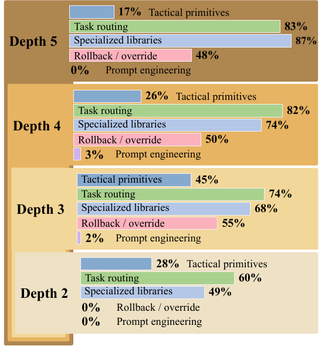

Figure 6(a)는 코드 기질(CO-Bench, AlphaEvolve Math, SR)의 깊이별 역할 비율이다. 분모는 깊이 2에서 5까지 각각 $n=68,125,72,23$개 산출물이다. Depth 5는 Tactical primitives 17%, Task routing 83%, Specialized libraries 87%, Rollback / override 48%, Prompt engineering 0%. Depth 4는 26%, 82%, 74%, 50%, 3%. Depth 3은 45%, 74%, 68%, 55%, 2%. Depth 2는 28%, 60%, 49%, 0%, 0%. 전술적 프리미티브가 깊이 3에서 정점을 찍은 뒤 특화 라이브러리에 자리를 내주고, 다시 쓸 프롬프트가 없으므로 프롬프트 엔지니어링은 내내 0에 가깝다.

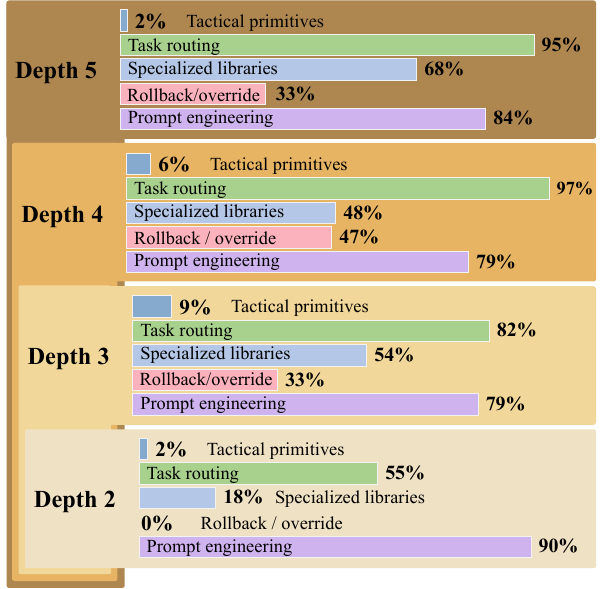

Figure 6(b)는 프롬프트 기질(Symptom2Disease, LawBench)이고 분모는 $n=51,78,108,63$이다. Depth 5는 Tactical primitives 2%, Task routing 95%, Specialized libraries 68%, Rollback / override 33%, Prompt engineering 84%. Depth 4는 6%, 97%, 48%, 47%, 79%. Depth 3은 9%, 82%, 54%, 33%, 79%. Depth 2는 2%, 55%, 18%, 0%(막대 없음), 90%. (a)의 거울상으로, 프롬프트 엔지니어링이 모든 깊이에서 포화하고 전술적 프리미티브는 9%를 넘지 않는다. 행동 표면이 텍스트이므로 $\Omega$는 거기서 일한다.

각 막대는 해당 깊이의 $n$개 산출물 중 두 평가자가 *모두* 그 범주에 배정한 비율이며, 깊이 2에서 5까지의 588개 산출물이 대상이다. 루브릭이 다중 레이블이라 한 깊이 안의 막대 합은 100%를 넘고, 서로 비교하기보다 깊이를 가로질러 비교해야 한다. 평가자가 갈린 산출물은 버리므로 모든 막대는 하한이다. 질량이 미미한 두 범주는 그림에서 생략했다.

루브릭의 일곱 범주는 (i) 환경 제약(예: 라이브러리 배제), (ii) 전술적 프리미티브(`local_search()` 같은 호출 가능한 라이브러리 함수), (iii) 태스크 범주 라우팅(태스크 유형이나 주제에 대한 `if/elif`), (iv) 특화 라이브러리(`geometry_utils()` 같은 태스크 유형별 헬퍼), (v) 프롬프트 엔지니어링 편집(역할, 언어, CoT 스캐폴딩), (vi) 롤백 또는 오버라이드("regress", "rollback", "over-constrain", "abandon"을 부르는 rationale 텍스트), (vii) 조합적 아키텍처(다중 함수 파이프라인)다. 596개 산출물은 CO-Bench, S2D, LawBench, AlphaEvolve Math, SR 프로덕션 아카이브에서 나왔고 깊이별로 119, 203, 180, 86, 8개(깊이 2~6)다. 생략된 두 범주 중 환경 제약은 깊이에 따라 감쇠하는 얕은 코드 현상이고(코드 기질 산출물의 깊이 2~5에서 13%, 11%, 3%, 9%, 즉 9, 14, 2, 2개), 조합적 아키텍처는 어디서나 14% 아래이며 깊은 코드 층에서의 겉보기 상승은 23개 중 3개 산출물에 기대고 있어서 저자들은 거기서 추세를 읽지 않는다. 두 헤드라인 패턴, 즉 교정 역할의 깊이 창발과 코드 대 텍스트 분화는 어느 한쪽 평가자만으로도 재현된다.

범주별 Cohen's $\kappa$는 다음과 같다.

| **Category**                | $\kappa$ |
|-----------------------------|----------|
| Task routing                | 0.96     |
| Prompt engineering          | 0.85     |
| Rollback / override         | 0.60     |
| Specialized libraries       | 0.57     |
| Environment constraints     | 0.45     |
| Tactical primitives         | 0.37     |
| Compositional architectures | 0.30     |
|                             |          |
| Mean over the 7 categories  | 0.59     |

### 깊이 2: 태스크를 가로질러 퍼지는 범용 프리미티브

CO-Bench에서 깊이 2의 산출물은 전적으로 범용적이다. 두 평가자 모두 그 12개의 d2 산출물 전부를 전술적 프리미티브로 표시한다(`local_search`, `simulated_annealing`, `normalize_label`, `safe_log`). Figure 6(a)의 더 낮은 28%는 깊이 2에서 라우팅이 더 잦은 다른 두 코드 아카이브에서 온 희석이다. CO-Bench 승리 솔버의 다수가 결국 이 프리미티브를 호출하며, 36개 중 22개의 승리 솔버가 $\Omega$가 내놓은 라이브러리 함수를 최소 하나 호출한다. 후보 하나에서 깊이 2에 처음 나온 `simulated_annealing`은 네 개 문제 계열에 걸쳐 36개 중 15개 승리 솔버로 퍼진다. 모든 사슬이 $d1\!\to\!d2$에서 개선되고(평균 상승 $+0.113$), 깊이 2만으로 사슬당 평균 3.7개의 기존 실패 태스크가 고쳐진다.

### 깊이 3: 특화와 층 간 간섭

깊이 3은 특정 태스크 계열을 겨냥한 특화 처방으로 기운다. 그리고 여기서 앞서 예상한 층 간 간섭이 처음 나타나는데, 한 계열에 맞춰진 처방이 다른 데서 잘 작동하던 가이던스를 덮어쓸 수 있기 때문이다. 코드 기질에서 d3 산출물의 68%가 특화 라이브러리를 싣고, 태스크 범주별 `if/elif` 라우팅은 여기서 데뷔하는 게 아니라 깊이에 따라 강해진다. 집계된 $d2\!\to\!d3$ 평균 상승은 $-0.006$에 불과하지만 태스크별 변동은 크다. (사슬, 태스크) 쌍의 41%가 깊이 3에서 엄밀히 퇴행하고 18%는 크게 떨어진다(d3 ${<}\,0.8\cdot$d2). `multi_demand_multidim_knapsack`에서 깊이 2의 "greedy + `local_search`"는 $0.0\!\to\!0.759$로 끌어올렸는데 깊이 3의 "group-transfer move가 붙은 `simulated_annealing`"은 $0.230$으로 퇴행시켰다. 깊이 4의 롤백 행동을 촉발하는 종류의 실패다.

### 더 깊은 층(4~6): 교정과 다듬기

깊이 $\geq 4$에서는 교정하고 다듬는 역할이 지속된다. 코드 기질에서 롤백 의도는 두 깊이 모두에서 산출물의 절반 근처를 유지하고 특화 라이브러리는 계속 오르며, 프롬프트 기질에서는 롤백이 깊이 4에서 정점을 찍는다. 따라서 더 깊은 층은 솔버를 재설계하는 게 아니라 앞선 층들을 교정하고 다듬는다. 깊이별 평균 점수는 깊이 3에서 $0.726$으로 정점을 찍고 깊이 6에는 $0.602$로 떨어지지만, 깊이별 평균은 아카이브가 최적화하는 양이 아니다. **깊은 층은 어떤 얕은 사슬도 닿지 못하는 태스크별 승리를 계속 만들어 낸다.** 깊이 ${\geq}4$ 후보가 CO-Bench 태스크의 31%, SR-matsci의 80%, SR-phys-osc의 70%를 이긴다. `constrained_guillotine_cutting`은 깊이 5에서 처음 열리고(모든 조상은 0점), 세 개의 matsci 태스크는 깊이 6에서 처음 열린다. 그러므로 아카이브는 (d3의 과잉 규정에 대비한) 얕은 대안과 드문 깊은 층 전문가를 함께 보존한다.

### 깊이 3의 퇴행을 구성상 막기

간섭은 깊이 4 이상에서 수리하는 대신 아예 예방할 수도 있다. 통합 모드에서는 각 후보가 하나의 초점 태스크를 개선하고 나머지에 대해서는 아카이브의 고정된 최고 trace를 상속받으므로 태스크별 최고 궤적이 구성상 단조다. 8개 태스크로 이뤄진 CO-Bench 대역(3 시드)에서 통합은 태스크별 최고를 $0.502$에서 $0.71\pm 0.02$로 끌어올리고, 연산량을 맞춘 best-of-4 대조군을 $+0.10$ 앞서며(95% CI $[+0.04,+0.16]$), 8개 태스크 중 8개에서 퇴행이 0이다. 연산량을 맞춘 대조군, 즉 표준 오케스트레이터 아래의 best-of-4 시드 재샘플링은 $0.61\pm 0.03$에 이른다. 더 이른 단일 시드 파일럿(6개 태스크 부분집합, 8세대, 로컬에서 서빙한 양자화 Gemma 백본)도 같은 무퇴행 거동을 보였다($0.502\to 0.685$, 대조군 $0.674$). 이 대역에서 통합은 평균 상승에서도 연산량 대조군을 이기지만($+0.10$, 0을 포함하지 않는 신뢰구간), 저자들은 주장의 근거를 궤적의 *모양*에 둔다. 가드 없는 오케스트레이터는 깊이 3 라우팅이 어긋날 때 쌍 수준에서 상당한 비율로 태스크별 퇴행을 만드는 반면 통합은 구성상 단조라 이미 푼 태스크를 결코 퇴행시킬 수 없다. 그러므로 이 가드는 그런 퇴행이 느린 평균 상승보다 비싼 배포 상황에서 가장 중요하다.

### 프레임워크는 보편적이고, 역할 진행은 적응한다

단일 $\Omega$ 템플릿이 여덟 벤치마크 전부에서 돌지만, 창발하는 역할 진행은 각 벤치마크의 실패 지형에 적응한다. 실패 양태가 다양한 곳(CO-Bench, SR-matsci, SR-phys-osc)에서 가장 뚜렷하고, 프롬프트만 있는 벤치마크(S2D, LawBench)는 행동 표면이 텍스트뿐이므로 모든 깊이에서 프롬프트 엔지니어링 공간 안에서 진행한다.

### 프레임워크가 값을 하는 곳과 못 하는 곳

Meta^(*n*)이 얼마나 얻는지는 벤치마크가 실패할 수 있는 방식이 얼마나 많은지를 따라간다. CO-Bench의 36가지 NP-hard 모양과 SR-matsci의 25개 서로 다른 법칙은 각각 직교하는 실패 양태를 여럿 제시하므로, 태스크 간 코드 라이브러리와 깊이별 특화가 겹쳐져 관찰된 가장 큰 마진을 만든다. TB2의 13개 샌드박스 범주와 AlphaEvolve Math의 수치-조합 혼합 태스크도 같은 식으로 행동한다. ARC-AGI-2가 극단적 사례로, 베이스라인은 거의 움직이지 않고 재귀만이 바닥을 넘는 유일한 항목을 만든다. S2D는 반대편 끝에 있어서, 작은 행동 표면(프롬프트 하나, 22개 레이블)이 두 백본 모두에서 OE 대비 Meta^(*n*)의 우위를 시드 잡음 이내로 묶어 둔다. dev에서 test로의 기울기도 같은 순서를 보인다. CO-Bench(dev $0.886$, test $0.870$)는 아카이브 구조를 held-out 태스크로 전이시키고, S2D(dev $0.887$, test $0.725$)는 프롬프트 재작성 계약이 단일 held-out 분포로 붕괴하면서 포화하며, ARC-AGI-2는 절대 수치가 떨어져도 바닥을 넘는 범주적 신호를 보존한다.

두 번째 조건은 시드와 천장 사이의 여유이고, 두 벤치마크가 그 한계에 놓인다. AlgoTune은 과잉 제약 사례로, 사전 최적화된 커널 계약이 $\Omega$가 더할 것을 거의 남기지 않아서 추가 맥락이 코드를 개선하기보다 조인다. 느려짐의 대부분은 벤치마크 전반에 퍼져 있다기보다 두 개의 FFT 커널에서 오므로, 이 진단은 단일 집계 수치에 기대는 대신 태스크 단위로 확인할 수 있다. SWE-Bench($B{=}K{=}2$, 3회 반복)에서는 시드가 이미 충분히 강해서 아카이브의 최고가 0세대 후보이고 $\Omega$는 아예 활성화되지 않는다. 따라서 $\Omega$의 값어치는 두 양, 즉 시드 위의 여유 공간과 아카이브가 색인할 수 있는 실패 양태의 다양성에 따라 커진다.

## ✂️ 소거 실험

*Table 3: Component ablations. Each row removes one mechanism and keeps the rest, and comparisons are like-for-like within a block.*

| **Condition** | **Removal** | **Score** | $\Delta$ |
|----|----|----|----|
| Meta^(*n*) (full; Gemma, CO) |  | 0.845 |  |
| $-$code library | $\mathcal{L}^{(d)}$ injection | 0.825 | $-0.020$ |
| $-$outer-context | inter-layer ctx_(*d*) | 0.751 | $-0.094$ |
| $-$recursion (depth-1) | meta-layer stacking | 0.714 | $-0.131$ |
|  |  |  |  |
| Meta^(*n*) (full; GPT-5.2, CO) |  | 0.886 |  |
| $-$recursion (depth-1) | meta-layer stacking | 0.806 | $-0.080$ |
|  |  |  |  |
| Meta^(*n*) (full; GPT-5.2, AE) |  | 0.917 |  |
| $-$recursion (depth-1) | meta-layer stacking | 0.759 | $-0.158$ |

**조건화가 지배적 채널이다.** 층 사이를 오가는 단 하나의 문자열인 inter-layer context를 제거하면 depth-1 베이스라인 대비 재귀 이득의 ${\sim}72\%$가 설명된다. 더 풍부한 코드 라이브러리 채널(호출 가능한 파이썬 함수)이 ${\sim}15\%$를 설명하고, 남은 ${\sim}13\%$는 재귀 기계장치 자체(beam, retry, inspiration)에서 온다.

depth-1 소거는 GPT-5.2에서 아카이브를 단일 층으로 접고 inter-layer context도, 코드 라이브러리 주입도, 재귀도 없앤 것이다. 시드당 $n_{\text{runs}}=4$회를 온도 $1.0$에서, 시드 42/43/44, 시드당 ${\sim}870$K 토큰으로 돌렸다. held-out 테스트 패스는 돌리지 않았으므로 Table 3의 depth-1 기준점은 archive-best 검증 점수(네 실행에 대한 태스크별 최고를 태스크 평균)이고, 같은 표의 full-stack 기준점과 같은 추정량이다.

### 재귀 대 평평한 대안들

베이스라인들은 아키텍처 수준의 소거 실험 역할도 겸하며 각각 아키텍처의 다른 조각을 제거한다. GA는 재귀를 없애고 평평한 자기수정을 택한다. 수정된 구성에서 $10\times$ 예산으로도 GPT-5.2 CO-Bench에서 $0.628$에 정체해 Meta^(*n*)의 $0.870$에 한참 못 미치는데, 이는 그 마진이 GA의 연산량이 아니라 아키텍처의 한계임을 뜻한다. OE는 탐색 루프는 유지하되 태스크별로 돌리므로, 두 백본에서의 CO-Bench 테스트 간격이 곧 태스크 간 전이의 값어치이며 CO-Bench에서는 연산량을 맞춘 조건에서, 프롬프트 벤치마크에서는 연산량을 캡한 조건에서 측정되었다. Meta^(*n*) 내부에서 depth-1 소거는 재귀만 제거한다. 그 상승은 백본과 벤치마크를 가로질러 재현되고(Gemma CO-Bench $+0.131$, GPT-5.2 CO-Bench $+0.080$, GPT-5.2 AE Math $+0.158$), 내부 루프의 천장이 낮아질수록 커지는데 이것이 이론이 예측한 바다.

소거 분해는 위층의 전략 문자열이 매 단계 아래층의 행동을 재형성하고, 이 조건화가 같은 층이 물려주는 호출 가능한 코드보다 더 많은 이득을 나른다고 말한다. 이것은 $\prod_{d}k_{d}$ 논변의 경험적 형태로 볼 수 있다. 깊이가 조건화로 커버리지를 곱하고, 아카이브가 그 커버리지를 태스크별 승리로 바꾸며(두 결과 표의 archive-over-chain 마진), 통합 연구는 그 승리들을 단조롭게 거둘 수 있음을 보인다.

## 💰 비용과 실행 규모

전체 진화 실행은 patience나 아카이브 포화로 종료되며 둘 다 사전에 한계가 지어지지 않는다. CO-Bench(36개 태스크)에서 single-shot 실행은 OpenRouter API를 구동하는 단일 머신에서 ${\sim}3$시간 걸리고, $\Omega$ 호출이 아니라 Layer-1 평가가 시간을 지배한다. agentic 변종은 ${\sim}10$시간 걸린다(태스크당 최대 8회 LLM 호출). TB2의 실제 소요 시간은 도커 시작 시간이 지배하며, 89개 태스크 agentic 실행은 ${\sim}28$시간이 걸렸다.

*Table 6: Per-row depth, archive size, and token spend for the seven Gemma benchmark families, including the four panels of Figure 4 (s42 production runs).*

| **Benchmark**            | **Mode**    | **Depth** | **Cands** | **Tokens** |
|--------------------------|-------------|-----------|-----------|------------|
| CO-Bench (36 tasks)      | Single-shot | 3         | 33        | 5.3M       |
|                          | Agentic     | 3         | 29        | 36.1M      |
|                          |             |           |           |            |
| Symptom2Disease          | Single-shot | 5         | 61        | 422K       |
|                          | Agentic     | 3         | 61        | 1.7M       |
|                          |             |           |           |            |
| LawBench (Chinese)       | Single-shot | 4         | 61        | 761K       |
|                          | Agentic     | 4         | 61        | 2.3M       |
|                          |             |           |           |            |
| TerminalBench 2.0 (89)   | Single-shot | 4         | 92        | 3.7M       |
|                          | Agentic     | 3         | 115       | 35.6M      |
|                          |             |           |           |            |
| AlphaEvolve Math (15/16) | Single-shot | 3         | 25        | 2.9M       |
|                          | Agentic     | 4         | 24        | 25.7M      |
|                          |             |           |           |            |
| Symbolic Regression (4)  | Single-shot | 3 to 6    | 97        | 12.1M      |
|                          | Agentic     | 3 to 4    | 100       | 21.7M      |
|                          |             |           |           |            |
| AlgoTune (8)             | Single-shot | 3         | 25        | 1.1M       |
|                          | Agentic     | 4         | 24        | 6.9M       |

베이스라인 구성(Gemma)은 이렇다. **Gödel Agent**는 20회 반복, max_val = 50, n_few_shot = 10, solve_timeout = 300초, Meta^(*n*)과 같은 베이스 모델. CO-Bench, Symptom2Disease, LawBench, AlphaEvolve Math, AlgoTune에서 돌렸다. TB2는 GA를 거기서 돌리려면 그 하네스를 상당히 바꿔야 해서 제외했고, SR 베이스라인은 GPT-5.2에서만 돌렸다. **OpenEvolve**는 세 개의 island, MAP-Elites 10$\times$10 특징 격자, OpenEvolve의 기본 온도 스케줄, 같은 베이스 모델. CO-Bench에서는 각 10회 반복의 독립적인 태스크별 진화 36개를 diff 기반 코드 편집으로 돌리고, Symptom2Disease와 LawBench에서는 태스크당 전체 재작성 프롬프트 진화 하나를 20회 반복 돌린다. GPT-5.2에서는 GA와 OE 모두 Gemma 하이퍼파라미터로 CO-Bench, Symptom2Disease, AlphaEvolve Math, SR, ARC-AGI-2에서 재실행했고(시드 42/43/44), 유일한 차이는 비용을 묶은 반복 상한이다. LawBench와 AlgoTune은 GPT-5.2에서 돌리지 않았다.

## 🛠️ 설계 근거

**모든 층에 같은 모델.** 베이스 솔버와 모든 $\Omega$ 호출에 같은 LLM을 쓴다(헤드라인 실행은 Gemma 4 31B-IT, 교차 모델 연구는 GPT-5.2). 이렇게 하면 *재귀*의 기여를 *모델 이질성*의 기여로부터 격리할 수 있어서, 깊이 $d$의 개선을 더 강한 개선자 탓으로 돌릴 수 없다. 이종 혼합(예: $\Omega$에 더 강한 모델)은 명백한 다음 단계지만 소거 실험을 교란할 것이다.

**패칭이 아닌 래퍼.** $\Omega$가 내놓은 코드는 비침습적 `MetaLayer` 래퍼로 주입되며, 이름 오버라이드를 제외하면 안쪽 솔버의 상태도, 태스크 객체도, 이전 층들의 라이브러리도 변이시킬 수 없다. 이것이 자기수정 에이전트가 자기 스캐폴딩을 망가뜨리는 부류의 버그를 배제한다(DGM §3에 보고되었고 Gödel Agent가 action API를 하드 가드한 계기가 된 실패 양태다).

**안전성과 샌드박싱.** 모든 $\Omega$ 생성 코드를 두 단계로 검증한다. *정적 분석*은 (1) `ast.parse`를 통한 구문 검사, (2) 위험한 import(os, subprocess, socket, sys 등)와 차단된 속성을 탐지하는 AST 순회, (3) 코드 길이 제한(10,000자). *스모크 테스트*는 코드 라이브러리 함수를 격리된 네임스페이스에서 exec해서 기대한 이름의 호출 가능 객체를 정의하는지 확인하며, 정의 시점에 죽는 함수(예: import 누락)는 솔버 스크립트 앞에 붙이지 않고 경고와 함께 건너뛴다.

**3:1 실패 편향 trace 비율.** 파일럿 로그에서 깊이 2와 3의 $\Omega$가 유용한 추론의 대부분을 실패 패턴 진단에 쓰고 성공 trace는 긍정 예시로만 기능한다는 게 나타났다. 10개 태스크 CO-Bench 파일럿에서 `failure_ratio`를 조정했는데, 0.5는 실패 신호를 희석하고 1.0은 긍정 예시를 없애 과적합된 제약을 만든다. 0.75가 긍정 예시의 역할을 보존하는 가장 작은 비율이었다.

**수렴 임계값 $\epsilon=0.02$.** 이 임계값 아래에서는 이득이 CO-Bench에서 이 베이스 모델의 단일 시드 실행 간 변동 안에 들어가므로 더 깊게 가는 것이 정당화되지 않는다. 진화 모드는 개선 없는 반복을 정의하는 데 같은 $\epsilon$을 쓰고, patience는 그런 반복이 $P$번 연속되면 발동한다.

**Beam 설정.** 부모들이 의미 있게 갈라지는 벤치마크(CO-Bench, AlphaEvolve Math, AlgoTune, SR)에는 $B=K=2$(교차 수분을 허용하는 가장 작은 beam)를 쓴다. 분류(S2D, LawBench)는 $B=1,K=3$, TB2는 $B=1,K=2$를 쓰는데, 프롬프트만 있거나 샌드박스에 묶인 벤치마크는 넓은 부모 beam에서 덜 얻기 때문이다. 더 큰 beam은 토큰 비용을 선형으로 늘릴 뿐, 아카이브가 어떤 단일 사슬보다도 태스크별 여유를 연다는 질적 발견을 바꾸지 않는다.

**실용적 깊이.** 가장 성능이 좋은 사슬은 깊이 3에서 6에 걸친다(대부분의 벤치마크에서 3~4에 평탄, matsci symbolic regression에서 깊이 6). 최적 깊이는 실패 양태 다양성을 따라간다. 두 개의 천장은 검증되지 않은 채 남아 있다. 더 높은 메타 레벨에서의 모델 추론 능력, 그리고 누적된 층 코드에 의한 컨텍스트 윈도 포화다.

**진화적 아카이브의 값어치.** 아카이브는 깊이와 품질을 분리하고(깊이 2 후보가 깊이 3을 이길 수 있다) 후보 간 전략 전이를 가능하게 한다. 이 둘이 함께 어떤 단일 사슬 너머의 태스크별 여유를 연다.

### $\Omega$가 삼키는 payload는 깊이에 따라 달라진다

$\Omega$의 LLM 호출 템플릿(시스템 프롬프트, 출력 스키마, 파싱)은 모든 깊이에서 동일하고, 오직 삼키는 trace payload만 가용 신호에 적응한다. 각 호출은 3:1 실패-성공 비율로 뽑은 최대 20개의 trace를 본다(컨텍스트 윈도의 65%를 trace에, 35%를 이전 코드 스택에 예약하며, 넘치면 가장 오래된 층부터 버린다).

깊이 $\leq 2$에서 payload는 태스크별로 포맷된 raw trace에 개선/퇴행 태스크를 표시하는 베이스라인 비교 플래그를 더한 것이다. 각 trace는 생성된 스크립트, stdout/stderr(500자로 절단), exit code, 오류 요약, 평가자 피드백 문자열을 담는다.

깊이 $\geq 3$에서는 raw trace가 구조화된 요약으로 대체된다. (1) 태스크 범주별 성능 분해, (2) 실패 패턴 분포, (3) 이전 층의 기여를 격리하기 위해 깊이 $d{-}2$에 대비해 측정한 효과 분석, (4) 대표 trace 세 개. 진화 모드에서는 퇴행한 태스크에 아카이브의 태스크별 최고가 추가로 주석되어 $\Omega$에게 명시적인 개선 천장을 준다.

따라서 이 깊이 인지 포매터는 $\Omega$ 위에 있는 콘텐츠 어댑터이지 별개의 드라이버가 아니다. 깊이가 자라도 $\Omega$의 프롬프트 템플릿과 출력 파서는 바뀌지 않는다.

### 깊이 2에서 주입된 코드 전문

파일럿 실험에서 $\Omega$가 깊이 2에 생성한 전처리 코드 전문은 다음과 같다.

```
# Address "No module named ’scipy’" and timeout patterns.
additional_context = """
### IMPORTANT ENVIRONMENT RESTRICTIONS:
1. EXTERNAL LIBRARIES: Do NOT use ‘scipy‘ or any
   third-party libraries except for ‘numpy‘. If you need
   linear programming, assignment algorithms (like
   Hungarian), or optimization solvers, you MUST implement
   them from scratch using pure Python or ‘numpy‘.
2. PERFORMANCE: Avoid nested loops over large coordinate
   ranges. Use coordinate compression, event-based
   processing, or greedy heuristics with sparse data
   structures to avoid Timeouts.
3. VALIDATION: Ensure that all output indices strictly
   match the indexing requirements specified in the task
   description.
"""
```

실패 trace 분석으로부터 $\Omega$가 자동 생성한 이 코드 한 조각이 10개 태스크 중 4개에서 가장 흔한 실패 양태를 막아 평균 점수를 0.439에서 0.513으로(상대 +16.9%) 개선했다.

## 📐 부록 상세 결과

### Symbolic Regression 도메인별 분해

Gemma 프로덕션 실행에서 single-shot은 `chem_react`와 `phys_osc`에서 archive-best를 이기는데, 이 둘은 시드가 강해서 여유가 제한적이다. agentic은 `bio_pop_growth`, `matsci`, 그리고 계열 평균을 이긴다. GPT-5.2에서는 Meta^(*n*)이 두 베이스라인 상대로 모든 도메인을 앞선다. Gödel Agent의 큰 표준편차(예: `chem_react` $2.92\pm 3.84$)는 단 한 번의 자기수정이 솔버를 퇴행시키는 시드 수준 붕괴에서 온다.

*Table 8: Symbolic Regression per-domain results (Gemma, s42 production runs), backing the Symbolic Regression row of Table 6. Domains: bio_pop_growth (biological population dynamics), chem_react (chemical reaction kinetics), matsci (materials science properties), phys_osc (physical oscillator systems). Bottom block gives the family mean (Tokens summed across the four runs; other columns averaged). Bold = higher archive-best per domain.*

| **Domain** | **Mode** | **Seed** | **Linear-best** | **Archive-best** | **Depth** | **Cands** | **Tokens** |
|----|----|----|----|----|----|----|----|
| bio_pop_growth (24 inst.) | Single-shot | 0.477 | 2.751 | 3.782 | 3 | 25 | 2.6M |
|  | Agentic | 2.355 | 4.406 | **4.977** | 3 | 25 | 5.2M |
|  |  |  |  |  |  |  |  |
| chem_react (36 inst.) | Single-shot | 5.458 | 6.580 | **7.599** | 3 | 25 | 2.6M |
|  | Agentic | 5.587 | 6.440 | 7.244 | 3 | 25 | 2.7M |
|  |  |  |  |  |  |  |  |
| matsci (25 inst.) | Single-shot | 0.000 | 1.273 | 2.130 | 6 | 23 | 3.9M |
|  | Agentic | 1.477 | 3.296 | **3.863** | 3 | 25 | 6.7M |
|  |  |  |  |  |  |  |  |
| phys_osc (44 inst.) | Single-shot | 2.686 | 4.191 | **4.681** | 4 | 24 | 3.0M |
|  | Agentic | 3.114 | 3.573 | 4.514 | 4 | 25 | 7.1M |
|  |  |  |  |  |  |  |  |
| *Mean across 4 domains* | Single-shot | 2.155 | 3.699 | 4.548 | n/a | n/a | 12.1M |
|  | Agentic | 3.133 | 4.429 | **5.149** | n/a | n/a | 21.7M |

*Table 9: Symbolic Regression per-domain comparison under GPT-5.2 (agentic archive-best, mean $\pm$ stdev over seeds 42/43/44).*

| **Domain**     | **Meta^(*n*)**      | **OpenEvolve**  | **Gödel Agent** |
|----------------|---------------------|-----------------|-----------------|
| bio_pop_growth | **4.35 $\pm$ 0.30** | 2.83 $\pm$ 0.08 | 2.68 $\pm$ 0.83 |
| chem_react     | **7.65 $\pm$ 0.07** | 6.96 $\pm$ 0.08 | 2.92 $\pm$ 3.84 |
| matsci         | **3.26 $\pm$ 0.67** | 1.37 $\pm$ 0.34 | 1.27 $\pm$ 0.67 |
| phys_osc       | **4.85 $\pm$ 0.11** | 3.63 $\pm$ 0.15 | 2.93 $\pm$ 2.03 |
|                |                     |                 |                 |
| Mean           | **5.03 $\pm$ 0.20** | 3.70 $\pm$ 0.13 | 2.45 $\pm$ 1.63 |

### AlgoTune 태스크별 분해

역전은 두 개의 FFT 커널에서 가장 크고, 이 둘만으로 공유된 일곱 태스크에서 잃은 총 속도 향상 17.55 중 11.08을 설명한다. 두 태스크가 agentic에서 속도 향상의 3분의 1에서 절반을 더 잃고(psd_cone_projection 5.54 → 3.74, affine_transform_2d 2.00 → 1.05), 나머지 셋은 거의 동등하다. single-shot 실행에서는 깊이 2의 규정적 힌트가 `fft_convolution`을 $1.11\times$로 퇴행시켰는데, 깊이 3의 rationale이 원인을 메모리 연속성 제약 누락으로 진단하고 $9.72\times$로 수리했다. agentic 실행은 같은 커널을 끝내 회복하지 못했다. 이것이 과잉 제약 진단의 태스크 수준 증거다.

*Table 10: AlgoTune per-task speedups ($\times$, s42). The seven tasks solved by both variants. The eighth task, eigenvectors_complex, has a per-task log only in the agentic run ($\times 1.11$), so the single-shot aggregate ($\times 18.47$) averages seven tasks and the agentic aggregate ($\times 14.11$) averages eight; on the matched seven the agentic mean is $\times 15.96$.*

| **Task**                | **Single-shot** | **Agentic** |
|-------------------------|-----------------|-------------|
| convolve2d_full_fill    | 105.37          | 101.79      |
| fft_convolution         | 9.72            | 1.69        |
| fft_cmplx_scipy_fftpack | 4.17            | 1.12        |
| psd_cone_projection     | 5.54            | 3.74        |
| affine_transform_2d     | 2.00            | 1.05        |
| lu_factorization        | 1.47            | 1.34        |
| polynomial_real         | 1.03            | 1.02        |

## 📚 선행 연구 속에서의 위치

**단일 층위 자기개선과 최적화.** 단일 피드백 루프 시스템(Self-Refine [Madaan et al., 2023], Reflexion [Shinn et al., 2023], Self-Debugging [Chen and others, 2024], RISE [Qu et al., 2024])은 생성·평가·반성·재시도를 한다. 진화적 접근은 집단을 유지한다. FunSearch [Romera-Paredes et al., 2024]는 island 기반 루프에서 얼린 LLM과 평가자를 짝짓고, AlphaEvolve [Novikov et al., 2025]와 OpenEvolve [Sharma, 2025]는 이를 코드베이스 전체로 일반화하며, Evolution of Heuristics [Liu et al., 2024]는 자연어 "생각"과 코드를 공진화시키고, ReEvo [Ye et al., 2024]는 "언어적 gradient"를 도입한다. 아키텍처 탐색 시스템(ADAS [Hu et al., 2025], AgentSquare [Shang et al., 2025], AFlow [Zhang et al., 2025b])은 아카이브로부터 새 에이전트를 프로그램하거나 코드 워크플로 위에서 MCTS를 돌린다. 이 모두가 *단일 추상화 층위*에서 작동하며, 생성하고 변이시키고 탐색하는 메커니즘 자체는 고정되어 있다. 비평가는 결코 비평받지 않고, 진화 루프는 자기 선택 규칙을 결코 진화시키지 않는다.

**자기참조 에이전트.** 슈미트후버(Schmidhuber, 2003)의 괴델 머신이 증명 가능하게 자기개선하는 에이전트의 이론적 토대를 제공한다(형식적 증명 요구사항이 실용성을 제한한다). STOP [Zelikman et al., 2024]은 재귀적 스캐폴딩 개선을 시연하지만 단일 메타 스텝만 실현한다. Gödel Agent [Yin et al., 2024]는 자기 소스 코드를 다시 쓰고, Darwin Gödel Machine [Zhang et al., 2025a]은 진화적 집단 유지와 자기참조적 수정을 결합해 SWE-bench에서 50%에 이르며, HyperAgents [Zhang et al., 2026]는 태스크 에이전트와 메타 에이전트를 단일 편집 가능 프로그램으로 병합한다. EvoX [Liu et al., 2026]는 진화적 프로그램 탐색을 탐색 연산자 자체가 진화하는 메타 진화 체제로 확장한다. 이 모두가 안정성을 위해 최소 한 개의 드라이버 층을 고정하기 때문에 경험적으로 최대 $\sim$2.5 메타 레벨만 실현한다. Gödel Agent의 action API와 목표 프롬프트는 하드 가드되어 있고, DGM은 "아카이브 유지와 부모 선택 ... 은 고정이며 DGM이 수정할 수 없다"고 명시하며(§3), HyperAgents는 내부 루틴 편집은 허용하되 외부 선택·평가 루프는 "변경될 수 없다"(§7)고 한다. 이 분수는 솔버 수정(레벨 1)과 수정 논리 자체의 수정(레벨 2, 그 논리가 편집 대상 소스 안에 살기 때문)은 온전히 실현되는 반면 그 위의 모든 레벨은 기계장치 중 편집 가능한 부분에서만 바뀌고 얼어붙은 드라이버에서는 결코 바뀌지 않아 최대 반쪽 점수만 받는다는 사정을 반영한다.

**메타 스캐폴딩.** Meta-Harness [Lee et al., 2026]는 이전 후보들의 소스·점수·trace 전체 이력을 코딩 에이전트에 노출($\sim$10M 토큰의 진단 맥락)해서 LLM 주변 코드 인프라를 최적화한다. PromptBreeder [Fernando et al., 2024]는 태스크 프롬프트와 변이 프롬프트를 함께 진화시키고(프롬프트 공간에서의 2층 자기참조), GEPA [Agrawal et al., 2026]는 반성적 프롬프트 진화만으로 RL 파인튜닝을 능가할 수 있음을 보이며, LWE [Jwa et al., 2026]는 평가자 자신에게 반성적 루프를 적용해 LLM 판정자를 레이블 없이 평가하며 개선한다. 이들은 드라이버를 편집 가능 표면 바깥에 두거나(Meta-Harness), 최대 두 개의 메타 스텝만 실현하거나(PromptBreeder), 코드 공간이 아니라 프롬프트 공간에서 작동한다.

**Meta^(*n*)이 더하는 것.** 이 구조적 재구성은 네 가지 이점을 낳는다. (i) 역할이 뭉개지는 대신 층화된 위계, (ii) $\sum_{d=2}^{n}k_{d}$가 아니라 $\prod_{d=2}^{n}k_{d}$의 조합적 커버리지 — 각 $\Omega$ 층이 아래 모든 층의 실행을 재형성하기 때문, (iii) 손으로 정한 $T$나 무한정 아카이브 성장이 아니라 수렴을 통한 창발적 깊이, (iv) 벤치마크별 프롬프트나 연산자 탐색이 아니라 여덟 개의 이질적 벤치마크를 가로지르는 단일 $\Omega$ 프롬프트 템플릿(오케스트레이션 하이퍼파라미터는 벤치마크별로 조정). 경험적으로 2에서 6에 걸친 실현 깊이와 창발적 역할 특화(깊이 2에서 태스크를 가로질러 퍼지는 범용 프리미티브, 깊이 3의 태스크 인지 라우팅, 더 깊은 층의 특화와 롤백)가 저자들이 아는 한 메타 깊이 $>\!2$가 중복된 층이 아니라 구조적으로 구별되는 층을 만든다는 첫 시연을 제공한다.

## 🚧 저자들이 밝힌 한계와 후속 방향

베이스 솔버와 모든 $\Omega$ 호출에서 같은 모델을 돌린다. 깊이 이득과 능력 이득을 분리하는 데는 맞는 통제지만, 더 강한 모델이 $\Omega$ 자리에 앉고 그 아래에 더 약한 베이스가 놓이는 실용적 배포 상황은 검증되지 않은 채 남는다. 개선자만 업그레이드했을 때도 깊이가 계속 값을 하는지가 자연스러운 다음 실험이다.

또한 코드 전이가 아니라 조건화가 상승분의 대부분을 나르므로, 층 사이에 오가는 맥락을 더 풍부하게 만들 수 있을 것이다. 예를 들어 자유 형식 문자열을 구조화되거나 타입이 붙은 표현으로 바꾸는 식이다.

또 다른 방향은 스택이 얼마나 깊이까지 유용하게 갈 수 있는지를 조사하는 것이다. 실행이 깊이 3과 6 사이에서 멈추는 이유는 $\Omega$가 개선을 더 찾지 못하기 때문이지, 베이스 모델이 더 높은 메타 레벨에서 추론 능력을 소진하거나 누적된 층 코드로 컨텍스트가 차기 때문이 아니라고 관찰된다.

## 🧐 노트 작성자의 관찰

Table 3의 소거 실험 기준점(Gemma CO 0.845, GPT-5.2 CO 0.886, GPT-5.2 AE 0.917)은 archive-best **검증** 점수인데, Table 1과 2의 CO-Bench 값(0.851, 0.870)은 held-out **테스트** 점수다. 본문은 두 표를 나란히 인용하면서 이 추정량 차이를 명시적으로 정렬해 주지 않는다. GPT-5.2 CO-Bench의 dev 0.886과 test 0.870이 각각 어느 표의 어느 칸에 대응하는지는 "프레임워크가 값을 하는 곳" 절의 dev-to-test 기울기 서술로부터만 재구성된다.

"$+0.168$ 마진"이 Table 2에서 archive-best 0.870과 OpenEvolve 0.702의 차이임은 계산으로 확인되지만, 논문은 이 마진과 비교되는 Meta^(*n*) 추정량이 archive-best라는 점을 headline 문장 안에서 밝히지 않는다. best chain 0.806으로 재면 마진은 그보다 작다.

Figure 6의 창발 역할 분석은 두 LLM 평가자의 합의에만 기대며, 인간 주석과의 대조는 보고되지 않는다. 논문 스스로 가장 추상적인 두 범주의 $\kappa$가 $0.37$·$0.30$이라고 적고 있고, 합의 방식이 모든 막대를 하한으로 만든다고 밝히지만, 두 평가자 중 하나(GPT-5.2)가 실험의 백본이기도 하다는 점이 평가에 어떤 영향을 주는지는 다루어지지 않는다.

SWE-Bench에서 $\Omega$가 아예 활성화되지 않았다는 결과는 본문 한 문장으로만 보고되고 표에는 나타나지 않는다. 실행 규모($B{=}K{=}2$, 3회 반복)가 다른 벤치마크의 설정보다 작은데, 논문은 이 작은 규모가 결과에 어떤 영향을 주는지 논하지 않는다.

"실현된 메타 깊이 ${\sim}2.5$"라는 선행 연구 특성화는 저자들이 정의한 반쪽 점수 규약에 의존한다. 이 규약은 부록에서 근거가 제시되지만, 선행 연구들 자신이 채택한 척도는 아니다.
