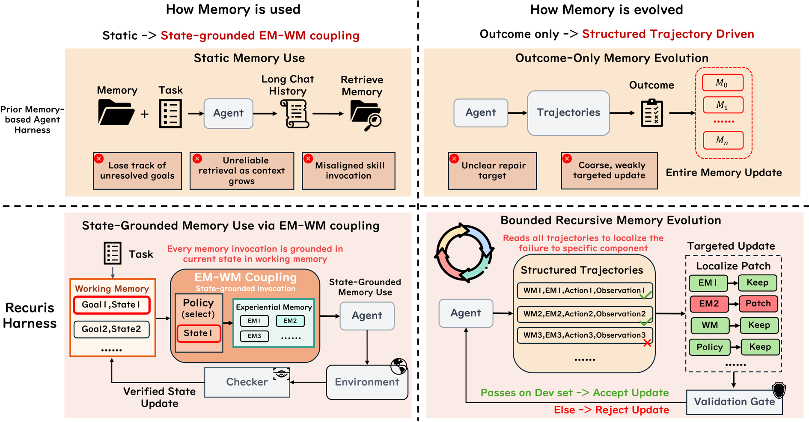
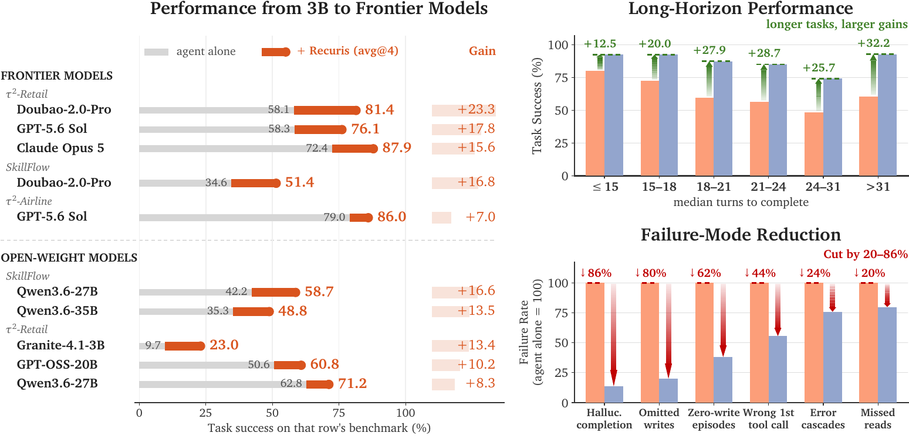
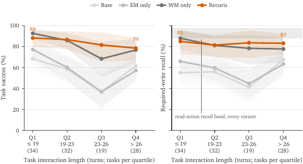
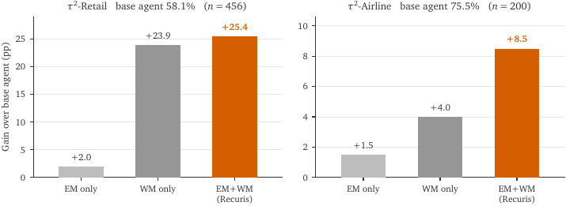
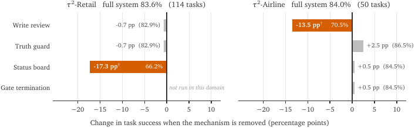
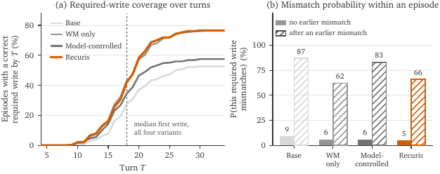
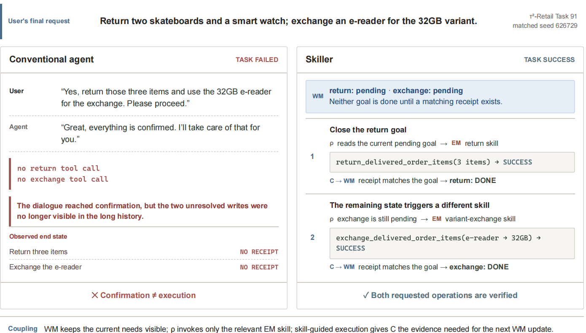
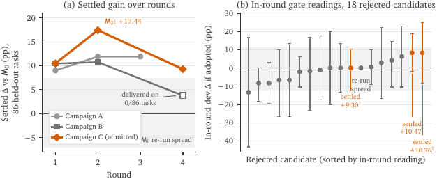
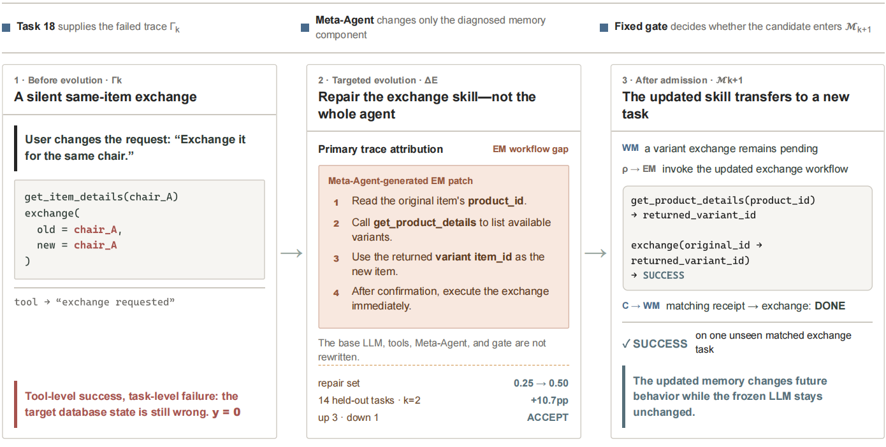

# 🖇️긴 호라이즌 에이전트 하니스를 위한 재귀적 경험–작업 기억 진화

## 🎯 긴 호라이즌에서 재귀적 자기개선이 막히는 지점

LLM 에이전트의 능력은 점점 **에이전트 하니스(agent harness)**를 통해 매개된다. 하니스는 모델 주위에서 메모리, 스킬 호출, 태스크 상태 추적, 도구 상호작용, 검증을 조율하는 외부 실행 계층이다. 그런데 **재귀적 자기개선(recursive self-improvement, RSI)**은 여전히 근본적인 난제로 남아 있고, 특히 목표·관측·실패가 실행 내내 계속 변하는 **긴 호라이즌 태스크(long-horizon task)**에서 그렇다. 이런 환경에서 유능한 하니스는 고정된 도구나 메모리를 제공하는 것 이상을 해야 한다. 현재 태스크 상태를 정확히 파악하고, 새 요구가 생길 때 적절한 경험을 호출하고, 실행 실패를 이후 행동에 영향을 주는 개선으로 바꿔야 한다. 그러나 상호작용 히스토리가 길어지면 에이전트는 해결되지 않은 목표를 놓치고, 현재 태스크 상태와 더 이상 맞지 않는 스킬을 호출하곤 한다. 즉 에이전트는 경험을 쌓을 수 있지만, 하니스가 그 경험을 조직하고 선택하고 개선하는 메모리 메커니즘 자체는 대체로 고정된 채로 남는다.

기존 경험 기억(experiential memory) 방법은 초기 지시나 전체 상호작용 히스토리로부터 스킬을 검색해 이 한계를 다루려 한다. 그러나 실행이 진행될수록 그런 검색은 점점 신뢰하기 어려워진다. 초기 지시는 현재 문제를 더 이상 반영하지 못할 수 있고, 커지는 컨텍스트는 낡은 정보, 이미 끝난 단계, 미해결 요구, 실행 잡음을 뒤섞는다. 그래서 중심 한계는 쓸모 있는 경험이 없다는 것이 아니라, 저장된 경험을 에이전트의 현재 실행 필요와 계속 정렬시켜 줄 **간결하고 신뢰할 수 있는 태스크 상태**가 없다는 것이다.



그림 2는 Recuris가 기존 메모리 기반 하니스와 갈라지는 두 가지 전환을 4분면으로 대비한다. 왼쪽 위는 "메모리를 어떻게 쓰는가"로, 정적 사용에서 상태에 근거한 EM–WM 결합으로의 전환이다. 기존 하니스는 `Memory + Task → Agent → Long Chat History → Retrieve Memory` 흐름을 돌면서 미해결 목표를 놓치고, 컨텍스트가 커질수록 검색이 불안정해지며, 스킬 호출이 어긋난다. 오른쪽 위는 "메모리를 어떻게 진화시키는가"로, 결과(outcome)만 보는 방식에서 구조화된 궤적 기반으로의 전환이다. 기존 방식은 `Agent → Trajectories → Outcome → M₀, M₁, …, Mₙ`처럼 메모리 전체를 갱신하므로 수리 대상이 불분명하고 갱신이 거칠다. 왼쪽 아래는 Recuris 하니스로, 작업 기억이 `Goal1,State1`, `Goal2,State2` 같은 항목을 들고 EM–WM 결합에 들어가 정책이 상태에 맞는 경험 기억 항목을 고르며, 환경 응답을 체커가 받아 검증된 상태 갱신을 작업 기억으로 돌려보낸다. 오른쪽 아래는 유계 재귀 진화로, `WMₜ, EMₜ, Actionₜ, Observationₜ` 행으로 구성된 구조화 궤적을 읽어 실패를 특정 구성요소로 국소화하고(`EM1 → Keep`, `EM2 → Patch`, `WM → Keep`, `Policy → Keep`), 검증 게이트가 dev 집합 통과 여부로 채택·기각을 결정한다.

## 🧩 핵심 주장: 작업 기억이 빠져 있던 상태 표현이다

**작업 기억(Working Memory, WM)**이 그 빠진 상태 표현을 제공한다. WM은 에이전트의 현재 진행과 미해결 목표를 계속 추적하고, 그것을 써서 **경험 기억(Experiential Memory, EM)**에서 가장 적절한 스킬을 고른다. 스킬이 실행된 뒤에는 환경 피드백이 진행을 검증하고 WM을 갱신한다. 이렇게 **태스크 상태 → 스킬 선택 → 실행 피드백 → 갱신된 태스크 상태**의 닫힌 루프가 생긴다. 이 **경험–작업 기억 결합(EM–WM Coupling)**은 하니스에 상태를 가진 메모리 제어 계층을 주고, 스킬 호출을 전체 상호작용 히스토리가 아니라 현재 태스크에 근거하게 만든다. WM이 지금 무엇이 필요한지 정하고, EM이 그에 대응하는 재사용 가능한 경험을 대고, 검증된 피드백이 이후 결정을 실제 실행 진행 위에 놓는다.

이 결합은 **메모리 진화**를 위한 구조화된 기반이기도 하다. 기존 접근은 주로 최종 성공/실패에서 배운다. 그런 신호는 무언가 잘못됐다는 것은 알려주지만, 가장 효과적인 수리가 저장된 스킬에 있는지, 추적되는 태스크 상태에 있는지, 스킬 호출 메커니즘에 있는지, 진행 검증기에 있는지는 거의 알려주지 않는다. 결과적으로 메모리 갱신이 거칠거나 표적성이 약해진다. EM–WM 결합은 태스크 상태, 선택된 스킬, 행동, 실행 결과를 명시적으로 연결함으로써 하니스 실행을 "메모리가 행동에 어떻게 영향을 주었는가"에 대한 구조화된 증거로 바꾼다. 그래서 실패한 궤적을 특정 메모리 구성요소로 국소화할 수 있고, 메모리 시스템 전체를 다시 쓰는 대신 범위가 좁혀진 수리가 가능해진다. 접근의 핵심 논리는 **EM–WM 결합 → 구조화된 증거 → 실패 국소화 → 표적화된 메모리 진화**다.

이 통찰 위에 **Recuris**를 제안한다. 태스크 내부에서는 WM이 검증된 태스크 상태를 유지하고 그 상태로 EM에서 가장 적절한 스킬을 호출한다. 태스크 간에는 고정된 *Meta-Agent*가 구조화된 실행 트레이스를 분석해 효과적인 수리를 줄 가능성이 가장 높은 메모리 구성요소를 짚고 국소적 갱신을 제안한다. 후보 갱신은 고정된 검증 절차를 통과한 뒤에만 반영된다. 갱신된 Skill Memory는 이후 태스크에서 하니스 행동을 바꾸고, 새로운 상태·스킬 호출·실행 증거를 만들어 다음 갱신을 뒷받침한다. 즉 Recuris는 **유계이고 검증 게이트가 걸린 재귀 루프**를 이룬다. 기저 LLM과 외부 개선 절차는 고정된 채이고, 재귀는 하니스의 외재화된 메모리 제어 계층 안에서만 일어난다.

논문이 정리한 기여는 네 가지다. 첫째, 진화하는 태스크 상태가 축적된 경험과 현재 실행 필요 사이의 지속적 정렬을 요구하는 긴 호라이즌 하니스에서 **상태에 근거한 메모리 사용**이 RSI의 핵심 요건임을 확립한다. 둘째, 지속적 경험과 동적으로 유지되며 증거에 근거한 태스크 상태를 결합해 긴 호라이즌 실행 내내 적응적 스킬 호출을 가능하게 하는 **Recuris**를 제안한다. 셋째, EM–WM 결합이 하니스 실행을 **구조화된 진단 증거**로 바꿔 구성요소 수준 실패 국소화와 표적화된 진화를 가능하게 함을 보인다. 넷째, 네 개 벤치마크와 열 개 모델에서 실행 신뢰성, 스킬 호출, 실패 국소화, 진화 안정성, 진화된 메모리의 태스크 간 전이를 연구한다.

## 🏗️ Skill Memory 구조와 태스크 내 실행 루프

동결된 LLM $\pi_{\theta}$와 도구 집합 $\mathcal{T}$ 위에 하니스를 세운다. 태스크 $x$가 주어지면 에이전트는 단계 $t$에서 상호작용 히스토리 $h_{t}$와 작업 상태 $w_{t}$를 유지한다. 호출 정책이 경험 스킬 집합 $\mathcal{E}_{t}$를 고르고, 그다음 LLM이 행동을 내고 환경 관측을 받는다.

$$a_{t}\sim\pi_{\theta}(\cdot\mid x,h_{t},w_{t},\mathcal{E}_{t}),\qquad o_{t}=\operatorname{Env}(a_{t};\mathcal{T}).$$ (1)

여기서 $a_{t}$는 사용자 대상 메시지이거나 도구 호출이고, $\operatorname{Env}$는 다음 사용자 응답 또는 $\mathcal{T}$ 안 도구의 결과를 돌려준다. 한 번의 실행은 원시 궤적 $\tau=\{(a_{t},o_{t})\}_{t=1}^{L}$과 태스크 결과 $y\in\{0,1\}$을 만든다. Recuris는 $\theta$를 고정한 채, 식 (1)을 조건짓는 외부 메모리 제어 메커니즘을 갱신하는 방식으로 미래 하니스 행동을 바꾼다.

진화 라운드 $k$에서 Skill Memory는 네 구성요소로 표현된다.

$$\mathcal{M}_{k}=\left(\mathcal{E}_{k},\mathcal{W}_{k},\rho_{k},\mathcal{C}_{k}\right).$$ (2)

경험 기억 $\mathcal{E}_{k}$는 재사용 가능한 스킬을 agent-skill 형식(Anthropic, 2025)으로 저장한다. 작업 기억 명세 $\mathcal{W}_{k}$는 태스크별 인스턴스 $w_{t}$를 유지하는 데 쓰이는 상태 스키마와 갱신 제안을 정의한다. 호출 정책 $\rho_{k}$는 어떤 실행 이벤트에서 스킬을 검색할지, 그리고 $\mathcal{E}_{k}$의 어떤 항목이 컨텍스트에 들어갈지 정한다. 체커 집합 $\mathcal{C}_{k}$는 관측이 제안된 상태 변화를 뒷받침하는지 검사한다. 이 넷이 하니스의 **진화하는 메모리 제어 계층**이자 Recuris의 패치 공간이다. 후보 패치는 Meta-Agent의 진단이 지목한 구성요소를 모두 수정하고 나머지는 그대로 복사하므로, 범위 제한은 라운드 단위가 아니라 편집 단위로 강제된다. 한 라운드가 여러 구성요소를 건드릴 수는 있지만, 각 편집은 진단된 실패 하나에 묶이고 그 실패가 귀속된 구성요소 안에 갇힌다.

외부 개선 절차는 고정된 채로 남는다. 기저 LLM, 도구, Meta-Agent, 국소화·패치 절차, 검증 게이트, 그리고 메모리 제어 계층 바깥의 하니스 메커니즘은 라운드 간에 바뀌지 않는다.


그림 3은 Recuris 전체를 두 패널로 보여준다. (a) 태스크 내부: `Task x`("다음 주 수요일 항공편을 금요일로 옮겨 달라, 예약번호 XYZ123")가 작업 기억 $w_t$로 들어가 `Goal1: Change Flight (XYZ123) / State 1: Pending`, `Goal2: Delay Compensation / State 2: Authorized`를 담고, 호출 정책 $\rho$가 "현재 단계는 Goal 1, 미해결"이라 판단해 change flight용 스킬을 검색한다. 경험 기억 $\varepsilon$의 세 항목 가운데 `ε2 fare_class_policy`("basic-economy 티켓은 변경할 수 없다")가 매칭되어 검색되고, 에이전트가 $a_t$를 환경에 보내면 관측 $o_t$("항공사 정책상 basic-economy 티켓은 변경할 수 없다")가 돌아오며, 체커 $\mathcal{C}$가 "$o_t$를 목표 술어에 비추어 검증하고 뒷받침되는 변화만 커밋"해 검증된 상태 갱신을 작업 기억으로 되돌린다. (b) 태스크 간: 진단된 궤적에서 Step k+2, k+3이 실패로 표시되고, 각각 "상태에 맞지 않는 EM", "WM에 귀속된 실패"로 주석된다. Meta-Agent가 구성요소별 패치를 만들어 WM은 WM′로, EM k+2는 EM′ k+2로 바꾸고 Policy와 Checker는 손대지 않는다. 후보는 held-out dev 집합과 이전 궤적 양쪽 검사를 받아, 통과하면 $\mathcal{M}_{k+1} = \mathcal{M}_k \oplus \Delta\mathcal{M}$, 아니면 $\mathcal{M}_{k+1} = \mathcal{M}_k$가 된다.

두 루프를 잇기 위해 라운드 $k$에서 구조화된 실행 트레이스를 기록한다.

$$\Gamma_{k}=\left(x_{k},\left\{w_{t},\mathcal{E}_{t},a_{t},o_{t},\widetilde{w}_{t+1},c_{t},w_{t+1}\right\}_{t=1}^{L_{k}},y_{k}\right),$$ (3)

여기서 $\widetilde{w}_{t+1}$은 제안된 상태이고 $c_{t}$는 단계 $t$ 뒤에 내려진 체커 결정을 담는다. 원시 궤적 $\tau$와 달리 $\Gamma_{k}$는 각 행동과 관측을 스킬 호출을 촉발한 상태, 제안된 상태 갱신, 그리고 그 갱신을 받아들이거나 거부하는 데 쓰인 증거에 연결한다.

### 🧭 구조화된 작업 상태

실행 하니스는 명세 $\mathcal{W}_{k}$ 아래에서 태스크로부터 $w_{0}$를 초기화한다. 각 목표 항목은 내용, 상태, 뒷받침 증거, 그리고 선택적 blocker를 기록한다. 상태는 `pending`, `done`, `blocked` 중 하나이고, 초기 환경 상태가 이미 완료 증거를 주지 않는 한 목표는 `pending`으로 시작한다. 그래서 단계 $t$에서 $w_{t}$는 무엇이 끝났고 무엇이 미해결이며 어떤 관측이 기록된 진행을 뒷받침하는지를 드러낸다.

### 🎛️ 상태에 근거한 스킬 호출

스킬 호출은 에이전트가 언제 외부 경험을 필요로 하는지와 어떤 스킬이 컨텍스트에 들어갈지를 정한다. Recuris는 이 결정을 태스크당 한 번이 아니라 정의된 실행 이벤트에서 내린다.

$$\mathcal{E}_{t}=\rho_{k}(x,w_{t},e_{t},\mathcal{E}_{k}),\qquad\mathcal{E}_{t}\subseteq\mathcal{E}_{k}.$$ (4)

여기서 $e_{t}$는 단계 $t$에서 발화하는 실행 이벤트로, 초안 작성된 상태 변경 호출이나 턴 경계 같은 것이다. 두 조건 인자 모두 애초에 무엇을 요청받았는지가 아니라 태스크가 지금 어디에 서 있는지를 기술한다. $w_{t}$는 하니스가 지금까지 검증한 진행이고, $e_{t}$는 경험이 필요해지는 실행 순간이다. 초기 지시에서 한 번 검색하거나 전체 상호작용 히스토리를 뒤지는 것과 대비해 이런 의미에서 호출이 *상태에 근거했다*고 부른다. 호출 정책은 전달자(deliverer)들의 집합이고, 각 전달자는 $(w_{t},e_{t})$에 대한 트리거 술어와 $\mathcal{E}_{k}$에 대한 검색 키로 정의되며, 메모리가 어떤 전달자를 쓰는지 선언한다. 이 논문에서는 둘을 구현한다.

**Call-time invocation**은 에이전트가 상태 변경 도구 호출을 초안으로 작성할 때 발화하고, 검색 키는 그 호출이 이름 붙인 도구다. 초안 호출은 실행되지 않는다. 하니스가 그 자리에 합성된 not-executed 결과를 돌려주므로, 검색된 스킬이 어떤 상태 변경 행동이 발행되기 전에 모델에 도달하고, 최종적으로 실행되는 행동은 그 스킬을 컨텍스트에 둔 채 작성된다. 두 $\tau^{2}$ 도메인 모두 이 전달자를 쓴다.

**Boundary invocation**은 작업 상태에 대한 술어 아래 턴 경계에서 발화하고, 도구를 조건으로 삼지 않고 메모리의 항목들을 공급한다. Terminal-Bench 2.1 메모리는 `first_turn` 술어와 함께 이것을 써서 시도 시작 시점에 한 번 스킬을 공급한다.

두 경우 모두 LLM은 행동을 만들기 위해 여전히 상호작용 히스토리를 받지만, 어떤 스킬이 도달하는지는 모델이 히스토리에서 고르는 것이 아니라 하니스가 실행 이벤트에서 정한다. $\rho_{k}$ 자체가 $\mathcal{M}_{k}$의 구성요소이므로 트리거 술어와 검색 키 모두 진화 대상이다.

### ✅ 증거에 근거한 상태 갱신

에이전트가 $o_{t}$를 받은 뒤 작업 기억 명세가 다음 상태를 제안한다. 체커 집합이 그 제안을 반환된 관측에 비추어 평가하고, 고정된 커널이 뒷받침되는 변화만 커밋한다.

$$\displaystyle\widetilde{w}_{t+1}$$ $$\displaystyle=U_{\mathcal{W}_{k}}(w_{t},a_{t},o_{t}),$$ (5)

$$\displaystyle c_{t}$$ $$\displaystyle=\mathcal{C}_{k}(w_{t},\widetilde{w}_{t+1},a_{t},o_{t}),$$

$$\displaystyle w_{t+1}$$ $$\displaystyle=K(w_{t},\widetilde{w}_{t+1},c_{t}).$$

$U_{\mathcal{W}_{k}}$가 $\mathcal{W}_{k}$ 아래에서 상태 변화를 제안하고, $c_{t}$가 체커 결정을 기록하며, $K$는 실행 하니스의 고정된 커밋 규칙이다. 체커 $C_{k,g}\in\mathcal{C}_{k}$는 목표 $g$에 대한 명시적 완료 술어다. 이것은 행동이 성공했다는 모델 자신의 주장이 아니라 도구나 환경의 결과를 평가한다. 술어는 환경에 따라 구조화된 도구 영수증이나 태스크별 평가기를 쓸 수 있다.

목표는 $C_{k,g}(w_{t},\widetilde{w}_{t+1},a_{t},o_{t})=1$일 때에만 `pending`에서 `done`으로 넘어간다. 스킬을 호출했다거나 도구 호출을 시도했다는 것은 완료 증거가 아니다. 관측이 제안을 뒷받침하지 않으면 목표는 pending으로 남거나 blocked가 된다. 체커가 유효한 완료를 거부하면 목표는 미해결로 남고 그 결정이 $c_{t}$에 기록된다. 이런 false-pending 오류는 나중에 $\mathcal{C}_{k}$를 수리 후보로 국소화할 수 있다.

결과로 얻는 태스크 수준 루프는 다음과 같다.

$$w_{t}\;\xrightarrow{\;\rho_{k}\;}\;\mathcal{E}_{t}\;\xrightarrow{\;\pi_{\theta},\,\mathcal{T}\;}\;(a_{t},o_{t})\;\xrightarrow{\;U_{\mathcal{W}_{k}},\,\mathcal{C}_{k},\,K\;}\;w_{t+1}.$$ (6)

## 🔁 태스크 간 유계 Skill Memory 진화

최종 태스크 결과는 성공 여부만 알려줄 뿐 메모리 제어 계층의 어느 부분을 바꿔야 하는지에 대해서는 거의 알려주지 않는다. 구조화된 트레이스는 작업 상태, 호출된 스킬, 실행 결과가 처음 서로 어긋나는 지점을 식별하는 데 필요한 중간 증거를 보존한다.

### 🔎 트레이스 기반 실패 국소화

라운드 $k$의 실패한 실행들에 대해 Meta-Agent의 고정된 국소화 단계가 진단을 만든다. 관측된 실패들의 집합이고, 각각은 가장 효과적인 수리를 제공하는 구성요소에 귀속된다.

$$D_{k}=\mathcal{A}_{\text{fixed}}(\Gamma_{k},\mathcal{M}_{k})=\left\{(f_{j},z_{j})\right\}_{j=1}^{J_{k}},\qquad z_{j}\in\left\{\mathcal{E},\mathcal{W},\rho,\mathcal{C}\right\}.$$ (7)

$\mathcal{A}_{\text{fixed}}$는 고정된 국소화 절차, $f_{j}$는 진단된 실패, $z_{j}$는 그것이 귀속된 구성요소이고, $Z_{k}=\{z_{j}\}_{j=1}^{J_{k}}$는 진단이 지목한 구성요소 집합으로 하나일 수도 여럿일 수도 있다. 이것은 **인과적 식별의 주장이 아니라 수리 결정**이다. 실패한 궤적에는 여러 메커니즘이 기여할 수 있고, Recuris는 진단된 각 실패를 국소적 개입이 도움이 될 가능성이 가장 높은 구성요소에 귀속시킨다. $\mathcal{E}$로의 귀속은 스킬이 없거나 결함이 있음을 뜻한다. $\mathcal{W}$로의 귀속은 누락된 목표, 부적절한 상태 필드, 잘못된 상태 갱신 제안을 뜻한다. $\rho$로의 귀속은 놓치거나 늦거나 무관한 스킬 호출을 뜻한다. $\mathcal{C}$로의 귀속은 뒷받침되는 전이가 거부되었거나 뒷받침되지 않는 전이가 수용되었음을 뜻한다.

### 🩹 구성요소별 패치

고정된 패치 단계는 지목된 구성요소마다 편집 하나를 제안하고 그것들을 묶어 단일 후보로 적용한다.

$$\Delta m_{z}=\mathcal{P}_{\text{fixed}}\left(\Gamma_{k},\mathcal{M}_{k},D_{k},z\right)\;\;\text{for }z\in Z_{k},\qquad\mathcal{M}^{+}_{k}=\mathcal{M}_{k}\oplus_{Z_{k}}\left\{\Delta m_{z}\right\}_{z\in Z_{k}}.$$ (8)

연산자 $\oplus_{Z_{k}}$는 지목된 구성요소만 정확히 바꾸고, $Z_{k}$ 바깥은 $\mathcal{M}_{k}$에서 그대로 복사한다. 각 편집은 자기 실패가 귀속된 구성요소 안에 머문다. 패치는 $\mathcal{E}_{k}$에 스킬을 추가하거나 수정하고, $\mathcal{W}_{k}$의 상태 필드나 갱신 제안을 바꾸고, $\rho_{k}$의 트리거 술어나 검색 키를 조정하거나, $\mathcal{C}_{k}$의 완료 술어를 고칠 수 있다.

### 🚪 검증 게이트를 통한 패치 채택

후보는 곧바로 배포된 메모리 제어 계층에 들어가지 않는다. 고정된 게이트 $\mathcal{G}_{\text{fixed}}$가 실패한 태스크와 held-out 개발 집합에서 $\mathcal{M}^{+}_{k}$와 $\mathcal{M}_{k}$를 비교한다. 개발 집합에는 현재 메모리가 이미 푸는 anchor 태스크가 들어 있다. 게이트는 패치가 대상 실패를 고치고 사전에 정한 회귀 기준을 만족할 때에만 받아들인다.

$$\mathcal{M}_{k+1}=\begin{cases}\mathcal{M}^{+}_{k},&\text{if }\mathcal{G}_{\text{fixed}}(\mathcal{M}^{+}_{k},\mathcal{M}_{k};x_{k},\mathcal{D}_{\mathrm{dev}})=1,\\[3.0pt]
\mathcal{M}_{k},&\text{otherwise}.\end{cases}$$ (9)

여기서 $x_{k}$는 실패한 원본 태스크, $\mathcal{D}_{\mathrm{dev}}$는 anchor 태스크를 담은 held-out 개발 집합이다. evolve 분할은 국소화와 패치 생성을 위한 궤적을 공급한다. dev 분할은 $\mathcal{G}_{\text{fixed}}$만 쓴다. 테스트 태스크, 궤적, 점수는 국소화·패치 생성·채택 어디에도 들어가지 않는다.

각 채택 결정 이후 다음 태스크들은 $\mathcal{M}_{k+1}$로 실행되어 새 구조화 트레이스를 만든다. 전체 루프는 다음과 같다.

$$\mathcal{M}_{k}\rightarrow\Gamma_{k}\xrightarrow{\;\mathcal{A}_{\text{fixed}}\;}D_{k}\xrightarrow{\;\mathcal{P}_{\text{fixed}},\,\oplus_{Z_{k}}\;}\mathcal{M}^{+}_{k}\xrightarrow{\;\mathcal{G}_{\text{fixed}}\;}\mathcal{M}_{k+1}\rightarrow\Gamma_{k+1}.$$ (10)

이 과정을 재귀적이라 부르는 이유는, 각 채택 결정이 이후 실행에 쓰이는 메모리 제어 계층을 바꾸고 그로 인한 하니스 행동이 다음 갱신을 촉발할 수 있는 새 증거를 만들기 때문이다. 재귀는 의도적으로 유계다. 기저 LLM, Meta-Agent, 국소화·패치 절차, 검증 게이트, $\mathcal{M}_{k}$ 바깥 하니스 메커니즘은 고정된 채 남는다.

### 🧪 test-time 적응 모드

같은 기계와 Meta-Agent가 두 번째 모드로도 돌아간다. 이 모드는 증거 풀과 패치 공간을 단일 태스크로 좁힌다. 태스크 하나와 $N$번의 시도 예산이 주어지면 에이전트가 태스크를 실행하고 숨겨진 검증기가 1비트를 돌려준다. 실패하면 Meta-Agent는 태스크 지시, 실패한 궤적, 그 비트만 받고, 검증기나 그 테스트나 기대 출력은 결코 받지 않는다. 이 제약은 하니스가 강제한다. Meta-Agent는 경험 기억에 국소적 갱신을 제안하고, 에이전트는 갱신된 메모리 아래에서 재시도하며 첫 성공에서 멈춘다. 분산이 큰 벤치마크에서는 재시도 자체가 강한 교란 요인이므로, 이 모드는 동결된 초기 메모리로 재시도하는 예산 일치 대조군과 비교하고, 그 대조군은 적응 구성과 첫 롤아웃을 공유해 대비가 쌍을 이루게 한다.

## 🧷 실험 설계

**벤치마크와 지표.** $\tau^{2}$-Bench(Barres et al., 2025)의 두 도구 사용 도메인에서 평가한다. 에이전트는 정책 제약이 걸린 도구 호출로 시뮬레이션된 사용자의 요청을 만족시켜야 한다. $\tau^{2}$-Retail은 114개, $\tau^{2}$-Airline은 50개 태스크다. 환경 검증기가 full reward를 줄 때에만 시도가 성공으로 세어지므로, 사용자와 합의로 끝났지만 데이터베이스를 바꾸지 않은 에피소드는 실패다. 모든 태스크는 필요한 행동의 참조 목록을 갖고, 환경을 조회하는 read와 환경을 바꾸는 write로 나뉜다. *read-action recall*과 *required-write recall*을 따로 보고하는데, 둘이 함께 "무엇을 할지 아는 것"과 "실제로 해내는 것"을 분리하기 때문이다. **SkillFlow**(Zhang et al., 2026c)도 쓴다. 평생 스킬 발견을 위한 벤치마크로 166개 태스크가 20개 family로 조직되고, 한 family 안 태스크들은 하나의 실행 흐름을 공유하도록 구성된다. 여기 쓰인 벤치마크 중 구조가 설계상 절차적인 유일한 것이고, 그래서 진화된 패키지가 절차를 실어 나르는지 가장 날카롭게 시험한다. 모든 태스크가 자체 검증기 스크립트를 싣고 이진 보상을 돌려주므로 모델 판정이 아니라 프로그램으로 채점된다. Terminal-Bench 2.1은 그것이 뒷받침하는 적응 실험과 함께 소개된다.

**모델.** 모든 구성은 온도 $0$에서 동결된 instruction-tuned 모델 하나를 에이전트로 돌린다. 환경이 dual-control인 $\tau^{2}$-Bench에서는 같은 모델이 시뮬레이션 사용자도 연기한다. 행이 다른 모델을 명시하지 않으면 그 모델은 `doubao-seed-2-0-pro`이고 이를 *deployment model*이라 부른다. 진화 루프가 돌아가는 모델이자, 비교 안 모든 구성이 실행되는 모델이며, 의도적으로 프런티어가 아니라 중간 크기다. 표 1의 대상 모델은 오픈웨이트 세 계열 Qwen3(Yang et al., 2025), Granite(IBM Granite Team, 2026), gpt-oss(OpenAI, 2025)와 단일 프록시로 접근한 프런티어 세 모델에 걸친다. 이 논문 어디에서도 모델 가중치는 갱신되지 않는다. 각 태스크는 독립적으로 $k$번 시도하고, 별도 언급이 없으면 $k=4$이며, 각 시도는 200 스텝과 연속 도구 오류 10회로 제한된다.

**Skill Memory를 어떻게 만드는가.** 벤치마크마다 Skill Memory 하나를 만들고, deployment model 하나에서만 만든다. 그 모델이 벤치마크 자체의 참조 에이전트를 수정 없이 돌린다. $\tau^{2}$-Bench의 tool-calling 에이전트, SkillFlow의 Qwen-Code CLI 에이전트, Terminal-Bench 2.1의 Terminus-2다. 그렇게 나온 실패가 루프가 보는 유일한 증거다. 고정된 Meta-Agent는 손으로 쓴 절차가 아니라 그 자체로 LLM 에이전트이며, 실패한 에피소드의 구조화된 트레이스를 읽고 진단된 실패를 메모리 구성요소에 귀속시키고 게이트가 채택 여부를 판단할 구성요소 범위의 패치를 쓴다. Claude Code 위에 만들어졌고, 결코 수정되지 않으며, 테스트 분할을 보지 않는다. 같은 구현·프롬프트·절차가 모든 라운드와 모든 벤치마크에서 돌아간다는 것이 이 논문에서 말하는 *고정*의 뜻이다. 따라서 벤치마크가 갖게 되는 메모리는 중간 크기 모델이 무엇을 틀리는지에 의해 형성되지, 더 강한 모델이 무엇을 틀릴지에 의해 형성되지 않는다. 루프의 어떤 것도 그 모델에 특정되지 않으며, 다른 모델로 돌리면 그 모델에 특정된 메모리가 나올 것이다. 단일 출처 설정을 의도적으로 보고하는데, 모델별로 조율된 메모리는 그 모델의 특이성을 흡수할 수 있는 반면 단일 메모리는 모델들이 공유하는 것을 실어야 하기 때문이고, 또 진화가 비싼 단계이며 한 번 진화한 메모리는 재사용에 비용이 들지 않기 때문이다.

**Skill Memory를 어떻게 평가하는가.** 그 메모리는 Recuris에 적재되어 추론 시점에 그대로 쓰인다. 평가 중에는 아무것도 진화하지 않고, 모든 행의 기저 모델은 동결된 채다. 세 구성을 비교한다. *base agent*는 벤치마크의 참조 구현이다. Recuris *with initial memory*는 루프가 출발하는 중립 메모리 $\mathcal{M}_{0}$를 싣고, Recuris *with evolved memory*는 루프가 만들어낸 것을 싣는다. 둘 다 같은 참조 에이전트 안에 메모리 제어 계층을 더할 뿐 다른 것은 바꾸지 않는다. 한 비교 안에서 구성들은 모델, 도구 집합, 태스크 집합, seed 배정, 예산을 공유하고 $\tau^{2}$-Bench에서는 사용자 시뮬레이터도 공유하므로, 이득이 우리에게 유리하게 고른 하니스에서 올 수는 없다. 무엇이든 학습되기 전에 계층 자체가 기여하는 몫은 가정되지 않고 측정되며, 네 개 대상 모델에서 0과 구별되지 않는다(부록 B).

## 📊 전체 성능

*Table 1: Recuris improves task success where the task family has shared structure, and its value does not follow model scale. Cells are avg@4 task success (%); higher is better. Each model contributes a pair of rows, the benchmark's own reference agent alone and that same agent with Recuris (grey). Bold marks the better of each pair; the subscript is $\Delta$, shaded by the size of the gain; ^(†) marks a paired task-clustered bootstrap 95% CI excluding zero. Agents, models and protocol are given in section 3.1. New A not evaluated on that benchmark.*

|  | *Cross-task evolution* |  |  | *Within-task adaptation* |
|----|----|----|----|----|
| **Model** | $\tau^{2}$**-Retail** | $\tau^{2}$**-Airline** | **SkillFlow** | **Terminal-Bench 2.1** |
|  |  |  |  |  |
| *Open-weight models* |  |  |  |  |
| Granite-4.1-3B | 9.7 | 34.3 | **0.3** | 0.6 |
| $+$ Recuris | **23.0  ($+$13.4^(*†*))** | **39.8  ($+$5.5)** | 0.0  ($-$0.3) | **3.1  ($+$2.5)** |
| Qwen3.5-4B | 68.0 | 75.3 | 6.0 | 10.1 |
| $+$ Recuris | **68.3  ($+$0.3)** | **79.0  ($+$3.8)** | **7.1  ($+$1.1)** | **13.0  ($+$2.9)** |
| Qwen3.5-9B | 77.6 | 75.5 | 15.1 | 17.4 |
| $+$ Recuris | **79.6  ($+$2.0)** | **78.4  ($+$2.9)** | **18.4  ($+$3.4)** | **20.5  ($+$3.1)** |
| GPT-OSS-20B | 50.6 | 54.8 | 7.8 | 3.9 |
| $+$ Recuris | **60.8  ($+$10.2^(*†*))** | **59.3  ($+$4.5^(*†*))** | **10.4  ($+$2.6^(*†*))** | **6.7  ($+$2.8)** |
| Qwen3.6-27B | 62.8 | 79.0 | 42.2 | 38.8 |
| $+$ Recuris | **71.2  ($+$8.3^(*†*))** | **80.0  ($+$1.0)** | **58.7  ($+$16.6^(*†*))** | **42.1  ($+$3.3)** |
| Qwen3.6-35B | 78.2 | 80.3 | 35.3 | 33.1 |
| $+$ Recuris | **78.5  ($+$0.3)** | **81.5  ($+$1.3)** | **48.8  ($+$13.5^(*†*))** | **36.4  ($+$3.3)** |
|  |  |  |  |  |
| *Frontier models* |  |  |  |  |
| Gemini 3.7 Flash | 73.5 | **86.5** | New A | 79.8 |
| $+$ Recuris | **78.3  ($+$4.8)** | 85.0  ($-$1.5) | New A | **82.4  ($+$2.6)** |
| GPT-5.6 Sol | 58.3 | 79.0 | New A | 83.2 |
| $+$ Recuris | **76.1  ($+$17.8^(*†*))** | **86.0  ($+$7.0^(*†*))** | New A | **86.4  ($+$3.2)** |
| Claude Opus 5 | 72.4 | 89.5 | New A | 84.6 |
| $+$ Recuris | **87.9  ($+$15.6^(*†*))** | **90.5  ($+$1.0)** | New A | **88.4  ($+$3.8)** |
| Doubao-2.0-Pro (deployment) | 58.1 | 75.5 | 34.6 | 46.1 |
| $+$ Recuris | **81.4  ($+$23.3^(*†*))** | **80.5  ($+$5.0)** | **51.4  ($+$16.8^(*†*))** | **48.9  ($+$2.9)** |

Recuris는 완료된 37개 모델–벤치마크 쌍 가운데 35개에서 태스크 성공을 개선한다. 가장 큰 이득은 $\tau^{2}$-Retail과 SkillFlow에서 나오는데, deployment model을 각각 23.3점과 16.8점 올려 $81.4\%$와 $51.4\%$에 이르고 둘 다 신뢰구간이 0을 배제한다. $\tau^{2}$-Retail에서 Claude Opus 5가 도달하는 $87.9$는 이 평가에 나온 어떤 모델이 Recuris 없이 그 벤치마크에서 내는 최고 성적보다 $9.7$점 높다. 이 이득은 메모리 일반이 아니라 스스로를 고쳐 쓰는 메모리에 속한다. 고정된 Skill Memory는 구간이 0과 분리해 주는 어떤 것도 더하지 않는다. 이득은 단순히 컨텍스트나 연산을 더 쓴 결과도 아니다. 기저 모델은 동결되어 있고, 모든 비교가 상호작용 예산을 공유하며, Terminal-Bench 2.1에서는 두 구성이 같은 네 롤아웃을 돌린다. 컨텍스트를 직접 바꿀 수 있는 곳에서는 추가 컨텍스트가 오히려 해가 된다. 스킬 라이브러리 전체를 프롬프트에 계속 세워 두는 방식은 첫 호출에서 Recuris보다 $3{,}111$ 토큰을 더 싣고, 18점 낮은 점수를 내며, 성공당 비용이 $46\%$ 더 든다(부록 D).

**적응 방식을 정하는 것은 태스크 구조다.** 난이도가 아니라 공유된 구조가 정한다. $\tau^{2}$-Retail, $\tau^{2}$-Airline, SkillFlow는 도구와 정책을, SkillFlow의 경우 태스크 family 전체를 공유하므로 한 분할에서 얻은 수리를 다른 분할로 가져갈 값이 있고 태스크 간 진화가 가능하다. Terminal-Bench 2.1에는 그런 구조가 없고, 진화 루프를 열세 번 돌리는 동안 태스크 간 진화는 어떤 패치도 채택하지 못했다. 거기서 통하는 것은 단일 태스크 안에서 재시도하는 것이고, 시도 사이에 메모리를 쓰든 안 쓰든 그렇다.



그림 1은 세 패널로 결과를 요약한다. 왼쪽은 3B 오픈웨이트부터 프런티어까지의 태스크 성공으로, 표 1과 같은 값들(Doubao-2.0-Pro 58.1→81.4 +23.3, GPT-5.6 Sol 58.3→76.1 +17.8, Claude Opus 5 72.4→87.9 +15.6, SkillFlow Doubao 34.6→51.4 +16.8, $\tau^{2}$-Airline GPT-5.6 Sol 79.0→86.0 +7.0, SkillFlow Qwen3.6-27B 42.2→58.7 +16.6, Qwen3.6-35B 35.3→48.8 +13.5, $\tau^{2}$-Retail Granite-4.1-3B 9.7→23.0 +13.4, GPT-OSS-20B 50.6→60.8 +10.2, Qwen3.6-27B 62.8→71.2 +8.3)을 가로 막대로 보여준다. 오른쪽 위는 완료까지의 중앙 턴 수로 나눈 여섯 구간(≤15, 15–18, 18–21, 21–24, 24–31, >31)의 성공률로, 인쇄된 이득은 각각 +12.5, +20.0, +27.9, +28.7, +25.7, +32.2이며 막대 높이 자체는 축에서 읽어야 하는 근사값이다(에이전트 단독은 대략 80·72·59·56·50·60%, Recuris는 대략 93·92·87·85·74·92%). 오른쪽 아래는 여섯 가지 실패 유형의 감소로, 에이전트 단독을 100으로 재척도했을 때 hallucinated completion ↓86%, omitted writes ↓80%, zero-write episodes ↓62%, wrong 1st tool call ↓44%, error cascades ↓24%, missed reads ↓20%다.

## 📈 호라이즌이 길어져도 우위가 유지된다

Recuris의 우위는 태스크가 길어져도 줄어들지 않는다. $\tau^{2}$-Retail을 태스크가 본질적으로 완료에 얼마나 걸리는지로 사분위로 층화한다. 모든 변형의 통과 에피소드에 걸친 태스크별 중앙 호라이즌을 기준으로 삼아, 하나의 태스크→사분위 대응이 모든 변형에 동일하게 적용되게 했다. 변형이 실제로 실현한 호라이즌으로 층화하면 순환 논증이 되는데, 일찍 포기하는 에이전트는 짧은 에피소드를 만들고 그 선택만으로 114개 태스크 중 44개가 사분위를 옮기기 때문이다. Recuris는 네 사분위 모두에서 base agent를 앞서며, 격차는 $+17.0$에서 $+44.7$점 사이이고 길이에 따른 단조 감소가 없다.



그림 4는 두 패널로 Base, EM only, WM only, Recuris 네 변형을 사분위(Q1 ≤19, 34개 / Q2 19–23, 32개 / Q3 23–26, 19개 / Q4 >26, 28개)에 걸쳐 그린다. 왼쪽은 태스크 성공률로, Recuris에 인쇄된 값은 Q1의 88과 Q4의 79뿐이고 나머지는 축에서 읽은 근사값이다. Base는 대략 70·59·36·53, EM only는 대략 77·60·37·62, WM only는 대략 90·86·68·77, Recuris는 대략 88·86·81·79로 읽힌다. Q1에서는 WM only가 가장 높고 Q2에서는 둘이 거의 같으며 Q3·Q4에서는 Recuris가 가장 높다. 오른쪽은 required-write recall로, Recuris의 인쇄값은 Q1의 85와 Q4의 83이고 Recuris가 모든 사분위에서 가장 높다. 곡선 위로 걸쳐 있는 회색 띠는 모든 변형의 read-action recall 대역이다. 음영은 태스크 클러스터 부트스트랩 95% 신뢰구간($10{,}000$회 재표집)이다.

이유는 길이가 검색을 망가뜨리지 않기 때문이다. 태스크가 요구하는 조회 가운데 에이전트가 실제로 발행한 비율인 read-action recall은 모든 사분위의 모든 변형에서 $88.0$–$97.9\%$ 안에 머문다. 어떤 변형도, 어떤 길이에서도, 자기 태스크가 무엇을 필요로 하는지 알아내는 데 실패하지 않는다. 분리는 전적으로 write 경로에서 일어나며, 거기서 Recuris는 required-write recall이 base agent보다 $26.7$점 높다.

따라서 길이는 이해가 아니라 완수를 잠식하고, 그 부족분은 구체적이다. base agent는 write가 필요한 에피소드의 $42\%$를 하나도 실행하지 않은 채 끝내는 반면 Recuris는 $16\%$다. 그런데 첫 올바른 write의 중앙 턴은 네 변형에서 동일하다. 바뀌는 것은 에이전트가 언제 행동하느냐가 아니라 아예 행동하느냐다. 이것은 호라이즌을 통제된 방식으로 조작한 실험이 아니라 held-out 에피소드를 층화해 재분석한 것이므로, 일관된 패턴으로 읽는다.

## 🔬 EM–WM 결합이 긴 호라이즌 실행을 개선한다

*Table 2: Coupling both memories gives the strongest variant in each domain. Each variant removes one component from one fixed Skill Memory; variants within a domain are matched on model, user simulator, skill library, tools, tasks, seeds and budget. Cells give success rate (successful/total episodes); $\Delta$ is against that domain's base agent (appendix A) and ^(†) marks an interval excluding zero. The two domains were evaluated separately, so values compare within a column; the model-controlled airline cells are omitted because that batch cannot be paired.*

|  | $\tau^{2}$-Retail (114 tasks, 456 episodes) |  | $\tau^{2}$-Airline (50 tasks, 200 episodes) |  |
|----|----|----|----|----|
| Variant | Success ($\uparrow$) | $\Delta$ \[95% CI\] | Success ($\uparrow$) | $\Delta$ \[95% CI\] |
|  |  |  |  |  |
| Base (no EM, no WM) | 58.1 (265/456) | New A | 75.5 (151/200) | New A |
| EM only | 60.1 (274/456) | $+2.0$ \[$-4.0$, $+7.9$\] | 77.0 (154/200) | $+1.5$ \[$-4.5$, $+7.5$\] |
| WM only | 82.0 (374/456) | $+23.9^{\dagger}$ \[$+17.5$, $+30.3$\] | 79.5 (159/200) | $+4.0$ \[$-5.0$, $+13.5$\] |
| Model-controlled invocation | 65.6 (299/456) | $+7.5^{\dagger}$ \[$+1.5$, $+13.4$\] | New A | New A |
| **EM + WM (Recuris)** | **83.6 (381/456)** | $\mathbf{+25.4}^{\dagger}$ \[$+18.4$, $+32.5$\] | **84.0 (168/200)** | $\mathbf{+8.5}$ \[$-1.0$, $+18.5$\] |

다섯 구성을 비교한다. 메모리가 전혀 없는 base agent, 선택 기준이 될 작업 상태 없이 스킬을 주입하는 EM-only, 경험 기억 없이 상태를 추적·검증하는 WM-only, 완전히 결합된 시스템, 그리고 Recuris와 같은 스킬 라이브러리를 갖되 매 턴 전부 주입하고 언제 쓸지는 모델에 맡기는 model-controlled 변형이다.

수준을 실어 나르는 것은 작업 상태다. base agent 대비 경험 기억 추가는 $\tau^{2}$-Retail에서 $+2.0$점, $\tau^{2}$-Airline에서 $+1.5$점이고 둘 다 0을 배제하지 않는 반면, 검증된 작업 상태 추가는 $+23.9$점의 값어치다. 작업 상태만 있는 것 대비 경험 기억은 $+1.5$를 더 얹고 구간은 $[-2.4,+5.7]$이라, 스킬 자체가 능력을 실어 나르지도 않는다.

스킬이 실어 나르는 것이 무엇인지는 호출 방식과 대비할 때에만 보인다. model-controlled 변형은 같은 라이브러리를 들고 Recuris보다 엄격히 더 많은 스킬 텍스트를 모델 앞에 두는데, Recuris가 그보다 $18.0$점 높고 구간 $[+11.6,+24.6]$은 0을 배제한다. 메커니즘은 가용성이 아니라 언제 호출할지를 정하는 상태다. 경험 기억은 *호출 조건부(invocation-conditional)*다. 그 값어치는 무엇을 담았느냐보다 언제 필요한지를 아는 무언가가 있느냐에 달렸다.

$\tau^{2}$-Airline은 $\tau^{2}$-Retail보다 덜 해상된다. 태스크가 50개라 그 열의 모든 구간이 0을 포함하므로 효과가 아니라 방향으로 읽는다. 그 방향에서 두 도메인은 상태에 다른 것을 요구한다. $\tau^{2}$-Airline 태스크는 스킬이 진술하지만 목표가 blocked가 된 뒤에야 필요해지는 정책 제약에 달려 있어서, 올바른 스킬에 닿기 위해 상태가 애초에 정확해야 한다. $\tau^{2}$-Retail 태스크는 추적된 write를 실행하지 않은 채 두는 방식으로 더 자주 실패하는데, 이것은 스킬을 참조하지 않고도 검증된 상태가 잡아낸다.



그림 5는 두 패널 막대그래프로 base agent 대비 이득을 백분율점으로 보여준다. 왼쪽 $\tau^{2}$-Retail(base agent 58.1%, n = 456)에서 EM only +2.0, WM only +23.9, EM+WM (Recuris) +25.4이고, 오른쪽 $\tau^{2}$-Airline(base agent 75.5%, n = 200)에서 EM only +1.5, WM only +4.0, EM+WM (Recuris) +8.5다. base agent가 이 차트의 0이고 축은 잘려 있지 않다. 신뢰구간은 그리지 않고 표 2에 있으며, $\tau^{2}$-Airline에서는 모든 구간이 0을 포함하므로 그 패널은 확립된 효과가 아니라 방향을 보여준다. 두 도메인이 별도 실행에서 평가되었으므로 패널마다 척도가 다르다.

## 🧩 결정적 메모리 메커니즘은 도메인마다 다르다

어느 메커니즘이 결정적인지는 아키텍처가 아니라 도메인의 성질이다. 검증된 작업 상태는 한 턴 안의 서로 다른 지점에서 작동하는 네 메커니즘이 유지한다. write review는 상태 변경 행동이 실행되기 전에 그것을 검사하고, truth guard는 완료 주장을 사후에 감사하고, status board는 상태가 어떻게 제시되는지를 관장하며, gate termination은 에피소드가 언제 끝날 수 있는지를 관장한다. 각각을 차례로 제거하고 두 도메인을 다시 돌린다.



그림 6은 각 메커니즘을 전체 시스템에서 제거했을 때 태스크 성공의 변화를 백분율점으로 그린다. $\tau^{2}$-Retail(전체 시스템 83.6%, 114 태스크)에서 write review는 $-0.7$ pp(82.9%), truth guard는 $-0.7$ pp(82.9%), status board는 $-17.3$ pp†(66.2%)이고 gate termination은 이 도메인에서 ablate되지 않았다. $\tau^{2}$-Airline(전체 시스템 84.0%, 50 태스크)에서 write review는 $-13.5$ pp†(70.5%), truth guard는 $+2.5$ pp(86.5%), status board는 $+0.5$ pp(84.5%), gate termination은 $+0.5$ pp(84.5%)다. †는 0을 배제하는 쌍별 태스크 클러스터 부트스트랩 95% 신뢰구간을 뜻하고, $\tau^{2}$-Retail의 status board는 $[-22.6,-12.3]$, $\tau^{2}$-Airline의 write review는 $[-21.0,-6.5]$다. 나머지 구간은 모두 0을 포함한다.

각 도메인에서 정확히 하나의 메커니즘이 결정적이고, 그것이 같은 메커니즘이 아니다. 이것은 두 도메인의 효과 해상도 차이가 아니라 이중 해리(double dissociation)다. 중요한 메커니즘과 그렇지 않은 메커니즘을 가르는 것은 *언제* 작동하느냐다. truth guard는 유일하게 사후에 검사하고, 유일하게 한 번도 중요하지 않은 메커니즘인데, 뒷받침되지 않는 완료 주장을 172건 거부했음에도 그렇다. 이미 실행된 write는 환경을 움직여 버렸고, 나중의 감사는 오류를 기록할 수는 있어도 되돌릴 수는 없다.

도메인을 실어 나르는 메커니즘을 아키텍처에서 읽어낼 수 없다면 설계 시점에 고를 수도 없고, 구성요소에 노력을 고정 배분하는 어떤 방식이든 어딘가에서는 틀리게 된다. 그것이 태스크 간 진화 루프의 존재 이유다. 미리 결정하는 대신 실패한 실행의 트레이스에서 수리 대상을 읽어낸다.

## 🎯 상태에 근거한 호출이 더 정확하고 더 싸다

라이브러리를 고정하고 그 순간들을 누가 정하는지만 바꿔, $\tau^{2}$-Retail에서 모델·디코딩·하니스 버전·seed를 맞춘 네 구성을 비교한다. base agent, 경험 스킬을 제거한 작업 기억 구성, 여덟 개 도구 스킬 전부를 매 턴 컨텍스트에 주입하고 언제 쓸지는 모델에 맡기는 model-controlled 변형, 그리고 초안 작성된 상태 변경 호출마다 그에 맞는 스킬 하나를 공급하는 Recuris다. 뒤의 둘은 같은 열 개 스킬 라이브러리를 바이트 단위로 동일한 본문으로 들고 있으므로, 둘을 가르는 것은 호출 통제뿐이다.

*Table 3: Control over skill invocation matters more than skill content. $\tau^{2}$-Retail, 114 tasks, $k=4$, 456 episodes per variant at matched model, decoding and harness. Model-controlled and Recuris carry the same ten skills, byte-identical. Required-write recall is the share of the reference plan's database-mutating actions the agent performed; *omitted* counts those never issued at all. Cost charges every episode, including failures, to the variant that spent it.*

|  | **Base** | **WM only** | **Model-controlled** | **Recuris** |
|----|----|----|----|----|
| Task success (%) | 58.1 | 82.0 | 65.6 | **83.6** |
| Required-write recall (%) | 55.7 | 80.9 | 61.1 | **82.4** |
| Omitted required writes / episode | 0.596 | 0.145 | 0.417 | **0.121** |
| Agent tokens per success (k) | 116 | 102 | 147 | **101** |

결과를 이끄는 것은 스킬 내용이 아니라 호출 통제이고, 결과의 양쪽 절반을 모두 이끈다. Recuris는 필요한 데이터베이스 write의 $82.4\%$를 수행하는 반면 모델 통제 아래에서는 $61.1\%$이고, 같은 순서가 태스크 성공 $83.6$ 대 $65.6$으로 이어진다. 라이브러리 전체를 컨텍스트에 넣고 호출을 모델에 위임하면 스킬을 하나도 싣지 않은 동일 구성의 $82.0$보다 낮은 점수를 내고 운영비도 더 든다. 성공당 에이전트 토큰이 $147$k 대 Recuris의 $101$k다. 모델 앞의 스킬 텍스트가 많은 것이 하나도 없는 것보다 나쁜데, 모델 통제 방식에 없는 것이 스킬이 언제 유관한지에 대한 신호이기 때문이다.



그림 7 (a)는 턴 $T$까지 올바른 required write를 발행한 456개 에피소드의 비율을 누적으로 그린다. 네 계열 모두 대략 $T=10$까지 0 근처에 있다가 $T\approx14$에서 $T\approx21$ 사이에 가파르게 오르고 평평해진다. 축에서 읽은 근사값으로 Base는 $T=15$에 약 20%, $T=20$에 약 40%, 끝에 약 58%이고, WM only는 약 20대 중반·약 45%·약 66–67%, Model-controlled는 약 30%·약 52–55%·약 72–73%, Recuris는 약 30%·약 58–60%·$T=28$–30에서 약 77%다. $T\approx18$의 점선은 네 변형에서 동일한 첫 write의 중앙 턴을 표시한다. (b)는 에피소드 안에서 required write가 어긋날 확률을 앞선 어긋남 여부로 나눈 것으로, 인쇄된 값은 Base 9%와 87%, WM only 6%와 62%, Model-controlled 6%와 83%, Recuris 5%와 66%다.

우위는 속도가 아니라 커버리지의 형태로 나타난다. 첫 올바른 write의 중앙 턴은 네 구성 모두 18이므로, write 시점에 호출된 스킬이 에이전트를 더 일찍 결정하게 만들지는 않는다. 바뀌는 것은 그 write가 발행되기는 하느냐다. 오류는 에피소드 안에서 누적되기도 한다. required write가 한 번 어긋나면 이후 write가 어긋날 확률이 모든 구성에서 $60\%$를 넘고, Recuris가 그 조건에 가장 드물게 도달한다.

## 🔍 사례 연구: 검증된 EM–WM 결합



그림 8은 $\tau^{2}$-Retail Task 91(matched seed 626729)에서, "스케이트보드 두 개와 스마트워치를 반품하고 e-reader를 32GB 변형으로 교환해 달라"는 요청을 두 에이전트가 어떻게 처리하는지 나란히 놓는다. 왼쪽 종래 에이전트는 사용자가 "그 세 개를 반품하고 32GB e-reader로 교환해 달라"고 확인하자 "전부 확인했다, 처리해 드리겠다"고 답하고는 return 도구 호출도 exchange 도구 호출도 하지 않는다. 관측된 최종 상태에서 두 목표 모두 영수증이 없다. 그림의 설명은 대화가 확인에는 도달했지만 미해결 write 두 개가 긴 히스토리 안에서 더는 보이지 않게 되었다는 것이다. 오른쪽 Recuris는 작업 기억에 `return: pending · exchange: pending`을 유지하고, "일치하는 영수증이 있기 전에는 어떤 목표도 done이 아니다"라는 원칙 아래 $\rho$가 현재 pending 목표를 읽어 return 스킬을 호출하고 `return_delivered_order_items(3 items) → SUCCESS`를 실행하면 $\mathcal{C}$가 영수증이 목표와 일치함을 확인해 return을 DONE으로 바꾼다. 남은 상태가 다른 스킬을 촉발해 `exchange_delivered_order_items(e-reader → 32GB) → SUCCESS`가 실행되고 exchange도 DONE이 된다. 이 예시는 매칭된 사례로 메커니즘을 보여주는 것이지 집계된 성능 주장이 아니다.

## 🧷 구조화된 트레이스가 실패 국소화를 개선한다

루프는 국소화할 수 있는 것만 고칠 수 있으므로, 메모리를 관찰만 하지 않고 개입한다. 작동하는 패키지의 한 구성요소에 알려진 결함을 주입하고, 고정된 판정기에게 세 증거 조건 가운데 하나에서 어느 구성요소가 잘못인지 묻는다. 조건은 결과만, 원시 궤적, 하니스가 내놓는 구조화 트레이스 $\Gamma$다. 풀은 구성상 균형이 맞아 있어서 항상 같은 구성요소를 답하는 판정기는 $33.3\%$를 얻는다. 매크로 정확도는 결과만일 때 $13.0\%$, 원시 궤적에서 $37.0\%$, $\Gamma$에서 $64.8\%$다. 결과 조건은 상수 응답 바닥 아래에 있고, 원시 궤적은 그것을 4점도 못 되게 넘어서며, $\Gamma$는 그것을 거의 두 배로 만든다.

*Table 4: Structured traces make component faults observable, and the gain is concentrated on the faults the transcript cannot show. A known fault is injected into one component of a working package, a skill ($\mathcal{E}$), the working-memory specification ($\mathcal{W}$), the invocation policy ($\rho$), or the checkers ($\mathcal{C}$) of eq. 2; a fixed judge names the component at fault from one of three evidence conditions. Nine admitted cases per class, two repeats, 54 verdicts per condition. Cells are per-class recall (%); *Macro* averages the three classes against a $33.3\%$ constant-answer floor.*

|  | **Injected fault** |  |  |  |  |
|----|----|----|----|----|----|
| **Evidence given to the judge** | $\mathcal{E}$ | $\mathcal{W}$ | $\rho$ | **Macro** | **Macro-F1** |
|  |  |  |  |  |  |
| Outcome only | 0.0 | 38.9 | 0.0 | 13.0 | 10.4 |
| Raw trajectory | 61.1 | 50.0 | 0.0 | 37.0 | 31.2 |
| Structured trace $\Gamma$ | **72.2** | **83.3** | **38.9** | **64.8** | **63.4** |

결함별 행이 이득의 출처를 말해 주고, 그것은 추론력이 아니라 관측 가능성이다. 호출 결함은 비사건(non-event)이다. 스킬이 주입되었어야 할 자리에 아무것도 트랜스크립트에 나타나지 않고, $\Gamma$의 메커니즘 이벤트가 없는 두 조건은 그것을 단 한 번도 지목하지 못하는 반면 $\Gamma$는 $38.9\%$다. 손상된 작업 기억 레코드는 $\Gamma$의 상태 타임라인에는 보이고 대화에는 보이지 않아, 그 타임라인을 읽는 것이 이 클래스를 $50.0\%$에서 $83.3\%$로 올린다. 스킬 내용 결함이 가장 적게 얻어 $61.1\%$에서 $72.2\%$인데, 잘못된 인자는 이미 트랜스크립트에 있으므로 설계가 예측하는 바 그대로다. 재현율보다 정밀도가 더 움직여, 매크로 정밀도가 $27.6\%$에서 $64.4\%$로 오른다. $\Gamma$가 다른 구성요소의 결함을 스킬 탓으로 돌리는 것을 막기 때문이다.

네 구성요소 중 하나는 ground truth에서 빠져 있다. 체커를 제거해도 $\tau^{2}$-Retail의 통과율이 0만큼 바뀌므로, 그 클래스의 채택된 사례들은 유발된 실패가 아니라 디코딩 잡음이고, 이 클래스를 시험하려면 검사가 실제로 구속력을 갖는 도메인이 필요하다.

## ♻️ 재귀적 진화가 held-out에서 일관된 이득을 낸다

진화 루프는 소수의 실패한 훈련 태스크를 한 번도 보지 않은 태스크에서의 이득으로 바꾸고, 그것을 일관되게 한다. 모든 진화 실행의 진화된 메모리가 0을 배제하는 구간으로 $\mathcal{M}_{0}$를 넘어서고, 이는 두 Meta-Agent 구현과 세 가지 채택 임계 설정에 걸쳐 그렇다. 진화 실행 하나는 루프의 한 번의 통과이며, 아래 모든 패키지는 모든 실행이 끝난 뒤 Meta-Agent가 읽지 않은 동일한 동결 86-태스크 분할에서 재평가되어 하나의 척도 위에 놓인다. $\mathcal{M}_{0}$ 자체의 두 실행은 $+0.00$ 차이에 구간 $[-6.98,+7.27]$이고, 이것이 나머지를 읽는 해상도를 정한다.

*Table 5: Recursive evolution yields consistent held-out gains, and a second round compounds them. Every package is evaluated on the same 86 tasks held out from the Meta-Agent at $k=4$. Run A's Meta-Agent runs on Claude Code, Runs B and C on DeepSeek Harness under the identical protocol; only Run C admits candidates inside the loop. $\Delta$ is against $\mathcal{M}_{0}$ (appendix A); ^(†) marks an interval excluding zero. *Reach* is the share of held-out tasks on which the memory was invoked at least once, and is blank where no instrumented run exists.*

| **Evolution run** | **Package** | **Success** | $\Delta$ **vs. $\mathcal{M}_{0}$** | **Reach** |
|----|----|----|----|----|
| $\mathcal{M}_{0}$ (shared starting memory) |  | 54.07 | New A | 0/86 |
|  |  |  |  |  |
| Run A | round 1 | 63.08 | $+9.01^{\dagger}$ \[$+1.45$, $+16.57$\] | 83/86 |
| Run A | round 2 | 65.99 | $+11.92^{\dagger}$ \[$+4.65$, $+19.19$\] | 78/86 |
| Run A | round 3 | 65.99 | $+11.92^{\dagger}$ \[$+4.65$, $+18.90$\] | – |
|  |  |  |  |  |
| Run B | round 1 | 64.53 | $+10.47^{\dagger}$ \[$+3.78$, $+17.15$\] | – |
| Run B | round 2 | 64.83 | $+10.76^{\dagger}$ \[$+3.20$, $+18.31$\] | 86/86 |
| Run B | round 4 | 57.85 | $+3.78$ \[$-2.33$, $+9.88$\] | 0/86 |
|  |  |  |  |  |
| Run C admitted | $\mathcal{M}_{1}$ | 64.53 | $+10.47^{\dagger}$ \[$+3.49$, $+17.44$\] | 84/86 |
| Run C admitted | $\mathcal{M}_{2}$ | **71.51** | $\mathbf{+17.44}^{\dagger}$ \[$+10.47$, $+24.42$\] | 84/86 |
| Run C admitted | final | 63.37 | $+9.30^{\dagger}$ \[$+1.45$, $+17.44$\] | – |



그림 9 (a)는 라운드별로 $\mathcal{M}_{0}$ 대비 정착된 이득을 86개 held-out 태스크에서 그린다. Campaign A는 라운드 1·2·3에서 약 +9.0, +11.9, +11.9이고 라운드 4 점이 없다. Campaign B는 라운드 1·2에서 약 +10.5, +10.8이고 라운드 4는 빈 사각형으로 약 +3.8이다. Campaign C(admitted)는 라운드 1·2·4에서 약 +10.5, +17.44, +9.3이고 라운드 3 점이 없다. 라운드 2의 +17.44 점에는 "M₂: +17.44" 주석이 붙어 있고 최고 이득이다. 0 근처의 좁은 띠는 동일한 $\mathcal{M}_{0}$ 패키지를 두 번 돌린 차이다. (b)는 기각된 후보 18개의 기각 시점 dev 분할 판독을 정렬해 그린다. 점추정치는 왼쪽부터 대략 −13, −8, −8, −7, −5, −2, −1, −1, 0, 0, 0, 0, +1, +3, +4, +6, +8, +8 pp이고, 모든 구간이 0을 가로지른다. 첫 구간은 대략 −43에서 +17까지 뻗고, 다른 것 중 가장 깊은 하한은 약 −27, 오른쪽 끝의 가장 큰 상한은 약 +25다. 표시된 세 후보는 나중에 held-out 분할에서 0을 넘어섰고, 각각 "re-run spread +9.30", "settled +10.47", "settled +10.76"으로 주석돼 있다.

반복은 누적된다. Run C admitted 계보에서 두 번째 라운드가 첫 번째 위에 $+6.98$점을 더하고 구간이 0을 배제한다. 모든 라운드가 성공하지는 않는다. Run A는 정체하여 라운드 3 후보가 라운드 2와 정확히 같은 점수를 내고, Run C의 네 번째 라운드는 그 이득 대부분을 되돌려준다.

이 이득은 실행 이득이다. required-write recall이 아홉 개 최종 패키지에서 태스크 성공과 함께 움직이고($r=0.97$), 각 패키지의 write-recall 델타가 성공 델타의 약 2점 안에 있다. 정점에서 $+17.73$ 대 $+17.44$다. 패키지는 평가의 느슨함을 파고드는 것이 아니라 에이전트가 올바른 write 호출을 더 많이 하게 만드는 방식으로 작동한다.

그림에 대한 한 가지 읽기는 배제해야 한다. 수확 체감처럼 보이는 라운드가 사실은 한 번도 호출되지 않는 패키지를 만들었을 수 있다. Run B의 라운드 4 후보는 $\mathcal{M}_{0}$ 재실행 산포 안의 점수를 내고, 그 트레이스가 원인을 기록한다. 메모리가 86개 held-out 태스크 중 어디에도 닿지 않았고, 같은 계열 라운드 2 후보는 에피소드당 18.50회 호출되었다. 이것은 수확 체감이 아니라 바인딩이 끊어진 것이다.

## 🤝 두 Meta-Agent 구현이 수렴한다

재귀적 진화를 실어 나르는 것이 Meta-Agent가 아니라 증거 풀이라면 Meta-Agent를 통째로 교체할 수 있어야 한다. 증거 풀, 국소화 절차, 갱신 집합, 게이트를 포함해 프로토콜 전체를 고정한 채 Meta-Agent를 두 번째 독립 에이전트 스택 위에 처음부터 다시 구현한다. Run A는 Claude Code 위의 원래 구현이고, Run B와 C는 DeepSeek Harness 위의 재구현이며, 같은 동결 86-태스크 분할, 같은 $k=4$ 프로토콜, 같은 deployment model을 쓴다.

*Table 6: Swapping the Meta-Agent from Claude Code to DeepSeek Harness reproduces the gain, the endpoint and the learned components. All packages are evaluated on the frozen 86-task split at $k=4$ (table 5); $\Delta$ carries a paired task-clustered bootstrap 95% CI, $p$ is McNemar's exact test, and ^(†) marks an interval excluding zero. The implementation contrast pairs the DeepSeek Harness round-1 package (Run B) against the Claude Code round-2 package (Run A); the threshold contrast pairs Run C's final package against the same Run B package. The A/A row re-runs the byte-identical $\mathcal{M}_{0}$ package and sets the instrument's resolution.*

| **Comparison** | $\Delta$ **(points)** | **95% CI** | $p$ |
|----|----|----|----|
| *Settled gain over $\mathcal{M}_{0}$* |  |  |  |
|    Claude Code (Run A) | $+11.92^{\dagger}$ | $[+4.65,\,+19.19]$ | New A |
|    DeepSeek Harness (Run B) | $+10.47^{\dagger}$ | $[+3.78,\,+17.15]$ | 0.0022 |
|    DeepSeek Harness, progressive (Run C) | $+9.30^{\dagger}$ | $[+1.45,\,+17.44]$ | 0.0068 |
|  |  |  |  |
| *Direct paired contrasts* |  |  |  |
|    DeepSeek Harness $-$ Claude Code | $-1.45$ | $[-7.85,\,+4.65]$ | 0.72 |
|    Progressive $-$ fixed threshold | $-1.16$ | New A | 0.77 |
|    Byte-identical $\mathcal{M}_{0}$, re-run (A/A) | $+0.00$ | $[-6.98,\,+7.27]$ | New A |

두 구현은 통계적으로 교체 가능하다. 각각 0을 배제하는 구간으로 $\mathcal{M}_{0}$를 넘어서고, Claude Code에서 $+11.92$, DeepSeek Harness에서 $+10.47$과 $+9.30$으로 세 진화 실행이 약 10점의 이득에 수렴한다. 태스크별로 쌍을 지으면 DeepSeek Harness 패키지는 Claude Code 패키지에서 $-1.45$점 떨어져 있고 CI는 $[-7.85,+4.65]$($p=0.72$)로, 바이트 단위로 동일한 $\mathcal{M}_{0}$ 패키지의 두 실행이 걸치는 $[-6.98,+7.27]$ 대역 안이다. Meta-Agent를 바꾸는 것이 계측기 자체의 잡음보다 결과를 덜 움직인다.

수렴은 수치뿐 아니라 메커니즘 차원에서도 일어난다. 열어 보면 두 구현의 챔피언 패키지는 같은 구성요소 family에 도달한다. 서비스 요청 승인을 추적하는 작업 기억 필드, 실행 게이트 검사, 그리고 escalation을 막는 스킬 집합이다. 코드를 공유하지 않고 독립적으로 프롬프트되고 오케스트레이션된 두 Meta-Agent가 같은 열여섯 개 실패를 같은 수리로 증류한다.

## 🛡️ 게이트가 걸린 갱신은 기존 능력을 보존한다

게이트가 걸린 진화는 반복해도 안전하다. 채택된 갱신은 메모리가 이미 뒷받침하던 것을 보존한다. 채택된 갱신은 작동하는 베이스가 모든 시도에서 이미 풀던 42개 dev 태스크 중 4개를 깨뜨렸고($9.5\%$), 같은 태스크에서 바이트 단위로 동일한 패키지를 재실행했을 때의 $25.9\%$와 대비된다(정확 이항검정 $p=0.013$). 넷 중 어느 것도 0으로 떨어지지 않았다. 기각된 후보들이 그것들을 깨뜨린 비율은 그 귀무 수준과 구별되지 않는다. anchor 태스크에서의 회귀는 패치가 아니라 디코딩 잡음이 지배한다.

게이트가 버리는 것은 입증된 이득이 아니라 잡음이다. 10–14개 태스크의 dev 분할에서 변경 없는 패키지의 두 실행이 $[-12.1,+11.1]$점 차이를 내고, 기각된 후보 18개 전부가 dev 구간에 0을 포함하며, 18개 중 17개가 자기 크기에 맞춘 대역 안에 있다.

우리가 시험할 수 있는 범위에서는 dev 게이트가 없어도 루프가 안전하게 유지된다. 네 번째 진화 실행은 수리 스크린을 통과하는 모든 후보를 채택하고 dev 판정을 강제하지 않은 채 기록만 한다. dev 게이트는 그 세 패치 중 둘을 라운드 안에서 $-10.4$점과 $-6.2$점으로 단죄했지만, 동결 분할에서 그 해악은 나타나지 않는다. 세 패키지 모두 $\mathcal{M}_{0}$ 위로 $+14.5$에서 $+18.0$ 사이에 착지하고 모든 구간이 0을 배제하며, 두 음수 판독은 위의 변경 없는 패키지 대역 안에 있다. 게이트는 메모리를 해치는 쪽이 아니라 신중한 쪽으로 잘못 판단한다.

메모리는 커지기만 하고, 그래도 감당할 수 있다. 채택된 여덟 패치에 걸쳐 스킬 51개를 추가하고 2개를 수정했으며 폐기한 것은 없고, 근사 중복 쌍 17개가 채택된 버전들에 살아남는다. 그럼에도 단일 스킬이 이득을 지고 있지는 않다. 채택된 한 패키지를 다섯 개 절차 스킬 없이, 그다음 남은 둘 없이, 그다음 가장 큰 스킬 하나만 없이 재구성했을 때 held-out 결과는 $-2.3$에서 $+1.7$ 사이로 움직이고 모든 구간이 0을 포함하며, 세 변형 모두 여전히 $\mathcal{M}_{0}$를 넘어선다. 진화된 메모리는 취약한 것이 아니라 중복적이고, 그래서 가지치기 연산자를 갱신 집합에 추가하는 것이 위험이 아니라 자연스러운 선택이 된다.

## 🚚 진화된 메모리는 태스크와 모델을 건너 전이된다

진화된 메모리는 전이되고, 자기 수리가 여전히 적용되는 곳으로 전이된다. 메모리는 훈련 태스크 16개의 실패에서 증류되고, 분할은 어떤 진화 실행보다 먼저 고정되었다. Meta-Agent가 읽는 16개, 게이트가 스크린하는 12개, 그리고 held-out 평가 전까지 아무것도 건드리지 않는 86개다. 세 진화 실행의 아홉 패키지를 그 86개에서 평가한다. 그 태스크들에 닿는 모든 패키지가 $\mathcal{M}_{0}$를 $+9.01$에서 $+17.44$점 사이로 넘어서고 구간이 0을 배제한다.

held-out 태스크에서의 호출은 자동으로 일어나는 것이 아니고, 구조화 트레이스가 그 빈도를 기록한다. held-out 태스크에서 진화된 메모리는 86개 중 78~86개에서 호출되고, 패키지에 따라 에피소드당 2.45회에서 18.50회다. $\mathcal{M}_{0}$는 스킬을 담지 않아 어디에서도 호출되지 않으므로, 이 계수기는 하니스가 아니라 메모리를 추적한다. held-out 태스크 0개에서 호출된 단 하나의 패키지가 $\mathcal{M}_{0}$를 넘어서지 못한 유일한 패키지이기도 하다. 따라서 전이된 이득은 일반적인 프롬프팅 효과가 아니다. 스킬은 그것이 쓰여 나온 것과는 다른 주문, 고객, 정책에 검색되어 적용된다.

held-out 풀에 메모리가 고치는 종류의 실패가 남아 있지 않은 곳에서는 전이될 것도 없다. 두 개의 $\tau^{2}$-Airline 계보를 각자의 실행이 보지 않은 태스크 25개와 29개에서 평가했는데 어느 결과도 0과 분리되지 않는다. 두 held-out 집합 모두 $73.0\%$와 $81.0\%$로 높게 출발한다. 진화 실행 기록은 $\tau^{2}$-Airline에 개선 가능한 미사용 태스크가 남아 있지 않았음을 보여주었다. 고칠 가치가 있는 실패는 이미 train과 dev에 배정되어 있었다. airline 패키지는 닿는 범위도 좁아 25개 중 15개, 29개 중 13개에 닿으므로, 메모리는 덜 필요하면서 덜 호출된다.

그래서 전이는 좁게 진술한다. 열여섯 개 실패에서 진화한 메모리가 한 번도 보지 않은 여든여섯 개 태스크의 성공률을 9~17점 올리고, 두 Meta-Agent 구현과 세 채택 임계 설정에 걸쳐 그렇게 한다. held-out 태스크에 메모리가 고치는 종류의 실패가 여전히 있는 곳에서 그렇게 하고, 없는 곳에서는 그렇지 않다.

*Table 7: One package, evolved on a mid-sized deployment model, lifts frontier models it never saw. Each configuration runs the full task set at $k=4$ with zero null episodes; $\Delta$ carries a paired task-clustered bootstrap 95% CI and ^(†) marks an interval excluding zero. Rows are ordered by the level the agent reaches alone.*

| **Model** | **Domain** | **agent alone** | $+$ **Recuris** | $\Delta$ **(95% CI)** |
|----|----|----|----|----|
| GPT-5.6 Sol | $\tau^{2}$-Retail | 58.33 | **76.10** | $\mathbf{+17.76}^{\dagger}$ $[+11.84,+23.90]$ |
| Claude Opus 5 | $\tau^{2}$-Retail | 72.37 | **87.94** | $\mathbf{+15.57}^{\dagger}$ $[+10.96,+20.39]$ |
| Gemini 3.7 Flash | $\tau^{2}$-Retail | 73.46 | **78.29** | $+4.82$ $[-0.22,+10.09]$ |
| GPT-5.6 Sol | $\tau^{2}$-Airline | 79.00 | **86.00** | $\mathbf{+7.00}^{\dagger}$ $[+1.50,+13.00]$ |
| Claude Opus 5 | $\tau^{2}$-Airline | 89.50 | **90.50** | $+1.00$ $[-3.00,+4.00]$ |
| Gemini 3.7 Flash | $\tau^{2}$-Airline | **86.50** | 85.00 | $-1.50$ $[-5.50,+2.00]$ |

모델 전이는 태스크를 고정하고 모델을 바꾼다. 한 번, 한 모델에서 진화한 메모리를 그것을 만드는 데 아무 역할도 하지 않은 모델들에 그대로 실어 보내므로, 거기서 얻는 것은 그 모델들에 맞춰지지 않은 메모리가 얻은 것이다. $\tau^{2}$-Retail에서 GPT-5.6 Sol에 $17.8$점, Claude Opus 5에 $15.6$점, Gemini 3.7 Flash에 $4.8$점을 더하고, 앞의 둘은 구간이 0을 배제한다.

약한 모델을 위한 목발이 아니다. 같은 패키지가 주어진 모든 모델을 끌어올리고, 진화의 출처인 deployment model도 $23.3$점 끌어올리며, 가장 강한 대상 모델이 그 벤치마크에서 가장 높게 끝난다. 패키지가 출처 모델에서 도달한 $81.4$에 대해 $87.9$다. 없는 능력을 보완하기만 하는 패키지라면 능력이 가장 높은 곳에서 남은 여지가 가장 적었을 것이다.

패키지가 무엇을 싣고 있느냐가 어디로 전이될지를 정하고, 받는 모델이 정하지 않는다. SkillFlow에서 전이는 대체로 규모를 따라 가장 작은 모델의 무이득에서 가장 큰 오픈웨이트 두 모델의 $16.6$점과 $13.5$점까지 간다. $\tau^{2}$-Retail에서는 그렇지 않아, 가장 작은 모델이 0을 배제하는 구간으로 $13.4$점을 얻는 반면 더 큰 세 모델은 측정 가능한 이득을 보이지 않는다. SkillFlow 패키지는 절차를 싣고, 그 절차를 실행할 수 있는 모델이면 쓸 수 있다. $\tau^{2}$ 패키지는 규율을, 즉 무엇을 검증할지와 언제 목표가 아직 열려 있는지를 싣고, 규율은 대상 모델 자신의 실패가 만들어 주는 만큼만 가치가 있다. Claude Opus 5가 모델을 고정한 채 그 점을 보여준다. $\tau^{2}$-Retail에서 $15.6$점이고, 자기 베이스라인이 이미 90 근처인 $\tau^{2}$-Airline에서는 1점이다. 따라서 남은 여지는 메모리가 살 수 있는 것의 상한이지 그것에 대한 예측이 아니며, 거의 같은 출발 수준 둘이 그것을 보여준다. $72.4$와 $73.5$에서 같은 패키지가 $+15.6$과 $+4.8$의 값어치를 낸다.

## 🩹 사례 연구: 표적화된 스킬 진화



그림 10은 구성요소별 Skill Memory 진화를 세 패널로 보여준다. 1단계는 진화 이전의 $\Gamma_k$로, Task 18에서 사용자가 "같은 의자로 교환해 달라"고 요청을 바꾸자 에이전트가 `get_item_details(chair_A)`에 이어 `exchange(old = chair_A, new = chair_A)`를 호출하고 도구는 `"exchange_requested"`를 돌려준다. 도구 수준에서는 성공이지만 태스크 수준에서는 실패이고 목표 데이터베이스 상태가 여전히 틀렸으며 $y = 0$이다. 2단계는 표적화된 진화 $\Delta\mathcal{E}$로, 1차 트레이스 귀속이 "EM workflow gap"이고 Meta-Agent가 생성한 EM 패치는 네 단계다. 원래 품목의 `product_id`를 읽고, `get_product_details`를 호출해 사용 가능한 변형을 나열하고, 반환된 변형 `item_id`를 새 품목으로 쓰고, 확인 뒤 즉시 교환을 실행한다. 기저 LLM, 도구, Meta-Agent, 게이트는 다시 쓰이지 않는다. 하단 지표는 repair set 0.25 → 0.50, held-out 14개 태스크 $k=2$, up 3 · down 1, +10.7pp, ACCEPT다. 3단계는 채택 이후 $\mathcal{M}_{k+1}$로, 갱신된 스킬이 새 태스크로 전이되어 `get_product_details(product_id) → returned_variant_id`, `exchange(original_id → returned_variant_id) → SUCCESS`가 되고 $\mathcal{C}$가 일치 영수증으로 exchange를 DONE으로 만들어 처음 보는 매칭 교환 태스크 하나에서 성공한다. 논문은 $0\!\rightarrow\!100\%$가 그 단일 태스크에 대한 것임을 명시한다.

## ⏱️ 고립된 태스크에서의 test-time 적응

태스크 간 진화가 도메인당 메모리 하나를 만들어 일반화를 요구하는 데 비해, 두 번째 모드인 *test-time adaptation*은 메모리를 단일 태스크에 대해 그 태스크 자신의 실패 궤적으로부터 재구축하고 같은 태스크의 다음 시도에 적용한다. 어떤 다른 태스크와도 도구나 정책을 공유하지 않아 태스크 간 진화가 실어 나를 것이 없는 고립된 태스크를 위한 방식이다.

**설정.** Terminal-Bench 2.1(Shaw et al., 2026)의 87개 터미널 태스크를 공식 Docker 환경에서 Terminus-2 에이전트와 `doubao-seed-2-0-pro` 정책 모델로 평가한다. 모든 구성은 태스크당 4회 시도 예산을 받고 첫 성공에서 멈추며 예산이 소진되면 실패로 센다. 구성들은 에이전트, 태스크 이미지, reasoning effort, 상호작용 예산을 공유한다. 시도 사이에 Meta-Agent는 태스크 지시, 실패한 궤적, 그리고 숨겨진 검증기가 그 시도를 0으로 채점했다는 1비트를 받는다. 검증기, 테스트, 기대 출력은 결코 보지 않으며 이 제약은 프롬프트가 아니라 하니스에서 강제된다. 적응 구성과 무적응 구성은 첫 롤아웃을 그대로 공유하므로 대비가 쌍을 이루고 첫 시도의 분산을 지지 않는다.

*Table 8: Terminal-Bench 2.1, decomposed: the attempt budget carries the headline, and the memory terms are read at a matched budget. Every configuration stops at its first success. *Solved* counts tasks solved within budget at one rollout per attempt. $\Delta$ and $p$ compare each row with the row above it on the same tasks, $p$ from McNemar's exact test; the last column names what that comparison isolates.*

| **Configuration** | **Budget** | **Solved** | $\Delta$ | $p$ | $\Delta$ **isolates** |
|----|----|----|----|----|----|
| Terminus-2 (baseline) | 1 | 30/87 (34.5) | New A | New A | New A |
| $+$ seed memory | 1 | 28/87 (32.2) | $-2.3$ | 0.824 | the layer alone |
| $+$ seed memory, retry | 4 | 51/87 (58.6) | $+26.4$ | $<10^{-4}$ | the attempt budget |
| $+$ test-time adaptation | 4 | **53/87 (60.9)** | $+2.3$ | 0.774 | learning, matched budget |

test-time 적응은 87개 중 53개, $60.9\%$를 풀어 넷 중 가장 좋고 단일 시도 베이스라인보다 $+26.4$점이다. 그런데 이 헤드라인은 학습 효과가 아니고, 표가 그렇게 말한다. seed memory를 재시도하는 것만으로도 같은 $+26.4$점의 값어치가 있고 23개 태스크가 풀림으로 뒤집히며 되돌아간 것은 없다($p<10^{-4}$). 4회 시도로 예산을 맞추면 적응은 $+2.3$점을 더하고 7개를 얻고 5개를 잃는다($p=0.774$). 학습 없는 메모리 제어 계층도 마찬가지로 잡음 안이며 $-2.3$점이다($p=0.824$). 이 지표에서는 시도 예산이 헤드라인을 설명하고 두 메모리 항 모두 실행 간 변동 안에 앉는다. 그럼에도 `compile-compcert`와 `qemu-alpine-ssh`를 포함한 일곱 태스크는 적응에서만 풀리고 다른 어떤 구성에서도 풀리지 않는다.

**시도당 관점.** 표 1은 이 벤치마크를 다른 모든 열과 같이 `avg@4`로 채점하고, 표 8은 대신 예산 안에서 푼 태스크 수를 세는데 이것이 벤치마크 자체 프로토콜이 보고하는 지표이자 위 분해에 필요한 지표다. 그러나 예산 안 해결은 학습 효과를 재기에는 잘못된 계측기다. 시도를 늘리면 움직이기 때문이다. 태스크의 4분의 1 이상이 에이전트가 풀 수는 있으나 안정적으로는 못 푸는 영역에 있고, 동일한 seed memory의 두 실행이 아무것도 바꾸지 않았는데 5.7점 차이가 난다. 그래서 어떤 재시도 예산으로도 살 수 없는 양인 *시도당* 성공을 잘리지 않은 네 롤아웃으로도 측정한다. 적응된 메모리가 학습된 스킬을 담고 있는 56개 태스크에서 avg@4는 $17.4\%$에서 $21.9\%$로 $+4.5$점 오르고 14개가 개선되고 7개가 나빠진다. 읽어야 할 것은 그 숫자가 아니라 그 일관성이다. 이 실행들의 네 가지 절단, 즉 두 지표와 두 태스크 집합이 모두 같은 방향으로 $+2.3$에서 $+4.5$점 움직인다. 이 표본 크기에서는 모든 구간이 여전히 0을 포함하므로 효과가 아니라 방향을 보고한다. 깊이 들여다본 한 태스크에서는 효과가 결정적이다. 구성당 16 롤아웃에서 맨몸 에이전트가 8번, seed memory가 7번, 적응된 메모리가 15번 푼다($p=0.006$). 호출은 가정되지 않고 검증된다. 커널 계수기는 학습된 스킬이 2라운드 시행 57건 중 53건에서 에이전트에 도달했음을 보이고, 사후 감사는 학습된 스킬 93개 중 어느 것도 태스크 특정 값을 담고 있다고 표시하지 않았다. 따라서 태스크 내 적응은 태스크 간 모드를 보완한다. 그 이득은 개별 어려운 태스크와 시도당 신뢰성에 집중되며, 이는 재시도 예산으로는 살 수 없는 마진이다.

*Table 9: Per-attempt success, the metric extra attempts cannot move. Four untruncated rollouts per configuration, seed memory against the memory test-time adaptation produced. *Learned* is the 56 tasks whose adapted memory carries a learned skill; *all* splices those with the remaining tasks, which adaptation leaves unchanged. CIs are paired task-clustered bootstrap $95\%$ intervals.*

| **Metric**      | **Tasks** | **seed** | **adapted** | $\Delta$ | **95% CI**       |
|-----------------|-----------|----------|-------------|----------|------------------|
| avg@4, learned  | 56        | 17.4     | **21.9**    | $+4.5$   | $[-0.9,\,+9.8]$  |
| pass@4, learned | 56        | 39.3     | **42.9**    | $+3.6$   | $[-8.9,\,+16.1]$ |
| avg@4, all      | 87        | 46.1     | **48.9**    | $+2.9$   | $[-0.6,\,+6.3]$  |
| pass@4, all     | 87        | 60.9     | **63.2**    | $+2.3$   | $[-5.7,\,+10.3]$ |

## 📐 통계 프로토콜과 하니스 자체의 기여

보고된 구간은 $10{,}000$회 태스크 재표집에 대한 쌍별 태스크 클러스터 부트스트랩 95% 신뢰구간이다. 에피소드가 아니라 태스크를 재표집하는 이유는 한 태스크의 $k$번 시도가 목표·도구·환경을 공유하기 때문이고, 쌍은 태스크 단위여서 각 재표집이 같은 태스크에서 두 변형을 비교한다. 0을 배제하는 구간을 표시하고, 구간이 0을 포함하면 그 차이를 효과라 부르지 않는다. 구간 폭만이 불확실성의 원천은 아니다. 하나의 $\tau^{2}$-Retail 패키지를 같은 태스크에서 사흘 간격으로 그대로 재실행하면 태스크 성공이 $+0.00$점 움직이고 구간은 $[-6.98,+7.27]$이므로, 그 도메인에서는 구간과 무관하게 몇 점 차이를 실행 간 변동으로 취급한다. 같은 이유로 각 분석은 자체 평가 모집단을 쓰고, 절대 수준은 표나 패널 안에서 비교 가능하지 그것을 가로질러서는 아니다. 같은 태스크의 두 이진 결과 사이의 대비에서는 구간과 함께 McNemar 정확 양측 검정을 보고한다.

메모리 제어 계층 자체가 얼마나 기여하는지는 하니스를 ablate해 답한다. 벤치마크 자체 에이전트를 단독으로 돌리고, 그다음 같은 에이전트를 학습된 내용이 전혀 없는 중립 시작 패키지 $\mathcal{M}_{0}$를 실은 Recuris 안에서, 같은 하니스 버전·같은 분할·같은 $k$로 돌린다.

*Table 10: The harness on its own contributes nothing measurable. Bare agent against $\mathcal{M}_{0}$ on $\tau^{2}$-Retail, 86–88 tasks per model at $k=4$, zero null episodes, one harness commit and byte-identical decoding settings. Every interval contains zero and the point estimates split two positive, two negative.*

| **Target model** | **bare** | $\mathcal{M}_{0}$ | $\Delta$ | **95% CI** | **up/down** |
|----|----|----|----|----|----|
| GPT-OSS-20B | 45.35 | 50.58 | $+5.23$ | $[-1.16,\,+11.63]$ | 31 / 20 |
| Qwen3.5-9B | 77.84 | 77.56 | $-0.28$ | $[-5.11,\,+4.83]$ | 23 / 29 |
| Qwen3.6-35B | 78.78 | 78.20 | $-0.58$ | $[-5.81,\,+4.65]$ | 21 / 25 |
| GLM-4.7-Flash | 61.05 | 61.92 | $+0.87$ | $[-4.94,\,+6.98]$ | 27 / 26 |

*Table 11: Where the effect lives. The harness term is $\mathcal{M}_{0}$ minus bare, evolution is the final package minus $\mathcal{M}_{0}$, total is the final package minus bare. ^(†) marks an interval excluding zero.*

| **Target model** | **harness** | **evolution** | **total** |
|----|----|----|----|
| GPT-OSS-20B | $+5.23$ | $\mathbf{+10.17}^{\dagger}$ $[+4.07,+16.28]$ | $\mathbf{+15.41}^{\dagger}$ $[+8.14,+22.38]$ |
| Qwen3.5-9B | $-0.28$ | $+1.99$ | $+1.70$ |
| Qwen3.6-35B | $-0.58$ | $+0.29$ | $-0.29$ |
| GLM-4.7-Flash | $+0.87$ | $+0.00$ | $+0.87$ |

모든 구간이 0을 포함하고 점추정치는 양수 둘 음수 둘로 갈리는데, 이것은 해상하지 못한 작은 효과의 모양이 아니라 체계적 효과가 없는 모양이다. 측정 가능하게 얻는 유일한 모델인 GPT-OSS-20B는 그것을 진화 항에서 얻어 $+10.17$이고 구간이 0을 배제하는 반면 하니스 항은 잡음 안에 머문다. 나머지 셋은 두 항 모두 잡음 안이다.

## 💰 연산과 컨텍스트

*Table 12: More context buys a worse result. The model-controlled configuration keeps the whole skill library standing in context, $3{,}111$ more prompt tokens at the first call than Recuris, and is 18 points worse while costing $46\%$ more per success.*

| **Regime** | **Success (%)** | **First-call prompt** | **Tokens/episode** | **Tokens/success** |
|----|----|----|----|----|
| Bare agent | 58.11 | 5163 | 67,315 | 115,833 |
| Working memory only | 82.02 | 5636 | 83,938 | 102,341 |
| Model-controlled invocation | 65.57 | 8274 | 96,289 | 146,849 |
| Recuris | **83.55** | 5632 | 84,275 | **100,865** |

세 가지 양은 이 산출물들에서 복원할 수 없어 근사하는 대신 그렇다고 진술한다. 프레임워크가 주입된 스킬 텍스트를 메시지 로그에 남기지 않으므로(결과 파일 네 개 전부를 바이트 스캔해 확인) 턴별 렌더링된 메모리 토큰 수는 존재하지 않는다. 대신 첫 호출에서의 상시 컨텍스트 증가분, 디스크상의 정적 스킬 크기(retail 챔피언 패키지는 스킬 10개 총 $10{,}135$자), 그리고 같은 패키지의 이전 실행에서 얻은 off-parity bounce 추정치를 보고한다. 비용 필드가 모든 시뮬레이션에서 0이라 달러 비용은 얻을 수 없어 토큰을 보고한다. Terminal-Bench 2.1과 SkillFlow는 토큰 기록의 형태가 다른 컨테이너 하니스를 통해 돌아가므로 여기 집계되지 않는다.

## 📦 벤치마크 분할과 SkillFlow 프로토콜

SkillFlow는 저자들이 만든 것이 아니라 발표된 벤치마크다. 166개 태스크가 여덟에서 아홉 개짜리 20개 family로 조직되고, family 안 태스크들은 하나의 도메인 독립적 실행 흐름을 따르도록 만들어져 한 태스크에서 얻은 수리가 형제 태스크에 적용될 것으로 기대된다. family는 Compensation-Scenario-Modeling, Cross-Format-Data-Reconciliation, DMAIC-Quality-Analysis, Distribution-Center-Auditing, Document-Fraud-Detection, Embedded-Data-Repair, Financial-Statement-Rolling, HWPX-Document-Automation, Healthcare-Cost-Benefit-Analysis, Industry-Correlation-Analysis, Inventory-and-Finance-Integration, Medical-Data-Standardization, OCR-Data-Extraction, Operational-Recovery-Planning, PPT-Formatting-Optimization, Production-Capacity-Planning, SEC-13F-Financial-Analysis, Sales-Pivot-Analysis, Supply-Chain-Replenishment, Weighted-Risk-Assessment다. 태스크 식별자 두 개가 각각 두 family에 나타나므로 이름 중복 제거 시 164개가 되지만 논문 전체에서 166쌍 기준으로 보고한다. 채점은 프로그램적이고 태스크마다 자체 검증기와 이진 보상을 갖는다. 절대 수준이 낮은 것은 검증기가 잡음이 심해서가 아니라 태스크가 엄격한 실행 절차를 요구하기 때문이다. 같은 검증기 아래에서 deployment model이 $34.6\%$에서 $51.4\%$로, Qwen3.6-27B가 $42.2\%$에서 $58.7\%$로 움직이는데 채점 인위물로는 만들어낼 수 없는 변화다.

$\tau^{2}$-Bench에서는 어떤 실행보다 먼저 도메인의 태스크를 서로 겹치지 않는 세 분할로 나누고 그 분할을 동결한다. 루프는 *evolve* 분할의 실패 에피소드만 읽으므로 모든 패치가 Meta-Agent가 실제로 본 실패를 상대로 쓰인다. *dev* 분할은 게이트의 증거일 뿐이며, 작업 기억이 이미 푸는 anchor 태스크를 의도적으로 담아, 대상을 고치면서 다른 것을 깨뜨리는 후보가 순이득이 아니라 회귀로 드러나게 한다. *test* 분할은 held-out 평가에서만 건드린다. 분할 크기는 $\tau^{2}$-Retail이 evolve 16, dev 12, test 86이고, 두 $\tau^{2}$-Airline 계보는 evolve 10 / dev 15와 evolve 11 / dev 10을 쓰며 두 경우 모두 분할 파일의 test 필드가 비어 있어 held-out 집합은 evolve와 dev의 여집합인 25개와 29개다. SkillFlow는 held-out 분할을 갖지 않는다.

SkillFlow에서는 벤치마크 자체 프로토콜을 따른다. 에이전트가 스킬 없이 family를 시작해 그 태스크들을 순차로 수행하고, 자기 궤적과 태스크 루브릭에서 스킬 패치를 쓴다. 메모리를 지는 단위는 개별 태스크가 아니라 family이고, family는 그 안에서 이긴 템플릿으로 끝난다. 따라서 SkillFlow에는 held-out 태스크 분할이 없고 템플릿은 자기가 선택된 태스크들에 대해 in-sample이다. 표본 밖에 있는 것은 대상 모델이다.

## 🧾 부록 사례: 게이트, 단일 태스크 적응, 절차의 값어치

네 사례 중 셋은 $\tau^{2}$-Retail과 Terminal-Bench 2.1에서 온다. SkillFlow는 진화 사례는 뒷받침하지만 태스크 내 사례는 뒷받침하지 못하는데, 이는 기록의 공백이 아니라 구조적 이유다. SkillFlow 에이전트에게 스킬은 한 번 주입되는 프롬프트 템플릿으로 도달하므로 실행 시점에 관찰할 작업 기억, 호출 정책, 체커가 존재하지 않는다. EM–WM 결합 분석이 $\tau^{2}$에서만 돌아가는 이유도 이것이다.

$\tau^{2}$-Retail Run A 라운드 2에서 Meta-Agent는 그 라운드 실패 에피소드들의 구조화 트레이스를 읽고 클러스터로 묶은 뒤 무엇을 제안하기 *전에* 각각을 구성요소에 배정했다.

| **Cluster** | **Blamed component** | **Fix** | **Tasks** |
|----|----|----|----|
| refund payment method | experiential memory | add skill | 13 |
| exchange variant procedure | experiential memory | add skill $\times 2$ | 18, 91 |
| modify payment procedure | experiential memory | add skill | 40 |
| cancel procedure | experiential memory | add skill | 90 |
| modify items procedure | experiential memory | add skill | 101 |
| *…two further experiential-memory clusters* |  |  |  |
| **harness** | **the harness itself** | **none** | 0, 13, 18, 91, 101 |

수리된 모든 클러스터가 경험 기억에 떨어지고, 작업 기억 명세·호출 정책·체커를 건드린 것은 하나도 없다. 마지막 행이 두 번 읽을 값어치가 있다. Meta-Agent는 또 다른 실패 집단을 하니스 자체에 귀속시킨 뒤 그것들에 대해 아무 수정도 제안하지 않았다. 귀속은 늘 패치로 끝나는 형식적 절차가 아니며, 루프는 어떤 실패가 메모리가 고칠 것이 아니라고 결론짓고 그대로 둘 수 있다. 그 라운드는 스킬 일곱 개를 냈고, 하나는 행동 결과를, 하나는 도메인 지식 한 조각을, 다섯은 절차를 기록했다. 게이트는 그 후보를 기각했고 그 앞 라운드도 기각했다. 두 후보 모두 자기가 쓰인 태스크들에서 수리율을 올렸지만, dev 판독을 0과 분리할 수 없어 보류되었다. 12개 태스크 분할을 $k=4$로 돌리면 30점이 넘는 폭의 구간이 나온다. 나중에 Meta-Agent가 읽지 않는 86개 held-out 태스크에서 정착시키면, 기각된 후보 중 둘째가 0을 배제하는 구간으로 $\mathcal{M}_{0}$를 $+11.92$점 넘어선다. driver.log의 기록은 다음과 같다.

```
GATE r1: net -2.1pp CI[-10.4, +6.2] up 2 / dn 3 repair .214 → .393 REJECT
GATE r2: net +6.2pp CI[-8.3, +22.9] up 4 / dn 2 repair .214 → .571 REJECT
```

이것이 게이트가 무엇이고 무엇이 아닌지에 대한 가장 분명한 진술이다. 게이트는 좋은 패치와 나쁜 패치를 가르는 필터가 아니고, 이 증거 예산에서는 그럴 수도 없다. 게이트는 증거가 해상할 수 없는 판독에 작업 기억을 맡기기를 거부하는 규칙이며, 그 보수성의 대가는 사전 등록된 분할이 라운드 내 dev 분할에 없는 검정력을 갖는 held-out 평가에서 되돌려받는다.

Terminal-Bench 2.1에서는 같은 기계가 한 번에 한 태스크를 상대한다. `mailman` 태스크는 통합 메일 서비스를 세우라고 요구한다. 첫 시도는 보상 **0.0**으로 실패했고 `full_config_validation_before_completion` 스킬이 쓰였으며, 두 번째 시도는 보상 **1.0**이다. 논문은 이것을 적응이 필요했다는 증거가 아니라 메커니즘의 한 사례로 보고한다. 예산을 맞춘 대비가 적응을 순수 재시도보다 $+2.3$점 위에 놓지만 구간이 0을 포함하고, 단일 태스크가 그 대비가 열어 둔 것을 매듭지을 수는 없기 때문이다. 정보 계약은 산출물에서 눈으로 확인된다. Meta-Agent가 쓴 것은 궤적에서만 왔고, 그 진단 레코드는 정확히 다섯 필드를 담는다. 참조 해답, 검증기의 테스트, 정답 행동 시퀀스를 위한 필드는 없는데 그 어느 것도 Meta-Agent에 도달하지 않기 때문이다.

```
diagnosis_r1.json
root_cause  The agent made incomplete, unvalidated configuration
            changes (failed to add required Postfix lines, …)
evidence_from_trajectory
            1. Postfix config edits were truncated; only
               mydestination was updated, no transport entries
            2. All list po…
skill_id    full_config_validation_before_completion
skill_title Validate all config changes and full test pass
skill_body  For integrated service setup tasks:
            1. After editing config files, grep to confirm every
               required setting is present…
```

한 라운드 만에 성공하는 같은 모양을 다섯 태스크가 더 보여주는데, 그중 `bn-fit-modify`의 스킬은 첫 시도가 택한 특정 지름길, 즉 의존성 그래프를 적합시키는 대신 지어내는 것을 금지한다.

SkillFlow는 저자들의 진화 루프를 돌리지 않으므로 국소화를 예시할 수 없지만, 태스크 family의 난이도 가운데 얼마나가 절차적인지를 깨끗이 분리한다. family 안에서 모든 태스크가 하나의 실행 흐름을 따르고 family가 끝내 갖는 메모리는 단일 템플릿이다. 그 템플릿을 교체해도 모델·태스크·예산은 아무것도 바뀌지 않는다.

*Table 13: The same model, the same tasks, a different procedural description. Tasks solved in a family under the canonical template and under the template selected inside that family. Selection is in-sample, so these figures measure what procedure is worth, not generalization.*

| **Family**                       | **canonical** | **selected in family** |
|----------------------------------|---------------|------------------------|
| weighted-risk-assessment         | 0/8           | **7/8**                |
| embedded-data-repair             | 4/8           | **8/8**                |
| healthcare-cost-benefit-analysis | 1/9           | $\sim$**6/9**          |

스무 개 family 중 여섯 개가 이런 식으로 덮어쓰였다. `weighted-risk-assessment`에서 표준 템플릿은 family의 여덟 태스크를 하나도 풀지 못하고 선택된 템플릿은 일곱을 푼다. 같은 모델이 같은 태스크를 다른 절차적 서술과 함께 받으면 전부 실패에서 거의 전부 성공으로 간다. 이것이 절차적 패키지의 값어치에 대한 가장 날카로운 진술이다. SkillFlow에서 일반화되는 것, 그리고 표 1이 보고하는 것은 다른 것으로, 패키지를 만드는 데 참여하지 않은 대상 모델로의 전이다.

태스크 안에서 중요한 성질은 작업 기억이 검증된 증거로만 바뀐다는 것이다. 계측된 $\tau^{2}$-Retail 실행 하나가 턴별 작업 기억 스냅숏과 메커니즘 이벤트를 모두 기록해, 그 보장이 구속력을 갖는 순간을 잡는다. 에이전트는 시뮬레이션 사용자와 합의에 도달해 요청이 처리되었다고 보고하려던 참이었지만, 작업 기억의 한 목표는 도구 결과로 닫힌 적이 없었다. 에이전트는 주장만으로 목표를 done으로 표시할 권한이 없다. 상태는 환경이 그렇다고 말할 때 나아가고 그 전에는 아니며, 이것이 결합 주장의 전부다.

```
mechanism event stream
kind     truth_bounce
checker  truth_V3
reason   1 executable request(s) are NOT EXECUTED but the
         draft does not say so…
counters ledger_update_ok 2  deliver_inject 2  truth_bounce 1
counters confirm_verified 1  write_review_bounce 1
```

반사실은 맨몸 에이전트와의 비교가 아니라 동등 조건에서 얻는다. 같은 114개 태스크를 체커만 제거하고 나머지를 고정한 채 돌렸으므로, 대비가 아키텍처 전체가 아니라 그 한 구성요소를 분리한다.

## 📚 관련 연구에서의 위치

**경험 기억과 에이전트 스킬.** 기존 방법은 경험을 서로 다른 형태로 저장한다. Voyager (Wang et al., 2024)는 실행 가능한 코드 스킬을, AWM (Wang et al., 2025)은 자연어 워크플로를 유도하고, ExpeL (Zhao et al., 2024)은 성공과 실패에서 통찰을 뽑고, Buffer of Thoughts (Yang et al., 2024)와 ReasonFlux (Yang et al., 2025)는 이전 해법에서 증류한 사고 템플릿을 유지하며, Dynamic Cheatsheet (Suzgun et al., 2026)는 테스트 시점에 노트를 관리한다. Agent Skills (Anthropic, 2025)는 이런 형태들을 표현하는 표준 형식을 제공하고, SkillOpt (Yang et al., 2026)는 스킬 파일을 학습 가능한 파라미터로 다루며, SkillComposer (Zhang et al., 2026b)는 스킬을 만들고 개선하고 병합하는 법을 배운다. 그러나 기존 연구는 주로 무엇을 저장할지에 집중하고, 저장된 스킬을 실행 중 언제 어떻게 호출할지에는 관심이 덜하다. 많은 시스템에서 스킬은 고정된 블록으로 컨텍스트에 주입되거나, 언제 어느 것을 호출할지를 에이전트가 스스로 정하게 남겨진다. 최근 벤치마크는 에이전트가 스스로 적절한 스킬을 고르는 데 자주 실패함을 보이고(Liu et al., 2026b), 부정확한 스킬 주입은 태스크 완수를 해칠 수도 있다(Li et al., 2026). 실행 맥락에 검색을 조건짓는 시스템도 있다. AutoGuide (Fu et al., 2024)는 적용 상황에 대한 명시적 조건과 함께 가이드라인을 저장하고, SGDR (Li et al., 2026)은 태스크 목표와 현재 페이지 상태를 함께 매칭해 매 단계 하위 절차를 검색한다. 두 경우 모두 조건 신호는 유사도로 매칭되는 원시 관측이므로, 검색은 에이전트가 무엇을 달성했다고 확인했는지가 아니라 환경이 지금 어떻게 보이는지를 따른다. Recuris는 대신 경험 기억을 작업 기억과 결합해 언제 어떤 스킬을 호출할지를 에이전트의 현재 태스크 상태에 근거하게 한다.

**LLM 에이전트를 위한 작업 기억.** 작업 기억은 현재 태스크 상태를 추적하고 긴 호라이즌 의사결정을 뒷받침한다(Sumers et al., 2024). 원시 상호작용 히스토리가 금세 길고 시끄러워지므로 기존 연구는 이 상태를 더 명시적인 형태로 유지한다. StateAct (Rozanov and Rei, 2025)는 모델이 매 단계 구조화된 상태를 쓰고 갱신하게 하고, ReflAct (Kim et al., 2025)는 행동 전에 현재 상태를 반성하게 한다. Magentic-One (Fourney et al., 2024)은 알려진 사실의 task ledger와 열린 목표의 progress ledger를 유지하고, StateFlow (Wu et al., 2024)는 손으로 쓴 상태 기계로 실행을 제약한다. StructAgent (Wu et al., 2026)는 태스크 진행의 간결한 표현을 유지하고 검증기가 뒷받침하는 상태 전이를 통해서만 진행 갱신을 허용한다. 그러나 명시적 상태가 곧 신뢰할 수 있는 상태는 아니다. 기존 시스템에서 상태 갱신은 고정 규칙으로 규정되거나 모델 스스로 쓰며, 도구가 실제로 무엇을 돌려주었는지에 대한 근거가 제한적이다. 별도 LLM 검증기를 도입해도(Chang and Geng, 2025) 다른 모델을 검증에 쓰는 것이 신뢰성 문제를 근본적으로 해결하지는 못한다. 손으로 쓴 규칙은 태스크가 설계된 흐름에서 벗어나면 잘 일반화되지 않고, 에이전트 스스로 유지하는 작업 상태는 누락과 환각에 취약해 완료된 행동을 놓치거나 실제로 이루어지지 않은 진행을 기록하게 만든다(Huang et al., 2025). 검증이 있는 경우에도(Wu et al., 2026) 검증된 상태는 에이전트 자신의 다음 행동에 소비될 뿐 거기서 절차적 기억이 검색되지는 않는다. Recuris는 상태 제안과 상태 커밋을 분리해 이 한계를 다룬다.

**LLM 에이전트의 재귀적 자기개선.** RSI에는 긴 형식적 역사가 있어, 괴델 기계(Schmidhuber, 2003)는 어떤 재작성이 미래 효용을 개선함을 증명할 수 있을 때 자기 코드를 다시 쓴다. 언어 모델과 함께 이 발상은 스캐폴딩 수준에서 실용화되어 개선기 프로그램이 자기 자신에게 적용된다(Zelikman et al., 2024; Fernando et al., 2024). 최근 에이전트 시스템은 주로 어느 계층을 다시 쓰는지에서 갈린다. 자기 런타임 로직이나 코드베이스(Yin et al., 2025; Robeyns et al., 2025), 워크플로 그래프나 모듈 조합(Zhang et al., 2025b; Shang et al., 2025), 도구 집합(Qiu et al., 2025), 또는 가중치(Hu et al., 2025; Zhang et al., 2025a; Zweiger et al., 2025; Zhai et al., 2025; Simonds and Yoshiyama, 2025)다. AlphaEvolve (Novikov et al., 2025)는 대상을 에이전트가 아니라 산출물로 좁히고 자기 탐색 절차는 고정하며, MetaSkill-Evolve (Wang et al., 2026)는 반대로 느린 시간척도에서 메타 스킬을 진화시킨다. 가장 좁은 계층이자 Recuris가 차지하는 계층은 메모리 자체다. 경험이 각 태스크 뒤에 다시 쓰이고 add·update·delete로 유지되거나(Chhikara et al., 2025; Xu et al., 2025), 재사용 가능한 전략으로 증류되거나(Ouyang et al., 2026), 실패한 실행에서 수리된다(Zhu et al., 2025; Zhang et al., 2026a). Memento (Zhou et al., 2025)는 기저 모델을 동결하고 case bank만 적응시키고, EvolveMem (Liu et al., 2026a)은 메모리 아키텍처를 진화시키며 벤치마크 성능이 개선되면 변경을 받아들이고, 플러그인 컨트롤러가 어떤 갱신이 적용할 만큼 일관적인지 게이팅한다(Chen et al., 2026). 이들은 무엇을 다시 쓰는지에서 다르지만 재작성을 어떻게 채택하는지에서는 일치한다. 모델 자신의 유용성 판단(Shinn et al., 2023)이거나 단일 집계 수치의 개선(Khattab et al., 2024; Agrawal et al., 2026; Yang et al., 2026; Liu et al., 2026a)이다. 참신성 검사부터 쌍별 유의성 검정, 일관성 검증까지 더 엄격한 게이트도 있지만(Wang et al., 2026; Shawn, 2026; Lam et al., 2026), 그것들은 갱신을 유지할지를 정할 뿐 에이전트가 왜 실패했는지를 정하지 않는다. 그런 신호는 어느 부분이 실패 실행을 만들었는지 말할 수 없어, 진단되는 단위와 패치되는 단위가 좀처럼 같지 않다. 귀속을 사후에 붙이기도 어려워, 비구조화 로그에서 책임 에이전트에 대해 $53.5\%$, 결정적 단계에 대해 $14.2\%$에 그친다(Zhang et al., 2025). 또한 수정 가능한 표면이 넓을수록 행동이 나빠지는 것이 관찰되었다(Shao et al., 2026).

## ⚠️ 저자들이 인정한 한계

저자들이 명시적으로 인정한 제약은 여러 곳에 흩어져 있다. 첫째, 구성요소 귀속은 **인과적 식별의 주장이 아니라 수리 결정**이다. 여러 메커니즘이 실패한 궤적에 기여할 수 있고, Recuris는 국소적 개입이 도움이 될 가능성이 가장 높은 구성요소에 각 실패를 귀속시킬 뿐이다.

둘째, 호라이즌 분석은 호라이즌을 통제해 조작한 실험이 아니라 held-out 에피소드를 층화한 재분석이므로, 저자들은 그것을 일관된 패턴으로 읽는다고 명시한다.

셋째, $\tau^{2}$-Airline은 태스크가 50개라 그 열의 모든 구간이 0을 포함하고, 저자들은 그것을 확립된 효과가 아니라 방향으로 읽는다. 그림 5의 airline 패널도 방향만 보여준다고 캡션에 적혀 있다.

넷째, 실패 국소화 실험의 ground truth에서 체커 클래스가 빠져 있다. 체커를 제거해도 $\tau^{2}$-Retail 통과율이 바뀌지 않으므로 그 클래스의 사례들은 디코딩 잡음이고, 그 클래스를 시험하려면 검사가 구속력을 갖는 도메인이 필요하다.

다섯째, 게이트 없이도 루프가 안전하다는 주장은 "**우리가 시험할 수 있는 범위에서**"로 한정된다.

여섯째, test-time 적응의 학습 이득은 표본 크기 때문에 모든 구간이 0을 포함하며, 저자들은 효과가 아니라 방향을 보고한다고 명시한다. `mailman` 사례도 적응이 필요했다는 증거가 아니라 메커니즘의 사례로 보고한다. 예산 안 해결 지표는 학습 효과를 재기에 잘못된 계측기라는 점도 스스로 지적한다.

일곱째, 전이는 좁게 진술된다. held-out 태스크에 메모리가 고치는 종류의 실패가 여전히 있는 곳에서 전이되고 없는 곳에서는 전이되지 않으며, 남은 여지는 메모리가 살 수 있는 것의 상한이지 예측이 아니다.

여덟째, Skill Memory는 단일 deployment model 위에서만 진화되었다. 저자들은 루프의 어떤 것도 그 모델에 특정되지 않지만 다른 모델로 돌리면 그 모델에 특정된 메모리가 나올 것이라고 적는다.

아홉째, SkillFlow에는 held-out 태스크 분할이 없고 템플릿은 자기가 선택된 태스크들에 대해 in-sample이므로, SkillFlow 결과는 미지 태스크로의 전이가 아니라 대상 모델 간 전이를 측정한다. 표 13의 수치도 일반화가 아니라 절차의 값어치를 잰다.

열째, 부록 D는 복원할 수 없는 세 가지 양(턴별 렌더링 메모리 토큰, 달러 비용, Terminal-Bench 2.1·SkillFlow의 토큰 집계)을 근사하는 대신 없다고 진술한다. 또한 각 분석이 자체 평가 모집단을 쓰므로 절대 수준은 표나 패널을 가로질러 비교할 수 없고, $\tau^{2}$-Retail에서는 몇 점 차이를 구간과 무관하게 실행 간 변동으로 취급한다.

## 🧭 노트 작성자의 관찰

표 1은 37쌍 중 35쌍에서 개선을 보고하지만, † 표시로 구간이 0을 배제하는 셀은 그보다 훨씬 적다. Terminal-Bench 2.1 열에는 †가 하나도 없고, Qwen3.5-4B와 Qwen3.6-35B의 $\tau^{2}$-Retail 이득은 $+0.3$점이다. "35/37"은 부호를 세는 진술이지 유의성을 세는 진술이 아닌데, 초록과 결론에서는 이 구분이 드러나지 않는다.

$\tau^{2}$-Retail의 이득 크기는 base agent가 어디서 출발하는지와 강하게 얽혀 있다. GPT-5.6 Sol의 단독 점수 58.3은 Qwen3.5-9B의 77.6이나 Qwen3.6-35B의 78.2보다 크게 낮은데, 논문은 프런티어 모델이 긴 호라이즌에서 포화되지 않았다는 근거로 이 낮은 출발점을 든다. 그러나 이 벤치마크에서 프런티어 모델의 단독 점수가 왜 그렇게 낮은지에 대한 설명은 본문에 없다.

표 2의 WM only($82.0$)와 EM+WM($83.6$) 차이는 $+1.5$점에 구간 $[-2.4,+5.7]$로 0을 포함하고, 본문도 그렇게 적는다. 그렇다면 $\tau^{2}$-Retail에서 "결합"이 작업 기억 단독을 넘어선다는 것은 이 데이터로 확립되지 않는다. 논문은 대신 model-controlled 대비($+18.0$)로 EM의 값어치를 논증하는데, 그 대비가 확립하는 것은 "라이브러리를 전부 주입하는 것보다 상태 기반 호출이 낫다"이지 "작업 기억에 EM을 더하는 것이 낫다"는 아니다. 이 둘의 구분을 본문이 명시적으로 다루지는 않는다.

그림 4에서 WM only가 Q1에서 Recuris보다 높게 읽히지만(축에서 읽은 근사값으로 대략 90 대 88), 본문은 사분위별로 Recuris와 WM only를 비교하지 않고 Recuris 대 Base만 비교한다. 두 곡선의 관계를 텍스트가 논하지 않는다.

표 5에서 Run C의 최종 패키지($63.37$)는 $\mathcal{M}_{2}$의 $71.51$보다 8점 이상 낮다. 즉 게이트를 통과한 채택 갱신이 이후 라운드에서 성능을 되돌리는 경우가 실제로 존재한다. 본문은 "Run C의 네 번째 라운드가 이득 대부분을 되돌려준다"고 적지만, 게이트가 held-out 성능 하락을 막지 못한 이 사례와 "게이트가 걸린 갱신은 기존 능력을 보존한다"는 절의 관계는 논문이 연결하지 않는다.

부록 E의 Run A 라운드 2 표에서 수리된 클러스터는 전부 경험 기억에 귀속되고, 나머지 한 클러스터는 하니스 자체에 귀속되어 아무 수정도 받지 않는다. 네 구성요소 패치 공간이 방법론의 핵심 주장인데, 실제로 보여진 진화 라운드에서는 $\mathcal{W}$, $\rho$, $\mathcal{C}$ 패치의 구체적 사례가 제시되지 않는다. 다만 3.4.3절은 두 구현의 챔피언 패키지에 "서비스 요청 승인을 추적하는 작업 기억 필드"가 있다고 적어, WM 패치가 다른 곳에서는 일어났음을 시사한다. 본문은 이 두 서술을 연결하지 않는다.

부록 A는 $\tau^{2}$-Retail에서 몇 점 차이를 실행 간 변동으로 취급한다고 적는다. 이 기준을 표 5에 적용하면 $+9.01$에서 $+11.92$ 사이의 이득들은 $[-6.98,+7.27]$ 재실행 대역의 상한과 크게 떨어져 있지 않다. 논문은 구간이 0을 배제한다는 점으로 이 이득들을 주장하는데, 자기가 제시한 재실행 산포 기준과 어떻게 조화되는지는 명시하지 않는다.

Meta-Agent가 Claude Code로 구현되었고 평가 대상 모델에 Claude Opus 5가 포함된다. 논문은 Meta-Agent가 deployment model의 실패만 증거로 본다고 명시하므로 직접적 누출 경로는 차단되지만, 이 조합에 대한 별도의 논의는 없다.
