# 🖇️JIT-Agent: 저스트인타임 하네스 진화로 하네스 지능을 스케일링하기

## 🧩 하네스가 성능을 좌우하는데, 하네스 설계는 손으로 한다

LLM 에이전트의 능력은 두 가지가 맞물려 결정된다. 추론과 행동을 만들어내는 **foundation model**, 그리고 그 모델을 닫힌 루프 실행 환경에 앉히는 **에이전트 하네스(agent harness)**다. 하네스는 어떤 히스토리를 남길지, 국소적 의도를 어떻게 만들지, 각 단계에서 어떤 도구나 skill을 노출할지, 행동을 어떻게 실행할지, 언제 검증이나 복구를 발동할지를 정한다. 강한 모델도 잘못된 메모리·플래너·행동 프로토콜 뒤에 놓이면 실패하고, 반대로 강한 하네스도 모델이 그것을 이해하고 따를 수 있을 때에만 능력을 풀어놓는다. 그래서 에이전트 지능은 모델 가중치만의 속성이 아니라 **모델–하네스 쌍**의 속성이고, 하네스 설계는 구현 세부가 아니라 성능의 1차 결정 요인이다.

그런데 하네스 설계는 여전히 수작업이고, 과제별로 따로 만들며, 근본적으로 스케일되지 않는다. 이 논문이 겨누는 것이 이 지점이다.

## 🔀 Ahead-of-Time 하네스와 Just-in-Time 하네스

지금까지의 test-time 하네스 최적화 연구는 대체로 **Ahead-of-Time(AOT)** 가정을 공유한다. 하네스를 경험 스트림 위에서 최적화되는 **지속적 artifact**로 보고, 그렇게 얻은 artifact가 미래의 과제·도메인·모델 버전에 걸쳐 일반화하기를 기대하는 방식이다. 최근 시스템들은 하네스 코드, 프롬프트, 도구, 메모리, skill, 제어 정책을 궤적과 피드백으로부터 최적화해 코딩·터미널 사용·웹 상호작용·범용 에이전트 도메인에서 큰 개선을 얻었다. 배포 분포가 안정적이고 균질할 때 이 패러다임은 강력하다. 하지만 이 방식은 최적화 루프에게 **각 미래 문제의 정확한 구조를 보기 전에** 널리 쓸모 있는 하네스를 미리 컴파일해 두라고 요구한다.

논문은 대신 **Just-in-Time(JIT) 관점**을 택한다. 과제마다 필요한 하네스 prior가 다르다는 관찰이 출발점이다. 넓게 훑는 검색 과제는 병렬 증거 탐색이 유리하고(Qin et al. (2025)), 터미널 과제는 군더더기 없는 직렬 ReAct 루프를 선호하며(Yao et al. (2023a), Merrill et al. (2026)), 심층 연구 과제는 검색된 증거 위의 working memory를 요구하고(Hu et al. (2025)), NL2Repo류 코딩 과제는 패치·테스트·트레이스·저장소 상태를 담는 파일시스템이 자연스러운 매개가 된다(Yang et al. (2024), Ning et al. (2026)). 즉 적절한 하네스는 도메인 의존적일 뿐 아니라 **인스턴스 의존적**이다. 이렇게 이질적인 요구를 하나의 AOT 하네스로 커버하려면 거대한 설계 공간을 탐색하고, 충분한 궤적을 모으고, 그 결과 만들어진 scaffold가 다음 과제에 맞기를 바라야 한다. 그래서 논문은 다른 가능성을 묻는다. 학습된 메타 에이전트가 그 자리에서 과제별 하네스를 생성하고, 임의의 agentic LLM이 그 하네스 아래에서 실행되는 **Model-as-a-Harness**다.

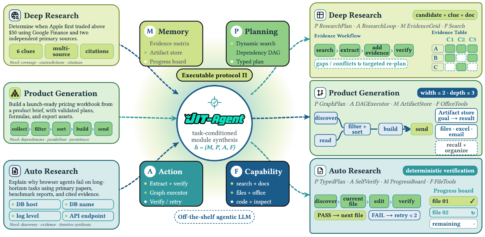

그림 1은 이 구도를 한 장에 담는다. 왼쪽에 세 종류의 과제가 들어온다. Deep Research는 "Google Finance와 두 개의 독립적 1차 출처로 Apple 주가가 처음 $50을 넘은 시점을 확정하라"는 요청이고 6개 단서·다중 출처·인용을 필요로 하며, 요구 사항은 coverage·contradictions·citations다. Product Generation은 제품 브리프에서 검증된 계획·수식·export asset을 갖춘 출시 준비 가격 workbook을 만드는 과제로 collect → filter → sort → build → send 흐름이고, 요구는 dependencies·parallelism·persistence다. Auto Research는 브라우저 에이전트가 장기 과제에서 실패하는 이유를 1차 논문·벤치마크 리포트·인용 증거로 설명하는 과제로, DB host·DB name·log level·API endpoint를 다루며 discovery·evidence·iterative synthesis를 요구한다. 가운데에는 Memory(evidence matrix, artifact store, progress board), Planning(dynamic search, dependency DAG, typed plan), Action(extract + verify, graph executor, verify/retry), Capability(search + docs, files + office, code + inspect) 네 모듈과 **executable protocol Π**가 있고, JIT-Agent는 "task-conditioned module synthesis"로 $h=(M,P,A,F)$를 만들며 그 아래에서 off-the-shelf agentic LLM이 실행된다. 오른쪽은 세 과제에 대해 서로 다른 실행 프로토콜이 나온 결과다. Deep Research는 `P ResearchPlan · A ResearchLoop · M EvidenceGrid · F Search`에 candidate × clue × doc 증거 표와 search → extract → add evidence → verify 워크플로, gaps/conflicts에서 targeted re-plan이 붙는다. Product Generation은 `P GraphPlan · A DAGExecutor · M ArtifactStore · F OfficeTools`에 width ≤ 2 · depth ≤ 3 제약, discover/read → filter + sort → build → send 그래프, goal → result 인덱스의 artifact store가 붙는다. Auto Research는 `P TypedPlan · A SelfVerify · M ProgressBoard · F FileTools`에 deterministic verification, discover → current file → edit → verify 루프, PASS → next file / FAIL → retry ≤ 2 규칙, 파일별 progress board가 붙는다. 핵심은 모듈을 단순히 **조합**하는 것이 아니라 과제 구조에 맞게 **인스턴스화**한다는 점이다.

## 🧠 하네스 지능이란 무엇인가

JIT-Agent는 추론 시점에 과제 명세, 프로토콜, 실행 가능한 도구/skill 레지스트리, 그리고 이전 하네스들로 이루어진 작은 검색 컨텍스트를 받아 그 과제에 맞춘 실행 가능한 하네스를 내놓는다. 그 하네스가 off-the-shelf agentic LLM을 감싸 실행한다. 피드백과 트레이스가 쌓이면 JIT-Agent는 하네스를 수정하고 harness archive를 갱신하며, 이렇게 **생성기 자체는 고정된 채로** test-time 하네스 진화가 일어난다.

이런 시스템을 훈련하는 데는 세 가지 난점이 있다. ❶ **adaptivity** — 생성된 하네스를 과제에 어떻게 맞출 것인가. ❷ **reliability** — 실행 가능한 동작을 어떻게 보장하고, 합성이 실패했을 때 어떻게 복구할 것인가. ❸ **evolvability** — 실행 피드백을 어떻게 더 강한 미래 하네스로 바꿀 것인가. 이 셋이 논문이 말하는 **하네스 지능(harness intelligence)**을 정의한다.

**하네스 지능**은 모델이 행동하는 통로가 되는 운영 scaffold를 구성하고 정련하는 능력이다. 세 가지 정의적 속성을 갖는다. **adaptivity**, 하네스를 과제와 backbone에 맞추는 것. **reliability**, 실행 가능한 동작을 만들어내고 합성이 실패했을 때 복구하는 것. **evolvability**, 실행 피드백을 더 강한 미래 하네스로 바꾸는 것. 하네스에 **관한** 지능은 고정된 하네스 **안에서의** 유능함이 끝나는 지점에서 시작한다.

논문의 기여는 세 가지다. (I) *Model-as-a-Harness*를 정식화하고, *하네스 지능*을 에이전트의 운영 scaffold를 구성·수리·진화시키는 학습된 능력으로 정의한다. (II) 4모듈 실행 프로토콜, HarnessFactory, 그리고 customization–repair–evolution 3단계 파이프라인을 결합한 JIT-Agent로 이 패러다임을 구체화한다. (III) JIT로 생성된 하네스가 다양한 backbone을 개선하면서 강력한 프로덕션 하네스와도 경쟁력을 유지함을 검증한다.

## 🧱 하네스 설계 공간을 네 모듈로 분해하기

에이전트 하네스는 foundation model을 닫힌 루프 에이전트로 바꾸는 운영 계층이다. 이전 상호작용에서 무엇을 남길지(Hu et al. (2026b)), 중간 지시를 어떻게 형성할지(Cao et al. (2025)), 각 단계에서 어떤 외부 능력을 노출할지(Xu and Yan (2026), Yang et al. (2026)), 제어가 어떻게 전진할지를 정한다. 그러므로 하네스 생성은 제약 없는 텍스트가 아니라 **프로그램** 위에서 정의된다. 논문은 원시 생성 공간 $\mathcal{G}$, 문법적으로 유효한 하네스 $\mathcal{H}^{\mathrm{syn}}$, 프로토콜을 준수하는 하네스 $\mathcal{H}_{\boldsymbol{\Pi}}$, 그리고 그중 실행 가능한 부분집합 $\mathcal{H}^{\mathrm{exec}}_{\boldsymbol{\Pi}}$를 구분하며 $\mathcal{G}\supseteq\mathcal{H}^{\mathrm{syn}}\supseteq\mathcal{H}_{\boldsymbol{\Pi}}\supseteq\mathcal{H}^{\mathrm{exec}}_{\boldsymbol{\Pi}}$가 성립한다. 고정 프로토콜 $\boldsymbol{\Pi}$는 모듈 스키마와 인터페이스, 그 lifecycle, 검증 규칙, 공유 실행 semantics를 규정한다. 이것이 언어와 런타임에서 오는 우연한 변이를 제거하면서, 기존 하네스들을 구분 짓는 본질적 운영 선택은 남긴다.

과제를 $\boldsymbol{\tau}$, 고정된 backbone executor를 $\pi_{\psi}$, 그 과제에서 쓸 수 있는 capability registry를 $\mathcal{C}_{\tau}$라 하자. 하네스 $\mathbf{h}$를 $\pi_{\psi}$와 함께 돌리면 닫힌 루프 궤적이 유도된다.

$$\boldsymbol{\xi}\sim\operatorname{Rollout}(\boldsymbol{\tau},\pi_{\psi},\mathbf{h},\mathcal{C}_{\tau};\boldsymbol{\Pi})=\bigl(\mathbf{s}_{1},e_{1},\mathbf{o}_{1},\ldots,\mathbf{s}_{T},e_{T},\mathbf{o}_{T}\bigr),$$ (1)

여기서 $\mathbf{s}_{t}\in\mathcal{S}$는 유지되는 controller state, $e_{t}\in\mathcal{A}=\mathcal{U}\sqcup\mathcal{Y}$는 $\mathcal{U}$의 실행 가능한 호출이거나 $\mathcal{Y}$의 종료 출력, $\mathbf{o}_{t}\in\mathcal{O}$는 그 결과 관측, $T$는 프로토콜 또는 예산으로 한정된 정지 시각이다. 핵심 가정은 모든 $\mathbf{h}\in\mathcal{H}_{\boldsymbol{\Pi}}$가 다음 분해를 허용한다는 것이다.

$$\mathbf{h}\,=\,\bigl(\mathbf{M},\,\mathbf{P},\,\mathbf{A},\,\mathbf{F}\bigr)\in\mathfrak{M}\times\mathfrak{P}\times\mathfrak{A}\times\mathfrak{F},$$ (2)

$\mathbf{M}$, $\mathbf{P}$, $\mathbf{A}$, $\mathbf{F}$는 각각 memory, planning, action, capability-orchestration 모듈이고 $\mathfrak{M}$, $\mathfrak{P}$, $\mathfrak{A}$, $\mathfrak{F}$는 프로토콜과 호환되는 구현 공간이다. 이 튜플은 개념적 분해 순서를 따르지만, 런타임 의존 순서는 $\mathbf{M}\!\rightarrow\!\mathbf{P}\!\rightarrow\!\mathbf{F}\!\rightarrow\!\mathbf{A}$다. 모든 모듈은 동일한 고정 $\pi_{\psi}$를 상대로 동작한다. 프로토콜은 불변 이벤트 히스토리 $\boldsymbol{\xi}_{<t}$와 가변 controller state $\mathbf{s}_{t}$를 함께 유지하며, 둘은 다음처럼 상호작용한다.

$$\displaystyle\mathbf{v}_{t}$$ $$\displaystyle=\mathbf{M}(\boldsymbol{\xi}_{<t},\mathbf{s}_{t})\in\mathcal{V},$$ $$\displaystyle\text{history $\to$ view,}$$ (3)

$$\displaystyle\mathbf{d}_{t}$$ $$\displaystyle=\mathbf{P}(\boldsymbol{\tau},\mathbf{s}_{t},\mathbf{v}_{t})\in\mathcal{D}_{\mathrm{dir}},$$ $$\displaystyle\text{view $\to$ local directive,}$$

$$\displaystyle\mathcal{C}_{t}$$ $$\displaystyle=\mathbf{F}(\mathcal{C}_{\tau},\mathbf{s}_{t},\mathbf{v}_{t},\mathbf{d}_{t})\subseteq\mathcal{C}_{\tau},$$ $$\displaystyle\text{directive-conditioned capability orchestration,}$$

$$\displaystyle(\mathbf{s}_{t+1},e_{t})$$ $$\displaystyle=\mathbf{A}(\mathbf{s}_{t},\boldsymbol{\tau},\mathbf{v}_{t},\mathbf{d}_{t},\mathcal{C}_{t})\in\mathcal{S}\times\mathcal{A},$$ $$\displaystyle\text{control update and action emission,}$$

$\mathcal{V}$와 $\mathcal{D}_{\mathrm{dir}}$는 각각 view 공간과 directive 공간이다. 레지스트리 $\mathcal{C}_{\tau}$는 호출 가능한 도구(bash 도구, API, MCP(Sarkar and Sarkar (2025)))와 상위 수준 agent skill(Xu and Yan (2026), ClaudeCode (2025))을 모두 담는다. 명시적 플래너가 없는 하네스도 $\mathbf{P}_{\emptyset}$가 돌려주는 null directive $\mathbf{d}_{\emptyset}\in\mathcal{D}_{\mathrm{dir}}$ 덕에 타입 일관성을 유지한다. 정리하면 $\mathbf{M}$이 실현된 히스토리의 view를 구성하고, $\mathbf{P}$가 국소 directive를 만들고, $\mathbf{F}$가 관련 능력을 활성화하고, $\mathbf{A}$가 controller state를 갱신하며 다음 행동을 내보낸다. 공유 커널 $\operatorname{Exec}:\mathcal{U}\times 2^{\mathcal{C}_{\tau}}\rightarrow\mathcal{O}$는 $e_{t}\in\mathcal{U}$에 대해 $\mathbf{o}_{t}=\operatorname{Exec}(e_{t};\mathcal{C}_{t})$로, $e_{t}\in\mathcal{Y}$에 대해 $\mathbf{o}_{t}=\bot$로 두는데 $\bot\in\mathcal{O}$는 종료 null 관측이다. 이어 $\boldsymbol{\xi}_{\leq t}=\boldsymbol{\xi}_{<t}\oplus(\mathbf{s}_{t},e_{t},\mathbf{o}_{t})$로 갱신하며 $\oplus$는 이벤트 append다. 실행은 $\boldsymbol{\xi}_{<1}=\emptyset$과 프로토콜이 정한 $\mathbf{s}_{1}\in\mathcal{S}$에서 시작해 $e_{t}\in\mathcal{Y}$일 때 종료하고 $y=e_{T}\in\mathcal{Y}$를 낸다.

이 분해가 하는 일은 서로 다른 프로그램들을 $\mathfrak{M}\times\mathfrak{P}\times\mathfrak{A}\times\mathfrak{F}$ 안의 비교 가능한 좌표로 옮기는 것이다. 정통 ReAct는 full-history memory, 명시적 플래너 없음, ReAct 루프, 전체 capability registry를 쓴다. Codex와 OpenCode 같은 엔지니어링된 변형은 여기에 compact memory와 todo 기반 planning을 더한다. ROMA, AOrchestra, RLM 같은 재귀적 시스템은 subproblem memory, decomposition, recursive action, routed capability를 인스턴스화한다.

## 🏭 HarnessFactory: 13개 시드 하네스

공유 프로토콜 $\boldsymbol{\Pi}$와 공통 커널 아래에서 HarnessFactory는 memory, planning, aggregation, hierarchical control, recursive execution을 아우르는 대표 scaffold 13개를 다시 구현한다. 이것들이 프로토콜과 호환되는 시드 뱅크 $\mathcal{B}_{0}$를 이루고 크기는 $K_{0}=13$이다. 이 뱅크는 두 역할을 한다. 시드들은 Stage-I 합성을 고정해 주는 앵커가 되고, 이후의 상태들은 새 설계를 평가할 사전 population이 된다. $n$번의 진화 라운드 뒤 $\mathcal{B}_{0}$는 $\mathcal{B}_{n}\supseteq\mathcal{B}_{0}$로 자라며, 각 항목은 보존된 하네스를 그 과제 및 관측된 reward, latency, cost와 짝짓는다.

표 1은 시드 뱅크 $\mathcal{B}_{0}$의 전체 목록이다. 각 행이 완전한 하네스 하나이고, 열은 memory, planning, action, capability orchestration의 개념적 순서를 따른다.

|  | ♣ **Memory** | ♠ **Planning** | ♥ **Action** | ♠ **Capability Orchestration** |
|----|----|----|----|----|
| **Harness** | $\mathbf{M}\in\mathfrak{M}$ | $\mathbf{P}\in\mathfrak{P}$ | $\mathbf{A}\in\mathfrak{A}$ | $\mathbf{F}\in\mathfrak{F}$ |
| ReAct \[69\] | FullHistory | No explicit planner | ReAct | Full registry |
| Plan-and-Execute \[14\] | FullHistory | Linear roadmap | ReAct | Full registry |
| ReSum \[63\] | ReSum memory | No explicit planner | ReAct | Full registry |
| Flash-Searcher \[51\] | FullHistory | DAG planning | ReAct | Full registry |
| GAM \[65\] | GAM retrieval | DAG | ReAct | Full registry |
| MemoBrain \[50\] | Reasoning graph | No explicit planner | Marker-guided execution | Full registry |
| AggAgent \[29\] | Isolated rollout histories | No explicit planner | Multi-rollout aggregation | Full registry |
| OAgent \[80\] | Coordinator history | No explicit planner | Ensemble voting | Full registry |
| AgentFold \[70\] | AgentFold memory | DAG | ReActFold | Full registry |
| HiAgent \[20\] | Hierarchical memory | No explicit planner | ReAct | Full registry |
| DeepAgent \[30\] | Three-tier memory | No explicit planner | Marker-guided execution | Tool search |
| ROMA \[1\] | Context isolation | Atomizer + DAG | Recursive execution | Full registry |
| AOrchestra \[53\] | Context isolation | Atomizer + DAG | Recursive execution | Agent Delegation |

## 🎓 세 단계 학습: 커스터마이즈, 수리, 진화

학습은 JIT-Agent의 추론 시점 lifecycle을 그대로 따른다. 과제 조건부 하네스를 합성하고, 불안정한 생성을 복구하고, 더 강해진 archive 상태로부터 온라인으로 개선한다. 훈련 과제를 $\boldsymbol{\tau}\sim\mathcal{D}_{\mathrm{task}}$, 그 capability registry를 $\mathcal{C}_{\tau}$, harness bank에서 온 작은 참조 컨텍스트를 $\mathcal{E}_{\tau}$라 하면 생성 컨텍스트는 $\mathbf{c}_{\tau}=(\boldsymbol{\tau},\boldsymbol{\Pi},\mathcal{C}_{\tau},\mathcal{E}_{\tau})$이고, 여기서 $p_{\theta}$가 하네스 $\mathbf{h}\in\mathcal{G}$를 생성한다. 고정된 executor $\pi_{\psi}\sim\mathcal{M}$이 과제 reward, latency, 금전적 cost를 평가하고, $\operatorname{Valid}_{\boldsymbol{\Pi}}(\mathbf{h};\boldsymbol{\tau},\pi_{\psi},\mathcal{C}_{\tau})\in\{0,1\}$이 프로토콜 및 실행 유효성을 검사하며 실패 시 구조화된 진단을 돌려준다.

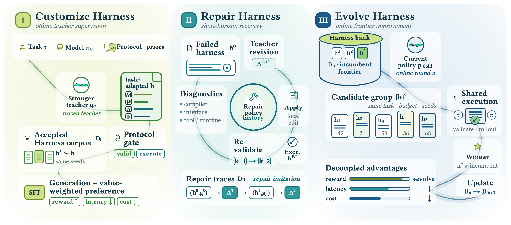

그림 2는 세 단계를 나란히 보여준다. Stage I(Customize Harness, offline teacher supervision)은 Task $\tau$·Model $\pi_\psi$·Protocol/priors를 frozen teacher $q_\phi$에 넣어 M/P/A/F가 채워진 task-adapted $h$를 얻고, protocol gate(valid/execute)를 통과한 것만 accepted harness corpus $D_\mathrm{I}$로 남기며, 동일 seed 아래 $h^+ \succ_\tau h^-$ 비교로 SFT와 value-weighted preference(reward↑, latency↓, cost↓)를 수행한다. Stage II(Repair Harness, short-horizon recovery)는 failed harness $\hbar^0$와 compiler/interface/tool·runtime 진단을 teacher revision $\Delta^{k+1}$로 받아 local edit을 apply하고 $k=1 \to k=2$로 재검증하며, $(\hbar^0,g^0) \to \Delta^1 \to (\hbar^1,g^1) \to \Delta^2$ 형태의 repair trace $D_\mathrm{II}$를 만든다. Stage III(Evolve Harness, online frontier improvement)는 harness bank $B_n$의 incumbent frontier와 현재 정책 $p_{\theta_\mathrm{old}}$에서 candidate group $\{h_i\}^G$를 뽑아(그림 예시는 .42, .71, .53, .86, .68) 같은 task·budget·seed로 shared execution하고, reward/latency/cost의 decoupled advantage를 계산해 incumbent 이상인 winner를 뽑아 $B_n \to B_{n+1}$을 갱신한다.

### Stage I: 데이터 준비

Stage I은 고정된 더 강한 teacher $q_{\phi}$를 써서 고정 4모듈 프로토콜 아래 과제 적응 하네스를 합성한다. 각 과제에 대해 $\mathcal{E}_{\tau}$는 과제 유형이 일치하는 부분집합 $\mathcal{B}_{0}^{(d(\boldsymbol{\tau}))}$에서 뽑은 scaffold 3개를 담는데, $d(\boldsymbol{\tau})$는 과제 유형이다. teacher는 그렇게 만들어진 컨텍스트 $\mathbf{c}_{\tau}$를 받고, 그 생성물은 프로토콜 검증과 실행 검사를 통과한 뒤에만 보존된다. 훈련 과제는 기존 agentic 벤치마크와 환경(Wu et al. (2025), Shi et al. (2025), Bai et al. (2026), Song et al. (2026))에서 오고, 합성된 과제로 보강된다.

### Stage I: 학습 설정

먼저 승인된 teacher 생성물에 표준 supervised fine-tuning을 적용해, 과제와 참조 컨텍스트를 프로토콜 준수 하네스로 곧장 매핑하도록 가르친다. 실행 가능한 하네스라도 품질과 효율은 크게 다를 수 있으므로, 이어서 동일한 backbone과 평가 seed 아래에서 후보들을 비교한다. 선호 쌍은 reward가 개선되고, 두 효율 축 어느 쪽도 악화되지 않으며, 적어도 한 효율 축이 엄격히 개선될 때에만 보존된다.

$$\displaystyle\mathbf{h}^{+}\succ_{\tau}\mathbf{h}^{-}$$ $$\displaystyle\iff r^{+}>r^{-}\;\land\;\ell^{+}\leq\ell^{-}\;\land\;\kappa^{+}\leq\kappa^{-}\;\land\;\bigl(\ell^{+}<\ell^{-}\;\lor\;\kappa^{+}<\kappa^{-}\bigr),$$ (4)

$$\displaystyle\Delta_{\mathrm{val}}(\boldsymbol{\tau};\mathbf{h}^{+},\mathbf{h}^{-})$$ $$\displaystyle=\alpha_{r}(r^{+}-r^{-})+\alpha_{\ell}[\ell^{-}-\ell^{+}]_{+}+\alpha_{\kappa}[\kappa^{-}-\kappa^{+}]_{+},$$

여기서 $(r^{\pm},\ell^{\pm},\kappa^{\pm})$는 $(\mathbf{h}^{+},\mathbf{h}^{-})$의 반복 rollout 평균이고, $[x]_{+}=\max(x,0)$이며, $\alpha_{r},\alpha_{\ell},\alpha_{\kappa}\geq 0$이 reward·latency·cost 격차에 가중치를 준다. 이렇게 얻은 쌍이 표준 DPO 목적함수를 지도하며, $\Delta_{\mathrm{val}}$로 가중되고 고정된 Stage-I SFT 체크포인트에 anchor된다. 생성 imitation과 결합되어 이 목적함수는 프로토콜 유효 구조를 보존하면서 더 효과적이고 더 효율적인 하네스를 선호하게 만든다.

### Stage II: 데이터 준비

Stage I은 프로토콜 준수를 최적화하지만, 생성된 하네스 일부는 여전히 정적 또는 런타임 검증에 실패한다. 그것을 버리는 대신 Stage II는 실패한 하네스 $\widetilde{\mathbf{h}}^{(0)}$를 compiler error, interface mismatch, tool-call failure, runtime exception을 기록한 구조화된 진단 $\mathbf{g}^{(0)}$와 짝짓는다. 수리 라운드 $k$에서 teacher가 patch 공간 $\mathcal{P}$로부터 구조화된 수정 $\Delta^{(k+1)}$을 제안하고, $\operatorname{Apply}$가 하네스를 결정론적으로 갱신하며, 그 뒤 검증이 다음 진단을 만든다. 두 라운드 안에 실행 가능해지는 궤적만 보존한다.

$$\displaystyle\widetilde{\mathbf{h}}^{(k+1)}$$ $$\displaystyle=\operatorname{Apply}\!\left(\widetilde{\mathbf{h}}^{(k)},\Delta^{(k+1)}\right),\qquad k\in\{0,1\},$$ (5)

$$\displaystyle K^{\star}$$ $$\displaystyle=\min\Bigl\{k\in\{1,2\}:\operatorname{Valid}_{\boldsymbol{\Pi}}(\widetilde{\mathbf{h}}^{(k)};\boldsymbol{\tau},\pi_{\psi},\mathcal{C}_{\tau})=1\Bigr\}.$$

$K^{\star}$가 존재할 때에만 지도 신호를 구성하는데, 이것이 코퍼스를 전면 재설계가 필요한 실패가 아니라 현실적이고 국소적으로 복구 가능한 실패에 집중시킨다.

### Stage II: 학습 설정

Stage II는 성공한 수정들 $\{\Delta^{\star(k+1)}\}_{k=0}^{K^{\star}-1}$을 teacher-forced imitation으로 학습시킨다. 각 수정은 $\mathbf{c}_{\tau}$와 그 앞의 하네스–진단 히스토리 전체 $\{(\widetilde{\mathbf{h}}^{(j)},\mathbf{g}^{(j)})\}_{j=0}^{k}$에 조건화된다. $K^{\star}\leq 2$이므로 모델은 배포 시점에 필요한 짧은 지평 regime을 배운다. 실행 피드백을 써서 프로토콜 유효 실행을 되살리는 소수의 고영향 수정을 가하는 것이다.

### Stage III: 데이터 준비

Stage III은 *test-time 하네스 진화*를 훈련 가능한 능력으로 다룬다. JIT-Agent가 이전 설계를 능가하는 하네스를 제안하고, 그것이 다시 이후 과제의 더 강한 참조가 되도록 학습시킨다. 여기서 나오는 온라인 목적함수를 **Evolutionary Group-Decoupled Policy Optimization (Evo-GDPO)**라 부르며, Liu et al. (2026a)에서 착안했다. 온라인 라운드 $n$에서 과제 $\boldsymbol{\tau}$를 뽑고, 현재 뱅크 $\mathcal{B}_{n}$에서 이전의 고품질 설계 $\mathcal{E}_{\tau,n}$을 검색하고, $\mathbf{c}_{\tau,n}=(\boldsymbol{\tau},\boldsymbol{\Pi},\mathcal{C}_{\tau},\mathcal{E}_{\tau,n})$을 만든다. 모델은 현재 rollout 정책에서 $G>1$개 후보를 독립적으로 샘플링하고, 후보와 검색된 설계는 동일한 고정 executor $\pi_{\psi}\sim\mathcal{M}$, 동일 예산, 동일 seed 아래 평가된다. reward가 가장 높은 검색 하네스가 — 동점이면 latency가 낮은 쪽, 그다음 cost가 낮은 쪽으로 — incumbent 통계 $(b_{r},b_{\ell},b_{\kappa})$를 제공한다.

### Stage III: 학습 설정

모든 후보는 실행 전에 검증되며, 한정된 수리 뒤에도 유효하지 않은 후보는 최소 과제 reward를 받는다. 다만 그 수리에 든 latency와 cost는 측정된 효율에 그대로 남는다. 실행 가능한 후보 $i$에 대해 반복 rollout에서의 reward, 평균 latency, 평균 금전 cost를 $r_{i}$, $\bar{\ell}_{i}$, $\bar{\kappa}_{i}$라 하자. reward 채널이 주(主)이고, 효율 이득은 incumbent reward가 유지될 때에만 활성화된다.

$$\displaystyle R^{\mathrm{rew}}_{i}=r_{i}+\lambda_{\mathrm{evo}}\,[r_{i}-b_{r}]_{+},\;R^{\mathrm{lat}}_{i}=\mathbb{I}[r_{i}\geq b_{r}]\,[b_{\ell}-\bar{\ell}_{i}]_{+},\;R^{\mathrm{cost}}_{i}=\mathbb{I}[r_{i}\geq b_{r}]\,[b_{\kappa}-\bar{\kappa}_{i}]_{+},$$ (6)

$\lambda_{\mathrm{evo}}\geq 0$이 개선 보너스를 조절하고 $\mathbb{I}[\cdot]$은 indicator function이다. Evo-GDPO는 세 채널을 각 후보 그룹 안에서 독립적으로 정규화한 뒤 합치는데, 이것이 채널들의 스케일이 서로를 압도하는 것을 막는다.

$$\displaystyle A^{m}_{i}$$ $$\displaystyle=\frac{R^{m}_{i}-\operatorname{mean}(\{R^{m}_{j}\}_{j=1}^{G})}{\operatorname{std}(\{R^{m}_{j}\}_{j=1}^{G})+\varepsilon_{\mathrm{num}}},\qquad m\in\{\mathrm{rew},\mathrm{lat},\mathrm{cost}\},$$ (7)

$$\displaystyle A^{\Sigma}_{i}$$ $$\displaystyle=w_{\mathrm{rew}}A^{\mathrm{rew}}_{i}+w_{\mathrm{lat}}A^{\mathrm{lat}}_{i}+w_{\mathrm{cost}}A^{\mathrm{cost}}_{i},\quad w_{\mathrm{rew}}>w_{\mathrm{lat}}+w_{\mathrm{cost}}.$$

비음 가중치들의 합은 1이고, 위 부등식이 과제 reward를 지배적으로 만든다. $\varepsilon_{\mathrm{num}}>0$이 정규화를 안정화한다. 이어 $A_{i}^{\Sigma}$를 훈련 배치 전체에 걸쳐 한 번 더 정규화하고, 고정된 Stage-II 체크포인트에 대한 token-level KL penalty를 붙인 표준 clipped PPO 목적함수에 쓴다. 그래서 표준 group-relative optimization과 달리 Evo-GDPO는 이전 설계를 **추월한** 후보에게, 그리고 reward가 유지될 때 그것을 **더 효율적으로** 해낸 후보에게 보상한다. 최적화 이후 harness bank는 보수적으로 갱신한다. 후보는 현재 reward frontier를 맞추거나 넘어서고, 그다음 frontier 차원 중 적어도 하나 — reward 자체이거나, latency이거나, cost — 를 엄격히 개선할 때에만 보존된다. 훈련 중에는 이 피드백이 $\theta$와 $\mathcal{B}_{n}$을 함께 갱신하지만, 배포 시점에는 $\theta$가 고정된다.

## 🚀 추론 아키텍처: static과 streaming

JIT-Agent는 두 가지 추론 모드를 지원한다. *static inference*와 *streaming inference*이며, 과제가 끝난 뒤 경험을 버리는지 아니면 이후 과제를 위해 남기는지에서 갈린다.

**Static inference.** 여기서는 가벼운 형태의 test-time scaling을 쓴다. JIT-Agent가 하네스 $N$개를 병렬로 생성하고, 그중 하나를 고르고, 고른 하나만 실행한다. 이렇게 하면 환경 rollout 수를 늘리지 않으면서 후보 다양성이 커진다. 선택된 하네스는 위에서 설명한 것과 동일한 검증 및 한정 수리 절차를 따른다.

**Streaming inference.** 스트리밍 모드는 연속된 과제들에 걸쳐 유용한 경험을 앞으로 전달하도록 설계됐다. $n$번째 과제 $\boldsymbol{\tau}_{n}$에 대해 JIT-Agent는 현재 뱅크 $\mathcal{B}_{n}$에서 검색하고, 하네스 $\mathbf{h}^{\dagger}_{n}$을 생성·선택하고, 한 번 실행한다. 그렇게 얻은 환경 피드백은 오직 이 경험이 뱅크를 갱신해야 하는지를 판정하는 데에만 쓰인다.

$$\displaystyle\boldsymbol{\xi}_{n}\sim\operatorname{Rollout}(\boldsymbol{\tau}_{n},\pi_{\psi},\mathbf{h}^{\dagger}_{n},\mathcal{C}_{\tau_{n}};\boldsymbol{\Pi}),\mathbf{m}_{n}$$ $$\displaystyle=\operatorname{Eval}(\boldsymbol{\xi}_{n}),$$ (8)

$$\displaystyle\mathcal{B}_{n+1}=\operatorname{Update}_{\mathrm{III}}(\mathcal{B}_{n};\boldsymbol{\tau}_{n},\mathbf{h}^{\dagger}_{n},\mathbf{m}_{n}),\mathcal{E}_{\tau_{n+1},n+1}$$ $$\displaystyle=\operatorname{Retrieve}(\boldsymbol{\tau}_{n+1};\mathcal{B}_{n+1}),$$

$\mathbf{m}_{n}=(r_{n},\bar{\ell}_{n},\bar{\kappa}_{n})$는 reward, 평균 latency, 평균 금전 cost를 담는다. Stage-III 보존 규칙을 따라, 완료된 하네스가 허용 가능한 개선을 주지 못하면 $\operatorname{Update}_{\mathrm{III}}$는 $\mathcal{B}_{n}$을 그대로 둔다. 그렇지 않으면 보존된 하네스가 이후 과제의 잠재적 참조가 된다. 따라서 스트리밍 추론은 진화하는 harness bank를 통해 이전 경험을 전달하되, 환경 피드백을 현재 rollout에 주입하거나 모델 파라미터를 갱신하지는 않는다.

## 🧪 실험 설정

평가는 네 가지 과제 유형에 걸친 9개 벤치마크로 이루어진다. **Deep Research**는 BrowseComp-Plus (Chen et al. (2025b), accuracy), DeepSearchQA (Gupta et al. (2026), answer F1), xBench-DeepSearch(xBench-DS) (Chen et al. (2025a), accuracy). **Daily Work**는 AgentIF-Oneday (Chen et al. (2026a), normalized weighted rubric score)와 PinchBench (PinchBench (2026), average score). **Planning**은 DeepPlanning-Shopping(cart match rate)과 DeepPlanning-Travel(composite constraint score) 서브셋 (Zhang et al. (2026b)). **Workspace**는 OfficeBench (Wang et al. (2024))와 OdysseyBench (Wang et al. (2025)), 둘 다 task success rate다. 모든 지표는 $0$–$100$ 스케일로 보고하고 높을수록 좋다.

JIT-Agent는 Qwen3.6-27B를 기반으로 학습시켜 **JIT-Agent-27B**를 만든다. 주로 GLM-5.2 (Z.ai (2026))와 DeepSeek-V4-Flash-Preview (DeepSeek-AI (2026))로 인스턴스화하는데, 두 backbone은 상보적인 동작점을 제공한다. GLM-5.2는 강력한 오픈 장기 지평 모델이고, DeepSeek-V4-Flash는 추론 효율을 강조한다. 일반화를 시험하기 위해 Qwen3.6, Mimo-V2.5 계열 모델도 함께 쓴다.

baseline은 두 그룹이다. 첫째, 광범위 비교에는 vanilla **Qwen3.7-Plus** (Qwen Team (2026)), **GLM-5.2**, **DeepSeek-V4-Flash/Pro**(둘 다 preview 버전), **Kimi K2.7 Code** (Moonshot AI (2026)), **GPT-5.6-Sol** (OpenAI (2026)), **Gemini 3.1 Pro/3.5 Flash** (Google DeepMind (2026a), Google DeepMind (2026b))가 들어간다. 둘째, backbone을 고정한 채 재사용 가능한 에이전트 하네스 다섯 개 — Claude Code (Anthropics (2025)), Codex (OpenAI (2025)), OpenCode (OpenCode-AI (2025)), Hermes (Nous Research (2026)), NanoBot (HKUDS (2026)) — 와 비교한다. 첫 그룹은 end-to-end 경쟁력을 재고, 둘째 그룹은 하네스 설계의 기여를 모델 가중치의 기여로부터 분리한다.

## 📊 주요 결과: 18개 매칭 쌍 전부에서 개선

표 2는 9개 벤치마크에서 JIT 생성 하네스를 vanilla backbone 및 frontier 모델과 비교한다. 점수는 $0$–$100$ 스케일이고 높을수록 좋다. JIT-Agent 접두어가 붙은 행은 vanilla 상대와 동일한 backbone을 쓰되 기본 scaffold만 JIT 생성 하네스로 바꾼 것이다.

| **Model** | **BC+** | **DSQA** | **xBench** | **AgentIF** | **PinchBench** | **Shop** | **Travel** | **Office** | **Odyssey** |
|----|----|----|----|----|----|----|----|----|----|
| Qwen3.7-Plus | 70.5 | 78.0 | 75.0 | 59.9 | 80.5 | 75.2 | 52.1 | 56.6 | 67.7 |
| GLM-5.2 | 72.0 | 89.2 | 76.0 | 63.0 | 87.0 | 78.2 | 62.8 | 63.0 | 75.3 |
| DeepSeek-V4-Flash | 68.1 | 76.2 | 70.1 | 58.4 | 81.7 | 59.1 | 54.8 | 61.0 | 71.0 |
| DeepSeek-V4-Pro | 71.4 | 72.4 | 79.0 | 56.5 | 61.1 | 71.1 | 55.2 | 62.0 | 72.0 |
| Kimi K2.7 Code | 73.6 | 87.8 | 79.0 | 57.3 | 76.1 | 72.8 | 56.9 | 65.8 | 69.9 |
| GPT-5.6 | 76.9 | 76.0 | 81.0 | 68.0 | 84.2 | 83.7 | **84.9** | 65.3 | 68.7 |
| Gemini 3.1 Pro | 67.5 | 75.8 | 83.0 | 60.1 | 81.0 | 77.4 | 70.7 | 60.6 | 74.0 |
| Gemini 3.5 Flash | 75.0 | 88.0 | 85.0 | 64.0 | 74.2 | 76.2 | 50.3 | 63.3 | 78.0 |
| JIT-Agent + GLM-5.2 | **78.0** | **93.9** | **88.0** | **69.9** | **93.3** | 83.4 | 83.0 | **68.4** | **78.7** |
| JIT-Agent + DeepSeek-V4-Flash | 74.0 | 85.1 | 82.0 | 63.8 | 92.9 | **83.9** | 61.3 | 63.4 | 73.0 |

기본 scaffold를 교체하면 매칭된 backbone–벤치마크 쌍 18개 **전부**가 개선된다. 평균 점수는 GLM-5.2에서 $74.1$ → $81.8$($+7.7$), DeepSeek-V4-Flash에서 $66.7$ → $75.5$($+8.8$)로 오른다. 가장 큰 이득은 장기 지평 planning에서 나오는데, DeepSeek-V4-Flash의 DeepPlanning-Shopping이 $+24.8$($59.1\!\rightarrow\!83.9$), GLM-5.2의 DeepPlanning-Travel이 $+20.2$($62.8\!\rightarrow\!83.0$)다. DeepSeek-V4-Flash는 xBench-DS에서 $11.9$, DeepSearchQA에서 $8.9$도 얻는다. 오픈 backbone을 쓰는데도 JIT을 장착한 시스템이 9개 열 중 8개에서 선두다. JIT-Agent + GLM-5.2는 7개 벤치마크에서 1위이며 DeepSearchQA $93.9$, AgentIF $69.9$, PinchBench $93.3$을 기록한다. JIT-Agent + DeepSeek-V4-Flash는 DeepPlanning-Shopping을 $83.9$로 이끌고, 보고된 모든 벤치마크에서 DeepSeek-V4-Pro를 평균 $8.7$점 앞선다. 유일한 예외는 DeepPlanning-Travel로, 여기서 JIT을 장착한 GLM-5.2는 GPT-5.6과 $1.9$점 차 안에 머문다. 요컨대 과제 적응형 하네스는 일부 과제군에만 유리한 것이 아니라 고정된 backbone의 능력을 일관되게 끌어올린다.

논문이 초록과 서론에서 앞세우는 대비도 이 표에서 나온다. JIT-Agent를 하네스 조력자로 붙인 DeepSeek-V4-Flash는 DeepSearchQA에서 GPT-5.6을 $9.1$점($85.1$ 대 $76.0$), OdysseyBench에서 $4.3$점($73.0$ 대 $68.7$) 앞선다. 이미 강한 GLM-5.2도 최대 $20.2$점을 얻는다.

## ⚖️ 성숙한 하네스들과의 통제 비교

표 3은 backbone을 고정한 통제 비교다. 각 고정 backbone에 대해 과제 성능(Perf.), 케이스당 평균 토큰 소비(#Tokens, 천 단위), 케이스당 API 비용(USD)을 보고한다. 성능은 높을수록, 토큰과 비용은 낮을수록 좋고, 각 backbone 그룹 안의 최적값을 굵게 표시했다.

| **Backbone** | **Harness** | **DSQA Perf.** $\uparrow$ | **DSQA #Tokens (K)** | **DSQA Cost** $\downarrow$ | **xBench-DS Perf.** $\uparrow$ | **xBench-DS #Tokens (K)** | **xBench-DS Cost** $\downarrow$ | **AgentIF Perf.** $\uparrow$ | **AgentIF #Tokens (K)** | **AgentIF Cost** $\downarrow$ |
|----|----|----|----|----|----|----|----|----|----|----|
| DeepSeek-V4-Flash | Claude Code | 79.6 | 625 | \$0.088 | 75.0 | 559 | \$0.079 | **66.9** | 808 | \$0.114 |
| DeepSeek-V4-Flash | Codex | 77.8 | 760 | \$0.107 | 70.0 | 680 | \$0.096 | 58.5 | 870 | \$0.123 |
| DeepSeek-V4-Flash | OpenCode | 75.9 | 1,832 | \$0.258 | 65.0 | 1,157 | \$0.159 | 48.1 | 950 | \$0.135 |
| DeepSeek-V4-Flash | Hermes | 69.9 | 1,157 | \$0.163 | 72.0 | 1,254 | \$0.177 | 60.3 | 1,000 | \$0.142 |
| DeepSeek-V4-Flash | NanoBot | 80.4 | 924 | \$0.131 | 78.0 | 527 | \$0.075 | 53.1 | 1,034 | \$0.147 |
| DeepSeek-V4-Flash | JIT-Agent | **85.1** | **400** | **\$0.066** | **82.0** | **212** | **\$0.039** | 63.8 | **476** | **\$0.097** |
| Qwen3.6-Flash | Claude Code | 72.8 | 710 | \$0.140 | 58.0 | 650 | \$0.128 | 55.4 | 900 | \$0.177 |
| Qwen3.6-Flash | Codex | 68.5 | 980 | \$0.193 | 52.0 | 874 | \$0.172 | 34.2 | 839 | \$0.170 |
| Qwen3.6-Flash | OpenCode | 64.1 | 1,968 | \$0.384 | 44.0 | 1,300 | \$0.256 | 38.7 | 961 | \$0.217 |
| Qwen3.6-Flash | Hermes | 60.8 | 1,319 | \$0.256 | 36.0 | 1,155 | \$0.227 | 49.7 | 1,184 | \$0.223 |
| Qwen3.6-Flash | NanoBot | **74.2** | 892 | \$0.197 | 63.0 | 597 | \$0.119 | 43.5 | 950 | \$0.187 |
| Qwen3.6-Flash | JIT-Agent | 70.3 | **464** | **\$0.095** | **70.0** | **300** | **\$0.069** | **58.3** | **394** | **\$0.078** |

JIT-Agent는 6개 설정 중 4개에서 최고 성능이다. DeepSeek-V4-Flash에서 가장 강한 고정 하네스를 DeepSearchQA에서 $4.7$점, xBench-DS에서 $4.0$점 앞서고, Qwen3.6-Flash에서 xBench-DS를 $7.0$점, AgentIF를 $2.9$점 앞선다. 나머지 두 설정에서는 최고 점수에 각각 $3.1$점과 $3.9$점 뒤지지만 토큰을 훨씬 적게 쓴다. 어떤 고정 하네스도 모든 과제를 지배하지 못한다는 뜻이다. 더 중요한 것은 JIT-Agent가 6개 설정 **전부**에서 토큰 소비와 비용이 가장 낮다는 점이다. 가장 저렴한 고정 대안 대비 케이스당 비용을 $14.9$–$54.1\%$, 평균 $36.0\%$ 줄인다. DeepSeek-V4-Flash의 xBench-DS에서는 토큰을 $527$K에서 $212$K로, 비용을 $\$0.075$에서 $\$0.039$로 줄이면서 성능을 $78.0$에서 $82.0$으로 올린다. Qwen3.6-Flash의 AgentIF에서는 $394$K 토큰, $\$0.078$로 $58.3$에 도달하는데, 고정 하네스들은 최소 $839$K 토큰과 $\$0.170$을 쓴다. 따라서 이득은 더 긴 궤적이 아니라 과제 조건부 scaffold에서 온다.

## 💰 비용–성능 파레토 프론티어

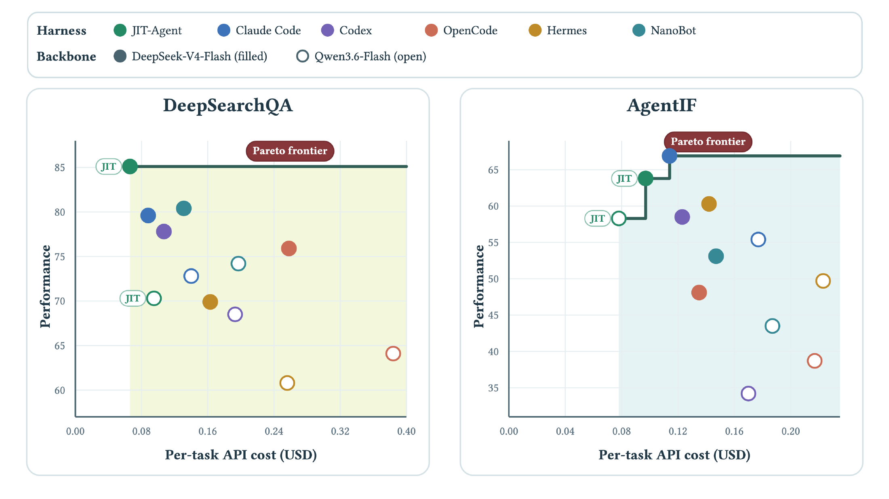

그림 3은 통제 비교의 비용–성능 기하를 DeepSearchQA와 AgentIF에서 그린다. 각 점이 표 3의 backbone–하네스 쌍이고 마커 색이 하네스(JIT-Agent, Claude Code, Codex, OpenCode, Hermes, NanoBot), 채워진 원과 빈 원이 각각 DeepSeek-V4-Flash와 Qwen3.6-Flash를 구분한다. 가로축은 케이스당 API 비용(USD), 세로축은 과제 성능이며, 왼쪽 위에 가까울수록 좋다. 짙은 녹색 계단선이 전역 파레토 프론티어이고, 연한 황록/청록 영역은 파레토 최적점 중 적어도 하나에 지배당하는 쌍들을 담는다.

DeepSearchQA에서 DeepSeek-V4-Flash + JIT-Agent는 평가된 쌍들 가운데 강한 파레토 최적 동작점으로, 케이스당 $\$0.066$에 $85.1$을 낸다. 가장 강한 고정 하네스인 NanoBot 대비 $4.7$점을 얻으면서 비용을 $49.6\%$ 줄인다($\$0.131\!\rightarrow\!\$0.066$). Qwen3.6-Flash에서는 생성된 하네스가 더 낮은 연산량 동작점을 제공한다. $\$0.095$에 $70.3$으로, NanoBot의 $\$0.197$에 $74.2$와 비교하면 $3.9$점을 내주고 비용을 $51.8\%$ 절감한다. AgentIF는 다르지만 상보적인 프론티어를 보인다. DeepSeek-V4-Flash에서 JIT-Agent는 Claude Code 대비 비용을 $14.9\%$ 줄이면서($\$0.097$ 대 $\$0.114$) 성능은 $3.1$점 차 안에 머물러($63.8$ 대 $66.9$), 둘 다 프론티어 위에 놓인다. Qwen3.6-Flash에서는 JIT-Agent가 모든 고정 하네스를 엄격히 지배해 최고 점수를 $55.4$에서 $58.3$으로 올리고 관측된 최소 비용을 $\$0.170$에서 $\$0.078$로 낮춘다. 프론티어의 모양 자체는 과제마다 다르지만, JIT 점들이 일관되게 왼쪽으로 이동한다는 사실이 과제 적응형 하네스가 긴 궤적으로 정확도를 사들이는 대신 추론 효율을 개선한다는 것을 보여준다.

## 🔁 모델 계열과 규모를 가로지르는 전이

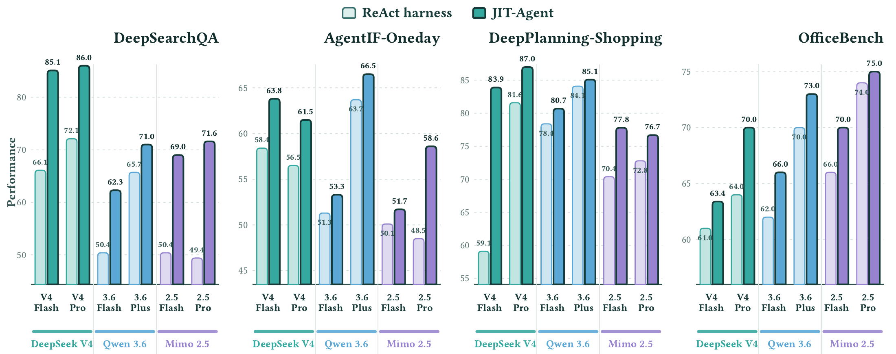

그림 4는 DeepSeek V4, Qwen3.6, Mimo-V2.5에서 고른 backbone 6개에 대해 고정 ReAct 하네스와 JIT 생성 하네스를 짝지어 비교한다. 네 패널은 DeepSearchQA, AgentIF-Oneday, DeepPlanning-Shopping, OfficeBench이고, DeepSearchQA는 100예제 서브셋, 나머지 셋은 50예제 서브셋을 쓴다. 막대 위 숫자는 다음과 같다.

DeepSearchQA에서 V4 Flash는 $66.1 \to 85.1$, V4 Pro는 $72.1 \to 86.0$, 3.6 Flash는 $50.4 \to 62.3$, 3.6 Plus는 $65.7 \to 71.0$, 2.5 Flash는 $50.4 \to 69.0$, 2.5 Pro는 $49.4 \to 71.6$이다. AgentIF-Oneday에서는 V4 Flash $58.4 \to 63.8$, V4 Pro $56.5 \to 61.5$, 3.6 Flash $51.3 \to 53.3$, 3.6 Plus $63.7 \to 66.5$, 2.5 Flash $50.1 \to 51.7$, 2.5 Pro $48.5 \to 58.6$이다. DeepPlanning-Shopping에서는 V4 Flash $59.1 \to 83.9$, V4 Pro $81.6 \to 87.0$, 3.6 Flash $78.4 \to 80.7$, 3.6 Plus $84.1 \to 85.1$, 2.5 Flash $70.4 \to 77.8$, 2.5 Pro $72.8 \to 76.7$이다. OfficeBench에서는 V4 Flash $61.0 \to 63.4$, V4 Pro $64.0 \to 70.0$, 3.6 Flash $62.0 \to 66.0$, 3.6 Plus $70.0 \to 73.0$, 2.5 Flash $66.0 \to 70.0$, 2.5 Pro $74.0 \to 75.0$이다.

JIT-Agent는 매칭된 24개 비교를 **전부** 이기며 평균 $7.6$점 앞선다. 계열별 이득은 각각 $10.2$, $4.0$, $8.6$점이다. DeepSearchQA가 가장 크게 수혜를 입어 평균 $+15.2$이고, Mimo-V2.5-Pro가 $+22.2$, DeepSeek-V4-Flash가 $+19.0$이다. DeepPlanning-Shopping은 $+24.8$의 이득에 도달한다. backbone 내부에서 일관되게 나타나는 이 개선은 하네스 지능이 특정 backbone의 약점을 보충하는 것이 아니라 모델 계열과 변종을 가로질러 전이됨을 보여준다.

## 🌊 test-time 하네스 진화: static과 streaming

JIT-Agent는 하네스를 한 번 생성하는 데 그치지 않고 실행 피드백으로부터 archive를 개선하도록 설계됐다. *Static JIT*은 하네스 생성이 서로 독립적인 모드이고, *Streaming JIT*은 평가 스트림 내내 하네스를 검색하고 갱신하는 모드다.

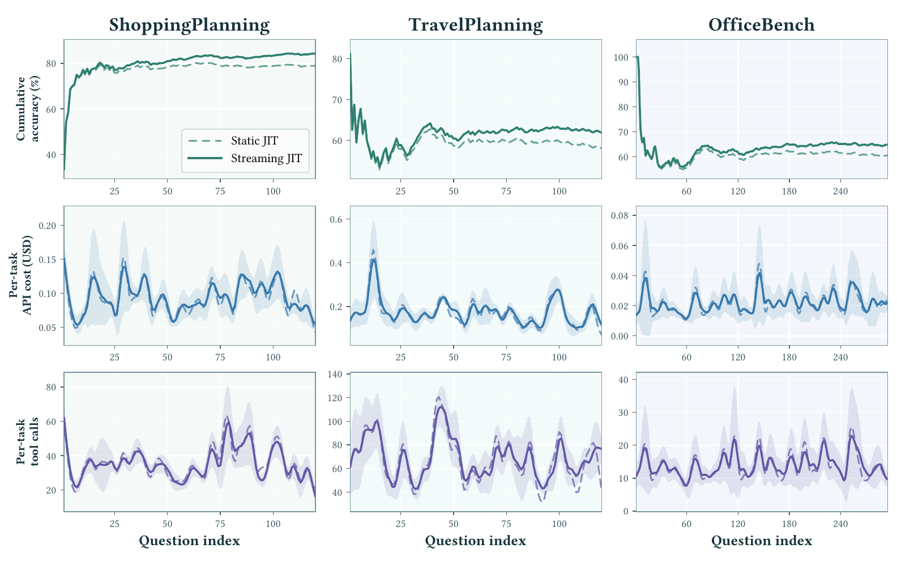

그림 6은 DeepPlanning-Shopping, DeepPlanning-Travel, OfficeBench 세 스트림에 대해 위에서부터 누적 정확도, 과제당 API 비용, 과제당 tool call을 그린다. 점선이 Static JIT, 실선이 Streaming JIT이고 음영은 스트리밍 궤적 주변의 국소 변동이다. 누적 정확도 패널에서 ShoppingPlanning은 두 곡선이 초반 급상승 후 약 $80\%$ 부근에서 갈라져 Streaming이 $84$ 근처, Static이 $79$ 근처로 끝나고, TravelPlanning은 초기 $80$대에서 떨어져 $60$대에서 안정되며 Streaming이 $62$ 근처, Static이 $58$ 근처로 마감하고, OfficeBench는 $100$에서 급락한 뒤 $60$대 초중반에서 Streaming이 $65$ 근처, Static이 $61$ 근처로 끝난다. 세 스트림 모두에서 누적 정확도 우위는 실행 피드백이 쌓이면서 나타나고 평가 종료까지 양(+)으로 유지된다. 함께 그려진 비용과 tool call 궤적은 두 모드가 대체로 겹친 채 과제별 변동만 크게 보이며(과제당 비용은 Shopping이 대략 $\$0.05$–$\$0.15$, Travel이 $\$0.1$–$\$0.4$대, OfficeBench가 $\$0.00$–$\$0.06$대, tool call은 Shopping이 $20$–$60$대, Travel이 $40$–$110$대, OfficeBench가 $10$–$20$대), 종점의 이득이 더 큰 상호작용 예산과 균일하게 결합되어 있지는 않음을 시사한다. 이 양상은 archive frontier를 전진시킬 때에만 하네스를 보존하는 Evo-GDPO의 목적과 부합한다.

## 🔬 생성된 하네스들은 실제로 어떻게 생겼나

### Palimpsest: 그래프로 계획된 artifact 실행

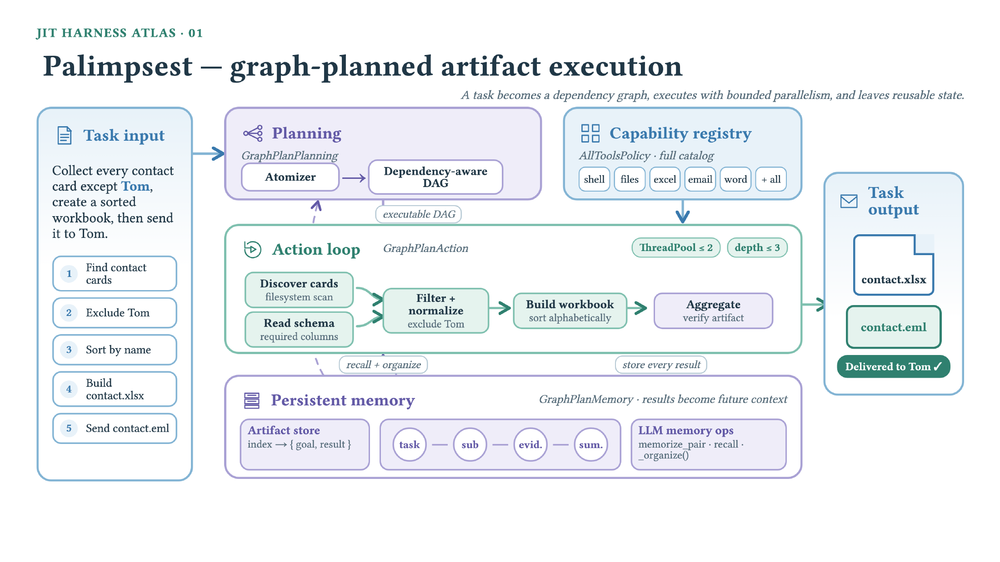

그림 5의 Palimpsest는 연락처 카드를 찾아내고, 레코드를 걸러 정규화하고, workbook을 만들고, 이메일로 전달하는 하네스다. 과제 입력은 "Tom을 제외한 모든 연락처 카드를 모아 정렬된 workbook을 만든 뒤 Tom에게 보내라"이고, 다섯 단계(find contact cards, exclude Tom, sort by name, build `contact.xlsx`, send `contact.eml`)로 쪼개진다. `GraphPlanPlanning`이 Atomizer를 거쳐 의존성 인지 DAG를 컴파일한다. 탐색이 필터링에 선행하고, workbook 구성은 정규화된 레코드를 기다리며, 전달은 artifact 검증 뒤에 온다. `GraphPlanAction`은 ThreadPool $\leq 2$, depth $\leq 3$의 한정된 폭과 깊이로 준비된 노드를 실행하는데, 파일시스템 스캔으로 카드를 발견하는 노드와 필요한 열의 schema를 읽는 노드가 병렬로 돌고 filter + normalize → build workbook(알파벳 정렬) → aggregate(artifact 검증)로 이어진다. Capability registry는 `AllToolsPolicy`로 shell·files·excel·email·word를 포함한 전체 카탈로그를 노출한다. `GraphPlanMemory`는 goal → result 인덱스의 artifact store, task–sub–evid.–sum. 체인, `memorize_pair`/`recall`/`_organize()` 같은 LLM memory op을 두어 목표·증거·artifact를 downstream 노드를 위해 보존한다. 이런 과제 형태에 맞춘 planning·memory·execution 조율은 프롬프트 변형을 넘어서서, 요청을 검증 가능한 생산 파이프라인으로 바꾼다.

### 재귀적 위임을 런타임 원시로 만들기: Trapdoor

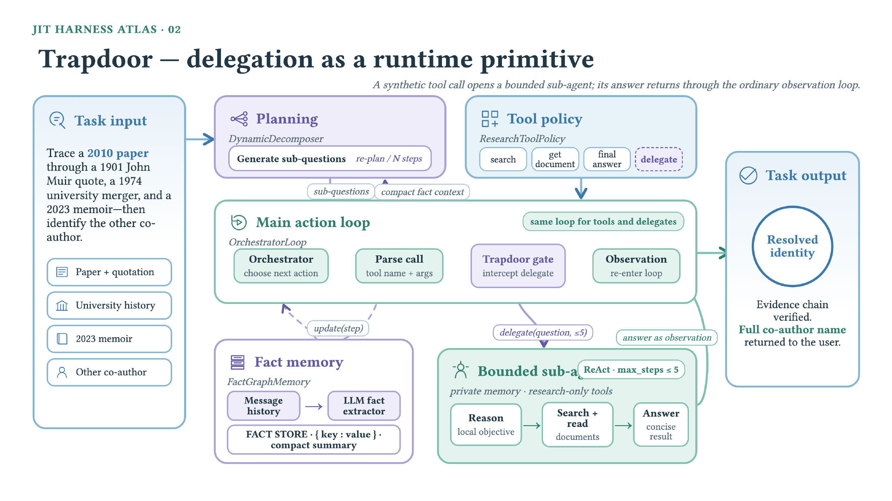

Trapdoor는 1901년 존 뮤어(John Muir) 인용문, 1974년 대학 합병, 2023년 회고록, 그리고 한 연구 논문에 단서가 흩어진 multi-hop 신원 확인 질문을 다룬다(그림 C.1은 2010년 논문을 추적해 다른 공저자를 찾는 과제로 제시한다). 여기서 고정 DAG는 불확실한 증거 경로에 너무 일찍 커밋해 버리므로, 생성된 하네스는 `DynamicDecomposer`로 하위 질문을 만들고 수정하며, research tool policy에 합성된 `delegate` capability를 덧붙인다. `delegate` 호출은 자체 메모리와 research 전용 도구, 5단계 예산을 가진 사적 research subagent를 여는데, 돌아온 답은 평범한 관측으로서 부모 루프에 재진입한다. 그림에서 이 흐름은 `OrchestratorLoop` 안의 Orchestrator(다음 행동 선택) → Parse call(도구 이름과 인자) → Trapdoor gate(delegate 가로채기) → Observation(루프 재진입)으로 나타나고, 도구와 delegate가 **같은 루프**를 쓴다는 점이 강조된다. 병렬로 `FactGraphMemory`는 메시지 히스토리에서 LLM fact extractor를 거쳐 압축된 key–value fact store와 요약을 만들어, 부모가 모든 subagent 트레이스를 물려받지 않고도 여러 분기의 증거를 통합하게 한다. 즉 이 하네스는 불확실성이 분기적 증거 수집으로 해소되는 과제에 한해 재귀적 research를 런타임 원시로 만든다.

### 메모리로 장기 지평 실행을 통제하는 두 방식: Origami와 Turnstile

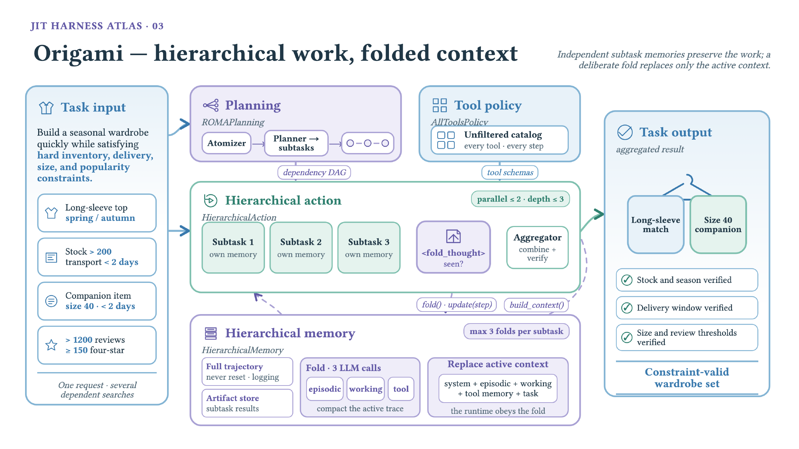

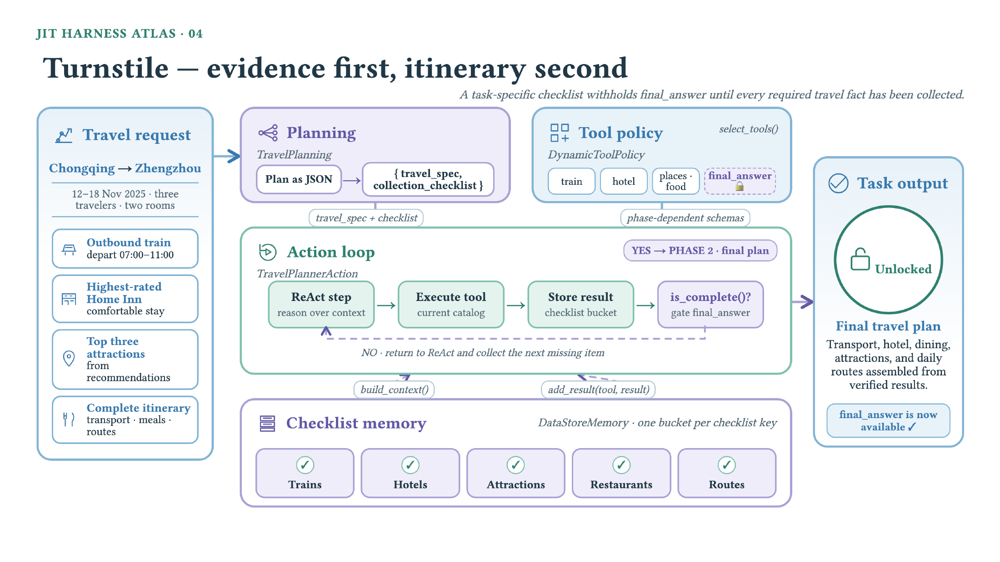

Origami는 재고, 배송, 사이즈, 리뷰 수, 평점이 서로 얽힌 제약 아래 계절 의류 세트를 구성해야 한다. `ROMAPlanning`이 요청을 의존적인 제품 검색들로 분해하고, `HierarchicalAction`이 최대 두 분기를 한정된 깊이까지 병렬로 돌리며, 각 분기가 자기 궤적과 artifact를 보유한다. 분기가 길어지면 `fold_thought`가 그 분기의 **활성 working context만** 교체하고, 완료된 subtask 결과는 최종 제약 검사를 위해 남는다. 조합적 쇼핑 과제에서 아직 해소되지 않은 부분에만 context를 쓰되 앞서 모은 제품 증거는 버리지 않는 설계다.

Turnstile은 날짜, 인원, 객실 수, 출발 시간대, 최고 평점 호텔, 관광지, 식사, 일별 동선을 지정한 여행 요청을 다룬다. 생성된 `TravelPlanning` 모듈이 이 의무들을 타입이 붙은 `travel_spec`과 수집 체크리스트로 컴파일하고, `DataStoreMemory`가 증거 종류마다 전용 bucket을 할당한다. `DynamicToolPolicy`는 비어 있는 bucket을 위한 검색 도구를 노출하되 `is_complete()`가 성공하기 전에는 `final_answer`를 내주지 않는다. 여기서 메모리는 긴 트레이스를 압축하는 데 주로 쓰이는 것이 아니라, 필요한 여행 사실이 모이기 전에 일정이 합성되는 것을 막는 **실행 가능한 coverage 계약**으로 작동한다.

### 명시적 상태가 이후 결정을 계속 재구성한다: Gearbox와 Pegboard

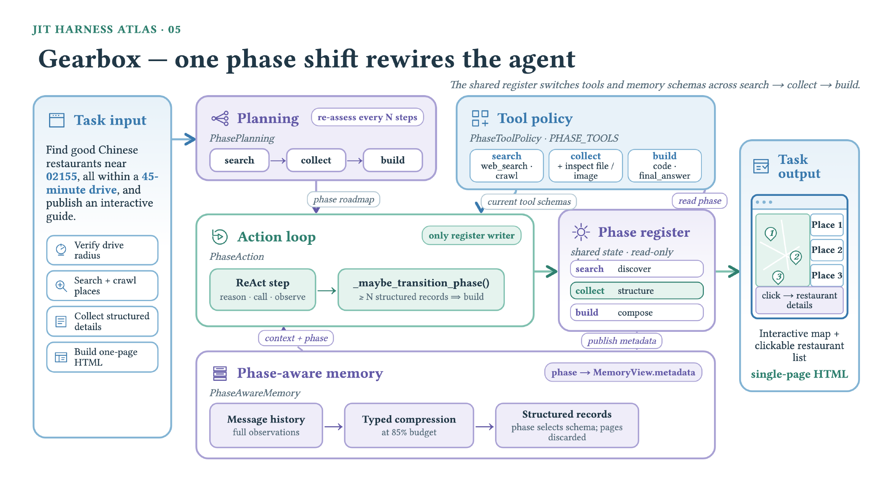

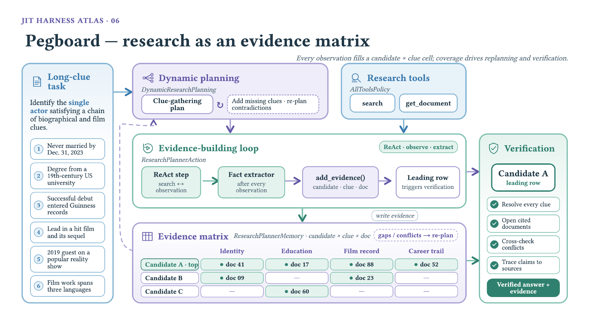

Gearbox는 지정된 운전 반경 안의 중국 음식점을 찾아 인터랙티브한 한 페이지 가이드로 발행하도록 생성됐다. `PhaseAction`이 공유된 *search–collect–build* 레지스터의 **유일한 writer**이고, 구조화된 음식점 레코드가 충분히 모인 뒤에야 build 단계로 전이한다. `PhaseToolPolicy`와 `PhaseAwareMemory`가 그 레지스터를 읽어 웹 발견 → 레코드 점검 → 코드 작성 및 발행으로 전환하면서, 관측을 현재 phase에 필요한 schema로 압축한다. 과제의 modality가 증거 수집에서 artifact 구성으로 바뀌기 때문에 모델이 phase machine을 만든 것이다.

Pegboard는 여섯 개의 전기적·영화적 단서로 정의된 신원 식별 문제를 다룬다. 진행 상태를 candidate $\times$ clue 행렬로 표현하며, 추출된 모든 주장이 문서 식별자를 유지한다. 빈 셀과 모순이 `DynamicResearchPlanning`을 표적 검색으로 몰고, 충분히 뒷받침된 행이 나타나면 인용 문서를 다시 열어 충돌을 해소하는 별도의 검증 phase가 발동된다. 일반적인 research transcript와 달리 이 상태는 coverage와 출처 provenance를 곧바로 행동 가능하게 만든다. Gearbox와의 대비는 생성되는 상태가 작은 phase 변수일 수도, 과제 형태에 맞춘 증거 구조일 수도 있음을 보여준다. 무엇이 다음 행동을 지배해야 하느냐에 달렸다.

### 이후 추론이 무엇을 넘겨받는가: Appraiser와 Abacus

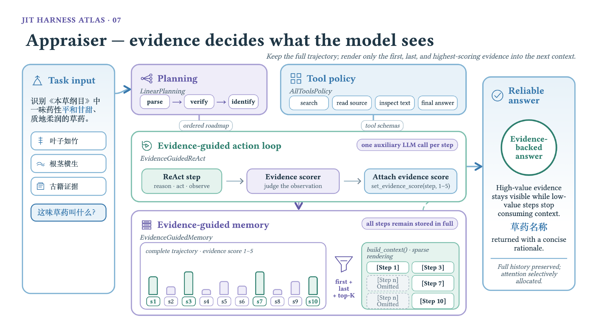

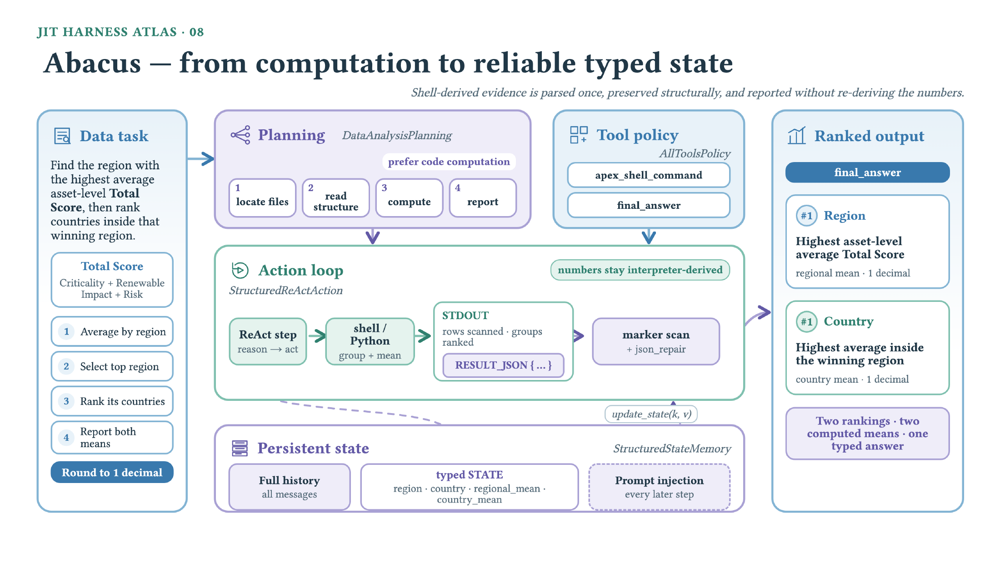

Appraiser는 식물학적 형질과 문헌 증거를 대조해 고전 본초 식별 질문에 답한다. 검색이나 읽기 단계마다 보조 scorer가 관측에 증거 가치를 매기고, `EvidenceGuidedMemory`는 감사를 위해 전체 궤적을 보관하되 다음 context에는 첫 번째, 마지막, 그리고 상위 $K$개 관측만 렌더링한다. 저가치 탐색이 식별에 가장 유용한 구절과 자리를 다투지 않게 되면서도 어떤 증거도 영구 히스토리에서 지워지지 않는다. 병목이 도구 선택이 아니라 증거 salience인 검색 과제에 맞춘 하네스다.

Abacus는 먼저 지역별 평균을 비교하고 이어 이긴 지역 안에서 국가 순위를 매기는 수치 분석 요청을 위해 생성됐다. 이 하네스는 집계를 언어 모델 추론 밖으로 의도적으로 옮긴다. `StructuredReActAction`이 shell 또는 Python을 호출하고, 표준 출력에서 표시된 `RESULT_JSON` payload를 추출하고, 필요하면 문법을 수리한 뒤 값을 `StructuredStateMemory`에 쓴다. region, country, regional mean, country mean이 이후 모든 단계에 타입이 붙은 상태로 주입되므로, 최종 답은 산문에서 값을 다시 유도하는 대신 인터프리터가 산출한 수치를 보고한다. 두 사례 모두 완전한 audit trail을 남기지만, 각자 과제의 지배적 신뢰성 요구 — 한쪽은 증거 선별, 다른 쪽은 수치 충실성 — 를 중심으로 working view를 렌더링한다.

### workspace 변경의 신뢰성, 두 스케일: Player Piano와 Mulligan

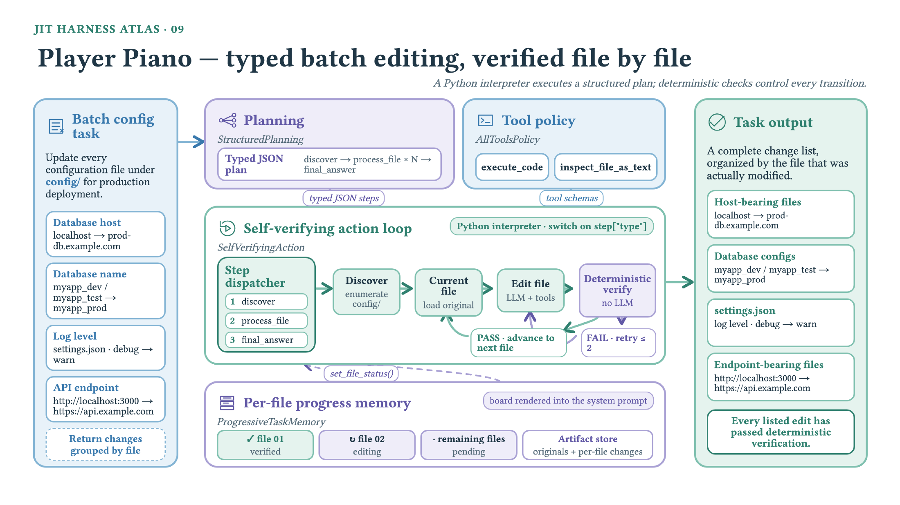

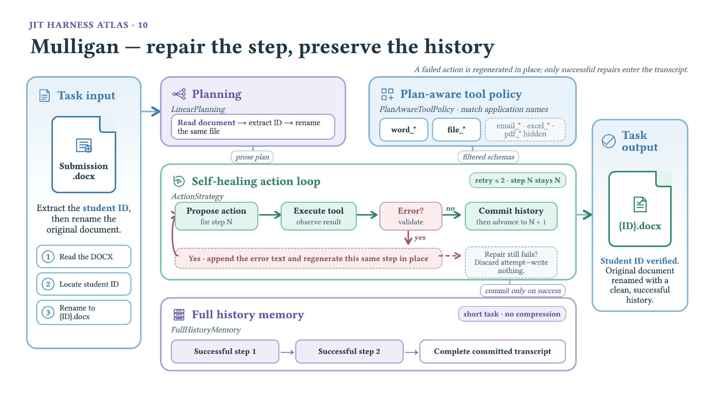

Player Piano는 데이터베이스, 로깅, API 엔드포인트 변경을 포함한 설정 파일 일괄 마이그레이션을 처리한다. `StructuredPlanning`이 타입이 붙은 *discover*, *process-file*, *final-answer* 단계를 내보내면 Python dispatcher가 그것을 실행하고, 편집마다 결정론적인 비-LLM 검사가 전진할지 재시도할지 결정한다. `ProgressiveTaskMemory`는 파일별 board를 시스템 프롬프트에 렌더링하고 원본과 승인된 변경을 모두 보관해, 큰 배치에서 어떤 파일이 실제로 검증을 통과했는지 놓치지 않게 한다.

Mulligan은 더 짧은 문서 과제 — DOCX 파일에서 학생 식별자를 추출해 그 파일의 이름을 바꾸는 것 — 를 위해 생성됐다. 선형 계획이라 계층 구조나 context 압축이 필요 없으므로, 하네스는 성공한 히스토리를 온전히 유지하고 Word와 파일 조작만 노출하며 관련 없는 이메일·스프레드시트·PDF 도구는 감춘다. 행동이 실패하면 루프가 오류를 국소적으로 덧붙이고 최대 두 번까지 같은 단계를 재생성하며, 성공한 행동만 커밋된 뒤 계획이 전진한다. 두 하네스는 신뢰할 수 있는 workspace 변경이라는 관심사를 공유하지만 실현 방식이 다르다. 한쪽은 타입이 붙은 배치 진행과 파일별 검증을, 다른 쪽은 좁은 도구 노출과 트랜잭션적 단계 수리를 쓴다. 이 과제 의존적 차이가 바로 JIT-Agent에서 기대하는 동작이다. 신뢰성 메커니즘이 하나의 보편 scaffold로 부과되는 대신 요청의 구조와 실패 표면에 맞게 생성된다.

## 🗂️ 하네스 최적화 패러다임 지도

표 4는 대표적인 하네스 최적화 방법들을 하네스가 **언제** 구성되는지, 그리고 개선의 어느 부분이 **학습되는지**로 정리한다. *Construction*은 ahead-of-time 탐색으로 찾은 하네스, ahead-of-time 하네스를 test-time 피드백으로 편집하는 것, 그리고 과제마다 just in time으로 생성되는 하네스를 구분한다. *Instance synthesis*, *Harness model*, *Learned repair*, *Online evolution*은 각각 인스턴스별 하네스를 직접 합성하는지, 생성기를 학습시키는지, 실패한 실행 궤적으로부터 수리를 학습하는지, 배포 이후에도 계속 개선하는지를 나타낸다. 이 비교는 경험적 성능의 순위가 아니라 **구조적** 비교이며, 어떤 능력이 최적화 절차에 내재적이고 어떤 것이 외부 탐색 연산으로 남는지를 밝히는 것이 목적이다.

| Method | Construction | Instance synthesis | Harness model | Learned repair | Online evolution |
|----|----|----|----|----|----|
| AutoHarness (Lou et al., 2026) | AOT (search) | ✗ | ✗ | ✗ | ✗ |
| Meta-Harness (Lee et al., 2026c) | AOT (search) | ✗ | ✗ | ✗ | ✗ |
| AHE (Lin et al., 2026) | AOT (search) | ✗ | ✗ | ✗ | ✗ |
| Adaptive AH (Liu et al., 2026b) | AOT (test-time editing) | ✗ | ✗ | ✗ | ✓ |
| TTHE (Nie et al., 2026) | AOT (test-time editing) | ✗ | ✗ | ✗ | ✓ |
| RHI (Lee et al., 2026a) | AOT (test-time editing) | ✗ | ✗ | ✗ | ✓ |
| Harness-R1 (Shao et al., 2026) | AOT (test-time editing) | ✗ | ✓ | ✓ | ✓ |
|  |  |  |  |  |  |
| **JIT-Agent (ours)** | **JIT** | ✓ | ✓ | ✓ | ✓ |

## ⚠️ 논문 자신이 인정하는 한계와 유보

저자들은 별도의 limitations 절을 두지 않았고, 유보는 결과 서술 안에 흩어져 있다. 첫째, 표 3의 6개 설정 중 2개에서 JIT-Agent는 최고 점수에 각각 $3.1$점과 $3.9$점 뒤진다. 저자들은 이것을 "어떤 고정 하네스도 모든 과제를 지배하지 못한다"는 확인으로 읽는다. 둘째, 표 2에서 DeepPlanning-Travel은 JIT을 장착한 GLM-5.2가 1위를 놓친 **유일한** 열이고, GPT-5.6과 $1.9$점 차로 뒤진다. 셋째, 그림 3에 대해 저자들은 DeepSeek-V4-Flash + JIT-Agent를 "평가된 쌍들 가운데(among the evaluated pairings)" 강한 파레토 최적 동작점이라고 조건을 달아 서술하고, 프론티어의 모양 자체가 과제 의존적임을 인정한다. AgentIF의 DeepSeek-V4-Flash 설정에서는 JIT-Agent가 Claude Code를 지배하는 것이 아니라 둘 다 프론티어 위에 놓인다. 넷째, 그림 6의 비용과 tool call 궤적에 대해 저자들은 "종점의 이득이 더 큰 상호작용 예산과 균일하게 결합되어 있지는 않음을 **시사한다**(suggest)"고 쓰고, 이 양상이 Evo-GDPO의 목적과 "부합한다(consistent with)"고만 말한다. 인과적 주장으로 나아가지 않는다. 다섯째, 표 4의 비교는 스스로 밝히듯 경험적 성능 순위가 아니라 구조적 분류다.

## 🧐 노트 작성자의 관찰

**세 단계의 기여가 분리되지 않았다.** Stage I(SFT + DPO), Stage II(repair imitation), Stage III(Evo-GDPO)를 각각 떼어낸 ablation이 없다. 그래서 표 2의 $+7.7$/$+8.8$이 어느 단계에서 왔는지 알 수 없고, 특히 Evo-GDPO의 기여는 그림 6의 static 대 streaming 비교로만 간접 추정된다. 그 비교조차 Stage III 학습 자체의 유무가 아니라 **추론 모드**의 차이를 재는 것이라 목적이 다르다.

**reliability 축의 수치가 하나도 없다.** 하네스 지능의 세 속성 중 reliability는 Stage II 전체의 근거인데, 논문은 생성된 하네스의 프로토콜 유효 비율, 첫 시도 실행 성공률, $K^{\star}=1$ 대 $K^{\star}=2$의 분포, 한정 수리 후에도 실패해 최소 reward를 받은 후보의 비율을 어느 것도 보고하지 않는다. adaptivity와 evolvability만 측정되고 reliability는 서술로 남는다.

**비용 회계가 JIT-Agent 자신의 비용을 제외한다.** 표 3과 그림 3의 "케이스당 API 비용"은 backbone 실행 비용으로 보이는데, 하네스를 생성하는 JIT-Agent-27B의 추론 비용, static inference의 $N$개 병렬 생성 비용, 그리고 한정 수리 라운드의 비용이 여기에 포함되는지 명시되지 않는다. Stage III의 보상 설계에서는 수리 latency와 cost를 "측정된 효율의 일부로 남긴다"고 못 박은 것과 대비되어, 평가 쪽 회계 기준이 불투명하다. $36.0\%$ 평균 절감이 이 항목들을 포함한 수치인지는 본문만으로 확정할 수 없다.

**재현에 필요한 상수가 대부분 비어 있다.** teacher $q_{\phi}$의 정체, 훈련 과제 수와 합성 과제 비율, $\alpha_{r},\alpha_{\ell},\alpha_{\kappa}$, $\lambda_{\mathrm{evo}}$, $w_{\mathrm{rew}},w_{\mathrm{lat}},w_{\mathrm{cost}}$, $\varepsilon_{\mathrm{num}}$, group 크기 $G$, static inference의 $N$, PPO clip과 KL 계수가 모두 수치 없이 기호로만 등장한다. 부등식 $w_{\mathrm{rew}}>w_{\mathrm{lat}}+w_{\mathrm{cost}}$ 같은 제약만 주어진다.

**평가 서브셋 크기가 표마다 다르다.** 그림 4는 DeepSearchQA 100예제, 나머지 세 벤치마크 50예제 서브셋을 명시하지만, 표 2와 표 3이 전체 벤치마크를 쓰는지 서브셋을 쓰는지는 적혀 있지 않다. 표 2의 DeepSeek-V4-Flash DeepSearchQA는 $76.2$인데 그림 4의 같은 backbone ReAct는 $66.1$이라 두 숫자가 다른 조건에서 나온 것임은 분명하다. 전자는 backbone의 기본 scaffold, 후자는 고정 ReAct 하네스라는 차이가 있지만 서브셋 차이도 함께 작용할 수 있어, 두 표 사이의 숫자를 직접 비교하면 안 된다. 마찬가지로 표 2의 JIT-Agent + DeepSeek-V4-Flash DeepSearchQA $85.1$과 그림 4의 $85.1$은 일치하는 반면 DeepPlanning-Shopping $83.9$도 일치하는데, 표 3의 DeepSeek-V4-Flash + JIT-Agent DeepSearchQA도 $85.1$이라 세 곳이 같은 실행을 공유하는 것으로 보인다. 그렇다면 표 2 역시 서브셋 평가일 가능성이 있고, 이 점이 명시되지 않았다.

**"18개 매칭 쌍 전부 개선"의 범위.** 이 주장은 GLM-5.2와 DeepSeek-V4-Flash 두 backbone에 대해서만 성립한다. 표 2의 다른 여섯 모델에는 JIT 버전이 없어서 하네스 교체 효과를 확인할 수 없다. 특히 GPT-5.6과 Gemini 계열 같은 폐쇄형 frontier 모델에 JIT 하네스를 씌웠을 때의 결과가 없으므로, "오픈 backbone이 frontier 모델을 넘어선다"는 프레이밍은 frontier 모델도 같은 처치를 받았을 때 어떻게 되는지를 열어 둔 채로 남는다.
