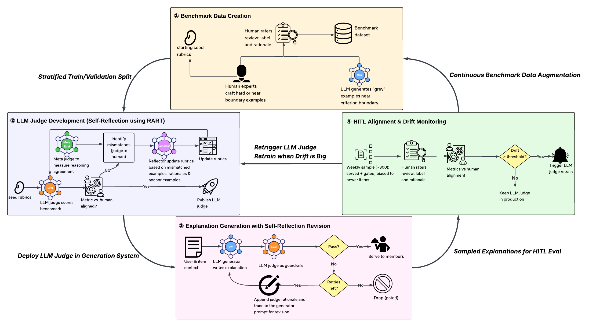
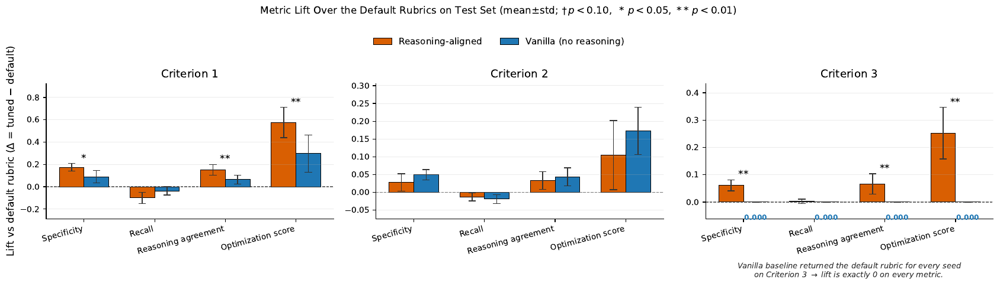
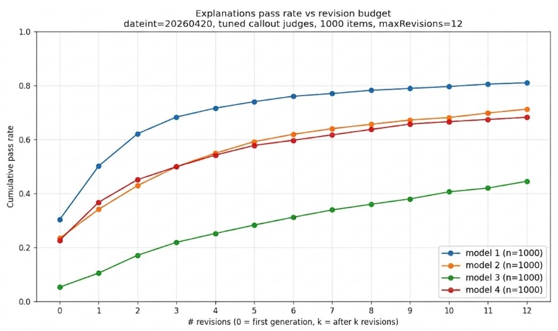

# The Lifecycle of LLM-as-a-Judge for Large-Scale Recommendation Explanations

Emma Yanyang KongJJ Tan, Ishan GuptaDavid FagnanLars OldsClaire CampbellRatna KavuriVeli BalinRohan GosainLouis GarciaMinsu JangNetflix, Los Gatos, California, USA (Work done while at Netflix.)

## Abstract

LLM-as-a-Judge, which leverages a large language model to evaluate natural language generated by another AI application or model, has become a standard, scalable approach for accelerating and extending costly human evaluation. Yet most work treats a judge as a static artifact, evaluating it once at construction or against a fixed benchmark. We argue instead that an LLM judge operating in a deployed system is better understood as having a *lifecycle*. It must be built, trained, deployed, and continuously maintained as the surrounding data evolves, and each phase poses distinct technical and operational challenges.

We present such a lifecycle for the LLM judges that evaluate recommendation explanations at Netflix. Everything we report comes out of a series of controlled online member-facing experiments, in which our pipeline generated and the judges assessed hundreds of thousands of distinct show-level explanations per week across a changing catalog. Our framework has four phases. **(I) Birth** defines the evaluation criteria and builds curated benchmark datasets with human labels and rationales. **(II) Training** refines the judges’ rubrics via *Reasoning-Aligned Rubric Tuning* (RART), which uses a meta-judge over reasoning output as the learning signal. **(III) Deployment** puts one judge in two online roles, quality gating and reflective generation. **(IV) Monitoring** runs a continuous Human-in-the-Loop (HITL) alignment process that detects drift and triggers re-tuning behind a human review gate. We report results from a five-week online A/B test over tens of millions of members on the Netflix mobile app. Against a no-explanation control, judge-aligned explanations shifted member viewing toward novel content (previously unwatched) and increased successful browse-to-play sessions, with no quality-related escalations.

[^1]

## 1 Introduction

A recommendation explanation, a short natural-language message accompanying a recommended item, shapes how users perceive and trust a recommender system. In our work, an explanation is human-readable evidence for *why* a title was recommended based on what the member has previously watched. We focus on *similarity-based* explanations, which connect a recommended title to one reference title the member has interacted with via shared attributes such as genre and tone, e.g., “A funny, heartfelt holiday romance about love and new beginnings, much like *My Secret Santa*.” These explanations aim to drive *content discovery* and build *trust* for our members, which is also why quality matters. A misleading or poorly grounded explanation erodes the very trust the feature is meant to build.

Evaluating quality at scale is hard. In our experiments the pipeline produced hundreds of thousands of distinct item-level explanations per week, any of which could reach members, and each must be accurate, item-specific, and free of sensitive or offensive content. Human evaluation, the gold standard, is not feasible at this volume. LLM-as-a-Judge (Zheng et al., 2023; Liu et al., 2023; Kim et al., 2024) offers a scalable proxy, but a judge is not a one-shot artifact. It must be initialized against trusted human labels, tuned to align with humans, deployed where it acts on live traffic, and maintained as the upstream data drifts. To our knowledge, no prior work characterizes all four phases as a single, instrumented lifecycle.

We therefore treat the judge not as a fixed evaluator but as a *lifelong agent*. It is a persistent component that must continually *learn* from accumulating human feedback and remain *aligned* with human judgment for the right reasons rather than by coincidence. It must also *evolve* through standing alignment audits and automated re-tuning, because the catalog, recommendation algorithms, and user population all shift.

In this paper, we present a case study of an LLM judge for recommendation explanations at Netflix, framed as a lifecycle (Figure 1) with four phases: **(I) Birth** (§4), **(II) Training** (§5), **(III) Deployment** (§6), and **(IV) Monitoring** (§7). Our contributions are:

1.  A lifecycle view of LLM judges in a large-scale recommender system, covering all four phases end to end.

2.  Reasoning-Aligned Rubric Tuning (RART), a rubric-refinement method that iteratively updates the judge’s rubric using a meta-judge over the judge’s reasoning, with an ablation isolating what reasoning alignment contributes.

3.  An operational design for serving, pairing a two-role deployment (quality gate and critic in a self-reflection revision loop) with continuous drift monitoring that triggers re-tuning behind a human review gate.

4.  Practical takeaways for shipping LLM judges at scale.

## 2 Related Work

#### Explainable recommendation.

Explaining *why* an item was recommended is a long-standing concern, from surfacing collaborative-filtering neighborhoods (Herlocker et al., 2000) to surveys organizing explanation aims and their evaluation (Tintarev and Masthoff, 2007; Zhang and Chen, 2020) around goals such as transparency, trust, and persuasiveness. Our similarity-based explanations sit in the transparency-and-trust branch of that taxonomy. What differs here is not the explanation style but the evaluation problem it creates. Free-form LLM text at catalog scale forfeits the template-level correctness earlier systems guaranteed by construction, so quality must itself be measured rather than assumed.

#### LLM-as-a-Judge.

Using an LLM to score another model’s output is now a standard substitute for costly human evaluation in open-ended generation (Zheng et al., 2023; Liu et al., 2023; Zhu et al., 2025; Kim et al., 2024). Such judges carry systematic biases, including sensitivity to answer position and verbosity (Wang et al., 2024) and a preference for their own generations (Panickssery et al., 2024), which is one reason we anchored ours to human labels and rationales at every phase. Public benchmarks such as JudgeBench (Tan et al., 2025) and RewardBench (Lambert et al., 2025) score judges on general-purpose correctness, safety, and instruction-following, but they are static and domain-general, and none treats the judge as something with a lifecycle to be re-validated after deployment. Our Phase I benchmark addresses that gap with a domain-specific, rationale-annotated dataset refreshed from live traffic.

#### Self-refinement and reflection.

Using a model’s own critique to improve its output without gradient updates has been explored for the generator (Self-Refine (Madaan et al., 2023), Reflexion (Shinn et al., 2023)) and, closer to our setting, for the judge. Meta-Rewarding (Wu et al., 2025) adds a meta-judge scoring the judge’s own reasoning. Our reasoning meta-judge $\mathcal{M}$ (§5.3) builds directly on this idea, with two differences that matter. First, it is grounded in human rationales rather than unsupervised self-consistency. Second, it deliberately targets fail examples, because in Phase III the judge’s rejection reason becomes the generator’s revision instruction, so a right-verdict but wrong-reason case propagates a misleading signal downstream.

#### Prompt and rubric optimization.

Textual analogues of gradient-based optimization revise a prompt or rubric from feedback rather than backpropagating through weights. They span evolutionary prompt search (EvoPrompt (Guo et al., 2024), Promptbreeder (Fernando et al., 2024)), textual gradients (TextGrad (Yuksekgonul et al., 2025), ACE (Zhang et al., 2026)), reflective evolution over a Pareto pool (GEPA (Agrawal et al., 2026), on DSPy (Khattab et al., 2024)), and rubric synthesis from chosen/rejected pairs (Liu et al., 2025). RART (§5.1) belongs to this family, closest to GEPA but a greedy, single-objective special case (§9). Its textual gradient is also computed over *rationale* mismatches, so that it targets reasoning quality and not just label accuracy. None of this work evaluates a judge continuously after deployment or ties re-tuning to a monitored drift signal. Our contribution is orthogonal and compatible. We show what changes when a judge is one node in a closed-loop live system rather than scored once against a fixed benchmark.

## 3 System Overview

Figure 1 summarizes the four phases and the artifacts flowing between them. LLM judges play three roles, the optimization target of Phase II, the feedback provider and guardrail decision-maker of Phase III, and the monitored object of Phase IV. Human labels and rationales are collected in Phase I and continuously augmented at $\sim$300/week in Phase IV. That phase closes two loops, a fast drift-detection loop that re-triggers Phase II re-training when judge–human agreement decays, and a slower benchmark-augmentation loop that keeps the Phase I dataset representative of the live catalog. Over the five-week A/B test of §6.2, the system evaluated hundreds of thousands of explanations per week, passing over 75% with a retry budget of 3.

*Figure 1: The four-phase lifecycle of an LLM judge for recommendation explanations. (I) Birth (§4) builds a benchmark of human-labeled, rationale-annotated examples. (II) Training (§5) has a reflector LLM tune each criterion’s rubric from judge–human label and *reasoning* mismatches. (III) Deployment (§6) gates generated explanations and drives self-reflective revision with bounded retries. (IV) Monitoring (§7) uses a weekly human-rated sample to detect drift and augment the benchmark, re-triggering (II) past threshold.*

## 4 Phase I: Birth, Establishing Ground Truth

The Birth phase is the most human-intensive of the four. Our internal writing experts define the criteria, author the labeling guidelines for human raters, hand-craft adversarial examples, and anchor human rating. The guidelines double as the seed rubrics for the LLM judges optimized in Phase II. Raters are trained and calibrated by our Human Data Operations team, whose protocol is internal and not detailed here. Every fail label carries a free-text rationale against the guideline.

Public LLM-judge benchmarks (Tan et al., 2025; Lambert et al., 2025) target general-purpose evaluation and miss the constraints of recommendation explanations, which are item-specific, context-dependent, and short. We therefore build a domain-specific benchmark of similarity-based explanations, each conditioned on a target item and one or two reference items the user has interacted with in the past. The criteria split into *must-have* pass/fail conditions that every explanation must satisfy before being shown, and softer stylistic and recommendation-relevance criteria (the specific criteria are withheld for confidentiality). For each criterion, the labeling guidelines, pass/fail conditions, and boundary examples are the sources of truth for both the LLM judges and the human raters.

The benchmark draws on three complementary sources: (i) expert-crafted examples, each with a human rater’s pass/fail label, its known failure mode, and a rationale for failure, covering cases the other two sources cannot reliably produce; (ii) human-rated, LLM-synthesized examples near the criterion boundary, capturing difficult cases that naturalistic sampling rarely surfaces; and (iii) sampled explanations from our explanation-generation system, collected before it was fully integrated into the serving pipeline.

At the start of the online experiments, the benchmark held roughly 900 human-labeled explanations, split close to evenly between the two labels with a slight majority of fail ($\sim$54%). We deliberately hold the classes near balance rather than matching the prevalence in generated samples, where failures are far rarer. Specificity (Eq. 1), $\mathrm{RA}_{\mathrm{neg}}$ (Eq. 3), and the training data of Algorithm 1 all depend on human-failed examples. As reported for Phase II, the alignment metrics of §5.2 therefore measure agreement on this class-balanced, difficulty-enriched benchmark, not defect rates on live traffic.

The dataset is not fixed. The Phase IV Human-in-the-Loop (HITL) pipeline (§7) appends $\sim$300 freshly rated explanations each week during tests, tracking distribution shift in the live catalog.

## 5 Phase II: Training, Aligning the Judge to Humans

We tune one judge per *must-have* criterion (§4), three in total, using self-reflection to iteratively refine that criterion’s rubric against human labels and their failure rationales. We call this procedure **Reasoning-Aligned Rubric Tuning** (RART). One key component of RART enforces *reasoning alignment* between the LLM judge and human raters.

### 5.1 Reasoning-Aligned Rubric Tuning (RART)

Each LLM judge is instantiated from a small, task-invariant prompt template. A fixed system message describes the evaluation task and carries a templated `<criterion>` slot holding the rubric being tuned; a user message supplies the explanation text and the target- and reference-item metadata. The judge emits a JSON object {`label`, `reason`} per explanation, so tuning reduces to refining the criterion rubrics while the surrounding prompt is held constant.

Given a rubric $R_{t}$ at iteration $t$, RART iterates the loop in Algorithm 1. It scores the data with the current judge $J(R_{t})$, checks validation metrics for early stopping, and otherwise asks a reflector LLM $\mathcal{R}$ to propose a refined rubric from the judge’s errors. Crucially, an “error” is not only a wrong label. Before reflecting, a *rationale meta-judge* $\mathcal{M}$ takes the examples that *both* the judge and the human labeled *fail* and compares the judge’s free-text reason against the human rationale (§5.3). The reflector therefore targets two error types, examples the judge mislabels and agreed-fail examples where it reaches the right verdict for the wrong reason. We write $\ell_{J}(x),\ell_{H}(x)$ for the judge and human labels on example $x$, and $r_{J}(x),r_{H}(x)$ for their respective reasons.

*Algorithm 1 Reasoning-Aligned Rubric Tuning*

    1: initial rubric $R_{0}$; train/val/test sets $\mathcal{D}_{\text{tr}},\mathcal{D}_{\text{val}},\mathcal{D}_{\text{te}}$; max iterations $N$
    2: Judges: rubric-conditioned judge $J(R)\!:\!x\mapsto(\ell_{J},r_{J})$ (label, rationale); rationale meta-judge $\mathcal{M}(r_{J},r_{H})\!\to\!\{\textsc{agree},\textsc{mismatch}\}$; reflector $\mathcal{R}(R,\textit{focus})\!\to\!R^{\prime}$ (revised rubric)
    3: tuned rubric $R^{\star}$
    4: $R^{\star}\leftarrow R_{0}$; $s^{\star}\leftarrow-\infty$
    5: for $t=0$ to $N-1$ do
    6:   Score $\mathcal{D}_{\text{tr}},\mathcal{D}_{\text{val}}$ with $J(R_{t})$ $\triangleright$ each $x$ gets $(\ell_{J},r_{J})$
    7:   $s\leftarrow$ weighted alignment metrics on $\mathcal{D}_{\text{val}}$ (§5.2)
    8:   if $s>s^{\star}$ then
    9:    $R^{\star}\leftarrow R_{t}$; $s^{\star}\leftarrow s$
    10:   end if
    11:   if all metrics clear the per-criterion bound then
    12:    break
    13:   end if
    14:   $\mathcal{X}\leftarrow\{x:\ell_{J}(x)\neq\ell_{H}(x)\}$ $\triangleright$ label mismatches
    15:   $\mathcal{N}\leftarrow\{x:\ell_{J}(x)=\ell_{H}(x)=\textsc{fail}\}$ $\triangleright$ agreed-fail (negative) examples
    16:   $\mathcal{N}_{\!\times}\leftarrow\{x\in\mathcal{N}:\mathcal{M}(r_{J}(x),r_{H}(x))=\textsc{mismatch}\}$ $\triangleright$ agreed-fail but wrong reason
    17:   $\textit{focus}\leftarrow\mathcal{X}\cup\mathcal{N}_{\!\times}$ $\triangleright$ label mismatch, or agreed-fail but wrong reason
    18:   $R_{t+1}\leftarrow\mathcal{R}(R_{t},\ \textit{focus})$ $\triangleright$ sample candidate rubric
    19: end for
    20: return $R^{\star}$

### 5.2 Alignment Metrics

We use three metrics aggregated over the benchmark dataset. Write $\ell_{J}(x),\ell_{H}(x)\in\{\textsc{pass},\textsc{fail}\}$ for the judge and human labels on example $x$.

**Specificity** (*fail-recall*) is the judge’s rate of correctly rejecting bad explanations. It is our most critical metric, since bad explanations that slip past the gate directly erode member trust:

$$\mathrm{Spec}\;=\;\frac{|\{x:\ell_{J}(x)=\textsc{fail},\,\ell_{H}(x)=\textsc{fail}\}|}{|\{x:\ell_{H}(x)=\textsc{fail}\}|}.$$ (1)

**Recall** (*pass-recall*) is the judge’s rate of correctly passing good explanations. High recall is also needed to keep explanation coverage high and revision cost low:

$$\mathrm{Rec}\;=\;\frac{|\{x:\ell_{J}(x)=\textsc{pass},\,\ell_{H}(x)=\textsc{pass}\}|}{|\{x:\ell_{H}(x)=\textsc{pass}\}|}.$$ (2)

**Reasoning agreement rate** ($\mathrm{RA}_{\mathrm{neg}}$) is the fraction of human-failed examples $\mathcal{F}=\{x:\ell_{H}(x)=\textsc{fail}\}$ on which the judge and the human not only both reject the explanation but also agree on *why* it fails. The numerator is restricted to the *agreed-fail* set $\mathcal{N}=\{x:\ell_{J}(x)=\ell_{H}(x)=\textsc{fail}\}\subseteq\mathcal{F}$, since reasoning can only agree where both labels are fail, while the denominator is all of $\mathcal{F}$. Agreement is decided by the rationale meta-judge $\mathcal{M}$:

$$\mathrm{RA}_{\mathrm{neg}}\;=\;\frac{|\{x\in\mathcal{N}:\mathcal{M}(r_{J}(x),r_{H}(x))=\textsc{agree}\}|}{|\mathcal{F}|}.$$ (3)

For rubric *optimization* during RART we collapse these into a single weighted score

$$s\;=\;w_{s}\,\mathrm{Spec}+w_{r}\,\mathrm{Rec}+w_{ra}\,\mathrm{RA}_{\mathrm{neg}}.$$ (4)

We weight specificity above the other two terms, $w_{s}=3$ and $w_{r}=w_{ra}=1$, because the two error types are not symmetric online. A bad explanation that escapes gating is served to members, whereas a good one that is rejected is only revised or dropped (§6.1). The $\mathrm{RA}_{\mathrm{neg}}$ term additionally favors rubrics whose rejections are backed by the right reason rather than by coincidence.

### 5.3 Reasoning-Aligned Self-Reflection

*Figure 2: Alignment-metric lift over the default rubric on the held-out test set for RART (rationale-aware reflection) vs. vanilla (label-only reflection), one panel per must-have criterion, $n{=}8$ seeds each reshuffling the train/validation/test split; bars show mean, error bars $\pm$std. All quantities are $\Delta=\text{tuned}-\text{default}$, so positive means improvement. Significance on $\Delta$ (RART$-$vanilla) by two-sided sign test: ^(†) $p{<}0.10$, ^(∗) $p{<}0.05$, ^(∗∗) $p{<}0.01$.*

Treating every disagreement uniformly ignores that mismatches differ in information content. The judge may agree on the label for the wrong reason, or disagree on the label while its rationale exposes a genuine rubric ambiguity. Building on the *meta-judge* idea (Wu et al., 2025), we introduce a *reasoning meta-judge* $\mathcal{M}$ that compares the judge’s reason against the human rationale and returns rationale_agreement or rationale_mismatch. We run $\mathcal{M}$ only on agreed-fail examples, where a shared “fail” label can still hide divergent reasons. The rationale mismatches it finds join the label mismatches in the reflector’s focus set, and agreements are left untouched so the rubric preserves what the judge already gets right.

Restricting $\mathcal{M}$ to agreed-fail examples is also a deployment requirement. In Phase III (§6) the same judge is the critic in a self-reflection loop, where its rejection reason becomes the generator’s revision instruction, so a right-verdict but wrong-reason rejection propagates a misleading signal. Unlike Meta-Rewarding (Wu et al., 2025), whose meta-judge is unsupervised, ours is grounded in human rationales. The signal is a text “gradient” in the spirit of TextGrad (Yuksekgonul et al., 2025), ACE (Zhang et al., 2026), and GEPA (Agrawal et al., 2026), but computed over rationales rather than generations, and complementary to rubric synthesis from chosen/rejected pairs (Liu et al., 2025).

#### Validating the meta-judge.

$\mathcal{M}$ supplies both our reasoning-agreement metric and the training signal for RART, so we validate it against humans directly. Trained raters independently labeled rationale agreement on a sample of 300 agreed-fail rationale pairs, and $\mathcal{M}$’s verdicts matched their judgments $98.6\%$ of the time, supporting its use as both an evaluation metric and a learning signal.

To isolate the contribution of the reasoning signal, we compare RART against *vanilla*, an identical loop whose reflector sees only label mismatches, on each of the three must-have criteria (Figure 2; $8$ seeds, held-out test). RART improves our most important metric, *specificity*, more than vanilla wherever the default rubric leaves headroom. On criterion 1 this comes with a recall cost, which is acceptable because a falsely rejected explanation re-enters the revision loop (§6.1) and is regenerated, whereas a bad explanation that reaches members cannot be recalled. On criterion 3, label-only vanilla collapsed specificity and reasoning agreement in every iteration. The best-checkpoint rule of Algorithm 1 therefore returned essentially the default rubric, leaving its lift at $\approx 0$, whereas RART lifts both metrics and even improves recall slightly. On criterion 2 the default rubric is already near ceiling and the two methods are indistinguishable. Reasoning alignment therefore helps where there is room and does not hurt where there is none, and across all three must-have criteria the headroom the default rubric leaves is what governs how much RART can gain.

## 6 Phase III: Deployment, Putting the Judge to Work

The tuned judge from §5 serves two online roles on every generated explanation. As a *gate* it rejects explanations failing a configurable subset of criteria. As the *critic* in a self-reflective revision loop it returns flagged explanations to the generator. Explanations are generated per recommended item rather than per (user, item) pair; an online personalization model then selects the best-fitting explanation for each pair. A single explanation can therefore be shared across many users.

### 6.1 Judge as Guardrail with Bounded-Retry Revision

In the serving pipeline every explanation passes through a *generate $\rightarrow$ judge $\rightarrow$ revise* loop with a fixed retry budget. The generator drafts an explanation conditioned on the style (which captures the user cohort), target item, and reference item(s); the tuned judge scores it against the criteria of §4, emitting a pass/fail label and reason per criterion. If all criteria pass, the explanation is *served*; if any fails, the judge’s reason is appended to the generator prompt and the generator is re-invoked, up to $K$ retries, and an explanation still failing after $K$ attempts is *dropped*. We write $k$ for the retry index and $K$ for the deployed budget. Dropping rather than serving a flagged explanation is a deliberate asymmetry. A bad explanation is a trust hazard (§5.2), whereas a missing one merely forgoes an opportunity.

#### Cumulative pass rate vs. revision budget.

Figure 3 reports cumulative judge pass rate versus retry budget $k$ on a sample of $n{=}1000$ generated explanations across four generator models. Pass rate rises monotonically in $k$ because the judge’s free-text `reason` steers the next draft, but returns diminish fast. The three strong generators capture $\geq 80\%$ of their achievable lift by $k{=}3$–$4$, which motivates a small fixed $K$. Revision only partly rescues weak generators (model 3 stays below 50% even at $k{=}12$), so a sustained drop in the $k{=}0$ pass rate signals a generator-side regression rather than judge drift. We deploy $K{=}3$ with the strongest model, which captures most of the achievable lift while bounding per-explanation cost; at this budget the end-to-end pipeline runs at a few thousand US dollars per week in inference cost.

*Figure 3: Cumulative judge pass rate vs. revision budget $k$ on $n{=}1000$ generated explanations across four generator models. Gains are monotonic but flatten beyond $k{\approx}4$. The weakest generator (model 3) stays well below the others. This implies judge-guided revision amplifies a capable generator rather than substituting for one.*

### 6.2 Online A/B Evaluation

High offline judge–human alignment and low judged defect rates are *necessary* for explanations to benefit users, but not *sufficient*. They certify that served explanations meet our quality bar, not that having explanations improves user experience. To test the latter directly, we ran a large-scale A/B test on the mobile surface, comparing the judge-aligned explanation pipeline (§5–6) against a no-explanation control over tens of millions of members for five weeks. Treatment shifted member viewing toward *novel content*, i.e., titles the member had not previously watched, by $+0.2\%$ relative ($p<0.05$), consistent with explanations helping members discover unfamiliar titles rather than only reinforcing already-familiar viewing. We also observed a $+0.3\%$ relative increase in *sessions with a successful play* ($p<0.05$), indicating that members more often found something to watch during a browse session, which we read as reduced browse friction. These relative lifts are small in absolute value, but at our scale they correspond to a substantial aggregate effect, and movements of this magnitude are considered meaningful for a feature-level intervention on this surface. Judge-aligned explanations are therefore not just *quality-compliant* but also *useful*. As further supporting evidence, we observed no user-initiated escalations related to explanation quality during the online test.

## 7 Phase IV: Monitoring, Keeping the Judge Aligned

A judge well-aligned at deployment will not stay aligned. The catalog shifts (new categories, seasonal content), and the meaning of “high-quality” itself can evolve. Phase IV closes the loop. Each week we draw a $\sim$300-explanation sample from the generated pool for HITL evaluation, stratified across the judge’s decision outcomes (*served without revision*, *served after revision*, *dropped*) and biased toward newer catalog items where drift is most likely. The stratification is fixed week to week, so successive weeks are comparable. Human raters label the sample under the guidelines of §4. The relabeled sample drives drift detection and is also appended to the train/validation pool, keeping the benchmark live (the *continuous benchmark augmentation* of Figure 1), subsampled to preserve class balance. Each explanation is reviewed by at least three raters and we take the majority label as ground truth. That panel gives us both a consensus reference and a direct measure of rater disagreement, and that disagreement is what sets the bar for the judge.

For each alignment metric $M$ of §5.2, we score the judge and each individual rater against the same majority label on the same weekly sample. This yields one value $M(J)$ for the judge and a set $M(H)=\{M(h_{1}),\dots,M(h_{R})\}$ of per-rater values, $R\geq 3$, whose mean and standard deviation we compute directly across raters. We require

$$M(J)\;\geq\;\mathrm{mean}\big(M(H)\big)\;-\;2\,\mathrm{sd}\big(M(H)\big),$$ (5)

that is, the judge must score no worse than two standard deviations below the average rater, where the standard deviation measures disagreement among the raters themselves. Falling below the band on any metric raises an *alert*.

Equation 5 is deliberately not a fixed threshold. A harder weekly sample raises human disagreement, widening $\mathrm{sd}(M(H))$ and with it the acceptance band, so the judge is not penalized for difficulty that humans also find hard. We apply the criterion both to the full weekly sample and separately to newly added titles, where catalog shift appears first and where a threshold calibrated on established content would misfire. Requiring no degradation on new titles is what makes the loop a shift detector rather than a generic regression test.

A drift event triggers Phase II re-tuning on the augmented benchmark, and the new rubric is staged behind a manual review gate before deployment, with the previous rubric retained for rollback. Across every weekly sample drawn during the large-scale online A/B test (§6.2), the judge stayed within the human band on every metric, including on newly added titles, so no re-tuning was triggered. The loop still matters going forward because the catalog, recommender algorithms, and user population keep changing, so today’s agreement says little about tomorrow’s.

Beyond the aggregate metric, the weekly human review repeatedly surfaced failure patterns that a per-criterion agreement score alone would not flag. Some are borderline cases whose pass/fail depends on how confidently the explanation is phrased rather than on the underlying recommendation quality. Others are concentrated in specific genres, as with stand-up comparisons where two specials share surface-level tags but sit in very different cultural contexts. A third group passes every must-have criterion yet still reads as confusing or oddly framed. None of these necessarily move the agreement metrics, yet each calls for a change to the rubrics themselves. When a pattern recurs, our writing and review experts revise the labeling guidelines of §4, and we re-tune the affected judges against the revised guidelines through Phase II. Because those guidelines are the source of truth for both the raters and the judges’ seed rubrics, one revision updates both sides of the comparison at once. Continuous review surfaces the qualitative, long-tail issues that quantitative drift detection is blind to, catching emerging gaps in the rubric itself and not just degradation relative to it.

## 8 Takeaways

Operating this lifecycle at scale surfaced three lessons we expect to transfer to other teams shipping LLM judges. First, *invest in the benchmark before the judge*. A modest, rationale-annotated benchmark is worth more than a large label-only one, because the rationales are what make reasoning-aligned tuning possible. Second, *one tuned judge can serve many roles*. Reusing it for gating and for generation critique reduces alignment cost and keeps online behavior consistent. Third, *plan monitoring from day one*. A recommender platform’s items and users constantly evolve, so its LLM judges, like any lifelong agent, must be monitored and re-tuned.

## 9 Limitations and Future Work

### 9.1 Limitations

Our evaluation has several scope boundaries. All of it comes from controlled experiments running over months rather than from continuous operation, so we cannot say how the lifecycle behaves across the year-scale shifts it is designed for. The A/B test (§6.2) covers one surface (mobile) and one explanation family (similarity-based), so we do not know whether the same lifecycle and magnitude of lift transfer elsewhere. It also reports only the metrics we judged most relevant to discovery. RART is validated against a label-only ablation but not against general-purpose textual optimizers such as GEPA or TextGrad. The drift-triggered re-tuning path has not yet fired online, so its automated response is validated only offline. Appendix A covers the rest.

### 9.2 Future Work

We see four natural extensions of RART. First, recasting rubric tuning as *memory management*. A benchmark too large to reflect over in one pass would be consumed in chunks, with the tuner consolidating reasoning from earlier chunks into a persistent scratchpad that steers each update. That scratchpad is a *long-term memory*, which new Phase IV rationales would update incrementally instead of triggering a full re-tune, complemented by a *short-term memory* of few-shot examples retrieved per instance. Second, reasoning-finetuning the judge on accumulated rationales while text-space rubric optimization handles online adaptation. Third, casting reasoning-aligned tuning as *reflective prompt evolution* in the style of GEPA (Agrawal et al., 2026), of which RART is a greedy special case; a Pareto pool would trade off our three metrics directly. Fourth, promoting the judge from evaluator to *reward model*. A rubric-tuned judge already emits a reason and a label, which is the shape a reasoning reward model needs, and the same artifacts could post-train the generator rather than only gate and critique it at inference time. Here the asymmetry of §5.2 suggests a *constrained* objective rather than the weighted score $s$ (Eq. 4). Each must-have criterion would be held at its operating point as a constraint while the softer criteria are optimized, instead of fixing the trade-off in advance through $w_{s}$.

## References

- Agrawal et al. (2026) L. A. Agrawal, S. Tan, D. Soylu, N. Ziems, R. Khare, K. Opsahl-Ong, A. Singhvi, H. Shandilya, M. J. Ryan, M. Jiang, C. Potts, K. Sen, A. G. Dimakis, I. Stoica, D. Klein, M. Zaharia, and O. Khattab GEPA: reflective prompt evolution can outperform reinforcement learning. In The Fourteenth International Conference on Learning Representations (ICLR), External Links: Link <https://openreview.net/forum?id=RQm2KQTM5r>
- Fernando et al. (2024) C. Fernando, D. Banarse, H. Michalewski, S. Osindero, and T. Rocktäschel Promptbreeder: self-referential self-improvement via prompt evolution. In Proceedings of the 41st International Conference on Machine Learning (ICML), Proceedings of Machine Learning Research, Vol. 235, pp. 13481–13544. External Links: Link <https://proceedings.mlr.press/v235/fernando24a.html>
- Guo et al. (2024) Q. Guo, R. Wang, J. Guo, B. Li, K. Song, X. Tan, G. Liu, J. Bian, and Y. Yang Connecting large language models with evolutionary algorithms yields powerful prompt optimizers. In The Twelfth International Conference on Learning Representations (ICLR), External Links: Link <https://openreview.net/forum?id=ZG3RaNIsO8>
- Herlocker et al. (2000) J. L. Herlocker, J. A. Konstan, and J. Riedl Explaining collaborative filtering recommendations. In Proceedings of the 2000 ACM Conference on Computer Supported Cooperative Work (CSCW), New York, NY, USA, pp. 241–250. External Links: Document <https://dx.doi.org/10.1145/358916.358995>
- Khattab et al. (2024) O. Khattab, A. Singhvi, P. Maheshwari, Z. Zhang, K. Santhanam, S. Vardhamanan, S. Haq, A. Sharma, T. T. Joshi, H. Moazam, H. Miller, M. Zaharia, and C. Potts DSPy: compiling declarative language model calls into state-of-the-art pipelines. In The Twelfth International Conference on Learning Representations (ICLR), External Links: Link <https://openreview.net/forum?id=sY5N0zY5Od>
- Kim et al. (2024) S. Kim, J. Shin, Y. Cho, J. Jang, S. Longpre, H. Lee, S. Yun, S. Shin, S. Kim, J. Thorne, and M. Seo Prometheus: inducing fine-grained evaluation capability in language models. In The Twelfth International Conference on Learning Representations (ICLR), External Links: Link <https://openreview.net/forum?id=8euJaTveKw>
- Lambert et al. (2025) N. Lambert, V. Pyatkin, J. Morrison, L. Miranda, B. Y. Lin, K. Chandu, N. Dziri, S. Kumar, T. Zick, Y. Choi, N. A. Smith, and H. Hajishirzi RewardBench: evaluating reward models for language modeling. In Findings of the Association for Computational Linguistics: NAACL 2025, L. Chiruzzo, A. Ritter, and L. Wang (Eds.), Albuquerque, New Mexico, pp. 1755–1797. External Links: Document, Link <https://dx.doi.org/10.18653/v1/2025.findings-naacl.96> <https://aclanthology.org/2025.findings-naacl.96/>
- Liu et al. (2025) T. Liu, R. Xu, T. Yu, I. Hong, C. Yang, T. Zhao, and H. Wang OpenRubrics: towards scalable synthetic rubric generation for reward modeling and LLM alignment. External Links: 2510.07743, Link <https://arxiv.org/abs/2510.07743>
- Liu et al. (2023) Y. Liu, D. Iter, Y. Xu, S. Wang, R. Xu, and C. Zhu G-Eval: NLG evaluation using GPT-4 with better human alignment. In Proceedings of the 2023 Conference on Empirical Methods in Natural Language Processing, H. Bouamor, J. Pino, and K. Bali (Eds.), Singapore, pp. 2511–2522. External Links: Document, Link <https://dx.doi.org/10.18653/v1/2023.emnlp-main.153> <https://aclanthology.org/2023.emnlp-main.153/>
- Madaan et al. (2023) A. Madaan, N. Tandon, P. Gupta, S. Hallinan, L. Gao, S. Wiegreffe, U. Alon, N. Dziri, S. Prabhumoye, Y. Yang, S. Gupta, B. P. Majumder, K. Hermann, S. Welleck, A. Yazdanbakhsh, and P. Clark Self-Refine: iterative refinement with self-feedback. In Advances in Neural Information Processing Systems, Vol. 36, pp. 46534–46594. External Links: Link <https://proceedings.neurips.cc/paper_files/paper/2023/hash/91edff07232fb1b55a505a9e9f6c0ff3-Abstract-Conference.html>
- Panickssery et al. (2024) A. Panickssery, S. R. Bowman, and S. Feng LLM evaluators recognize and favor their own generations. In Advances in Neural Information Processing Systems 37 (NeurIPS 2024), External Links: Link <https://proceedings.neurips.cc/paper_files/paper/2024/hash/7f1f0218e45f5414c79c0679633e47bc-Abstract-Conference.html>
- Shinn et al. (2023) N. Shinn, F. Cassano, A. Gopinath, K. Narasimhan, and S. Yao Reflexion: language agents with verbal reinforcement learning. In Advances in Neural Information Processing Systems, Vol. 36, pp. 8634–8652. External Links: Link <https://proceedings.neurips.cc/paper_files/paper/2023/hash/1b44b878bb782e6954cd888628510e90-Abstract-Conference.html>
- Tan et al. (2025) S. Tan, S. Zhuang, K. Montgomery, W. Y. Tang, A. Cuadron, C. Wang, R. A. Popa, and I. Stoica JudgeBench: a benchmark for evaluating LLM-based judges. In The Thirteenth International Conference on Learning Representations (ICLR), External Links: Link <https://openreview.net/forum?id=G0dksFayVq>
- Tintarev and Masthoff (2007) N. Tintarev and J. Masthoff A survey of explanations in recommender systems. In 2007 IEEE 23rd International Conference on Data Engineering Workshop (ICDEW), pp. 801–810. External Links: Document <https://dx.doi.org/10.1109/ICDEW.2007.4401070>
- Wang et al. (2024) P. Wang, L. Li, L. Chen, Z. Cai, D. Zhu, B. Lin, Y. Cao, Q. Liu, T. Liu, and Z. Sui Large language models are not fair evaluators. In Proceedings of the 62nd Annual Meeting of the Association for Computational Linguistics (Volume 1: Long Papers), L. Ku, A. Martins, and V. Srikumar (Eds.), Bangkok, Thailand, pp. 9440–9450. External Links: Document, Link <https://dx.doi.org/10.18653/v1/2024.acl-long.511> <https://aclanthology.org/2024.acl-long.511/>
- Wu et al. (2025) T. Wu, W. Yuan, O. Golovneva, J. Xu, Y. Tian, J. Jiao, J. E. Weston, and S. Sukhbaatar Meta-rewarding language models: self-improving alignment with LLM-as-a-meta-judge. In Proceedings of the 2025 Conference on Empirical Methods in Natural Language Processing, C. Christodoulopoulos, T. Chakraborty, C. Rose, and V. Peng (Eds.), Suzhou, China, pp. 11537–11554. External Links: Document, Link <https://dx.doi.org/10.18653/v1/2025.emnlp-main.583> <https://aclanthology.org/2025.emnlp-main.583/>
- Yuksekgonul et al. (2025) M. Yuksekgonul, F. Bianchi, J. Boen, S. Liu, P. Lu, Z. Huang, C. Guestrin, and J. Zou Optimizing generative AI by backpropagating language model feedback. Nature 639 (8055), pp. 609–616. External Links: Document, Link <https://dx.doi.org/10.1038/s41586-025-08661-4> <https://www.nature.com/articles/s41586-025-08661-4>
- Zhang et al. (2026) Q. Zhang, C. Hu, S. Upasani, B. Ma, F. Hong, V. Kamanuru, J. Rainton, C. Wu, M. Ji, H. Li, U. Thakker, J. Zou, and K. Olukotun Agentic context engineering: evolving contexts for self-improving language models. In The Fourteenth International Conference on Learning Representations (ICLR), External Links: Link <https://openreview.net/forum?id=eC4ygDs02R>
- Zhang and Chen (2020) Y. Zhang and X. Chen Explainable recommendation: a survey and new perspectives. Foundations and Trends in Information Retrieval 14 (1), pp. 1–101. External Links: Document <https://dx.doi.org/10.1561/1500000066>
- Zheng et al. (2023) L. Zheng, W. Chiang, Y. Sheng, S. Zhuang, Z. Wu, Y. Zhuang, Z. Lin, Z. Li, D. Li, E. P. Xing, H. Zhang, J. E. Gonzalez, and I. Stoica Judging LLM-as-a-judge with MT-bench and chatbot arena. In Advances in Neural Information Processing Systems 36 (NeurIPS 2023) Datasets and Benchmarks Track, External Links: Link <https://proceedings.neurips.cc/paper_files/paper/2023/hash/91f18a1287b398d378ef22505bf41832-Abstract-Datasets_and_Benchmarks.html>
- Zhu et al. (2025) L. Zhu, X. Wang, and X. Wang JudgeLM: fine-tuned large language models are scalable judges. In The Thirteenth International Conference on Learning Representations (ICLR), External Links: Link <https://openreview.net/forum?id=xsELpEPn4A>

## Appendix A Additional Limitations

Beyond the boundaries stated in §9.1, three further caveats apply. We withhold several system details for confidentiality, including the specific definitions of the must-have criteria and the generator and judge model identities. Our meta-judge validation (§5.3) measures agreement on rationale-agreement classification, a narrower and simpler task than full explanation judging, so it should not be read as evidence that the primary judge matches human judgment at a comparable rate. Finally, the primary judge and the rationale meta-judge $\mathcal{M}$ are built on the same base model family, so their errors are plausibly correlated; the human validation of $\mathcal{M}$ bounds this concern but does not remove it.

[^1]: Accepted at the 2nd Workshop on Lifelong Agents: Learning, Aligning, and Evolving and at the AIMS Workshop (*AI Measurement Science: Toward Rigorous AI Evaluation*), both co-located with COLM 2026.
