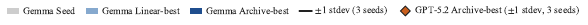

# Metan: Recursive Self-Improvement through Emergent Depth

Zae Myung Kim (University of Minnesota), Young-Jun Lee (University of Minnesota), Seungyeon Jwa (Seoul National University), Dongyeop Kang (University of Minnesota)

## Abstract

Self-improving LLM agents refine answers, not the *process* that produces those answers. Systems that add a meta-level hold that level fixed, and those that edit themselves must leave part of their own editing machinery untouched to stay stable, capping the *meta-depth* they realize at roughly two. We present **Meta^(*n*)**, which keeps the meta-operation fixed and recurses on its input instead. That operation, $\Omega$, is applied repeatedly to its own products, reading the traces of the solver stack below together with the code that produced them, then writing the next layer as a strategic pre-process and a library of callable helpers. Because $\Omega$ never changes, it cannot destabilize the system, and because its input strictly grows, each layer reasons from a higher vantage than the last. Depth is set by convergence rather than fixed in advance, and an evolutionary archive searches over layer chains. Across two backbones, Meta^(*n*) outperforms prior self-improving agents on all eight benchmark families. The sharpest case is ARC-AGI-2, built to resist skill memorization, where it alone scores above zero. Ablations indicate that most of the gain from recursion comes from the conditioning each layer passes to the next, and distinct layer roles emerge with depth although no prompt prescribes them. Code available at <https://github.com/minnesotanlp/meta-n>

![Two-part figure. Left: an orange nested-layer architecture in which Meta-Layer n contains Meta-Layer 3, which contains Meta-Layer 2, which contains Layer 1, which contains a white box labelled Base Solver. Ellipses indicate omitted intermediate layers. Three callouts on the left point toward successive layers: “Meta-strategist, Architect”, “Algorithm librarian, Task router”, and “Generic remediator”. A dark banner below reads “Emerging Roles at Depth”. Right: line chart with vertical axis “Validation Score”, labelled ticks 0.75, 0.80, and 0.85 at 0.05 intervals, and horizontal axis “Evolution Iteration” with ticks 4, 8, 12, 16, and 20. No point values are printed, so the following values are approximate readings from the axes. The legend entries are “Agentic (Ours)” with circle markers, “Single-shot (Ours)” with diamond markers, “OpenEvolve” with square markers, “Gödel Agent” with triangle markers, and “Held-out” with star markers. Agentic (Ours) rises from about 0.807 at iteration 1 through about 0.825, 0.832, and 0.834 over the next few iterations, reaches about 0.846–0.847 by iteration 6, and then visibly plateaus through roughly iteration 10. Single-shot (Ours) starts near 0.77, climbs through approximately 0.78, 0.79, and 0.80, fluctuates around 0.80–0.82, briefly reaches about 0.83 near iteration 10, then settles near 0.81 from about iteration 11 through iteration 21. OpenEvolve is about 0.747 at iteration 1, about 0.773 from iterations 2–5, jumps to about 0.795 at iteration 6, stays near 0.795 through iteration 20, and ends near 0.800 at iteration 21. Gödel Agent begins near 0.740, increases gradually through about 0.745, 0.750, and 0.760, remains around 0.760 through roughly iteration 7, rises to about 0.773 around iterations 8–10, then reaches and largely follows a plateau near 0.800 from about iteration 11 onward. Held-out star markers are visible near 0.81–0.82 for the two Ours curves and near 0.78 for Gödel Agent. A red dashed oval highlights the early convergence of the two Ours curves, and a dark callout at the upper right reads “Faster Convergence &\nStronger Generalization”.](images/2608.24735v1/paper_at_glance.png)

*Figure 1: Meta^(n) at a glance. *(left)* A single universal meta-operation $\Omega$ is applied recursively, each meta-layer wrapping the stack below it (Base Solver $\to$ Layer 1 $\to$ Meta-Layers $2,3,\dots,n$). Roles emerge with depth without manual design. *(right)* Search progress on LawBench charge prediction, where both Meta^(n) variants climb faster and settle higher than Gödel Agent (Yin et al., 2024) and OpenEvolve (Sharma, 2025).*

## 1 Introduction

A key component of intelligence is the capacity for meta-reasoning, the ability to step outside one’s own chain of reasoning and arrive at insights that lie beyond it (Russell and Wefald, 1991; Kounios and Beeman, 2014; Ackerman and Thompson, 2017). But how can a system get outside itself? In *Gödel, Escher, Bach* (Hofstadter, 1979), Hofstadter argues that intelligence and the sense of self emerge not from any single rule but from *strange loops*, that is, self-referential processes in which a system’s own rules, applied recursively, fold back to operate on their own products. Today’s self-improving LLM agents fall short of exactly this. They write algorithms for NP-hard optimization, operate terminal environments, and propose mathematical constructions, yet the dominant response to failure is self-refinement (Madaan et al., 2023; Shinn et al., 2023) (examine, revise, retry), a single layer of reflection in which the same mechanism generates, diagnoses, and repairs. **Existing agents improve answers, not the process by which answers are improved.**

Recent work adds an explicit *meta*-level: evolutionary methods maintain populations of candidate programs (Romera-Paredes et al., 2024; Novikov et al., 2025; Sharma, 2025); self-modifying agents rewrite portions of their own source code (Yin et al., 2024; Zhang et al., 2025a; Zhang et al., 2026; Zelikman et al., 2024); meta-scaffolding systems search over the infrastructure around a base model (Hu et al., 2025; Zhang et al., 2025b; Lee et al., 2026; Fernando et al., 2024; Agrawal et al., 2026; Liu et al., 2026). **But the meta-mechanism itself is fixed.** Search loops, mutation operators, and selection rules are not revised, and every system that does edit itself must hold some driver layer fixed for stability, capping realized meta-depth at ${\sim}2.5$. We make these terms precise in §2.1 (Figure 2; full comparison in Appendix B).

We build **Meta^(*n*)** around this principle. Rather than rewriting the improver itself, we hold a single universal meta-operation $\Omega$ fixed and apply it again and again to its own outputs, *“given the full execution context of the system below you, write code that improves it.”* The loop folds back through $\Omega$’s own accumulated products. Because $\Omega$ takes its own prior outputs as input, each level sees more of the system beneath it than the last, moving from surface bugs to strategic choices to meta-strategic reasoning (Figure 1). As an isolation check, removing recursion from Meta^(*n*) drops CO-Bench archive-best validation from 0.845 to 0.714, a $+0.131$ gain from recursion alone. The effect reproduces on a second backbone and a second benchmark, and is largest where the inner loop leaves the most room (§3).

#### A concrete example.

On CO-Bench’s `assignment_problem`, a single LLM call produces a script that imports `scipy.optimize`; the sandbox lacks scipy, the script crashes, the task scores 0.0. A flat self-refinement loop retries variations of the same import-based solution. Meta^(*n*)’s depth-2 $\Omega$, looking at all 36 tasks at once, observes that *several* fail with similar dependency errors and decides to emit a pre-process *plus* a code-library helper: “do not use scipy; here is a `validate_output()` utility.” The depth-2 solver re-implements the Hungarian algorithm and scores 1.0. Depth 3 then sees both the new traces and the depth-2 code that produced them, and determines whether to keep, refine, or override. A flat loop, seeing only traces, cannot perform such reasoning. Repeated applications of $\Omega$ build a stack in which each layer is both a *producer* of code (guidance and library functions) and the *subject* of the next $\Omega$ call. We do not pre-assign layer depth, but let it grow until $\Omega$ stops finding improvements. Deeper layers learn **when** to apply, suppress, or combine primitives, because each $\Omega$ call sees the prior layers’ code together with how it performed.

Across eight benchmarks spanning combinatorial optimization, text classification (Symptom2Disease and LawBench), terminal agent tasks, mathematical discovery (AlphaEvolve Math and ARC-AGI-2), symbolic regression, and algorithm speedup, Meta^(*n*) substantially improves single-call solvers without within-task iteration. Its largest margins over prior self-improving agents come on the hardest benchmarks. On ARC-AGI-2 (Chollet et al., 2026)’s held-out split, for instance, Meta^(*n*) is the only system to solve any task at all, where both OpenEvolve and Gödel Agent solve none.

**Our contributions.** (1) **The Meta^(*n*) framework (§2):** a recursive architecture in which one universal meta-operation $\Omega$, applied repeatedly, builds a hierarchical agent stack whose depth is set by convergence. To our knowledge, the first demonstration that meta-depth beyond two yields structurally distinct levels rather than redundant ones. (2) **Evolutionary orchestration (§2.4):** a multi-candidate archive search over layer chains. (3) **Empirical evidence (§3):** across eight benchmarks and two backbones, Meta^(*n*) outperforms prior self-improving agents on every benchmark family, with the largest margins on the hardest held-out tasks.

## 2 Meta^(*n*): Evolutionary Meta-Recursion

#### Overview.

We build Meta^(*n*) from a single fixed meta-operation $\Omega$, applied recursively to its own previous outputs. Each application inspects how the solver stack below performed across the whole task set, then writes the next layer’s code, a short Python *pre-process* that injects strategic context before each task plus a small *library of reusable helper functions* the solver may call. The next application sees both the new performance traces and *the code that produced them*, so it can judge whether the previous layer’s idea was a good one, rather than only whether an answer was wrong. The stack deepens by itself and halts when progress does. §2.1 organizes existing meta-improvement approaches into paradigms and locates this design as a new one among them, §2.2 defines a single Meta^(*n*) layer, §2.3 analyzes what recursion gains over the single layer, and §2.4 presents the orchestrators that grow the stack.

#### Problem formulation.

A benchmark supplies $N$ tasks $\mathcal{T}=\{t_{1},\dots,t_{N}\}$ and an evaluator that scores any candidate script on a task, $\mathrm{eval}(t_{i},s)\in[0,1]$ (on LawBench, one such task is *charge prediction*, scored by F1). Every solver run leaves an *execution trace* $\tau$ (the script that ran, its stdout/stderr, exit code, score, and any evaluator feedback) that $\Omega$ can later inspect to diagnose what happened. A **base solver** $S_{1}$ is any one-shot or agentic LLM procedure that maps a task $t_{i}$ to its trace $\tau_{i}^{(1)}$; in our experiments $S_{1}$ is either a single LLM call or an 8-turn observe/act loop, but Meta^(*n*) is agnostic to this choice. Our goal is a stack of solvers $\{S_{d}\}_{d=2}^{n}$, each one wrapping the one below, that maximizes the mean score $\bar{S}=\tfrac{1}{N}\sum_{i}\mathrm{score}(\tau_{i}^{(d)})$. The depth $n$ is not fixed in advance; it grows until improvements stop (symbol glossary in Appendix Table 4).

### 2.1 Paradigms of Meta-Improvement

![Three side-by-side schematic panels. Left panel heading “(1) Hand-crafted one-layer meta-improvement.” A top agent circle labelled v^1 receives Input from the left and sends Output to the right; Input and Output also route downward and inward to a single Meta-improvement process box outside the agent, whose arrow points down to a second agent circle labelled v^2. The v^2 circle likewise has Input entering from the left and Output leaving to the right, followed by a vertical ellipsis. Middle panel heading “(2) Self-referential one layer meta-improvement.” A v^1 agent circle receives Input and produces Output, with a single Meta-improvement process box inside the circle; side paths from Input and Output feed the internal box, and a downward arrow leads to a v^2 agent circle containing another single internal process box. The v^2 circle also has Input and Output side paths, followed by a vertical ellipsis. Right panel heading “(3) Recursive n-layer meta improvement (ours).” Three vertically arranged agent circles labelled v^1, v^2, and v^3 each receive Input from the left and send Output to the right, with downward arrows connecting successive versions. The v^1 circle contains one Meta-improvement process box; v^2 contains a recursively nested stack of two process boxes; v^3 contains a recursively nested stack of three process boxes, followed by a vertical ellipsis. The legend at lower left shows a circle labelled “Agent,” a single rectangle labelled “Meta-improvement process,” and a larger outlined rectangle containing a smaller rectangle labelled “Recursive stacking of meta-improvement process.”](images/2608.24735v1/meta_improv_concept_diffs.png)

*Figure 2: Three paradigms of meta-improvement. Circles are agents (successive versions $v^{1},v^{2},\dots$); amber boxes are meta-improvement processes, and *nested* boxes denote recursively stacked meta-processes. (1) Hand-crafted one-layer meta (e.g., FunSearch, AlphaEvolve, ADAS): a fixed, external meta-process rewrites the agent, but the meta-mechanism itself never changes. (2) Self-referential one-layer meta (e.g., Gödel Agent, DGM): the agent edits its own source, yet a driver layer stays fixed, capping realized meta-depth at ${\sim}2.5$. (3) Recursive $n$-layer meta (Meta^(n), ours): one meta-operation $\Omega$ is applied at every depth and *accumulates*, so version $v^{d}$ carries $d$ nested meta-processes; depth is set by convergence, and each added layer observes a broader landscape of trajectories than the one below.*

To make “depth of self-improvement” comparable across systems, we fix three terms. Relative to a level-0 *solver*, a level-1 process modifies the solver, a level-2 process modifies the level-1 process, and so on. A *driver* is a component that controls such modification but itself never modified during a run. The *realized meta-depth* of a system is then the highest level whose behavior actually changes over the course of a run, as opposed to the depth its architecture nominally permits. Under these terms, prior self-improving systems fall into two paradigms, and Meta^(*n*) constitutes a third (Figure 2).

**(1) Hand-crafted meta-systems** place a fixed search or evolution loop *outside* the solver. Evolutionary program search maintains populations of candidate programs (Romera-Paredes et al., 2024; Novikov et al., 2025; Sharma, 2025); meta-scaffolding systems search over the prompts, workflows, or agent designs around a base model (Hu et al., 2025; Zhang et al., 2025b; Lee et al., 2026; Fernando et al., 2024; Agrawal et al., 2026). These systems are stable and auditable precisely because the meta-process is frozen; search loops, mutation operators, and selection rules are never revised. The solver improves; the improver does not. Realized meta-depth is 1.

**(2) Self-referential agents** internalize the meta-process by letting the agent edit its own source code (Yin et al., 2024; Zhang et al., 2025a; Zelikman et al., 2024; Zhang et al., 2026). In principle this permits unbounded depth; in practice every such system holds some driver fixed to keep from corrupting itself: Gödel Agent’s action API, DGM’s archive maintenance and parent selection, HyperAgents’ outer evaluation loop. The editable surface is therefore a strict subset of the improvement machinery, capping realized meta-depth at ${\sim}2.5$. The agent modifies the solver (level 1), and because the modification logic lives inside the source being edited, self-edits also change how future self-edits proceed (level 2). But as the frozen driver sits inside every higher level, nothing above level 2 ever changes in full; thus the half-credit (i.e., 0.5) records this partial modifiability (per-system details are provided in Appendix B).

Together the two paradigms expose a dilemma. *Recursing the improver buys depth only at the price of stability*, and (to the best of our knowledge,) every extant system resolves the tension by freezing a driver, which caps the very depth the recursion was meant to deliver.

**(3) Recursive $n$-layer meta (Meta^(*n*)).** Meta^(*n*) dissolves the dilemma rather than trading along it. The improver is frozen *by design*, a single fixed LLM-prompted operation $\Omega$, and the recursion is applied to its *input* instead. Because $\Omega$ consumes its own accumulated products (the traces of the stack below *and* the code stack that produced them), each application operates on inputs of strictly higher order than the last. The operation itself never mutates, so it cannot destabilize the system. We do not fix depth in advance, but let it grow until $\Omega$ stops finding improvements (§2.3).

### 2.2 The Meta-Layer at Depth $d$: $\Omega$ and $M_{d}$

![Build-step diagram with a vertical stack on the left and three code snippets on the right. On the left, S₁, base, has score 0.767 and feeds downward into Ω; Ω produces C₂, connected by a dotted line to the first snippet, and the next state is S₂=M₂(C₂,S₁) with score 0.807. A second Ω produces C₃, connected to the second snippet, and the next state is S₃=M₃(C₃,S₂) with score 0.773, the only decreased score. A third Ω produces C₄, connected to the third snippet, and the final state is S₄=M₄(C₄,S₃) with score 0.833. The top snippet reads `def fuzzy_match_label(predicted: str,` followed by a line declaring `labels` as a list of `str` returning `str`, then `"""Matches a predicted label string` and `to the closest official label..."""`. The middle snippet reads `def reconcile_labels(predicted_str: str,` followed by a line declaring `official_labels` as a list of `str` returning `str`, then `"""Reconciles the predicted label string."""`; beneath it is a quoted directive containing `perform an 'Exhaustive Legal Analysis'` and `EVERY plausible charge ...`. The bottom snippet reads `# Roll back from "Exhaustive Analysis"`\n`# to "Structured Analysis" as it`\n`# caused a regression.` followed by `"Use the reconcile_labels function` and `from solver_lib to clean and validate...`. Thus C₂ adds `fuzzy_match_label`, C₃ adds `reconcile_labels` together with the over-prescriptive directive, and C₄ rolls the directive back while retaining the helper.](images/2608.24735v1/build_step.png)

*(a) Build-step: $\Omega$ writes layers 2 to 4.*

*(b) Run-step: $S_{4}$ executes the task.*

*Figure 3: The two phases of a meta-layer, traced through a LawBench *charge prediction* run (task score $\in[0,1]$). (a) Build-step: each $\Omega$ call reads the traces of the stack below, and from depth 3 its code as well, then writes the next layer’s code $C_{d}$. Depth 2 emits the helper fuzzy_match_label; depth 3 adds reconcile_labels but couples it to an over-prescriptive *“Exhaustive Legal Analysis”* directive that regresses the score; depth 4 rolls that directive back while keeping the helper. (b) Run-step: the finished $S_{4}=M_{4}\!\circ\!M_{3}\!\circ\!M_{2}\!\circ\!S_{1}$ threads the task inward to the base solver and merges the accumulated helpers into the final script.*

A single meta-layer at depth $d$ unfolds in two phases, a *build-step* that *writes* the layer (executed once, offline) and a *run-step* that *executes* the layer (per task, online). Figure 3 traces both phases through a LawBench *charge prediction* run (map a criminal-case description to the official charge labels), our running illustration for the rest of the section. Figure 3(a) shows $\Omega$ writing layers 2 to 4; Figure 3(b) shows the finished depth-4 stack executing a task. The build-step calls $\Omega$ to inspect the previous depth’s traces and emit new code $C_{d}$; the run-step uses a wrapper $M_{d}$ to slot $C_{d}$ around the existing solver and run a task through the resulting stack.

#### Build-step (writing the layer): the driver $\Omega$.

$\Omega$ is a fixed LLM-prompted procedure, i.e., one prompt template that does not change between depths or benchmarks. Given the previous depth’s traces $\{\tau_{i}^{(d-1)}\}_{i=1}^{N}$, the stack of code earlier rounds emitted $[C_{2},\dots,C_{d-1}]$, the task descriptions $\mathcal{T}$, and the current depth $d$, $\Omega$ writes a new piece of code:

$$\Omega:\big(\{\tau_{i}^{(d-1)}\}_{i=1}^{N},\;[C_{2},\dots,C_{d-1}],\;\mathcal{T},\;d\big)\;\longmapsto\;C_{d}.$$ (1)

The output $C_{d}=(f_{\text{pre}}^{(d)},\mathcal{L}^{(d)})$ is a pair. The *pre-process* $f_{\text{pre}}^{(d)}$ is a small Python function that runs before each solver call and injects strategic context. In Figure 3(a), the depth-3 $f_{\text{pre}}^{(3)}$ demands an *“Exhaustive Legal Analysis”* of every plausible charge, while the depth-4 version instead tells the solver to clean its labels with `reconcile_labels`. The *code library* $\mathcal{L}^{(d)}$ holds reusable Python functions the solver may call, such as `fuzzy_match_label()` emitted at depth 2 and `reconcile_labels()` added at depth 3. Concretely, $\Omega$’s response contains a `rationale` block, a `pre_process` block, and zero or more `solver_lib:<name>` blocks, one per library function (full depth-2 example in Appendix F).

Holding $\Omega$ fixed makes the design principle of §2.1 operational, since any gain at depth $d{>}2$ must then come from richer *input* rather than a changed improver. The only part that adapts with depth is the trace summary $\Omega$ ingests. Its formatting depends on depth, and from depth 3 upward it shifts attention from individual errors to patterns across the stack (details in Appendix E.2). This formatting partly scaffolds the tactical-versus-strategic *division of attention* analyzed in §3, but it only shapes what each layer *sees*; no prompt prescribes the code a layer writes.

#### Run-step (executing the layer): the wrapper $M_{d}$.

When task $t_{i}$ comes in at depth $d$, the wrapper $M_{d}$ slots $C_{d}$ around the previous solver $S_{d-1}$ in five stages, sketched in Figure 3(b). On the way in, (1) the outermost $f_{\text{pre}}^{(d)}$ runs first and produces a strategic-context string $\text{ctx}_{d}$ for this task, and (2) $\text{ctx}_{d}$ threads inward through the pre-processes of the layers below, each refining it. On the way out, (3) the base solver sees the merged contexts and returns a script $s$, (4) the union code library $\mathcal{L}^{(2)}\!\cup\!\cdots\!\cup\!\mathcal{L}^{(d)}$ is prepended to $s$, with deeper layers overriding by name on collisions, and (5) the result is sandbox-executed to produce a depth-$d$ trace $\tau_{i}^{(d)}$. Because $M_{d}$ does not touch the inner solver’s internals, wrappers compose cleanly, so the depth-$n$ solver is just nested calls bottoming out at the base solver $S_{1}$:

$$S_{d}\;=\;M_{d}(C_{d},S_{d-1})\;=\;M_{d}\circ M_{d-1}\circ\cdots\circ M_{2}\circ S_{1}.$$ (2)

$M_{d}$ never mutates the inner solver, the task object, or earlier layers’ libraries, and $M_{d}$ statically validates and smoke-tests injected code in an isolated namespace before prepending it (rationale and safeguards in Appendix D).

### 2.3 Compositional Recursion: Strategies, Tactics, and What $\Omega$ Sees

Recursion buys two things over a flat improver, *multiplicative coverage* of the strategy/tactic space and *strictly richer input* to the improver itself. The first is about the behaviors a $d$-layer stack can express when it runs; the second is about what $\Omega$ has to look at when it writes the next layer.

#### Strategies condition tactics.

During the run-step, each pre-process receives the context string of the layer above and emits its own for the layer below, $f_{\text{pre}}^{(d-1)}(t_{i},\,\text{ctx}_{d})\rightarrow\text{ctx}_{d-1}$. Layers therefore condition one another; the context a layer emits is shaped by the context threaded down from above, so a deeper layer sets a frame that shallower layers fill in. With $k_{d}$ distinct behaviors at depth $d$, conditioning admits up to $\prod_{d=2}^{n}k_{d}$ joint configurations, against the $\sum_{d}k_{d}$ available to an unconditioned flat architecture with the same behaviors (at $n{=}4$ and $k_{d}{=}3$, 27 vs. 9). This is an *upper bound on expressible configurations*, not a measured count. Its measured signature appears in §3 as the gap between archive-best and best-single-chain scores, together with an ablation attributing most of the recursion gain to this conditioning channel. Figure 3(b) shows the conditioning at work. The outermost layer runs first and sets the strategic frame, and each inner layer refines the guidance within that frame. The base solver then receives the merged contexts of all layers together with the union library.

Conditioning also means layers can *interfere*. A deeper layer’s prescription can override useful shallower guidance, and we observe such per-task regressions in practice (quantified in §3). The running example is one such cycle. In Figure 3(a), the depth-3 directive regresses the score from $0.807$ to $0.773$ even though the helper shipped alongside it is sound. Because the depth-4 $\Omega$ reads the code stack $[C_{2},C_{3}]$ as well as the traces (Eq. 1), it can attribute the regression to the directive rather than the helper. Its rationale states the rollback explicitly (*“roll back from Exhaustive Analysis to Structured Analysis as it caused a regression”*), and its $C_{4}$ restores the earlier strategy while keeping `reconcile_labels`, recovering to $0.833$. Interference is thus a cost of expressiveness rather than a bug in it, and it is repaired at two levels, within a chain by $\Omega$ itself, as here, and across chains by the archive and consolidation mechanisms of §2.4.

#### What $\Omega$ sees vs. what flat self-refinement sees.

A flat self-refinement loop at iteration $j$ observes only the traces of its first $j{-}1$ iterations, an accumulating log of *what happened* that never includes the code *that made it happen*. By construction, $\Omega$ at depth $d\geq 3$ sees both the previous depth’s traces *and* the code stack $[C_{2},\dots,C_{d-1}]$ that produced them. This enables higher-order reasoning that a flat loop cannot perform however many iterations it runs, such as the rollback in Figure 3(a) (*“$C_{3}$’s directive over-constrained the analysis; roll it back at depth 4”*). Whenever $C_{d-1}$ produces observable changes, $\Omega$’s information at depth $d$ is a strict superset of its information at depth $d{-}1$. The fixed-driver systems of §2.1 sit between the two. Their improver sees only what their editable layers produced, a strict subset of what Meta^(*n*)’s $\Omega$ sees. Meta^(*n*) thus reframes the design problem. **The gain comes from giving $\Omega$ more to read, not from rewriting $\Omega$ itself.** §3 isolates this claim empirically; removing recursion while leaving the orchestration unchanged lowers scores on every backbone and benchmark we ablate, and the drop is largest where the base solver is weakest.

### 2.4 Orchestration: Linear and Evolutionary Modes

Two orchestrators grow the stack on top of $\Omega$ and $M_{d}$, a simple linear deepener and an evolutionary archive search.

#### Linear meta-recursion.

The simplest orchestrator greedily deepens the stack one layer at a time. Starting from the base solver $S_{1}$, at each step $\Omega$ observes the current traces and produces a new $C_{d}$, which the wrapper $M_{d}$ composes onto $S_{d-1}$ to form $S_{d}$. The loop stops when (a) $\Omega$ returns empty code, (b) $P$ consecutive layers fail to improve the mean score by more than a scale-aware tolerance $\epsilon\cdot R$ ($R$ is the score range frozen at run start), or (c) a max depth $D$ is reached. Depth is therefore set by convergence rather than prescribed in advance; in practice no reported run reaches the cap.

#### Evolutionary archive.

Linear recursion is fragile to one unlucky $\Omega$ call; a single poor injection ends the chain even if a different injection at the same depth would have unlocked further progress. The evolutionary variant (Algorithm 1, Appendix E.1) hedges by maintaining a *monotonically growing* archive $\mathcal{A}$ of candidate chains and searching over it instead of greedily extending one. Each iteration samples $B$ parents with weight $w(c)\propto\bar{S}(c)+\alpha/(1+\text{children}(c))$, so high scores are preferred and the $\alpha$ term acts as an exploration bonus favoring chains extended less often. Each parent yields $K$ children, with $\Omega$’s sampling temperature cycled for diversity; on any task where the parent underperforms the archive, *cross-candidate inspiration* appends the best rival trace to $\Omega$’s prompt. The archive also tracks the best score any chain achieves on each task; the mean of these per-task bests is the *archive-best* $\bar{S}^{\star}$, reported alongside the best-single-chain score in every results table. The distance between them is what the archive gains by letting different tasks be won by different chains. The loop terminates after $P$ consecutive non-improving iterations.

#### Consolidation guard.

Because deeper layers can regress individual tasks (§2.3), the orchestrator also supports a *consolidation* mode in which each candidate targets a single focus task while inheriting the archive’s frozen best traces for all others, making the per-task-best trajectory monotone *by construction*. We claim this mode for its zero-regression guarantee rather than for mean lift (study and compute-matched control in Appendix G).

#### Agentic solver.

Both orchestrators can wrap a single-shot Layer-1 solver or an *agentic* solver that runs a generate, execute, observe, refine loop of up to $T$ turns ($T\!=\!8$); the agentic solver receives the same pre-process and code library and returns the best-scoring script. Comparing the two under identical evolutionary hyperparameters lets us separate the contribution of within-task iteration from that of $\Omega$’s cross-task signal.

**Design decisions.** We document the remaining choices (same model at all layers; wrapper-not-patching; 3:1 failure-biased trace ratio; per-benchmark $\epsilon$, patience, and beam settings) in Appendix D.

## 3 Experiments

#### Setup.

We report results on two backbones, Gemma 4 31B-IT and GPT-5.2; unless noted otherwise, every number is a mean $\pm$ stdev over three seeds (42, 43, 44). Eight benchmark families span three solver substrates: *Python source* (CO-Bench (Sun et al., 2026), 36 NP-hard problems; AlphaEvolve Math (Novikov et al., 2025); Symbolic Regression (SR), 4 domains; AlgoTune, 8 tasks; ARC-AGI-2 (Chollet et al., 2026), 120 tasks), *bash inside a Docker sandbox* (TerminalBench 2.0 (TB2), 89 hard tasks across 13 categories), and *prompt rewrite for a fixed downstream model* (Symptom2Disease (S2D) and LawBench charge prediction). Two Meta^(*n*) variants run under identical evolutionary orchestration with the single $\Omega$ template of §2.2, *single-shot* (one LLM call per task; isolates $\Omega$’s contribution) and *agentic* (observe-act loop, max 8 turns per task); we select $B$, $K$, patience, and max-iter per benchmark (Appendix C, Table 5). We deviate from the seed policy in two places. TB2 stdevs are computed across the 13 task categories rather than across seeds (TB2 under GPT-5.2 is single-seed, s42), and benchmarks without a held-out split (AlphaEvolve Math, AlgoTune, SR) report the benchmark score directly. Full configurations and costs are in Appendix C.

#### Baselines and estimators.

Gödel Agent (GA) (Yin et al., 2024) and OpenEvolve (OE) (Novikov et al., 2025; Sharma, 2025) are the prior self-improving comparators, run with the same base model on the benchmarks marked in Tables 1 and 2. We report GA in a corrected *per-task* configuration, since its published single-solver interface collapses structurally on CO-Bench; §3.2 analyzes both. OE is a per-artifact evolutionary comparator (island/MAP-Elites) run at near-identical token budget on CO-Bench; §3.2 equalizes compute explicitly where the default budgets differ. For Meta^(*n*) we report both estimators everywhere, *archive-best* ($\bar{S}^{\star}$ of §2.4) and *best single chain*. Their difference is what per-task selection buys over committing to a single chain (§2.3).

### 3.1 Main Results

*Table 1: Meta^(n) agentic vs. prior self-improving agents (Gemma 4 31B-IT, mean $\pm$ stdev over seeds 42/43/44). Held-out test for CO-Bench, S2D, and LawBench; benchmark score for AlphaEvolve Math, AlgoTune (speedup $\times$), and SR (4-domain mean). ARC-AGI-2 and the SR baselines were run under GPT-5.2 only (Table 2); n/r = not run.*

| **Method** | **CO-Bench** | **S2D** | **LawBench** | **AE Math** | **AlgoTune** | **SR** |
|----|----|----|----|----|----|----|
| **Meta^(*n*)** archive-best | **0.851 $\pm$ 0.014** | 0.733 $\pm$ 0.015 | **0.815 $\pm$ 0.013** | **0.869 $\pm$ 0.045** | $\times$**15.10 $\pm$ 2.4** | **5.22 $\pm$ 0.38** |
| **Meta^(*n*)** best chain | 0.782 $\pm$ 0.016 | **0.743 $\pm$ 0.034** | 0.796 $\pm$ 0.046 | n/r | n/r | 4.68 $\pm$ 0.45 |
| OpenEvolve (Sharma, 2025) | 0.814 $\pm$ 0.022 | 0.718 $\pm$ 0.022 | 0.745 $\pm$ 0.034 | 0.802 $\pm$ 0.052 | $\times$10.45 $\pm$ 1.8 | n/r |
| Gödel Agent (Yin et al., 2024) | 0.451 $\pm$ 0.023 | 0.710 $\pm$ 0.034 | 0.775 $\pm$ 0.023 | 0.581 $\pm$ 0.061 | $\times$13.22 $\pm$ 2.7 | n/r |

*Table 2: Cross-model condition: GPT-5.2 backbone, mean $\pm$ stdev over seeds 42/43/44. Held-out test for CO-Bench and S2D; benchmark score for AlphaEvolve Math, SR (4-domain mean), and ARC-AGI-2 (dev score; the held-out test result is reported in the text). LawBench and AlgoTune were not run under GPT-5.2 for budget reasons; their Gemma columns appear in Table 1. n/r = estimator not run for this cell.*

| **Method** | **CO-Bench** | **S2D** | **AE Math** | **SR** | **ARC-AGI-2** |
|----|----|----|----|----|----|
| **Meta^(*n*)** archive-best | **0.870 $\pm$ 0.011** | 0.725 $\pm$ 0.014 | **0.917 $\pm$ 0.016** | **5.03 $\pm$ 0.20** | **0.331 $\pm$ 0.010** |
| **Meta^(*n*)** best chain | 0.806 $\pm$ 0.017 | **0.734 $\pm$ 0.020** | 0.820 $\pm$ 0.024 | n/r | 0.123 (1 seed) |
| OpenEvolve (Sharma, 2025) | 0.702 $\pm$ 0.025 | 0.721 $\pm$ 0.007 | 0.726 $\pm$ 0.046 | 3.70 $\pm$ 0.13 | 0.003 $\pm$ 0.001 |
| Gödel Agent (Yin et al., 2024) | 0.527 $\pm$ 0.033 | 0.708 $\pm$ 0.037 | 0.674 $\pm$ 0.068 | 2.45 $\pm$ 1.63 | 0.054 $\pm$ 0.006 |

#### Headlines.

Meta^(*n*) agentic leads every benchmark family in Tables 1 and 2 on at least one estimator, under both backbones, though the size of the margin varies by benchmark. On the code substrates the wins are large and stable. The CO-Bench margin over OpenEvolve reaches $+0.168$ on GPT-5.2 with per-seed ranges that do not overlap, AlphaEvolve Math is ahead by a similar margin, and SR leads on all four domains. On ARC-AGI-2 the gap is categorical rather than quantitative, with both baselines near the floor. On the prompt-rewrite benchmarks the margins shrink to a few points. Meta^(*n*) still leads S2D on the mean under both backbones, though the per-seed ranges overlap, and LawBench separates by $+0.040$ over Gödel Agent. Two architectural levers explain these wins, recursion across depths and cross-task transfer through code-library injection.

#### ARC-AGI-2: the categorical case.

ARC-AGI-2 was designed to probe fluid intelligence; its tasks cannot be solved by refining a known skill, only by abstracting new ones, so it separates the two levels of operation. Object-level iteration stays near the floor, and even Meta^(*n*)’s best single chain reaches only $0.123$, but the full meta-level stack, in which $\Omega$ abstracts transform primitives from traces and the archive composes them across tasks, reaches $0.331$. On a benchmark designed to resist skill memorization, the gains come from the meta level rather than from better object-level search.

#### CO-Bench.

The archive recovers tasks that a single LLM call cannot solve at all. On a representative run (Gemma, s42), constrained guillotine cutting goes $0.000\!\to\!0.996$ and maximal independent set $0.000\!\to\!0.908$. In aggregate (Table 1), archive-best leads OpenEvolve on Gemma and widens the margin to $+0.168$ on GPT-5.2 with disjoint per-seed ranges; the ordering of the three systems is the same on both backbones, so the gap is not a backbone artefact. The archive also clears its own best single chain by $0.06$ to $0.07$ on both backbones, the empirical signature of the multiplicative-coverage bound of §2.3.

#### Mathematical and algorithmic discovery.

On AlphaEvolve Math, $\Omega$ injects two callable primitives, `simulated_annealing()` and `basin_hopping()`, that turn an unsolvable seed into a strong solver; on the Gemma s42 run the seed climbs from $0.222$ to $0.709$ single-shot and from $0.435$ to $0.883$ agentic. Across seeds Meta^(*n*) leads both baselines under either backbone, and SR shows the same pattern on all four domains (per-domain breakdown in Appendix Table 8). AlgoTune is the one benchmark where the agentic variant underperforms its single-shot sibling ($\times 14.11$ vs. $\times 18.47$ on s42), or $\times 15.96$ vs. $\times 18.47$ on the seven tasks both variants logged (Appendix Table 10), though the three-seed agentic mean ($\times 15.10$) still beats every baseline. The benchmark’s pre-optimized kernel contract is already extracted by the seed, $\Omega$’s extra context over-constrains, and the per-task diagnostic in Appendix I makes this mechanism testable.

#### TerminalBench 2.0.

Running either baseline on the Docker substrate would require substantial changes to its code, so TB2 measures Meta^(*n*) against its own seeds instead. The two variants converge to similar absolute gains from very different starting points, so $\Omega$’s contribution is roughly orthogonal to seed strength. On Gemma, single-shot lifts the 13-category mean by $+0.21$ from a weak $0.067$ seed and agentic by $+0.23$ from a $0.258$ seed; on GPT-5.2 agentic reaches $0.634$. The archive-over-chain margin holds here too, and the benchmark exercises language-adaptive injection, with $\Omega$ emitting both bash functions and Python helper scripts across the 13 sandbox categories.

#### Text classification.

The prompt-rewrite benchmarks bound what any meta-layer can add, since the action surface is a single prompt over a fixed label set. On S2D the best chain leads both baselines under either backbone, by $+0.025$ (Gemma) and $+0.013$ (GPT-5.2), though the per-seed ranges overlap and we do not claim significance. LawBench separates further, with archive-best ahead of Gödel Agent by $+0.040$ and OpenEvolve by $+0.070$. The depth progression stays legible even here. On a representative S2D chain, $\Omega$ moves from a CoT pipeline (d2) to a `robust_label_match` helper (d3) to a `classification_prompt_builder` (d4); on LawBench, d2 switches to Chinese prompts, d3 over-constrains and regresses, and d4 rolls the prompt intensity back, the same regression-then-rollback cycle analyzed in §3.3.

![Bar chart titled "CO-Bench (36)" showing mean score on the vertical axis from 0.0 to 1.0 with ticks every 0.2, for SS and Ag. Each group has three bars in order seed, linear-best, and archive-best. SS scores are 0.56 for the seed, 0.73 for linear-best with a printed gain of +0.17, and 0.85 for archive-best with a printed gain of +0.29. Ag scores are 0.80 for the seed, 0.81 for linear-best with a printed gain of +0.01, and 0.87 for archive-best with a printed gain of +0.07. Black whiskers mark three-seed means plus or minus one standard deviation, and orange diamonds mark the three-seed GPT-5.2 archive-best where available.](images/2608.24735v1/figure4_cobench.png)

![Bar chart titled "AlphaEvolve Math". The vertical axis runs from 0.0 to 1.0 with ticks every 0.2. Two groups, SS and Ag, each contain three bars from left to right: seed, linear-best, and archive-best. SS values are 0.22, 0.61, and 0.71; the latter two are annotated with gains of +0.39 and +0.49 over the seed. Ag values are 0.43, 0.72, and 0.87; the latter two are annotated with gains of +0.29 and +0.44 over the seed. Black whiskers appear on the bars, and an orange diamond is shown above the Ag archive-best bar near 0.89.](images/2608.24735v1/figure4_alphaevolve_math.png)

![Bar chart titled “TerminalBench 2.0 (89)”. The vertical score axis runs from 0.0 to 0.6 with ticks every 0.1; the horizontal groups are “SS” and “Ag”. Each group contains seed, linear-best, and archive-best bars in that order. SS values are 0.07 for seed, 0.24 for linear-best with a printed gain of +0.17, and 0.28 for archive-best with a printed gain of +0.21. Ag values are 0.26 for seed, 0.44 for linear-best with a printed gain of +0.18, and 0.49 for archive-best with a printed gain of +0.23. Black whiskers are drawn on the bars, and an orange diamond marks the archive-best result for the other backbone where shown.](images/2608.24735v1/figure4_terminalbench.png)

*Figure 4: Meta^(n) variants, single-shot vs. agentic, on four representative benchmarks (Gemma 4 31B-IT; hyperparameters in Table 5). SS = single-shot, Ag = agentic. Each group shows the seed (the Layer-1 solver, before any meta-layer), linear-best (best single chain), and archive-best (per-task best across the archive), annotated with the raw score and the gain over that group’s seed. Panels plot validation or benchmark scores, with held-out test results in Table 1; AlgoTune is speedup ($\times$). Black whiskers mark three-seed means $\pm 1$ stdev (seeds 42/43/44), and orange diamonds the three-seed GPT-5.2 archive-best where that backbone was run.*

#### Single-shot vs. agentic.

In Figure 4, the linear-best bar isolates the recursion contribution and the residual to archive-best isolates what the archive itself adds. Agentic improves archive-best on seven of the eight benchmark families, with the largest gains on TB2, AlphaEvolve Math, and SR. The agentic seed itself rises substantially (TB2 $0.067\!\to\!0.258$, AlphaEvolve $0.222\!\to\!0.435$), so the inner observe-act loop extracts a stronger Layer-1 baseline on top of which $\Omega$ adds further gains. Token cost is roughly 4 to $10\times$ higher in agentic mode (8 calls per task), trading compute for richer trace signal; AlgoTune is the exception where the richer signal over-constrains (§3.3).

#### Convergence behavior.

Figure 5 shows Meta^(*n*) agentic reaching higher scores in fewer evolution iterations than both baselines on all three benchmarks, while the single-shot variant trails both on S2D. OE climbs but settles below, and GA rises quickly before flattening near $0.53$ on CO-Bench, well short of Meta^(*n*). Raising GA’s budget does not close that gap (§3.2).

![Three-panel progression plot with panels titled CO-Bench, LawBench, and Symptom2Disease. The shared horizontal axis is Evolution Iteration; the shared vertical axis is Validation Score. The legend entries are Agentic (Ours), Single-shot (Ours), OpenEvolve, Gödel Agent, and Held-out Test Score, with circles, diamonds, squares, triangles, and stars respectively. No point values are printed, so all values below are approximate readings from the axes. CO-Bench has vertical ticks at 0.2, 0.4, 0.6, and 0.8 and horizontal ticks at 2, 4, 6, 8, and 10. Agentic (Ours) is about 0.75 at iterations 1, 0.84 at 2, 0.85 at 3, 0.86 at 4–5, 0.87 at 6, and 0.88 at 7–8; its held-out star is about 0.86. Single-shot (Ours) is about 0.56, 0.76, 0.79, 0.82, 0.82, 0.82, 0.83, 0.83, and 0.81 at iterations 1–9 respectively; its held-out star is about 0.81. OpenEvolve is about 0.06, 0.54, 0.67, 0.74, 0.77, 0.79, 0.80, and 0.82 at iterations 1–8, remaining near 0.82 through the pale continuation markers to about iteration 11; its held-out star is about 0.81. Gödel Agent is about 0.26, 0.40, 0.48, 0.49, and 0.53 at iterations 1–5; its held-out star is about 0.44. LawBench has vertical ticks at 0.75, 0.80, and 0.85 and horizontal ticks at 4, 8, 12, 16, and 20. Agentic (Ours) is about 0.81 at iteration 1, 0.83 at 2, 0.84 at 3–5, and 0.85 at 6, with pale markers continuing at about 0.85 through iteration 21; its held-out star is about 0.82. Single-shot (Ours) is about 0.77 at iteration 1, 0.80 at 2, 0.81 at 3–9, and 0.83 from iteration 10 through 21; its held-out star is about 0.78. OpenEvolve is about 0.75 at iteration 1, 0.77 at 2–3, 0.79 from 4–20, and 0.80 at 21; its held-out star is about 0.74. Gödel Agent is about 0.74 at iteration 1, 0.75 at 2, 0.76 at 3–5, 0.78 at 6–9, and 0.80 from 10–21; its held-out star is about 0.78. Symptom2Disease has vertical ticks at 0.75, 0.80, and 0.85 and horizontal ticks at 4, 8, 12, 16, and 20. Agentic (Ours) is about 0.80 at iterations 1–5, 0.82 at 6, 0.84 at 7–10, and 0.86 from 11 through 21; its held-out star is about 0.76. Single-shot (Ours) is about 0.76 at iterations 1–3, 0.78 at 4–5, 0.80 at 6–11, and 0.82 from 12 through 21; its held-out star is about 0.73. OpenEvolve is about 0.82 at iterations 1–6 and 0.84 from 7 through 21; its held-out star is about 0.74. Gödel Agent is about 0.76 at iteration 1, 0.80 at 2, 0.82 at 3–13, and 0.84 from 14 through 21; its held-out star is about 0.73. Pale markers show continuation at the last validation value after early stopping, and each held-out-test star is placed at a fixed horizontal offset beyond its corresponding run and connected to the final validation level by a dotted segment. Agentic (Ours) has the highest held-out score and the highest final validation level in all three panels.](images/2608.24735v1/all_progression_early_stop_show_all.png)

*Figure 5: Search progress on CO-Bench, LawBench, and Symptom2Disease (Gemma 4 31B-IT, single-seed runs). Lines are best-so-far validation over evolution iterations; stars ($\star$) are held-out test scores plotted at a fixed offset; faded markers hold the last value after early stopping.*

### 3.2 Baseline Parity and Diagnostics

#### OpenEvolve: cross-task transfer at compute parity.

The architectural difference between Meta^(*n*) and OE is cross-task transfer. OE’s per-artifact loop cannot share a discovered pattern (e.g., “avoid scipy”) across tasks within a single run, whereas $\Omega$’s code-library injections are derived from cross-task failure patterns. On CO-Bench the two systems already run at near-identical token budget. On the prompt benchmarks, where full-budget Meta^(*n*) spends 10 to $20\times$ more tokens than OE, we hard-cap Meta^(*n*)’s total LLM-token spend to each benchmark’s OE budget, on average 485K tokens (Gemma). Meta^(*n*) still leads at parity, S2D $0.732\pm 0.023$ vs. $0.718\pm 0.022$ and LawBench $0.784\pm 0.013$ vs. $0.745\pm 0.034$, so the full-budget gap contains a compute component but does not reduce to one. Meta^(*n*) is also the more *sample-efficient* searcher; on CO-Bench (Gemma) it outperforms OE using ${\sim}13\times$ fewer candidate evaluations (29 vs. 378), a structural consequence of running one grouped search across all tasks where OE runs 36 independent per-task evolutions.

#### Gödel Agent: two configurations, one plateau.

GA’s published setup asks a single solver function to cover all 36 heterogeneous CO-Bench tasks, seeded from a generic math-QA solver that emits no per-instance `solve()` at all; it collapses to ${\sim}0.000$ on both backbones. Because this is a structural property of the published interface rather than a capability ceiling, our tables report a corrected *per-task* configuration (one flag; same agent, model, and evaluator), which reaches $0.451\pm 0.023$ on Gemma and $0.527\pm 0.033$ on GPT-5.2. Even corrected, the residual gap to Meta^(*n*) is architectural rather than budgetary. On GPT-5.2 seed 42, raising GA’s budget $5\times$ and then $10\times$ lifts held-out test only from that seed’s default-budget $0.502$ to $0.615$ and $0.628$, and the per-iteration curve oscillates in the $0.4$ to $0.6$ range with no upward trend toward Meta^(*n*)’s $0.870$ (at 17M tokens), so we stopped raising its budget there. The diagnosis of §2.1 is visible in the traces. With the driver held fixed, the model must *choose* to modify and usually does not, whereas $\Omega$ always emits an injection, separating *what* to change from *whether* to attempt change (details in Appendix J).

### 3.3 What Each Depth Learns

#### Emergent role analysis.

Although $\Omega$’s prompt template never tells any layer what role to play, a role progression emerges from accumulated context, and we report it conservatively in Figure 6, counting only the emissions on which two independently prompted LLM raters (GPT-5.2 and Kimi-K2.6, annotating all 596 $\Omega$-emissions over seven role categories) agree. The cleanest signal is categorical rather than gradual. Rollback is *exactly zero* at depth 2 in both substrates, under both raters, and appears at depth 3 (55% on code, 33% on prompt), so the corrective role is the one role that does not exist until a layer has something to correct. The gradual shifts run alongside it. On code substrates tactical primitives peak at depth 3 (45%) and decay to 17% by depth 5 as specialized libraries take over, while on prompt substrates, prompt engineering saturates at every depth and tactical primitives never exceed 9%.

Inter-rater agreement averages Cohen’s $\kappa=0.59$, near-perfect on task routing and prompt engineering and weakest on the two most abstract roles ($0.37$ and $0.30$, per-category $\kappa$ in Appendix E.3).

![Horizontal bar chart for code substrates, arranged from top to bottom by depth: Depth 5, Depth 4, Depth 3, and Depth 2. Each depth lists five categories with printed percentages. Depth 5: Tactical primitives 17%, Task routing 83%, Specialized libraries 87%, Rollback / override 48%, and Prompt engineering 0%. Depth 4: Tactical primitives 26%, Task routing 82%, Specialized libraries 74%, Rollback / override 50%, and Prompt engineering 3%. Depth 3: Tactical primitives 45%, Task routing 74%, Specialized libraries 68%, Rollback / override 55%, and Prompt engineering 2%. Depth 2: Tactical primitives 28%, Task routing 60%, Specialized libraries 49%, Rollback / override 0%, and Prompt engineering 0%. The depth labels are set prominently at the left of their corresponding groups; the longest bar is Specialized libraries at Depth 5 (87%), while Tactical primitives peaks at Depth 3 (45%). Rollback / override is absent at Depth 2 and first appears at Depth 3.](images/2608.24735v1/emergent_roles_code_substrates.png)

*(a) Code substrates (CO-Bench, AlphaEvolve Math, SR). Denominators are $n=68,125,72,23$ emissions at depths 2 to 5. Tactical primitives peak at depth 3 and then give way to specialized libraries; prompt engineering is near zero throughout, since there is no prompt to rewrite.*

![Four horizontal-bar groups arranged vertically from top to bottom as Depth 5, Depth 4, Depth 3, and Depth 2. Each group lists, in order, Tactical primitives, Task routing, Specialized libraries, Rollback / override, and Prompt engineering, with the percentage printed beside each bar. Depth 5: Tactical primitives 2%, Task routing 95%, Specialized libraries 68%, Rollback / override 33%, Prompt engineering 84%. Depth 4: Tactical primitives 6%, Task routing 97%, Specialized libraries 48%, Rollback / override 47%, Prompt engineering 79%. Depth 3: Tactical primitives 9%, Task routing 82%, Specialized libraries 54%, Rollback / override 33%, Prompt engineering 79%. Depth 2: Tactical primitives 2%, Task routing 55%, Specialized libraries 18%, Rollback / override 0% with no visible bar, Prompt engineering 90%.](images/2608.24735v1/emergent_roles_prompt_substrates.png)

*(b) Prompt substrates (Symptom2Disease, LawBench). Denominators are $n=51,78,108,63$. Prompt engineering saturates at every depth and tactical primitives never exceed 9%, the mirror image of (a). The action surface is text, so that is where $\Omega$ works.*

*Figure 6: Emergent layer roles by depth, split by solver substrate. Each bar is the fraction of that depth’s $n$ emissions ($n$ per depth in the subcaptions) that *both* raters, GPT-5.2 and Kimi-K2.6, assign to the category, over the 588 emissions at depths 2 to 5. The rubric is multi-label, so bars within a depth sum past 100% and should be compared across depths rather than against one another. Emissions the raters split on are discarded, making every bar a lower bound. Two negligible categories are omitted; rubric and per-category $\kappa$ in Appendix E.3.*

#### Depth 2: generic primitives that propagate across tasks.

On CO-Bench, depth-2 emissions are wholly generic; both raters mark all 12 of its d2 emissions as tactical primitives (`local_search`, `simulated_annealing`, `normalize_label`, `safe_log`). The lower 28% in Figure 6(a) is dilution from the other two code archives, where depth 2 more often routes. A majority of CO-Bench winners ultimately call the primitives, with 22 of 36 winning solvers invoking at least one $\Omega$-emitted library function. `simulated_annealing`, first emitted at depth 2 in a single candidate, propagates to 15 of 36 winners across four problem families. Every chain improves $d1\!\to\!d2$ (mean lift $+0.113$); depth 2 alone fixes a mean of 3.7 previously-failing tasks per chain.

#### Depth 3: specialization and layer interference.

Depth 3 leans into specialized prescriptions for particular task families, and this is where the layer interference anticipated in §2.3 first appears, since a prescription tuned to one family can override guidance that was working elsewhere. On code substrates, 68% of d3 emissions ship specialized libraries, and task-category `if/elif` routing intensifies with depth rather than debuting here (Figure 6(a)); the aggregate $d2\!\to\!d3$ mean lift is only $-0.006$, but per-task variation is large, with 41% of (chain, task) pairs strictly regressing at depth 3 and 18% dropping substantially (d3 ${<}\,0.8\cdot$d2). On `multi_demand_multidim_knapsack`, depth 2’s “greedy + `local_search`” lifted $0.0\!\to\!0.759$ while depth 3’s “`simulated_annealing` with group-transfer move” regressed to $0.230$; the kind of failure that motivates the rollback behaviour at depth 4.

#### Deeper layers (4 to 6): corrections and refinements.

At depth $\geq 4$ the corrective and refining roles persist. On code substrates, rollback intent holds near half of emissions at both depths while specialized libraries keep rising, and on prompt substrates, rollback peaks at depth 4. Deeper layers therefore correct and refine prior layers rather than redesign the solver. Mean score per depth peaks at depth 3 ($0.726$) and falls to $0.602$ by depth 6, but a per-depth mean is not the quantity an archive optimizes. **Deep layers keep producing per-task wins that no shallower chain reaches.** Depth-${\geq}4$ candidates win 31% of CO-Bench tasks, 80% of SR-matsci, and 70% of SR-phys-osc. `constrained_guillotine_cutting` first opens at depth 5 (all ancestors score 0); three matsci tasks first open at depth 6. The archive thus preserves both shallower fallbacks (for d3 over-specification) and rare deep-layer specialists.

#### Preventing depth-3 regressions by construction.

Interference can also be prevented outright rather than repaired at depth 4+. In the *consolidation mode* of §2.4, each candidate improves one focus task and inherits the archive’s frozen best traces for the rest, so the per-task-best trajectory is monotone by construction. On an 8-task CO-Bench band (3 seeds), consolidation lifts per-task-best from $0.502$ to $0.71\pm 0.02$ and beats a compute-matched best-of-4 control by $+0.10$ (95% CI $[+0.04,+0.16]$), with zero regressions on 8 of 8 tasks. We can therefore treat the compositional-coverage claim of §2.3 as measured, not merely asserted; the archive realizes per-task gains that a single chain discards, and can do so monotonically (full study in Appendix G).

#### The framework is universal; the role progression adapts.

A single $\Omega$ template runs across all eight benchmarks, but the emergent role progression adapts to each benchmark’s failure landscape. It is most pronounced where failure modes are diverse (CO-Bench, SR-matsci, SR-phys-osc); prompt-only benchmarks (S2D, LawBench) progress within prompt-engineering space at every depth, since the action surface is just text.

#### Where the framework pays off.

How much Meta^(*n*) gains tracks how many distinct ways a benchmark can fail. CO-Bench’s 36 NP-hard shapes and SR-matsci’s 25 distinct laws each present many orthogonal failure modes, so the cross-task code library and per-depth specialization compound into the largest margins we see; TB2’s 13 sandbox categories and AlphaEvolve Math’s mixed numerical-combinatorial tasks behave the same way. ARC-AGI-2 is the extreme case, where the baselines barely move and recursion produces the only above-floor entries. S2D sits at the other end, since its small action surface (one prompt, 22 labels) holds Meta^(*n*)’s lead over OE to within seed noise on both backbones. The dev-to-test gradient shows the same ordering. CO-Bench (dev $0.886$, test $0.870$) transfers archive structure to held-out tasks; S2D (dev $0.887$, test $0.725$) saturates as the prompt-rewrite contract collapses onto a single held-out distribution; ARC-AGI-2 preserves the categorical above-floor signal even as the absolute number falls.

#### Where it does not.

A second condition is the room between the seed and the ceiling, and two benchmarks sit at its limit. AlgoTune is the over-constraint case, where a pre-optimized kernel contract leaves little for $\Omega$ to add and its extra context tightens the code rather than improving it. Most of the slowdown comes from the two FFT kernels rather than being spread across the benchmark (Appendix I), so the diagnosis can be checked task by task instead of resting on a single aggregate number. On SWE-Bench ($B{=}K{=}2$, three iterations) the seed is already strong enough that the archive’s best is the generation-0 candidate and $\Omega$ never activates. $\Omega$’s value therefore scales with both quantities, the headroom above the seed and the diversity of failure modes the archive can index.

### 3.4 Ablations

*Table 3: Component ablations. Each row removes one mechanism and keeps the rest, and comparisons are like-for-like within a block.*

| **Condition** | **Removal** | **Score** | $\Delta$ |
|----|----|----|----|
| Meta^(*n*) (full; Gemma, CO) |  | 0.845 |  |
| $-$code library | $\mathcal{L}^{(d)}$ injection | 0.825 | $-0.020$ |
| $-$outer-context | inter-layer ctx_(*d*) | 0.751 | $-0.094$ |
| $-$recursion (depth-1) | meta-layer stacking | 0.714 | $-0.131$ |
|  |  |  |  |
| Meta^(*n*) (full; GPT-5.2, CO) |  | 0.886 |  |
| $-$recursion (depth-1) | meta-layer stacking | 0.806 | $-0.080$ |
|  |  |  |  |
| Meta^(*n*) (full; GPT-5.2, AE) |  | 0.917 |  |
| $-$recursion (depth-1) | meta-layer stacking | 0.759 | $-0.158$ |

**Conditioning is the dominant channel.** Removing the inter-layer context, a single string passed between layers, explains ${\sim}72\%$ of recursion’s gain over a depth-1 baseline. The richer code-library channel (callable Python functions) explains ${\sim}15\%$; the remaining ${\sim}13\%$ comes from the recursion machinery itself (beam, retry, inspiration) (Table 3).

#### Recursion vs. flat alternatives.

The baselines of §3.2 double as architecture-level ablations, each removing a different piece of the architecture. GA removes recursion in favour of flat self-modification. Even in its corrected configuration and at $10\times$ budget it plateaus at $0.628$ on GPT-5.2 CO-Bench, well short of Meta^(*n*)’s $0.870$, which makes the margin a limit of GA’s architecture rather than of its compute. OE keeps a search loop but runs it per task, so its CO-Bench test gap on both backbones (Tables 1 and 2) is what cross-task transfer is worth, measured at matched compute on CO-Bench and at capped compute on the prompt benchmarks (§3.2). Inside Meta^(*n*), the depth-1 ablation removes only the recursion. Its lift reproduces across backbones and benchmarks ($+0.131$ Gemma CO-Bench, $+0.080$ GPT-5.2 CO-Bench, $+0.158$ GPT-5.2 AE Math) and grows as the inner-loop ceiling drops, which is what §2.3 predicts.

#### Where the depth gain lives.

The ablation decomposition says the upper layer’s strategy string reshapes the lower layer’s behavior at every step, and that this conditioning carries more of the gain than the callable code the layer also hands down. This could be seen as the empirical form of the $\prod_{d}k_{d}$ argument of §2.3. Depth multiplies coverage by conditioning, the archive turns that coverage into per-task wins (the archive-over-chain margins of Tables 1 and 2), and the consolidation study (§3.3, Appendix G) shows those wins can be collected monotonically.

## 4 Conclusion

We presented Meta^(*n*), a self-improving agent built by holding one meta-operation $\Omega$ fixed and recursing on its *input* rather than on the operation itself. Each application of $\Omega$ reads the traces of the stack below together with the code that produced them, so it starts from a strictly larger information set than the application before it, and the stack deepens until improvements stop. This dissolves the dilemma that shapes prior work, where recursing the improver buys depth only by putting stability at risk, and it does so without ever editing the improver.

The evidence supports the architecture on both axes it was tested against. Across eight benchmark families and two backbones, Meta^(*n*) leads every benchmark family on at least one estimator, with the widest margins where a benchmark fails in many distinct ways. On ARC-AGI-2, built to resist skill memorization, object-level iteration stays near the floor while the meta-level stack reaches $0.331$. The component ablation locates the gain more precisely than expected. Most of what recursion buys comes from the plainest channel between layers, a passed string of context, which accounts for roughly $72\%$ of the lift, while callable code transfer accounts for about $15\%$. Roles then emerge across depth without any prompt prescribing them explicitly.

#### Limitations and Future Work.

We run the same model at the base solver and at every $\Omega$ invocation. That is the right control for separating depth gains from capability gains, but it leaves the practical deployment case untested, in which a stronger model sits at $\Omega$ over a weaker base; whether depth keeps paying when only the improver is upgraded is the natural next experiment. Also, since conditioning rather than code transfer carries most of the lift, we could further enrich the context passed between layers, for instance, by replacing its free-form string with a structured or typed representation. Another direction would be investigating how deep the stack could usefully go. We observe that runs stop between depth 3 and depth 6 because $\Omega$ stops finding improvements, not because the base model runs out of reasoning capacity at higher meta-levels or the context fills with accumulated layer code.

## Acknowledgment

We thank members of Minnesota NLP for their insightful comments during group meetings. ZMK is generously supported by the 3M Science and Technology Fellowship and the Doctoral Dissertation Fellowship at the University of Minnesota.

## References

- Ackerman and Thompson (2017) R. Ackerman and V. A. Thompson Meta-reasoning: monitoring and control of thinking and reasoning. Trends in Cognitive Sciences 21 (8), pp. 607–617. External Links: Document <https://dx.doi.org/10.1016/j.tics.2017.05.004>
- Agrawal et al. (2026) L. A. Agrawal, S. Tan, D. Soylu, N. Ziems, R. Khare, K. Opsahl-Ong, A. Singhvi, H. Shandilya, M. J. Ryan, M. Jiang, C. Potts, K. Sen, A. Dimakis, I. Stoica, D. Klein, M. Zaharia, and O. Khattab GEPA: reflective prompt evolution can outperform reinforcement learning. In The Fourteenth International Conference on Learning Representations, External Links: Link <https://openreview.net/forum?id=RQm2KQTM5r>
- Chen et al. (2024) X. Chen et al. Teaching large language models to self-debug. In International Conference on Learning Representations (ICLR),
- Chollet et al. (2026) F. Chollet, M. Knoop, G. Kamradt, B. Landers, and H. Pinkard ARC-agi-2: a new challenge for frontier ai reasoning systems. External Links: 2505.11831, Link <https://arxiv.org/abs/2505.11831>
- Fernando et al. (2024) C. Fernando, D. S. Banarse, H. Michalewski, S. Osindero, and T. Rocktaschel PromptBreeder: self-referential self-improvement via prompt evolution. In Proceedings of the 41st International Conference on Machine Learning (ICML),
- Hofstadter (1979) D. R. Hofstadter Gödel, escher, bach: an eternal golden braid. Basic Books, New York, NY. External Links: ISBN 0-465-02685-0
- Hu et al. (2025) S. Hu, C. Lu, and J. Clune Automated design of agentic systems. In International Conference on Learning Representations (ICLR),
- Jwa et al. (2026) S. Jwa, D. Ahn, R. Kim, D. Kang, and J. Choi Becoming experienced judges: selective test-time learning for evaluators. In Proceedings of the 19th Conference of the European Chapter of the Association for Computational Linguistics (Volume 2: Short Papers), pp. 697–721.
- Kounios and Beeman (2014) J. Kounios and M. Beeman The cognitive neuroscience of insight. Annual Review of Psychology 65, pp. 71–93. External Links: Document <https://dx.doi.org/10.1146/annurev-psych-010213-115154>
- Lee et al. (2026) Y. Lee, R. Nair, Q. Zhang, K. Lee, O. Khattab, and C. Finn Meta-harness: end-to-end optimization of model harnesses. arXiv preprint.
- Liu et al. (2024) F. Liu, X. Tong, M. Yuan, X. Lin, F. Luo, Z. Wang, Z. Lu, and Q. Zhang Evolution of heuristics: towards efficient automatic algorithm design using large language model. In Proceedings of the 41st International Conference on Machine Learning (ICML), Note: Oral, Top 1.5%
- Liu et al. (2026) S. Liu, S. Agarwal, M. Maheswaran, M. Cemri, Z. Li, Q. Mang, A. Naren, E. Boneh, A. Cheng, M. Z. Pan, A. Du, K. Keutzer, A. Cheung, A. G. Dimakis, K. Sen, M. Zaharia, and I. Stoica EvoX: meta-evolution for automated discovery. External Links: 2602.23413, Link <https://arxiv.org/abs/2602.23413>
- Madaan et al. (2023) A. Madaan N. Tandon et al. Self-refine: iterative refinement with self-feedback. In Advances in Neural Information Processing Systems (NeurIPS),
- Novikov et al. (2025) A. Novikov, N. Vu, M. Eisenberger, E. Dupont, P. Huang, A. Z. Wagner, S. Shirobokov, B. Kozlovskii, F. J. R. Ruiz, A. Mehrabian, M. P. Kumar, A. See, S. Chaudhuri, G. Holland, A. Davies, S. Nowozin, P. Kohli, and M. Balog AlphaEvolve: a coding agent for scientific and algorithmic discovery. arXiv preprint arXiv:2506.13131.
- Qu et al. (2024) Y. Qu, T. Zhang, N. Garg, and A. Kumar Recursive introspection: teaching language model agents how to self-improve. In Advances in Neural Information Processing Systems (NeurIPS),
- Romera-Paredes et al. (2024) B. Romera-Paredes, M. Barekatain, A. Novikov, M. Balog, M. P. Kumar, E. Dupont, F. J. R. Ruiz, J. S. Ellenberg, P. Wang, O. Fawzi, P. Kohli, and A. Fawzi Mathematical discoveries from program search with large language models. Nature 625, pp. 468–475.
- Russell and Wefald (1991) S. Russell and E. Wefald Principles of metareasoning. Artificial Intelligence 49 (1–3), pp. 361–395. External Links: Document <https://dx.doi.org/10.1016/0004-3702%2891%2990015-C>
- Schmidhuber (2003) J. Schmidhuber Gödel machines: self-referential universal problem solvers making provably optimal self-improvements. arXiv preprint arXiv:cs/0309048.
- Shang et al. (2025) Y. Shang, Y. Li, K. Zhao, L. Ma, J. Liu, F. Xu, and Y. Li AgentSquare: automatic LLM agent search in modular design space. In International Conference on Learning Representations (ICLR),
- Sharma (2025) A. Sharma OpenEvolve: an open-source evolutionary coding agent. Note: GitHub External Links: Link <https://github.com/algorithmicsuperintelligence/openevolve>
- Shinn et al. (2023) N. Shinn, F. Cassano, E. Berman, A. Gopinath, K. Narasimhan, and S. Yao Reflexion: language agents with verbal reinforcement learning. In Advances in Neural Information Processing Systems (NeurIPS),
- Sun et al. (2026) W. Sun, S. Feng, S. Li, and Y. Yang CO-Bench: benchmarking language model agents in algorithm search for combinatorial optimization. In Proceedings of the AAAI Conference on Artificial Intelligence,
- Ye et al. (2024) H. Ye, J. Wang, Z. Cao, F. Berto, C. Hua, H. Kim, J. Park, and G. Song ReEvo: large language models as hyper-heuristics with reflective evolution. In Advances in Neural Information Processing Systems (NeurIPS),
- Yin et al. (2024) X. Yin, X. Wang, L. Pan, X. Wan, and W. Y. Wang Godel Agent: a self-referential agent framework for recursive self-improvement. arXiv preprint arXiv:2410.04444.
- Zelikman et al. (2024) E. Zelikman, E. Lorch, L. Mackey, and A. T. Kalai Self-taught optimizer (STOP): recursively self-improving code generation. In Conference on Language Modeling (COLM),
- Zhang et al. (2025a) J. Zhang, S. Hu, C. Lu, R. Lange, and J. Clune Darwin Godel machine: open-ended evolution of self-improving agents. arXiv preprint arXiv:2505.22954.
- Zhang et al. (2026) J. Zhang, B. Zhao, W. Yang, J. Foerster, J. Clune, M. Jiang, S. Devlin, and T. Shavrina HyperAgents. arXiv preprint.
- Zhang et al. (2025b) J. Zhang J. Xiang et al. AFlow: automating agentic workflow generation. In International Conference on Learning Representations (ICLR), Note: Oral, Top 1.8%

## Appendix A Notation

Table 4 collects the symbols used in §2.

*Table 4: Symbol glossary for §2.*

| **Symbol** | **Plain English** |
|----|----|
| $\Omega$ | fixed meta-operation, called at each build-step |
| $M_{d}$,  $S_{d}$ | depth-$d$ wrapper and resulting solver |
| $C_{d}$ | $\Omega$’s output: pre-process $f_{\text{pre}}^{(d)}$ + library $\mathcal{L}^{(d)}$ |
| $\tau_{i}^{(d)}$ | execution trace at depth $d$ on task $i$ |
| $\text{ctx}_{d}$ | outer-context passed from layer $d$ to layer $d{-}1$ |

## Appendix B Related Work

#### Single-level self-improvement and optimization.

Single-feedback-loop systems (Self-Refine \[Madaan et al., 2023\], Reflexion \[Shinn et al., 2023\], Self-Debugging \[Chen and others, 2024\], RISE \[Qu et al., 2024\]) generate, evaluate, reflect, retry. Evolutionary approaches maintain populations. FunSearch \[Romera-Paredes et al., 2024\] pairs a frozen LLM with an evaluator in an island-based loop, AlphaEvolve \[Novikov et al., 2025\] and OpenEvolve \[Sharma, 2025\] generalize this to entire codebases, Evolution of Heuristics \[Liu et al., 2024\] co-evolves natural-language “thoughts” and code, and ReEvo \[Ye et al., 2024\] introduces “verbal gradients.” Architecture-search systems (ADAS \[Hu et al., 2025\], AgentSquare \[Shang et al., 2025\], AFlow \[Zhang et al., 2025b\]) program new agents from an archive or run MCTS over code-workflows. All operate at a *single level of abstraction*, in which the mechanism that generates, mutates, or searches is itself fixed; the critic is never critiqued, and the evolutionary loop never evolves its own selection rule. Meta^(*n*) lifts this restriction by stacking meta-layers in which each layer generates code that modifies the layer below and is itself evaluated by the layer above; stack depth is set by convergence.

#### Self-referential agents.

Schmidhuber’s Gödel Machine \[Schmidhuber, 2003\] provides the theoretical foundation for provably self-improving agents (formal proof requirements limit practicality). STOP \[Zelikman et al., 2024\] demonstrates recursive scaffolding improvement but realizes a single meta-step. Gödel Agent \[Yin et al., 2024\] rewrites its own source code; the Darwin Gödel Machine \[Zhang et al., 2025a\] combines evolutionary population maintenance with self-referential modification, reaching 50% on SWE-bench; HyperAgents \[Zhang et al., 2026\] merges task and meta agents into a single editable program. EvoX \[Liu et al., 2026\] extends evolutionary program search to a meta-evolution regime in which the search operators themselves evolve. All empirically realize at most $\sim$2.5 meta-levels because at least one driver layer is held fixed for stability. Gödel Agent’s action API and goal prompt are hard-guarded; DGM explicitly leaves “archive maintenance and parent selection … fixed and not modifiable by the DGM” (§3); HyperAgents permits inner-routine edits but its outer selection and evaluation loop “cannot be altered” (§7). The fraction reflects that modification of the solver (level 1) and of the modification logic itself (level 2, since that logic lives inside the source being edited) are both fully realized, whereas every level above changes only on the editable fraction of the machinery, never the frozen driver, and so earns at most half-credit.

#### Meta-scaffolding.

Meta-Harness \[Lee et al., 2026\] optimizes the code infrastructure around an LLM by exposing the full history of prior candidates’ source, scores, and traces to a coding agent ($\sim$10M tokens of diagnostic context). PromptBreeder \[Fernando et al., 2024\] evolves both task-prompts and mutation-prompts (two-level self-reference in prompt space), and GEPA \[Agrawal et al., 2026\] shows that reflective prompt evolution alone can outperform RL fine-tuning, while LWE \[Jwa et al., 2026\] applies a reflective loop to the evaluator itself, improving an LLM judge label-free as it evaluates. These keep the driver outside the editable surface (Meta-Harness), realize at most two meta-steps (PromptBreeder), or operate in prompt space rather than code space.

#### What Meta^(*n*) adds.

The structural reframing yields four advantages: (i) layered hierarchy rather than collapsed roles; (ii) $\prod_{d=2}^{n}k_{d}$ compositional coverage rather than $\sum_{d=2}^{n}k_{d}$, since each $\Omega$-layer reshapes the execution of all layers below; (iii) emergent depth via convergence rather than hand-set $T$ or open-ended archive growth; (iv) a single $\Omega$ prompt template across eight heterogeneous benchmarks (orchestration hyperparameters tuned per benchmark) rather than per-benchmark prompt or operator search. Empirically, realized depths spanning 2 to 6 with emergent role specialization (generic primitives at depth 2 propagating cross-task, task-aware routing at depth 3, deeper-layer specialization and rollback) provide, to our knowledge, the first demonstration that meta-depth $>\!2$ produces structurally distinct levels rather than redundant ones.

## Appendix C Experimental Setup Details

*Table 5: Per-benchmark evolutionary hyperparameters on the two backbones. The $\Omega$ prompt template, output schema, $\epsilon=0.02$, and $\alpha=0.3$ are fixed across all rows. Max-depth is 10 except TB2 (4). “off” means early stopping is disabled and the run goes to max-iter. The GPT-5.2 column tightens max-iter on CO-Bench (8 to 6) and S2D (20 to 10) to bound per-seed cost, and leaves AE Math and SR at 6; TB2 sweeps category by category. ARC-AGI-2 runs under GPT-5.2 only (seeds 42/43/44; ${\sim}\$632$ per Meta^(n) seed).*

|  |  |  |  | **Max-iter** |  |  |
|----|----|----|----|----|----|----|
| **Benchmark** | $B$ | $K$ | **Pat.** | **Gemma** | **GPT-5.2** | **Test split?** |
|  |  |  |  |  |  |  |
| CO-Bench | 2 | 2 | 4 | 8 | 6 | yes |
| Symptom2Disease | 1 | 3 | off | 20 | 10 | yes |
| LawBench | 1 | 3 | off | 20 | n/r | yes |
| TerminalBench 2.0 | 1 | 2 | 3 to 4 | 6 to 10 | 13 cat-by-cat | no |
| AlphaEvolve Math | 2 | 2 | 10 | 6 | 6 | no |
| Symbolic Regression | 2 | 2 | 10 | 6 | 6 | no |
| AlgoTune | 2 | 2 | 10 | 6 | n/r | no |
| ARC-AGI-2 | 2 | 2 | 4 | n/r | 8 | yes |

#### Benchmarks.

\(i\) **CO-Bench** \[Sun et al., 2026\]: 36 NP-hard combinatorial optimization problems, Python solver, scored $[0,1]$. (ii) **Symptom2Disease** (S2D): 22-class medical diagnosis, accuracy metric; Python solver with an ambient `llm()` helper. (iii) **LawBench charge prediction**: multi-label Chinese legal classification, F1 metric; same Python+`llm()` format. (iv) **TerminalBench 2.0** (TB2): 89 terminal agent tasks across 13 categories in Docker-sandboxed environments, bash solver; $\Omega$ emits both bash functions and Python helper scripts. (v to vii) **OpenEvolve benchmarks**: AlphaEvolve Math (mathematical discovery; problem count varies by setup as reconciled below), Symbolic Regression (SR; equation discovery from data, 4 domains), AlgoTune (algorithm speedup); all integrated via a shared adapter with auto-discovery of problem directories and subprocess-isolated evaluation. (viii) **ARC-AGI-2**: 120 abstract-reasoning grid puzzles in which the solver must infer a transformation rule from a small number of input/output examples, scored pass@2; run under GPT-5.2 only.

#### AlphaEvolve Math problem-count reconciliation.

The AE Math task pool was iteratively expanded as new problems were ported into the OpenEvolve adapter. The Gemma single-shot run was evaluated on the 15 problems available at run time; the Gemma agentic and the three-seed GPT-5.2 Meta^(*n*) and Gödel Agent runs were evaluated on 16 problems; the OpenEvolve GPT-5.2 run was evaluated on a 10-problem subset because its diff-based mutation requires per-problem starter solvers and three of the newer problems lacked one. Aggregate AE Math numbers use the largest set available to each system.

#### Solver and orchestrator hyperparameters.

Base solver temperature 0.3; $\Omega$ temperature 0.7 (linear) or cycling $\{0.5,0.7,0.9\}$ (evolutionary). *Linear:* $\epsilon=0.02$ (minimum mean-score gain for an injection to count as progress), $D=10$ (max-depth cap), 10 s evaluation timeout. *Evolutionary:* the $\Omega$ prompt template, output schema, $\epsilon=0.02$, and $\alpha=0.3$ (exploration bonus that down-weights already-extended chains in parent sampling) are fixed across benchmarks; per-benchmark beam width $B$, branching $K$, patience, and max-iter appear in Table 5. Self-debug allows `max_retries`$=2$ with a benchmark-dependent `retry_threshold` ($0.1$ on CO-Bench and classification, $0.3$ on AlphaEvolve Math and AlgoTune, $0.5$ on Symbolic Regression and TB2). Single-shot permits up to two executor-level retries; agentic permits up to 8 observe-then-act turns. Both variants share the same evolutionary hyperparameters.

#### Wall-clock cost.

A full evolutionary run terminates by patience or archive saturation; neither is bounded a priori. On CO-Bench (36 tasks) a single-shot run takes ${\sim}3$ h on a single machine driving the OpenRouter API, dominated by Layer-1 evaluations rather than $\Omega$ calls, and the agentic variant takes ${\sim}10$ h (up to 8 LLM calls per task). TB2 wall-clock is dominated by Docker start-up; the 89-task agentic run took ${\sim}28$ h. Spend scales with the per-row token budgets in Table 6.

*Table 6: Per-row depth, archive size, and token spend for the seven Gemma benchmark families, including the four panels of Figure 4 (s42 production runs).*

| **Benchmark**            | **Mode**    | **Depth** | **Cands** | **Tokens** |
|--------------------------|-------------|-----------|-----------|------------|
| CO-Bench (36 tasks)      | Single-shot | 3         | 33        | 5.3M       |
|                          | Agentic     | 3         | 29        | 36.1M      |
|                          |             |           |           |            |
| Symptom2Disease          | Single-shot | 5         | 61        | 422K       |
|                          | Agentic     | 3         | 61        | 1.7M       |
|                          |             |           |           |            |
| LawBench (Chinese)       | Single-shot | 4         | 61        | 761K       |
|                          | Agentic     | 4         | 61        | 2.3M       |
|                          |             |           |           |            |
| TerminalBench 2.0 (89)   | Single-shot | 4         | 92        | 3.7M       |
|                          | Agentic     | 3         | 115       | 35.6M      |
|                          |             |           |           |            |
| AlphaEvolve Math (15/16) | Single-shot | 3         | 25        | 2.9M       |
|                          | Agentic     | 4         | 24        | 25.7M      |
|                          |             |           |           |            |
| Symbolic Regression (4)  | Single-shot | 3 to 6    | 97        | 12.1M      |
|                          | Agentic     | 3 to 4    | 100       | 21.7M      |
|                          |             |           |           |            |
| AlgoTune (8)             | Single-shot | 3         | 25        | 1.1M       |
|                          | Agentic     | 4         | 24        | 6.9M       |

#### Baseline configurations (Gemma).

**Gödel Agent** (GA): 20 iterations, max_val = 50, n_few_shot = 10, solve_timeout = 300 s; same base model as Meta^(*n*). We run GA on CO-Bench, Symptom2Disease, LawBench, AlphaEvolve Math, and AlgoTune. TB2 is excluded because running GA there would require substantial changes to its harness; SR baselines were run under GPT-5.2 only. All reported CO-Bench GA numbers use the corrected per-task configuration; the published single-solver interface and the budget-parity study are documented in Appendix J. **OpenEvolve** (OE): three islands, MAP-Elites 10$\times$10 feature grid, OpenEvolve’s default temperature schedule; same base model. CO-Bench runs 36 *independent* per-task evolutions with 10 iterations each and diff-based code edits; Symptom2Disease and LawBench run one full-rewrite prompt evolution per task for 20 iterations. The compute-parity runs of §3.2 hard-cap Meta^(*n*)’s token spend to each benchmark’s measured OE budget.

#### Baseline configurations (GPT-5.2).

We re-ran both GA and OE with the Gemma hyperparameters on CO-Bench, Symptom2Disease, AlphaEvolve Math, SR, and ARC-AGI-2 (seeds 42/43/44), against the Meta^(*n*) cells of Table 2. The only deviations are the cost-bounded iteration caps in the GPT-5.2 column of Table 5. LawBench and AlgoTune were not run under GPT-5.2.

#### Depth-1 Meta^(*n*) ablation (GPT-5.2).

We collapse the archive to a single layer with no inter-layer context, no code-library injection, and no recursion; $n_{\text{runs}}=4$ per seed at temperature $1.0$, seeds 42/43/44, ${\sim}870$K tokens per seed. No held-out test pass was run, so the depth-1 anchors in Table 3 are archive-best validation scores (per-task best over the four runs, averaged across tasks), matching the estimator used for the full-stack anchors in that table.

## Appendix D Design Decisions and Rationale

#### Same model at all layers.

We use the same LLM at the base solver and at every $\Omega$ invocation (Gemma 4 31B-IT for the headline runs; GPT-5.2 for the cross-model study in §3). This isolates the contribution of *recursion* from any contribution of *model heterogeneity*; a depth-$d$ improvement cannot be attributed to a stronger improver. Heterogeneous mixtures (e.g. a stronger model at $\Omega$) are an obvious next step (§4) but would confound the ablation.

#### Wrapper, not patching.

$\Omega$’s emitted code is injected via a non-invasive `MetaLayer` wrapper; it cannot mutate the inner solver’s state, the task object, or earlier layers’ libraries except by name override. This rules out a class of bugs in which a self-modifying agent corrupts its own scaffolding (a failure mode reported in DGM §3 and the impetus for Gödel Agent’s hard-guarded action API).

#### Safety and sandboxing.

Meta^(*n*) validates all $\Omega$-generated code in two phases. *Static analysis*: (1) syntax check via `ast.parse`, (2) AST walk to detect dangerous imports (os, subprocess, socket, sys, etc.) and blocked attributes, (3) code length limit (10,000 chars). *Smoke testing*: code library functions are exec-ed in an isolated namespace to verify they define a callable with the expected name; functions that crash at definition time (e.g., due to missing imports) are skipped with a warning rather than prepended to the solver’s script.

#### 3:1 failure-biased trace ratio.

Pilot logs showed that $\Omega$ at depths 2 and 3 spends most useful inference on diagnosing failure patterns; success traces serve only as positive exemplars. We tuned `failure_ratio` on the 10-task CO-Bench pilot; 0.5 dilutes failure signal, 1.0 strips out positive exemplars and produces overfit constraints. 0.75 is the smallest ratio that preserved the positive-exemplar role.

#### Convergence threshold $\epsilon=0.02$.

Below this threshold the gain is within single-seed run-to-run variance for our base model on CO-Bench, so further deepening is not justified. Evolutionary mode uses the same $\epsilon$ to define a non-improving iteration; patience triggers after $P$ consecutive such iterations.

#### Beam settings.

For benchmarks where parents diverge meaningfully (CO-Bench, AlphaEvolve Math, AlgoTune, SR), we set $B=K=2$ (the smallest beam admitting cross-pollination). Classification (S2D, LawBench) uses $B=1,K=3$ and TB2 uses $B=1,K=2$, since prompt-only and sandbox-bound benchmarks gain less from a wider parent beam. Larger beams scale token cost linearly without changing the qualitative finding that the archive opens per-task headroom over any single chain.

#### Practical depth.

Best-performing chains span depth 3 to 6 (plateau at 3 to 4 on most benchmarks; depth 6 on matsci symbolic regression). Optimal depth tracks failure-mode diversity. Two ceilings remain untested, the model’s reasoning capacity at higher meta-levels and context-window saturation by accumulated layer code.

#### Value of the evolutionary archive.

The archive decouples depth from quality (a depth-2 candidate can outperform a depth-3) and enables cross-candidate strategy transfer; together these open per-task headroom beyond any single chain.

## Appendix E Extended Methodology

### E.1 Evolutionary Orchestrator

*Algorithm 1 Evolutionary Meta-Recursion*

    1: Tasks $\mathcal{T}$ with $N=|\mathcal{T}|$; base solver $S_{1}$; max depth $D$; beam $B$, children $K$; patience $P$; exploration $\alpha$. Chain mean $\bar{S}(c)=\tfrac{1}{N}\sum_{t}\mathrm{score}(t,c)$; archive $\mathcal{A}$ of (chain, mean) pairs; archive-best $\bar{S}^{\star}=\tfrac{1}{N}\sum_{t}\max_{c\in\mathcal{A}}\mathrm{score}(t,c)$; non-improving counter $p$.
    2: $\mathcal{A}\leftarrow\{(S_{1},\,\bar{S}_{1})\}$;  $\bar{S}^{\star}\leftarrow\bar{S}_{1}$;  $p\leftarrow 0$
    3: while $p<P$ do
    4:   Sample $B$ parents from $\{c\in\mathcal{A}:\text{depth}(c)<D\}$ with $w(c)\propto\bar{S}(c)+\alpha/(1{+}\text{children}(c))$
    5:   for each parent $c_{p}$, $k=1,\dots,K$ do
    6:    $C\leftarrow\Omega(c_{p})$ $\triangleright$ $T$ cycled through $\{0.5,0.7,0.9\}$; rival traces appended for tasks where $c_{p}$ underperforms
    7:    if $C=\emptyset$ then continue
    8:    end if
    9:    $\mathcal{A}\leftarrow\mathcal{A}\cup\{(\textsc{MetaLayer}(C,\,c_{p}),\,\bar{S}_{\text{new}})\}$
    10:   end for
    11:   $\bar{S}^{\star}_{\text{cur}}\leftarrow\tfrac{1}{N}\sum_{t}\max_{c\in\mathcal{A}}\mathrm{score}(t,c)$
    12:   $p\leftarrow 0$ if $\bar{S}^{\star}_{\text{cur}}>\bar{S}^{\star}$ else $p{+}1$;  $\bar{S}^{\star}\leftarrow\max(\bar{S}^{\star},\bar{S}^{\star}_{\text{cur}})$
    13: end while
    14: return $\arg\max_{c\in\mathcal{A}}\bar{S}(c)$;  archive-best $\bar{S}^{\star}$

### E.2 Trace Sampling and Depth-Aware Payload

$\Omega$’s LLM call template (system prompt, output schema, parsing) is identical at every depth; only the trace payload it ingests adapts to the available signal. Each call sees at most 20 traces drawn at a 3:1 failure-to-success ratio (65% of the context window is reserved for traces, 35% for the prior code stack; oldest layers drop first on overflow).

#### Depth $\leq 2$: raw per-task traces.

At depth 2 the payload is per-task formatted traces plus a baseline-comparison flag marking improved or regressed tasks. Each trace contains the generated script, stdout/stderr (truncated to 500 chars), exit code, an error summary, and the evaluator feedback string.

#### Depth $\geq 3$: structured summary.

At depth $\geq 3$ raw traces are replaced by a structured summary: (1) a task-category performance breakdown, (2) failure-pattern distribution, (3) an effectiveness analysis of the previous layer measured against depth $d{-}2$ to isolate its contribution, and (4) three representative traces. In evolutionary mode, regressed tasks are additionally annotated with the archive’s per-task best, giving $\Omega$ an explicit improvement ceiling.

The depth-aware formatter is therefore a content adapter above $\Omega$, not a separate driver; $\Omega$’s prompt template and output parser do not change as depth grows.

### E.3 Pattern Categorization Rubric and Inter-Rater Agreement

Each of the 596 $\Omega$ emissions across the CO-Bench, S2D, LawBench, AlphaEvolve Math, and SR production archives (119 at depth 2, 203 at depth 3, 180 at depth 4, 86 at depth 5, 8 at depth 6) is classified into one or more of seven categories: (i) environment constraints (e.g., library exclusions); (ii) tactical primitives (callable library functions such as `local_search()`); (iii) task-category routing (`if/elif` over task type or topic); (iv) specialized libraries (task-typed helpers such as `geometry_utils()`); (v) prompt-engineering edits (role, language, CoT scaffolding); (vi) rollback or override (rationale text invoking “regress”, “rollback”, “over-constrain”, “abandon”); (vii) compositional architectures (multi-function pipelines).

Two independently prompted LLM raters, GPT-5.2 and Kimi-K2.6, annotated all 596 emissions under this rubric. Figure 6 reports the fraction of emissions at each depth that *both* raters mark as matching a category; an emission may match several categories, so fractions within a depth do not sum to 100%. The figure omits the two categories with negligible mass. Environment constraints are a shallow-code phenomenon that decays with depth (13%, 11%, 3%, 9% of code-substrate emissions at depths 2 to 5, i.e. 9, 14, 2 and 2 emissions), consistent with the depth-2 dependency workaround in the worked example of §1. Compositional architectures stay below 14% everywhere, and their apparent rise on deep code layers rests on 3 emissions out of 23, so we do not read a trend into it. Table 7 gives the per-category Cohen’s $\kappa$. Agreement is near-perfect where the cue is close to syntactic (task routing, prompt engineering) and weakest on the two most abstract roles, where GPT-5.2 labels more liberally than Kimi. Both headline patterns of §3.3, the depth emergence of the corrective role and the code-vs-text split, reproduce under either rater alone.

*Table 7: Inter-rater agreement per rubric category (Cohen’s $\kappa$, GPT-5.2 vs. Kimi-K2.6, all 596 emissions).*

| **Category**                | $\kappa$ |
|-----------------------------|----------|
| Task routing                | 0.96     |
| Prompt engineering          | 0.85     |
| Rollback / override         | 0.60     |
| Specialized libraries       | 0.57     |
| Environment constraints     | 0.45     |
| Tactical primitives         | 0.37     |
| Compositional architectures | 0.30     |
|                             |          |
| Mean over the 7 categories  | 0.59     |

## Appendix F Depth 2 Injected Code (Full)

The following is the complete pre-process code generated by $\Omega$ at depth 2 during the pilot experiment:

    # Address "No module named ’scipy’" and timeout patterns.
    additional_context = """
    ### IMPORTANT ENVIRONMENT RESTRICTIONS:
    1. EXTERNAL LIBRARIES: Do NOT use ‘scipy‘ or any
       third-party libraries except for ‘numpy‘. If you need
       linear programming, assignment algorithms (like
       Hungarian), or optimization solvers, you MUST implement
       them from scratch using pure Python or ‘numpy‘.
    2. PERFORMANCE: Avoid nested loops over large coordinate
       ranges. Use coordinate compression, event-based
       processing, or greedy heuristics with sparse data
       structures to avoid Timeouts.
    3. VALIDATION: Ensure that all output indices strictly
       match the indexing requirements specified in the task
       description.
    """

This single piece of code, generated automatically by $\Omega$ from failure trace analysis, improved mean score from 0.439 to 0.513 (+16.9% relative) by preventing the most common failure mode across 4 of 10 tasks.

## Appendix G Consolidation Guard: Study and Control

Deeper layers can regress individual tasks (§2.3); a depth-3 router that misfires on a task family overrides depth-2 guidance that was working. The consolidation mode of §2.4 guards against this by construction. Each candidate targets a single *focus task* and inherits the archive’s frozen best traces for every other task, so the per-task-best trajectory can never decrease.

#### Study.

On an 8-task CO-Bench band (3 seeds), consolidation mode lifted the per-task-best mean from 0.502 to $0.71\pm 0.02$ with *zero* per-task regressions on 8 of 8 tasks. A compute-matched control, best-of-4 seed resampling under the standard orchestrator, reaches $0.61\pm 0.03$; the $+0.10$ lift over the control carries a 95% confidence interval of $[+0.04,+0.16]$. An earlier single-seed pilot (6-task subset, 8 generations, locally served quantized Gemma backbone) showed the same zero-regression behaviour ($0.502\to 0.685$ vs. control $0.674$).

#### What we claim.

On this band consolidation also beats the compute-matched control on mean lift ($+0.10$, confidence interval excluding zero), but we rest the claim on the *shape* of the trajectory; the unguarded orchestrator produces per-task regressions at a substantial pair-level rate when depth-3 routing misfires, whereas consolidation is monotone by construction and can never regress an already-solved task. The guard therefore matters most in deployments where such a regression is costlier than a slower mean climb.

## Appendix H Symbolic Regression Per-Domain Breakdown

Table 8 expands the SR entries of Tables 1 and 2 into the four per-domain evolutions. On the Gemma production runs, single-shot wins archive-best on `chem_react` and `phys_osc`, whose stronger seeds leave limited headroom; agentic wins `bio_pop_growth`, `matsci`, and the family mean. Under GPT-5.2 (Table 9) Meta^(*n*) leads every domain against both baselines. Gödel Agent’s large stdevs (e.g., `chem_react` $2.92\pm 3.84$) come from seed-level collapses in which its single self-modification regresses the solver.

*Table 8: Symbolic Regression per-domain results (Gemma, s42 production runs), backing the Symbolic Regression row of Table 6. Domains: bio_pop_growth (biological population dynamics), chem_react (chemical reaction kinetics), matsci (materials science properties), phys_osc (physical oscillator systems). Bottom block gives the family mean (Tokens summed across the four runs; other columns averaged). Bold = higher archive-best per domain.*

| **Domain** | **Mode** | **Seed** | **Linear-best** | **Archive-best** | **Depth** | **Cands** | **Tokens** |
|----|----|----|----|----|----|----|----|
| bio_pop_growth (24 inst.) | Single-shot | 0.477 | 2.751 | 3.782 | 3 | 25 | 2.6M |
|  | Agentic | 2.355 | 4.406 | **4.977** | 3 | 25 | 5.2M |
|  |  |  |  |  |  |  |  |
| chem_react (36 inst.) | Single-shot | 5.458 | 6.580 | **7.599** | 3 | 25 | 2.6M |
|  | Agentic | 5.587 | 6.440 | 7.244 | 3 | 25 | 2.7M |
|  |  |  |  |  |  |  |  |
| matsci (25 inst.) | Single-shot | 0.000 | 1.273 | 2.130 | 6 | 23 | 3.9M |
|  | Agentic | 1.477 | 3.296 | **3.863** | 3 | 25 | 6.7M |
|  |  |  |  |  |  |  |  |
| phys_osc (44 inst.) | Single-shot | 2.686 | 4.191 | **4.681** | 4 | 24 | 3.0M |
|  | Agentic | 3.114 | 3.573 | 4.514 | 4 | 25 | 7.1M |
|  |  |  |  |  |  |  |  |
| *Mean across 4 domains* | Single-shot | 2.155 | 3.699 | 4.548 | n/a | n/a | 12.1M |
|  | Agentic | 3.133 | 4.429 | **5.149** | n/a | n/a | 21.7M |

*Table 9: Symbolic Regression per-domain comparison under GPT-5.2 (agentic archive-best, mean $\pm$ stdev over seeds 42/43/44).*

| **Domain**     | **Meta^(*n*)**      | **OpenEvolve**  | **Gödel Agent** |
|----------------|---------------------|-----------------|-----------------|
| bio_pop_growth | **4.35 $\pm$ 0.30** | 2.83 $\pm$ 0.08 | 2.68 $\pm$ 0.83 |
| chem_react     | **7.65 $\pm$ 0.07** | 6.96 $\pm$ 0.08 | 2.92 $\pm$ 3.84 |
| matsci         | **3.26 $\pm$ 0.67** | 1.37 $\pm$ 0.34 | 1.27 $\pm$ 0.67 |
| phys_osc       | **4.85 $\pm$ 0.11** | 3.63 $\pm$ 0.15 | 2.93 $\pm$ 2.03 |
|                |                     |                 |                 |
| Mean           | **5.03 $\pm$ 0.20** | 3.70 $\pm$ 0.13 | 2.45 $\pm$ 1.63 |

## Appendix I AlgoTune Per-Task Breakdown

Table 10 breaks the AlgoTune aggregate into per-task speedups for the two Meta^(*n*) variants (single seed, s42). The inversion is largest on the two FFT kernels, which alone account for 11.08 of the 17.55 total speedup lost across the seven shared tasks. Two further tasks lose a third to a half of their speedup under the agentic variant, psd_cone_projection (5.54 to 3.74) and affine_transform_2d (2.00 to 1.05), and the remaining three are near parity. In the single-shot run, the depth-2 prescriptive hints regressed `fft_convolution` to $1.11\times$, and the depth-3 rationale diagnosed the cause, a missing memory-contiguity constraint, and repaired it to $9.72\times$. The agentic run never recovered the same kernel. This is the task-level evidence for the over-constraint diagnosis in §3.3.

*Table 10: AlgoTune per-task speedups ($\times$, s42). The seven tasks solved by both variants. The eighth task, eigenvectors_complex, has a per-task log only in the agentic run ($\times 1.11$), so the single-shot aggregate ($\times 18.47$) averages seven tasks and the agentic aggregate ($\times 14.11$) averages eight; on the matched seven the agentic mean is $\times 15.96$.*

| **Task**                | **Single-shot** | **Agentic** |
|-------------------------|-----------------|-------------|
| convolve2d_full_fill    | 105.37          | 101.79      |
| fft_convolution         | 9.72            | 1.69        |
| fft_cmplx_scipy_fftpack | 4.17            | 1.12        |
| psd_cone_projection     | 5.54            | 3.74        |
| affine_transform_2d     | 2.00            | 1.05        |
| lu_factorization        | 1.47            | 1.34        |
| polynomial_real         | 1.03            | 1.02        |

## Appendix J Gödel Agent Baseline Details

#### Two configurations.

GA’s published harness seeds a single solver function from a generic math-QA template and asks it to cover all 36 heterogeneous CO-Bench tasks. The seed emits no per-instance `solve()`, so the run collapses to ${\sim}0.000$ on both backbones; the collapse is a property of the interface rather than of the model, and it reproduces exactly across seeds (under the published interface on GPT-5.2, the per-seed archive-best means are byte-identical, stdev $=0$). Switching one flag to per-task mode, with the same agent, model, and evaluator, gives each task its own solver lineage and recovers $0.451\pm 0.023$ on Gemma and $0.527\pm 0.033$ on GPT-5.2. All GA numbers in the main tables use the per-task configuration.

#### Budget parity.

Raising the per-task GA budget $5\times$ and $10\times$ on GPT-5.2, seed 42, by increasing max-evolve from 4 to 20 and to 40 raises token spend to 5.6M and 11.4M per seed, but lifts held-out CO-Bench test only from $0.502$, that seed’s default-budget score within the $0.527\pm 0.033$ three-seed mean above, to $0.615$ and $0.628$. The per-iteration curve oscillates in the $0.4$ to $0.6$ band with no upward trend toward Meta^(*n*)’s $0.870$ at 17M tokens, so we did not extend parity further.

#### Pattern of self-edits.

In the published-interface Gemma runs, GA invoked its self-modification action 4 times on Symptom2Disease (two successful prompt-level tweaks, two validator-rejected), 6 times on LawBench (progressively more ambitious multi-step prompt pipelines), once on AlphaEvolve Math, once on CO-Bench, and zero times across AlgoTune’s iterations, where all seven per-iteration solver snapshots are byte-identical. The lone AlphaEvolve mutation kept the seed’s integer-answer requirement although the task expects Python-module source, and the score regressed from $0.372$ to $0.079$. GA rewrites its monolithic solver in place and must choose to do so, whereas $\Omega$ always emits an injection, adding library functions and pre-process strings around an untouched inner solver (Appendix F).
